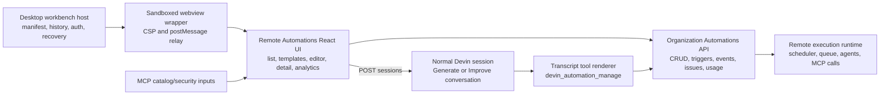
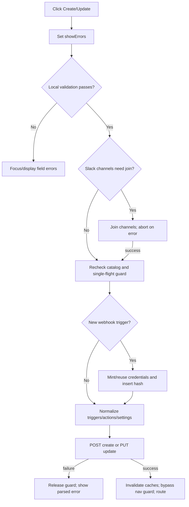
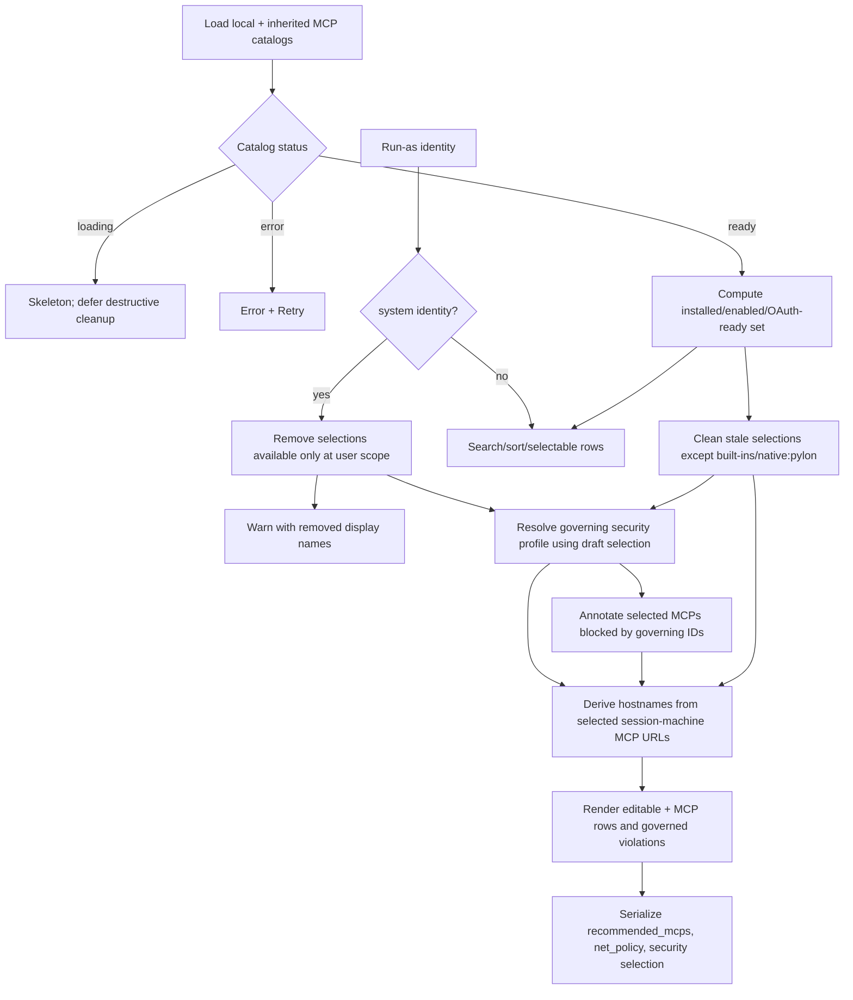
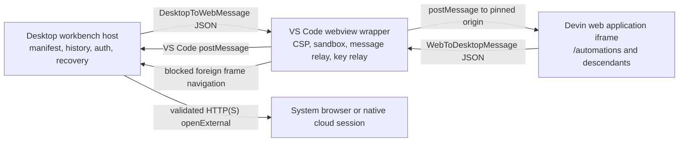

# Devin Automations 3.8.20 — decompiled implementation specification

**Document status:** exact-copy specification from the shipped Devin desktop application and its captured production Automations web bundles. Routes, fields, copy, payloads, state transitions, validation, query keys, CSS utility values, accessibility attributes, desktop bridge messages, and known limitations are mapped directly to extracted code.

**Target artifact:** Devin Desktop/Windsurf shell 3.8.20, captured 2026-09-02.

**Evidence root:** `/Users/irene/Documents/Codex/2026-09-02/new-chat/work`

**Reference root:** `/Users/irene/Documents/Automations UI/reference`

## 0. Artifact provenance and integrity

| Artifact | Location | Identity |
|---|---|---|
| Latest downloaded installer | `/Users/irene/Documents/Automations UI/reference/Devin-darwin-arm64-3.8.20.dmg` | SHA-256 `2d606a3cf77b0d7da96b68e22edd5a353731c6aec772f41e9724c83f74897a0e`; approximately 333 MB |
| Copied application | `/Users/irene/Documents/Automations UI/reference/Devin.app` | Bundle `Devin`; bundle identifier `com.exafunction.windsurf`; bundle version `3.8.20` |
| Desktop workbench bundle | `Devin.app/Contents/Resources/app/out/vs/workbench/workbench.desktop.main.js` | 46,087,384 bytes; SHA-256 `c5002d2e400a58109d65e019c5addd3fa382faadb6296f7a66d4f39f51982660` |
| Windsurf extension bundle | `Devin.app/Contents/Resources/app/extensions/windsurf/dist/extension.js` | 9,411,711 bytes; SHA-256 `e8f72433da982f2157fc98867ea5753d813bafe65c18430233c867ff1a51be68` |

The installed `/Applications/Devin.app` was already open. It was never relaunched. The copied reference application was never launched. The only live inspection used the user's already-open installed process, was read-only, and did not create, update, run, enable, disable, or delete an automation. Static analysis used the copied package and downloaded web assets.

A final read-only Computer Use accessibility snapshot on 2026-09-02 confirmed that the running process was `/Applications/Devin.app`, currently at the Automations list. It exposed the recovered All/Created-by-you filters, Search, Filter, Create automation chooser, three creation methods, Suggested categories, and template-card accessible names. No UI action was taken. The observed tenant template set remains runtime evidence, not a frozen product registry.

The evidence set contains:

- 1,801+ recursively captured production web assets under `work/evidence/web/assets/`;
- raw-asset hashes in `work/evidence/web/all-assets.sha256` and `initial-assets.sha256`;
- 61 selected, deterministically formatted Automations modules under `work/decompiled/automation/`;
- the original English Automations i18n object with 940 top-level translation keys, flattened into an exact 1,030-row leaf-value catalog;
- 21 screenshots from the already-open create route under `work/evidence/live-ui/`;
- byte-offset indexes and schemas for the desktop Automations/MCP bridge under `work/evidence/mcp/`;
- focused static audits embedded in the appendices of this document.

### 0.1 Direct rendered-dependency closure

The 61-module corpus closes five material boundaries that were formerly visible only as imports. They are part of the exact-copy source set because the Automation UI directly renders or delegates feature-specific behavior to them:

| Added exact module | Automation-owned behavior now preserved directly |
|---|---|
| `card-BnFC4Qyi.js` | Trigger-card cap, elevated shell, body, footer, description, exact radii, overlap spacing, tint, border, and text primitives. |
| `format-DkE9yMWT.js` | Event-type fallback transformation and exact `automations.eventType_*` localization-key construction. |
| `RepoSelect-DdUFSzTd.js` | Repository query/search, connection-prefix filtering, public-repository disabling, persistent selected-label cache, and single/multiple selection callback shapes. |
| `FileTree-CfQatfKe.js` | Scratch/code-step tree construction, path-prefix compaction, extension/language mapping, folder expansion, file selection/deletion, and exact loading/empty rows. |
| `rrule-DcV3ZM4v.js` | Visual recurrence parsing/defaults/validation, one-time timezone serialization, DTSTART preservation, summary generation, preset classification, and schedule restrictions. |

Every one is embedded verbatim after formatting, carries raw and formatted hashes, has a hand-authored behavior dossier, and receives an exact once-only physical-line coverage proof in `DEVIN_AUTOMATIONS_FULL_ANNOTATED_DECOMPILE.txt`.

### 0.2 Evidence labels

This document uses four labels where the distinction matters:

- **PROVEN** — literal route, string, field, constant, branch, class, request, cache key, or message schema in extracted code.
- **PROJECTED** — minimum response shape proven by properties read by the UI; the server may return additional fields.
- **DERIVED** — unavoidable behavior from proven control flow, such as AND/OR filtering or inclusive date boundaries.
- **REMOTE / UNKNOWN** — implementation exists behind a server, session runtime, feature flag, or permission provider and is not present in the client artifact.

The spec never fills a remote boundary with invented implementation. An exact-copy implementation must preserve the observable client contract exactly while supplying its own backend behind those boundaries.

## 1. Recovered product architecture

The shipped feature is a remote React web application hosted by a native Electron/VS Code shell. Direct form editing, AI-guided creation, MCP catalog management, session execution, and transcript mutation previews are separate paths joined by shared Automation identifiers and payload shapes.



### 1.1 What the client proves about “AI-guided creation”

The `Generate with Devin` and `Improve with Devin` controls do not call a special automation compiler endpoint. They create a normal Devin session, using a client-selected Devin ID, then navigate to that session. The session can expose `devin_automation_manage`, whose supported normalized actions are `list`, `get`, `create`, `validate_create`, `update`, `validate_update`, `delete`, `schemas`, `templates`, and `run`. Mutation actions receive structured transcript previews and the normal permission-event workflow.

What happens inside the session after creation—the hidden system prompt, planning loop, tool routing, possible delegation to child agents, and server validation—is **REMOTE / UNKNOWN**. The decompiled UI proves the session bootstrap and tool renderer, not an unseen “multi-agent compiler.”

### 1.2 What the client proves about sub-agents

There are two distinct concepts:

1. An Automation can contain multiple session-bearing actions in its `actions[]` array. The editor renderer numbers them `· Agent {{number}}`, lets all but the last remaining action be removed, remembers per-type drafts while switching types, allows at most one `start_session` action, and supports `message_session` actions targeting or auto-creating long-running sessions. The visible component supports multiple existing/prefilled actions even though this captured editor branch exposes no independent “add agent” button.
2. Every `start_session` action has `bypass_approval`. The Advanced switch `Allow auto-start of child sessions` writes the same boolean to every `start_session` action. When true, sessions started by this automation may spawn child sessions without per-child approval. The page exposes no child-count limit, hierarchy depth, scheduler, or child-specific security profile.

These are parallel/fan-out affordances. The number of background workers, assignment algorithm, and child-session orchestration are server/session-runtime concerns and are not in the UI bundle.

## 2. Route and surface topology

| Surface | Route/destination | Exact behavior |
|---|---|---|
| Desktop surface root | `/automations` | Manifest ID `automations`, icon key `automations`, label `Automations` |
| List | `/_user/org/$orgName/automations/` | Protected route; web links normally use `/automations` |
| Templates | `/_user/org/$orgName/automations/templates` | Protected gallery; unauthenticated state redirects `/` |
| Manual create | `/automations/create` | Blank editor route |
| Template create | `/automations/create?template=<template_id>` | Template is converted to editor prefill |
| Standard detail | `/_user/org/$orgName/automations/$id/` | Redirects code-scan items to Security and responder items to On-call |
| Standard edit | `/automations/<encoded-id>/edit` | Full editor; agent type can be locked after creation |
| Security detail/edit | `/security/automations/<id>` and `/security/automations/<id>/edit` | Shared components, restricted to `code_scan:finding` |
| On-call detail | `/oncall/<id>` | Shared detail with responder flags, hidden instructions/duplicate, alternate paths |
| Automation sessions | `/sessions?automation=<automation_id>` | Detail/menu destination |
| Error logs | `/automations/<id>/error-logs` | Capability-gated |
| MCP management | `/settings/connections?tab=mcps` | Opened in a new tab from `Manage MCPs` |
| MCP setup | `/settings/mcp-marketplace/setup/<slug>` | Setup link for recommended but unavailable connector |

Type-aware routing is part of the contract. An exact-copy implementation must not force code-scan or incident-responder automations through the standard detail shell.

## 3. Desktop host and bridge contract

### 3.1 URL construction

The common builder accepts only `http:` or `https:`, resolves routes against the configured origin, rejects cross-origin routes, and falls back to `about:blank`. For Automations it adds, in order:

```text
theme=light|dark
embedded=1
embedAuth=postmessage
nonce=<fresh value>
```

No credential is placed in the URL. VS Code `dark` and `hcDark` map to `dark`; every other theme maps to `light`.

### 3.2 Wrapper policy

The outer VS Code webview retains context while hidden and allows scripts/forms. Its generated wrapper applies:

```text
default-src 'none';
style-src 'unsafe-inline';
script-src 'nonce-<wrapper nonce>';
frame-src <approved Devin origin>;
```

The iframe is:

```html
allow="clipboard-read; clipboard-write"
sandbox="allow-scripts allow-forms allow-same-origin allow-downloads allow-popups"
```

The wrapper relays web messages only when `event.origin` equals the pinned origin. It consumes `forwardKey` locally and relays other valid objects to VS Code. Host-to-web envelopes are limited to `handshake`, `navigate`, `setTheme`, and `auth`, and are posted to the pinned origin.

### 3.3 Protocol v3 messages

Desktop-to-web envelope oneof:

| Field | Number | Payload |
|---|---:|---|
| `handshake` | 1 | `protocolVersion`, `capabilities[]`, optional `electronVersion`, `nonce`, `keyboardForwardPrefixes[]`, `allowedRoutePrefixes[]` |
| `navigate` | 2 | `path`, `search: Record<string,string>` |
| `setTheme` | 3 | `theme` |
| `auth` | 4 | `token`, optional `orgId` |

Web-to-desktop envelope oneof:

| Field | Number | Payload/meaning |
|---|---:|---|
| `publishNav` | 1 | replacement `DesktopNavManifest` |
| `activeRoute` | 2 | `path`, optional `title`, optional `replace` |
| `openExternal` | 3 | URL |
| `ready` | 4 | web `capabilities[]` |
| `forwardKey` | 5 | event type/key/code/keyCode/modifiers/repeat |
| `renderCrash` | 6 | empty payload |
| `navigateAck` | 7 | empty payload |

Host capabilities, in order: `navigate`, `activeRoute`, `setTheme`, `deliverAuth`, `forwardKeyboard`, `openExternal`, `publishNav`. Web `navigateAck` is negotiated separately through the ready payload.

### 3.4 Startup, auth, history, and recovery

```mermaid
sequenceDiagram
  participant H as Host
  participant W as Wrapper
  participant U as Web app
  H->>W: setHtml(URL + nonce); arm 20 s timer
  W->>U: load iframe
  U->>H: ready(capabilities)
  H->>U: handshake(protocol 3, nonce, routes)
  H->>H: asynchronously acquire session token
  H-->>H: mark surface ready
  H->>U: auth(devin-session-token$, optional orgId)
```

Token behavior is exact: an API key already beginning `devin-session-token$` is forwarded; otherwise the host calls `GetSelfDevinSessionToken` with `X-Api-Key` and accepts only a returned token with that prefix. Main-surface token minting is not cached in this class.

History is a per-surface `{stack:string[], cursor:number}`. `activeRoute.replace` replaces the current entry; equal paths deduplicate; a new path truncates forward history and appends. Back/forward update the cursor and send `navigate`. A cold load times out after 20,000 ms. A warm switch requests a 5,000 ms `navigateAck` only if the web advertised that capability. Crash/fatal/ack failures feed a one-attempt visible-remount state machine.

Exact host limitations are also part of the recovered contract: the wrapper checks `origin` but not `event.source`; the host does not validate inbound `activeRoute` against advertised prefixes; the inbound schema has no nonce field; unknown JSON fields are ignored; manifest TTL is stored but not enforced.

## 4. Core Automation data model

The following is the minimum client-visible domain model. Fields marked `unknown` are passed through a dedicated component/hook but their full server schema is outside this bundle.

```ts
type Automation = {
  automation_id: string
  name: string
  enabled: boolean
  triggers: Trigger[]
  actions: Action[]
  created_at?: string | null
  last_invocation_at?: string | null
  created_by?: string | null
  created_by_service_user_id?: string | null
  created_by_service_user_name?: string | null
  updated_by?: string | null
  run_as_user?: boolean
  template_id?: string | null
  creation_method?: 'manual' | 'duplicate' | string
  recommended_mcps?: string[]
  slack_tool_channels?: [workspaceId: string, channelId: string][]
  slack_dm_scope?: 'disabled' | 'org_members' | 'workspace'
  linear_tools_enabled?: boolean
  scratchpad_enabled?: boolean
  max_acu_limit?: number | null
  invocation_limit?: number | null
  invocation_limit_window_seconds?: number | null
  max_concurrent_runs?: number | null
  max_queue_depth?: number | null
  devin_mode?: string | null
  net_policy?: unknown | null
  tags?: Record<string,string>
  secure_mode_selection?: 'inherit' | 'disabled' | 'profile' | null
  secure_mode_profile_id?: string | null
}

type Trigger = {
  event_type: string
  conditions: Condition[][]
  replies: Reply[]
  [additionalServerField: string]: unknown
}

type Condition = {
  field: string
  operator: string
  value?: unknown
}

type Reply = {
  type: 'post_response' | 'attach_thread' | 'notify_thread' | string
  to?: {channel_id?: string}
}

type StartSessionAction = {
  type: 'start_session'
  prompt: string
  bypass_approval?: boolean
  tags?: string[]
  playbook_id?: string
  repos?: string[]
  slack_channel_id?: string
  slack_thread_mode?: 'notify' | 'attach' | 'forward' | 'post_response' | null
}

type MessageSessionAction = {
  type: 'message_session'
  prompt: string
  target_devin_id?: string
  auto_create?: boolean
}

type MonitorSessionAction = {
  type: 'monitor_session'
  setup_prompt: string
  playbook_id?: string
  repos?: string[]
  slack_monitor_config: {source_channel_id: string; team_id?: string}
}

type TriageSessionAction = {
  type: 'triage_session'
  setup_prompt: string
  repos?: string[]
  slack_config: {source_channel_id: string}
}

type OtherVisibleAction =
  | {type:'remediate_finding'}
  | {type:'scan_new_commits'; scan_id:string}
  | {type:'notify'; when:'always'|'failure'|'success'}
  | {type:'incident_session'; [key:string]:unknown}

type Action =
  | StartSessionAction
  | MessageSessionAction
  | MonitorSessionAction
  | TriageSessionAction
  | OtherVisibleAction
```

### 4.1 Condition normalization before save

- Remove triggers without `event_type`.
- Empty `replies` unless at least one `start_session` action exists.
- For `operator === 'globs'` with an array, stringify and trim each value; remove blanks.
- Remove conditions without `field`.
- Preserve `_webhook_*` and `is_empty` conditions even without a value.
- Remove other null, undefined, empty-string, and empty-array conditions.
- Remove empty condition groups but preserve the two-dimensional OR-of-ANDs structure.

### 4.2 Action normalization before save

- `start_session`: retain prompt, mentions-derived `playbook_id`/`repos`, tags, `bypass_approval`, and modern Slack fields; clear legacy `slack_team_id`.
- `message_session`: `auto_create` defaults false; omit `target_devin_id` when auto-create is enabled.
- `monitor_session`: strip `target_devin_id`; reduce Slack config to its selected source channel.
- `triage_session`: strip `target_devin_id`; reduce Slack config to source channel.
- Reply modes stored on triggers are converted against the `start_session` Slack mode. `notify_thread`, `attach_thread`, and `post_response` are not merely presentation labels.

## 5. Organization Automations API

All paths are relative to the authenticated organization API base. Repeated filters use repeated query keys, never CSV.

| Operation | Method/path | Exact client construction |
|---|---|---|
| Sparklines | `GET /automations/sparklines` | `days`, default 30 |
| Tags | `GET /automations/tags` | optional `scope` |
| Templates | `GET /automations/templates` | no parameters |
| Linear access | `GET /automations/linear-user-access` | no parameters |
| List | `GET /automations` | optional `creator_id`, `search`, repeated `event_type` |
| Read | `GET /automations/<id>` | no parameters |
| Create | `POST /automations` | create object in §15 |
| Update | `PUT /automations/<id>` | update object and clear flags in §15 |
| Delete | `DELETE /automations/<id>` | client parses JSON |
| Issues | `GET /automations/<id>/issues` | no parameters |
| Consumption | `GET /automations/<id>/consumption` | optional `since`, `until` |
| Read scratch | `GET /automations/<id>/scratch/bundle` | binary + `X-Scratch-Version-Id` |
| Write scratch | `PUT /automations/<id>/scratch/bundle` | multipart bundle/context; optional `parent_version_id` |
| Reset monitor | `POST /automations/<id>/reset-monitor` | no body |
| Regenerate webhook | `POST /automations/<id>/webhook/regenerate-secret` | no body |
| Mint webhook | `POST /automations/webhook/mint-credentials` | optional `automation_id` query |
| Manual run | `POST /automations/<id>/trigger` | omit body if prompt falsy, else `{prompt}` |
| Invocations | `GET /automations/<id>/invocations` | limit/offset, dates, repeated status, message flag, issue ID |
| Events | `GET /automations/<id>/events` | limit/offset, dates, repeated status, message flag |
| Preflight config | `GET /automations/<id>/code-step/config` | no parameters |
| Delete Preflight state | `DELETE /automations/<id>/code-step/state` | client parses JSON |
| Preflight run | `GET /automations/<id>/code-step/runs/<runId>` | no parameters |

### 5.1 Query/cache identities

| Data | Query identity | Gating/freshness |
|---|---|---|
| Detail | `['automation', orgId, id]` | org + id; retry max 3 except 403/404 |
| List | `['automations', orgId, creatorId, search]` | 30 s stale |
| Code-scan list | `['automations', orgId, 'code_scan:finding', search]` | 30 s stale |
| Invocations | full request tuple | no explicit stale interval |
| Events | full request tuple | poll only while any row queued/running |
| Sparklines | `['automation-sparklines', orgId, days]` | org gated |
| Tags | `['automation-tags', orgId, scope]` | 30 s stale |
| Templates | `['automation-templates', orgId]` | org gated |
| Preflight config | `['automation-code-step/config', orgId, id]` | org + automation |
| Preflight run | `['automation-code-step-run', orgId, id, runId]` | 1.5 s until terminal/cutoff |
| Issues | `['automation-issues', orgId, id]` | 30 s stale |
| Consumption | `['automation-consumption', orgId, id, since, until]` | 30 s stale |
| Scratch bundle | `['automation-scratch-bundle', orgId, id]` | 30 s stale |
| Security resolution | org + automation + draft selection + draft profile | 30 s stale; refetch on focus |

### 5.2 Mutation consistency

- Create invalidates list, tags, and the shared/global automation key.
- Full update invalidates list, detail, tags, all resolved-security queries, and this automation's Preflight config.
- Delete invalidates list, tags, and the shared/global key.
- Reset monitor invalidates list/detail; webhook regeneration invalidates detail.
- Manual trigger has a local re-entry guard and invalidates invocations, events, list, detail, sparklines, and On-call org stats.
- Enabled toggles cancel exact detail/On-call detail/all organization list queries, snapshot old values, optimistically update every matching cache, restore on error, and coordinate final list invalidation with other pending toggles so one refetch cannot clobber another row.

---

## 6. Automations list

### 6.1 Assembly and toolbar

The page merges two automation query results, removes objects matching the shared exclusion predicate, and treats either query error as the list error. The second query is runtime-gated. The stable visible header is `Automations` plus `Bring Devin into your recurring and event-driven workflows`.

Toolbar order and conditions:

1. `All <total>` and `Created by you <count>` tabs. Mine is exactly `created_by === currentUserId`.
2. Collapsible search; initial URL `q` keeps it open. Platform-modified `F` opens/focuses it unless a dialog is open or focus is in another editable control.
3. Metadata filter icon; selected count appears in a blue badge and selected pairs become removable chips.
4. Capability-gated analytics link.
5. Management-gated `Create automation` split button with `Generate with Devin`, `Manual`, and `Template`.

The page writes `{tab,q,tags}` through router replacement, not history pushes. URL form is:

```text
?tab=mine
&q=<search>
&tags=<encode(key)>:<encode(value)>,...
```

`all`, empty search, and empty tags are omitted. Malformed or empty decoded tag pairs are discarded.

### 6.2 Filtering

Text search is trimmed, case-insensitive substring OR over:

- automation name;
- resolved creator name;
- resolved monitor-channel display label;
- any optional caller-supplied search text (none on the main page).

Metadata selection is OR within a key and AND across keys. Facet counts for key K ignore the current selections for K while retaining all other key filters. Selected values remain visible even when their current count is zero. Reserved keys hidden from filters and display chips are `oncall_responder`, `oncall_digest`, `oncall_incident`, and every key beginning `oncall_report:`.

Filter popover details: 280px wide, searchable, values area max-height 320px. Search matches a key or values within it. Color assignment cycles blue, green, orange, purple, red by first-seen key. Empty copy is `No metadata yet` plus its Advanced-settings explanation; unmatched search is `No matching metadata`.

### 6.3 Sorting and pagination

Default ordering:

1. enabled before disabled;
2. newer `last_invocation_at` first, missing treated as epoch zero;
3. newer `created_at` first as tie-breaker.

Sortable columns are `Name` and `Last triggered`; each click cycles ascending → descending → no explicit sort. `Last 30 days` is not sortable. Clearing sort restores the default comparator. Local pagination is 50 after tab/search/tags/sort; changing any filter identity resets page zero and shrinking results clamps the page. Footer appears only above 50 and displays `{{from}}–{{to}} of {{total}}`, Previous, and Next.

### 6.4 Table and row contract

The shell is an elevated rounded secondary-border card. Columns:

| Column | Content | Width |
|---|---|---:|
| Name | source icon, name, badges, creator/channel subtitle | flexible |
| Last 30 days | 31-bucket activity sparkline | 91px |
| Last triggered | relative time or em dash | 100px on this page |

The actual main-page instantiation passes `canManage=false` and `hideActions=true`; it has no row overflow menu. The whole row links to the type-aware detail route. Known trigger source adds a glyph. Name is 13px medium, one-line clamped, and gets a tooltip only when truncated. Badges: `Disabled` when false and `Personal` when `run_as_user`. A monitor adds `creator · <channel>`.

Sparkline behavior: null on missing/error, a 91×20 skeleton while loading, flat centerline for all-zero buckets, otherwise normalize to the maximum bucket with 1px inset and 1.5px rounded stroke. Gradient is light `#93C5FD → #3B82F6`, dark `#1E40AF → #4489FF`. Last-triggered uses `now`, minutes, hours, days, weeks, months, or years and an absolute tooltip; never is `—`.

### 6.5 Creation entry states

When no source automations exist and the user can manage, render three cards:

- Generate with Devin — blue highlighted, dotted radial decoration, `Most popular`.
- Manual — `Less common`.
- Template — `Less common`.

They form a three-column grid from `sm`, with rounded-xl cards, icon tile, 13px title, 12px description, and arrow footer. Frozen spending disables relevant entry points and applies the common tooltip.

Suggested templates render below with the same card component, All + four categories, six skeletons, and a 2/3-column responsive grid.

Other states are distinct: initial four-row skeleton; stale-data alert above rows; full centered error without rows; `No automations match these filters` plus Clear all; `No matching automations`; and `No automations yet` for non-managers.

### 6.6 First-use introduction

The `automations-intro` modal is max 980px, min-height 540px, 2/5 text column with minimum 360px, and a textured visual panel. Its four `aria-pressed` steps are:

1. Event-based triggers.
2. Scheduled triggers.
3. Persistent Memory.
4. Customization.

Footer is `Maybe later` and `Next`, with `Done` on step four. Pagination dots use step titles as ARIA labels; illustration motion is guarded by `motion-safe`.

## 7. Template gallery

### 7.1 Template projection and availability

```ts
type AutomationTemplate = {
  template_id: string
  name: string
  description: string
  category: string
  tags: string[]
  icon: string
  triggers: Trigger[]
  actions: Action[]
  required_integrations: string[]
  required_mcps: string[]
  suggested_limits?: {
    max_acu_limit?: number | null
    invocation_limit?: number | null
    invocation_limit_window_seconds?: number | null
  }
}
```

Before render, remove a template when a required integration is exactly `disconnected` or a trigger is in the runtime unsupported-trigger set. A missing MCP does not remove the card; it lowers readiness ordering. If connection loading fails, server templates pass through unfiltered; while still loading, the query remains loading.

The current template inventory is server data and cannot be extracted truthfully from this client. The renderer and processing algorithm are fully recovered.

### 7.2 Categories, sort, and search

Fixed order: All; Monitoring & Triage; CI/CD & Release; Security; Project Management.

Normalization:

| Server category | UI group |
|---|---|
| Monitoring & Triage, Monitoring, Triage | monitoring |
| CI/CD & Release, CI/CD, Maintenance, Code Quality | cicd |
| Security | security |
| Project Management | pm |
| unknown | cicd fallback |

Stable sort places unused before already-used template IDs, then fully connected/installed requirements before missing requirements, then preserves server order. Counts are computed from the full availability-filtered set before text search. All groups results under nonempty fixed-order headings; a category tab uses one flat grid.

Search starts collapsed and opens a 192px input. Escape clears/closes; blur closes only if trimmed empty. Split the lowercase query on whitespace, and require every token to occur somewhere in the combined name, description, category, tags, required integration slug/display name, or required MCP slug/display name. Category filtering composes after search.

### 7.3 Card

Card link is `/automations/create?template=<id>`. It is min-height 126px, rounded-xl, secondary border, elevated background, `p-4`, with hover primary-border/wash. Content is a 16px icon and 13px medium title, 12px two-line-clamped description, then 11px requirement chips.

Icon priority: first trigger integration glyph; otherwise template icon key `ci`, `alert`, `health`, `bug`, `support`, `test`, `package`, `document`, `monitor`, or `security`; unknown falls back to `ci`, then broom if the factory is nullish.

Known integration chip labels: GitHub, Slack, Linear, Jira, Pylon. Known MCP labels: Sentry, Datadog, Stripe, SonarQube, CircleCI, Metabase, Cloudflare, Asana, Notion, Figma, Jira/Atlassian, Jam, HubSpot. Unknown slug renders raw without logo.

Grid is two columns, three at `lg`; loading uses six shape-matched skeletons. Errors use `role=alert`, linked Retry, and preserve cached cards. Empty copy distinguishes a nonempty search from no templates.

## 8. Create/edit editor lifecycle

### 8.1 Page frame and initial values

The editor is a stable-gutter vertical scroller with centered `max-w-[800px] px-3 py-[28px]`. A sticky action bar exposes Cancel and primary Create/Update. Main content is `gap-6`. While save is active the form is `inert` and `aria-busy=true`.

Create defaults visible in code:

```ts
name = ''
triggers = [{event_type:'', conditions:[]}]
actions = [{type:'start_session', prompt:'', bypass_approval:true}]
max_acu_limit = null
invocation_limit = productDefault
invocation_limit_window_seconds = 3600
max_concurrent_runs = null
max_queue_depth = null
devin_mode = null
recommended_mcps = new Set()
linear_tools_enabled = true
scratchpad_enabled = true
network policy = normalized default/null
```

Template and duplicate prefill can replace these. `sessionStorage['automation-prefill']` is consumed once, parsed through a schema, removed immediately, and rejected if `staged_at` is older than 120,000 ms. A template maps required MCPs into `recommended_mcps`, carries triggers/actions/suggested limits/template ID, and identifies the creation method.

Code-scan triggers auto-add the required Sentry/native connector identifier used by the bundle; removing the trigger removes it. Duplicate prefill drops Slack channel permissions no longer available to the user and preserves the wildcard pair.

### 8.2 Top-level section order

1. Name input (`h-[38px]`, 17px medium).
2. Triggers header, Add trigger picker, warnings, and trigger cards.
3. Agent definition card(s), with mode/run-as/MCP controls appended to the last agent card.
4. Notifications.
5. Advanced accordion.
6. Unsaved-navigation confirmation.

Advanced starts open in this captured create component. When collapsed, ordinary content unmounts; Preflight can request `keepMounted` while dirty, editing, or saving.

### 8.3 Dirty state and navigation guard

Every mutation wrapper sets `automationDirty`. Preflight separately reports local draft/script/secret changes. Navigation blocks when automation dirty or Preflight dirty, unless a save is in progress or navigation was explicitly bypassed after success. Browser before-unload uses the same predicate.

Blocked navigation opens:

- title `Discard unsaved changes?`;
- body from `automations.discardDescription`;
- confirm `Discard`;
- cancel `Cancel`;
- no close button.

Edit performs canonical comparisons of name, normalized triggers/actions, limits, MCP selections, Slack permissions, Linear setting, scratchpad, mode, run-as, network policy, metadata, and security draft. Set-like values are normalized before equality. The update button remains disabled when no meaningful diff or while required remote catalogs are unresolved.

### 8.4 Save gating and error presentation

Create/update is disabled for pending API mutation, child side-effect work, invalid spend value, structural validation, spending frozen, incomplete MCP catalog, unminted webhook credentials, or incomplete metadata after errors have been revealed. Clicking save sets `showErrors`; invalid cards receive a destructive ring.

MCP catalog availability is a hard pre-save gate. A tooltip explains why saving is unavailable. A single-flight helper prevents double saves even if state changes between validation and the request. Monitor create also checks whether another enabled automation already monitors the same Slack channel or workspace/channel key.

After successful create, routing is type-aware: Security for code scan; edit with `show_info=1` for the first applicable monitor; standard detail otherwise. Update can show a network-change confirmation for a monitoring Devin because changing network settings sleeps/re-wakes it.

## 9. Trigger editor

### 9.1 Source and event inventory

The static source label map is:

```text
github, gitlab, slack, linear, jira, pylon, incident_io,
schedule, webhook, code_scan, snapshot_build
```

The event schema itself is runtime data. The bundle contains direct handling/copy for at least:

```text
github:push
github:check_run
github:pull_request
github:pull_request_review
github:pull_request_review_comment
github:issues
github:issue_comment
gitlab:push
gitlab:pipeline
gitlab:merge_request
gitlab:note
gitlab:issue
slack:message
slack:reaction_added
linear:assigned
linear:create
linear:label_added
linear:moved
linear:priority_changed
linear:status_changed
jira:assigned
jira:issue_created
jira:issue_updated
jira:label_added
jira:status_changed
pylon:issue_created
pylon:issue_tag_added
pylon:issue_status_changed
incident_io:status_changed
incident_io:severity_changed
schedule:recurring
schedule:one_time (picker pseudo-type; persisted through recurring/RRULE form)
webhook:incoming
code_scan:finding
snapshot_build:completed
```

Do not hard-code this as exhaustive; normal integration events/fields/operators come from `useEventSchemas` and connection/capability inputs.

The live connected route's root Add trigger menu was GitHub, Schedule, Webhook, Security scan, Snapshot build. Its GitHub submenu was Issue comment, Issue, Pull request, PR review, PR review comment, Check run, Push. Schedule was Every hour, Every day, Every week, Run once, Custom schedule. Other sources appear only when runtime schemas/connections make them available.

### 9.2 Default conditions

Changing event type replaces conditions with deterministic defaults where defined:

| Event | Initial condition |
|---|---|
| `github:pull_request` | action equals opened |
| `github:issues` | action equals opened |
| `github:issue_comment` | action equals created |
| `github:pull_request_review` | action equals submitted |
| `github:pull_request_review_comment` | action equals created |
| `github:check_run` | action equals completed |
| `gitlab:merge_request` | action equals open |
| `gitlab:issue` | action equals open |
| `gitlab:pipeline` | status equals failed |
| `code_scan:finding` | severity in critical, high |
| `pylon:issue_tag_added` | tag_ids equals empty placeholder |
| `pylon:issue_status_changed` | status_slug equals empty placeholder |
| `jira:status_changed` | data.status.name equals empty placeholder |
| `incident_io:status_changed` | new_status equals empty placeholder |
| `incident_io:severity_changed` | new_severity equals empty placeholder |

Changing within the same integration generally preserves compatible replies but resets conditions. Restricted event types can be disabled with a lock tooltip. Duplicate trigger types are disabled for singleton sets such as incoming webhook.

### 9.3 Condition model and card behavior

`conditions` is an OR of AND groups. The UI resolves schema field definitions and operator/value editors dynamically. Required schema fields produce save errors. `is_empty` needs no value. Array glob values are edited as lists. Fields with schema types already present in the first group can be removed from Add Condition availability where duplicates are invalid.

Each card is rounded 10px, secondary border, elevated background, `p-2.5 pl-3.5`. Editable cards show the event picker and remove affordance. Read-only cards replace editors with source icon/name and formatted conditions. Initial schema/Slack-label load uses per-card skeletons; refetch does not revert after the first resolved load.

Warnings and connection actions remain visible even in read-only form: GitHub App/webhook requirements, public repository restrictions, GitLab public-project warning, Linear mapping, integration Connect/Configure, schedule-plan restrictions, Pylon/incident requirements, and Slack channel availability.

### 9.4 Schedule

Convenience pickers all persist as `event_type:'schedule:recurring'` plus an `rrule` condition. Hour options are 00–23. Standard minute options are five-minute increments 00–55. Timezone is a searchable IANA-derived list; the live control exposed 419 labels in `(<GMT offset>) <long name> - <city>` form.

Preset editor supports hourly, daily, weekly, custom, and one-time. Schedule validation requires nonblank RRULE and a future instant for one-time schedules. The shipped sub-hourly entitlement branch is exact: enterprise always passes; a null or undefined plan slug fails; known `free`, `pro-trial`, and `pro` slugs fail; known `teams-v2` and `max` slugs pass; and any unknown non-null slug also passes because an undefined rank is explicitly accepted. This final case is a literal fail-open client branch, not a recommended authorization policy (`JitteredScheduleTimeSelect-BSFBBNau.js:10-15,26-33`).

The custom RRULE popover is 340px and has Visual/RRULE modes. Visual frequencies are MINUTELY, HOURLY, DAILY, WEEKLY, MONTHLY. It supports interval ≥1; weekday toggles that never allow zero selected; month day 1–31; hourly minute 0–59; and hour 0–23/minute 0–59 for slower frequencies. Custom mode is a three-row monospace textarea with placeholder `FREQ=WEEKLY;BYDAY=MO;BYHOUR=9;BYMINUTE=0`, UTC hint, validation message, and Apply.

### 9.5 Webhook

Adding incoming webhook begins credential minting. The client receives `{automation_id, webhook_secret, webhook_secret_hash}`. URL is:

```text
<window.location.origin>/api/webhooks/automations/<orgId>/<automationId>
```

Only the hash is inserted as `_webhook_secret_hash` with `matches`; plaintext is shown once. Optional payload regex uses `_webhook_body_regex`. The UI supplies a copyable cURL template and states the secret can be sent through `X-Webhook-Secret`, `Authorization: Bearer`, or `secret` query parameter. Removing the last webhook clears the pending credential state. Regeneration returns at least `webhook_secret` and invalidates detail.

### 9.6 Code scan and Slack special modes

Code scan reads/writes `max_findings_per_scan` as an `lte` condition, default display 50, minimum clamp 1. Selecting it can change the agent-type options to include Remediate and forces its associated connector selection.

Watch channel is a picker pseudo-type converting to `slack:message` and a `monitor_session`; it forces Slack tools and source-channel identity. Triage similarly requires a Slack Message trigger. Monitor/triage validation requires exactly one action, all triggers Slack Message, and the action source channel equal to the trigger channel. Channel uniqueness is checked against other enabled monitor automations before create.

The trigger module's initialized constants are literal implementation data, not illustrative values (`TriggerEditor-D8VGRxC1.js:2349-2403`):

| Compiled symbol | Exact value | Consumer and payload/UI effect |
|---|---|---|
| `Hn` | `Set(["webhook:incoming"])` | Singleton-event set; disables adding another incoming-webhook trigger and participates in duplicate filtering. |
| `Un` | `[]` | Shared empty fallback when the source-specific derived condition list is unavailable. |
| `Wn` | `Set(["github","gitlab","jira","linear"])` | Sources eligible for the cross-product reply-mode logic. |
| `Gn` | `Set(["github:push","github:check_run","gitlab:push","gitlab:pipeline"])` | Event types excluded from same-source preservation/reply behavior. |
| `Kn` | GitHub PR, PR-review, and PR-review-comment event set | Selects GitHub reply defaults. |
| `qn` | `Set(["gitlab:merge_request","gitlab:note"])` | Selects GitLab reply defaults. |
| `Jn` | `"__reply__"` | Synthetic menu sentinel; choosing it mutates reply objects rather than serializing an ordinary schema condition. |
| `Xn` | PR→`opened`, issues→`opened`, issue-comment→`created`, PR-review→`submitted`, PR-review-comment→`created`, check-run→`completed`, GitLab merge-request→`open`, GitLab issue→`open` | Supplies initial event-action condition values for those event types. |
| `Zn`, `Qn` | `"max_findings_per_scan"`, `50` | Code-scan condition field and default displayed maximum; writes an `lte` condition. |
| `$n` | `"_webhook_body_regex"` | Reserved incoming-webhook body-regex condition field. |
| `er` | `{value:"slack:monitor", labelKey:"automations.triggerWatchChannel"}` | Virtual Watch-channel picker item; converted to a real Slack-message trigger plus monitor state. |
| `tr` | Hourly, Daily, Weekly, Custom in that order | Recurring schedule submenu order and labels. |
| `nr` | `{value:"schedule:one_time", labelKey:"automations.scheduleRunOnce"}` | Virtual Run-once menu item inserted between Weekly and Custom. |
| `rr` | Set of the four `tr` values | Recognizes recurring schedule pseudo-types. |
| `ir` | Monday `1`, Tuesday `2`, Wednesday `3`, Thursday `4`, Friday `5`, Saturday `6`, Sunday `0` | Exact weekday option order and numeric serialization. |
| `ar` | `"__org_wide__"` | incident.io organization-wide selector sentinel; serializes the special empty-team condition instead of a team ID. |

### 9.7 Reply behavior

For supported GitHub/GitLab/Jira/Linear events, a start-session action can add `post_response`; for ordinary Slack events the default compatible reply is `attach_thread`. Slack modes convert among action fields and trigger replies:

| UI behavior | Persisted representation |
|---|---|
| attach triggering thread | `attach_thread` reply and cleared action Slack mode |
| notify thread with session link | `notify_thread` reply and cleared action Slack mode |
| post final response | `post_response` reply and/or `slack_thread_mode:'post_response'` according to source |
| forward/post updates to a chosen channel | action `slack_channel_id` plus mode |

Switching event source filters incompatible replies; changing action reply mode backfills eligible triggers without an existing reply. The reply UI labels vary by source: on thread, comments on PR, comments on merge request, or comments on issue.

---

## 10. Agent definition and action editor

### 10.1 Agent types and conversions

User-facing agent types map to persisted actions:

| UI choice | Action | Availability/behavior |
|---|---|---|
| Start new session | `start_session` | one per automation; fresh session per trigger |
| Message existing session | `message_session` | target an ID or auto-create a long-running destination |
| Auto-triage | `triage_session` | enabled only with Slack Message trigger and feature input |
| Remediate | `remediate_finding` | prepended for code-scan finding mode |
| Incident | `incident_session` | locked/read-only product-specific path |

Switching agent type preserves the current prompt. The renderer keeps per-type drafts in a ref so switching back can restore fields. Switching from start session to message session defaults `{target_devin_id:'', auto_create:true}` in the top-level agent-definition path. Switching back defaults `bypass_approval:true`. Remediate has no prompt field.

After creation, non-session agent types can be locked. Exact messages tell the user to duplicate the automation to change type. Auto-triage explains its Slack Message requirement; Watch-channel mode locks alternatives; a second new-session choice is disabled with `An automation can have only one New session agent`.

### 10.2 Multiple actions

All `start_session`, `message_session`, and `remediate_finding` actions become primary agent cards. If more than one is present they display `· Agent N`. Removal is available only when more than one card exists and can be disabled by the post-create lock. Non-primary persisted actions are rendered below at reduced opacity through the generic action renderer.

The bundle's action-array renderer faithfully displays and edits multiple actions, but this editor composition does not expose an “Add agent” control. Multiple entries can arrive through loaded data, templates, duplication/prefill, or AI tool mutation. An exact-copy implementation should preserve array multiplicity even if it matches the captured manual-entry surface and omits an add button.

### 10.3 Prompt editor and mention hydration

Prompts use a rich mention-capable editor, not a plain textarea. Its visible plain text remains the action prompt, while mention parsing/hydration loads applicable repositories, playbooks, skills, plugins, macros, secrets, Devin sessions, and tickets. Repo/playbook mentions are projected into explicit `repos` and `playbook_id` action fields. Removed path mentions remove corresponding legacy repos unless still present in the new rich content.

The editor is scrollable, minimum 120px and maximum `max(250px,30vh)`, 13px text. Read-only action panels preserve whitespace and render `No prompt`/`No starting instructions` when empty. Start-session actions can additionally require an allowed session tag; missing configuration or selection is a save-visible warning.

### 10.4 Message-session destination

The destination combobox accepts a session ID or a `/sessions/<id>` path and normalizes it to the canonical Devin identifier. A pinned option `Create new session` sets `auto_create:true` and clears the target. Clearing sets both empty/false. Read-only detail links the selected session after removing the `devin-` prefix for route construction.

### 10.5 Mode and identity

Agent-mode choices are filtered by enabled product versions and always include Normal plus the current saved mode. Order is `Org default`, Normal, Fusion, Fast, Lite, Ultra. The live descriptions were:

- Org default — follows the organization default and updates if it changes.
- Normal — fast and good at long-horizon planning.
- Fusion — frontier intelligence with cost-efficient execution.
- Fast — 2.5× faster, 2× more expensive, same intelligence.
- Lite — tuned for smaller defined tasks, 60% cheaper.
- Ultra — most powerful/hardest thinking, significantly more expensive.

`Org default` serializes as `devin_mode:null`; named options serialize their value. Incident mode uses a separate product default/current constraint.

Run-as values are `System User` → false and `Creator (you)` → true. Product/permission hooks can force Creator and disable the selector. The run-as user ID is also passed into allowed-tag and mention behavior.

Switching from Creator to System automatically removes selected MCP installations that are user-scoped when no non-user installation with the same slug exists. If the MCP catalog is incomplete, pruning is deferred until it becomes complete. Removed connector names are displayed in an orange warning. This is a UI security invariant, not cosmetic behavior.

## 11. MCP, Slack, Linear, and network-tool selection

### 11.1 Catalog composition

The editor fetches organization installations from `GET mcp/servers` and applicable inherited enterprise installations from `GET mcp/enterprise-servers`, projects inherited entries to the same model, then concatenates local before inherited. Any source error produces catalog `error`; missing local data or loading inheritance produces `loading`; only both complete produces `ready`.

A server is normally usable when installed and enabled, and an OAuth server additionally has tokens and no invalid refresh state. A selected installed/enabled OAuth entry remains visible even if its auth is currently incomplete, allowing the user to see/resolve the saved choice. Recommended but unavailable servers form a separate Setup list.

### 11.2 MCP control anatomy

The section is a rounded 10px secondary-border group. Header is 42px and contains select-all/indeterminate checkbox, search icon/input `Search MCPs...`, and `N selected`. Body max-height is 265px.

Ordering after text filter:

1. ordinary entries before slugs that should use a built-in replacement;
2. recommended selected/available entries before nonrecommended;
3. alphabetic by display name for ties.

Search is case-insensitive substring on display name only. Select-all applies only to currently filtered selectable MCP rows. Unknown selected slugs are pruned once a complete catalog arrives, except known built-ins such as `native:pylon`.

Each row has checkbox, icon, name, and badges/tooltips as applicable:

- `Suggested` when its slug is in template recommendations;
- `Not recommended` and a tooltip for MCP slugs `linear`, `slack`, or `slack-remote`, because built-ins should be used;
- `Blocked` when the governing security profile does not allow any of the installation ID, marketplace server ID, or server ID;
- creator-only warning/disabled state for a user-scoped installation while Run as System;
- Setup button linking to `/settings/mcp-marketplace/setup/<slug>` when recommended but not installed/enabled.

Catalog loading uses three 34px skeleton rows. Error shows copy plus Retry that refetches local and inherited caches. Empty distinguishes no available MCPs from no name matching the query. Document visibility returning to visible invalidates both catalogs. The external Manage MCPs button goes to settings.

### 11.3 Governing-profile intersection

The resolved security response may supply `governing_mcp_server_ids`. A selected native ID must occur literally. A selected catalog slug is permitted when at least one of its `installation_id`, `marketplace_server_id`, or `server_id` appears. Disallowed saved/selected values remain visually selected but acquire Blocked status and a bottom warning with governing profile name when available.

### 11.4 Built-in Slack

Slack is a built-in row, force-enabled for monitor/triage. Turning it off clears channel pairs and disables DMs. Turning it on chooses the locked trigger channel if private; otherwise defaults to wildcard `[['*','*']]`, and enables DMs where the caller provides that control.

Access modes are all public channels or specific channels. Private locked trigger channels disable the public choice and are always retained. Specific-channel values are `[workspace_id, channel_id]`; duplicate names append workspace name. Search matches `#channel` or workspace. A selected trigger channel is disabled and labeled `Trigger channel` so it cannot be removed.

The summary resolves to `All public channels`, `N channels`, `DMs only`, or `No access`, with DM variants. Enterprise UI can restrict channels by org mapping and offers a mapping configuration link only to permitted users. DMs serialize as:

```text
disabled                  when Slack tools or DM toggle is off
org_members               when enabled in enterprise context
workspace                 when enabled otherwise
```

For monitor create/update, the source channel is injected into the serialized list unless wildcard or the exact pair already covers it.

### 11.5 Built-in Linear and Pylon

Linear appears only when its integration is connected and no text search is active; its toggle serializes `linear_tools_enabled`, default true. `native:pylon` appears when Pylon is connected or already selected, is labeled `Pylon (read-only)`, and participates in governing-profile blocking.

### 11.6 Network entries derived from MCPs

Selected MCP servers that have a URL, are not disabled, and execute on the session machine contribute read-only hostname entries to the network-policy display. The hostname is parsed with `new URL(server.url).hostname`. Governing policy can mark both user entries and MCP-derived entries blocked.

The client proves catalog selection, identity safety, profile intersection, and payload IDs. It does not contain the runtime MCP transport, tool-call router, credential injection boundary, or sandbox process manager.

## 12. Notifications

The header is `Notifications` / `Alert when the automation run completes`, plus Add notification unless read-only.

### 12.1 Email

At most one `{type:'notify',when}` action is created. Add defaults `when:'always'`; once present, the menu item is disabled. Timing values are exactly `always`, `failure`, `success`, displayed Always, On failure, On success. Row has timing select and Remove.

### 12.2 Slack response destination

Slack notification is not a separate generic action. It modifies the first `start_session` with `slack_channel_id` and `slack_thread_mode`. The Add notification submenu uses the built-in channel picker. For triggering Slack events, selecting a channel can map a previously thread-oriented/default mode to `post_response`. Removing clears channel, legacy team ID, and mode.

The summary row resolves exact variants such as `Post agent response to <channel>`, `Post session updates to <channel>`, or the chosen thread mode. Trigger replies and action Slack fields are reconciled by the normalizers in §9.7.

## 13. Advanced editor

### 13.1 Child sessions

Show only when at least one `start_session` action exists. Switch checked when any start action has `bypass_approval`; toggling writes the same value to every start action. Exact description: `Sessions can spawn child sessions automatically without your approval`.

This is the only direct form control governing agent-to-child-session fan-out. No maximum children, depth, or per-child approval policy is exposed.

### 13.2 Shared scratchpad

Create always sends `scratchpad_enabled:true` unless a prefill explicitly says false, so the create Advanced surface does not show the toggle. Edit shows `Shared scratchpad`, Browse files, and a switch. Triage and incident actions force it on and disable the switch.

Browse opens an 80vh × 90vw modal capped at 1100px and lazy-loads a file-tree/editor. It supports new file, new folder, delete file/folder, path selection, text editing, binary non-preview state, unsaved badge, and Save changes. Empty states distinguish no files and read-only. Top-level readme detection is case-insensitive `^readme(\.|$)`.

Transport is a versioned git bundle, not JSON CRUD:

- GET reads bytes and `X-Scratch-Version-Id`; 204 means no bundle; 413 means `tooLarge` with version retained.
- Parsed files expose `{path,content,isBinary,sha,created,modified}`.
- Save builds a git bundle, multipart part `bundle` with filename `bundle`, and part `context`/`context.json` containing `{readme,file_tree}`.
- PUT includes `parent_version_id` when known and invalidates the scratch query.

### 13.3 Security profile

Local states encode as:

| Local | Update fields |
|---|---|
| inherit/null | `secure_mode_selection:'inherit'` |
| none | `secure_mode_selection:'disabled'` |
| profile | `secure_mode_selection:'profile'`, optional profile ID |

Unchanged security selection emits no security fields on update. The resolved-profile query key includes automation ID plus draft selection/profile, is stale 30 seconds, and refetches on focus. Validated minimum response:

```ts
type ResolvedSecurity = {
  resolved_default: {secure_mode_profile_id:string; name:string; is_default:boolean} | null
  governing_profile_name?: string | null
  governing_scope?: 'enterprise'|'org'|'automations_default'|'automation'|null
  governing_profile_scope?: 'enterprise'|'org'|null
  governing_has_net_policy: boolean
  governing_net_policy?: {allow:({hostname:string}|{ipv4:string}|{ipv6:string})[]} | null
  governing_mcp_server_ids?: string[] | null
  governing_unresolved: boolean
}
```

The control supports organization default with resolved name/none wording, None, scoped profile groups, inherited indication, loading/disabled state, and a dedicated binding-load error. It always presents the prompt-injection warning when the row exists.

### 13.4 Network policy

The row has switch, Add domain, Copy all domains, per-entry enabled switch/remove, duplicate detection, normalized hostname/IP entries, MCP-derived extras, and blocked status. Disabling an active local policy requires destructive confirmation only when the governing profile does not itself require a policy. When off, copy explains either unrestricted access, governing scope/profile, or lookup failure.

Blocked entries are computed against the resolved governing allowlist and show count plus an Update security profile link when the user has matching enterprise/org permission. The update URL includes the governing profile and optional comma-joined blocked destinations.

### 13.5 Preflight code step

Feature-gated label in the shipped copy is a Preflight check: a script that receives the trigger event before sessions are created and decides to run, skip, or fan out items.

```ts
type CodeStepConfig = {
  enabled: boolean
  runtime: 'python'|'node'|'bash'|string
  timeout_seconds: number       // editor clamps 1..300, default 60
  environment:
    | {kind:'minimal'}
    | {kind:'snapshot'; snapshot_id:string}
  secret_names: string[]        // deduplicated/sorted for comparisons
  source: string
}
```

Source type is currently fixed to Inline. Runtime choices are Python, Node, Bash and change the starter template only while the current source still equals a shipped starter. Environment is Minimal or a snapshot. Selected organization secrets are searched and split into Selected/All; missing formerly attached names remain visible with a warning. Users lacking manage-org-secrets permission can see attached names but cannot enumerate/select new ones. Egress warning is always shown near secrets.

Script editor is max screen-md with 380px Monaco, 12px font, line numbers, wrap, no minimap, 4-space tabs, Copy, runtime selector, Cancel/Save, and Cmd/Ctrl-S. Dirty edits force a response and disable pointer dismissal.

The contract panel exposes `$EVENT_FILE`, `$STATE_FILE`, `$LAST_RUN_FILE`, `$OUTPUT_FILE`. Output is one of `{run:true}`, `{run:false,reason}`, or `{items:[...]}`. Item ID is a unit of work; optional version makes reopened/changed work new. The state cap is 64KB. Shipped copy states at most 10 new items start per run and 50 are tracked; over-cap items are deferred, so only succeeded/running prior keys should be treated in-flight/done.

Config synchronization preserves a dirty local draft when a newer server version arrives, then shows `serverConfigChanged` with Discard local draft. Config load has Retry and can continue showing a cached local draft.

Existing config shows state size and handled-item count. Clear State opens a confirmation requiring literal `clear`; it calls the dedicated DELETE endpoint and refetches config. State deletion errors stay in the dialog.

### 13.6 Metadata

Metadata is an ordered local array of `{key,value}` rows with first-seen key color dot, key/value suggestion comboboxes, Remove, and Add metadata. Suggestions exclude reserved keys. Empty key or value makes the overall form incomplete after errors are revealed. Reserved internal keys are flagged and excluded from user serialization; retained reserved values from loaded/prefill data merge back at save.

### 13.7 Limits

Limits switch controls both per-session spend/ACU and invocation rate. Off clears all three values. On restores the product default invocation count and a 3600-second window when null.

Per-session internal value is ACU. When the organization displays currency, UI value is `ACU × 2`, `$` prefixed, step 2; save divides by two. Internal accepted range is 1–1000 and must be integer. Currency copy therefore validates $2 minimum, $2000 maximum, and $2 increments.

Rate count has minimum 1 and `per`. Window choices: none, 900, 3600, 21600, 43200, 86400, 604800 seconds, displayed 15 minutes, 1 hour, 6 hours, 12 hours, 24 hours, 7 days. Choosing none clears count and window. Count entry with no window assigns the default.

### 13.8 Queueing

Queueing switch is independent from Limits and initializes on when either concurrency or queue depth is non-null. Turning on sets concurrency to 1. Turning off clears both.

- `Concurrent runs`: number, minimum/clamp 1, blank = null/no limit.
- `Queue depth`: number, minimum/clamp 0, blank = null/no limit; disabled when concurrency is null.

Save always sends queue depth null when concurrency is null. Exact help explains extra events wait when concurrency is reached and are dropped after queue depth.

---

## 14. Validation and normalization state machine

Validation occurs client-side when save is attempted; `showErrors` then drives destructive rings and messages. Dynamic trigger fields come from their event schema.

### 14.1 Required structure

- Trimmed name must be nonempty.
- At least one trigger and action must exist.
- Every trigger needs `event_type`; every action needs `type`.
- Every event-schema field marked required must have a retained condition.
- A recurring schedule needs nonblank RRULE; a one-time schedule must be in the future.
- incident.io triggers require a selected Team condition.
- Restricted triggers respect the injected restriction predicate/lock.

### 14.2 Action rules

| Action | Validation |
|---|---|
| `start_session` | trimmed `prompt` required; any required allowed session tag must be selected |
| `message_session` | either `auto_create:true` or nonblank `target_devin_id`; prompt is validated where the renderer requires it |
| `monitor_session` | trimmed `setup_prompt`; exactly one total action; every trigger Slack Message; action and trigger channel match |
| `triage_session` | trimmed `setup_prompt`; exactly one total action; every trigger Slack Message; action and trigger channel match |
| `scan_new_commits` | nonblank `scan_id` |
| `notify` | `when` normalized to always/failure/success |

Limit validation uses the internal ACU value: integer 1–1000 or null. Metadata rejects incomplete pairs. Network entries and RRULE use their dedicated parsers. Save also waits for required channel joins; a Slack join failure distinguishes missing OAuth scope from unavailable channel.

### 14.3 Monitor/triage transformations

Entering legacy monitor mode replaces triggers/actions and sets product defaults. Triage mode enforces a Slack Message trigger and converts back to `start_session` if that trigger disappears. Source-channel effects keep action and trigger synchronized, update the generated automation name `Monitor #<label>` when it still has that default form, and reconcile selected Slack tool access.

The detail migration `Enable Issue Tracking` is a concrete replacement: one Slack Message trigger, one `triage_session` with copied prompt/repos/source channel, and scratchpad set true only when previously explicitly false. Unrelated legacy actions are not retained.

## 15. Create and update wire payloads

### 15.1 Create

```ts
type CreateAutomationRequest = {
  name: string                         // trimmed
  triggers: Trigger[]                  // normalized
  actions: Action[]                    // normalized
  enabled: true
  automation_id?: string               // pre-minted webhook ID
  code_step?: CodeStepConfig
  max_acu_limit: number | null
  invocation_limit: number | null
  invocation_limit_window_seconds: number | null
  max_concurrent_runs: number | null
  max_queue_depth: number | null
  template_id?: string
  recommended_mcps?: string[]          // omitted when empty
  slack_tool_channels?: [string,string][] // omitted when empty
  slack_dm_scope: 'disabled'|'org_members'|'workspace'
  linear_tools_enabled: boolean
  scratchpad_enabled: boolean
  net_policy: unknown
  devin_mode: string | null
  run_as_user: boolean
  tags?: Record<string,string>          // omitted when empty
  secure_mode_selection?: 'inherit'|'disabled'|'profile'
  secure_mode_profile_id?: string
}
```

Webhook credentials are minted before creation. The pre-minted automation ID enters the body; only `_webhook_secret_hash` enters the trigger. Selected monitor channel is inserted into Slack tool channels unless wildcard/exact coverage exists. User tags exclude reserved keys, then retained reserved prefill tags merge back. Create tracking event is `Automation:Create:Automation` with method from prefill or `manual`.

### 15.2 Update

```ts
type UpdateAutomationRequest = {
  name: string
  triggers?: Trigger[]
  actions?: Action[]
  code_step?: CodeStepConfig
  enabled: boolean
  max_acu_limit: number | null
  invocation_limit: number | null
  invocation_limit_window_seconds: number | null
  clear_max_acu_limit: boolean
  clear_invocation_limit: boolean
  max_concurrent_runs: number | null
  max_queue_depth: number | null
  clear_max_concurrent_runs: boolean
  clear_max_queue_depth: boolean
  recommended_mcps: string[]            // present even when empty
  slack_tool_channels?: [string,string][]
  slack_dm_scope: 'disabled'|'org_members'|'workspace'
  linear_tools_enabled: boolean
  scratchpad_enabled: boolean
  devin_mode: string | null
  clear_devin_mode: boolean
  run_as_user?: boolean                  // only when changed
  net_policy: unknown | null
  clear_net_policy: boolean
  tags: Record<string,string>
  secure_mode_selection?: 'inherit'|'disabled'|'profile'
  secure_mode_profile_id?: string
}
```

Trigger/actions are included only when their editor is active for the current type. Preflight config is included only when its imperative handle reports a pending save. Clear flags are true only when the new effective value is null and the loaded value was non-null. `clear_max_queue_depth` is also true when concurrency becomes null and old queue depth existed. The enabled-only optimization is a regular PUT `{enabled}`.

### 15.3 Save sequence



## 16. AI-guided automation flow and transcript tool

### 16.1 Session bootstrap

Generate and Improve call the normal Sessions API:

```http
POST sessions
Content-Type: application/json

{
  "devin_id": "<client-selected ID>",
  "user_message": "<localized prompt>",
  "username": "<first display-name token or user>",
  "snapshot_id": null,
  "additional_args": {
    "planning_mode": "automatic",
    "planner_type": "fast"
  }
}
```

Generate message is exactly `Help me generate a new automation.` Improve is exactly:

> Review automation {{id}}. Optimize for value per ACU. Pull its recent runs (cost + outcome), then recommend the top 3 changes ranked by impact ÷ effort, with evidence. Check with me before updating the automation.

A ref and loading state enforce single flight. On success an optional callback runs and routing opens the chosen Devin session. On failure the guard resets and a parsed error appears. Spending frozen disables both flows. Improve is hidden for responder and code-scan detail.

### 16.2 `devin_automation_manage`

The desktop transcript maps this tool name to the Automation renderer. Adjacent management renderers are knowledge, playbook, and schedule.

| Normalized action | Action label | Pending | Completed |
|---|---|---|---|
| list | List automations | Listing automations | Listed automations |
| get | Read an automation | Reading an automation | Read an automation |
| create | Create an automation | Creating an automation | Created an automation |
| validate_create | Validate a new automation | Validating a new automation | Validated a new automation |
| update | Update an automation | Updating an automation | Updated an automation |
| validate_update | Validate automation changes | Validating automation changes | Validated automation changes |
| delete | Delete an automation | Deleting an automation | Deleted an automation |
| schemas | Read automation event schemas | Reading automation event schemas | Read automation event schemas |
| templates | List automation templates | Listing automation templates | Listed automation templates |
| run | Run an automation now | Running an automation | Ran an automation |

Argument parser behavior is exact: parse raw JSON; choose `action || method || 'list'`; alias `save` to create; unsupported or malformed input becomes list. Every non-null field except literal `action` is stringified; nested values use pretty JSON. Legacy `method` remains in the field map.

Only create, update, delete, and run are classified as permission-requiring mutations for the special event filter. Validate actions have labels but are not mutation preview actions.

### 16.3 Mutation preview grammar

Triggers parse from arrays. Conditions can be a direct list or `{any:[{all:[...]}]}`. Each displayed condition requires string `field` and `operator`; arrays comma-join; `rrule` + `matches` displays operator word `recurrence`; conditions join `and` inside a group and groups join `or`. Replies show type and optional arrow/channel.

Actions parse from arrays; `notify` and `oncall_ingestion` are hidden from the preview. Main text precedence is prompt, setup_prompt, then when. Metadata displays tags, platform, bypass approval, Slack fields/modes, target session, auto-create, and monitored source. Legacy Slack `forward` normalizes to `forward_thread` in the card.

The card always excludes ID, and excludes enabled from create/update previews. Metadata uses truthiness, so false/zero/empty values do not appear. `recommended_mcps` attempts JSON-list parsing and otherwise displays the string. Invocation-window display maps 900/3600/21600/43200/86400/604800 to the six named durations; unknown truthy values display `<seconds>s`.

### 16.4 Exact boundary

The extracted desktop and web clients do not contain the tool's server handler, hidden session prompt, automation-writing transaction, agent-delegation policy, or MCP execution path. A faithful replacement can reuse the proven normal-session bootstrap and tool contract, but must implement those server/runtime pieces independently.

---

## 17. Detail page, manual run, and read-only definition

This chapter is **PROVEN** from `AutomationViewPage-CI_ytw7M.js` and its imported query/controllers. It describes the standard detail route; Security and On-call reuse it with the route/type overrides in §2.

### 17.1 Load and error state machine

| State | Rendered result | Recovery |
|---|---|---|
| Initial load | Centered `max-w-[800px]` skeleton at `px-3 py-[28px]`: header/meta, trigger card, instructions, and activity blocks | Query retries up to three times except 403/404 |
| Recognized not found | Centered `This automation does not exist or has been deleted.` | No Retry |
| Other error, no data | `Couldn't load this automation.` alert | Retry |
| Refetch error, stale data | Same alert inline above the complete stale detail | Retry while preserving stale data |
| Success | Stable-gutter scrolling column, `max-w-[800px]`, six-unit vertical gaps | Normal refetch behavior |

Evidence: `AutomationViewPage-CI_ytw7M.js:3214-3305,3365-3386`; `useQuery-CpMyOosR.js:973-988`.

### 17.2 Header and action bar

The controls appear in this order:

1. `Edit`, secondary.
2. `Improve with Devin`, secondary, hidden for responder views and `code_scan:finding`.
3. `Run automation`, primary.
4. Horizontal-dots overflow menu.

Edit uses a caller path when supplied, otherwise `/security/automations/<encoded-id>/edit` for code-scan and `/automations/<encoded-id>/edit` for ordinary automations. Improve is disabled while its normal-session bootstrap is pending or spending is frozen; pending copy is `Starting...`. Its exact request and single-flight behavior are in §16.1.

Name is 17 px medium text; empty name becomes `Untitled automation`. Unique known trigger sources render logo prefixes with localized title and ARIA label. Origin resolution prefers a service-user name, then an ordinary user. If the last editor differs from the creator, the line says `Last updated by …` and its tooltip retains `Created by …`. Dates use abbreviated month/day/year. Origin lookup loading is an 18 px skeleton.

Status is icon plus `Active` or `Inactive`. An enabled automation whose Pylon-trigger predicate is disabled instead displays orange `Won't run — Pylon trigger is off`. Non-reserved metadata becomes compact `key : value` chips with cycling dot colors. A `ResizeObserver`-driven measurement limits chips to two visual rows and adds `+{{count}} more`; expanded copy is `Show less`.

Evidence: `AutomationViewPage-CI_ytw7M.js:559-629,2938-3054,3186-3437`; `PylonTriggerDisabledBanner-DZX-gc1i.js:44-54`.

### 17.3 Run-now gates

Run permission comes from the code-scan permission predicate for `code_scan:finding` and the ordinary per-automation management predicate otherwise.

| Condition, evaluated as a disabling union | UI consequence |
|---|---|
| Any action is `incident_session` | Disabled; tooltip `Run now is disabled for incident automations.` |
| Permission predicate false | Disabled; lock tooltip `You don't have permission to run this automation` |
| `enabled === false` | Disabled |
| Spending frozen | Disabled; shared spending-frozen explanation |
| Pylon trigger-disable predicate true | Disabled; tooltip `Won't run — Pylon trigger is off` |
| None of the above | Opens Run dialog |

Evidence: `AutomationViewPage-CI_ytw7M.js:442-521`.

### 17.4 Run dialog state machine and request

`idle → triggering → success` on a true result; `idle → triggering → idle` on false/error. Both a ref and disabled buttons prevent re-entry. Closing resets prompt, status, and guard.

If any trigger is `schedule:recurring`, the prompt is hidden and the description is:

> This will start a new Devin session using the automation’s configured prompt.

Otherwise show a four-row optional textarea:

> Manually run automation now. Please provide context that will be included as additional context for this run.

Placeholder: `i.e. provide context for this run`. Footer: `Cancel` and `Run`.

```http
POST <org-base>/automations/<automation_id>/trigger
Content-Type: application/json

{"prompt":"<nonempty text>"}
```

For empty input the client sends no JSON body, not `{"prompt":""}`. Success replaces the form with title `Automation triggered`, body `A new run will start shortly and appear in the events history.`, and `Close`. Success invalidates invocation, event, list, detail, sparkline, and On-call statistics caches.

Evidence: `AutomationViewPage-CI_ytw7M.js:199-303,491-501`; `useQuery-CpMyOosR.js:1285-1307`.

### 17.5 Overflow actions

`View sessions` always appears and routes to `/sessions?automation=<automation_id>`. `View errors` is a separate runtime-capability branch. Enable/Disable and Delete require the relevant management predicate. Duplicate additionally requires that the caller has not hidden it and that no action is `incident_session`.

Enable/Disable is an optimistic multi-cache transaction:

1. Suppress a second toggle for the same ID.
2. Cancel exact detail, responder detail, and all matching org list queries.
3. Snapshot every matching `enabled` value.
4. Update them all optimistically.
5. Restore snapshots on error.
6. Always invalidate detail variants; invalidate the org list only when another pending row toggle cannot be clobbered.

Duplicate writes a transformed record to `sessionStorage['automation-prefill']`, renames it `{{name}} (copy)`, then opens the type-appropriate create route. Delete opens:

- title `Delete automation`;
- body `Are you sure you want to delete “{{name}}”? This action cannot be undone.`;
- destructive confirm `Delete`.

Deletion redirects to the caller override, On-call, Security Automations, or the ordinary list according to the item type.

Evidence: `AutomationViewPage-CI_ytw7M.js:310-438`; `useQuery-CpMyOosR.js:1040-1073`.

### 17.6 Read-only Triggers and Instructions

The `Triggers` heading is always present. The shared trigger editor receives a projection containing only `event_type`, `conditions`, and `replies` with `readonly:true`. It also receives triage/monitor flags, the first start-session Slack reply mode, integration readiness, webhook capability, and this deterministic URL:

```text
<window.location.origin>/api/webhooks/automations/<orgId>/<automationId>
```

Read-only suppresses event pickers, removal, add-condition, and editable reply controls, but warnings and connection/setup affordances may remain. Each normal card is elevated, secondary-bordered, `rounded-[10px] p-2.5 pl-3.5`. Schedule uses the shared read-only RRule renderer. Webhook shows its copyable URL and, when present, `Payload filter:` plus the stored regex; no plaintext secret is provided. An empty trigger array leaves the heading with an empty body.

`Instructions` is omitted when `hideInstructions` is true or no eligible nonblank prompt exists. It includes, in action order:

| Action | Display field |
|---|---|
| `start_session` | nonblank `prompt` |
| `message_session` | nonblank `prompt` |
| `monitor_session` | nonblank `setup_prompt` |
| `triage_session` | nonblank `setup_prompt` |
| Other | never shown |

There is no Markdown transform, action title/type badge, or empty placeholder. Panels preserve whitespace, scroll vertically, use 13 px text and 16 px radii, cap height at `max(160px, 19vh)`, and have 100 px minimum height for start/message or 72 px for monitor/triage.

Evidence: `AutomationViewPage-CI_ytw7M.js:2891-2936,3297,3441-3490`; `TriggerEditor-D8VGRxC1.js:1552-2037,2135-2270`.

### 17.7 Legacy monitor migration

When the migration predicate is true and an action is `monitor_session`, an `Enable Issue Tracking` banner appears. Managers receive the explanatory migration copy and `Enable`; non-managers receive an ask-your-manager explanation and no action.

The mutation replaces rather than augments the definition:

- triggers become one `slack:message` scoped to the legacy `source_channel_id` when present;
- actions become one `triage_session` carrying `setup_prompt`, `repos`, and the source channel in `slack_config`;
- `scratchpad_enabled` becomes true only when the previous value was explicitly false.

Unrelated legacy actions are not retained by this branch. Evidence: `TriggerEditor-D8VGRxC1.js:164-201`; `AutomationViewPage-CI_ytw7M.js:664-706,3190-3193,3440`.

## 18. Detail analytics and history

### 18.1 Tabs and date controller

Any `triage_session` action makes the item a triage automation. Triage tabs are `Issues`, `Events`, `Consumption`; others are `Events`, `Consumption`. Underlying tab state initializes to `events`, but until the user makes a tab choice, triage derives effective tab `issues`. A click makes explicit state authoritative. Tab state is local, not URL-persisted, and the buttons do not declare `role="tab"` or `aria-selected`.

| Effective tab | Summary | Lower section |
|---|---|---|
| Issues | New-Issues chart | Issues list and side sheet |
| Events | Run-activity chart | Events list |
| Consumption | ACU-consumption chart | **Events list** |

Consumption retaining the Events list is literal shipped behavior.

Initial range is `Last 4 weeks`. Menu: `Last week`, `Last 4 weeks`, `Custom range`. Custom opens a two-month range calendar, disallows future dates, and restores trigger focus on close.

- Last week: current time minus seven calendar days through local end-of-today.
- Last 4 weeks: current time minus 28 calendar days through local end-of-today.
- Custom: local start-of-day through selected local end-of-day; missing end uses start date.
- Requests use ISO timestamps. The custom trigger label is localized short month/day joined by an en dash.

Presets preserve time-of-day at the left bound, while charts floor their first visual bucket. This can yield 8 displayed daily buckets for “week” and 29 for “4 weeks.”

Evidence: `AutomationViewPage-CI_ytw7M.js:2883-2902,3056-3157,3183-3213,3494-3563`.

### 18.2 Activity query and aggregation

Activity requests Events with `limit:5000`, selected dates, `includeMessage:false`, and 30-second active polling. Polling happens only while returned data contains `queued` or `running`.

Granularity is hourly for a span no longer than 11,520 minutes (eight days), daily otherwise. Hour buckets floor minute/second; day buckets floor local midnight. Hourly x ticks prefer local midnights; daily ticks prefer Sundays; otherwise the first point is used.

| Raw status | Stack | Success-rate calculation |
|---|---|---|
| succeeded | success | numerator and denominator |
| failed | failure | denominator |
| skipped | skipped | excluded |
| canceled | skipped | excluded |
| queued | in progress | excluded |
| running | in progress | excluded |
| unknown | no visible segment | excluded |

The rate is nearest-integer percent or null when succeeded + failed is zero. Header begins `{{count}} events`. A truncated page appends `Showing the newest {{visibleCount}} of {{formattedTotal}} events`; a calculable rate appends `{{rate}}% success rate`.

When the capped 5,000-row page is truncated and spans multiple buckets, aggregation begins after the oldest fetched bucket to avoid displaying a partially fetched bucket as complete. Otherwise every bucket in range is seeded and recognized events are clamped to range endpoints.

The 166 px stacked chart is in a rounded, secondary-bordered `p-5` card. Segment order: success, failure, skipped/canceled, queued/running. Only the top nonzero segment receives 2 px top radii. Failed segments link to `/automations/<id>/error-logs` when allowed. Tooltip separates all six statuses; legend merges into `Skipped` and `In progress`.

| State | Render |
|---|---|
| Loading | Heading skeleton plus 166 px chart skeleton |
| Error, no data | `Couldn't load activity.` + Retry in a 166 px bordered area |
| Error, cached points | Inline alert inside the normal chart card |
| Successful zero events | Seeded zero chart and `0 events` |
| Rows exist but none falls in retained buckets | Summary returns null |

Every Recharts instance here sets `accessibilityLayer:false`. Evidence: `AutomationViewPage-CI_ytw7M.js:736-1200,1225-1231`.

### 18.3 Events table

Server query: 50 rows; `offset = page * 50`; ISO bounds; repeated selected `status` parameters; `include_message=true`. Status menu order: Queued, Running, Succeeded, Failed, Skipped, Canceled. Multi-select count is a blue badge; `Clear filter` clears all. Date/status/raw search change resets page to zero.

Search is deliberately current-page-only. Trim and lowercase the query, then substring-match only the resolved display message of the current 50 rows. Do not search IDs, status, or dates. Pagination appears when server-filtered `total > 50`. Without search it says `{{from}}–{{to}} of {{total}}`; during search it says `{{count}} match(es) on this page`.

| State | Exact result |
|---|---|
| Loading | Three 56 px rounded skeleton rows |
| Error, no rows | `Couldn't load events.` + Retry |
| Error, cached rows | Inline alert, then cached table |
| No rows, no status filter | `No events in this range.` |
| Lifetime empty with Preflight enabled | `No events yet` + `The script runs on the next trigger — or trigger one immediately with Run now.` |
| Status-filter empty | `No events match the selected status filter.` |
| Search empty with another page | `No events on this page match your search. Use Previous/Next to search other pages.` |
| Search empty, only page | `No events match your search.` |

Display message precedence is trimmed `event_message`; synthesized `Schedule triggered at <localized absolute timestamp>`; then `No message`. Schedule identity comes from event type, matching trigger ID, or a null trigger ID when all triggers are schedules. Source icon is prefixed when known.

Search highlights only the first case-insensitive Unicode-code-point-safe match. Its snippet includes at most 40 preceding and 200 following source characters; clipped starts receive `… `. `event_message_parts` preserve each external resource link. Otherwise `event_resource_url` links the whole message. External links use `_blank` and `noopener noreferrer`.

Rows show a semantic status glyph/color: green check (succeeded), pulsing green dot (running), clock (queued), neutral skipped/canceled symbol, or red failure. A terminal `error_message` replaces the status tooltip except for succeeded/running/queued. Dates under seven days use narrow relative time; older dates use abbreviated date; tooltip is exact UTC.

Session target is `investigation_devin_id ?? devin_session_id` with one leading `devin-` removed. A focusable inset overlay opens `/sessions/<id>` and says `View session`; absent target renders a width-preserving em dash. Nested resource and code-run controls sit above this overlay.

Evidence: `AutomationViewPage-CI_ytw7M.js:1435-1489,1545-1610,1831-2273`.

### 18.4 Preflight run modal

Show the column only when its capability predicate is true and at least one current-page event has `code_step_run_id`. Rows without a run ID reserve equal width; rows with one show `View Preflight check run`.

The query retries twice and polls every 1.5 seconds until success, failure, or six minutes from creation; an unfinished run beyond the cutoff displays `Stopped reporting`. The max-`screen-sm` modal body caps at 70 vh. Header: `Preflight run`, status badge, localized created time, and optional `ran {{seconds}}s` rounded to one decimal.

Body branches can coexist:

- skip envelope: plain reason;
- failed: red alert, error/fallback, monospace error class, optional exit code;
- items: `Items · N emitted`; each uses string/number `id` or `item N` and truncated serialized JSON;
- logs: `Logs · stdout + stderr`, byte size (`B` or one-decimal `KB`), line count, Copy, generated `.log` download, scrollable monospace `<pre>`;
- no-data request error: `Couldn't load this Preflight check run. Try again in a moment.`;
- footer: `Close`.

Create and revoke the log Blob URL whenever the result changes. Evidence: `AutomationViewPage-CI_ytw7M.js:1495-1830,2168-2189,2314-2338`; `useQuery-CpMyOosR.js:1423-1463`.

### 18.5 Issues and linked invocations

Issues exist only for `triage_session`. Fetch the whole issue list with 30-second stale time and no date parameters, then include issues whose non-null `first_invocation_at` is inside the ISO bounds, inclusive. A deep-linked `initialIssueId` outside the range is appended only to list/sheet data.

The chart seeds each local day and counts by local day of `first_invocation_at`. Header: `N issue(s) (from M event(s))`, where M sums `occurrence_count ?? 0`. The 166 px bar chart targets about seven x labels, integer y-axis, 2 px top radii, and nonzero-only tooltips. A successful zero list makes the summary null.

Issues sort descending by `last_invocation_at`, missing as epoch zero. Local search OR-matches title and short description. Rows show title/`Untitled issue`, occurrence count, optional two-line description, and optional last-event date. Empty copies are `No issues in this range.` and `No issues match your search.`.

The 560 px right sheet has a manual close, scrolling, a 300 ms motion-safe slide and reduced-motion suppression. It shows `Issue`, title, description, and `Events`. A missing selected ID shows `This issue could not be found. It may have been deleted or merged into another issue.`. An initial deep-link scrolls centrally once; closing removes the route `issue` parameter with replace navigation.

Fetch at most 100 linked invocations with `issue_id` and messages. Preserve server order while partitioning investigation records first (`Investigation` badge) and the rest under `Grouped / Skipped`. Each card displays local `YYYY-MM-DD HH:mm:ss` with UTC tooltip, message/`No message`, and an optional normalized session link. Loading shows two 104 px skeletons. Both empty success and an uncached query error display `No linked events.` because the renderer ignores `isError`.

Evidence: `AutomationViewPage-CI_ytw7M.js:2349-2849,3190-3209,3537-3556`.

### 18.6 Consumption

Request `GET .../automations/<id>/consumption?since=<ISO>&until=<ISO>` with 30-second stale time. Wait for usage, auxiliary, and formatting-preference queries before leaving skeleton state. Seed every local day inclusive, parse server `YYYY-MM-DD` as a local calendar date, sum multiple `acu_used` rows, and track whether a date had data. Returned out-of-range dates are added rather than discarded.

The rounded, bordered `p-5` card uses the formatted total as its header and a 166 px accent bar chart. It targets seven date labels, suppresses the y-axis zero, and changes y-axis width 30→44 outside ACU display mode. Tooltip appears only for a day backed by a returned row.

| State | Render |
|---|---|
| Loading | Header and chart skeleton |
| Error, no cache | `Failed to load consumption data.` + Retry |
| Error, cache | Inline alert and cached chart |
| Successful empty | `No consumption in this range.` |
| Returned zero-ACU row | Data chart with visible zero tooltip |

The chart also sets `accessibilityLayer:false`. Evidence: `AutomationViewPage-CI_ytw7M.js:1233-1428`.

## 19. Visual system, responsive behavior, and accessibility

### 19.1 Observed application shell

The live observation is one 1182 × 768 dark-theme window. It establishes:

- a fixed left rail of approximately 336 px, one-pixel divider, and one independently scrollable content surface;
- workbench controls for Back, Forward, Refresh, sidebar toggle, settings, and changelog;
- a sticky editor header with breadcrumb left and secondary Cancel plus high-contrast primary Create/Save right;
- an editor form approximately 765 px wide, centered with roughly 35 px gutters at that viewport;
- near-black page, slightly lighter elevated cards, subtle one-pixel borders, 8–12 px radii, white primary copy, muted help copy, and blue selection/focus/links;
- compact 13–14 px body copy, 14–16 px medium/semibold labels, and approximately 1.35–1.5 line height;
- anchored dark popovers with selected-row checkmarks;
- toggles with gray/off and blue/on tracks and a white thumb.

This is **OBSERVED**, not proof of every breakpoint or light-theme value. Exact screenshot-to-state mapping is preserved in Appendix E.

### 19.2 Recovered component metrics

| Surface | Literal metrics/classes |
|---|---|
| Detail column | 800 px maximum, 12 px horizontal and 28 px vertical padding, 24 px section gaps |
| Agent cards | 10 px radius, secondary border, elevated background, 14 px padding |
| Agent-type selector | 220 px trigger width |
| MCP search/catalog | 42 px search header, 265 px scroll region, 34 px rows, 13 px row text |
| Metadata | 10 px bordered shell, 32 px add row, key/value comboboxes |
| Analytics cards | secondary border, 10 px/`rounded-lg` corners, 20 px inner padding |
| Charts | 166 px height; 13 px summary; 12 px legend and tooltip |
| Search/list shell | `rounded-[10px] border border-border-secondary bg-bg-elevated` |
| Search/list toolbar | 36 px; lower corners removed; bottom border |
| Empty analytics lists | dashed primary border, `px-6 py-12`, centered 13 px secondary copy |
| Event rows | `px-4 py-3` with five-unit horizontal gap |
| Preflight dialog | `max-w-screen-sm`; body at most 70 vh |
| Issue side sheet | default width 560 px |
| Scratchpad folder dialog | 80 vh × 90 vw, capped at 1100 px |

Evidence: `NotificationsSection-nD9RC7ou.js:112-170,229-365`; `useDevinModeOptions-DUD254GY.js:690-977`; `RunAsSelect-BVWa2gvo.js:1132-1315`; `AutomationViewPage-CI_ytw7M.js:960-2768,3298-3367`.

### 19.3 Interaction-state contract

The exact-copy implementation needs these distinct states even when the shared design-system implementation differs:

| State | Required visible semantics |
|---|---|
| Hover | Token-based elevated/interactive change without shifting layout |
| Keyboard focus | Visible focus ring on buttons, links, comboboxes, row overlays, and icon controls |
| Selected | Blue checkbox/switch/link or selected-popover checkmark; not color alone where a glyph/label exists |
| Disabled | Dimmed control retained where source retains it; blocked interaction; reason tooltip when supplied |
| Validation error | Error ring/border plus nearby error copy; `showErrors` controls reveal after submit attempt |
| Loading | Shape-preserving skeleton for page/card/table; pending button text/spinner where implemented |
| Cached error | `role=alert` inline while retaining usable stale content |
| Destructive | Warning dialog and destructive confirm styling |
| Blocked by governance | Selection may remain checked, with warning badge/tooltip and aggregate governing-profile notice |

Do not replace hidden with disabled or disabled with read-only: those are separate literal branches throughout the editor.

### 19.4 Keyboard and focus

- Main-list search binds platform Command/Control-F when the route owns focus, and URL state persists the query.
- Radix-style menus, selects, comboboxes, dialog focus traps, Escape close, and arrow navigation inherit the shared component behavior visible in the bundle.
- Custom-range calendar restores focus to its trigger on close.
- Icon-only filter, Preflight view, remove, copy, and sheet-close controls require explicit localized labels/tooltips.
- Event-row overlay links are focus-visible and named by the session action plus message; nested resource links remain separately operable above the overlay.
- Metadata expansion exposes `aria-expanded`; first-use choices expose `aria-pressed`; recurrence day buttons expose pressed state.
- Copy/show/hide webhook-secret controls and remove-row controls carry explicit accessible labels.
- Page navigation with a dirty editor is intercepted and opens the discard dialog; a successful submit sets the bypass ref before routing.

### 19.5 Alerts, motion, and known accessibility gaps

Error containers use `role="alert"`. Retry buttons use `aria-describedby` pointing to the alert message. Event-status and trigger-source icons expose localized accessible names. Running animation is `motion-safe`. The issue sheet disables its 300 ms slide transition for reduced-motion users.

Known shipped gaps are part of exactness:

- Activity, Issues, and Consumption set Recharts `accessibilityLayer:false` and provide no tabular summary.
- Analytics selectors are visually tab-like ordinary buttons without `role="tab"` or `aria-selected`.
- Some controls' product entitlement names are lost behind minified boolean hooks; accessible disabled reasons can still be copied exactly from the visible branch.

An exact-copy mode should preserve these behaviors. An optional accessibility-enhanced mode may add equivalent nonvisual chart summaries and true tab semantics, but that would intentionally diverge from the recovered build and should be feature-flagged/tested separately.

### 19.6 Responsive boundary

**PROVEN:** maximum widths, scroll containers, wrapping/flex classes, compact right-aligned editor controls, stable scroll gutters, and the single observed desktop layout. **REMOTE / UNKNOWN:** the complete shared breakpoint token table, every light-theme resolved color, and pixel output at viewports not captured. Implement literal recovered utility classes first; test narrow widths for wrapping/overflow without claiming uncaptured pixels are decompiled facts.

## 20. Implementation blueprint and coupled state graph

### 20.1 Component ownership

```text
DesktopAutomationsHost
└─ SandboxedWebWrapper
   └─ AutomationsRouter
      ├─ AutomationsListPage
      │  ├─ Scope/Search/MetadataToolbar
      │  ├─ AutomationTable + Sparkline
      │  ├─ SuggestedTemplates
      │  └─ FirstUseDialog
      ├─ AutomationTemplatesPage
      │  ├─ CategoryRail/Search/Sort
      │  └─ TemplateCard[]
      ├─ AutomationEditorPage
      │  ├─ StickyEditorHeader
      │  ├─ NameField
      │  ├─ TriggerEditor
      │  ├─ AgentDefinition/ActionEditor[]
      │  ├─ AgentModeSelect + RunAsSelect
      │  ├─ McpCatalog + Slack/Linear/Pylon built-ins
      │  ├─ NotificationsSection
      │  └─ Advanced
      │     ├─ ChildSessionSwitch
      │     ├─ ScratchpadEditor
      │     ├─ SecurityProfileSelect
      │     ├─ NetworkPolicyEditor
      │     ├─ PreflightCodeStepEditor
      │     ├─ MetadataEditor
      │     ├─ LimitsEditor
      │     └─ QueueEditor
      └─ AutomationDetailPage
         ├─ Header/Actions/Metadata
         ├─ Readonly TriggerEditor + Instructions
         ├─ DateController
         ├─ Activity | Issues | Consumption
         ├─ EventsHistory
         ├─ IssueSheet
         └─ PreflightRunDialog
```

Shared services should mirror the shipped separation: organization API client; TanStack-style query cache; permission/capability providers; integration-connection providers; i18n; session bootstrap; browser/router; clipboard/download; and desktop protocol adapter.

### 20.2 Editor state domains

Do not store the entire editor in one opaque serialized object. The shipped component coordinates these independently dirty domains:

| Domain | Canonical local state | Canonical comparison/save projection |
|---|---|---|
| Identity | name, enabled, run-as, Devin mode | primitive normalized fields |
| Definition | triggers, agent actions, notification actions | normalized trigger/action functions |
| Tools | recommended MCPs, Slack channels/DM scope, Linear flag | catalog-cleaned identifiers plus built-in fields |
| Governance | security draft, network enabled/entries | explicit security encoding plus normalized net policy |
| Advanced | child approval, metadata, limits, concurrency/queue | booleans/maps/numbers and clear flags |
| Preflight | loaded config plus local script/settings draft | imperative `isDirty`/`needsSave` and canonical config projection |
| Scratchpad | enabled flag plus versioned folder state | parent boolean; git-bundle child save protocol |
| Navigation | loaded baseline, current projection, bypass ref | structural equality plus child dirty signals |
| Submission | `showErrors`, pending refs, active confirmation | single-flight transition state |

Edit reset must rebuild all domains from the latest server result and reset child editor counters/imperative handles. Create derives from blank/template/sessionStorage prefill and has no server baseline.

### 20.3 Editor lifecycle

```mermaid
stateDiagram-v2
  [*] --> ResolveSource
  ResolveSource --> Loading: edit fetch
  ResolveSource --> Initialize: blank/template/duplicate
  Loading --> LoadError: no usable data
  Loading --> Initialize: data
  Initialize --> Clean
  Clean --> Dirty: any canonical domain differs
  Dirty --> Dirty: local edits
  Dirty --> ConfirmDiscard: route/cancel
  ConfirmDiscard --> Dirty: cancel
  ConfirmDiscard --> Navigated: discard
  Clean --> Validate: submit
  Dirty --> Validate: submit
  Validate --> Dirty: invalid; show errors
  Validate --> Confirmation: risky network or monitor/triage reset
  Confirmation --> Dirty: cancel
  Validate --> Prepare: no confirmation
  Confirmation --> Prepare: confirm
  Prepare --> Saving: Slack join; webhook mint; child saves; serialize
  Saving --> Dirty: failure
  Saving --> Onboarding: create needs Slack/Datadog setup
  Saving --> Navigated: ordinary success
  Onboarding --> Navigated: complete/skip branch
```



The exact validation, normalization, and payload fields are §§14–15. The editor-specific appendix supplies per-control transitions and dialogs.

### 20.4 Coupled identity/MCP/security/network graph



Important non-obvious invariants:

- Visibility returning to `visible` invalidates both MCP catalog families.
- OAuth readiness requires tokens and no invalid-refresh flag.
- Switching creator→system removes user-only selections immediately when catalog-ready or later once readiness resolves; switching back does not restore them.
- Profile-blocked MCPs remain selected but visibly ineffective; they are not auto-removed.
- MCP domain derivation requires a parseable URL, not explicitly disabled, and `executes_on_session_machine`.
- Disabling local network controls requires confirmation only when controls are currently on and the governing profile does not itself impose a policy.
- Resolved-profile cache identity includes automation ID plus draft selection/profile dimensions.

Evidence: `useDevinModeOptions-DUD254GY.js:467-1301`; `useRunAsIdentityChange-dM4qm5p5.js:280-354`; `useSecurityProfiles-CaMt22id.js:139-273`; `SecurityProfileSelect-B8zdT-I1.js:20-161`.

### 20.5 Gate matrix

Names below intentionally describe the injected result where a product entitlement name did not survive minification.

| Gate/input | Affected UI | False/blocked behavior |
|---|---|---|
| Route authentication | list/templates/editor/detail | protected redirect or no query |
| Create permission | list split button/cards/editor submit | hidden or disabled according to caller branch |
| Manage this automation | Edit, enable, delete, ordinary Run | hidden/disabled; Run supplies lock tooltip |
| Code-scan manage/run | Security detail actions | independently gates Security actions |
| Responder caller/type | detail/header/routes | hides Improve, Instructions, Duplicate; uses On-call destinations |
| Spending frozen | Generate, Improve, Run, submit | disabled with shared explanation |
| Error-log capability | activity failed segment/menu | link/menu omitted |
| Preflight capability | editor and event column | section/column omitted |
| Issue migration capability | legacy monitor banner | banner omitted |
| Triage capability | agent choices/issues | triage option disabled/hidden branch; Issues omitted without persisted triage |
| Trigger schema support | Add Trigger items | unsupported option absent or disabled |
| Integration connected/configured | triggers, notifications, MCP built-ins | setup/reconnect/warning or disabled input |
| Slack message trigger present | Auto-triage/monitor | unavailable with exact disabled reason |
| Existing non-session action lock | agent-type selector | incompatible type changes disabled |
| Run-as feature | identity control | control omitted; effective default retained |
| Security-profile feature/permission | selector/update link | selector omitted/read-only; settings link replaced by contact-admin state |
| Secret read permission | Preflight secret selector | permission/error state rather than selectable secrets |
| Pylon trigger active | status and Run | orange `Won't run` state; Run disabled |
| Automation enabled | Run | Run disabled when false |
| Incident action | Run/Duplicate/type | Run disabled, Duplicate hidden, incident editor locked |
| MCP governing IDs | selected MCP rows | checked but blocked badge/tooltip |
| Governing network policy | domain rows/disable action | violation annotations; changes may require profile admin |

Every gate should remain an explicit provider input in an exact-copy implementation. Do not collapse them into a single “can edit” boolean.

### 20.6 Dynamic registries

Templates, event schemas, users, Slack channels, Linear/Pylon connections, security profiles, secrets, snapshots, MCP installations, issues, events, and automations are runtime collections. Preserve their projected interfaces, sorting/filtering, loading/empty/error/cached-error behavior, but never freeze this captured tenant's visible inventory as the complete product registry.

## 21. Acceptance and conformance matrix

### 21.1 Test harness

Run component tests with injected API/permission/integration providers and a deterministic clock/time zone. Run route tests in both remote-web and desktop-wrapper adapters. Record request method, path, query multiplicity, omission versus null, cache writes/invalidations, focus target, visible/accessible copy, and screenshots. Test dark and light token resolution, but compare exact pixels only where recovered or observed evidence exists.

### 21.2 Host, routing, list, and templates

| ID | Setup/action | Required result | Evidence |
|---|---|---|---|
| H-01 | Build Automations URL under allowed origin | Adds `theme`, `embedded=1`, `embedAuth=postmessage`, fresh `nonce` in order | §§3.1–3.2 |
| H-02 | Supply cross-origin/non-http route | Uses `about:blank`; no credential in URL | `desktop-bridge-audit` §§1, 12 |
| H-03 | Web sends `ready` | Host sends protocol-3 handshake then postMessage auth; wrapper pins origin | §§3.3–3.4 |
| H-04 | Cold page never becomes ready | 20 s load failure; one visible-remount recovery attempt | `desktop-bridge-audit` §7 |
| H-05 | Warm navigation advertises ack but omits it | 5 s acknowledgement failure and recovery state | `desktop-bridge-audit` §7 |
| R-01 | Open standard detail containing code-scan trigger | Redirects to Security detail | §2 |
| R-02 | Open standard detail containing responder action | Redirects to On-call detail | §2 |
| L-01 | Load both list source queries | Merge, de-duplicate/exclude reserved types, then baseline sort and 50-row page | `detail-templates-audit` §2 |
| L-02 | Toggle All/Mine and type search | Correct creator query, URL persistence, page reset, Command/Control-F focus | `detail-templates-audit` §§2.2–2.4 |
| L-03 | Select multiple metadata values | OR within a key and AND across keys; chips/count/colors stable | `detail-templates-audit` §2.3 |
| L-04 | Cycle sortable column | Ascending → descending → baseline; tie breaks match recovered comparator | `detail-templates-audit` §2.4 |
| L-05 | Empty/error/loading/filter-empty sources | Exact separate skeleton, alert, creation cards, and no-match states | `detail-templates-audit` §§2.6–2.7 |
| T-01 | Templates return used/available/unavailable combinations | Apply runtime availability and requirement tiers before category/search projection | `detail-templates-audit` §1.1 |
| T-02 | Search with multiple tokens | Case-normalized AND match over recovered fields | `detail-templates-audit` §1.3 |
| T-03 | Select template | Route with encoded template ID; prefill triggers/actions/limits and required MCPs | §§7.1–7.3 |
| T-04 | Missing integration icon/category | Recovered fallback glyph/category ordering and exact requirement chips | `detail-templates-audit` §§1.2–1.4 |

### 21.3 Editor lifecycle and definition

| ID | Setup/action | Required result | Evidence |
|---|---|---|---|
| E-01 | Open blank create | Every domain uses blank-create defaults, not edit-null defaults | §8.1; Appendix I |
| E-02 | Open template create | Projection honors template fields and suggested limits/MCPs without mutating template object | §§7.1, 8.1 |
| E-03 | Duplicate through detail | Reads `automation-prefill` once, applies `(copy)` name, type-aware route | §17.5 |
| E-04 | Change then route away | Dirty comparison opens discard dialog; cancel retains draft; confirm navigates | §§8.3, 20.3 |
| E-05 | Save succeeds | Bypass navigation guard before route; invalidate exact keys | §§15.3, 20.3 |
| E-06 | Edit refetch fails with stale data | Keep editable stale data and show inline load error | Appendix I |
| E-07 | Reset edit | Rehydrate all domains and child reset counters from current server baseline | §20.2 |
| E-08 | Submit invalid form | Set `showErrors`, do not join/mint/mutate; focus/display exact field errors | §14 |
| E-09 | Rapidly click submit | One channel join/mint/mutation only | §15.3 |
| TR-01 | Open Add Trigger with runtime schemas | Groups and order equal schema transform plus injected Schedule/Slack branches | §9.1; `TriggerEditor...:583-630` |
| TR-02 | Add each special integration event | Exact initial condition tree/defaults, duplicate/connection constraints, reply defaults | §§9.1–9.2; Appendix I |
| TR-03 | Build nested conditions | Persist `{any:[{all:[...]}]}` and normalize empty/operator-specific values exactly | §§4.1, 9.3 |
| TR-04 | Choose hourly/daily/weekly/run-once/custom | Correct RRULE/preset model, timezone, next/expired state, raw fallback | §§9.4–9.5 |
| TR-05 | Create webhook automation | Mint first; insert only secret hash condition; display plaintext only from mint result | §§9.5, 15.3 |
| TR-06 | Edit/regenerate webhook | Confirmation/mutation updates detail; secret visible according to local response state | Appendix I |
| TR-07 | Render read-only triggers | No edit/remove/add controls; warnings can remain; exact deterministic webhook URL | §17.6 |
| A-01 | Switch each agent type | Rewrite discriminator/defaults while preserving only compatible fields | §10.1; Appendix I |
| A-02 | Existing non-session action edit | Selector locking/disabled reasons match recovered branch | §20.5 |
| A-03 | Multiple ordinary session actions | Preserve order; number cards; remove constraints; at most one start-session action | §§1.2, 10.2 |
| A-04 | Monitor/triage selected | Collapse/enforce exactly one action and compatible Slack message/channel invariant | §§10.1, 14.3 |
| A-05 | Enter prompt with mentions | Hydrate/display references but serialize the recovered action projection | §§10.3, 15 |
| A-06 | Toggle child sessions | Set `bypass_approval` consistently on every `start_session` action only | §§1.2, 13.1 |
| N-01 | Add Email then reopen Add notification | Email choice disabled; no duplicate notify action | §12 |
| N-02 | Configure Slack timing/channel | Correct notify action fields; notification stays separate from agent reordering/conversion | §12; Appendix I |

### 21.4 MCP, identity, security, and Advanced

| ID | Setup/action | Required result | Evidence |
|---|---|---|---|
| M-01 | Local ready, inherited loading | Combined catalog stays loading with three row skeletons | §§11.1, 20.4 |
| M-02 | Either catalog errors | Combined error + Retry; no destructive selected cleanup | §§11.1–11.2 |
| M-03 | OAuth installed but missing/invalid token | Setup-needed/unusable state, not selectable-connected state | §20.4 |
| M-04 | Search and Select all | Lowercase substring name match; visible-selectable scope only; checked/indeterminate exact | §11.2 |
| M-05 | Catalog becomes ready without selected slug | Remove stale slug except built-ins and `native:pylon` | §11.1 |
| M-06 | Switch creator→system with user-only selected MCP | Remove it, warn with names; delayed cleanup works if catalog initially loading | §§11.3, 20.4 |
| M-07 | Switch system→creator | Clear removal warning but do not restore removed selections | §20.4 |
| M-08 | Governing profile disallows selected MCP | Leave checked; add row warning and aggregate profile notice | §§11.3, 20.4 |
| M-09 | Selected MCP executes on session machine | Add enabled source-`mcp` hostname from parseable URL; skip ineligible URLs | §11.6 |
| S-01 | Select inherit/none/profile | Serialize `inherit`/`disabled`/`profile + ID` exactly and only when changed | §13.3 |
| S-02 | Inherited/enterprise/org profiles coexist | Correct de-duplication, grouped headings, unknown-ID label, scope | §13.3 |
| S-03 | Use Pylon profile wrapper | Stage change until destructive confirmation; cancel leaves old selection | §13.3 |
| NW-01 | Disable active local policy without governing policy | Confirmation required; cancel retains state | §§13.4, 20.4 |
| NW-02 | Governing policy blocks domain | Preserve configured row, mark violation, show update-profile/contact-admin branch | §§13.4, 20.4 |
| P-01 | Preflight config loading/error/cached-error | Exact skeleton/alert/stale configuration behavior | Appendix I |
| P-02 | Change Python/Node/Bash | Correct filename, language mode, starter source, environment contract | §13.5; Appendix I |
| P-03 | Secret query denied/errors/missing selection | Exact permission/load/error and selected-missing tag states | Appendix I |
| P-04 | Change only Preflight and save parent | Imperative child save executes with correct config; parent dirty clears only on success | §§13.5, 20.2 |
| P-05 | Reset state/config | Required typed confirmation; server-change/local-draft states reset correctly | Appendix I |
| SP-01 | Toggle/open Scratchpad | Forced-on/disabled modes respected; lazy 80vh×90vw dialog; versioned git-bundle protocol | §§13.2, 19.2 |
| ADV-01 | Toggle Limits off | Hide spend/rate fields; queueing remains independent | §13.7 and live evidence |
| ADV-02 | Clear limits on edit | Update sends corresponding clear flags; create omits optional values | §§15.1–15.2 |
| ADV-03 | Disable concurrency with prior queue depth | Clear concurrency and queue depth according to coupled clear rule | §15.2 |
| ADV-04 | Add invalid metadata | Reserved/duplicate/empty rules and error ring/copy; no invalid serialization | §13.6; Appendix I |

### 21.5 Persistence, detail, analytics, and accessibility

| ID | Setup/action | Required result | Evidence |
|---|---|---|---|
| Q-01 | Compare create/update same nullable UI | Create omits absent optional fields; update emits value/null plus exact clear flags | §15 |
| Q-02 | Slack channel not joined | Join before main mutation; join error aborts save and releases guard | §15.3 |
| Q-03 | Create requiring Slack/Datadog onboarding | Show exact post-create card/state and navigate only through recovered completion path | Appendix I |
| D-01 | Detail initial/error/stale/not-found | Exact replacement versus inline alerts and Retry differences | §17.1 |
| D-02 | Evaluate Run union gates | Exact hidden/disabled/tooltip behavior for permission, incident, inactive, frozen, Pylon | §17.3 |
| D-03 | Run schedule vs ordinary item | Prompt hidden vs optional textarea; empty request body omission; success state | §17.4 |
| D-04 | Enable/disable two rows concurrently | Multi-cache optimistic values do not clobber; error rolls back only target | §17.5 |
| D-05 | Migrate legacy monitor | Replace trigger/action set and conditional scratchpad value exactly | §17.7 |
| AN-01 | Open triage/non-triage detail | Correct default/effective tab and tab order; Consumption keeps Events list | §18.1 |
| AN-02 | Select range near DST/time boundary | Local boundaries and ISO transport match recovered calendar semantics | §18.1 |
| AN-03 | Activity receives >5,000/truncated data | Remove partial oldest bucket; clamp/aggregate/status rate exactly | §18.2 |
| AN-04 | Events status/search/page changes | Server status/date filtering, current-page-only text search, exact page empty copy | §18.3 |
| AN-05 | Event contains structured links/session/code run | Link layering, security attributes, accessible names, target normalization | §18.3 |
| AN-06 | Preflight is active for >6 minutes | 1.5 s poll stops; `Stopped reporting` and cumulative modal sections | §18.4 |
| AN-07 | Deep-link issue outside date range | List/sheet retains it; chart excludes it; close removes search key with replace | §18.5 |
| AN-08 | Linked invocation request errors uncached | Matches shipped quirk: `No linked events.` | §18.5 |
| AN-09 | Consumption includes duplicates/out-of-range/zero | Sum daily rows, retain out-of-range, distinguish no rows from zero use | §18.6 |
| AX-01 | Keyboard-only editor/list/detail pass | All named controls reachable; focus ring/restore/trap/dirty interception match | §19.4 |
| AX-02 | Inject cached query errors | `role=alert` and Retry `aria-describedby` while stale content remains | §19.5 |
| AX-03 | Enable reduced motion | Running/sheet motion follows recovered motion-safe branches | §19.5 |
| AX-04 | Inspect charts/tabs | Compatibility snapshot records disabled chart layer and plain-button tabs | §19.5 |
| V-01 | 1182×768 dark create template | Match screenshot shell, widths, sticky header, density, cards, popovers, switches | Appendix E |
| V-02 | Narrow/light variants | No overflow/data loss; treat uncaptured resolved pixels as non-normative | §19.6 |

### 21.6 Boundary tests

Tests must fail documentation review if they assert an unavailable internal algorithm. Scheduler delivery, server queue enforcement, MCP transport/credential injection, session prompting/reasoning, child-agent assignment, issue grouping, ACU accounting, authorization, and network interception are mocked behind named interfaces. Client assertions stop at requests, returned projections, rendering, and observable navigation/cache behavior.

## 22. Remote/unknown interfaces

### 22.1 Explicit boundary ledger

| Boundary | Client-visible contract that is PROVEN | What remains REMOTE / UNKNOWN |
|---|---|---|
| Automation service | endpoints, request projections, query encoding, returned properties read, errors handled | storage schema, authorization engine, transactional guarantees |
| Scheduler/event ingestion | trigger definitions, webhook hash/URL, event statuses and polling | delivery, retries, deduplication, verification, ordering |
| Concurrency/limits | config and clear flags | enforcement, fairness, drop timing, accounting |
| Session runtime | normal session-create request and destination | hidden prompt stack, planner, reasoning, recovery |
| Sub-agent runtime | `bypass_approval` input and multiple action model | fan-out count, hierarchy, task assignment, coordination |
| MCP management | installation/readiness/OAuth state, selected IDs, tool-list refresh API | server/process transport, tool discovery in run, secret injection, sandbox |
| Security/network | profile selection, resolved governing contract, blocked annotations | authorization enforcement, DNS/IP/proxy matching, interception |
| Preflight | config, state-reset, run projection, polling, logs/items | isolated execution environment and persistence implementation |
| Scratchpad | git-bundle download/upload, parent version, local folder UI | server repository storage, merge/conflict implementation beyond exposed version |
| Issues/consumption | frontend fetches, projections, grouping/display math | issue clustering/grouping and ACU metering |
| Dynamic registries | data interfaces and client transforms | present/future tenant contents |

### 22.2 Backend ports for an exact-copy implementation

Define these as replaceable interfaces so the decompiled frontend behavior remains testable without pretending to recover server code:

```ts
interface AutomationRepository {
  list(query: AutomationListQuery): Promise<Page<AutomationSummary>>
  get(id: string): Promise<Automation>
  create(request: CreateAutomationRequest): Promise<Automation>
  update(id: string, request: UpdateAutomationRequest): Promise<Automation>
  delete(id: string): Promise<void>
  trigger(id: string, request?: {prompt: string}): Promise<void>
}

interface AutomationRuntime {
  validate(definition: AutomationDefinition): Promise<ValidationResult>
  ingest(event: RuntimeEvent): Promise<string>
  schedule(definition: Trigger[]): Promise<void>
  execute(eventId: string): Promise<void>
}

interface SessionOrchestrator {
  create(request: DevinSessionCreateRequest): Promise<void>
  exposeAutomationTool(sessionId: string): Promise<AutomationToolPort>
}

interface McpRuntime {
  resolveSelections(ids: string[], identity: RunIdentity): Promise<ResolvedMcp[]>
  invoke(sessionId: string, serverId: string, tool: string, args: unknown): Promise<unknown>
}

interface PolicyEnforcer {
  resolveSecurityProfile(input: SecurityDraft): Promise<ResolvedAutomationSecurity>
  enforceNetwork(sessionId: string, policy: NetworkPolicy): Promise<void>
}
```

These signatures are implementation scaffolding marked **DERIVED**, not claims that Devin uses these exact server classes.

### 22.3 No invented “many sub-agents” mechanism

The recovered UI has multiple `actions[]`, a single-start-session constraint, message-existing-session targets, and a `bypass_approval` switch allowing a started session to create children. It does not contain the remote delegation prompt or coordinator. Copy the exact configuration and observable tool/session boundary; choose and document your own orchestration behind `SessionOrchestrator`.

## 23. Exact-copy build order and definition of done

1. Implement the models, organization API adapter, exact query encoding, and cache keys.
2. Implement desktop embedding only if the target app needs the VS Code/Electron host; otherwise provide an equivalent router/auth boundary.
3. Build list/templates and type-aware routing.
4. Build the editor as independent canonical state domains, then trigger/action conversions.
5. Add MCP/run-as/security/network as one coupled subsystem.
6. Add Advanced child editors and parent-save coordination.
7. Add detail actions, read-only definition, analytics, and modal/sheet states.
8. Bind every state to the exact English key catalog/crosswalk.
9. Run the conformance matrix with deterministic time, permissions, connections, and cache races.
10. Preserve every **REMOTE / UNKNOWN** boundary as an explicit injected port.

The implementation is conformant only when each requirement traces to a source anchor or labeled observation, each conditional branch has loading/error/disabled/empty behavior, create/update omission semantics remain distinct, trigger/action UI projections round-trip, governed selected-but-blocked states are preserved, and no remote algorithm is represented as decompiled fact.

---

## Appendix A — Static API contract audit


### Scope and evidence standard

This report records the Automations API contracts visible in the extracted desktop web bundle. It is a static client audit only: no endpoint was called, no account data was modified, and no backend behavior is asserted beyond what the client constructs or consumes.

The extracted symbols are minified, so this report names operations by their observed path and behavior rather than by unstable one-letter function names.

Confidence labels:

- **H — literal:** HTTP method/path, query/body construction, cache key, parser, or property access is directly visible.
- **M — access-projected:** the UI reads the listed response properties, but the client does not validate a complete response schema. Additional backend fields may exist.
- **L — hypothesis:** plausible interpretation only. No low-confidence claims are used as implementation requirements below.

Important boundary: except where a Zod parser is cited, “response schema” means the minimum shape projected by client property access, not a complete backend schema.

Primary evidence files:

- `work/evidence/web/beautified/app-initial-CiFT6-kZ.js`
- `work/evidence/web/beautified/useQuery-CpMyOosR.js`
- `work/decompiled/automation/AutomationEditorPage-tUXHQ5Au.js`
- `work/decompiled/automation/AutomationViewPage-CI_ytw7M.js`
- `work/evidence/web/beautified/useQuery-B7J7x127.js`
- `work/decompiled/automation/useSecurityProfiles-CaMt22id.js`
- `work/evidence/web/beautified/FolderModeViewer-SOr5Wl7z.js`

`{org}` below is the organization identifier passed as the first path segment to the shared API client. The shared client's origin, authentication headers, retry middleware, and global error handling are outside this focused chunk and therefore unspecified.

### Automation endpoint matrix

All rows in this table are literal client constructions (**H**).

| Operation | Method and relative path | Query/body construction | Evidence |
|---|---|---|---|
| Sparkline activity | `GET {org}/automations/sparklines` | `days`, default `30` | `app-initial-CiFT6-kZ.js:81-84` |
| Tag values | `GET {org}/automations/tags` | optional `scope` | `app-initial-CiFT6-kZ.js:86-89` |
| Templates | `GET {org}/automations/templates` | none | `app-initial-CiFT6-kZ.js:90` |
| Linear user access | `GET {org}/automations/linear-user-access` | none | `app-initial-CiFT6-kZ.js:91` |
| List automations | `GET {org}/automations` | optional `creator_id`, optional `search`, repeated `event_type` | `app-initial-CiFT6-kZ.js:92-99` |
| Read automation | `GET {org}/automations/{automationId}` | none | `app-initial-CiFT6-kZ.js:100-103` |
| Create automation | `POST {org}/automations` | JSON object described below | `app-initial-CiFT6-kZ.js:104-107` |
| Update automation | `PUT {org}/automations/{automationId}` | JSON object described below | `app-initial-CiFT6-kZ.js:108-111` |
| Delete automation | `DELETE {org}/automations/{automationId}` | none; client calls `.json()` | `app-initial-CiFT6-kZ.js:112-115` |
| Issue groups | `GET {org}/automations/{automationId}/issues` | none | `app-initial-CiFT6-kZ.js:116-119` |
| Consumption | `GET {org}/automations/{automationId}/consumption` | optional `since`, `until` | `app-initial-CiFT6-kZ.js:120-125` |
| Read scratch bundle | `GET {org}/automations/{automationId}/scratch/bundle` | binary response and version header; special `204`/`413` handling | `app-initial-CiFT6-kZ.js:127-145` |
| Write scratch bundle | `PUT {org}/automations/{automationId}/scratch/bundle` | multipart `bundle` + `context`; optional `parent_version_id` | `app-initial-CiFT6-kZ.js:146-160` |
| Reset monitor | `POST {org}/automations/{automationId}/reset-monitor` | no body | `app-initial-CiFT6-kZ.js:162-165` |
| Regenerate webhook secret | `POST {org}/automations/{automationId}/webhook/regenerate-secret` | no body | `app-initial-CiFT6-kZ.js:166-169` |
| Mint webhook credentials | `POST {org}/automations/webhook/mint-credentials` | optional encoded `automation_id` query | `app-initial-CiFT6-kZ.js:170-173` |
| Manual trigger | `POST {org}/automations/{automationId}/trigger` | body omitted when prompt is falsy; otherwise `{prompt}` | `app-initial-CiFT6-kZ.js:174-177` |
| Invocations | `GET {org}/automations/{automationId}/invocations` | `limit=20`, `offset=0`; optional `since`, `until`, repeated `status`, `include_message=true`, `issue_id` | `app-initial-CiFT6-kZ.js:178-197` |
| Events | `GET {org}/automations/{automationId}/events` | `limit=20`, `offset=0`; optional `since`, `until`, repeated `status`, `include_message=true` | `app-initial-CiFT6-kZ.js:198-216` |
| Code-step config | `GET {org}/automations/{automationId}/code-step/config` | none | `app-initial-CiFT6-kZ.js:217-218` |
| Delete code-step state | `DELETE {org}/automations/{automationId}/code-step/state` | none; client calls `.json()` | `app-initial-CiFT6-kZ.js:219-220` |
| Code-step run | `GET {org}/automations/{automationId}/code-step/runs/{runId}` | none | `app-initial-CiFT6-kZ.js:221-222` |

Query-parameter details:

- Repeated filters use repeated keys rather than comma-separated values: `event_type=x&event_type=y` and `status=x&status=y` (**H**; `app-initial-CiFT6-kZ.js:93-98,191-196,210-215`).
- `include_message` is sent only when truthy and is serialized as the string `true` (**H**; `app-initial-CiFT6-kZ.js:194,213`).
- `since` and `until` are passed through as strings. The analytics UI produces ISO strings and expands a custom end date through 23:59:59.999 local time before converting to ISO (**H**; `AutomationViewPage-CI_ytw7M.js:2883-2902`).

### Create request contract

The create form submits the following minimum request shape (**H**, `AutomationEditorPage-tUXHQ5Au.js:3156-3233`):

```ts
type CreateAutomationRequest = {
  name: string;                         // trimmed
  triggers: Trigger[];
  actions: Action[];
  enabled: true;
  automation_id?: string;               // pre-minted webhook automation ID
  code_step?: CodeStepConfig;
  max_acu_limit: number | null;
  invocation_limit: number | null;
  invocation_limit_window_seconds: number | null;
  max_concurrent_runs: number | null;
  max_queue_depth: number | null;
  template_id?: string;
  recommended_mcps?: string[];
  slack_tool_channels?: [workspaceId: string, channelId: string][];
  slack_dm_scope: "disabled" | "org_members" | "workspace";
  linear_tools_enabled: boolean;
  scratchpad_enabled: boolean;
  net_policy: unknown;                  // normalized by a dedicated editor hook
  devin_mode: unknown;
  run_as_user: unknown;
  tags?: Record<string, string>;
  secure_mode_selection?: "inherit" | "disabled" | "profile";
  secure_mode_profile_id?: string;
};
```

Observed conditional behavior:

- If a webhook trigger is present, credentials are minted before creation; the returned `automation_id` is sent in the create body and `_webhook_secret_hash` is inserted into that trigger's condition tree (**H**; `AutomationEditorPage-tUXHQ5Au.js:2929-2951,3160-3173`).
- `recommended_mcps` is omitted when empty on create (**H**; `AutomationEditorPage-tUXHQ5Au.js:3184-3186`).
- `slack_tool_channels` is omitted when the computed list is empty. For monitor actions the selected source channel is added unless wildcard access or the exact workspace/channel pair already exists (**H**; `AutomationEditorPage-tUXHQ5Au.js:3187-3210`).
- Slack DM access is forcibly serialized as `disabled` unless both Slack tools and DMs are enabled; otherwise a boolean UI choice maps to `org_members` or `workspace` (**H**; `AutomationEditorPage-tUXHQ5Au.js:2236-2240,3211`).
- User-entered tags exclude reserved/internal tag keys, after which retained reserved tags from the prefill are merged back (**H**; `AutomationEditorPage-tUXHQ5Au.js:2395-2401,3218-3229`).
- New automations default `scratchpad_enabled` to true unless the prefill explicitly sets false (**H**; `AutomationEditorPage-tUXHQ5Au.js:3213`).

#### Trigger normalization

The client submits triggers shaped at minimum as:

```ts
type Trigger = {
  event_type: string;
  conditions: Condition[][]; // outer groups retained after empty-group removal
  replies: Reply[];
  // Additional trigger properties are spread through unchanged.
};

type Condition = {
  field: string;
  operator: string;
  value?: unknown;
};
```

This is an access/construction projection rather than a complete discriminator schema. Literal normalization rules (**H**, `AutomationEditorPage-tUXHQ5Au.js:2413-2444`):

- Triggers with no `event_type` are removed.
- `replies` is emptied unless there is a `start_session` action.
- For `operator === "globs"` and array values, values are stringified, trimmed, and blank entries removed.
- Conditions without a field are removed.
- `_webhook_*` conditions and `is_empty` conditions survive without a value.
- Other null, undefined, empty-string, and empty-array conditions are removed.
- Empty condition groups are removed.

Validation also exposes these contract constraints (**H**, `AutomationEditorPage-tUXHQ5Au.js:2254-2301`): required event-schema fields must be present; `schedule:recurring` requires a nonblank, future `rrule`; incident.io triggers require a Team selection.

#### Action projection

The visible discriminators are (**H**, `AutomationEditorPage-tUXHQ5Au.js:2302-2355,2468-2508`):

- `start_session`: requires nonblank `prompt`; observed optional fields include `tags`, `playbook_id`, `repos`, `bypass_approval`, `slack_channel_id`, `slack_thread_mode`; legacy `slack_team_id` is cleared during normalization.
- `message_session`: requires either `auto_create: true` or `target_devin_id`; `auto_create` defaults false, and target is omitted when auto-create is enabled.
- `monitor_session`: requires nonblank `setup_prompt`; observed fields include `target_devin_id`, `playbook_id`, `repos`, and `slack_monitor_config.source_channel_id`. The normalizer strips `target_devin_id` and reduces the Slack config to its source-channel ID.
- `triage_session`: requires nonblank `setup_prompt`; observed fields include `target_devin_id`, `repos`, and `slack_config.source_channel_id`. The normalizer strips `target_devin_id` and reduces the Slack config.
- `scan_new_commits`: requires nonblank `scan_id`.

Monitor and triage automations must contain exactly one action; all triggers must be `slack:message`; and the action's source channel must match the trigger's selected Slack channel (**H**, `AutomationEditorPage-tUXHQ5Au.js:2356-2393`).

Reply/action compatibility is encoded by the client: `notify_thread`, `attach_thread`, and `post_response` reply entries can represent Slack-thread behavior, while corresponding `start_session.slack_thread_mode` state is cleared during conversion (**H**; `AutomationEditorPage-tUXHQ5Au.js:2521-2573`). This is important when implementing a form: the UI state and persisted trigger/action representation are not always one-to-one.

### Update request contract and clear semantics

The update request has the same main settings but adds explicit clear flags (**H**, `AutomationEditorPage-tUXHQ5Au.js:4201-4285`):

```ts
type UpdateAutomationRequest = {
  name: string;
  triggers?: Trigger[];                 // included when trigger/action editing is active
  actions?: Action[];
  code_step?: CodeStepConfig;           // only when code-step ref reports a pending save
  enabled: boolean;
  max_acu_limit: number | null;
  invocation_limit: number | null;
  invocation_limit_window_seconds: number | null;
  clear_max_acu_limit: boolean;
  clear_invocation_limit: boolean;
  max_concurrent_runs: number | null;
  max_queue_depth: number | null;
  clear_max_concurrent_runs: boolean;
  clear_max_queue_depth: boolean;
  recommended_mcps: string[];           // sent even when empty on update
  slack_tool_channels?: [string, string][];
  slack_dm_scope: "disabled" | "org_members" | "workspace";
  linear_tools_enabled: boolean;
  scratchpad_enabled: boolean;
  devin_mode: unknown | null;
  clear_devin_mode: boolean;
  run_as_user?: unknown;
  net_policy: unknown | null;
  clear_net_policy: boolean;
  tags: Record<string, string>;
  secure_mode_selection?: "inherit" | "disabled" | "profile";
  secure_mode_profile_id?: string;
};
```

The explicit clear flags are computed relative to the loaded automation:

- `clear_max_acu_limit` when the new value is null and the old value was non-null.
- `clear_invocation_limit` when the effective new limit is null and the old value was non-null.
- `clear_max_concurrent_runs` when the new value is null and the old value was non-null.
- `clear_max_queue_depth` when concurrency or queue depth becomes null and the old queue depth was non-null.
- `clear_devin_mode` and `clear_net_policy` when the new value is null and the old value was non-null.

All are literal at `AutomationEditorPage-tUXHQ5Au.js:4245-4283`.

The optimized enabled-only mutation is a normal `PUT` with `{enabled}` (**H**; `useQuery-CpMyOosR.js:1049-1053`).

### Security-profile encoding and resolved contract

#### Editor encoding

The form maps local selection states into update parameters exactly as follows (**H**, `AutomationEditorPage-tUXHQ5Au.js:1816-1849`):

| Local selection | Serialized update |
|---|---|
| inherit / null | `{secure_mode_selection: "inherit"}` |
| none | `{secure_mode_selection: "disabled"}` |
| profile | `{secure_mode_selection: "profile", secure_mode_profile_id?: id}` |

No security fields are emitted when the security selection is unchanged.

#### Resolved automation security profile

`GET {org}/resolved-automations-security-profile` accepts optional search parameters (**H**):

```ts
{
  automation_id?: string;
  draft_selection?: unknown;
  draft_profile_id?: string; // only emitted when truthy
}
```

Construction is at `useSecurityProfiles-CaMt22id.js:69-78`. Unlike most automation responses, this response is Zod-validated (**H**) as:

```ts
type ResolvedAutomationSecurityProfile = {
  resolved_default: {
    secure_mode_profile_id: string;
    name: string;
    is_default: boolean;
  } | null;
  governing_profile_name?: string | null;
  governing_scope?: "enterprise" | "org" | "automations_default" | "automation" | null;
  governing_profile_scope?: "enterprise" | "org" | null;
  governing_has_net_policy: boolean; // defaults false
  governing_net_policy?: {
    allow: ({hostname: string} | {ipv4: string} | {ipv6: string})[];
  } | null;
  governing_mcp_server_ids?: string[] | null;
  governing_unresolved: boolean;     // defaults false
};
```

Parser evidence: `useSecurityProfiles-CaMt22id.js:97-153`.

The query key includes org ID, automation ID or null, draft selection or null, and draft profile ID or null. It has a 30-second stale time and refetches on window focus (**H**; `useSecurityProfiles-CaMt22id.js:240-257`).

Adjacent profile endpoints and fully validated shapes are present at `useSecurityProfiles-CaMt22id.js:17-68,97-138`. They include org/enterprise profile CRUD, selectable profiles, resolved default, automation default, and custom MCP servers. They are shared security-management surfaces, not all direct automation-form mutations.

### Code-step contract

The editor's canonical comparison/projection defines this config (**H**, `AutomationEditorPage-tUXHQ5Au.js:617-649`):

```ts
type CodeStepConfig = {
  enabled: boolean;
  runtime: string;                     // UI defaults to "python"
  timeout_seconds: number;
  environment:
    | {kind: "minimal"}
    | {kind: "snapshot"; snapshot_id: string};
  secret_names: string[];              // deduplicated and sorted for comparisons
  source: string;
};
```

On save the UI emits `enabled`, `runtime`, `timeout_seconds`, the current environment, allowed secret names, and source (**H**; `AutomationEditorPage-tUXHQ5Au.js:705-736`). Deleting state uses the dedicated endpoint rather than an update flag.

The code-step run detail response is access-projected (**M**) as:

```ts
type CodeStepRun = {
  code_step_run_id: string;
  status: "succeeded" | "failed" | string;
  created_at: string;
  wall_seconds: number | null;
  error_class: string | null;           // "validation" receives special UI status
  error_message: string | null;
  exit_code: number | null;
  envelope?:
    | {kind: "skip"; reason?: string}
    | {kind: "items"; items?: unknown[]}
    | {kind: string};
  logs?: string | null;
};
```

Property evidence: `AutomationViewPage-CI_ytw7M.js:1495-1510,1637-1807`. The UI polls every 1.5 seconds until success, failure, or six hours after `created_at`; it stops immediately when there is an error and no data (**H**; `useQuery-CpMyOosR.js:1423-1462,1485-1487`).

### Scratchpad bundle protocol

This is not JSON file CRUD. It is a versioned git-bundle protocol.

#### Read

`GET .../scratch/bundle` behavior (**H**, `app-initial-CiFT6-kZ.js:127-145`):

- `X-Scratch-Version-Id` is read on normal responses and on HTTP 413.
- HTTP 204 maps to `{bytes: null, versionId}`.
- HTTP 413 maps to `{bytes: null, versionId, tooLarge: true}` instead of throwing.
- Other successful bodies become `Uint8Array`.
- The UI dynamically loads a git-bundle parser and returns `{bundle, versionId}`; query key is `['automation-scratch-bundle', orgId, automationId]`, enabled only with IDs, stale for 30 seconds (**H**; `FolderModeViewer-SOr5Wl7z.js:202-234`).

#### Write

The client builds a git bundle and issues multipart `PUT` (**H**):

```text
part name: bundle
filename:  bundle
body:      binary bundle Blob

part name: context
filename:  context.json
type:      application/json
body:      {"readme": string|null, "file_tree": unknown}

query: parent_version_id=<previous X-Scratch-Version-Id>  // when available
```

Transport construction: `app-initial-CiFT6-kZ.js:146-160`. Bundle/context creation and post-save cache invalidation: `FolderModeViewer-SOr5Wl7z.js:236-293`.

The parsed file projection used by the editor is `{path, content, isBinary, sha, created, modified}`. Saves project each file back to `{path, content, sha}` (**M/H**; `FolderModeViewer-SOr5Wl7z.js:312-400`).

### Events, invocations, issues, consumption, and sparklines

#### Events

The events response wrapper is access-projected (**M**) as:

```ts
type Page<T> = {
  data: T[];
  total: number;
  has_next: boolean;
};

type AutomationEvent = {
  event_id: string;
  status: "queued" | "running" | "succeeded" | "failed" | "skipped" | "canceled" | string;
  created_at: string;
  event_type?: string | null;
  trigger_id?: string | null;
  event_message?: string | null;
  event_resource_url?: string | null;
  event_message_parts?: Array<{text: string; resource_url?: string | null}>;
  error_message?: string | null;
  investigation_devin_id?: string | null;
  devin_session_id?: string | null;
  code_step_run_id?: string | null;
};
```

Wrapper access and filters: `AutomationViewPage-CI_ytw7M.js:1567-1610`. Row property access: `AutomationViewPage-CI_ytw7M.js:1984-2232`.

The event query key contains every request dimension: `['automation-events', orgId, automationId, limit, offset, since, until, status, includeMessage]`. It polls at the supplied interval (default 5 seconds) only while any returned row is `queued` or `running` (**H**; `useQuery-CpMyOosR.js:1244-1283,1485-1487`).

#### Invocations

The invocation endpoint returns the same access-projected page wrapper (**M**). The issue panel demonstrates these minimum row fields:

```ts
type AutomationInvocation = {
  invocation_id: string;
  created_at: string;
  event_message?: string | null;
  investigation_devin_id?: string | null;
  devin_session_id?: string | null;
};
```

The issue panel requests `issue_id`, `include_message=true`, and `limit=100`, divides rows according to the presence of `investigation_devin_id`, and links either Devin identifier after removing a `devin-` prefix (**H/M**; `AutomationViewPage-CI_ytw7M.js:2524-2619`). The complete invocation query key includes limit, offset, dates, status array, include-message flag, and issue ID (**H**; `useQuery-CpMyOosR.js:1218-1242`).

#### Issues

The issues endpoint is consumed as an array with this minimum shape (**M**):

```ts
type AutomationIssue = {
  issue_id: string;
  title?: string | null;
  short_description?: string | null;
  occurrence_count: number;
  first_invocation_at?: string | null;
  last_invocation_at?: string | null;
};
```

The aggregate graph uses `first_invocation_at` and sums `occurrence_count` (`AutomationViewPage-CI_ytw7M.js:2349-2389`); list/search/detail accesses all other fields (`AutomationViewPage-CI_ytw7M.js:2655-2676,2711-2841`). Query key is `['automation-issues', orgId, automationId]`, enabled with both IDs and stale for 30 seconds (**H**; `AutomationViewPage-CI_ytw7M.js:713-720`).

#### Consumption

Minimum response projection (**M**):

```ts
{ data: Array<{created_at: string; acu_used: number}> }
```

The UI groups entries by day and sums `acu_used` (`AutomationViewPage-CI_ytw7M.js:1260-1300`). Query key includes org, automation, since, and until, with a 30-second stale time (**H**; `AutomationViewPage-CI_ytw7M.js:1233-1240`).

#### Sparklines

Minimum response projection (**M**):

```ts
{
  bucket_count: number;
  data: Array<{automation_id: string; buckets: number[]}>;
}
```

The client defaults missing `bucket_count` to 31 and fills missing automations with all-zero buckets (**H/M**; `useQuery-CpMyOosR.js:1309-1329`).

### Automation/list/template response projections

The list and detail endpoints are not locally schema-validated. Minimum list-row properties consumed by the UI are (**M**):

```ts
type AutomationSummary = {
  automation_id: string;
  name: string;
  enabled: boolean;
  triggers: Array<{event_type: string; [key: string]: unknown}>;
  actions: Array<{type: string; [key: string]: unknown}>;
  created_at?: string | null;
  last_invocation_at?: string | null;
  created_by?: string | null;
  created_by_service_user_name?: string | null;
  run_as_user?: unknown;
  template_id?: string | null;
};
```

Representative accesses: `AutomationListItem-DpZGEBDn.js:112-138,151-187,275-300`; creator-name resolution uses `created_by_service_user_name` then `created_by` (`useQuery-CpMyOosR.js:1334-1351`). Detail responses additionally supply the editable request fields and original values used by clear-flag comparisons.

Template response objects are access-projected (**M**) as:

```ts
type AutomationTemplate = {
  template_id: string;
  name: string;
  description: string;
  category: string;
  tags: string[];
  required_integrations: string[];
  required_mcps: string[];
  triggers: Trigger[];
  actions: Action[];
  suggested_limits?: {
    max_acu_limit?: number | null;
    invocation_limit?: number | null;
    invocation_limit_window_seconds?: number | null;
  };
};
```

Search/sort reads the metadata and requirements (`templates-79NPCJA-.js:72-129`); the card uses ID, name, description and requirements (`TemplateCard-mNWSVrH3.js:167-220`); prefill projects triggers/actions/limits/template ID and maps required MCPs into `recommended_mcps` (`prefill-Du9dEb4D.js:31-48`).

### Query keys, gating, freshness, and polling

| Surface | Query key | Enabled/gating | Freshness/polling | Confidence/evidence |
|---|---|---|---|---|
| Detail | `['automation', orgId, id]` | org + id + not explicitly skipped | Retry max 3 except HTTP 403/404 | **H**, `useQuery-CpMyOosR.js:973-988` |
| List | `['automations', orgId, creatorId, search]` | org and external enabled flag | stale 30s | **H**, `useQuery-CpMyOosR.js:990-997` |
| Code-scan filtered list | `['automations', orgId, 'code_scan:finding', search]` | org + enabled | stale 30s | **H**, `useQuery-CpMyOosR.js:999-1006,1485` |
| Invocations | full request tuple | org + automation | no explicit stale/poll | **H**, `useQuery-CpMyOosR.js:1218-1242` |
| Events | full request tuple | org + automation | 5s only while queued/running | **H**, `useQuery-CpMyOosR.js:1244-1283,1486` |
| Sparklines | `['automation-sparklines', orgId, days]` | org | no explicit stale | **H**, `useQuery-CpMyOosR.js:1309-1315` |
| Tags | `['automation-tags', orgId, scope]` | org | stale 30s | **H**, `useQuery-CpMyOosR.js:1354-1361` |
| Templates | `['automation-templates', orgId]` | org | no explicit stale | **H**, `useQuery-CpMyOosR.js:1363-1369` |
| Code config | `['automation-code-step/config', orgId, id]` | org + automation | no explicit stale | **H**, `useQuery-CpMyOosR.js:1389-1395` |
| Code run | `['automation-code-step-run', orgId, automationId, runId]` | all IDs | 1.5s until terminal/stale | **H**, `useQuery-CpMyOosR.js:1448-1463` |
| Issues | `['automation-issues', orgId, id]` | org + automation | stale 30s | **H**, `AutomationViewPage-CI_ytw7M.js:713-720` |
| Consumption | `['automation-consumption', orgId, id, since, until]` | org + automation | stale 30s | **H**, `AutomationViewPage-CI_ytw7M.js:1233-1240` |
| Scratch bundle | `['automation-scratch-bundle', orgId, id]` | org + automation | stale 30s | **H**, `FolderModeViewer-SOr5Wl7z.js:202-234` |
| Linear access | `['linear-user-access', orgId, userId]` | authenticated + all IDs + external enabled | stale 60s | **H**, `app-initial-CiFT6-kZ.js:323-330` |

### Mutation state, invalidation, and concurrency behavior

#### Create, full update, delete, reset, webhook

Literal cache effects (**H**, `useQuery-CpMyOosR.js:1008-1216`):

- Create invalidates `['automations', orgId]`, `['automation-tags', orgId]`, and a shared/global automation-related key represented by the imported constant `gs`.
- Full update invalidates list, detail, tags, every `['resolved-automations-security-profile', ...]`, and code-step config for the automation.
- Delete invalidates list, tags, and the same shared/global key.
- Reset monitor invalidates list and detail.
- Webhook-secret regeneration invalidates only detail.
- Mint-credentials has no local cache mutation.

Regeneration returns at least `{webhook_secret}` (**M**; `AutomationEditorPage-tUXHQ5Au.js:5352-5358`). Minting returns at least `{automation_id, webhook_secret, webhook_secret_hash}` (**M**; `AutomationEditorPage-tUXHQ5Au.js:2929-2941`).

#### Manual trigger

The trigger callback has an in-memory re-entry guard: overlapping local calls return false. On success it invalidates invocation pages, event pages, list, detail, sparklines, and on-call org stats (**H**; `useQuery-CpMyOosR.js:1285-1307`; invalidation set `app-initial-CiFT6-kZ.js:305-313`).

#### Optimistic enabled toggle

The enabled toggle has deliberate optimistic multi-cache behavior (**H**, `app-initial-CiFT6-kZ.js:224-303`; hook `useQuery-CpMyOosR.js:1040-1073`):

1. Mutation key is `['automation-toggle-enabled', orgId]`.
2. A second pending toggle for the same automation is suppressed.
3. Before mutation, exact detail, on-call responder detail, and all org list queries are canceled.
4. Previous `enabled` values are captured from every matching detail/list cache entry.
5. All matching caches are updated optimistically.
6. Error restores captured values.
7. Settlement invalidates detail and on-call detail. The org list is invalidated only when doing so will not conflict with another pending toggle for another automation.

This prevents a late refetch for one row from clobbering optimistic state for another row.

### MCP contracts used by Automations

#### Direct automation dependencies

The automation editor directly depends on these MCP reads:

| Purpose | Method/path | Query key and gating | Evidence |
|---|---|---|---|
| Org-installed MCP servers | `GET mcp/servers` | `['mcp','servers',orgId]`; authenticated + org | `useQuery-B7J7x127.js:49,345-355` |
| Inherited enterprise MCP servers | `GET mcp/enterprise-servers` | `['org-targeted-enterprise-mcp-servers',orgId]`; authenticated enterprise member, not primary org | `useQuery-B7J7x127.js:148,162-169,342-343` |

The editor converts inherited servers to the same presentation model and concatenates local then inherited servers. Any error yields `{status:'error', allServers: undefined}`; either missing local data or loading inherited data yields `loading`; only complete data yields `ready` (**H**, `useDevinModeOptions-DUD254GY.js:467-500`).

A server is considered usable only when `is_installed && is_enabled`, and OAuth servers additionally require `has_oauth_tokens === true` and no `oauth_refresh_invalid` (**H**, `useDevinModeOptions-DUD254GY.js:506-512`).

The inherited-to-local projection exposes this minimum server shape (**M/H**, `useDevinModeOptions-DUD254GY.js:467-490`):

```ts
{
  name: string;
  slug: string;
  short_description: string;
  description?: string;
  icon?: unknown;
  transport: unknown;
  installation_id: string;
  installation_scope: unknown;
  is_installed: true;
  is_enabled: boolean;
  auth_method?: string;
  url?: string;
  command?: string;
  has_oauth_tokens?: boolean;
  auth_state?: unknown;
  oauth_refresh_invalid?: boolean;
  marketplace_server_id?: string;
  executes_on_session_machine?: boolean;
}
```

The automation payload persists selected/recommended servers as `recommended_mcps: string[]`; the static client evidence does not prove whether each string is a slug, installation ID, or another stable server identifier in every path. The governing security response separately supplies `governing_mcp_server_ids: string[]` and can restrict the selectable set.

#### Adjacent MCP management surface

These contracts are in the same MCP client but are not all directly invoked by the automation editor. They should be treated as integration-management dependencies, not fields to duplicate inside the Automations API:

- `GET mcp/marketplace-servers` (Zod parsed), `GET mcp/oauth/callback-url` returning `.callback_url`.
- `POST mcp/installations`, `PUT/DELETE mcp/installations/{id}`, `POST .../{id}/refresh`.
- `POST .../{id}/secrets` with `{secret_ids}`, `DELETE .../{id}/secrets/{secretId}`.
- `PUT .../{id}/credentials/{encodedKey}` with `{value, kind}`; `auth_header` values are trimmed. Delete reads an ETag and removes quotes.
- `GET .../{id}/credentials` returning `.credential_keys`; `GET .../{id}/secrets`.
- OAuth authorize body `{return_to, session_id}`, OAuth token mint, personal-token delete.
- `GET mcp/personal-oauth-servers`.
- `POST mcp/installations/{id}/tools/list` with a 120-second client timeout.

Literal endpoint evidence: `useQuery-B7J7x127.js:49-100`. Install/update/refresh/delete invalidate `['mcp','servers']`; credential and secret mutations invalidate their installation-scoped keys; personal OAuth removal optimistically clears `has_oauth_tokens` and then invalidates personal OAuth, server, and inherited-enterprise caches (**H**, `useQuery-B7J7x127.js:383-512`).

#### What the extracted MCP client does not reveal

The static UI shows discovery, installation state, OAuth readiness, tool-list refresh, selected identifiers, and security-profile governance. It does **not** reveal the backend MCP process manager, transport handshake, tool-call routing, credential injection boundary, sandbox implementation, or how a running Devin session materializes the selected MCPs. Those require server/runtime evidence and must not be invented from this bundle.

### AI-guided automation creation

The “generate/improve with Devin” control does not call an automation-generation endpoint. It creates a normal Devin session, then navigates to that session (**H**, `useGenerateAutomationWithDevin-DjIbxaeY.js:21-43`):

```http
POST sessions
Content-Type: application/json

{
  "devin_id": "<client-selected Devin ID>",
  "user_message": "<localized generate prompt or improve prompt containing automation ID>",
  "username": "<first token of current user's display name, else 'user'>",
  "snapshot_id": null,
  "additional_args": {
    "planning_mode": "automatic",
    "planner_type": "fast"
  }
}
```

The request has a local single-flight guard. On success, an optional callback runs and the router navigates to the session associated with the selected Devin ID; on failure it resets the guard/loading state and shows a parsed error (**H**, `useGenerateAutomationWithDevin-DjIbxaeY.js:18-49`).

The bundle does not contain the system prompt, agent tool schema, session-side automation-writing protocol, or backend orchestration that turns this conversation into an automation. The only literal contract here is session creation plus a localized user message. Any claim that it invokes a special multi-agent automation compiler would be unsupported by this evidence.

### Explicit unknowns and implementation cautions

1. **Full response schemas:** automation list/detail, events, invocations, issues, consumption, sparklines, templates, webhook responses, MCP server objects, and code-step runs are access projections unless explicitly marked Zod-validated.
2. **API origin and authentication:** paths are relative to shared clients. Token/cookie handling, CSRF behavior, global retries, and headers were not established in this focused audit.
3. **Error bodies:** the client checks status codes in a few places (403, 404, 413) and displays parsed messages, but no general automation error schema is present here.
4. **Backend enforcement:** invocation limits, ACU limits, queue depth, concurrency, secure mode, network policy, OAuth credential boundaries, and run-as-user semantics are configured in the UI but enforced server-side; enforcement algorithms are not recoverable from this client.
5. **Trigger/action exhaustiveness:** the listed discriminators and fields are those touched by this editor. Event schemas are dynamically supplied elsewhere, so the exact-copy implementation should not treat this report as an exhaustive registry of every integration event or condition operator.
6. **Webhook input schema:** the client manages URL/secret/hash and generic condition trees. It does not define the full incoming webhook payload contract.
7. **Scratchpad internals:** binary transport and client bundle parsing/building are established; server-side repository storage and conflict-resolution semantics beyond `parent_version_id` are unknown.
8. **AI orchestration:** the UI starts a session. Its internal agent plan, MCP calls, generated edits, validation loop, and multi-agent topology are not present in the automation UI bundle.

### Exact-copy-critical contract checklist

For faithful behavior, an implementation needs to preserve these client-visible invariants:

- Repeat `event_type` and `status` query keys; do not serialize arrays as CSV.
- Keep create omission semantics distinct from update clear flags.
- Preserve condition-tree nesting and the special handling for `_webhook_*`, `is_empty`, and `globs`.
- Mint webhook credentials before creation and persist only the hash inside trigger conditions; expose the plaintext secret only from the mint/regenerate response.
- Model Slack reply modes as a conversion between trigger replies and action UI state.
- Gate monitor/triage to one action and matching Slack-message source channels.
- Implement optimistic enabled changes across detail and every matching list cache, with rollback and pending-mutation coordination.
- Poll events only while queued/running; poll code-step runs until terminal or stale.
- Treat scratchpad content as a versioned binary git bundle with multipart context, not a JSON array endpoint.
- Resolve MCP availability from installed/enabled/auth-ready state plus inherited enterprise servers and governing security-profile IDs.
- Include draft security selection in the resolved-profile cache key and refetch it on window focus.
- Treat AI-guided creation as a Devin session flow unless separate runtime evidence establishes a richer backend contract.


## Appendix B — Templates, list, detail, and analytics static audit


Date: 2026-09-02  
Target web assets: captured Devin Automations build embedded by Devin desktop 3.8.20  
Scope: template gallery and cards; Automations list/search/metadata filtering; detail actions; activity, Issues, Events, Consumption, and linked-invocation UI. This report is based only on captured static assets. No application was launched for this audit.

### Evidence and confidence notation

- **[P] Proven** — literal control flow, data access, copy key, route, or CSS class in the captured bundle.
- **[D] Derived** — an unavoidable result of proven code (for example, AND/OR filter semantics or an inclusive date boundary).
- **[I] Inferred** — business meaning or likely user-visible effect that is not itself named by the code.
- **[U] Unavailable dynamically** — supplied by an API, permission service, feature flag, or runtime integration and therefore not enumerable from the static assets.

Unless a statement is explicitly marked `[I]` or `[U]`, it is `[P]` or `[D]`. Formatted source citations point to `work/decompiled/automation/*.js`; byte offsets point to the original one-line asset in `work/evidence/web/assets/` and are zero-based.

#### Raw-asset identity and entry-point map

| Concern | Original captured asset | SHA-256 | Bytes | Raw entry offset | Formatted evidence |
|---|---|---:|---:|---:|---|
| Template gallery | `assets/templates-79NPCJA-.js` | `f791e305cc6ba02c2959cd1e4db41735015840b8ca0836ca8323d7c14d8c0e5f` | 6,065 | 1,160 | `templates-79NPCJA-.js:55-324` |
| Template card | `assets/TemplateCard-mNWSVrH3.js` | `94327951278748a8c405353fc0ca487d9d0cfbaacc8b63b1bafdfee6a886b795` | 4,461 | 3,012 | `TemplateCard-mNWSVrH3.js:51-231` |
| Automations list page | `assets/automations-0Mti9mBk.js` | `f87fdfdf252df6dfd277712fbf6a17d1aa2cc2110a9e8d74cef2bfc5ccf1c7e5` | 25,759 | 17,730 | `automations-0Mti9mBk.js:881-1348` |
| Reusable list row | `assets/AutomationListItem-DpZGEBDn.js` | `3d6b140bcc32ea7752a25329a18ed1c3129a2758d4544b4d1830135a6c9b17db` | 6,533 | 2,376 | `AutomationListItem-DpZGEBDn.js:117-347` |
| Metadata filter | `assets/AutomationTagFilter-D8SPb3pA.js` | `c8a17fba62fb6753b138ae1822b315d7e9c289679e92b303e6b0ea204399eeb3` | 5,362 | 691 | `AutomationTagFilter-D8SPb3pA.js:24-270` |
| List table/pagination | `assets/ListPagination-CEa4Aq4o.js` | `34f302539aafebfba69f26d24b0cc51b0d225949a0603772f91afbc9364db73b` | 5,669 | 1,978 | original asset line 1 |
| Detail page root | `assets/AutomationViewPage-CI_ytw7M.js` | `b5312b52d966ab062ef2109f098178c48d0635d2609671c79b5f5b40b9ead3bc` | 62,518 | 54,185 | `AutomationViewPage-CI_ytw7M.js:3159-3569` |
| Detail activity summary | same | same | same | 12,624 | `AutomationViewPage-CI_ytw7M.js:713-1231` |
| Detail consumption | same | same | same | 19,498 | `AutomationViewPage-CI_ytw7M.js:1233-1428` |
| Detail Events list | same | same | same | 24,641 | `AutomationViewPage-CI_ytw7M.js:1435-2347` |
| Detail Issues summary | same | same | same | 39,579 | `AutomationViewPage-CI_ytw7M.js:2349-2517` |
| Detail Issues list/sheet | same | same | same | 46,029 | `AutomationViewPage-CI_ytw7M.js:2524-2857` |
| Shared trigger renderer | `assets/TriggerEditor-D8VGRxC1.js` | `71d8e1b5ad76233569497497804ca77188d1b44a8c2dad05d94f8ea555bee486` | 43,283 | 20,912 renderer; 38,135 list wrapper | `TriggerEditor-D8VGRxC1.js:1091-2038,2107-2270` |
| Generate/improve session | `assets/useGenerateAutomationWithDevin-DjIbxaeY.js` | `83f2540cbb72ca137d9fd0602a5fec2030e682ab02f4e89c723fea1ea3a82a6e` | 1,333 | 609 | `useGenerateAutomationWithDevin-DjIbxaeY.js:13-51` |
| Automation HTTP primitives and metadata logic | `assets/app-initial-CiFT6-kZ.js` | `8d79e6f13de5fe05e90c34f2e5a7d14b324e2f37cbfc90edbb31e4b31fab35a0` | 14,289 | 1,268 (HTTP block) | original asset line 1 |
| Query hooks | `assets/useQuery-CpMyOosR.js` | `6ce867fd39b1edfee5ceb05227fff082e4972fbddf9b550b24891ed858ea1ae3` | 215,322 | 16,924 events/invocations hooks; 19,170 template filter | `beautified/useQuery-CpMyOosR.js:1218-1387` |

### Route and component topology

| Surface | Route or destination | Root/component behavior | Evidence |
|---|---|---|---|
| List | `/_user/org/$orgName/automations/` | Protected route; local page links use `/automations`. | `automations-0Mti9mBk.js:1409-1429` |
| Templates | `/_user/org/$orgName/automations/templates` | Protected template gallery; unauthenticated state redirects to `/`. | `templates-79NPCJA-.js:140-145,324,352-354` |
| Manual create | `/automations/create` | Empty create route. | `automations-0Mti9mBk.js:235-244,1208-1215` |
| Create from template | `/automations/create?template=<template_id>` | Card passes structured router search `{template: template_id}`. | `TemplateCard-mNWSVrH3.js:167-175` |
| Standard detail | `/_user/org/$orgName/automations/$id/` | Redirects code-scan automations to Security and responder automations to On-call; otherwise renders `AutomationViewPage`. | `assets/_id-BEKOEu6D.js:1` |
| Security detail | `/_user/org/$orgName/security/automations/$id` | Renders the same detail component after validating the code-scan trigger. | `assets/_id-DY0jwl6Z.js:1` |
| On-call detail | `/_user/org/$orgName/oncall/$id/` | Reuses detail with responder flags, hidden instructions/duplicate, alternate edit/delete paths, and optional `issue` search parameter. | `assets/_id-Bv-oqpNM.js:1` |
| Sessions filtered to automation | `/sessions?automation=<automation_id>` | Available from the detail overflow menu and reusable row menu. | `AutomationViewPage-CI_ytw7M.js:384-390`; `AutomationListItem-DpZGEBDn.js:282-288` |
| Error logs | `/automations/<id>/error-logs` | Permission/feature-gated detail overflow item; failed activity bars may link here. | `AutomationViewPage-CI_ytw7M.js:391-397,901-925` |

### 1. Template gallery

#### 1.1 Data contract and runtime availability

The gallery directly reads these template fields:

```ts
type AutomationTemplate = {
  template_id: string
  name: string
  description: string
  category: string
  tags: string[]
  icon: string
  triggers: Array<{ event_type: string; [key: string]: unknown }>
  required_integrations: string[]
  required_mcps: string[]
}
```

This shape is proven by search, sorting, category normalization, card rendering, and the router payload (`templates-79NPCJA-.js:72-139`; `TemplateCard-mNWSVrH3.js:51-85,167-219`).

The query is `GET <org-base>/automations/templates`. Before the gallery receives data, the query wrapper filters out a template when either (a) one of its required integrations has the exact runtime state `disconnected`, or (b) one of its trigger event types is in a runtime-supplied unsupported-trigger set. A missing MCP does **not** remove a template; MCP installation affects ordering only. If connection loading fails, the wrapper returns unfiltered server data; while connections are loading without error, it extends the loading state (`beautified/useQuery-CpMyOosR.js:1363-1387`; raw `app-initial-CiFT6-kZ.js:1`, HTTP block beginning byte 1,268).

**[U] Template inventory:** names, descriptions, IDs, tags, and current server order are API data and are not hard-coded in these bundles. Static code therefore cannot truthfully enumerate “every template card” by title. It does prove the complete template-card renderer and catalog-processing algorithm.

#### 1.2 Category normalization and ordering

The fixed tabs, in order, are:

1. `All`
2. `Monitoring & Triage` (`monitoring`)
3. `CI/CD & Release` (`cicd`)
4. `Security` (`security`)
5. `Project Management` (`pm`)

Exact category mapping:

| Server category | UI key |
|---|---|
| `Monitoring & Triage`, `Monitoring`, `Triage` | `monitoring` |
| `CI/CD & Release`, `CI/CD`, `Maintenance`, `Code Quality` | `cicd` |
| `Security` | `security` |
| `Project Management` | `pm` |
| Any unknown value | `cicd` fallback |

Evidence: `TemplateCard-mNWSVrH3.js:51-73`; exact labels in `automation-copy-catalog.md:91-94`.

Sorting is two-tiered and stable for ties:

1. Templates whose `template_id` already appears on one of the current user's automations sort **after** unused templates.
2. Within the used/unused tier, templates with every required integration truthy in the connection map and every required MCP slug installed sort before templates missing a requirement.
3. The comparator returns `0` after those tests, retaining server order in the Electron/Chromium JavaScript runtime.

Evidence: `templates-79NPCJA-.js:72-104`. No “used” or “ready” badge is rendered; this state changes ordering only.

Counts are computed from the full availability-filtered template array, before text search: `All` shows total length and each category shows its normalized count (`templates-79NPCJA-.js:123-130,168-191`). When `All` is active, results are grouped under category headings in the fixed order and empty post-search groups are omitted. A specific category tab renders one flat grid (`templates-79NPCJA-.js:132-139,271-307`).

#### 1.3 Search behavior

- Search is initially collapsed. Search icon/tooltip/ARIA text is `Search`; opening sets a `w-48` input and focuses it (`templates-79NPCJA-.js:62-70,194-234`).
- `Escape` clears the query and closes search. Blur closes only when the trimmed query is empty. The close button always clears/closes (`templates-79NPCJA-.js:69-71,201-220`).
- The query is trimmed, lowercased, and split on one-or-more whitespace characters. Every token must occur in one combined lowercase haystack: `name`, `description`, `category`, every `tag`, every required-integration slug plus display name, and every required-MCP slug plus display name (`templates-79NPCJA-.js:105-122`). Thus terms are **ANDed**, while each term may match any field.
- Search then composes with the category tab: the text filter runs first and the category predicate is applied to those results (`templates-79NPCJA-.js:128-139`).
- Exact placeholder: `Search templates...`; empty results are `No templates match your search.` for a nonempty trimmed query and `No templates found.` otherwise (`automation-copy-catalog.md:620-621,842`; renderer at `templates-79NPCJA-.js:308-316`).

#### 1.4 Template card anatomy and exact visual rules

Each card is a link to create-from-template and contains:

1. A 16px icon and template name (`text-13`, medium, primary).
2. Description (`text-12`, secondary), clamped to two lines.
3. Zero or more requirement chips, only when either requirement array is nonempty. Each chip is `text-11`, tertiary tint, rounded, `px-1.5 py-0.5`, and has a 12px logo when a known mapping exists.

The card container is `min-h-[126px]`, vertical with `gap-3`, `rounded-xl`, secondary border, elevated background, `p-4`; hover changes to primary border plus wash background (`TemplateCard-mNWSVrH3.js:167-221`).

Card icon selection is deterministic:

1. If the first trigger's `event_type` prefix has an integration icon in the shared trigger-source map, use it.
2. Otherwise use the template `icon` key: `ci`, `alert`, `health`, `bug`, `support`, `test`, `package`, `document`, `monitor`, or `security`.
3. Unknown icon keys fall back to `ci`; a final broom glyph is used only if the chosen icon factory returns nullish.

Evidence: `TemplateCard-mNWSVrH3.js:81-85,110-121`.

Known requirement-chip mappings:

| Type | Slug → display text |
|---|---|
| Integration | `github` → GitHub; `slack` → Slack; `linear` → Linear; `jira` → Jira; `pylon` → Pylon |
| MCP | `sentry` → Sentry; `datadog` → Datadog; `stripe` → Stripe; `sonarqube` → SonarQube; `circleci` → CircleCI; `metabase` → Metabase; `cloudflare-audit-logs` → Cloudflare; `asana` → Asana; `notion` → Notion; `figma` → Figma; `atlassian` → Jira; `jam` → Jam; `hubspot` → HubSpot |

Unknown slugs render their raw slug as text and no mapped logo (`TemplateCard-mNWSVrH3.js:122-165,194-218`).

Loading shows six skeleton cards in a two-column grid, becoming three columns at `lg`; each skeleton matches the 126px minimum and uses three bars (`templates-79NPCJA-.js:264-270`; `TemplateCard-mNWSVrH3.js:223-231`). The normal grid uses two columns and three at `lg` (`templates-79NPCJA-.js:284-305`).

#### 1.5 Error and access states

- Full failure with no cached templates: centered `Couldn't load templates.` plus secondary small `Retry`, with `role=alert`; the empty form uses `py-12` (`templates-79NPCJA-.js:241-263`).
- Failure with cached templates: the same error appears in a bordered inline panel, then cached cards continue rendering (`templates-79NPCJA-.js:245-248,271-307`).
- Pending account/auth without cached state returns `null`; missing authorized user redirects `/` (`templates-79NPCJA-.js:140-145,324`).
- Search and close controls have explicit ARIA labels; errors connect Retry with `aria-describedby` (`templates-79NPCJA-.js:218-230,243-261`).

### 2. Main Automations list

#### 2.1 Page assembly and list data

The page merges two automation query results, removes objects matching a shared exclusion predicate, and treats either query's failure as the list error. The second query is conditional on a runtime predicate (`automations-0Mti9mBk.js:903-914`). **[U]** The aliases do not expose friendly permission/query names in this chunk, so the report does not assign speculative role names to them.

The visible header is:

- `Automations`
- `Bring Devin into your recurring and event-driven workflows`

The page uses full-height vertical scrolling with a stable scrollbar gutter and a shared responsive max-width wrapper (`automations-0Mti9mBk.js:1013-1036`; copy at `automation-copy-catalog.md:950,969`).

#### 2.2 All/Mine, search, and URL persistence

- Tabs are `All <total>` and `Created by you <count>`. “Mine” is exact `created_by === currentUserId`, not a display-name match (`automations-0Mti9mBk.js:927-931,1008-1010,1045-1067`; copy at `automation-copy-catalog.md:53,158`).
- The page owns `{activeTab, search, tagFilters}` and writes changes back through the router with `replace: true`, so filter interaction replaces rather than pushes browser history (`automations-0Mti9mBk.js:981-1003,1407-1417`).
- URL schema: optional `tab=mine`; optional `q=<query>`; optional `tags=<encodedKey>:<encodedValue>,...`. `all`, empty search, and empty tags are omitted. Parsing splits each tag token at the first colon and URI-decodes both sides; malformed/empty entries are discarded. Proven in raw `app-initial-CiFT6-kZ.js:1`, byte offsets 12,662 (`Lt`) and 12,745 (`Rt`).
- Search is collapsed unless the initial URL query is nonempty. Open width is `w-56`; `Escape` clears/closes; blur closes only if trimmed empty; close always clears (`automations-0Mti9mBk.js:953-961,1005-1007,1071-1118`). Exact placeholder: `Search automations…` (`automation-copy-catalog.md:840`).
- Keyboard shortcut: modified `F` (the shared modifier helper corresponds to the platform command/control convention) opens search or focuses/selects the existing query. It ignores Shift/Alt, editable targets other than its own input, and any open dialog/alertdialog; it is suppressed while the intro modal is open (`automations-0Mti9mBk.js:959-980`). **[I]** The exact modifier glyph is not rendered here; only the event predicate is proven.

The list search is case-insensitive substring OR across automation name, resolved creator name, resolved monitor-channel label, and any optional caller-supplied searchable text. This page supplies no extra searchable-text callback. Metadata filters are applied in addition to search. Proven in `assets/ListPagination-CEa4Aq4o.js:1`, raw function `P` after byte 2,900.

#### 2.3 Metadata filtering semantics

The filter button is icon-only on this page. When selections exist it shows a blue rounded count badge; selected filters also render as removable chips beneath the toolbar (`automations-0Mti9mBk.js:1119-1124,1234-1242`; `AutomationTagFilter-D8SPb3pA.js:65-97,108-155`).

Exact logic:

- Values selected under the **same key are ORed** because they are accumulated into a set and the automation's one value for that key may equal any selected value.
- Different keys are **ANDed** because every selected key's set must match the corresponding `automation.tags[key]`.
- Duplicate selected `{key,value}` pairs are deduplicated for pagination identity.
- Filter counts are faceted: when counting values for key K, selections on K are ignored but selections on all other keys remain active. Selected values remain in the menu even if their count becomes zero.

This is literal in raw `app-initial-CiFT6-kZ.js:1`, byte 13,016 (`function $`) and byte 13,174 (`function Vt`), and the list wires it at `automations-0Mti9mBk.js:928-950`.

Reserved On-call metadata keys are hidden from both filtering and header tag chips: exact keys `oncall_responder`, `oncall_digest`, `oncall_incident`, and any key beginning `oncall_report:` (raw `app-initial-CiFT6-kZ.js:1`, byte 8,854; detail use at `AutomationViewPage-CI_ytw7M.js:3186-3189`).

Popover details:

- Fixed width `280px`; search header; values area max height `320px` with vertical scrolling (`AutomationTagFilter-D8SPb3pA.js:156-180`).
- Search is lowercase substring over metadata key; if key does not match, matching values within it remain (`AutomationTagFilter-D8SPb3pA.js:44-55`).
- Group heading is uppercase, 12px, medium. Each value row has colored dot, breakable value, count, and selected checkmark (`AutomationTagFilter-D8SPb3pA.js:212-261`).
- No metadata state: `No metadata yet` and `Add key-value pairs in an automation's Advanced settings, then filter by them here.`; no search result: `No matching metadata` (`automation-copy-catalog.md:600,605-606`).
- Selected chips display `key : value`, each half truncated at 160px, plus a close glyph; the entire chip is a button and clicking removes it (`AutomationTagFilter-D8SPb3pA.js:65-96`).
- Dot colors are assigned globally by first-seen key, cycling blue, green, orange, purple, red (`tagColors-DaUCHgQm.js:2-19`).

#### 2.4 Sorting, pagination, and table frame

Before the user selects a sort column, the list has this exact baseline order:

1. Enabled automations before disabled automations.
2. Newer `last_invocation_at` before older; a missing timestamp behaves as zero.
3. When invocation timestamps tie, newer `created_at` first.

This comparator is in `assets/ListPagination-CEa4Aq4o.js:1` (`function N`). The table exposes sortable `Name` and `Last triggered` columns. Clicking a column cycles ascending → descending → no explicit sort; the middle `Last 30 days` column is not sortable (`assets/ListPagination-CEa4Aq4o.js:1`; `assets/Sortable-Bn_1Jy3Z.js:1`). When explicit sort is cleared, the baseline order above reappears.

Pagination is local after tab, search, tags, and sorting:

- Fixed page size: 50 (`automations-0Mti9mBk.js:1402`).
- Changing normalized search, deduplicated tags, sort column/direction, or All/Mine resets requested page to zero.
- Page is clamped if the result count shrinks.
- Footer appears only when the filtered total exceeds 50 and displays `{{from}}–{{to}} of {{total}}`, then `Previous` and `Next` ghost buttons (`automations-0Mti9mBk.js:1271-1289`; `assets/ListPagination-CEa4Aq4o.js:1`; copy `automation-copy-catalog.md:481,683,916`).

The table shell is an elevated, rounded-lg, secondary-border card with a border-bottom header (`px-4 py-2`, 12px medium secondary text) and body `p-1` with 0.5 vertical gap. Main columns are:

| Column | Actual content | Width/alignment |
|---|---|---|
| Name | Source icon, name and badges, creator/channel subtitle | Flex remaining width |
| Last 30 days | 31-bucket activity sparkline from `/automations/sparklines?days=30` | 91px, right header |
| Last triggered | Relative time or em dash | Main page overrides to 100px, right |

Evidence: main call `automations-0Mti9mBk.js:1274-1287`; table component and HTTP primitive `assets/ListPagination-CEa4Aq4o.js:1`, `assets/app-initial-CiFT6-kZ.js:1`.

#### 2.5 Actual list row anatomy

The main table instantiates the reusable row with `canManage=false` and `hideActions=true`, so the **actual main list has no row overflow menu**; management lives on detail. The reusable row contains a menu for other contexts, but it is not active here (`assets/ListPagination-CEa4Aq4o.js:1`; reusable implementation `AutomationListItem-DpZGEBDn.js:241-319`).

Actual row behavior and styling:

- Whole row links to `<basePath>/<encoded automation_id>`, is `rounded-md px-3 py-2`, gap 5, and gets a secondary tint on hover (`AutomationListItem-DpZGEBDn.js:153-158`).
- If the first trigger has a known source prefix, its 16-ish pixel integration glyph appears. No trigger or unknown source yields no icon (`AutomationListItem-DpZGEBDn.js:112-115,147,162-166`).
- Name is single-line truncated, 13px medium with `first-letter:uppercase`; a tooltip is enabled only when text is clamped (`AutomationListItem-DpZGEBDn.js:135-152,170-188`).
- Disabled automation adds `Disabled`; `run_as_user` adds `Personal` (`AutomationListItem-DpZGEBDn.js:178-187`; exact copy `automation-copy-catalog.md:200,671`).
- Subtitle is creator name. A monitor action changes it to `creator · <channel label>`, with channel in accent-primary color; source channel is read from `monitor_session.slack_monitor_config.source_channel_id` (`automations-0Mti9mBk.js:915-924`; `AutomationListItem-DpZGEBDn.js:190-207`).
- The 91×20 SVG sparkline is null on missing/error data, a 91×20 skeleton while loading, and a centered flat line for all-zero buckets. Nonzero values are normalized to the maximum bucket with 1px inset. Stroke is 1.5px rounded; gradient is light `#93C5FD → #3B82F6`, dark `#1E40AF → #4489FF` (`AutomationListItem-DpZGEBDn.js:35-90,212-219`).
- `Last triggered` is localized relative short form (`now`, `Xm ago`, `Xh ago`, `Xd ago`, `Xw ago`, `Xmo ago`, `Xy ago`) with an absolute-date tooltip; never-triggered is `—` (`AutomationListItem-DpZGEBDn.js:97-110,137-139,220-245`; exact forms `automation-copy-catalog.md:856-871`).
- Any `code_scan:finding` trigger changes the row base path to `/security/automations`; other rows use `/automations` (`automations-0Mti9mBk.js:856-858,932-935,1281`).

For completeness, the dormant reusable row menu supports Enable/Disable, View sessions, Duplicate (unless hidden), and Delete with destructive confirmation. Duplicate serializes a transformed automation into `sessionStorage['automation-prefill']`, renames it `{{name}} (copy)`, and routes to create. Delete modal title is `Delete automation`; body `Are you sure you want to delete “{{name}}”? This action cannot be undone.` (`AutomationListItem-DpZGEBDn.js:259-345`; copy `automation-copy-catalog.md:139,179-182,197,209,1018`).

#### 2.6 Toolbar actions and empty/error states

Toolbar controls after search/filter:

- Analytics icon appears only when a compound permission/eligibility predicate is true. One runtime branch routes to `/settings/analytics?tab=consumption&view=automations&from=automations`; the other routes to `/settings/usage?tab=automations` (`automations-0Mti9mBk.js:891-896,1125-1147`).
- Create control appears only under the page's manage predicate. It is a primary split button named `Create automation`; spending-frozen state disables its trigger. Menu options are `Generate with Devin`, `Manual`, and `Template` (`automations-0Mti9mBk.js:1150-1229`; exact copy `automation-copy-catalog.md:145,314-316,416,710,960`).
- Generate calls the AI-session helper; Manual routes `/automations/create`; Template routes `/automations/templates`. The Generate row includes a right-side tooltip headed `Recommended`, body `Describe what you want and Devin will build the automation for you in a session.` (`automations-0Mti9mBk.js:1170-1225`).

States:

| Condition | Rendered result |
|---|---|
| Initial loading | Four-row table skeleton from `ListPagination`; header/page title remain. |
| Error, cached automations exist | Bordered inline alert above cached rows, `Couldn't load automations.` + `Retry`. |
| Error, no cached automations | Centered unbordered alert; no creation empty state. |
| Source has automations but current metadata filters produce none | Filter icon, `No automations match these filters`, pluralized explanation, and `Clear all filters`. |
| Source has automations but text/tab result is empty | `No matching automations`. |
| No source automations and user cannot manage | `No automations yet`. |
| No source automations and user can manage | Three creation method cards plus Suggested automations. |

Evidence: `automations-0Mti9mBk.js:1037-1040,1244-1333`; exact copy `automation-copy-catalog.md:78,108,483-486,596,745`.

The no-automation creation cards are a three-column grid at `sm`, each a focus-ring card with `rounded-xl p-4`, icon tile, 13px title, 12px description, footer plus arrow. Generate is blue-highlighted with a dotted radial top-right decoration and `Most popular`; Manual and Template say `Less common`. Frozen spending reduces opacity and shows the shared spending-frozen tooltip (`automations-0Mti9mBk.js:143-260,327-348`). Suggested templates have All + four category tabs, six skeletons, responsive 2/3-column grid, and the same TemplateCard renderer; unlike the full gallery, this strip does not show per-tab counts or a no-results message (`automations-0Mti9mBk.js:262-325`).

#### 2.7 First-use intro modal

When a runtime intro flag is present and its dismissal key is not set, the list overlays an intro modal. Closing calls the dismissal hook keyed by `automations-intro`; the shortcut handler is disabled while it is open (`automations-0Mti9mBk.js:956-980,1341-1346`).

The modal is max 980px and min-height 540px. Left side is 2/5 width, minimum 360px; right side is a light, textured visual panel. The four selectable steps are:

1. `Event-based triggers` — “Automatically run Devin from supported integrations or your own systems using custom webhooks”.
2. `Scheduled triggers` — “Have Devin handle workloads on any recurring date or time interval”.
3. `Persistent Memory` — “Use scratchpad to persist state and knowledge across automation runs”.
4. `Customization` — “Configure ACU limits, security profiles, MCPs and network policies, and other controls”.

Left list buttons use `aria-pressed`; selected is blue-tint. Right pagination dots have each step title as ARIA label. Footer is `Maybe later` plus `Next`, changing to `Done` on the fourth step (`automations-0Mti9mBk.js:659-794,833-854`; copy `automation-copy-catalog.md:339-368`). Motion-safe staggered illustrations are literal bundle UI; reduced-motion users avoid those animations (`automations-0Mti9mBk.js:362-657`).

### 3. Detail page shell and header

#### 3.1 Loading, missing, and stale-data error behavior

- Loading shows a max-800px content skeleton at `px-3 py-[28px]`: name/meta, trigger card, instruction/action area, and activity blocks (`AutomationViewPage-CI_ytw7M.js:3214-3263`).
- A recognized not-found error renders `This automation does not exist or has been deleted.` centered without Retry (`AutomationViewPage-CI_ytw7M.js:3264-3271`; copy `automation-copy-catalog.md:77`).
- Other failures with no data render alert `Couldn't load this automation.` + Retry. If stale automation data exists while the query is errored, the same alert is inline above the stale detail instead of replacing it (`AutomationViewPage-CI_ytw7M.js:3272-3290,3368-3386`).
- Main content is a centered `max-w-[800px]`, stable-gutter vertical scroll region with six-unit vertical gaps (`AutomationViewPage-CI_ytw7M.js:3298-3305,3365-3367`).

#### 3.2 Action bar

Standard detail presents, in this order:

1. `Edit` secondary button.
2. `Improve with Devin` secondary button, except in responder view or for a `code_scan:finding` automation.
3. `Run automation` primary button.
4. Horizontal-dots overflow menu.

Evidence: `AutomationViewPage-CI_ytw7M.js:3306-3363`.

Edit routes to an explicit caller-provided path, otherwise `/security/automations/<encoded-id>/edit` for code scan or `/automations/<encoded-id>/edit` otherwise (`AutomationViewPage-CI_ytw7M.js:3325-3339`).

Improve behavior is exact:

- Disabled while a Generate/Improve session is being started or spending is frozen; label becomes `Starting...` while pending (`AutomationViewPage-CI_ytw7M.js:3341-3359`; copy `automation-copy-catalog.md:326,941`).
- Posts `sessions` with a newly generated Devin ID, username first token, null snapshot, `planning_mode:'automatic'`, `planner_type:'fast'`, and exact user message: `Review automation {{id}}. Optimize for value per ACU. Pull its recent runs (cost + outcome), then recommend the top 3 changes ranked by impact ÷ effort, with evidence. Check with me before updating the automation.`
- On success it navigates to that Devin session. A ref plus `isGenerating` prevents duplicate starts (`useGenerateAutomationWithDevin-DjIbxaeY.js:13-51`; copy `automation-copy-catalog.md:325`).

#### 3.3 Name, origin, status, and metadata

- Name is 17px medium primary; empty name is `Untitled automation` (`AutomationViewPage-CI_ytw7M.js:3387-3393`).
- Unique trigger-source prefixes with known logos render before origin metadata, each with localized ARIA label and title (`AutomationViewPage-CI_ytw7M.js:3291-3297,3394-3413`).
- Origin text resolves service-user names before ordinary user records. It displays “Last updated by …” using the last editor when different from creator, and puts “Created by …” in the tooltip; date format is abbreviated month, day, year. Loading origin is an 18px-high skeleton (`AutomationViewPage-CI_ytw7M.js:559-629`).
- Normal status is icon + `Active` or `Inactive`. If enabled but the Pylon-trigger predicate reports disabled, it replaces Active with orange `Won't run — Pylon trigger is off` (`AutomationViewPage-CI_ytw7M.js:3414-3434`; `beautified/PylonTriggerDisabledBanner-DZX-gc1i.js:44-54`; raw English in `assets/en-LsZoLY02.js:1`).
- Non-reserved tags render under the header as compact `key : value` chips with cycling colored dots. A layout-measurement algorithm collapses to at most two visual rows, then renders `+{{count}} more`; expansion changes it to `Show less`. ResizeObserver recomputes fit (`AutomationViewPage-CI_ytw7M.js:2938-3054,3186-3189,3437`; copy `automation-copy-catalog.md:910,912`).

### 4. Run now, enable/disable, duplicate, and delete

#### 4.1 Run-button gates

Run uses the code-scan permission predicate for `code_scan:finding`; all other automations use the normal per-automation manage predicate (`AutomationViewPage-CI_ytw7M.js:442-464`).

| Condition | Result |
|---|---|
| Any `incident_session` action | Permanently disabled button; tooltip `Run now is disabled for incident automations.` |
| No run permission | Disabled button; tooltip with lock icon, `You don't have permission to run this automation`. |
| Automation `enabled === false` | Disabled button. |
| Spending frozen | Disabled; spending-frozen tooltip content. |
| Pylon trigger-disable predicate true | Disabled; tooltip `Won't run — Pylon trigger is off`. |
| Otherwise | Opens Run now dialog. |

Evidence: `AutomationViewPage-CI_ytw7M.js:442-521`; copy `automation-copy-catalog.md:333,609,983`.

#### 4.2 Run dialog state machine and payload

Dialog states are `idle → triggering → success` or `idle → triggering → idle` on false/error. A ref prevents double submission in addition to disabling both buttons while triggering. Closing resets prompt, status, and guard (`AutomationViewPage-CI_ytw7M.js:199-303`).

For any automation containing a `schedule:recurring` trigger, the prompt textarea is hidden and description is `This will start a new Devin session using the automation’s configured prompt.` All others show a four-row textarea, description `Manually run automation now. Please provide context that will be included as additional context for this run.`, placeholder `i.e. provide context for this run` (`AutomationViewPage-CI_ytw7M.js:491-501,247-272`; copy `automation-copy-catalog.md:986,988-989`).

The footer is `Cancel` and `Run`. Prompt is optional: an empty string becomes `undefined`. HTTP is `POST <org-base>/automations/<automation_id>/trigger` with `{prompt:<text>}` only for a truthy prompt; otherwise it sends no JSON body. The hook has another in-flight ref and returns boolean success/failure. On success, the dialog becomes `Automation triggered` / `A new run will start shortly and appear in the events history.` with `Close` (`AutomationViewPage-CI_ytw7M.js:273-299`; `beautified/useQuery-CpMyOosR.js:1285-1307`; raw endpoint `assets/app-initial-CiFT6-kZ.js:1`).

#### 4.3 Overflow menu

The detail menu always offers `View sessions`. It offers `View errors` only under a separate runtime capability predicate. Management-gated options are Enable/Disable and Delete. Duplicate additionally requires: not hidden by caller and no `incident_session` action (`AutomationViewPage-CI_ytw7M.js:310-409`).

Enable/Disable calls the shared optimistic toggle controller and disables that item while the automation ID is pending. The controller cancels relevant queries, optimistically updates matching detail/list caches, restores on error, invalidates on settle, and toasts failure (`beautified/useQuery-CpMyOosR.js:1040-1073`; menu `AutomationViewPage-CI_ytw7M.js:358-365`).

Duplicate chooses Security create for code-scan automations and standard create otherwise. It writes a transformed copy to `sessionStorage['automation-prefill']` and renames with `{{name}} (copy)`; incident responders cannot duplicate (`AutomationViewPage-CI_ytw7M.js:330-383`; copy `automation-copy-catalog.md:139,209`).

Delete opens a destructive confirmation:

- Title: `Delete automation`
- Body: `Are you sure you want to delete “{{name}}”? This action cannot be undone.`
- Confirm: `Delete`
- While pending: loading state on the modal.

Success redirects to On-call, Security's Automations tab, or the standard Automations list based on automation type/caller override (`AutomationViewPage-CI_ytw7M.js:413-438`; copy `automation-copy-catalog.md:179-182`).

### 5. Read-only automation definition on detail

#### 5.1 Legacy monitor → Issue Tracking migration banner

When a runtime migration predicate is true and the automation contains a `monitor_session` action, the page inserts an informational banner between the header and Triggers. Its title is `Enable Issue Tracking`. A manager sees `Devin will group reports from this channel into tracked issues displayed on this page. With this update, Devin will reply directly, so you will no longer see the 'Devin Automation' bot in your interactions.` plus an `Enable` button; a non-manager sees `Devin can group reports from this channel into tracked issues displayed on this page. Ask someone who manages automations to enable it.` and no action (`AutomationViewPage-CI_ytw7M.js:664-706,3190-3193,3440`; `TriggerEditor-D8VGRxC1.js:164-169`; copy `automation-copy-catalog.md:217-220`).

The Enable operation is a concrete migration, not merely a boolean toggle. For a legacy monitor it:

- replaces the trigger set with one `slack:message` trigger scoped to the monitor's `source_channel_id` when present;
- replaces the action set with one `triage_session`, copying `setup_prompt`, `repos`, and the source channel into `slack_config`;
- sets `scratchpad_enabled:true` only when the old value was explicitly `false`;
- submits the normal automation update and disables the button while awaited.

The exact transformation is `TriggerEditor-D8VGRxC1.js:170-201`; invocation and pending state are `AutomationViewPage-CI_ytw7M.js:674-699`. This replacement behavior matters for exact compatibility because unrelated legacy actions are not retained by this branch.

#### 5.2 Triggers section

The detail always renders a `Triggers` heading and the shared trigger editor in `readonly:true`. It passes a projection of each trigger containing only `event_type`, `conditions`, and `replies`; also passed are triage mode, monitor mode, the first `start_session` action's Slack reply mode, whether a start-session action exists, runtime integration connection state, GitHub webhook support, and a deterministic webhook URL:

```text
<window.location.origin>/api/webhooks/automations/<orgId>/<automationId>
```

Evidence: `AutomationViewPage-CI_ytw7M.js:3441-3472`.

Read-only behavior inherited from the shared renderer is source-derived as follows:

- One trigger card is rendered per array element, vertically with an 8px gap. During the initial schema/Slack-label load, each is a rounded elevated skeleton card; after the first completed load, refetches do not return the view to skeletons (`TriggerEditor-D8VGRxC1.js:2135-2142,2174-2225`).
- Each resolved normal card is elevated, secondary-bordered, `rounded-[10px]`, `p-2.5 pl-3.5`. Read-only suppresses event-type pickers, remove controls, add-condition controls, and editable reply selectors; the leading row becomes source icon plus localized trigger name (`TriggerEditor-D8VGRxC1.js:1666-1689,1706-1738,1875-1935`).
- Slack monitor cards resolve stored channel IDs to display labels, fall back to raw IDs after loading, and join multiple channels with commas (`TriggerEditor-D8VGRxC1.js:912-931,1769-1873`).
- Schedule triggers use the same RRule renderer in read-only mode (`TriggerEditor-D8VGRxC1.js:1936-1954`).
- Incoming webhook cards expose the copyable Webhook URL. In read-only detail, the secret is absent because none is passed; an existing payload regex is shown as `Payload filter:` plus monospace value, while the editable filter and test command are suppressed (`TriggerEditor-D8VGRxC1.js:1955-2028`; caller at `AutomationViewPage-CI_ytw7M.js:3468-3470`).
- Connection, public-repository, Linear mapping, schedule-plan, and similar warnings are part of the shared card and can still render around a read-only trigger according to runtime connection/capability data (`TriggerEditor-D8VGRxC1.js:1552-1665,2031-2037`). Therefore read-only means definition fields cannot be edited; it does not guarantee a warning-free or action-free card.
- If `triggers` is empty, the heading remains and the editor body is empty; this read-only call does not instantiate the separate Add Trigger picker (`AutomationViewPage-CI_ytw7M.js:3441-3472`; `TriggerEditor-D8VGRxC1.js:2174-2270`).

#### 5.3 Instructions section

Instructions are a filtered read-only rendering of action prompt fields, not a rendering of every action:

| Action type | Included only when | Text shown |
|---|---|---|
| `start_session` | `prompt` is a nonblank string | `prompt` |
| `message_session` | `prompt` is a nonblank string | `prompt` |
| `monitor_session` | `setup_prompt` is a nonblank string | `setup_prompt` |
| `triage_session` | `setup_prompt` is a nonblank string | `setup_prompt` |
| Any other action | Never | — |

The filter is `AutomationViewPage-CI_ytw7M.js:2891-2916,3297`. The entire section is omitted when the route caller supplies `hideInstructions` or when no action survives the filter (`AutomationViewPage-CI_ytw7M.js:3474-3490`). Surviving actions remain in original array order and each gets its own whitespace-preserving, vertically scrollable tertiary-tint panel. Start/message panels have `min-height:100px`; monitor/triage panels have `min-height:72px`; both cap at `max(160px, 19vh)`, use 13px text and a 16px radius (`AutomationViewPage-CI_ytw7M.js:2918-2936,3483-3487`). There is no per-action title, type badge, Markdown transform, or empty-prompt placeholder in this view.

### 6. Analytics tabs and date-range controller

#### 6.1 Tab availability, defaults, and composition

An automation is treated as triage when any action has `type === 'triage_session'`. Triage details show buttons in this order: `Issues`, `Events`, `Consumption`; all others omit Issues and show Events then Consumption (`AutomationViewPage-CI_ytw7M.js:3190,3494-3523`).

Default selection has a deliberate two-part state model:

- underlying selected state initializes to `events`;
- before the user clicks any tab, a triage automation overrides the effective tab to `issues`;
- after any tab click, the explicit selected state wins.

Thus triage opens on Issues, all other details open on Events. This is literal in `AutomationViewPage-CI_ytw7M.js:3194,3210-3213,3500-3522`. Active state is conveyed visually by a secondary button versus ghost buttons; this block does not add `role="tab"`, `aria-selected`, or URL persistence.

The top summary and bottom list are selected independently:

| Effective tab | Summary directly under tabs | Lower section |
|---|---|---|
| Issues | New-Issues chart | Issues list + issue side sheet |
| Events | Run-activity chart | Events list |
| Consumption | ACU-consumption chart | **Events list** |

The continued Events list under Consumption is proven by the separate `he`/`me` branches at `AutomationViewPage-CI_ytw7M.js:3212-3213,3535-3563`; it is not an inference or a typo in this report.

#### 6.2 Presets and custom range

Initial preset is `Last 4 weeks`. The menu offers `Last week`, `Last 4 weeks`, then `Custom range`; choosing a preset closes the menu. Custom opens a two-month range calendar, disallows future dates, and restores focus to the trigger when it closes (`AutomationViewPage-CI_ytw7M.js:3056-3157,3183-3185`; exact labels `automation-copy-catalog.md:159,382,389`).

Exact boundaries:

- `Last week`: `since = now - 7 calendar days` at the current time of day; `until = today 23:59:59.999` local time.
- `Last 4 weeks`: `since = now - 28 calendar days` at the current time of day; same end-of-today rule.
- Custom: `since = selected from-date 00:00:00.000` local; `until = selected to-date 23:59:59.999` local. If `to` is absent, the from-date is also the end date.
- Boundaries are serialized as ISO timestamps for requests.

Evidence: `AutomationViewPage-CI_ytw7M.js:2883-2902`. Because presets preserve the current time on the starting day but charts floor their first visual bucket to local midnight, a preset can display 8 daily buckets for “week” or 29 for “4 weeks,” even though the request starts partway through the first day. The control label for custom is always the localized short month/day pair joined by an en dash (`AutomationViewPage-CI_ytw7M.js:3070-3081`). Range/tab state is component-local and is not written to the route.

### 7. Events activity summary chart

#### 7.1 Query and aggregation algorithm

The summary requests the Events API with `{limit:5000,since,until,includeMessage:false,pollIntervalMs:30000}`. Polling only occurs when the returned page contains a `queued` or `running` event; the generic Events hook stops polling for terminal-only pages (`AutomationViewPage-CI_ytw7M.js:849-865,1229-1231`; `beautified/useQuery-CpMyOosR.js:1258-1283`).

Bucket granularity is hourly when the requested span is at most 8 days (`11,520` minutes) and daily otherwise. Hour buckets floor minutes/seconds; day buckets floor local time to midnight. X-axis tick candidates are local midnights for hourly data and Sundays for daily data, falling back to the first point if none qualifies (`AutomationViewPage-CI_ytw7M.js:736-771,836-847,1229-1231`).

Statuses aggregate exactly as follows (`AutomationViewPage-CI_ytw7M.js:793-835`):

| Event status | Chart series | Header-rate participation |
|---|---|---|
| `succeeded` | success | numerator + denominator |
| `failed` | failure | denominator |
| `skipped` | skipped | excluded |
| `canceled` | skipped | excluded |
| `queued` | in progress | excluded |
| `running` | in progress | excluded |
| Unknown | no visible bar; still included in the header count when it lands in a retained bucket | excluded |

Success rate is rounded to the nearest integer and is null when there are no succeeded/failed events (`AutomationViewPage-CI_ytw7M.js:873-897`). The header shows `{{count}} events`; if `has_next`, it appends `Showing the newest {{visibleCount}} of {{formattedTotal}} events`; when calculable it appends `{{rate}}% success rate` (`AutomationViewPage-CI_ytw7M.js:982-1021`; copy `automation-copy-catalog.md:261-266,914-915,951`).

When the 5,000-row result is truncated and spans more than one bucket, the aggregation intentionally starts at the bucket *after* the oldest fetched bucket so a partially fetched bucket is not presented as complete. Otherwise it fills the entire requested bucket range and clamps recognized events into its endpoints (`AutomationViewPage-CI_ytw7M.js:773-810`).

#### 7.2 Rendering and states

The chart is a 166px stacked bar chart inside a rounded, secondary-border card with `p-5`. Stack order is success, failure, skipped/canceled, then queued/running; only the top nonzero segment receives 2px top radii. Colors are live CSS tokens: green, red, secondary text, and blue. Failed bar segments become links to `/automations/<id>/error-logs` only when the error-log capability hook allows it, while preserving modified-click browser behavior (`AutomationViewPage-CI_ytw7M.js:900-929,960-962,1023-1154,1225-1228`).

The tooltip omits zero buckets and itemizes successful, failed, skipped, canceled, queued, and running separately. The legend merges the last four into displayed categories `Skipped` and `In progress` (`AutomationViewPage-CI_ytw7M.js:1057-1127,1156-1200`).

State behavior:

- Loading: heading-line skeleton plus 166px chart skeleton.
- Error with no usable chart data: bordered 166px `Couldn't load activity.` + `Retry` alert.
- Error with cached usable points: inline bordered alert inside the normal chart card.
- Successful zero-event response: a zero-valued chart and `0 events`, because the code seeds the full time range.
- Fetched rows but zero events landing in any retained chart bucket: the summary returns `null`.

Evidence: `AutomationViewPage-CI_ytw7M.js:930-981`; copy `automation-copy-catalog.md:17`. All Recharts instances here set `accessibilityLayer:false` (`AutomationViewPage-CI_ytw7M.js:1023-1032`).

### 8. Events history

#### 8.1 Server filters, local search, and pagination

The list requests 50 rows per page with `offset = page * 50`, current ISO date boundaries, repeated selected status values, and `include_message=true` (`AutomationViewPage-CI_ytw7M.js:1564-1579,2313,2340-2347`). Status choices, in UI order, are Queued, Running, Succeeded, Failed, Skipped, Canceled. Selection is multi-select, the filter button receives a blue numeric badge, and `Clear filter` empties all statuses (`AutomationViewPage-CI_ytw7M.js:1611-1621,1831-1882`). Status filtering therefore occurs server-side.

Search is different: it trims/lowercases the text and runs a substring match only against the resolved display message of the **current 50-row page**. It does not search session IDs, status, dates, or all server pages (`AutomationViewPage-CI_ytw7M.js:1594-1609`). Date, status, or any raw search-field change resets page to zero (`AutomationViewPage-CI_ytw7M.js:1564-1566`).

The pagination footer appears only when the server's filtered `total > 50`. Without search it displays `{{from}}–{{to}} of {{total}}`; during search it truthfully displays only `{{count}} match(es) on this page`. Previous is disabled on page zero and Next follows `has_next` (`AutomationViewPage-CI_ytw7M.js:2237-2273`; exact copy `automation-copy-catalog.md:264-266`).

The events request uses the generic active-run polling rule: default 5-second polling only while a returned row is queued/running (`beautified/useQuery-CpMyOosR.js:1258-1283,1485-1487`).

#### 8.2 Empty, loading, search, and error states

| State | Exact result |
|---|---|
| Loading | Three 56px-high rounded skeleton rows below `Events`. |
| Error, no returned rows | Centered `Couldn't load events.` + Retry alert, `py-12`. |
| Error with returned/cached rows | Inline bordered alert, then cached controls and rows. |
| No rows and no status filter | Dashed bordered `No events in this range.` empty state. |
| No rows, code-step feature/config enabled, and a second unbounded one-row query confirms zero lifetime events | `No events yet` + `The script runs on the next trigger — or trigger one immediately with Run now.` |
| Status filter returns no rows | Normal table shell with `No events match the selected status filter.` |
| Search has no current-page match and more/previous pages exist | `No events on this page match your search. Use Previous/Next to search other pages.` |
| Search has no match on the only page | `No events match your search.` |

Evidence: `AutomationViewPage-CI_ytw7M.js:1545-1549,1580-1586,1883-1981`; exact copy `automation-copy-catalog.md:263,498,501,574-575,597-598`.

#### 8.3 Event row contract and anatomy

The renderer consumes at least this source-derived shape:

```ts
type AutomationEvent = {
  event_id: string
  status: 'queued' | 'running' | 'succeeded' | 'failed' | 'skipped' | 'canceled'
  created_at: string
  event_type?: string | null
  trigger_id?: string | null
  event_message?: string | null
  event_message_parts?: Array<{ text: string; resource_url?: string | null }>
  event_resource_url?: string | null
  error_message?: string | null
  investigation_devin_id?: string | null
  devin_session_id?: string | null
  code_step_run_id?: string | null
}
```

Evidence: `AutomationViewPage-CI_ytw7M.js:1580-1610,1984-2045,2168-2232`.

Each row is `px-4 py-3`, five-unit horizontal gap, with separators. Status uses both icon/shape and color: green check for succeeded, pulsing green dot for running, neutral clock for queued, neutral skipped/canceled glyph, red failure glyph otherwise. A nonterminal-independent `error_message` replaces the status tooltip only for states other than succeeded/running/queued (`AutomationViewPage-CI_ytw7M.js:1984-2038`).

Display message resolution is:

1. trimmed `event_message` when nonempty;
2. for a schedule event, `Schedule triggered at <localized absolute timestamp>`;
3. otherwise `No message`.

Schedule identity comes from event `event_type`, a matching automation `trigger_id`, or a null trigger ID when every automation trigger is a schedule (`AutomationViewPage-CI_ytw7M.js:1587-1606`). A source-prefix icon is added when known.

Search highlighting is first-match, case-insensitive and Unicode-code-point-safe. It produces a snippet beginning up to 40 source characters before the match and ending up to 200 after it; a clipped prefix receives `… ` (`AutomationViewPage-CI_ytw7M.js:1435-1489`). Structured `event_message_parts` preserve per-part external links and accessible original text. Without parts, `event_resource_url` makes the whole message an external link; all external links use `_blank` plus `noopener noreferrer` (`AutomationViewPage-CI_ytw7M.js:2042-2145`).

The visible date uses narrow relative time for events under seven days old and an abbreviated date for older events; the tooltip is an exact UTC timestamp (`format-C8G7tL8Z.js:3-17`; raw `assets/date-BnCHlvLa.js:1`; use at `AutomationViewPage-CI_ytw7M.js:2161-2167`).

Session target is `investigation_devin_id ?? devin_session_id`, with the first `devin-` removed. When present, an absolute inset focusable link makes the row open `/sessions/<id>` and the right edge says `View session`; when absent, a width-preserving em dash is shown (`AutomationViewPage-CI_ytw7M.js:1987-1988,2190-2228`). Resource links and the code-run button sit above the overlay through relative z-index.

#### 8.4 Preflight run column and modal

A Preflight-run column appears only when a runtime capability predicate is true **and** at least one event on the current page has `code_step_run_id`. Rows lacking an ID receive an equal-width spacer. An ID gets an icon button labeled `View Preflight check run` (`AutomationViewPage-CI_ytw7M.js:1545-1610,2168-2189`; copy `automation-copy-catalog.md:557`).

Opening it queries `GET .../code-step/runs/<runId>`, retries twice, and polls every 1.5 seconds until succeeded, failed, or six minutes have elapsed since creation. An unfinished run at/after six minutes is labeled `Stopped reporting` (`beautified/useQuery-CpMyOosR.js:1423-1463,1487`; status mapping `AutomationViewPage-CI_ytw7M.js:1495-1506,2314-2338`).

The modal is max screen-sm with a body capped at 70vh. Header is `Preflight run`, a status badge, localized creation time, and optional `ran {{seconds}}s` rounded to one decimal. Body branches are cumulative:

- skip envelope: plain reason;
- failed: red alert with error message/fallback plus monospace error class and optional exit code;
- item envelope: `Items · N emitted`, each item showing a string/number `id` or `item N`, plus truncated serialized JSON;
- logs: `Logs · stdout + stderr`, UTF-8 byte size (`B` below 1024, otherwise one-decimal `KB`), line count, Copy, generated `.log` download, and scrollable monospace `<pre>`;
- detail request error without data: `Couldn't load this Preflight check run. Try again in a moment.`;
- footer: `Close`.

Evidence: `AutomationViewPage-CI_ytw7M.js:1508-1530,1622-1830`; exact copy `automation-copy-catalog.md:558-576`. Log Blob URLs are created and revoked as the result changes (`AutomationViewPage-CI_ytw7M.js:1549-1563`).

### 9. Issues analytics and linked invocations

#### 9.1 Availability and range selection

Issues exist in the detail UI only for automations containing a `triage_session` action. The client fetches the entire issue collection from `GET .../automations/<id>/issues` with a 30-second stale time and no date parameters, then includes issues whose non-null `first_invocation_at` is between the selected ISO boundaries, inclusive (`AutomationViewPage-CI_ytw7M.js:713-720,3190,3195-3204`; endpoint `APIClient-app-initial-CiFT6-kZ.js:116-119`).

If `initialIssueId` points to an issue outside the chosen range, that one issue is appended to the **list/sheet** data so the deep link remains resolvable, but is not added to the summary chart (`AutomationViewPage-CI_ytw7M.js:3205-3209,3537-3556`).

#### 9.2 New-issue summary

The summary seeds one local-day bucket for every day in the displayed range and counts each issue on the local day of `first_invocation_at`. Header is `N issue(s) (from M event(s))`, where N is issue count and M is the sum of `occurrence_count ?? 0` (`AutomationViewPage-CI_ytw7M.js:2349-2391,2443-2450`).

It is a 166px accent bar chart, with approximately seven x labels (`interval = ceil(dayCount/7)-1`), integer y-axis, 2px top radii, and tooltip only for nonzero days (`AutomationViewPage-CI_ytw7M.js:2420-2516`). Loading is the standard heading + chart skeleton. Error with no cached issues is a bordered `Couldn't load issues.` alert; error with cached issues is inline above the chart. A successful zero-issue response makes the chart return `null`; the lower list supplies the actual empty state (`AutomationViewPage-CI_ytw7M.js:2392-2442`). The chart also has `accessibilityLayer:false` (`AutomationViewPage-CI_ytw7M.js:2452-2461`).

#### 9.3 Issues list, search, and side sheet

Issues sort descending by `last_invocation_at`, with missing values treated as epoch zero. Search is a trimmed lowercase substring OR over title and short description, then highlights the first match. Rows show title/`Untitled issue`, occurrence count, optional two-line description, and optional last-invocation relative/date label with UTC tooltip (`AutomationViewPage-CI_ytw7M.js:2687-2732,2772-2847`; shared search helpers `AutomationViewPage-CI_ytw7M.js:1435-1489`).

State behavior is exact:

- loading: three 56px skeletons;
- successful empty range: dashed `No issues in this range.`;
- nonempty with no search match: `No issues match your search.`;
- issue-request error with zero cached issues: the entire lower Issues section returns `null` because the chart already owns the error alert;
- issue-request error with cached issues: cached rows continue.

Evidence: `AutomationViewPage-CI_ytw7M.js:2746-2768,2843-2849`; copy `automation-copy-catalog.md:593,599`.

Clicking a row opens a right sheet with default width 560px, manual close control, scroll, a 300ms motion-safe slide, and reduced-motion suppression. It shows `Issue`, title/`Untitled issue`, optional description, then `Events`. A selected ID absent after a successful fetch opens the sheet with `This issue could not be found. It may have been deleted or merged into another issue.` (`AutomationViewPage-CI_ytw7M.js:2621-2685`; copy `automation-copy-catalog.md:378-379,1005`). An initial deep-linked row scrolls into the center once; closing removes the route's `issue` search key with `replace:true` when that initial parameter exists (`AutomationViewPage-CI_ytw7M.js:2696-2708,2732-2745`).

#### 9.4 Linked invocation cards

The sheet requests up to 100 records with `issue_id=<id>` and `include_message=true`. It partitions them without re-sorting:

- records with `investigation_devin_id` render first and receive green `Investigation` badges;
- all others render after a `Grouped / Skipped` heading and receive default `Grouped / Skipped` badges.

Evidence: `AutomationViewPage-CI_ytw7M.js:2524-2566`; request contract `beautified/useQuery-CpMyOosR.js:1218-1242` and `APIClient-app-initial-CiFT6-kZ.js:178-197`.

Each card is rounded, elevated, bordered and `p-4`; it displays exact local `YYYY-MM-DD HH:mm:ss` with UTC tooltip, plus trimmed message or `No message`. Session link prefers investigation ID, then ordinary Devin session ID, removes `devin-`, and disappears when both are absent (`AutomationViewPage-CI_ytw7M.js:2568-2619`; raw date formatting `assets/date-BnCHlvLa.js:1`). Loading shows two 104px card skeletons; zero results shows `No linked events.` (`AutomationViewPage-CI_ytw7M.js:2538-2550`).

The query's `isError` is not consumed by this component. Consequently an uncached linked-invocation failure is rendered indistinguishably from a successful empty response as `No linked events.`; there is also no UI pagination beyond the 100-row request. This limitation is derived directly from `AutomationViewPage-CI_ytw7M.js:2524-2550`.

### 10. Consumption chart

The chart requests `GET .../automations/<id>/consumption?since=<ISO>&until=<ISO>` with 30-second stale time (`AutomationViewPage-CI_ytw7M.js:1233-1240,1260-1268`; endpoint `APIClient-app-initial-CiFT6-kZ.js:120-126`). It waits for the consumption query, a shared auxiliary query, and the shared ACU-format preference to be ready before leaving skeleton state (`AutomationViewPage-CI_ytw7M.js:1260-1268,1301-1308`).

Source rows have at least `{created_at:'YYYY-MM-DD', acu_used:number}`. The renderer seeds every local day inclusive, parses each server date as a local calendar date, sums multiple rows per day, tracks whether each day had a row, and totals every returned `acu_used` (`AutomationViewPage-CI_ytw7M.js:1245-1259,1273-1300`). A returned out-of-range date is not discarded; it is added to the sorted map.

Normal UI is a rounded bordered `p-5` card with the shared formatted total as its only header text and a 166px accent bar chart. It shows roughly seven date labels, suppresses the y-axis zero, changes y-axis width from 30 to 44 when the shared formatter is not in ACU-display mode, and shows a tooltip only when that day had a returned usage record (`AutomationViewPage-CI_ytw7M.js:1336-1428`).

States:

- loading: heading-line + 166px chart skeleton;
- error without cached rows: bordered `Failed to load consumption data.` + Retry;
- error with cached rows: inline alert followed by cached chart;
- successful zero rows: bordered `No consumption in this range.`;
- a returned zero-ACU row still counts as data and can expose a `0` tooltip.

Evidence: `AutomationViewPage-CI_ytw7M.js:1301-1358`; copy `automation-copy-catalog.md:127,495`. The chart sets `accessibilityLayer:false` (`AutomationViewPage-CI_ytw7M.js:1366-1375`). As documented in §6.1, the Events list remains below this chart.

### 11. Frontend HTTP and cache matrix

All paths below are relative to the authenticated organization API base. This is the exact static frontend surface relevant to the audited pages:

| Method/path | Parameters/body used here | UI consumer and cache/poll behavior | Evidence |
|---|---|---|---|
| `GET /automations/templates` | none | Gallery and Suggested; query enabled with org ID | `APIClient-app-initial-CiFT6-kZ.js:90`; `beautified/useQuery-CpMyOosR.js:1363-1387` |
| `GET /automations` | optional creator/search/repeated `event_type` in primitive | Main page's two source queries; 30s stale | `APIClient-app-initial-CiFT6-kZ.js:92-99`; `beautified/useQuery-CpMyOosR.js:990-1006` |
| `GET /automations/<id>` | none | Detail; retries up to 3 except recognized not-found | `APIClient-app-initial-CiFT6-kZ.js:100-103`; `beautified/useQuery-CpMyOosR.js:981-988` |
| `PUT /automations/<id>` | partial/full JSON | Edit, enabled toggle, Issue Tracking migration; invalidates related caches | `APIClient-app-initial-CiFT6-kZ.js:108-111`; `beautified/useQuery-CpMyOosR.js:1040-1073,1075-1111` |
| `DELETE /automations/<id>` | none | Destructive delete | `APIClient-app-initial-CiFT6-kZ.js:112-115`; `beautified/useQuery-CpMyOosR.js:1193-1216` |
| `GET /automations/sparklines?days=30` | days | Main list 31-bucket sparkline surface | `APIClient-app-initial-CiFT6-kZ.js:81-84`; `beautified/useQuery-CpMyOosR.js:1309-1320` |
| `GET /automations/<id>/issues` | none | Triage issue chart/list; 30s stale, date filtered client-side | `APIClient-app-initial-CiFT6-kZ.js:116-119`; `AutomationViewPage-CI_ytw7M.js:713-720` |
| `GET /automations/<id>/consumption` | `since`, `until` | Consumption; 30s stale | `APIClient-app-initial-CiFT6-kZ.js:120-126`; `AutomationViewPage-CI_ytw7M.js:1233-1240` |
| `POST /automations/<id>/trigger` | omitted JSON or `{prompt}` | Run now; ref-guarded | `APIClient-app-initial-CiFT6-kZ.js:174-177`; `beautified/useQuery-CpMyOosR.js:1285-1307` |
| `GET /automations/<id>/events` | `limit`, `offset`, ISO bounds, repeated `status`, optional `include_message=true` | Activity: 5,000/no messages/30s active polling. List: 50/messages/5s active polling | `APIClient-app-initial-CiFT6-kZ.js:198-216`; `beautified/useQuery-CpMyOosR.js:1258-1283`; callers `AutomationViewPage-CI_ytw7M.js:849-865,1567-1579` |
| `GET /automations/<id>/invocations` | same plus optional `issue_id` | Issue sheet: limit 100, message included | `APIClient-app-initial-CiFT6-kZ.js:178-197`; `beautified/useQuery-CpMyOosR.js:1218-1242` |
| `GET /automations/<id>/code-step/config` | none | Detects enabled Preflight special empty state; runtime-gated | `APIClient-app-initial-CiFT6-kZ.js:217-218`; `beautified/useQuery-CpMyOosR.js:1389-1395`; caller `AutomationViewPage-CI_ytw7M.js:1545-1586` |
| `GET /automations/<id>/code-step/runs/<runId>` | none | Preflight modal; retry 2; 1.5s active polling, six-minute stale cutoff | `APIClient-app-initial-CiFT6-kZ.js:221-222`; `beautified/useQuery-CpMyOosR.js:1423-1463` |

The UI bundles prove these request/response touchpoints, not the server implementations behind them. In particular, MCP execution, issue grouping, event ingestion, scheduler execution, and agent/session orchestration occur behind these endpoints and cannot be reconstructed from this rendering chunk alone.

### 12. Source-derived runtime data contracts

For a faithful UI implementation, the minimum analytics models visible in this code are:

```ts
type PagedEvents = {
  data: AutomationEvent[]
  total: number
  has_next: boolean
}

type AutomationIssue = {
  issue_id: string
  title?: string | null
  short_description?: string | null
  first_invocation_at?: string | null
  last_invocation_at?: string | null
  occurrence_count?: number | null
}

type IssueInvocation = {
  invocation_id: string
  created_at: string
  event_message?: string | null
  investigation_devin_id?: string | null
  devin_session_id?: string | null
}

type ConsumptionRow = {
  created_at: string // YYYY-MM-DD in this renderer
  acu_used: number
}

type CodeStepRun = {
  code_step_run_id: string
  status: 'succeeded' | 'failed' | string
  created_at: string
  wall_seconds: number | null
  error_message?: string | null
  error_class?: string | null
  exit_code?: number | null
  logs?: string | null
  envelope?:
    | { kind: 'skip'; reason?: string | null }
    | { kind: 'items'; items?: unknown[] }
    | { kind: string; [key: string]: unknown }
}
```

The contracts are reads, not guessed backend schemas: Events at `AutomationViewPage-CI_ytw7M.js:1567-1610,1984-2232`; Issues at `AutomationViewPage-CI_ytw7M.js:2360-2390,2687-2842`; linked invocations at `AutomationViewPage-CI_ytw7M.js:2524-2619`; Consumption at `AutomationViewPage-CI_ytw7M.js:1273-1300`; Preflight at `AutomationViewPage-CI_ytw7M.js:1495-1530,1637-1805`.

### 13. Visual, interaction, and accessibility inventory

#### 13.1 Repeated design rules

- Content width is 800px on detail with 12px horizontal padding and 28px vertical padding; sections use 24px vertical gaps (`AutomationViewPage-CI_ytw7M.js:3298-3305,3365-3367`).
- Analytics cards consistently use secondary borders, rounded-lg/10px corners, elevated backgrounds where list-like, 20px chart padding, 166px chart height, 13px summary text, 12px legend/tooltips (`AutomationViewPage-CI_ytw7M.js:960-962,1023-1024,1337-1367,2421-2453`).
- Search/list shells are `rounded-[10px] border border-border-secondary bg-bg-elevated`; their 36px toolbar loses the bottom radii and uses a bottom border (`AutomationViewPage-CI_ytw7M.js:1956-1970,2769-2782`).
- Empty analytics lists use dashed primary borders, centered 13px secondary text, `px-6 py-12` (`AutomationViewPage-CI_ytw7M.js:1939-1955,2764-2768`).
- Status meaning is reinforced by glyph, label/tooltip, and color; running animation is `motion-safe` (`AutomationViewPage-CI_ytw7M.js:1989-2038`). Side-sheet motion explicitly disables itself for reduced-motion users (`AutomationViewPage-CI_ytw7M.js:2627-2633`).

#### 13.2 Accessibility that must be preserved

- Error containers use `role=alert`; Retry controls use `aria-describedby` pointing to the message (`AutomationViewPage-CI_ytw7M.js:940-957,1309-1327,1890-1938,2400-2418`).
- Icon-only filter, Preflight-view, and sheet-close controls have explicit labels/tooltips (`AutomationViewPage-CI_ytw7M.js:1831-1853,2170-2183,2642-2651`).
- Event status icons have localized ARIA labels; trigger-source icons have localized accessible names (`AutomationViewPage-CI_ytw7M.js:1989-2037,3397-3413`).
- Event-row overlay links are focus-visible and named by both session action and message; external resource fragments expose their full original part as the accessible name (`AutomationViewPage-CI_ytw7M.js:2106-2117,2198-2214`).
- Metadata expansion exposes `aria-expanded`, and intro choices expose `aria-pressed` (detail `AutomationViewPage-CI_ytw7M.js:2958-2965`; intro `automations-0Mti9mBk.js:714-759`).

Known accessibility gaps in the captured implementation must also be recorded for exactness: all three charts explicitly disable Recharts' accessibility layer and provide no tabular fallback; the analytics “tabs” are plain buttons without tab semantics (`AutomationViewPage-CI_ytw7M.js:1028-1032,1371-1375,2457-2461,3494-3523`).

### 14. Exact implementation checklist

This is a source-derived exact-copy checklist:

1. Implement the routes and type redirects in the topology table, preserving Security and On-call caller overrides.
2. Implement the template API wrapper's availability filter, used/requirement sort tiers, fixed category normalization/order, AND-token search, count timing, grouped All view, and exact card requirement/icon fallbacks.
3. Implement the main list's two-source merge, reserved-tag exclusions, All/Mine URL schema, Command/Control-F behavior, metadata facet semantics, default three-level ordering, 50-row pagination, and actual hidden row actions.
4. Implement detail query states and stale-data alerts; render header origins, source glyphs, status/Pylon override, two-row metadata measurement, and action gates.
5. Render Triggers through the shared renderer in read-only mode with the exact projected fields and webhook URL. Render Instructions only for the four prompt-bearing action types and only when nonblank.
6. Preserve the triage-default tab state machine and the current composition quirk that Consumption still shows Events below its chart.
7. Implement date presets using current-time-minus-7/28-days, custom local day boundaries, ISO transport, a two-month future-disabled calendar, and local chart bucketing.
8. Implement Activity's 5,000-event cap, incomplete-oldest-bucket removal, status merging, success-rate denominator, conditional polling, error-link capability, legends, cached errors, and unknown-status behavior.
9. Implement Events with server-side status/date pagination but current-page-only message search, all exact empty strings, schedule fallback messages, structured part links, session overlay links, and conditional Preflight column.
10. Implement the Preflight modal's retry/poll/stale state machine, cumulative envelope/error/items/log sections, UTF-8 size calculation, Blob download lifecycle, and status badge mapping.
11. Implement Issues only for triage, client-side first-invocation range filtering, out-of-range deep-link retention, first-match highlighting, last-occurrence sort, 560px sheet, and 100-record linked-invocation split.
12. Implement Consumption's inclusive daily zero-fill, local date parsing, sum/hasUsage distinction, shared ACU formatter, and cached/empty/error states.
13. Copy visible focus behavior, ARIA names, alert linkage, reduced-motion branches, exact copy keys, CSS-token colors, spacing, radii, and skeleton dimensions exactly.
14. Keep feature/permission inputs explicit. Do not hard-code guessed meanings for minified capability hooks; accept resolved booleans and connection maps at the same component boundaries.

### 15. Proven limitations and evidence boundaries

- **Dynamic inventory:** current templates, automations, issues, events, users, channels, connections, MCP installs, and permissions are API/runtime data. The bundles prove rendering and processing, not a current tenant snapshot.
- **Backend behavior:** the UI proves request shapes and how returned data is interpreted. It does not contain the service code for scheduler execution, MCP transport, agent fan-out, issue grouping, event ingestion, or ACU accounting.
- **Frontend caps:** Activity fetches at most 5,000 events; Events search covers only the current 50; linked issue invocations fetch at most 100 with no pagination (`AutomationViewPage-CI_ytw7M.js:859-865,1572-1579,2524-2530`).
- **Error conflation:** linked-invocation errors display the same state as zero linked events because the component ignores the query error flag (`AutomationViewPage-CI_ytw7M.js:2524-2550`).
- **Local-time effects:** presets, visual buckets, issue inclusion, and consumption date parsing use the browser's local calendar before ISO transport, so timezone/DST can change bucket widths and displayed boundary dates (`AutomationViewPage-CI_ytw7M.js:748-765,1248-1259,2883-2902`).
- **Feature gates:** analytics links, Issues migration, error-log links, Preflight details, management, and template availability depend on runtime hooks whose product-facing names are not preserved in every minified import. This report documents their consequences without inventing entitlements.
- **Chart accessibility:** visual summaries deliberately disable the library accessibility layer. Exact copying preserves this; an optional accessibility mode should consciously decide whether source fidelity or accessibility improvement takes priority.
- **Audit method:** every conclusion above comes from captured files; no application copy was launched, mounted, or interacted with for this report.

## Appendix C — Desktop host and bridge byte-level audit


### Scope and evidence rules

This addendum documents the exact desktop/web bridge used to host the Automations surface inside the copied Devin application. It is a static reconstruction from the copied package only. No application was launched or operated for this audit.

Primary source:

`/Users/irene/Documents/Automations UI/reference/Devin.app/Contents/Resources/app/out/vs/workbench/workbench.desktop.main.js`

Artifact identity:

| Property | Value |
|---|---|
| Bundle name | `Devin` |
| Bundle identifier | `com.exafunction.windsurf` |
| Bundle version | `3.8.20` |
| Source size | 46,087,384 bytes; 28,726 lines |
| Source SHA-256 | `c5002d2e400a58109d65e019c5addd3fa382faadb6296f7a66d4f39f51982660` |

Every `byte` locator below is the zero-based byte offset reported by `rg -b`; the adjacent `line` is the physical bundle line. This matters because large portions of the production bundle are minified onto one line. The evidence labels are:

- **Direct** — literal data, fields, branches, or constants in the bundle.
- **Control-flow** — behavior reconstructed by following calls and state changes within the same bundle.
- **Not established** — behavior that would require the remote web application, server implementation, or runtime tracing.

### Architectural finding

The Automations page is not implemented as a native Electron form in this bundle. The desktop application creates a VS Code webview document, and that document creates a sandboxed iframe pointed at the Devin web origin. A versioned JSON/protobuf bridge connects the desktop workbench and the remote web application.



The three material layers are therefore:

1. **Host service:** surface selection, URL construction, token minting, manifest persistence, back/forward state, timeouts, recovery, analytics, and external-open policy.
2. **Wrapper webview:** nonce-restricted script, pinned `frame-src`, iframe sandbox, origin-aware message relay, synthetic keyboard relay, and CSP-violation conversion to `openExternal`.
3. **Remote Automations app:** actual forms and feature behavior. That layer is covered by the separately extracted web assets; it is not present in this desktop bundle.

Primary anchors: URL builder at line 24239, byte 33,435,637; bridge schemas at line 24239, bytes 33,437,507–33,445,735; wrapper generator at line 24239, byte 33,451,033; host implementation at line 24306, byte 33,755,168; gating at line 27936, byte 44,185,349; bootstrap/commands at line 27936, byte 44,298,369.

### 1. URL construction and route selection

#### 1.1 Exact URL-builder contract

`Ayi(baseWebUrl, requestedPath, options)` is the common route builder. **Direct**, line 24239:

| Rule | Exact behavior | Byte |
|---|---|---:|
| Invalid fallback | Returns `about:blank` when the base is missing, either URL parse fails, the base scheme is not HTTP(S), or the resolved route is cross-origin. | 33,435,507; 33,435,637 |
| Base interpretation | Resolves the requested route against `${base.protocol}//${base.host}` rather than retaining a base pathname. | 33,435,637 |
| Scheme allowlist | Base must be exactly `http:` or `https:`. | 33,435,720 |
| Same-origin rule | Resolved route origin must equal base origin. | 33,435,849 |
| Theme query | If truthy, adds `theme=<value>`. | 33,435,885 |
| Embedded query | If truthy, adds `embedded=1`. | 33,435,933 |
| Auth mode query | If truthy, adds `embedAuth=<value>`. | 33,435,981 |
| Optional surface query | If truthy, adds `surfaceId=<value>`. | 33,436,038 |

The Automations/surface caller invokes it with `{theme, embedded: true, embedAuth: "postmessage"}` at line 24306, byte 33,765,750. It does **not** pass the optional `surfaceId` option. The only later `surfaceId` occurrence is the host's pending-load state object at byte 33,765,832. Thus the concrete Automations URL contains:

```text
<same-origin route>?theme=light|dark&embedded=1&embedAuth=postmessage&nonce=<generated value>
```

The mutation order is `theme`, `embedded`, `embedAuth`, then `nonce`; standard `URLSearchParams.set` behavior determines final serialization position when the requested route already contains one of those keys. `jyi` performs the final nonce mutation at line 24306, bytes 33,454,696–33,454,744. No auth token is placed in the URL.

Theme mapping is exact: VS Code `dark` and `hcDark` map to `dark`; every other theme type maps to `light` (line 24306, bytes 33,766,846–33,766,908).

#### 1.2 Surface route

The bundled navigation manifest maps the Automations surface to `/automations`:

| ID | Path | Icon key | Label | Source |
|---|---|---|---|---|
| `automations` | `/automations` | `automations` | `Automations` | line 24239, byte 33,448,451 |
| `security` | `/code-scan` | `security` | `Security` | line 24239, byte 33,448,529 |
| `review` | `/review` | `review` | `Review` | line 24239, byte 33,448,596 |
| `wiki` | `/wiki` | `wiki` | `Wiki` | line 24239, byte 33,448,654 |

The manifest revision is `bundled-surfaces-v1`; schema version is bridge protocol version `3`; TTL is `0` (line 24239, bytes 33,448,400–33,448,678).

### 2. Exact bridge schema

The bundle contains generated protobuf descriptors under `exa.desktop_bridge_pb`. Scalar codes decode as protobuf `T:9 = string`, `T:5 = int32`, and `T:8 = bool`. Proto JSON is used on the transport, so snake-case descriptor names appear in lower camel case in message objects.

#### 2.1 Payload messages

| Message | Fields, numbers, and cardinality | Source anchor |
|---|---|---|
| `DesktopNavItem` | `1 id: string`; `2 path: string`; `3 icon: string`; `4 label: string`; `5 min_client_version: optional int32`; `6 native_min_client_version: optional int32`; field 7 is absent; `8 beta: optional bool`. | line 24239, byte 33,437,507 |
| `DesktopNavManifest` | `1 schema_version: int32`; `2 revision: string`; `3 ttl_seconds: int32`; `4 items: repeated DesktopNavItem`. | line 24239, byte 33,438,307 |
| `DesktopHandshake` | `1 protocol_version: int32`; `2 capabilities: repeated string`; `3 electron_version: optional string`; `4 nonce: string`; `5 keyboard_forward_prefixes: repeated string`; `6 allowed_route_prefixes: repeated string`. | line 24239, byte 33,439,031 |
| `DesktopNavigate` | `1 path: string`; `2 search: map<string,string>`. | line 24239, byte 33,439,814 |
| `DesktopSetTheme` | `1 theme: string`. | line 24239, byte 33,440,340 |
| `DesktopAuth` | `1 token: string`; `2 org_id: optional string`. | line 24239, byte 33,440,809 |
| `WebPublishNav` | `1 manifest: DesktopNavManifest`. | line 24239, byte 33,441,306 |
| `WebActiveRoute` | `1 path: string`; `2 title: optional string`; `3 replace: optional bool`. | line 24239, byte 33,441,778 |
| `WebOpenExternal` | `1 url: string`. | line 24239, byte 33,442,335 |
| `WebReady` | `1 capabilities: repeated string`. | line 24239, byte 33,442,809 |
| `WebRenderCrash` | No fields. | line 24239, byte 33,443,276 |
| `WebNavigateAck` | No fields. | line 24239, byte 33,443,693 |
| `WebForwardKey` | `1 event_type: string`; `2 key: string`; `3 code: string`; `4 key_code: int32`; `5 alt_key: bool`; `6 ctrl_key: bool`; `7 meta_key: bool`; `8 shift_key: bool`; `9 repeat: bool`. | line 24239, byte 33,444,247 |

#### 2.2 Envelopes

`DesktopToWebMessage` is a oneof named `message` (line 24239, byte 33,445,049):

| Field | Proto number | Payload |
|---|---:|---|
| `handshake` | 1 | `DesktopHandshake` |
| `navigate` | 2 | `DesktopNavigate` |
| `setTheme` (`set_theme` descriptor) | 3 | `DesktopSetTheme` |
| `auth` | 4 | `DesktopAuth` |

`WebToDesktopMessage` is a oneof named `message` (line 24239, byte 33,445,735):

| Field | Proto number | Payload |
|---|---:|---|
| `publishNav` | 1 | `WebPublishNav` |
| `activeRoute` | 2 | `WebActiveRoute` |
| `openExternal` | 3 | `WebOpenExternal` |
| `ready` | 4 | `WebReady` |
| `forwardKey` | 5 | `WebForwardKey` |
| `renderCrash` | 6 | `WebRenderCrash` |
| `navigateAck` | 7 | `WebNavigateAck` |

Protocol version is the literal `3` (line 24239, byte 33,446,457).

#### 2.3 Capability model

The main surface host advertises, in this order:

```text
navigate, activeRoute, setTheme, deliverAuth, forwardKeyboard, openExternal, publishNav
```

Direct anchor: line 24239, bytes 33,450,894–33,450,994.

`dBt` gates outbound `auth`, `navigate`, and `setTheme` against its configured capability set. It gates inbound `publishNav`, `activeRoute`, and `openExternal` the same way. It always accepts `ready`, `renderCrash`, and `navigateAck` if they parse. The corresponding implementation spans line 24239, bytes 33,446,524–33,448,253.

The `WebReady.capabilities` array is stored separately as web-side capability state (line 24306, byte 33,758,926). In the observed host it is used for the `navigateAck` feature check. This is asymmetric negotiation: host capabilities describe what the desktop bridge offers/accepts, while ready capabilities report optional behavior implemented by the web app.

The generated `electron_version` handshake field is supported by `announce()`, but neither the Automations host nor Review host supplies `electronVersion` in its bridge options. A whole-bundle occurrence check finds it only in `announce()` at bytes 33,447,019 and 33,447,049. Therefore it is omitted by these concrete callers.

### 3. Wrapper webview, iframe, CSP, and relay

`Gyi(url, options)` generates the complete wrapper HTML (line 24239, byte 33,451,033). It extracts `new URL(url).origin`; on parse failure the origin is empty. Settings `{url, origin}` are JSON-serialized and HTML-attribute escaped before insertion (bytes 33,451,070–33,451,105; escape function at line 24306, byte 33,454,600).

#### 3.1 CSP and iframe attributes

The exact CSP is:

```text
default-src 'none';
style-src 'unsafe-inline';
script-src 'nonce-<generated-wrapper-nonce>';
frame-src <approved-origin-list>;
```

Direct anchors: line 24243, bytes 33,451,345–33,451,479.

`frame-src` normally contains only the URL's origin. If that origin is exactly `https://staging.itsdev.in`, it also contains `https://cognition.okta.com`; otherwise there is no extra origin. If the URL origin could not be derived, `frame-src` becomes `'none'`. The origin helper is at line 24239, bytes 33,435,529–33,435,636; its use in frame generation is at bytes 33,451,195 onward.

The exact iframe permissions are:

```html
allow="clipboard-read; clipboard-write"
sandbox="allow-scripts allow-forms allow-same-origin allow-downloads allow-popups"
```

Direct anchors: line 24251, bytes 33,451,791 and 33,451,831.

Consequences directly implied by the sandbox token set:

- Scripts, forms, downloads, and popups are permitted.
- Same-origin semantics are retained inside the framed origin.
- No token grants top-level navigation, modal dialogs, pointer lock, presentation, or popup escape from the sandbox.
- Clipboard read/write is delegated through the iframe `allow` attribute.

The enclosing VS Code webview is created with `retainContextWhenHidden: true`, `allowScripts: true`, `allowForms: true`, and `forwardUntrustedKeypressEvents: false` (line 24306, bytes 33,757,082–33,757,189).

#### 3.2 Web-to-host relay

The wrapper listens for `window` messages. If `event.origin === settings.origin`:

1. `forwardKey` is consumed locally and converted to a synthetic keyboard event.
2. Every other object envelope is sent to the VS Code host with `vscode.postMessage(data)`.

Direct anchors: origin check at line 24276, byte 33,453,255; host relay at line 24282, byte 33,453,553.

The host parses the relayed object through `WebToDesktopMessage.fromJson(..., {ignoreUnknownFields: true})`. Parse exceptions are silently dropped. Valid but unhandled oneof cases also have no effect. Direct anchors: line 24239, bytes 33,447,657–33,448,253.

The wrapper checks origin but does not additionally compare `event.source` to `frame.contentWindow`. That statement is a direct description of the listener: no `event.source` reference exists in the generated wrapper body.

#### 3.3 Host-to-web relay

Only objects containing at least one of these keys are relayed down:

```text
handshake, navigate, setTheme, auth
```

The wrapper sends them using `frame.contentWindow.postMessage(data, settings.origin)` (key list at line 24259, byte 33,452,300; relay at line 24288, byte 33,453,796). This branch does not validate the outer message event's origin or source; the destination is nevertheless pinned to `settings.origin`.

#### 3.4 Keyboard forwarding

The desktop handshake advertises the prefixes `Meta`, `Control`, and `Alt` (line 24239, bytes 33,451,000–33,451,032). The web app can send a `forwardKey` envelope. The wrapper then dispatches a new `KeyboardEvent` into the wrapper document so VS Code's own webview keybinding relay can process it.

Exact reconstruction rules (line 24266, byte 33,452,777):

- Event type is `keyup` only when `eventType === "keyup"`; every other value becomes `keydown`.
- Missing strings become `""`; missing key code becomes `0`; missing booleans become `false`.
- `keyCode` and `which` receive the same numeric `keyCode` value.
- `shiftKey`, `altKey`, `ctrlKey`, `metaKey`, and `repeat` are propagated.
- The synthetic event is `bubbles: true` and `cancelable: true`.

`dBt._handleInbound()` does not contain a `forwardKey` switch branch because the wrapper consumes it before forwarding other envelopes to the host.

The wrapper does not independently test the `forwardKeyboard` capability before consuming `forwardKey`; the main and Review bridge configurations both advertise that capability to the web app.

#### 3.5 Foreign iframe navigation

Because `frame-src` pins the iframe, Chromium blocks navigation of the frame to a foreign origin. The wrapper listens for `securitypolicyviolation`; when the effective directive is `frame-src` and the blocked URI begins with `http://` or `https://`, it emits:

```json
{"openExternal":{"url":"<blocked URI>"}}
```

Direct anchors: line 24295, byte 33,454,169 through line 24300, byte 33,454,456. Other schemes and other CSP violations are ignored.

### 4. Handshake and startup sequence

The exact cold-load sequence is reconstructed from `gBt._coldLoad` at line 24306, bytes 33,758,390–33,759,637:

```mermaid
sequenceDiagram
  participant Surface as "Surface controller"
  participant Host as "Desktop bridge host"
  participant Wrapper as "VS Code wrapper"
  participant Web as "Devin web iframe"

  Surface->>Host: "loadUrl(full URL, surface ID, route path)"
  Host->>Host: "Generate nonce; reset web capabilities"
  Host->>Host: "Start 20,000 ms load timeout"
  Host->>Wrapper: "setHtml(Gyi(URL + nonce))"
  Wrapper->>Web: "frame.src = URL"
  Web->>Wrapper: "{ready:{capabilities:[...]}}"
  Wrapper->>Host: "ready envelope"
  Host->>Host: "Store web capabilities"
  Host->>Web: "handshake(version 3, host capabilities, nonce, prefixes, routes)"
  Host->>Host: "Begin async auth delivery"
  Host->>Surface: "Resolve load as ready"
  Host->>Web: "auth(token, optional orgId)"
```

Important exact behaviors:

- The host does **not** announce before the first web `ready`. The ready handler calls `announce()`, begins `_deliverAuth()` without awaiting it, resolves the load as `ready`, then emits the host ready event (line 24306, bytes 33,758,914–33,759,051).
- A manifest change after bridge creation updates allowed route prefixes and re-announces the handshake (line 24306, bytes 33,756,554–33,756,759).
- `announce()` sends protocol version `3`, the configured capabilities, optional Electron version, nonce, keyboard prefixes, and route prefixes (line 24239, bytes 33,446,907–33,447,254).
- The nonce is both a URL query value and a handshake field. The wrapper itself does not compare inbound messages against the nonce; any further nonce verification belongs to the remote web layer and is **not established** by this source.

### 5. Authentication delivery

Authentication is postMessage-based for Automations.

#### 5.1 Token acquisition

`_getDevinSessionToken()` implements this exact decision tree (line 24306, bytes 33,762,308–33,762,904):

1. Read `windsurfAuthService.authStatus.apiKey`.
2. If absent, return no token.
3. If it starts with the literal prefix `devin-session-token$`, return it unchanged (prefix constant at byte 33,754,996; branch at byte 33,762,392).
4. Otherwise construct a binary Connect RPC client. The base URL is configuration key `codeium.apiServerUrl`, falling back to `https://server.codeium.com`.
5. An interceptor sets `X-Api-Key: <apiKey>` (byte 33,762,444).
6. Invoke `getSelfDevinSessionToken`, passing Windsurf metadata (byte 33,762,619).
7. Return the response only if `sessionToken` exists and starts with `devin-session-token$` (byte 33,762,703).
8. On failure, log `[desktop-nav] Failed to mint Devin session token:` and return no token (byte 33,762,810).

#### 5.2 Delivery payload and timing

After `ready`, `_deliverAuth()` obtains the token, reads optional `userStatus.planStatus.planInfo.devinInfo.orgId`, and sends `DesktopAuth {token, orgId}` (line 24306, bytes 33,762,113–33,762,302).

The auth payload therefore contains:

```ts
type DesktopAuth = {
  token: string;      // required in schema; delivery is skipped when unavailable
  orgId?: string;
};
```

There is no token in iframe settings, wrapper HTML, or the constructed route URL. The main surface token mint is not cached in this class; each web ready cycle can invoke acquisition again.

### 6. Navigation, active-route reporting, and history

#### 6.1 Per-surface state

The host stores a `Map` entry per surface with:

```ts
type SurfaceHistory = {
  stack: string[];
  cursor: number;
  lastRouteCategory?: "home" | "non_home";
};
```

A cold `loadUrl` initializes `{stack: [initialRoute], cursor: 0, lastRouteCategory: undefined}` (line 24306, bytes 33,758,043–33,758,137). A host navigation to another surface resets that surface to the same shape (bytes 33,760,735–33,760,871).

#### 6.2 Web active-route update algorithm

When the web app sends `activeRoute {path, title?, replace?}`:

1. Clear any navigation-ack timeout.
2. If `title` is supplied, store it as the visible surface title.
3. If there is an active surface and history entry:
   - when `replace === true` and `cursor >= 0`, replace `stack[cursor]` with `path`;
   - otherwise, if `path` already equals `stack[cursor]`, do nothing to the stack;
   - otherwise truncate forward history with `stack.slice(0, cursor + 1)`, append `path`, and move cursor to the new last index.
4. Emit route-category analytics only if category changes: cursor 0 is `home`; any other cursor is `non_home`.
5. Recompute can-go-back, can-go-forward, and title context state.

Direct implementation: line 24306, bytes 33,761,130–33,761,873; truncation at 33,761,362; append at 33,761,398.

No host-side validation checks an inbound `activeRoute.path` against `allowedRoutePrefixes`. Those prefixes are included in the handshake for web-side use, but `dBt` passes `activeRoute` directly to the handler. This is an important fidelity requirement: route-prefix announcement and host route enforcement are not the same feature.

#### 6.3 Back and forward

Back/forward computes `cursor - 1` or `cursor + 1`, bounds-checks it, updates the cursor, emits history analytics, sends `DesktopNavigate` with the selected stored path, and reports new context state (line 24306, bytes 33,757,615–33,758,042).

The exposed context keys are:

| Context key | Meaning | Source |
|---|---|---|
| `desktopNavSurfaceActive` | A surface target is registered/visible. | line 24239, byte 33,436,110 |
| `desktopNavCanGoBack` | Active cursor has an earlier entry. | line 24239, byte 33,436,151 |
| `desktopNavCanGoForward` | Active cursor has a later entry. | line 24239, byte 33,436,188 |
| `desktopNavSurfaceTitle` | Last supplied web route title, or empty. | line 24239, byte 33,436,228 |

The history service treats `!canGoBack` as “at home” (line 24239, bytes 33,436,993–33,437,180), rather than independently comparing the active path to the manifest root.

#### 6.4 Search map support

`DesktopNavigate` has a `search: map<string,string>`, and `dBt.navigate(path, search)` forwards it. The concrete calls in the desktop surface service pass only a path. Thus the wire contract supports a separate search map, but the observed surface back/forward, reset, and warm-navigation callers do not populate it.

### 7. Load timeout, navigation acknowledgement, and recovery

Constants:

| Constant | Value | Purpose | Source |
|---|---:|---|---|
| `khc` | `20,000 ms` | Cold/reload ready timeout. | line 24306, byte 33,755,060 |
| `Thc` | `5,000 ms` | Optional warm navigation acknowledgement timeout. | line 24306, byte 33,755,068 |

#### 7.1 Load result values

The load promise resolves to one of:

- `ready` — web emitted ready;
- `timeout` — no ready before 20 seconds;
- `superseded` — no webview, no active surface for reload, a newer load replaced it, or the service was disposed/remounted.

Anchors: timeout setup at line 24306, bytes 33,758,684–33,758,737; supersession calls at bytes 33,756,306, 33,757,453, and 33,758,576.

Only one current resolver is stored. Beginning another cold load resolves the previous one as `superseded` and clears both timeout slots.

#### 7.2 Navigation-ack watchdog

The host records ready capabilities, and arms the 5-second timer only when both are true:

1. the `navigate(..., requireAck)` caller supplied a truthy third argument; and
2. web ready capabilities include the literal `navigateAck`.

The check and timer are at line 24306, bytes 33,760,910–33,761,034. Either `navigateAck` or any `activeRoute` clears the timer (bytes 33,759,214 and 33,761,130).

In the concrete controller, the ack-requiring call occurs for a **warm switch** to a different already-loaded surface (`navigate(e.id, e.path, true)`, line 24306, byte 33,764,499). History back/forward and reset calls do not request an acknowledgement watchdog.

#### 7.3 Recovery state machine

```mermaid
stateDiagram-v2
  [*] --> Loading
  Loading --> Ready: "ready before 20 s"
  Loading --> RemountRequired: "20 s timeout"
  Ready --> ReloadRequired: "web renderCrash"
  Ready --> Remounting: "fatal webview error or nav-ack timeout; visible; auto attempt unused"
  Remounting --> Loading: "new webview + cold load"
  Remounting --> RemountRequired: "second failure / no automatic attempt remaining"
  ReloadRequired --> Loading: "manual reset or reload"
  RemountRequired --> Loading: "later explicit remount/reload"
  RemountRequired --> Ready: "late ready arrives for current surface"
```



Exact state transitions:

- `renderCrash` sets recovery mode to `reload` only (line 24306, byte 33,763,247).
- Fatal webview error and navigation timeout call `_handleSurfaceFailure("remount")` (bytes 33,763,516 and 33,763,602).
- `_handleSurfaceFailure` performs one automatic remount/load only while visible and only when `_automaticRecoveryAttempted` is false; it sets the flag before starting (bytes 33,766,258–33,766,415).
- A 20-second load timeout marks the surface unloaded, sets recovery mode to `remount`, and sets `_automaticRecoveryAttempted = true`; it does not immediately start another remount in that branch (bytes 33,766,079–33,766,163).
- A later ready event can clear recovery state when there is no pending load and the ready surface is still current (bytes 33,763,334–33,763,501).
- `_remountAndLoad` destroys/recreates the wrapper attachment state, clears loaded/pending state, and cold-loads the current root route (bytes 33,766,435–33,766,626).
- Successful ready clears `_automaticRecoveryAttempted`; attach/remount initialization also resets it.

### 8. External-open and native session policy

Host handling of `openExternal` performs a second validation after the wrapper:

1. Parse the URL.
2. Require exact `http:` or `https:`; otherwise drop it (line 24306, byte 33,759,371).
3. Test whether it is a Devin cloud session URL on the configured web origin.
4. If it is a recognized session and the product is not air-gapped, attempt to open it as a native agent session.
5. Otherwise open it with the system external opener.

The session recognizer requires same HTTP(S) origin and this pathname regex (line 24239, bytes 33,450,372–33,450,635):

```regex
^(?:/org/[^/]+)?/sessions/(?:devin-)?([0-9a-fA-F]{8,64})/?$
```

Native open is tried at most twice with a 1,500 ms wait after the first failure (line 24306, bytes 33,760,003–33,760,360). If both fail and the operation is still current, an error prompt offers an external-browser fallback (byte 33,760,477).

### 9. Navigation manifest, persistence, and dynamic publication

#### 9.1 Validation

`m$r` validates a published/cached manifest as follows (line 24239, bytes 33,448,707–33,449,243):

- Root must be a non-array object.
- `schemaVersion` must be a number and at least 1.
- `revision`, if present, must be a string.
- `ttlSeconds`, if present, must be a number.
- `items`, if present, must be an array.
- Each item is parsed with unknown fields ignored.
- An item is retained only when `id`, `path`, `icon`, and `label` are all nonempty/truthy.
- Invalid individual items are silently omitted; they do not reject an otherwise valid manifest.
- Missing revision defaults to `""`; missing TTL defaults to `0`; missing items defaults to `[]`.

There is no duplicate-ID check, route-prefix check, icon allowlist, label-length rule, integer check for numeric values, or TTL expiry calculation in this validator.

#### 9.2 Storage semantics

Storage key: `windsurf.desktopNav.manifest` (line 24239, byte 33,449,288).

On construction, the service uses the cached parsed manifest or the empty `bundled-default` manifest (byte 33,449,577). On publish:

- malformed root manifests are logged and ignored;
- valid manifests are JSON-stringified to storage;
- the current in-memory manifest and change event update only when `revision` differs;
- external storage changes are likewise adopted only when their parsed revision differs;
- unparseable cache JSON is logged and discarded.

Direct anchors: update at line 24239, bytes 33,449,861–33,450,086; read/cache error at bytes 33,450,127–33,450,364.

`ttlSeconds` has no consumer outside the descriptor, bundled initializers, validator/defaulting, and serialization in this bundle. A whole-file literal occurrence check returns only bytes 33,438,187, 33,448,345, 33,448,431, 33,448,974, and 33,449,229. Therefore expiry by TTL is **not implemented in this client bundle**.

#### 9.3 Publication and route refresh

When the web app sends a capability-authorized `publishNav`, the host calls `updateManifest`. On a revision-changing update, it replaces the handshake's `allowedRoutePrefixes` with every manifest item path and re-announces (line 24306, bytes 33,756,554–33,756,759 and 33,759,064–33,759,145).

If the item list is empty, route prefixes become the sentinel `/desktop-no-surfaces` rather than an empty array (line 24306, bytes 33,755,076–33,755,151).

#### 9.4 Client-version and account gating

Manifest projection is exact (line 27936, bytes 44,185,349–44,185,831):

- Item is withheld when `minClientVersion` is present and greater than client protocol version.
- Otherwise it is returned with `beta` defaulting to false.
- Rendering is `native` only when all three hold: `nativeMinClientVersion` exists, the client advertises `renderNative`, and the client protocol version is at least the native minimum. Otherwise rendering is `web`.

The actual sidebar snapshot calls this projector with protocol version `3` and the main capability array. That array does not contain `renderNative` (its only whole-bundle occurrence is the projector check at byte 44,185,448). Consequently the observed desktop-nav snapshot renders these manifest surfaces as web surfaces.

Surface visibility also requires:

- feature flag `windsurf-desktop-nav`; and
- account plan info to exist; and
- for enterprise plans, feature flag `windsurf-desktop-nav-enterprise`.

Direct anchors: flag constants and predicate at line 24239, bytes 33,450,693–33,450,868. When disabled, snapshot is an immutable empty list. The snapshot cache key is only `enabled:<revision>` (line 27936, bytes 44,186,327–44,186,713).

### 10. Bootstrap and workbench command integration

At workbench restore, the bootstrap installs `bundled-surfaces-v1` only if the current manifest revision still equals `bundled-default`. It preserves any cached or previously published manifest with another revision (line 27936, bytes 44,298,369–44,298,537).

The surface-open command is `windsurf.desktopNav.openSurface` (constant at line 24239, byte 33,450,651; registration at line 27936, byte 44,298,874). Its exact behavior:

1. Accept an argument only if it is an object with string `id` and `path`.
2. Close all editors in the main group.
3. Abort if any remain open.
4. Set the active nav surface for the current main-part window.
5. If the old and new surface IDs match, request an active-surface reset.
6. Open `workbench.view.windsurfAgentSidebar`.

Navigation commands:

| Command | Visible title | Enable condition | Source |
|---|---|---|---|
| `desktopNav.navigateBack` | Go Back | `desktopNavCanGoBack` | line 27936, byte 44,299,335 |
| `desktopNav.navigateForward` | Go Forward | `desktopNavCanGoForward` | line 27936, byte 44,299,771 |
| `desktopNav.refreshSurface` | Refresh Page | active surface | line 27936, byte 44,300,218 |

They are contributed to the command center/navigation control when `workbench.navigationControl.enabled` and the surface context are true. Refresh invokes `reloadActiveNavSurface` (byte 44,300,531).

### 11. Separate embedded Review variant

Review reuses the same protocol class and wrapper generator, but it is a distinct, narrower client. This is useful for separating reusable bridge infrastructure from Automations-specific surface behavior.

#### 11.1 Review bridge differences

| Property | Main surfaces / Automations | Embedded Review |
|---|---|---|
| Capabilities | `navigate`, `activeRoute`, `setTheme`, `deliverAuth`, `forwardKeyboard`, `openExternal`, `publishNav` | `setTheme`, `deliverAuth`, `forwardKeyboard`, `openExternal` |
| Allowed routes | Current manifest item paths | `/windsurf-review`, `/review` |
| History | Per-surface stack/cursor | None in this bridge class |
| Manifest publication | Accepted | Not offered |
| Named iframe/find | No name | Random `devin-review-<id>` name; VS Code find widget targets it |

Review constants: line 27936, bytes 44,275,496–44,275,600. Named-frame and find configuration: bytes 44,275,767–44,275,990. Review load/bridge: bytes 44,276,426–44,277,255.

Its ready handler also announces and then delivers auth. Its `openExternal` handler independently permits only HTTP(S). It calls the same `Gyi(jyi(url, nonce))` wrapper generator with the named-frame option (bytes 44,276,655–44,276,931).

The Review URL builder parses a GitHub pull-request URL and creates `/windsurf-review/<github-host-and-path>`. Embedded mode adds the same `theme`, `embedded=1`, and `embedAuth=postmessage` values (line 27936, bytes 44,291,683–44,291,927).

#### 11.2 Review auth distinction

The Review token helper caches mint promises for five minutes per source API key (`300 * 1000`, line 27936, bytes 44,197,322–44,197,688). The main surface helper does not use this cache.

The alternative native BrowserView Review path does not use postMessage auth: it installs `Authorization: Bearer <token>` and optional `x-cog-org-id` headers for `<devinWebUrl>/*` (line 27936, bytes 44,291,143–44,291,465). That header behavior must not be copied into the Automations iframe path, whose observed contract is `DesktopAuth` over the bridge.

### 12. Security and trust-boundary summary

#### Controls actually present

- HTTP(S)-only, same-origin surface URL builder with `about:blank` failure.
- Wrapper CSP defaults to deny and uses a per-document script nonce.
- `frame-src` is pinned to the app origin, with one explicit staging Okta exception.
- Sandboxed iframe and explicit clipboard feature policy.
- Web-to-wrapper origin check.
- Host-to-web destination-origin pinning.
- Generated schema parsing with malformed-envelope drop and unknown-field ignore.
- Capability gates for the actionable message families.
- HTTP(S)-only validation repeated in the desktop host for external opens.
- No auth token in the URL or wrapper settings.

#### Exact non-controls / boundaries

- The wrapper listener does not test `event.source`.
- Host-origin messages are selected by allowed envelope keys but are not origin-checked in the wrapper branch.
- The desktop host does not enforce `allowedRoutePrefixes` on inbound `activeRoute`; it communicates them to the web app.
- The wrapper's `forwardKey` path does not perform a local capability check; capability advertisement is the web app's signal to use it.
- The host does not compare a nonce on inbound messages because the inbound schema has no nonce field.
- Unknown JSON fields are deliberately ignored.
- Published manifest path strings are required to be truthy but are not normalized or origin-validated by the manifest validator. They later pass through the same-origin URL builder when loaded.
- `ttlSeconds` is stored but not enforced in this bundle.

These points are not speculative vulnerabilities; they define exactly where this source stops enforcing a rule and where the remote app or the enclosing VS Code webview must supply the remaining trust guarantee.

### 13. Exact-copy contract for the Automations host

An implementation matching this desktop bridge must preserve all of the following observable contracts:

1. Register Automations as surface ID `automations`, root path `/automations`, icon key `automations`, label `Automations`.
2. Resolve only same-origin HTTP(S) paths against the configured Devin origin; fail closed to `about:blank`.
3. Add `theme`, `embedded=1`, `embedAuth=postmessage`, and a fresh `nonce`; do not put credentials in the URL.
4. Create an outer webview with retained hidden context, then a CSP/sandbox-controlled iframe with the exact relay split.
5. Speak protocol version 3 using the message schema and proto-JSON casing above.
6. Wait for web `ready`; only then send handshake, start async auth delivery, and resolve host load readiness.
7. Mint/validate only `devin-session-token$...` tokens and include optional organization ID in `DesktopAuth`.
8. Maintain history independently per surface; apply replace/deduplicate/truncate-and-append exactly.
9. Arm the 5-second ack watchdog only for requested warm navigations when the web app advertised `navigateAck`.
10. Use the 20-second cold-load timeout and the one-attempt visible remount policy exactly.
11. Persist published manifests by revision, silently omit invalid items, update route prefixes, and re-announce.
12. Gate visibility by client version, feature flags, and account plan; in this client, render manifest surfaces through the web path.
13. Convert CSP-blocked HTTP(S) frame navigations to host `openExternal`, then validate the scheme again at the host.
14. Preserve special same-origin cloud-session handling before falling back to the system browser.

### 14. What this source does not establish

This audit intentionally does not invent details that are absent from the copied desktop bundle:

- How the remote web application verifies or uses the handshake nonce.
- How the remote app interprets `allowedRoutePrefixes` or keyboard prefixes.
- The remote app's internal React state, Automations form logic, API contracts, MCP selection logic, templates, polling, validation, and notification rules. Those are mapped in the web-asset/API/MCP reports.
- Server-side validation, authorization, queueing, scheduling, retry, and execution semantics.
- Whether a particular feature flag was enabled for the user's account at a particular time.
- Any behavior from a newer or older Devin build than the hashed 3.8.20 artifact above.

Within those limits, the bridge schema, URL shape, iframe policy, startup order, auth flow, surface history, recovery state, manifest lifecycle, and workbench integration above are directly recoverable from the copied production code and are source-mapped to the exact bytes that implement them.

## Appendix D — Devin Automations and MCP direct code map


This is a direct mapping of the shipped Devin desktop code and the downloaded `/automations` web bundles. Names, fields, action sets, state transitions, labels, query/mutation contracts, and transport boundaries are tied to extracted code.

Reference application:

`/Users/irene/Documents/Automations UI/reference/Devin.app`

Primary evidence:

- `../evidence/mcp/anchors.md` — compact byte-offset index
- `../evidence/mcp/anchors.tsv` and `anchors.json` — machine-readable anchors and short contexts
- `../evidence/mcp/source-hashes.tsv` — source sizes and SHA-256 hashes
- `../evidence/mcp/mcp_config.schema.json` — byte-identical shipped JSON Schema
- `../evidence/web/assets/` — downloaded remote automation-page modules
- `../evidence/static-ui/mcp/` — mirrored MCP evidence

### Evidence language

- **[FACT]** directly represented in extracted code or generated protocol descriptors.
- **[INFERENCE]** a narrow conclusion made by joining facts; never a claim that unseen server code was recovered.
- **[REMOTE / NOT PRESENT]** invoked by the client but implemented on an unavailable server.

Desktop citations use evidence IDs such as `NAV-002` and `AUTO-004`, which resolve through `anchors.tsv`. Remote bundle citations use the exact extracted filename and physical line number. Because production modules are minified, a line may be long; the cited identifier or string is included so it can be searched deterministically.

### Build identity

**[FACT]** The inspected product is Devin Desktop `1.126.0`, Windsurf shell `3.8.20`, stable build commit `2d9020110aa91587b3c3b0fcf7d1faaf601fc7b8`, dated `2026-08-20T19:29:36-07:00`. Evidence: `ID-001`, `ID-002`, `ID-003`.

The dominant desktop artifacts are:

| Artifact | Bytes | SHA-256 |
|---|---:|---|
| `workbench.desktop.main.js` | 46,087,384 | `c5002d2e400a58109d65e019c5addd3fa382faadb6296f7a66d4f39f51982660` |
| `extensions/windsurf/dist/extension.js` | 9,411,711 | `e8f72433da982f2157fc98867ea5753d813bafe65c18430233c867ff1a51be68` |

### Recovered architecture

**[FACT]** Three client-side planes are distinct:

1. The native desktop surface host embeds `https://app.devin.ai/automations` and supplies navigation, theme, postMessage authentication, crash recovery, and history.
2. The agent transcript recognizes `devin_automation_manage`, renders structured mutation previews, and sends permission decisions through ACP.
3. MCP management is split between ACP JSON-RPC for Devin agents and binary Connect RPC to the local language server for Cascade; the remote automation editor separately loads an organization MCP catalog and stores selected MCP IDs in automation payloads.

**[INFERENCE]** Direct web editing and AI-guided management target the same automation domain because both use `automation_id`, triggers/actions, limits, and `recommended_mcps`. The final server handler is remote and is not present in the desktop package.

## Desktop Automations surface

### Route and embedding contract

**[FACT]** The bundled desktop nav manifest contains exactly `{ id: "automations", path: "/automations", icon: "automations", label: "Automations" }`. Evidence: `NAV-002` at byte `33448451`.

The manifest uses protocol/schema version `3`, bundled revision `bundled-surfaces-v1`, and persists under `windsurf.desktopNav.manifest` (`NAV-003`). Opening is gated by `windsurf-desktop-nav`; enterprise plans additionally require `windsurf-desktop-nav-enterprise` (`NAV-015`).

**[FACT]** URL construction (`NAV-001`) rejects missing, malformed, non-HTTP(S), and cross-origin routes. It optionally adds `theme`, `embedded=1`, `embedAuth`, and `surfaceId`. The surface loader uses current theme, `embedded: true`, and `embedAuth: "postmessage"` (`NAV-014`). Production web origin is `https://app.devin.ai` (`NAV-010`); beta/staging selectors are also embedded.

### Iframe and bridge

**[FACT]** The local webview wrapper pins `frame-src` to the target origin, uses a generated script nonce, and creates an iframe with (`NAV-008`):

```html
allow="clipboard-read; clipboard-write"
sandbox="allow-scripts allow-forms allow-same-origin allow-downloads allow-popups"
```

The inline relay accepts web messages only from `settings.origin`. Host-to-web envelopes are restricted to `handshake`, `navigate`, `setTheme`, and `auth` (`NAV-009`).

**[FACT]** Desktop bridge protocol version is `3` (`NAV-004`).

| Direction | Envelope | Fields / behavior |
|---|---|---|
| desktop → web | `handshake` | protocol version, capabilities, optional Electron version, nonce, keyboard prefixes, route prefixes |
| desktop → web | `navigate` | path and search map |
| desktop → web | `setTheme` | theme string |
| desktop → web | `auth` | session token and optional organization ID |
| web → desktop | `publishNav` | publishes a replacement nav manifest |
| web → desktop | `activeRoute` | path, optional title, optional replace flag |
| web → desktop | `openExternal` | validated HTTP(S) URL |
| web → desktop | `ready` | web capability list; triggers handshake/auth delivery |
| web → desktop | `forwardKey` | keyboard event fields and modifiers |
| web → desktop | `renderCrash` | selects reload recovery |
| web → desktop | `navigateAck` | clears navigation timer |

Generated envelope evidence: `NAV-006`, `NAV-007`.

Host capabilities are exactly `navigate`, `activeRoute`, `setTheme`, `deliverAuth`, `forwardKeyboard`, `openExternal`, and `publishNav` (`NAV-005`). `navigateAck` is an optional web-advertised capability.

### Auth and recovery

**[FACT]** After web `ready`, the host reads the current API key. A value beginning with `devin-session-token$` is delivered directly. Otherwise it sends binary Connect RPC `GetSelfDevinSessionToken` to configured `codeium.apiServerUrl` or `https://server.codeium.com`, with `X-Api-Key`, and accepts only a returned token with that prefix. It then sends the token plus optional org ID in bridge `auth`. Evidence: `NAV-011`, `NAV-012`, `NAV-013`.

**[FACT]** A cold load waits 20 seconds for `ready`; acknowledged navigation waits 5 seconds for `navigateAck` (`NAV-011`). Timeout/fatal paths remount; `renderCrash` selects reload. A warm surface switch reuses the webview and emits `navigate`.

**[REMOTE / NOT PRESENT]** Session-token validation, expiry, remote route authorization, and the implementation of the web automation APIs are server-side.

## AI-guided automation tool

### Tool/action contract

**[FACT]** `devin_automation_manage` routes to the automation renderer. Neighboring direct mappings are `devin_knowledge_manage`, `devin_playbook_manage`, and `devin_schedule_manage` (`AUTO-001`).

Automation fields (`AUTO-002`):

| Role | Field |
|---|---|
| ID | `automation_id` |
| title | `name` |
| body | `triggers`, replaced by specialized trigger/action summary for mutations |
| metadata | `automation_id`, `enabled`, `max_acu_limit`, `invocation_limit`, `recommended_mcps` |

Supported normalized actions and exact labels (`AUTO-003`):

| Action | Action label | Pending | Completed |
|---|---|---|---|
| `list` | List automations | Listing automations | Listed automations |
| `get` | Read an automation | Reading an automation | Read an automation |
| `create` | Create an automation | Creating an automation | Created an automation |
| `validate_create` | Validate a new automation | Validating a new automation | Validated a new automation |
| `update` | Update an automation | Updating an automation | Updated an automation |
| `validate_update` | Validate automation changes | Validating automation changes | Validated automation changes |
| `delete` | Delete an automation | Deleting an automation | Deleted an automation |
| `schemas` | Read automation event schemas | Reading automation event schemas | Read automation event schemas |
| `templates` | List automation templates | Listing automation templates | Listed automation templates |
| `run` | Run an automation now | Running an automation | Ran an automation |

### Argument parser

**[FACT]** The parser (`AUTO-004`) parses raw JSON, selects `action || method || "list"`, aliases `save` to `create`, and falls back to `list` for unsupported values. All non-null fields except the literal `action` key are converted to strings; nested values use `JSON.stringify(value, null, 2)`. The legacy `method` key remains in the field map. Malformed JSON becomes the default list action.

Only `create`, `update`, `delete`, and `run` are classified as mutations (`AUTO-005`) and promoted by the special permission-event filter (`AUTO-011`). Validation actions are labeled but not mutation-preview actions.

### Mutation preview grammar

**[FACT]** Triggers must parse as an array of objects. A trigger uses `event_type`, conditions, and replies. Conditions may be a direct array or `{ any: [{ all: [...] }] }`. Each condition needs string `field` and `operator`; values are stringified, arrays comma-joined. `rrule` + `matches` displays operator word `recurrence`. Conditions in one group join with `and`; groups join with `or`. Reply objects use `type` and optional `to.channel_id`, displayed with an arrow. Evidence: `AUTO-006`.

**[FACT]** Actions must parse as an array of objects. `notify` and `oncall_ingestion` action types are removed from this preview. Text precedence is `prompt`, then `setup_prompt`, then `when`. Metadata includes tags, platform, `bypass_approval`, nested or legacy Slack channel/mode, target Devin session ID, `auto_create`, and monitored source channel. Legacy Slack mode `forward` normalizes to `forward_thread`.

Slack mode labels (`AUTO-007`):

| Mode | Display |
|---|---|
| `post_updates` | posts updates |
| `forward_thread` | forwards thread |
| `post_response` | posts the final response |
| `notify` | notifies thread |
| `attach` | attaches thread |

**[FACT]** The card builder (`AUTO-010`) emits title, formatted triggers/actions, metadata, and a destructive variant for delete. It always excludes the ID field and excludes `enabled` from create/update previews. Metadata uses truthiness, so false/zero/empty values disappear. `recommended_mcps` is parsed as a JSON list and comma-joined when possible.

Invocation window display mapping (`AUTO-009`):

| Seconds | Display |
|---:|---|
| 900 | 15 minutes |
| 3600 | 1 hour |
| 21600 | 6 hours |
| 43200 | 12 hours |
| 86400 | 24 hours |
| 604800 | 7 days |

Unknown truthy windows display as `<seconds>s`.


## Appendix E — Live read-only UI evidence


### Scope and provenance

- Inspected on 2026-09-02 in the user's already-open, signed-in installed app at `/Applications/Devin.app` (display name `Devin`).
- Accessibility identified the embedded page as `app.devin.ai/org/diddletime-6/automations/create?template=sentry-remediation`, hosted in Devin's VS Code/Electron workbench.
- The copied app under `~/Documents/Automations UI/reference/Devin.app` was not used for this live inspection.
- Read-only discipline: no automation was created, run, updated, or deleted; no remote setting was changed. Menus and selects were opened without choosing values. A local MCP-search query was entered and cleared. Conditional draft switches were briefly changed only to reveal dependent fields, then restored. Nothing was submitted.
- Window capture size: 1182 × 768 px. The app was in its dark appearance.

### Starting route and shell

The existing live session was already on a prefilled **Create automation** route. The persistent application shell contained:

- Top mode toggles: `Agent` (on) and `Editor` (off).
- Sidebar actions: `New session`, `Sessions`, `Automations`, `Security`, `Review`, `Wiki`.
- `Spaces` section with search, add, and filter affordances; visible spaces were `Generate new automation` (`4h ago`, blue unread/status dot) and `Greeting` (`2d ago`).
- Sidebar footer: `0 MCP servers`, `Open MCP Marketplace`, `Open MCP config file`.
- Workbench toolbar: `Go Back (⌃-)`, disabled `Go Forward (⌃⇧-)`, `Refresh Page (⌘R)`, title `Create automation`, `Toggle Primary Side Bar (⌥⌘B)`, `Devin Settings`, and `View Changelog`.
- Page breadcrumb: `Automations / New Automation`.
- Sticky top-right actions: `Cancel` and primary `Create automation`.

Evidence: `01-create-automation-sentry-template.png`, `02-create-automation-current-scroll.png`.

### Form anatomy and observed values

#### Name

- Single-line text field, placeholder `Automation name`.
- Prefilled value: `Fix Sentry Errors Daily`.

#### Triggers

- Heading: `Triggers`.
- Help: `Run automation when any of these conditions are met`.
- Action: `Add trigger`.
- Existing trigger row: `Every day` `at` hour `02` `:` minute `00`, timezone `(GMT-04:00) Eastern Time - Toronto`, plus `Remove trigger` (trash icon).
- `Add trigger` root menu, in exact order: `GitHub`, `Schedule`, `Webhook`, `Security scan`, `Snapshot build`.
- `GitHub` submenu: `Issue comment`, `Issue`, `Pull request`, `PR review`, `PR review comment`, `Check run`, `Push`.
- `Schedule` submenu: `Every hour`, `Every day`, `Every week`, `Run once`, `Custom schedule`.
- Hour list is zero-padded `00` through `23`; `02` was selected.
- Minute list uses five-minute increments: `00`, `05`, `10`, `15`, `20`, `25`, `30`, `35`, `40`, `45`, `50`, `55`; `00` was selected.
- Timezone control is a searchable combo with placeholder `Search timezones`; accessibility exposed 419 labeled timezone choices and marked `(GMT-04:00) Eastern Time - Toronto` selected. Labels combine current GMT offset, human-readable zone family, and city/region. The first visible entries were `(GMT+00:00) Greenwich Mean Time - Abidjan`, `(GMT+00:00) Greenwich Mean Time - Accra`, `(GMT+03:00) East Africa Time - Addis Ababa`, `(GMT+01:00) Central European Standard Time - Algiers`, and `(GMT+03:00) East Africa Time - Asmera`; the final option was `(GMT+00:00) Coordinated Universal Time`.

Evidence: `03-trigger-menu.png`, `04-trigger-github-submenu.png`, `05-trigger-schedule-submenu.png`, `06-schedule-hour-select.png`, `07-schedule-minute-select.png`, `08-timezone-search-select.png`.

#### Agent definition

- Heading: `Agent definition`.
- Help: `Define what happens when triggers are activated`.
- `Agent type` help: `Decide what the agent should do on new events`.
- Agent-type choices:
  - `Start new session` — `Start a fresh session per trigger` (selected).
  - `Message existing session` — `Send message to existing session per trigger`.
  - Disabled `Auto-triage` — `Auto-triage is currently only supported with Slack → Message triggers.`
- `Instructions` help: `Describe what the agent should do`.
- Prefilled prompt, exact text:

  ```text
  Use the Sentry MCP to pull unresolved errors from the past 24 hours, sorted by frequency.

  For the top 5 errors:
  1. Pull the stack trace and breadcrumbs
  2. Find the relevant source code
  3. Open a fix PR with a regression test, linking the Sentry issue

  Skip errors tagged 'wontfix' or 'expected-behavior'.
  Post a summary of all errors and fix PRs when done.
  ```

Evidence: `02-create-automation-current-scroll.png`, `09-agent-type-select.png`.

#### Agent mode

- Label/help: `Agent mode` / `Launch sessions using this agent mode`.
- Choices, exact order and descriptions:
  - `Org default (Normal)` — `Follows your organization's default and updates if it changes` (selected).
  - `Normal` — `Fast and good at long-horizon planning`.
  - `Fusion` — `Pairs frontier intelligence with cost-efficient execution to deliver frontier-level results at lower cost`.
  - `Fast` — `2.5x faster, 2x more expensive, same intelligence`.
  - `Lite` — `Tuned for smaller, well-defined tasks. 60% cheaper`.
  - `Ultra` — `Our most powerful and hardest thinking agent, significantly more expensive`.

Evidence: `10-agent-mode-select.png`.

#### Run as

- Label/help: `Run as` / `Use this user identity when running sessions`.
- Choices:
  - `System User` — `Uses system permissions during session` (selected).
  - `Creator (you)` — `Use your own permissions during session`.

Evidence: `11-run-as-select.png`.

#### MCPs

- Heading: `MCPs`.
- Help: `Select which connectors you'd like this automation to use`.
- Action: `Manage MCPs` (visible button).
- Search placeholder: `Search MCPs...`.
- Selection summary: `1 selected`.
- Visible selected connector: checked `Sentry`, with a `Setup` link targeting `app.devin.ai/org/diddletime-6/settings/mcp-marketplace/setup/sentry`.
- Search empty-state copy is `No MCPs matching "<query>"`; verified with local query `zzzz-no-match`, then cleared.
- In this embedded create route, activating `Manage MCPs` and the `Setup` affordance only moved keyboard focus; neither navigated nor opened a modal during the observed session. This is recorded as an interaction limitation, not proof that the controls are inert in all contexts.

Evidence: `10-agent-mode-select.png`, `11-run-as-select.png`, `12-mcp-search-empty.png`.

#### Notifications

- Heading/help: `Notifications` / `Alert when the automation run completes`.
- Action: `Add notification`.
- Existing row: `Email notification`, timing `Always`, action `Remove`.
- `Add notification` menu:
  - Disabled `Email notification` (already present).
  - `Post to Slack` submenu; the only channel control was disabled with value `No Slack channels`.
- Notification timing options: `Always` (selected), `On failure`, `On success`.

Evidence: `13-add-notification-menu.png`, `14-slack-notification-no-channels.png`, `15-notification-timing-select.png`.

### Advanced section

`Advanced` is an accordion. When collapsed, all dependent cards are removed from the accessibility tree. The original form state was expanded; it was collapsed for evidence and reopened.

#### Child sessions

- `Allow auto-start of child sessions`.
- Help: `Sessions can spawn child sessions automatically without your approval`.
- Switch default in the observed template: off.

This is the only live form control directly exposing automation-to-subagent fan-out: enabling it grants sessions spawned by this automation permission to start child sessions without a per-child approval prompt. The UI does not expose child count, hierarchy depth, or a child-specific policy on this page.

#### Security profile

- `Security profile`.
- Help: `Set controls for the level of access granted to sessions created by this automation.`
- Repeated transient/error state: `Couldn't load the security profile binding for this automation.`
- Warning: `Automations that read untrusted content are at risk of prompt injection. Pick a profile that limits network and tool access.`
- During one accordion reopen, accessibility briefly reported disabled `Use organization default`; a subsequent refresh returned to the explicit load-error text. Treat this as an async/stale-load observation, not a stable success state.

#### Network policy

- `Network policy`.
- Help: `Control network destinations sessions can access`.
- Main switch: on.
- Actions: `Add domain`, `Copy all domains`.
- Visible allowlist row: `git-manager.devin.ai`, row switch on.
- Load-error summary: `Couldn't load this automation's security profile settings, so network access can't be summarized here.`

#### Metadata

- `Metadata`.
- Help: `Add key-value pairs to organize and filter your automations`.
- Action: `Add metadata`.
- No key/value row was present in the observed draft.

#### Limits

- `Limits`.
- Help: `Cap resource usage and invocation rate`.
- Switch default: on.
- When on:
  - `Spend limit per session` — `Maximum spend for a single session`; currency prefix `$`; value `No limit`.
  - `Rate limit` — `Maximum number of runs within a rolling time window`; count `50`, connector word `per`, selected window `1 hour`.
  - Window choices: `—`, `15 minutes`, `1 hour`, `6 hours`, `12 hours`, `24 hours`, `7 days`.
- When Limits is switched off, both spend-limit and rate-limit controls are removed, while `Enable queueing` remains independently visible.

#### Queueing

- `Enable queueing`.
- Help: `Limit how many runs happen at once and let extra events wait in a queue`.
- Switch default: off.
- When enabled, it reveals:
  - `Concurrent runs` — `Maximum runs of this automation at once; extra events wait in the queue`; default/value `1`, placeholder `No limit`.
  - `Queue depth` — `Maximum events that can wait in the queue; extra events are dropped`; value `No limit`.
- The queueing switch was restored to off; Limits was restored to on before leaving the draft.

Evidence: `01-create-automation-sentry-template.png`, `16-advanced-collapsed.png`, `17-advanced-expanded-loaded.png`, `18-queueing-enabled.png`, `19-queueing-fields.png`, `20-rate-limit-window-select.png`, `21-limits-disabled.png`.

### Observable interaction and visual system

- Desktop layout is a fixed left rail (~336 px in an 1182 px window), a 1 px divider, then a single scrollable content surface.
- Page header is sticky: breadcrumb on the left, secondary dark `Cancel` and high-contrast light `Create automation` actions on the right.
- Main form max-width is approximately 765 px and is centered within the content column with ~35 px side gutters at this window width.
- Section groups use near-black page background, slightly lighter rounded cards, subtle 1 px borders/dividers, 8–12 px corner radii, white primary copy, muted gray help copy, and blue for selected links/switches/checks/focus rings.
- Form density is compact: visible body text is roughly 13–14 px; headings/labels are roughly 14–16 px, medium/semibold; line height is about 1.35–1.5×.
- Selects render as dark anchored popovers with an item checkmark on the selected value. Disabled rows are materially dimmer and remain in the accessibility tree with `(disabled)`.
- Toggle switch visual states: off = dark/gray track with white thumb at left; on = bright blue track with white thumb at right.
- Trigger, metadata, security, limit, and notification controls are arranged in rounded full-width cards; responsive labels remain left-aligned while compact inputs/actions align to the right.

### Screenshot index

1. `01-create-automation-sentry-template.png` — advanced form, security/network/metadata/limits/queue defaults.
2. `02-create-automation-current-scroll.png` — name, schedule trigger, prompt, agent mode/run-as.
3. `03-trigger-menu.png` — trigger category root menu.
4. `04-trigger-github-submenu.png` — all GitHub trigger types.
5. `05-trigger-schedule-submenu.png` — all schedule trigger types.
6. `06-schedule-hour-select.png` — hour chooser (`00`–`23`).
7. `07-schedule-minute-select.png` — 5-minute interval chooser.
8. `08-timezone-search-select.png` — searchable timezone popover.
9. `09-agent-type-select.png` — agent action choices and disabled Auto-triage condition.
10. `10-agent-mode-select.png` — all agent modes and descriptions.
11. `11-run-as-select.png` — System User vs Creator identity.
12. `12-mcp-search-empty.png` — exact MCP empty-search state.
13. `13-add-notification-menu.png` — email/Slack notification menu.
14. `14-slack-notification-no-channels.png` — disabled Slack channel state.
15. `15-notification-timing-select.png` — completion timing options.
16. `16-advanced-collapsed.png` — accordion collapsed state.
17. `17-advanced-expanded-loaded.png` — expanded Advanced region (screenshot shows security-load error).
18. `18-queueing-enabled.png` — queue switch on and first dependent field.
19. `19-queueing-fields.png` — full concurrent-runs and queue-depth controls.
20. `20-rate-limit-window-select.png` — rolling-window choices.
21. `21-limits-disabled.png` — Limits off while queueing remains independent.

### Limitations

- The inspected route was a Sentry-remediation template, not a blank create form. It reveals defaults and available menus but cannot prove blank-form defaults.
- No existing automation detail/edit/run-history page had yet been opened at this checkpoint.
- No automation was submitted, so server-side validation, success, create-progress, and post-create states remain unobserved.
- No destructive or state-changing remote action was attempted.


## Appendix F — Completeness and gap-closure audit

This appendix preserves the intermediate gap audit that drove the consolidation. Its `[~]` markers describe the state before §§17–23 and Appendices G–I were integrated; they are retained as provenance, not as unresolved final status.


Date: 2026-09-02  
Method: static decompilation and captured-artifact audit only  
Target: the copied reference at `/Users/irene/Documents/Automations UI/reference/Devin.app` plus the already-captured Automations web assets  

### Scope, evidence rules, and non-negotiable boundary

This document is a consolidation and gap-closure map for an exact, source-referenced Automations UI specification. Every requirement below points back to captured code, a deterministic byte-offset index, or a direct live observation already recorded by another report.

No Devin application was launched or operated for this audit. In particular, the copied app under `reference/Devin.app` was not opened. The user's already-open installed app is described only by the existing `live-automation-ui.md` evidence.

Confidence labels:

- **[P] Proven** — literal route, string, field, branch, component composition, CSS class, API construction, parser, or state transition in captured code.
- **[D] Derived** — an unavoidable consequence of proven code, such as a filter truth table or the effect of a serialization branch.
- **[I] Inferred** — a narrow product interpretation not named directly by the code. It must not become a compatibility requirement without runtime confirmation.
- **[U] Unavailable** — remote/runtime behavior absent from the captured client. It must be carried as an explicit interface or unknown, never filled with invented detail.

Severity means exact-copy risk:

- **P0** — the exact copy cannot preserve the principal Automations workflow without it.
- **P1** — the workflow functions, but important states, safety behavior, or visual fidelity diverge.
- **P2** — completeness, maintainability, or testability gap with lower immediate user impact.

### Executive result

The existing reports are unusually strong on the desktop host, routes, templates, list, detail/analytics, client API contracts, copy, and the thin AI-session entry point. The principal missing body is the **create/edit editor as a stateful product**, not its payload alone. That body spans trigger construction, agent/action conversion, multi-agent rules, notifications, MCP selection, run-as identity, security profiles, network policy, code-step configuration, scratchpad, limits, queueing, save guards, post-create onboarding, and destructive/conditional dialogs.

The captured source is sufficient to document the client-visible editor exactly. It is **not** sufficient to recover server-side scheduler execution, MCP tool transport, credential injection, agent planning, multi-agent fan-out, issue grouping, or the internal conversation protocol used after “Generate with Devin.” Those remain **[U]** even if the UI around them is fully copied.

### 1. Current artifact coverage

| Area | Current report | Coverage judgment | Remaining risk |
|---|---|---|---|
| Desktop embed, route, auth, bridge, recovery | `desktop-bridge-audit.md` | **Deep / source-exact** | Remote token validation and web API implementation are [U]. |
| Templates, catalog search/cards, list, detail shell/actions | `detail-templates-audit.md` | **Deep / source-exact** | Dynamic tenant inventory and unnamed gates are [U]. |
| Activity, Events, Issues, Consumption, Preflight run dialog | `detail-templates-audit.md` §§6–13 | **Deep / source-exact** | Backend ingestion/grouping/accounting are [U]. |
| HTTP payloads, caching, polling, mutations, scratch bundle protocol | `api-contract-audit.md` | **Deep / source-exact** | Most response shapes are access projections rather than server schemas. |
| Exact English automation strings | `automation-copy-catalog.md` | **Broad raw catalog** | Not organized by screen/state; interpolation and non-Automations namespaces need a crosswalk. |
| MCP desktop architecture and AI tool-card renderer | `mcp-automation-trace.md` | **Strong boundary map** | Editor-level MCP/network/security interaction is under-specified. |
| Already-open installed-app observation | `live-automation-ui.md` | **Useful create-form visual sample** | One route, one tenant, one viewport, mostly dark theme; not an exhaustive state matrix. |
| Create/edit editor | no complete report present at audit start | **Critical gap** | P0; source map supplied below. |

### 2. Required master-spec outline

The final deliverable should use this order so that architecture, behavior, and pixel-level UI do not get mixed together.

#### 2.1 Provenance and evidence ledger

1. Product/build identity and hashes.
2. Copied reference location and chain of custody.
3. Raw asset → formatted source mapping, hashes, byte offsets, and formatting method.
4. Confidence vocabulary and the static-versus-runtime boundary.
5. Evidence inventory, including live screenshots as observations rather than replacements for code.

Primary coverage: `mcp-automation-trace.md:26-45`, `detail-templates-audit.md:16-35`, `desktop-bridge-audit.md:3-51`.

#### 2.2 Desktop host architecture

1. `/automations` navigation manifest entry and gate predicates.
2. URL construction and same-origin validation.
3. webview/iframe sandbox, CSP, and message relay.
4. Protocol v3 envelopes and capability negotiation.
5. postMessage auth acquisition/delivery.
6. route publication, browser history, keyboard forwarding, external opening.
7. ready/navigation timeouts, crash recovery, and remount behavior.

Primary coverage: `desktop-bridge-audit.md` §§1–10; exact raw anchors are indexed by `work/evidence/mcp/anchors.tsv`.

#### 2.3 Information architecture and route topology

1. List, templates, manual create, template create, standard detail/edit.
2. Security and On-call route overrides.
3. Sessions-by-automation and error-log destinations.
4. Authentication, protected-route, not-found, redirect, and permission behavior.

Primary coverage: `detail-templates-audit.md:37-49`; create/edit roots in `AutomationEditorPage-tUXHQ5Au.js:3519-3692,5432-5487`.

#### 2.4 Template discovery

1. Availability filter and requirements readiness.
2. category normalization/order/counting.
3. tokenized AND search.
4. card icon/requirement-chip fallbacks.
5. loading, cached-error, empty, and unauthenticated states.
6. template-to-create prefill handoff.

Primary coverage: `detail-templates-audit.md` §1.

#### 2.5 Main Automations list

1. two-source merge and exclusions.
2. All/Mine tabs, search, keyboard shortcut, and URL persistence.
3. metadata faceting and color assignment.
4. baseline sorting, explicit sort cycle, and pagination.
5. row source icon, badges, creator/channel subtitle, sparkline, and last-triggered time.
6. creation split button, empty-state creation cards, Suggested templates, intro modal.
7. all loading/error/empty/filter states and gates.

Primary coverage: `detail-templates-audit.md` §2.

#### 2.6 Create/editor shell and state initialization

1. prefill sources: blank, template, duplicate/sessionStorage, source-restricted routes.
2. initial field defaults and conditional defaults.
3. full form composition and section order.
4. sticky header, title/breadcrumb, Cancel/Create or Save actions.
5. spending freeze, permissions, route-specific locks, and read-only branches.
6. dirty tracking, navigation blocking, discard flow, and reset-to-server behavior.

Closing source: `AutomationEditorPage-tUXHQ5Au.js:2685-3517,3519-3692,3664-4291,4293-5431`.

#### 2.7 Trigger editor

1. runtime event-schema grouping and source labels.
2. add-trigger menu ordering, disabled items, integration gates, and duplicate restrictions.
3. per-trigger type card, remove behavior, connection/configuration prompts, and validation rings.
4. generic condition groups, operators, values, required fields, AND/OR structure.
5. Slack channel/watch/reply behavior.
6. webhook URL, one-time secret, regenerate flow, body regex, test curl, copy/show/hide states.
7. schedule presets, one-time scheduling, recurrence editor, time zone, next-run/expired states.
8. trigger defaults and special conditions for GitHub/GitLab/Jira/incident/Pylon/code scan.
9. trigger normalization before save.

Closing source: `TriggerEditor-D8VGRxC1.js:147-630,631-911,1091-2039,2040-2270,2349-2403`; `RRuleEditor-CoIr8z0T.js:33-385`; save normalization at `AutomationEditorPage-tUXHQ5Au.js:2413-2444`.

#### 2.8 Agent definition, actions, and multi-agent composition

1. agent-type choices and conversion among new session, long-running session, auto-triage, remediation, monitor, and incident modes.
2. locked types after creation and mode-specific disabled reasons.
3. multiple-agent numbering, ordering, add/remove constraints, and one-new-session restriction.
4. prompt/instructions editor, mentions, repositories, playbooks, tags, approval bypass.
5. existing-session target versus auto-create.
6. Slack thread modes and trigger-reply conversion.
7. monitor/triage channel coupling and exact-one-action constraints.
8. action normalization/validation.

Closing source: `NotificationsSection-nD9RC7ou.js:66-728`; `RunAsSelect-BVWa2gvo.js:122-270,288-1094`; `AutomationEditorPage-tUXHQ5Au.js:2302-2393,2468-2573`.

#### 2.9 Agent mode and run-as identity

1. org-default plus enabled agent-mode options.
2. display of resolved org default.
3. system versus creator identity choices and gates.
4. auto-unselection of creator-scoped MCPs when moving to system identity.
5. delayed cleanup when the MCP catalog is still loading.
6. warning copy listing removed MCP names.

Closing source: `useDevinModeOptions-DUD254GY.js:1320-1355`; `RunAsSelect-BVWa2gvo.js:1333-1408`; `useRunAsIdentityChange-dM4qm5p5.js:280-354`.

#### 2.10 MCP selector and integration readiness

1. org and inherited-enterprise catalog merge.
2. installation, enabled, OAuth-token, and refresh-invalid readiness.
3. selected-set cleanup and unconnected-set derivation.
4. search, select-all/indeterminate, selected count, stable sorting.
5. built-in Linear, Slack, and read-only Pylon entries.
6. suggested, not-recommended, blocked-by-profile, setup, and run-as-creator states.
7. visibility refresh, retry, empty, loading, and catalog-error states.
8. “Manage MCPs” route and external setup routes.
9. persisted identifier semantics and security-profile identifier matching.

Closing source: `useDevinModeOptions-DUD254GY.js:467-512,514-1022`; editor wiring at `AutomationEditorPage-tUXHQ5Au.js:3361-3382,5138-5166`; payload projection at `AutomationEditorPage-tUXHQ5Au.js:3184-3211,4254-4273`.

#### 2.11 Notifications

1. supported notification action types.
2. duplicate prevention in Add notification.
3. Email and Slack configuration.
4. timing values `always`, failure, success.
5. Slack channel availability/connection states.
6. separation of `notify` actions from agent actions during conversion and reordering.

Closing source: `NotificationsSection-nD9RC7ou.js:408-424,730-925`; exact copy in `automation-copy-catalog.md`.

#### 2.12 Advanced settings

1. accordion mount/persistence behavior.
2. allow child sessions / `bypass_approval` coupling.
3. shared scratchpad toggle, forced-on states, and folder browser.
4. security-profile selection and scope grouping.
5. governed network policy and MCP-derived domain entries.
6. Preflight/code-step editor.
7. metadata key/value editor and reserved-key validation.
8. ACU/spend and invocation limits.
9. concurrency and queue depth.

Closing source: `AutomationEditorPage-tUXHQ5Au.js:2045-2131,2590-2683,3442-3510,5178-5310`; `RunAsSelect-BVWa2gvo.js:1132-1315`; security/network sources in §4 below.

#### 2.13 Preflight/code-step editor

1. configuration load/error/cached-error states and enable switch.
2. collapsed summary and expanded panel.
3. Python/Node/Bash runtime, starter source, filename/language mapping.
4. script editor modal, line count, edited timestamp, copy/save/cancel.
5. minimal versus snapshot environment.
6. organization-secret discovery, permission/load states, search, selected/missing tags.
7. timeout validation and egress warning.
8. environment-variable contract and starter templates.
9. state reset typed confirmation, server-changed banner, local-draft discard.
10. parent save coordination and code-step-only save semantics.

Closing source: `AutomationEditorPage-tUXHQ5Au.js:576-1814`; transport and run-detail contracts in `api-contract-audit.md` §§5 and 7.

#### 2.14 Save, update, and post-save lifecycle

1. validation ordering and error reveal behavior.
2. Slack channel join before mutation.
3. webhook credential mint before create.
4. create omission rules versus update clear flags.
5. dirty equality projection, security draft, code-step pending save.
6. save confirmation branches for network changes and monitor/triage reset.
7. success navigation and post-create Slack/Datadog onboarding.
8. delete, regenerate secret, discard, and reset confirmations.
9. mutation error reporting and pending/double-submit guards.

Closing source: `AutomationEditorPage-tUXHQ5Au.js:2254-2573,2929-3239,3992-4291,4756-5097,5313-5411`; request contracts in `api-contract-audit.md` §§3–4.

#### 2.15 Detail and runtime history

1. header, origin, tags, status, route variants.
2. edit/improve/run/overflow actions and gates.
3. run-now state machine.
4. read-only triggers/instructions and monitor→triage migration.
5. tabs and date-range controller.
6. Activity, Events, Preflight run details, Issues and linked invocations, Consumption.

Primary coverage: `detail-templates-audit.md` §§3–10.

#### 2.16 Client API, cache, and transport contracts

1. complete endpoint matrix.
2. create/update serialization and clear semantics.
3. response access projections and validated schemas.
4. query keys, gating, stale times, retry, polling, optimistic updates, rollback.
5. scratchpad git-bundle protocol.
6. MCP management adjacency and security-profile endpoints.

Primary coverage: `api-contract-audit.md` §§2–8 and `desktop-bridge-audit.md` for host transport.

#### 2.17 Copy, icons, visual tokens, responsiveness, accessibility

1. per-screen copy crosswalk to i18n keys.
2. icon and integration-logo map with fallbacks.
3. spacing, widths, heights, radii, typography, token colors, hover/focus/disabled/error states.
4. dark/light behavior and breakpoints.
5. keyboard behavior, focus restoration, ARIA names/roles/relationships.
6. reduced-motion branches and known chart accessibility gaps.

Primary coverage: `automation-copy-catalog.md`; visual fragments in `detail-templates-audit.md:702-720`, `live-automation-ui.md:179-212`. This chapter still needs systematic editor coverage.

#### 2.18 Acceptance tests and explicit unknowns

1. route-by-route state matrix.
2. field default, conversion, validation, dirty, submit, and reset tests.
3. permission/feature/integration/security truth tables.
4. error, loading, stale-cache, offline, and race-condition tests.
5. visual snapshots at relevant breakpoints and themes.
6. backend/runtime unknown ledger.

### 3. Ranked gap register

#### G-01 — P0 — Create and edit state machines are not consolidated

**Gap.** Existing reports prove payloads and one observed create form, but not the full editor lifecycle: initialization, derived state, locks, dirty comparison, navigation blocking, mutation sequencing, or conditional dialogs.

**Evidence that closes it.**

- **[P]** Create initializes triggers/actions, limits, mode, identity, code step, scratchpad, MCPs, Slack tools, security draft, metadata, network policy, and monitor/triage flags in one state graph: `AutomationEditorPage-tUXHQ5Au.js:2685-2927`.
- **[P]** Webhook mint, form validation, channel join, action/trigger normalization, request construction, and create navigation occur at `AutomationEditorPage-tUXHQ5Au.js:2929-3239`.
- **[P]** Create-page composition and section order are literal at `AutomationEditorPage-tUXHQ5Au.js:3240-3517`.
- **[P]** Edit initializes from the fetched automation and constructs its original/current comparison projections at `AutomationEditorPage-tUXHQ5Au.js:3664-4091`.
- **[P]** Dirty calculation includes ordinary fields, security draft, network entries, code-step dirty/save-required state, and action/trigger normalized forms: `AutomationEditorPage-tUXHQ5Au.js:3992-4091`.
- **[P]** Update request construction, clear flags, and conditional confirmation dispatch are at `AutomationEditorPage-tUXHQ5Au.js:4201-4291`.
- **[P]** Edit header, read-only gates, menu, form, advanced accordion, and load error are at `AutomationEditorPage-tUXHQ5Au.js:4293-5431`.
- **[P]** Leaving with changes opens a discard confirmation rather than silently navigating: `AutomationEditorPage-tUXHQ5Au.js:5402-5411`.

**Required output.** A field-state table with: state variable, default source, derived/forced state, visible control, validation, dirty comparator, create serialization, update serialization, clear behavior, permission/read-only behavior, and reset behavior.

#### G-02 — P0 — Trigger builder needs an exact interaction specification

**Gap.** The detail report documents read-only trigger rendering, but an exact copy needs the editable builder and every conversion/default.

**Evidence that closes it.**

- **[P]** Schema lookup, source labels, integration-state detection, required-field validation, Slack channel extraction, and reply defaults: `TriggerEditor-D8VGRxC1.js:238-391`.
- **[P]** Webhook hash/body-regex helpers, URL/secret/test-command display, clipboard actions, and secret visibility: `TriggerEditor-D8VGRxC1.js:332-563`.
- **[P]** Trigger menu grouping injects Schedule and optional Slack Watch channel, while applying unsupported/locked states: `TriggerEditor-D8VGRxC1.js:583-630`.
- **[P]** Schedule editor parses current recurrence, supplies browser time zone, refreshes the current clock every 30 seconds for relevant states, and handles preset/custom/one-time modes: `TriggerEditor-D8VGRxC1.js:631-911`.
- **[P]** Editable trigger-card composition, source-specific controls, replies, connection prompts, delete behavior, and webhook surface: `TriggerEditor-D8VGRxC1.js:1091-2039`.
- **[P]** Add-trigger and list orchestration: `TriggerEditor-D8VGRxC1.js:2040-2270`.
- **[P]** Literal special defaults include GitHub/GitLab actions, maximum findings 50, body-regex field, schedule menu order, and Monday→Sunday values: `TriggerEditor-D8VGRxC1.js:2349-2403`.
- **[P]** RRULE visual editor supports MINUTELY/HOURLY/DAILY/WEEKLY/MONTHLY and falls back to raw RRULE when it cannot visually represent a value: `RRuleEditor-CoIr8z0T.js:33-385`.

**Required output.** One matrix per event source/type: initial condition tree, editable fields/operators, connection gate, reply default, duplicate/lock rule, validation, normalized payload, and read-only representation.

#### G-03 — P0 — Agent/action and multi-agent behavior needs a conversion matrix

**Gap.** Labels alone do not explain how switching agent types rewrites action objects, how multiple agents are represented, or which modes collapse the action list.

**Evidence that closes it.**

- **[P]** Agent choices are disabled according to triage feature state, Slack-message presence, monitor mode, non-session locks, and the one-new-session constraint: `NotificationsSection-nD9RC7ou.js:66-110`.
- **[P]** Switching types preserves selected compatible fields but rewrites the discriminator/defaults for `start_session`, `message_session`, `triage_session`, and remediation: `NotificationsSection-nD9RC7ou.js:172-365`.
- **[P]** Multi-agent ordering, numbering, add/remove, notification separation, incident lock, and monitor/triage single-agent modes are at `NotificationsSection-nD9RC7ou.js:366-728`.
- **[P]** Prompt mention hydration and action-specific editors are at `RunAsSelect-BVWa2gvo.js:122-270,288-1094`.
- **[P]** Validation requires prompts/setup prompts/scan ID and enforces the monitor/triage one-action + Slack-source invariant: `AutomationEditorPage-tUXHQ5Au.js:2302-2393`.
- **[P]** Save normalization strips or projects fields by action type; Slack reply state is converted between action UI fields and trigger replies: `AutomationEditorPage-tUXHQ5Au.js:2468-2573`.

**Required output.** A bidirectional table: UI agent type ↔ persisted action discriminator, default fields, preserved fields on switch, stripped fields on save, compatible trigger set, multiplicity, lock rules, and error copy.

#### G-04 — P0 — MCP, run-as, security profile, and network policy must be specified as one coupled system

**Gap.** These controls cannot be documented independently. Identity changes can remove MCPs; a governing profile can block selected MCPs and network entries; selected MCP URLs can create network-policy rows.

**Evidence that closes it.** See the full closure map in §4.

**Required output.** A single state diagram covering: catalog readiness → selectable set → selected set → identity change cleanup → governing-profile resolution → blocked MCP/domain annotations → serialized recommended MCPs/net policy/security selection.

#### G-05 — P0 — Advanced code-step and scratchpad behavior is under-specified

**Gap.** The API report covers transport, not the complete editor or its coordination with parent save.

**Evidence that closes it.**

- **[P]** Code-step state, canonical equality projection, fetch/reset, request-error handling, and imperative save interface: `AutomationEditorPage-tUXHQ5Au.js:576-790`.
- **[P]** Summary, expanded editor, runtime/source/environment/secrets/timeout/contract/state UI: `AutomationEditorPage-tUXHQ5Au.js:791-1584`.
- **[P]** Script editor modal and runtime-specific filenames/languages/templates: `AutomationEditorPage-tUXHQ5Au.js:1586-1814`.
- **[P]** Scratchpad folder dialog is lazy-mounted only while open, 80vh × 90vw capped at 1100px, with read-only-aware description: `AutomationEditorPage-tUXHQ5Au.js:2045-2103`.
- **[P]** Scratchpad switch is forced on and disabled for specified modes through `forceEnabled`: `AutomationEditorPage-tUXHQ5Au.js:2105-2131`; create/edit wiring at `3442-3453,5225-5231`.
- **[P]** Scratch files use a versioned git-bundle + context protocol rather than JSON CRUD: `api-contract-audit.md:291-324`.

**Required output.** Separate UI state machines for config load/edit/save/reset and folder load/edit/conflict, plus their parent-form dirty/save coordination.

#### G-06 — P0 — Save-time confirmations and post-create onboarding need exact sequencing

**Gap.** A request schema does not describe which user confirmation appears, what blocks its confirm button, or what happens after success.

**Evidence that closes it.**

- **[P]** Create performs integration/MCP readiness checks, webhook minting, channel join, mutation, then navigates or opens onboarding according to the resulting state: `AutomationEditorPage-tUXHQ5Au.js:2929-3239`.
- **[P]** Slack and Datadog post-create cards, connect/reconnect behavior, loading state, and completion navigation: `AutomationEditorPage-tUXHQ5Au.js:4756-5097`.
- **[P]** Delete, regenerate-webhook-secret, update-network-config, reset-monitoring-session, reset-triage-session, and discard dialogs are composed at `AutomationEditorPage-tUXHQ5Au.js:5313-5411`.
- **[P]** Disable-network-controls has its own destructive confirmation when a governing profile does not already require network policy: `useDevinModeOptions-DUD254GY.js:1099-1132,1210-1222`.
- **[P]** Pylon's security-profile wrapper defers the selection change until destructive confirmation: `SecurityProfileSelect-B8zdT-I1.js:20-49`.

**Required output.** A transition table with precondition, dialog copy key, confirm-enabled predicate, async step order, success destination, error state, cancellation rollback, and double-submit guard.

#### G-07 — P1 — AI-guided creation is proven only to the session boundary

**Gap.** “Generate with Devin” and “Improve with Devin” are sometimes described as if the frontend contains an automation-generating agent. It does not.

- **[P]** The control creates a normal session with a client-generated Devin ID, localized message, first-name username, null snapshot, `planning_mode:'automatic'`, and `planner_type:'fast'`, then routes to that session: `useGenerateAutomationWithDevin-DjIbxaeY.js:13-51`.
- **[P]** Desktop transcript rendering recognizes `devin_automation_manage` and supports list/get/create/validate-create/update/validate-update/delete/schemas/templates/run cards: `mcp-automation-trace.md:96-130` and raw anchors `AUTO-001`–`AUTO-005`.
- **[P]** Mutation cards parse trigger/action JSON and show specialized summaries: `mcp-automation-trace.md:132-161` and raw anchors `AUTO-006`–`AUTO-010`.
- **[U]** The system prompt, conversation loop, tool schema supplied to the remote agent, planning algorithm, MCP calls, validation loop, and multi-agent topology are absent from the captured client.

**Required output.** Document the proven handoff and tool-card UI exactly. Draw a hard interface boundary after session creation and label the downstream agent workflow [U] unless new runtime/server evidence is obtained.

#### G-08 — P1 — Permission, feature, connection, and route-gate truth tables are fragmented

**Gap.** Many components receive booleans from minified hooks. The visible consequence is known, but friendly entitlement names are not always recoverable.

- **[P]** List creation, analytics, secondary sources, and intro are conditionally rendered: `detail-templates-audit.md:244-279`.
- **[P]** Detail run/edit/duplicate/delete/error-log and migration controls have distinct predicates: `detail-templates-audit.md:290-372`.
- **[P]** Editor composition independently gates security selection, run-as, code step, secrets, trigger types, and read-only mode: `AutomationEditorPage-tUXHQ5Au.js:2685-2799,3240-3517,4293-5310`.
- **[U]** A minified predicate's business/plan name is unavailable unless its imported enum/string survives. Do not rename it speculatively.

**Required output.** For each gate: source predicate expression or injected boolean, affected control, hidden/disabled/read-only behavior, tooltip/copy, and unknown business entitlement name when applicable.

#### G-09 — P1 — Visual/editor accessibility specification is not systematic

**Gap.** Detail and live reports contain good fragments, but the editor lacks a control-by-control visual and accessibility table.

- **[P]** Agent cards use 10px radius, secondary border, elevated background, 14px padding; select trigger width is 220px: `NotificationsSection-nD9RC7ou.js:112-170,229-365`.
- **[P]** MCP selector uses a 42px search header, 265px scroll area, 34px rows, 13px text, selected count, and explicit group label: `useDevinModeOptions-DUD254GY.js:690-977`.
- **[P]** Metadata editor uses a 10px bordered shell, 32px add row, key/value comboboxes, error ring, and explicit remove ARIA labels: `RunAsSelect-BVWa2gvo.js:1132-1315`.
- **[P]** Trigger webhook controls and RRULE editor expose copy labels, pressed day buttons, frequency labels, and validation output: `TriggerEditor-D8VGRxC1.js:424-563`; `RRuleEditor-CoIr8z0T.js:66-310`.
- **[P]** Existing live images establish one 1182×768 dark-theme rendering only: `live-automation-ui.md:3-23,179-212`.
- **[U]** Shared design-token values and every light-theme/breakpoint rendering are not fully enumerated in the focused chunks.

**Required output.** Inventory every editor control's dimensions/classes, icon size, font token, focus/hover/disabled/error behavior, ARIA contract, keyboard behavior, motion behavior, and responsive branch. Keep literal token names when resolved color values are unavailable.

#### G-10 — P1 — Dynamic registries must not be mistaken for static exhaustive data

**Gap.** Exact UI code does not imply an exhaustive current list of templates, event schemas, connections, channels, profiles, users, secrets, snapshots, or MCP installs.

- **[P]** Templates are fetched from `GET {org}/automations/templates`: `api-contract-audit.md:29-63`.
- **[P]** trigger groups derive from runtime event schemas: `TriggerEditor-D8VGRxC1.js:238-245,583-630`.
- **[P]** MCPs merge org and inherited enterprise responses: `useDevinModeOptions-DUD254GY.js:467-500`.
- **[P]** security profiles are API data and are Zod-validated: `useSecurityProfiles-CaMt22id.js:17-153`.
- **[U]** Current tenant inventories and server-added future entries cannot be recovered from the static bundle.

**Required output.** Specify data interfaces, processing/sorting/filter rules, fallbacks, and empty/loading/error states; keep example inventory explicitly observational.

#### G-11 — P2 — Exact copy is extracted but not connected to states

**Gap.** `automation-copy-catalog.md` is a flat key/value catalog. A faithful implementation still needs a screen-state-key crosswalk.

- **[P]** The catalog contains the extracted English namespace and interpolation markers.
- **[P]** Components prove which key appears in each branch; examples include MCP catalog states at `useDevinModeOptions-DUD254GY.js:824-985`, network states at `1223-1301`, and editor dialogs at `AutomationEditorPage-tUXHQ5Au.js:5313-5411`.
- **[U]** Other locales and server-originated error text are not established by the English bundle.

**Required output.** For each state in the master spec, cite the exact i18n key, English value, interpolation variables, plural branch, rich-text elements, and fallback/server-copy behavior.

#### G-12 — P2 — No unified conformance test plan

**Gap.** The reports contain checklists but no executable acceptance matrix linking state, action, expected UI, payload, and evidence.

**Required output.** Generate tests directly from §§2–5: defaults, every type conversion, validation failure, permission state, stale-cache error, async race, create/update serialization difference, confirmation branch, identity/MCP cleanup, governing-profile block, keyboard/focus state, and visual snapshots.

### 4. Exact MCP / security / network closure map

This section resolves the most important gap called out in G-04.

#### 4.1 Catalog assembly and readiness

- **[P]** Org-installed servers and inherited enterprise servers are loaded separately. Any query error makes the combined status `error`; missing local data or inherited loading makes it `loading`; only complete data becomes `ready`. Inherited records are projected into the local presentation shape and appended after local records: `useDevinModeOptions-DUD254GY.js:467-500`.
- **[P]** A server is usable when installed and enabled. OAuth additionally requires `has_oauth_tokens === true` and `oauth_refresh_invalid !== true`: `useDevinModeOptions-DUD254GY.js:506-512`.
- **[P]** Browser visibility returning to `visible` invalidates both MCP-server query families: `useDevinModeOptions-DUD254GY.js:539-567`.
- **[P]** Selected slugs absent from the now-complete catalog are removed, except built-ins in the static map and `native:pylon`: `useDevinModeOptions-DUD254GY.js:624-638`.
- **[P]** `onUnconnectedMcpsChange` receives selected non-built-in slugs that are not in the installed/enabled set: `useDevinModeOptions-DUD254GY.js:646-652`.

#### 4.2 Selector ordering and controls

- **[P]** Search is trimmed lowercase substring over server name. Connected/available and setup-needed entries are filtered separately: `useDevinModeOptions-DUD254GY.js:589-611`.
- **[P]** Available entries sort first by whether a built-in alternative makes them not recommended, then by recommendation membership, then alphabetically: `useDevinModeOptions-DUD254GY.js:612-623`.
- **[P]** Select-all acts only on visible selectable entries; it exposes checked and indeterminate states: `useDevinModeOptions-DUD254GY.js:671-683,703-735`.
- **[P]** The selected count includes ordinary selected slugs plus enabled built-in Slack and Linear rows: `useDevinModeOptions-DUD254GY.js:684-689`.
- **[P]** Loading renders three row skeletons; error renders catalog error + Retry; no results differentiates no available MCPs from no match; setup-needed rows link to `/settings/mcp-marketplace/setup/<slug>`: `useDevinModeOptions-DUD254GY.js:807-963`.
- **[P]** Manage MCPs links to `/settings/connections?tab=mcps`: `useDevinModeOptions-DUD254GY.js:978-986`.

#### 4.3 Built-ins and identity coupling

- **[P]** Built-in map marks `linear`, `slack`, and `slack-remote` as alternatives that produce “not recommended” treatment: `useDevinModeOptions-DUD254GY.js:1017-1022`.
- **[P]** Linear appears only when its connection is active and the search is empty; Pylon appears when connected or selected; Slack has its own public/specific-channel and DM controls: `useDevinModeOptions-DUD254GY.js:684-806` and Slack editor `160-443`.
- **[P]** A user-scoped MCP is disabled when the automation runs as system and the same slug is not also available at a non-user scope: `useDevinModeOptions-DUD254GY.js:671-675`; the tooltip says it requires creator identity at `881-893`.
- **[P]** Changing from creator to system removes selected MCP slugs whose only installed form is user-scoped, returns the removed display names, and accumulates delayed removals once an incomplete catalog becomes complete: `useRunAsIdentityChange-dM4qm5p5.js:280-354`.
- **[P]** The warning renders the comma-joined removed names: `RunAsSelect-BVWa2gvo.js:1389-1408`.
- **[D]** Changing back to creator does not automatically restore removed selections; it only clears the removal warning (`useRunAsIdentityChange-dM4qm5p5.js:325-328`).

#### 4.4 Governing security profile and blocked MCPs

- **[P]** Resolved automation-security data is queried with automation ID plus optional draft selection/profile and cached under all four dimensions for 30 seconds with refetch-on-focus: `useSecurityProfiles-CaMt22id.js:240-273`.
- **[P]** Validated fields include governing profile/scope, governed network policy, governed MCP server IDs, and unresolved state: `useSecurityProfiles-CaMt22id.js:139-153`.
- **[P]** For each selected MCP, allowedness is checked against `installation_id`, `marketplace_server_id`, or `server_id`; native selections are compared directly. Nonmatching selections receive a blocked set membership: `useDevinModeOptions-DUD254GY.js:653-670`.
- **[P]** Blocked rows retain their checkbox state but show warning badges/tooltips, and an aggregate footer names the governing profile when known: `useDevinModeOptions-DUD254GY.js:780-791,894-905,966-975`.
- **[D]** The UI presents a configured-but-ineffective distinction: blocked MCPs can remain selected in the draft/payload while sessions are warned they will not reach them. The source does not auto-delete them.

#### 4.5 Security-profile selector semantics

- **[P]** The selector's three local outcomes are inherit/default (`secure_mode_selection:null`), none (`'none'`), and an explicit profile (`'profile'` + ID): `SecurityProfileSelect-B8zdT-I1.js:51-101`.
- **[P]** Internal sentinel values are `__use_defaults__` and `__no_profile__`: `SecurityProfileSelect-B8zdT-I1.js:147-161`.
- **[P]** An inherited profile is removed from other choices unless it is the current explicit selection, preventing a duplicate effective entry: `SecurityProfileSelect-B8zdT-I1.js:65-80`.
- **[P]** When scope labels are requested and both scopes exist, choices are grouped under literal `Enterprise profiles` and `Org profiles`; otherwise all pickable profiles are flat: `SecurityProfileSelect-B8zdT-I1.js:81-145`.
- **[P]** Unknown selected IDs display `Unknown profile`; the default no-profile label is `No security profile`: `SecurityProfileSelect-B8zdT-I1.js:51-68`.
- **[P]** The generic Pylon wrapper stages any selection and applies it only after a destructive security warning confirmation: `SecurityProfileSelect-B8zdT-I1.js:20-49`.
- **[P]** Editor serialization maps inherit→`secure_mode_selection:'inherit'`, none→`'disabled'`, and profile→`'profile'` plus optional ID, emitting nothing when unchanged: `AutomationEditorPage-tUXHQ5Au.js:1816-1849`.

#### 4.6 Network-policy coupling

- **[P]** Selected MCPs contribute extra hostname rows only when the server has a parseable URL, is not explicitly disabled, and `executes_on_session_machine` is truthy. Each derived entry is `{type:'hostname', value:<URL hostname>, source:'mcp', enabled:true, label:<slug>}`: `useDevinModeOptions-DUD254GY.js:1050-1074`.
- **[P]** Network policy local state tracks enabled, editable entries, normalized save value, reset-from-server, and a reset counter: `useDevinModeOptions-DUD254GY.js:1078-1093`.
- **[P]** The resolved governing profile determines its scope label, policy, unresolved/error state, and the set of enabled user/MCP entries that violate the governed allow-list: `useDevinModeOptions-DUD254GY.js:1138-1187`.
- **[P]** If the user has permission, “Update security profile” links to enterprise or org settings and passes blocked destinations in `allowDestination`: `useDevinModeOptions-DUD254GY.js:1188-1209`.
- **[P]** Disabling local network controls requires confirmation only when controls are currently enabled and the governing profile itself does not impose a network policy: `useDevinModeOptions-DUD254GY.js:1210-1222`.
- **[P]** Enabled mode renders editable entries plus MCP-derived entries, marks governed blocked values, and shows a profile-aware warning/contact-admin path. Disabled mode shows governed, unrestricted, lookup-failed, or loading content according to resolution state: `useDevinModeOptions-DUD254GY.js:1223-1301`.
- **[U]** Actual request interception, DNS/IP matching, proxy behavior, and enforcement occur remotely or in another runtime and are not established by this UI module.

### 5. Proven / inferred / unavailable boundary ledger

#### Proven client behavior

- Every route, control, label key, condition, transform, payload, query key, and visual class cited above.
- The desktop's embedding, bridge, authentication-delivery attempt, navigation, and recovery logic.
- The session-create request behind Generate/Improve and the transcript renderer for `devin_automation_manage`.
- The selector-level relationship among identity, MCP availability, security governance, and network policy.
- The frontend aggregation, filtering, polling, and rendering of automation history/analytics.

#### Narrow derived conclusions

- A system-run automation cannot keep a selected MCP whose only available installation is user-scoped; changing back does not restore it automatically.
- A blocked MCP/domain can remain configured while being visibly ineffective under a governing profile.
- The detail Activity chart is capped by the client fetch; Events search is current-page-only; linked issue events are capped at 100.
- Create omission semantics and update clear flags are intentionally non-equivalent.
- Several editor representations are not one-to-one with persistence: agent switches rewrite action objects, and Slack thread behavior crosses action and trigger-reply fields.

#### Inferences that must stay non-normative

- Product-plan names for minified capability predicates.
- Why a given tenant has or lacks a template, trigger, MCP, profile, channel, or mode.
- Business intent behind cost/ACU defaults beyond the exact labels and transformations.
- Whether current UI quirks are intentional product decisions or bugs.

#### Unavailable runtime internals

- Scheduler implementation, delivery guarantees, retries, deduplication, and concurrency enforcement.
- Event ingestion/webhook verification beyond the client-generated hash/URL/test command.
- MCP subprocess/remote transport, tool discovery during a run, OAuth/secret injection, sandbox boundary, and tool-call routing.
- Agent prompt stack, reasoning/planning, sub-agent spawning/fan-out, coordination, tool policy, validation loop, and recovery.
- Server authorization, secure-mode/network enforcement, issue grouping, session execution, ACU accounting, and persistence internals.
- Dynamic tenant data and future server-supplied schemas.

### 6. Final completeness checklist

Legend: `[x]` sufficiently covered now; `[~]` evidence exists but needs consolidation into the final master spec; `[ ]` not recoverable from current evidence or requires new evidence.

- [x] Build identity, source hashes, and raw/formatted evidence mapping.
- [x] Desktop `/automations` host, bridge schema, auth delivery, navigation, and recovery.
- [x] Route topology including standard, Security, and On-call variants.
- [x] Template discovery, search, sorting, cards, requirements, and states.
- [x] Main list filtering, URL state, metadata faceting, sorting, pagination, rows, empty states, and intro.
- [x] Detail header/actions, run-now, duplicate/delete, read-only definition, and migration.
- [x] Activity, Events, Preflight run dialog, Issues, linked invocations, Consumption, and date control.
- [x] Client endpoint matrix, request shapes, cache/poll behavior, optimistic updates, and scratch bundle transport.
- [x] Flat exact English Automations copy catalog.
- [~] Create-form initialization, composition, validation, and submit sequence — close with G-01/G-06 citations.
- [~] Edit-form initialization, locks, dirty comparison, save/reset/discard — close with G-01/G-06 citations.
- [~] Editable trigger builder and every schedule/webhook/integration branch — close with G-02.
- [~] Agent-type conversion, action editors, multi-agent composition, and notification separation — close with G-03.
- [~] Agent mode, run-as identity, delayed MCP cleanup, and warning state — close with §§2.9 and 4.3.
- [~] MCP catalog/search/select/setup/built-ins/security warnings — close with §§2.10 and 4.1–4.4.
- [~] Security-profile selection, profile scope, Pylon confirmation, and serialization — close with §4.5.
- [~] Network-policy editor, MCP-derived destinations, governed blocks, and disable confirmation — close with §4.6.
- [~] Code-step editor, secret selection, script modal, contract, and state reset — close with G-05.
- [~] Scratchpad toggle/folder UI and parent save coordination — close with G-05 and `api-contract-audit.md` §6.
- [~] Metadata, limits, queueing, child sessions, and advanced accordion — close with §§2.12–2.14.
- [~] Post-create Slack/Datadog onboarding and every confirmation modal — close with G-06.
- [~] Per-screen copy/state/interpolation crosswalk — close with G-11.
- [~] Unified editor visual/accessibility/responsive inventory — close with G-09.
- [~] Gate truth tables without invented entitlement names — close with G-08.
- [~] Acceptance/conformance test matrix — close with G-12.
- [x] AI session handoff and `devin_automation_manage` card renderer are bounded and source-mapped.
- [ ] Remote AI automation-construction prompt/loop and multi-agent runtime — [U], unavailable in current artifacts.
- [ ] Server-side MCP execution/credential/sandbox internals — [U], unavailable in current artifacts.
- [ ] Scheduler, issue grouping, event delivery, and policy enforcement internals — [U], unavailable in current artifacts.
- [ ] Exhaustive current tenant inventory and all future dynamic schemas — [U], unavailable from a static build.

### 7. Definition of done for the parent master specification

The final master specification is complete when:

1. Every `[~]` checklist item has been converted into a normative chapter with source citations and a state/transition table where behavior is conditional.
2. Every control has defaults, visibility/gates, disabled/read-only behavior, validation, transformations, submit behavior, error state, exact copy, accessibility, and relevant visual classes.
3. Create and update are specified separately wherever omission and clearing differ.
4. Trigger and action UI models are explicitly mapped to persisted models in both directions.
5. MCP, identity, security profile, and network policy are documented as a coupled graph, not four unrelated settings.
6. Runtime-supplied collections are modeled as interfaces plus client processing, never frozen into a guessed catalog.
7. All [U] behavior remains behind a named interface/boundary and is not presented as decompiled fact.
8. The final implementation checklist is mechanically traceable: requirement → source line/anchor → acceptance test.

## Appendix G — Exact screen/state copy crosswalk


Date: 2026-09-02  
Method: static decompilation and captured-artifact analysis  
Scope: the Automations list, templates, create/edit editor, triggers, agents, notifications, MCP/network/security controls, Preflight check, detail/history surfaces, and their dialogs

### 1. What this document is

This is the exact-copy text map for the decompiled Automations UI. It maps translation call sites back to their exact English strings and preserves the runtime formatting contract. A row means “render this exact client string in this state,” subject to the stated interpolation, plural, or rich-text behavior.

The copied reference application was not launched for this work. Static evidence comes from the extracted assets under `work/evidence/web`, with UI-state corroboration from the already-captured screenshots and `work/reports/live-automation-ui.md`.

### 2. Evidence and notation

Primary English sources:

- `work/evidence/web/automations-i18n.en.json` — the extracted `automations` namespace (939 top-level scalar entries plus the nested `codeStep` object).
- `work/evidence/web/code-step-i18n.en.json` — the nested `automations.codeStep` namespace (91 scalar entries).
- `work/evidence/web/beautified/en.js:1940-1942` — the non-Automations Pylon warning namespace.
- `work/evidence/web/beautified/en.js:740` — the shared `confirmation.cancel` value.

Usage inventories:

- `work/evidence/web/list-i18n-keys.txt`
- `work/evidence/web/editor-i18n-keys.txt`
- `work/evidence/web/trigger-i18n-keys.txt`
- `work/evidence/web/notifications-i18n-keys.txt`
- `work/evidence/web/view-i18n-keys.txt`

Module evidence abbreviations used in the tables:

| Abbreviation | Decompiled module |
|---|---|
| `LIST` | `automations-0Mti9mBk.js` |
| `LISTITEM` | `AutomationListItem-DpZGEBDn.js` |
| `TEMPLATES` | `templates-79NPCJA-.js` and `TemplateCard-mNWSVrH3.js` |
| `TEMPLATECARD` | `TemplateCard-mNWSVrH3.js` |
| `EDITOR` | `AutomationEditorPage-tUXHQ5Au.js` |
| `TRIGGER` | `TriggerEditor-D8VGRxC1.js` |
| `RRULE` | `RRuleEditor-CoIr8z0T.js` |
| `AGENTS` | `NotificationsSection-nD9RC7ou.js` |
| `RUNAS` | `RunAsSelect-BVWa2gvo.js` |
| `MCP` | `useDevinModeOptions-DUD254GY.js` |
| `SECURITY` | `SecurityProfileSelect-B8zdT-I1.js` and `useSecurityProfiles-CaMt22id.js` |
| `VIEW` | `AutomationViewPage-CI_ytw7M.js` |
| `TAGFILTER` | `AutomationTagFilter-D8SPb3pA.js` |
| `APICLIENT` | `APIClient-app-initial-CiFT6-kZ.js` (table-driven labels/constants) |
| `RUNASIDENTITY` | `useRunAsIdentityChange-dM4qm5p5.js` (limit controls and identity cleanup) |
| `JITTER` | `JitteredScheduleTimeSelect-BSFBBNau.js` |
| `GENERATE` | `useGenerateAutomationWithDevin-DjIbxaeY.js` |

Table conventions:

- **Literal** means no i18n runtime substitution.
- `{{name}}` is an i18next interpolation input. Values must be escaped using the same policy as the application unless a rich-text renderer owns the node.
- **plural(count)** means the call uses the unsuffixed key with `count`; English resolves to `_one` only for singular and `_other` otherwise. The table shows both exact variants.
- **rich text** means the translation is not a plain string. Named tags such as `<settingsLink>` or `<code>` are component slots supplied by the call site.
- A key ending in `_` is a runtime prefix. The exact state suffixes found in the locale are shown in the English cell.
- `<br>` in a table cell represents an actual newline in the locale value; it is not extra copy.

### 3. Screen and state topology

The copy is selected by these client-visible states:

1. **List and templates:** load/error; All/Mine/search/filter; empty inventory versus no matches; create-method chooser; Suggested templates; template gallery; first-run introduction.
2. **Create/edit shell:** initial loading/not-found; editable/read-only/permission denied; new/template/duplicate/edit; dirty navigation; validation reveal; create/update pending; destructive and post-save dialogs.
3. **Triggers:** add menu; integration unconfigured/unconnected/unlinked; generic condition editor; Slack watch/reply; webhook URL/secret/test; scan limit; schedule preset/custom/one-time and recurrence validation.
4. **Agents and notifications:** agent type and conversion locks; numbered multi-agent cards; prompt/instructions; destination session; Slack response routing; notification type/timing/channel; metadata and run-as identity.
5. **MCP, security, and network:** catalog load/error/empty/search; selected/unconnected/blocked/read-only/suggested rows; system-versus-creator cleanup; profile inheritance; governed/unrestricted network controls; domain validation and warning confirmations.
6. **Advanced / Preflight:** collapsed/enabled/config-loading; inline script editor; runtime/environment; secret picker; contract; persistent state; typed clear confirmation; server/local conflict; run outcome/log viewer.
7. **Detail and history:** detail load/error/permission; status/actions; Run now; Activity, Events, Issues, Consumption; loading/error/empty/filter/pagination; Preflight event drill-in.

### 4. List, creation chooser, templates, and introduction

Primary behavior evidence: `LIST:376-1431`, `TEMPLATES:24-355`, and `TemplateCard-mNWSVrH3.js:44-247`. The same key may appear in more than one row/state because the actual client deliberately reuses it.

| Screen / state | Exact key | Exact English | Runtime behavior | Module evidence |
|---|---|---|---|---|
| Automations list / shell | `automations.all` | <code>All</code> | Literal | `LIST:279`, `TEMPLATES:173` |
| Automations list / shell | `automations.analytics` | <code>Analytics</code> | Literal | `LIST:1127` |
| List / load error | `automations.automationsLoadError` | <code>Couldn't load automations.</code> | Literal | `LIST:1260` |
| List / empty or filtered state | `automations.clearAllFilters` | <code>Clear all filters</code> | Literal | `LIST:1317` |
| List / search | `automations.closeSearch` | <code>Close search</code> | Literal | `LIST:1101`, `TEMPLATES:218` |
| Create-method chooser | `automations.createAutomation` | <code>Create automation</code> | Literal | `LIST:1161` |
| Create-method chooser | `automations.createdByYou` | <code>Created by you</code> | Literal | `LIST:1062` |
| Templates / discovery | `automations.createFromTemplate` | <code>Create from template</code> | Literal | `LIST:254` |
| Templates / discovery | `automations.createFromTemplateCardDescription` | <code>Customize a preset automation to fit your needs</code> | Literal | `LIST:255` |
| Create-method chooser | `automations.createManually` | <code>Create manually</code> | Literal | `LIST:240` |
| Create-method chooser | `automations.createManuallyCardDescription` | <code>Configure automation triggers, actions, and limits yourself</code> | Literal | `LIST:241` |
| Automations list / shell | `automations.done` | <code>Done</code> | Literal | `LIST:754` |
| Create-method chooser | `automations.generateWithDevin` | <code>Generate with Devin</code> | Literal | `LIST:226` |
| Create-method chooser | `automations.generateWithDevinCardDescription` | <code>Describe what automation you want to build</code> | Literal | `LIST:227` |
| Create-method chooser | `automations.generateWithDevinDescription` | <code>Describe what you want and Devin will build the automation for you in a session.</code> | Literal | `LIST:1196` |
| First-run introduction | `automations.introAutomationPill` | <code>Automation</code> | Literal | `LIST:513` |
| First-run introduction | `automations.introCustomizationDescription` | <code>Configure ACU limits, security profiles, MCPs and network policies, and other controls</code> | Literal | `LIST:851` |
| First-run introduction | `automations.introCustomizationTitle` | <code>Customization</code> | Literal | `LIST:850` |
| First-run introduction | `automations.introDevin` | <code>Devin</code> | Literal | `LIST:471` |
| First-run introduction | `automations.introDevinSession` | <code>Devin session</code> | Literal | `LIST:527` |
| First-run introduction | `automations.introDevinSessionSubtitle` | <code>Kicks off recurring task</code> | Literal | `LIST:528` |
| First-run introduction | `automations.introEventsDescription` | <code>Automatically run Devin from supported integrations or your own systems using custom webhooks</code> | Literal | `LIST:836` |
| First-run introduction | `automations.introEventsTitle` | <code>Event-based triggers</code> | Literal | `LIST:835` |
| First-run introduction | `automations.introFileReport` | <code>File report</code> | Literal | `LIST:491` |
| First-run introduction | `automations.introImproveMemory` | <code>Improve memory</code> | Literal | `LIST:621` |
| First-run introduction | `automations.introKeyFeatures` | <code>Key features</code> | Literal | `LIST:691` |
| First-run introduction | `automations.introLinearConnection` | <code>Linear connection</code> | Literal | `LIST:537` |
| First-run introduction | `automations.introLinearConnectionSubtitle` | <code>Issues and backlog groomed</code> | Literal | `LIST:538` |
| First-run introduction | `automations.introMaybeLater` | <code>Maybe later</code> | Literal | `LIST:747` |
| First-run introduction | `automations.introNewAutomation` | <code>New automation run</code> | Literal | `LIST:634` |
| First-run introduction | `automations.introNewKnowledge` | <code>New knowledge</code> | Literal | `LIST:627` |
| First-run introduction | `automations.introNotification` | <code>Notification</code> | Literal | `LIST:496` |
| First-run introduction | `automations.introPullRequest` | <code>Pull request</code> | Literal | `LIST:483` |
| First-run introduction | `automations.introScheduleDescription` | <code>Have Devin handle workloads on any recurring date or time interval</code> | Literal | `LIST:841` |
| First-run introduction | `automations.introSchedulePillSubtitle` | <code>Every Monday at 6:00am</code> | Literal | `LIST:514` |
| First-run introduction | `automations.introScheduleTitle` | <code>Scheduled triggers</code> | Literal | `LIST:840` |
| First-run introduction | `automations.introSelfImprovementDescription` | <code>Use scratchpad to persist state and knowledge across automation runs</code> | Literal | `LIST:846` |
| First-run introduction | `automations.introSelfImprovementTitle` | <code>Persistent Memory</code> | Literal | `LIST:845` |
| First-run introduction | `automations.introSubtitle` | <code>Trigger on events or schedules to investigate issues, generate insights, and create pull requests automatically.</code> | Literal | `LIST:682` |
| First-run introduction | `automations.introTitle` | <code>Introducing Automations</code> | Literal | `LIST:680` |
| First-run introduction | `automations.introTriggerEvent` | <code>Trigger event</code> | Literal | `LIST:459` |
| Templates / discovery | `automations.lessCommon` | <code>Less common</code> | Literal | `LIST:242` |
| Create-method chooser | `automations.manualOption` | <code>Manual</code> | Literal | `LIST:1214` |
| Templates / discovery | `automations.mostPopular` | <code>Most popular</code> | Literal | `LIST:228` |
| Automations list / shell | `automations.nameColumn` | <code>Name</code> | Literal | `LIST:1282` |
| Automations list / shell | `automations.next` | <code>Next</code> | Literal | `LIST:754` |
| List / empty or filtered state | `automations.noAutomationsMatchFilters` | <code>No automations match these filters</code> | Literal | `LIST:1303` |
| List / empty or filtered state | `automations.noAutomationsMatchFiltersDetail` | <code>one: No automation has all {{count}} metadata value. Try removing a filter or broadening your search.<br>other: No automation has all {{count}} metadata values. Try removing a filter or broadening your search.</code> | plural(count); vars: {{count}} | `LIST:1309` |
| List / empty or filtered state | `automations.noAutomationsYet` | <code>No automations yet</code> | Literal | `LIST:878` |
| List / empty or filtered state | `automations.noMatchingAutomations` | <code>No matching automations</code> | Literal | `LIST:1325` |
| Templates / discovery | `automations.recommended` | <code>Recommended</code> | Literal | `LIST:1190` |
| List / load error | `automations.retry` | <code>Retry</code> | Literal | `LIST:311`, `TEMPLATES:260` |
| List / search | `automations.search` | <code>Search</code> | Literal | `LIST:1092`, `TEMPLATES:211` |
| List / search | `automations.searchPlaceholder` | <code>Search automations…</code> | Literal | `LIST:1092` |
| Automations list / shell | `automations.subtitle` | <code>Bring Devin into your recurring and event-driven workflows</code> | Literal | `LIST:1033` |
| Templates / discovery | `automations.suggestedAutomations` | <code>Suggested automations</code> | Literal | `LIST:267` |
| Templates / discovery | `automations.templateOption` | <code>Template</code> | Literal | `LIST:1223` |
| Templates / discovery | `automations.templatesLoadError` | <code>Couldn't load templates.</code> | Literal | `LIST:304`, `TEMPLATES:253` |
| Automations list / shell | `automations.title` | <code>Automations</code> | Literal | `LIST:1029` |

### 5. Create/edit shell, validation, and lifecycle dialogs

Primary behavior evidence: `EDITOR:2254-2573,2685-3517,3519-3692,3664-4291,4756-5097,5313-5411`. `automations.codeStep` is a namespace marker in this module and is expanded separately in §9.

| Screen / state | Exact key | Exact English | Runtime behavior | Module evidence |
|---|---|---|---|---|
| Create/edit / shell and actions | `automations.active` | <code>Active</code> | Literal | `EDITOR:4653` |
| Save / validation error | `automations.addAtLeastOneAction` | <code>Add at least one action</code> | Literal | `EDITOR:2303` |
| Save / validation error | `automations.addAtLeastOneTrigger` | <code>Add at least one trigger</code> | Literal | `EDITOR:2257` |
| Create/edit / shell and actions | `automations.advanced` | <code>Advanced</code> | Literal | `EDITOR:3398` |
| Save / validation error | `automations.allActionsMustHaveType` | <code>All actions must have a type</code> | Literal | `EDITOR:2305` |
| Create/edit / shell and actions | `automations.allowChildSessions` | <code>Allow auto-start of child sessions</code> | Literal | `EDITOR:3410` |
| Create/edit / shell and actions | `automations.allowChildSessionsDescription` | <code>Sessions can spawn child sessions automatically without your approval</code> | Literal | `EDITOR:3412` |
| Save / validation error | `automations.allTriggersMustHaveType` | <code>All triggers must have an event type</code> | Literal | `EDITOR:2259` |
| Editor / load error | `automations.automationLoadError` | <code>Couldn't load this automation.</code> | Literal | `EDITOR:4603` |
| Create/edit / shell and actions | `automations.automationNamePlaceholder` | <code>Automation name</code> | Literal | `EDITOR:3273` |
| Editor / load error | `automations.automationNotFound` | <code>This automation does not exist or has been deleted.</code> | Literal | `EDITOR:4300` |
| Create/edit / shell and actions | `automations.automationTitle` | <code>Automation</code> | Literal | `EDITOR:3698` |
| Advanced / shared scratchpad | `automations.browseFiles` | <code>Browse files</code> | Literal | `EDITOR:2071` |
| Create/edit / shell and actions | `automations.cancel` | <code>Cancel</code> | Literal | `EDITOR:3121` |
| Create/edit / shell and actions | `automations.channelAlreadyMonitored` | <code>This channel is already being monitored by another triage Devin</code> | Literal | `EDITOR:3143` |
| Advanced / Preflight namespace | `automations.codeStep` | <code>Nested namespace; see §9.</code> | namespace marker | `EDITOR:725` |
| Create/edit / shell and actions | `automations.connect` | <code>Connect</code> | Literal | `EDITOR:4375` |
| Post-save / integration onboarding | `automations.connectDatadog` | <code>Connect Datadog</code> | Literal | `EDITOR:4890` |
| Save / validation error | `automations.connectMcpsBeforeSaving` | <code>Connect the selected MCPs before saving</code> | Literal | `EDITOR:4375` |
| Create/edit / shell and actions | `automations.continue` | <code>Continue</code> | Literal | `EDITOR:5371` |
| Create/edit / shell and actions | `automations.copiedToClipboard` | <code>Copied to clipboard</code> | Literal | `EDITOR:4809` |
| Create/edit / shell and actions | `automations.copy` | <code>Copy</code> | Literal | `EDITOR:4543` |
| Create/edit / shell and actions | `automations.copyMessage` | <code>Copy message</code> | Literal | `EDITOR:4837` |
| Create/edit / shell and actions | `automations.copyOfName` | <code>{{name}} (copy)</code> | vars: {{name}} | `EDITOR:4543` |
| Create/edit / shell and actions | `automations.createAutomation` | <code>Create automation</code> | Literal | `EDITOR:3258` |
| Create/edit / shell and actions | `automations.createAutomationTitle` | <code>Create automation</code> | Literal | `EDITOR:3535` |
| Create/edit / shell and actions | `automations.createdByOn` | <code>Created by {{name}} on {{date}}</code> | vars: {{name}}, {{date}} | `EDITOR:4679` |
| Create/edit / shell and actions | `automations.createTriageDevin` | <code>Create triage Devin</code> | Literal | `EDITOR:3257` |
| Post-save / integration onboarding | `automations.datadogConnectDescription` | <code>Connecting Datadog lets Devin debug production bugs with confidence.</code> | Literal | `EDITOR:4899` |
| Post-save / integration onboarding | `automations.datadogReauthorize` | <code>Your Datadog connection needs to be re-authorized.</code> | Literal | `EDITOR:4896` |
| Create/edit / shell and actions | `automations.delete` | <code>Delete</code> | Literal | `EDITOR:4579` |
| Confirmation dialog | `automations.deleteAutomation` | <code>Delete automation</code> | Literal | `EDITOR:5315` |
| Confirmation dialog | `automations.deleteAutomationConfirmation` | <code>Are you sure you want to delete “{{name}}”? This action cannot be undone.</code> | vars: {{name}} | `EDITOR:5316` |
| Save / validation error | `automations.destChannelNotAvailable` | <code>Selected destination channel is not available. Invite @Devin to the channel first.</code> | Literal | `EDITOR:2355` |
| Save / validation error | `automations.destChannelRequired` | <code>A destination channel is required when using 'Post in new channel' mode</code> | Literal | `EDITOR:2344` |
| Save / validation error | `automations.destinationSessionRequired` | <code>Select a destination session or choose 'Create new session'</code> | Literal | `EDITOR:2334` |
| Create/edit / shell and actions | `automations.devinMode` | <code>Agent mode</code> | Literal | `EDITOR:3342` |
| Create/edit / shell and actions | `automations.devinModeDescription` | <code>Launch sessions using this agent mode</code> | Literal | `EDITOR:3343` |
| Create/edit / shell and actions | `automations.disable` | <code>Disable</code> | Literal | `EDITOR:4527` |
| Confirmation dialog | `automations.discard` | <code>Discard</code> | Literal | `EDITOR:3504` |
| Confirmation dialog | `automations.discardDescription` | <code>All your changes will be lost.</code> | Literal | `EDITOR:3505` |
| Confirmation dialog | `automations.discardTitle` | <code>Discard unsaved changes?</code> | Literal | `EDITOR:3504` |
| Create/edit / shell and actions | `automations.duplicate` | <code>Duplicate</code> | Literal | `EDITOR:4551` |
| Create/edit / shell and actions | `automations.editedByOn` | <code>Edited by {{name}} on {{date}}</code> | vars: {{name}}, {{date}} | `EDITOR:4668` |
| Create/edit / shell and actions | `automations.enable` | <code>Enable</code> | Literal | `EDITOR:4528` |
| Post-save / integration onboarding | `automations.failedToConnectDatadog` | <code>Failed to connect Datadog</code> | Literal | `EDITOR:5078` |
| Save / validation error | `automations.fillRequiredTriggerFields` | <code>Fill in all required trigger fields before saving</code> | Literal | `EDITOR:4381` |
| Create/edit / shell and actions | `automations.gotIt` | <code>Got it</code> | Literal | `EDITOR:4876` |
| Save / validation error | `automations.instructionsRequired` | <code>Instructions are required</code> | Literal | `EDITOR:2307` |
| Advanced / shared scratchpad | `automations.loadingScratchpadFolder` | <code>Loading scratchpad folder…</code> | Literal | `EDITOR:2053` |
| Advanced / limits and queueing | `automations.maxConcurrentRuns` | <code>Concurrent runs</code> | Literal | `EDITOR:2615` |
| Advanced / limits and queueing | `automations.maxConcurrentRunsDescription` | <code>Maximum runs of this automation at once; extra events wait in the queue</code> | Literal | `EDITOR:2625` |
| Advanced / limits and queueing | `automations.maxConcurrentRunsTooltip` | <code>A run stops counting toward this limit as soon as its session finishes and is waiting for new instructions — not only when the session is fully stopped.</code> | Literal | `EDITOR:2617` |
| Advanced / limits and queueing | `automations.maxQueueDepth` | <code>Queue depth</code> | Literal | `EDITOR:2648` |
| Advanced / limits and queueing | `automations.maxQueueDepthDescription` | <code>Maximum events that can wait in the queue; extra events are dropped</code> | Literal | `EDITOR:2649` |
| Save / validation error | `automations.mcpCatalogUnavailableBeforeSaving` | <code>MCP servers haven't loaded, so the selected MCPs can't be checked before saving</code> | Literal | `EDITOR:3127` |
| Save / validation error | `automations.metadataIncomplete` | <code>Each metadata entry must contain both a key and a value.</code> | Literal | `EDITOR:2955` |
| Save / validation error | `automations.monitorCannotHaveNonSlackTriggers` | <code>Monitor automations cannot have non-Slack message triggers</code> | Literal | `EDITOR:2363` |
| Save / validation error | `automations.monitorChannelMismatch` | <code>The monitor action's source channel must be one of the trigger channels</code> | Literal | `EDITOR:2381` |
| Save / validation error | `automations.monitorMustHaveOneAction` | <code>Monitor automations must have exactly one action</code> | Literal | `EDITOR:2358` |
| Save / validation error | `automations.monitorMustHaveSlackTrigger` | <code>Monitor automations must have at least one Slack message trigger</code> | Literal | `EDITOR:2380` |
| Create/edit / shell and actions | `automations.moreActions` | <code>More actions</code> | Literal | `EDITOR:4508` |
| Save / validation error | `automations.nameRequired` | <code>Name is required</code> | Literal | `EDITOR:2255` |
| Create/edit / shell and actions | `automations.next` | <code>Next</code> | Literal | `EDITOR:4875` |
| Advanced / limits and queueing | `automations.noLimit` | <code>No limit</code> | Literal | `EDITOR:2631` |
| Editor / permission or read-only | `automations.noPermissionEdit` | <code>You don't have permission to edit this automation</code> | Literal | `EDITOR:4490` |
| Advanced / limits and queueing | `automations.queueing` | <code>Enable queueing</code> | Literal | `EDITOR:2605` |
| Advanced / limits and queueing | `automations.queueingDescription` | <code>Limit how many runs happen at once and let extra events wait in a queue</code> | Literal | `EDITOR:2606` |
| Editor / permission or read-only | `automations.readOnly` | <code>Read-only</code> | Literal | `EDITOR:4480` |
| Create/edit / shell and actions | `automations.reconnect` | <code>Reconnect</code> | Literal | `EDITOR:5090` |
| Create/edit / shell and actions | `automations.regenerate` | <code>Regenerate</code> | Literal | `EDITOR:5345` |
| Confirmation dialog | `automations.regenerateWebhookSecretDescription` | <code>The current secret will immediately stop working. Any system sending events to this webhook must be updated with the new secret.</code> | Literal | `EDITOR:5347` |
| Confirmation dialog | `automations.regenerateWebhookSecretTitle` | <code>Regenerate webhook secret</code> | Literal | `EDITOR:5345` |
| Create/edit / shell and actions | `automations.region` | <code>Region</code> | Literal | `EDITOR:4912` |
| Confirmation dialog | `automations.resetMonitoringSessionDescription` | <code>Changing these settings will reset the monitoring Devin session. A new session will start automatically on the next trigger.</code> | Literal | `EDITOR:5382` |
| Confirmation dialog | `automations.resetMonitoringSessionTitle` | <code>Reset monitoring session</code> | Literal | `EDITOR:5380` |
| Create/edit / shell and actions | `automations.resetSession` | <code>Reset session</code> | Literal | `EDITOR:4557` |
| Confirmation dialog | `automations.resetTriageSessionDescription` | <code>The current session will be cleared and a fresh session starts on the next trigger. The shared scratchpad and task sessions it already created are unaffected.</code> | Literal | `EDITOR:5394` |
| Confirmation dialog | `automations.resetTriageSessionTitle` | <code>Reset triage session?</code> | Literal | `EDITOR:5393` |
| Create/edit / shell and actions | `automations.resolveErrors` | <code>Please resolve the errors to continue.</code> | Literal | `EDITOR:3128` |
| Editor / load error | `automations.retry` | <code>Retry</code> | Literal | `EDITOR:3647` |
| Create/edit / shell and actions | `automations.runAs` | <code>Run as</code> | Literal | `EDITOR:3353` |
| Create/edit / shell and actions | `automations.runAsDescription` | <code>Use this user identity when running sessions</code> | Literal | `EDITOR:3354` |
| Create/edit / shell and actions | `automations.save` | <code>Save</code> | Literal | `EDITOR:4467` |
| Save / validation error | `automations.scanRequired` | <code>A scan is required</code> | Literal | `EDITOR:2327` |
| Save / validation error | `automations.scheduledTimeMustBeFuture` | <code>Scheduled time must be in the future</code> | Literal | `EDITOR:2299` |
| Save / validation error | `automations.scheduleTriggerRequired` | <code>Schedule trigger requires a schedule</code> | Literal | `EDITOR:2298` |
| Advanced / shared scratchpad | `automations.scratchpadDescription` | <code>Long-term memory shared across all Devin sessions run as part of this automation</code> | Literal | `EDITOR:2125` |
| Advanced / shared scratchpad | `automations.scratchpadFolder` | <code>Scratchpad folder</code> | Literal | `EDITOR:2080` |
| Advanced / shared scratchpad | `automations.scratchpadFolderDescription` | <code>Browse and edit the Devin-managed scratchpad folder.</code> | Literal | `EDITOR:2085` |
| Advanced / shared scratchpad | `automations.scratchpadFolderReadOnlyDescription` | <code>Read-only view of the Devin-managed scratchpad folder.</code> | Literal | `EDITOR:2084` |
| Advanced / shared scratchpad | `automations.scratchpadForceEnabledTooltip` | <code>Shared scratchpad cannot be disabled for auto-triage agent type</code> | Literal | `EDITOR:2114` |
| Advanced / security profile | `automations.securityProfile` | <code>Security profile</code> | Literal | `EDITOR:469` |
| Advanced / security profile | `automations.securityProfileBindingLoadFailed` | <code>Couldn't load the security profile binding for this automation.</code> | Literal | `EDITOR:510` |
| Advanced / security profile | `automations.securityProfileDescription` | <code>Set controls for the level of access granted to sessions created by this automation.</code> | Literal | `EDITOR:469` |
| Advanced / security profile | `automations.securityProfileInjectionWarning` | <code>Automations that read untrusted content are at risk of prompt injection. Pick a profile that limits network and tool access.</code> | Literal | `EDITOR:483` |
| Advanced / security profile | `automations.securityProfileNone` | <code>No security profile</code> | Literal | `EDITOR:517` |
| Advanced / security profile | `automations.securityProfileUseOrgDefault` | <code>Use organization default</code> | Literal | `EDITOR:544` |
| Advanced / security profile | `automations.securityProfileUseOrgDefault_named` | <code>Use organization default ({{name}})</code> | vars: {{name}} | `EDITOR:544` |
| Advanced / security profile | `automations.securityProfileUseOrgDefault_none` | <code>Use organization default (No profile)</code> | Literal | `EDITOR:549` |
| Save / validation error | `automations.selectExactlyOneTag` | <code>Select exactly one required session tag</code> | Literal | `EDITOR:2319` |
| Create/edit / shell and actions | `automations.selectRegion` | <code>Select region</code> | Literal | `EDITOR:4943` |
| Save / validation error | `automations.selectSlackChannelForTriage` | <code>Select a Slack channel for the triage Devin</code> | Literal | `EDITOR:2367` |
| Save / validation error | `automations.sessionTagsRequiredButNone` | <code>Session tags are required but none are configured for this organization</code> | Literal | `EDITOR:2310` |
| Advanced / shared scratchpad | `automations.sharedScratchpad` | <code>Shared scratchpad</code> | Literal | `EDITOR:2124` |
| Create/edit / shell and actions | `automations.skip` | <code>Skip</code> | Literal | `EDITOR:4999` |
| Save / validation error | `automations.slackChannelNotAvailable` | <code>Selected Slack channel is not available. Invite @Devin to the channel first.</code> | Literal | `EDITOR:2280` |
| Post-save / integration onboarding | `automations.slackJoinFailed` | <code>Devin couldn't join the Slack channel</code> | Literal | `EDITOR:2026` |
| Post-save / integration onboarding | `automations.slackJoinFailedMissingScope` | <code>Reconnect Slack in settings to grant Devin permission to join channels.</code> | Literal | `EDITOR:2029` |
| Post-save / integration onboarding | `automations.slackJoinFailedUnavailable` | <code>The channel may be private or unavailable. Invite Devin manually or pick another channel.</code> | Literal | `EDITOR:2030` |
| Create/edit / shell and actions | `automations.suggestedFirstMessage` | <code>Hey &lt;mention&gt;Devin&lt;/mention&gt; read this channel's history and take notes for yourself on how to respond to messages</code> | rich text: &lt;mention&gt; | `EDITOR:4801` |
| Editor / load error | `automations.templateNotFound` | <code>This automation template could not be found.</code> | Literal | `EDITOR:3655` |
| Editor / load error | `automations.templatesLoadError` | <code>Couldn't load templates.</code> | Literal | `EDITOR:3640` |
| Save / validation error | `automations.triageChannelMismatch` | <code>The triage action's source channel must be one of the trigger channels</code> | Literal | `EDITOR:2391` |
| Save / validation error | `automations.triageMustHaveSlackTrigger` | <code>Auto-triage automations must have at least one Slack message trigger</code> | Literal | `EDITOR:2390` |
| Create/edit / shell and actions | `automations.triggers` | <code>Triggers</code> | Literal | `EDITOR:3283` |
| Create/edit / shell and actions | `automations.triggersDescription` | <code>Run automation when any of these conditions are met</code> | Literal | `EDITOR:3284` |
| Post-save / integration onboarding | `automations.trySendingMessage` | <code>Try sending a message to &lt;channel&gt;{{channelName}}&lt;/channel&gt;!</code> | rich text: &lt;channel&gt;; vars: {{channelName}} | `EDITOR:4775` |
| Create/edit / shell and actions | `automations.untitledAutomation` | <code>Untitled automation</code> | Literal | `EDITOR:5317` |
| Confirmation dialog | `automations.updateNetworkConfigDescription` | <code>Changing network settings will put the monitoring Devin to sleep and re-wake it. This will cause a momentary interruption to its work.</code> | Literal | `EDITOR:5369` |
| Confirmation dialog | `automations.updateNetworkConfigTitle` | <code>Update network configuration</code> | Literal | `EDITOR:5367` |
| Create/edit / shell and actions | `automations.viewErrors` | <code>View errors</code> | Literal | `EDITOR:4570` |
| Create/edit / shell and actions | `automations.viewSessions` | <code>View sessions</code> | Literal | `EDITOR:4564` |
| Post-create / webhook secret | `automations.webhookSecretNote` | <code>Copy this secret now — it will not be shown again after the automation is created.</code> | Literal | `EDITOR:3310` |
| Post-create / webhook secret | `automations.webhookSecretNoteSaved` | <code>Copy this secret now — it will not be shown again after the automation is saved.</code> | Literal | `EDITOR:4732` |
| Post-create / webhook secret | `automations.webhookSecretNoteShort` | <code>Copy this secret now — it will not be shown again.</code> | Literal | `EDITOR:4733` |

### 6. Trigger editor, webhooks, and schedules

Primary behavior evidence: `TRIGGER:147-630,631-911,1091-2270,2349-2403`; `RRULE:33-385`. Trigger source/event names and condition schemas may also be supplied by the server; those are separated in §12.

| Screen / state | Exact key | Exact English | Runtime behavior | Module evidence |
|---|---|---|---|---|
| Trigger / conditions | `automations.addCondition` | <code>Add condition</code> | Literal | `TRIGGER:1929` |
| Trigger / card or add menu | `automations.addTrigger` | <code>Add trigger</code> | Literal | `TRIGGER:1693` |
| Trigger / card or add menu | `automations.addTriggerPicker` | <code>Add Trigger</code> | Literal | `TRIGGER:1693` |
| Trigger / card or add menu | `automations.apply` | <code>Apply</code> | Literal | `TRIGGER:889`, `RRULE:283` |
| Trigger / integration gate | `automations.configure` | <code>Configure</code> | Literal | `TRIGGER:1070` |
| Trigger / integration gate | `automations.configureToUseTrigger` | <code>Configure {{source}} to use this trigger.</code> | vars: {{source}} | `TRIGGER:1558` |
| Trigger / integration gate | `automations.connect` | <code>Connect</code> | Literal | `TRIGGER:970` |
| Trigger / integration gate | `automations.connectIncidentIoToSelectTeam` | <code>Connect incident.io to select a team</code> | Literal | `TRIGGER:970` |
| Trigger / integration gate | `automations.connecting` | <code>Connecting…</code> | Literal | `TRIGGER:1187` |
| Trigger / Slack | `automations.connectSlackEnterpriseGrid` | <code>Connect Slack Enterprise Grid</code> | Literal | `TRIGGER:1203` |
| Trigger / integration gate | `automations.connectToUseTrigger` | <code>Connect {{source}} to use this trigger.</code> | vars: {{source}} | `TRIGGER:1559` |
| Trigger / card or add menu | `automations.copiedLabel` | <code>Copied {{label}}</code> | vars: {{label}} | `TRIGGER:446` |
| Trigger / incoming webhook | `automations.copiedSecret` | <code>Copied secret</code> | Literal | `TRIGGER:511` |
| Trigger / incoming webhook | `automations.copiedTestCommand` | <code>Copied test command</code> | Literal | `TRIGGER:545` |
| Trigger / card or add menu | `automations.copyLabel` | <code>Copy {{label}}</code> | vars: {{label}} | `TRIGGER:441` |
| Trigger / incoming webhook | `automations.copySecret` | <code>Copy secret</code> | Literal | `TRIGGER:506` |
| Trigger / incoming webhook | `automations.copyTestCommand` | <code>Copy test command</code> | Literal | `TRIGGER:539` |
| Trigger / schedule editor | `automations.dayFriday` | <code>Friday</code> | Literal | `TRIGGER:2399` |
| Trigger / schedule editor | `automations.dayInitialFriday` | <code>F</code> | Literal | `RRULE:371` |
| Trigger / schedule editor | `automations.dayInitialMonday` | <code>M</code> | Literal | `RRULE:355` |
| Trigger / schedule editor | `automations.dayInitialSaturday` | <code>S</code> | Literal | `RRULE:375` |
| Trigger / schedule editor | `automations.dayInitialSunday` | <code>S</code> | Literal | `RRULE:351` |
| Trigger / schedule editor | `automations.dayInitialThursday` | <code>T</code> | Literal | `RRULE:367` |
| Trigger / schedule editor | `automations.dayInitialTuesday` | <code>T</code> | Literal | `RRULE:359` |
| Trigger / schedule editor | `automations.dayInitialWednesday` | <code>W</code> | Literal | `RRULE:363` |
| Trigger / schedule editor | `automations.dayMonday` | <code>Monday</code> | Literal | `TRIGGER:2395` |
| Trigger / schedule editor | `automations.dayOfMonth` | <code>Day of month</code> | Literal | `RRULE:156` |
| Trigger / schedule editor | `automations.daySaturday` | <code>Saturday</code> | Literal | `TRIGGER:2400` |
| Trigger / schedule editor | `automations.daySunday` | <code>Sunday</code> | Literal | `TRIGGER:2401` |
| Trigger / schedule editor | `automations.dayThursday` | <code>Thursday</code> | Literal | `TRIGGER:2398` |
| Trigger / schedule editor | `automations.dayTuesday` | <code>Tuesday</code> | Literal | `TRIGGER:2396` |
| Trigger / schedule editor | `automations.dayWednesday` | <code>Wednesday</code> | Literal | `TRIGGER:2397` |
| Trigger / Slack | `automations.devinWillJoinChannel` | <code>Devin will join {{channel}}</code> | vars: {{channel}} | `TRIGGER:1858` |
| Trigger / code host or scan | `automations.findingsPerScanLimit` | <code>Findings per scan limit</code> | Literal | `TRIGGER:1334` |
| Trigger / code host or scan | `automations.findingsPerScanTooltip` | <code>Maximum findings this automation processes per scan.</code> | Literal | `TRIGGER:1327` |
| Trigger / card or add menu | `automations.forUpTo` | <code>for up to</code> | Literal | `TRIGGER:1323` |
| Trigger / schedule editor | `automations.freqDay` | <code>Day</code> | Literal | `RRULE:382` |
| Trigger / schedule editor | `automations.freqHour` | <code>Hour</code> | Literal | `RRULE:381` |
| Trigger / schedule editor | `automations.freqMinute` | <code>Minute</code> | Literal | `RRULE:380` |
| Trigger / schedule editor | `automations.freqMonth` | <code>Month</code> | Literal | `RRULE:384` |
| Trigger / schedule editor | `automations.freqWeek` | <code>Week</code> | Literal | `RRULE:383` |
| Trigger / schedule editor | `automations.friday` | <code>Friday</code> | Literal | `RRULE:372` |
| Trigger / incoming webhook | `automations.githubWebhookRequired` | <code>GitHub automations require a GitHub App connection to receive webhooks. Token-based connections don't support event triggers.</code> | Literal | `TRIGGER:1592` |
| Trigger / code host or scan | `automations.gitlabPublicProjectWarning` | <code>For security reasons, automations don't trigger for events from public projects, or from internal projects on gitlab.com (visible to every signed-in gitlab.com user).</code> | Literal | `TRIGGER:1636` |
| Trigger / incoming webhook | `automations.hideSecret` | <code>Hide secret</code> | Literal | `TRIGGER:490` |
| Trigger / schedule editor | `automations.hourRange` | <code>Hour (0-23)</code> | Literal | `RRULE:214` |
| Trigger / Slack | `automations.inChannel` | <code>in channel</code> | Literal | `TRIGGER:1822` |
| Trigger / integration gate | `automations.inTeam` | <code>in team</code> | Literal | `TRIGGER:1903` |
| Trigger / integration gate | `automations.linearNoTeamsMapped` | <code>No Linear teams are mapped to this organization. Linear triggers won't fire until an admin maps a team in Linear settings.</code> | Literal | `TRIGGER:1074` |
| Trigger / integration gate | `automations.linearTeamsUnmapped` | <code>This trigger references Linear teams that aren't mapped to this organization, so events from those teams won't fire this automation. An admin can update team mappings in Linear settings.</code> | Literal | `TRIGGER:1086` |
| Trigger / integration gate | `automations.linearTeamUnmapped` | <code>This trigger references a Linear team that isn't mapped to this organization, so events from that team won't fire this automation. An admin can update team mappings in Linear settings.</code> | Literal | `TRIGGER:1085` |
| Trigger / integration gate | `automations.linking` | <code>Linking…</code> | Literal | `TRIGGER:1570` |
| Trigger / integration gate | `automations.linkUser` | <code>Link user</code> | Literal | `TRIGGER:1570` |
| Trigger / integration gate | `automations.linkYourUserToUseTrigger` | <code>Link your {{source}} user to use this trigger.</code> | vars: {{source}} | `TRIGGER:1556` |
| Trigger / integration gate | `automations.loadingTeamOptions` | <code>Loading team options…</code> | Literal | `TRIGGER:965` |
| Trigger / schedule editor | `automations.minuteRange` | <code>Minute (0-59)</code> | Literal | `RRULE:230` |
| Trigger / schedule editor | `automations.minuteWithinHour` | <code>Minute within hour</code> | Literal | `TRIGGER:711`, `RRULE:172` |
| Trigger / integration gate | `automations.missingIntegrationConfigure_` | <code>creating: Configure {{label}} before creating this automation<br>saving: Configure {{label}} before saving this automation</code> | runtime key suffix; vars: {{label}} | `TRIGGER:281` |
| Trigger / integration gate | `automations.missingIntegrationConnect_` | <code>creating: Connect {{label}} before creating this automation<br>saving: Connect {{label}} before saving this automation</code> | runtime key suffix; vars: {{label}} | `TRIGGER:282` |
| Trigger / integration gate | `automations.missingIntegrationLink_` | <code>creating: Link your {{label}} account before creating this automation<br>saving: Link your {{label}} account before saving this automation</code> | runtime key suffix; vars: {{label}} | `TRIGGER:279` |
| Trigger / schedule editor | `automations.monday` | <code>Monday</code> | Literal | `RRULE:356` |
| Trigger / card or add menu | `automations.monitorJoinMissingScope` | <code>Couldn't join. &lt;reconnect&gt;Reconnect Slack&lt;/reconnect&gt; to grant access.</code> | rich text: &lt;reconnect&gt; | `TRIGGER:1845` |
| Trigger / code host or scan | `automations.newFindingsPerScan` | <code>new findings per scan</code> | Literal | `TRIGGER:1339` |
| Trigger / integration gate | `automations.noTeamOptionsFound` | <code>No team options found</code> | Literal | `TRIGGER:982` |
| Trigger / schedule editor | `automations.noTimezonesFound` | <code>No timezones found</code> | Literal | `TRIGGER:695` |
| Trigger / card or add menu | `automations.notSet` | <code>Not set</code> | Literal | `TRIGGER:960` |
| Trigger / card or add menu | `automations.orgWide` | <code>Org-wide</code> | Literal | `TRIGGER:960` |
| Trigger / incoming webhook | `automations.payloadFilterHelp` | <code>Python regex (&lt;code&gt;re.search&lt;/code&gt;, case-sensitive). Matched against the JSON body for POST requests or the query string for GET requests. Leave empty to match all.</code> | rich text: &lt;code&gt; | `TRIGGER:2003` |
| Trigger / incoming webhook | `automations.payloadFilterLabel` | <code>Payload filter:</code> | Literal | `TRIGGER:2016` |
| Trigger / incoming webhook | `automations.payloadFilterOptional` | <code>Payload filter (optional)</code> | Literal | `TRIGGER:1986` |
| Trigger / incoming webhook | `automations.payloadFilterPlaceholder` | <code>e.g. deploy\|release\|hotfix</code> | Literal | `TRIGGER:1996` |
| Trigger / code host or scan | `automations.publicRepoWarning` | <code>For security reasons, automations don't trigger for events from public repositories, so public repos appear disabled in the repository picker.</code> | Literal | `TRIGGER:1639` |
| Trigger / code host or scan | `automations.publicRepoWarningWithSettingsLink` | <code>For security reasons, automations don't trigger for events from public GitHub repositories. You can change this behavior in &lt;settingsLink&gt;GitHub connections settings&lt;/settingsLink&gt;.</code> | rich text: &lt;settingsLink&gt; | `TRIGGER:1639` |
| Trigger / incoming webhook | `automations.regenerateSecret` | <code>Regenerate secret</code> | Literal | `TRIGGER:477` |
| Trigger / Slack | `automations.removeReply` | <code>Remove reply</code> | Literal | `TRIGGER:1530` |
| Trigger / card or add menu | `automations.removeTrigger` | <code>Remove trigger</code> | Literal | `TRIGGER:1673` |
| Trigger / schedule editor | `automations.repeatEvery` | <code>Repeat every</code> | Literal | `RRULE:98` |
| Trigger / schedule editor | `automations.repeatOn` | <code>Repeat on</code> | Literal | `RRULE:126` |
| Trigger / Slack | `automations.reply` | <code>Reply</code> | Literal | `TRIGGER:1396` |
| Trigger / Slack | `automations.replyApiOnly` | <code>Posts the response and continues the conversation in the thread</code> | Literal | `TRIGGER:1398` |
| Trigger / Slack | `automations.replyCommentsOnIssue` | <code>Comments on the issue</code> | Literal | `TRIGGER:1405` |
| Trigger / Slack | `automations.replyCommentsOnMergeRequest` | <code>Comments on the merge request</code> | Literal | `TRIGGER:1404` |
| Trigger / Slack | `automations.replyCommentsOnPr` | <code>Comments on the PR</code> | Literal | `TRIGGER:1402` |
| Trigger / Slack | `automations.replyOnThread` | <code>Replies on the thread</code> | Literal | `TRIGGER:1400` |
| Trigger / Slack | `automations.replyPostsSessionLink` | <code>Posts a link to the session when it starts</code> | Literal | `TRIGGER:1396` |
| Trigger / schedule editor | `automations.rruleString` | <code>RRULE string</code> | Literal | `RRULE:251` |
| Trigger / schedule editor | `automations.rruleUtcHint` | <code>RFC 5545 RRULE with an optional timezone.</code> | Literal | `RRULE:262` |
| Trigger / schedule editor | `automations.rruleVisualMode` | <code>Visual</code> | Literal | `RRULE:80` |
| Trigger / schedule editor | `automations.saturday` | <code>Saturday</code> | Literal | `RRULE:376` |
| Trigger / schedule editor | `automations.scheduleAt` | <code>at</code> | Literal | `TRIGGER:757` |
| Trigger / schedule editor | `automations.scheduleCustom` | <code>Custom schedule</code> | Literal | `TRIGGER:2387` |
| Trigger / schedule editor | `automations.scheduleDailyPhrase` | <code>&lt;frequency /&gt; at &lt;time /&gt;</code> | rich text: &lt;frequency&gt;, &lt;time&gt; | `TRIGGER:748` |
| Trigger / schedule editor | `automations.scheduledTimeMustBeInFuture` | <code>Scheduled time must be in the future</code> | Literal | `TRIGGER:676` |
| Trigger / schedule editor | `automations.scheduledTimeRequired` | <code>Scheduled time is required</code> | Literal | `TRIGGER:678` |
| Trigger / schedule editor | `automations.scheduleEveryDay` | <code>Every day</code> | Literal | `TRIGGER:2385` |
| Trigger / schedule editor | `automations.scheduleEveryHour` | <code>Every hour</code> | Literal | `TRIGGER:726` |
| Trigger / schedule editor | `automations.scheduleEveryWeek` | <code>Every week</code> | Literal | `TRIGGER:2386` |
| Trigger / schedule editor | `automations.scheduleHourlyPhrase` | <code>&lt;frequency /&gt; at minute &lt;minute /&gt;</code> | rich text: &lt;frequency&gt;, &lt;minute&gt; | `TRIGGER:720` |
| Trigger / schedule editor | `automations.scheduleOn` | <code>on</code> | Literal | `TRIGGER:799` |
| Trigger / schedule editor | `automations.scheduleRunOnce` | <code>Run once</code> | Literal | `TRIGGER:2391` |
| Trigger / schedule editor | `automations.scheduleWeeklyPhrase` | <code>&lt;frequency /&gt; on &lt;weekday /&gt; at &lt;time /&gt;</code> | rich text: &lt;frequency&gt;, &lt;weekday&gt;, &lt;time&gt; | `TRIGGER:790` |
| Trigger / schedule editor | `automations.searchTimezones` | <code>Search timezones</code> | Literal | `TRIGGER:694` |
| Trigger / incoming webhook | `automations.secret` | <code>Secret</code> | Literal | `TRIGGER:466` |
| Trigger / code host or scan | `automations.securityScanFinding` | <code>Security scan finding</code> | Literal | `TRIGGER:1688` |
| Trigger / Slack | `automations.selectChannelPlaceholder` | <code>Select channel…</code> | Literal | `TRIGGER:939` |
| Trigger / schedule editor | `automations.selectFrequency` | <code>Select frequency</code> | Literal | `RRULE:110` |
| Trigger / schedule editor | `automations.selectHour` | <code>Select hour</code> | Literal | `TRIGGER:710` |
| Trigger / Slack | `automations.selectReplyField` | <code>Select reply field</code> | Literal | `TRIGGER:1451` |
| Trigger / schedule editor | `automations.selectSchedule` | <code>Select schedule...</code> | Literal | `RRULE:326` |
| Trigger / integration gate | `automations.selectTeam` | <code>Select team…</code> | Literal | `TRIGGER:992` |
| Trigger / schedule editor | `automations.selectTimezone` | <code>Select timezone</code> | Literal | `TRIGGER:692` |
| Trigger / schedule editor | `automations.selectWeekday` | <code>Select weekday</code> | Literal | `TRIGGER:765` |
| Trigger / incoming webhook | `automations.showSecret` | <code>Show secret</code> | Literal | `TRIGGER:490` |
| Trigger / code host or scan | `automations.sourceLabelCodeScan` | <code>Security scan</code> | Literal | `TRIGGER:328` |
| Trigger / schedule editor | `automations.sourceLabelSchedule` | <code>Schedule</code> | Literal | `TRIGGER:327` |
| Trigger / card or add menu | `automations.sourceLabelSnapshotBuild` | <code>Snapshot build</code> | Literal | `TRIGGER:329` |
| Trigger / schedule editor | `automations.sunday` | <code>Sunday</code> | Literal | `RRULE:352` |
| Trigger / incoming webhook | `automations.testCommand` | <code>Test command</code> | Literal | `TRIGGER:529` |
| Trigger / conditions | `automations.then` | <code>then</code> | Literal | `TRIGGER:1420` |
| Trigger / schedule editor | `automations.thursday` | <code>Thursday</code> | Literal | `RRULE:368` |
| Trigger / schedule editor | `automations.time` | <code>Time</code> | Literal | `RRULE:191` |
| Trigger / Slack | `automations.triggerWatchChannel` | <code>Watch channel</code> | Literal | `TRIGGER:2381` |
| Trigger / schedule editor | `automations.tuesday` | <code>Tuesday</code> | Literal | `RRULE:360` |
| Trigger / card or add menu | `automations.upgrade` | <code>Upgrade</code> | Literal | `TRIGGER:1662` |
| Trigger / Slack | `automations.watchChannel` | <code>Watch channel</code> | Literal | `TRIGGER:1686` |
| Trigger / incoming webhook | `automations.webhookTestCommandHelp` | <code>Replace &lt;code&gt;{{secretPlaceholder}}&lt;/code&gt; with your secret. Pass it via the &lt;code&gt;X-Webhook-Secret&lt;/code&gt; header, an &lt;code&gt;Authorization: Bearer&lt;/code&gt; header, or the &lt;code&gt;secret&lt;/code&gt; query parameter.</code> | rich text: &lt;code&gt;; vars: {{secretPlaceholder}} | `TRIGGER:554` |
| Trigger / incoming webhook | `automations.webhookUrl` | <code>Webhook URL</code> | Literal | `TRIGGER:1966` |
| Trigger / schedule editor | `automations.wednesday` | <code>Wednesday</code> | Literal | `RRULE:364` |
| Trigger / card or add menu | `automations.withResponse` | <code>with response</code> | Literal | `TRIGGER:1394` |
| Trigger / integration gate | `automations.withSessionLink` | <code>with session link</code> | Literal | `TRIGGER:1394` |

### 7. Agents, actions, notifications, metadata, and run-as

Primary behavior evidence: `AGENTS:66-925`; `RUNAS:122-270,288-1094,1132-1408`; editor conversion/validation at `EDITOR:2302-2393,2468-2573`.

| Screen / state | Exact key | Exact English | Runtime behavior | Module evidence |
|---|---|---|---|---|
| Notification / type and timing | `automations.actionTypeNotify` | <code>Email notification</code> | Literal | `AGENTS:778` |
| Agent / metadata | `automations.addMetadata` | <code>Add metadata</code> | Literal | `RUNAS:1246` |
| Notification / type and timing | `automations.addNotification` | <code>Add notification</code> | Literal | `AGENTS:768` |
| Agent card / type | `automations.agentDefinition` | <code>Agent definition</code> | Literal | `AGENTS:430` |
| Agent card / type | `automations.agentDefinitionDescription` | <code>Define what happens when triggers are activated</code> | Literal | `AGENTS:431` |
| Agent card / type | `automations.agentNumberSuffix` | <code>· Agent {{number}}</code> | vars: {{number}} | `AGENTS:251` |
| Agent card / type | `automations.agentType` | <code>Agent type</code> | Literal | `AGENTS:94` |
| Agent card / type | `automations.agentTypeAutoTriage` | <code>Auto-triage</code> | Literal | `AGENTS:98` |
| Agent card / type | `automations.agentTypeAutoTriageDescription` | <code>Watch Slack channel and triage new messages automatically</code> | Literal | `AGENTS:714` |
| Agent card / type | `automations.agentTypeAutoTriageSlackOnly` | <code>Auto-triage is currently only supported with Slack → Message triggers.</code> | Literal | `AGENTS:98` |
| Agent card / type | `automations.agentTypeAutoTriageV2Description` | <code>Track, triage, and investigate issues per trigger</code> | Literal | `AGENTS:717` |
| Agent card / type | `automations.agentTypeDescription` | <code>Decide what the agent should do on new events</code> | Literal | `AGENTS:259` |
| Agent card / type | `automations.agentTypeLocked` | <code>Agent type can't be changed after creation. Duplicate the automation to change it.</code> | Literal | `AGENTS:268` |
| Agent card / type | `automations.agentTypeLongRunning` | <code>Message existing session</code> | Literal | `AGENTS:708` |
| Agent card / type | `automations.agentTypeLongRunningDescription` | <code>Send message to existing session per trigger</code> | Literal | `AGENTS:709` |
| Agent card / type | `automations.agentTypeNewSession` | <code>Start new session</code> | Literal | `AGENTS:703` |
| Agent card / type | `automations.agentTypeNewSessionDescription` | <code>Start a fresh session per trigger</code> | Literal | `AGENTS:704` |
| Agent card / type | `automations.agentTypeOnlyOneNewSession` | <code>An automation can have only one New session agent</code> | Literal | `AGENTS:100` |
| Agent card / type | `automations.agentTypeOptionLocked` | <code>Can't switch to this agent type after creation. Duplicate the automation to change it.</code> | Literal | `AGENTS:226` |
| Agent card / type | `automations.agentTypeRemediate` | <code>Remediate</code> | Literal | `AGENTS:720` |
| Agent card / type | `automations.agentTypeRemediateDescription` | <code>Investigate and create a PR for each finding</code> | Literal | `AGENTS:721` |
| Agent card / type | `automations.agentTypeWatchingSlackChannel` | <code>This automation is watching a Slack channel. To use this agent type, remove the Watch channel trigger.</code> | Literal | `AGENTS:94` |
| Agent or notification / Slack routing | `automations.attachedToTriggeringThread` | <code>Attached to triggering Slack thread</code> | Literal | `RUNAS:534` |
| Agent / destination session | `automations.autoCreateSessionOption` | <code>Create new session</code> | Literal | `RUNAS:647` |
| Agent / destination session | `automations.autoCreateSessionOptionDescription` | <code>Creates long running destination session for automation</code> | Literal | `RUNAS:648` |
| Agent or notification / Slack routing | `automations.channel` | <code>Channel</code> | Literal | `RUNAS:439`, `EDITOR:3143` |
| Agent / destination session | `automations.childSessionsAllowedWithoutApproval` | <code>Child sessions allowed without approval</code> | Literal | `RUNAS:570` |
| Agent/action / controls | `automations.configure` | <code>Configure</code> | Literal | `RUNAS:688` |
| Agent / destination session | `automations.destinationSession` | <code>Destination session</code> | Literal | `RUNAS:661`, `EDITOR:2334` |
| Agent / destination session | `automations.destinationSessionDescription` | <code>Select session to route trigger requests</code> | Literal | `RUNAS:665` |
| Agent / instructions | `automations.enterAPrompt` | <code>Enter a prompt...</code> | Literal | `RUNAS:385` |
| Agent card / type | `automations.incidentAgentTypeLocked` | <code>Agent type can't be changed after creation.</code> | Literal | `AGENTS:465` |
| Agent / instructions | `automations.instructions` | <code>Instructions</code> | Literal | `AGENTS:338`, `EDITOR:2307` |
| Agent / instructions | `automations.instructionsAgentDescription` | <code>Describe what the agent should do</code> | Literal | `AGENTS:342` |
| Agent / run-as identity | `automations.mcpsAutoUnselected` | <code>The following MCPs were unselected as they require run as creator: {{names}}</code> | vars: {{names}} | `RUNAS:1403` |
| Agent / metadata | `automations.metadata` | <code>Metadata</code> | Literal | `RUNAS:1170`, `EDITOR:2955` |
| Agent / metadata | `automations.metadataDescription` | <code>Add key-value pairs to organize and filter your automations</code> | Literal | `RUNAS:1171` |
| Agent / metadata | `automations.metadataKeyPlaceholder` | <code>Key</code> | Literal | `RUNAS:1200` |
| Agent / metadata | `automations.metadataValuePlaceholder` | <code>Value</code> | Literal | `RUNAS:1212` |
| Agent/action / controls | `automations.moreActions` | <code>More actions</code> | Literal | `RUNAS:693`, `EDITOR:4508` |
| Agent / instructions | `automations.noPrompt` | <code>No prompt</code> | Literal | `RUNAS:421` |
| Agent / scan action | `automations.noScanSelected` | <code>No scan selected</code> | Literal | `RUNAS:877` |
| Agent / destination session | `automations.noSessionSelected` | <code>No session selected</code> | Literal | `RUNAS:638` |
| Agent / destination session | `automations.noSessionTagsConfigured` | <code>No session tags are configured for this organization</code> | Literal | `RUNAS:518` |
| Agent / instructions | `automations.noStartingInstructions` | <code>No starting instructions</code> | Literal | `RUNAS:779` |
| Agent/action / controls | `automations.noSuggestions` | <code>No suggestions</code> | Literal | `RUNAS:1302` |
| Notification / type and timing | `automations.notifications` | <code>Notifications</code> | Literal | `AGENTS:757` |
| Notification / type and timing | `automations.notificationsDescription` | <code>Alert when the automation run completes</code> | Literal | `AGENTS:758` |
| Notification / type and timing | `automations.notifyWhenAlways` | <code>Always</code> | Literal | `RUNAS:828` |
| Agent or notification / Slack routing | `automations.postAgentResponseTo` | <code>Post the agent response to {{channel}}</code> | vars: {{channel}} | `AGENTS:854`, `RUNAS:552` |
| Agent or notification / Slack routing | `automations.postAgentResponseToSlackChannel` | <code>Post the agent response to a Slack channel</code> | Literal | `AGENTS:855` |
| Agent or notification / Slack routing | `automations.postSessionUpdatesTo` | <code>Post session updates to {{channel}}</code> | vars: {{channel}} | `AGENTS:850` |
| Agent or notification / Slack routing | `automations.postSessionUpdatesToChannel` | <code>Post session updates to a channel</code> | Literal | `AGENTS:850` |
| Agent or notification / Slack routing | `automations.postSessionUpdatesToSlackChannel` | <code>Post session updates to a Slack channel</code> | Literal | `AGENTS:862` |
| Agent or notification / Slack routing | `automations.postsInitialMessageInThread` | <code>Posts initial message in triggering Slack thread</code> | Literal | `RUNAS:527` |
| Agent or notification / Slack routing | `automations.postSlackUpdatesTo` | <code>Post Slack updates to</code> | Literal | `RUNAS:459` |
| Agent or notification / Slack routing | `automations.postsSessionUpdatesTo` | <code>Posts session updates to {{channel}}</code> | vars: {{channel}} | `RUNAS:562` |
| Agent or notification / Slack routing | `automations.postsToSlackChannel` | <code>Posts to Slack channel {{channel}}</code> | vars: {{channel}} | `RUNAS:542` |
| Agent or notification / Slack routing | `automations.postToSlack` | <code>Post to Slack</code> | Literal | `AGENTS:784` |
| Agent / instructions | `automations.promptPlaceholder` | <code>i.e. describe what types of trigger events are routed to this automation and how the agent should behave</code> | Literal | `RUNAS:428` |
| Agent/action / controls | `automations.remove` | <code>Remove</code> | Literal | `AGENTS:306`, `RUNAS:933` |
| Agent / metadata | `automations.removeMetadata` | <code>Remove metadata</code> | Literal | `RUNAS:1218` |
| Agent / metadata | `automations.reservedMetadataKey` | <code>“{{key}}” is a reserved metadata key and will not be saved.</code> | vars: {{key}} | `RUNAS:1260` |
| Agent / run-as identity | `automations.runAs` | <code>Run as</code> | Literal | `RUNAS:1338`, `EDITOR:3353` |
| Agent / run-as identity | `automations.runAsCreatorYou` | <code>Creator (you)</code> | Literal | `RUNAS:1343` |
| Agent / run-as identity | `automations.runAsCreatorYouDescription` | <code>Use your own permissions during session</code> | Literal | `RUNAS:1344` |
| Agent / run-as identity | `automations.runAsSystem` | <code>System User</code> | Literal | `RUNAS:1338` |
| Agent / run-as identity | `automations.runAsSystemDescription` | <code>Uses system permissions during session</code> | Literal | `RUNAS:1339` |
| Agent / run-as identity | `automations.runsAsUser` | <code>Runs as {{name}}</code> | vars: {{name}} | `RUNAS:576` |
| Agent / scan action | `automations.scanIdPlaceholder` | <code>scan id</code> | Literal | `RUNAS:860` |
| Agent / scan action | `automations.scanLabel` | <code>Scan:</code> | Literal | `RUNAS:873` |
| Agent / scan action | `automations.scanLowercase` | <code>scan</code> | Literal | `RUNAS:855` |
| Agent/action / controls | `automations.selectActionType` | <code>Select action type...</code> | Literal | `RUNAS:965` |
| Notification / type and timing | `automations.selectNotificationTiming` | <code>Select notification timing</code> | Literal | `AGENTS:904`, `RUNAS:837` |
| Agent / destination session | `automations.selectSession` | <code>Select a session</code> | Literal | `RUNAS:638` |
| Agent / destination session | `automations.sessionTagMissing` | <code>Missing</code> | Literal | `RUNAS:480` |
| Agent / destination session | `automations.sessionTagRequiredBeforeSave` | <code>A session tag is required before this automation can be saved</code> | Literal | `RUNAS:505` |
| Agent / destination session | `automations.sessionTagRequiredLabel` | <code>Session tag — Required</code> | Literal | `RUNAS:489` |
| Agent / destination session | `automations.sessionTagValue` | <code>Session tag: {{tag}}</code> | vars: {{tag}} | `RUNAS:479` |
| Notification / type and timing | `automations.slackNotifications` | <code>Slack notifications</code> | Literal | `RUNAS:739` |
| Agent or notification / Slack routing | `automations.slackThreadModeNone` | <code>None</code> | Literal | `RUNAS:737` |
| Agent / destination session | `automations.targetSessionLabel` | <code>Target session:</code> | Literal | `RUNAS:601` |
| Agent or notification / Slack routing | `automations.toLabel` | <code>to</code> | Literal | `RUNAS:674` |
| Agent/action / controls | `automations.toOwner` | <code>to owner</code> | Literal | `RUNAS:835` |
| Agent / instructions | `automations.triagePromptPlaceholder` | <code>i.e. describe how to triage and investigate issues</code> | Literal | `RUNAS:809` |
| Notification / type and timing | `automations.whenLabel` | <code>When:</code> | Literal | `RUNAS:825` |


### 8. MCP catalog, security profiles, and network controls

Primary behavior evidence: `MCP:467-1022,1320-1355`; `SECURITY:24-163`; `useSecurityProfiles-CaMt22id.js:43-381`; editor wiring at `EDITOR:3361-3382,5138-5166`.

| Screen / state | Exact key | Exact English | Runtime behavior | Module evidence |
|---|---|---|---|---|
| Advanced / network controls | `automations.addDomain` | <code>Add domain</code> | Literal | `MCP:1028` |
| Built-in Slack MCP / channel scope | `automations.allPublicChannels` | <code>All public channels</code> | Literal | `MCP:364` |
| MCP/network / shared control | `automations.askEnterpriseAdminMapping` | <code>Ask an enterprise admin to update the mapping.</code> | Literal | `MCP:212` |
| Advanced / security profile effect | `automations.blockedByProfile` | <code>Blocked</code> | Literal | `MCP:785` |
| Advanced / security profile effect | `automations.blockedByProfileTooltip` | <code>Not allowed by the governing security profile — sessions will not be able to reach this destination</code> | Literal | `MCP:1037` |
| Advanced / MCP selector | `automations.builtIn` | <code>Built-in</code> | Literal | `MCP:440` |
| MCP/network / shared control | `automations.cancel` | <code>Cancel</code> | Literal | `MCP:1121`, `EDITOR:3121` |
| Built-in Slack MCP / channel scope | `automations.channelCount` | <code>one: {{count}} channel<br>other: {{count}} channels</code> | plural(count); vars: {{count}} | `MCP:286` |
| Built-in Slack MCP / channel scope | `automations.channelCountWithDms` | <code>one: {{count}} channel + DMs<br>other: {{count}} channels + DMs</code> | plural(count); vars: {{count}} | `MCP:286` |
| Built-in Slack MCP / channel scope | `automations.configureChannelMappings` | <code>Configure channel mappings</code> | Literal | `MCP:207` |
| MCP/network / shared control | `automations.copied` | <code>Copied</code> | Literal | `MCP:1030`, `EDITOR:4809` |
| Advanced / network controls | `automations.copyAllDomains` | <code>Copy all domains</code> | Literal | `MCP:1029` |
| MCP/network / shared control | `automations.copyFailed` | <code>Copy failed</code> | Literal | `MCP:1031` |
| Built-in Slack MCP / channel scope | `automations.directMessages` | <code>Direct messages</code> | Literal | `MCP:340` |
| Built-in Slack MCP / channel scope | `automations.directMessagesOrgMembersOnly` | <code>Direct messages (org members only)</code> | Literal | `MCP:340` |
| MCP/network / shared control | `automations.disable` | <code>Disable</code> | Literal | `MCP:1109`, `EDITOR:4527` |
| Advanced / network controls | `automations.disableNetworkControlsDescription` | <code>Disabling network controls removes protection against prompt injection data exfiltration. Sessions will be able to access any network destination.</code> | Literal | `MCP:1112` |
| Advanced / network controls | `automations.disableNetworkControlsTitle` | <code>Disable network controls?</code> | Literal | `MCP:1109` |
| Built-in Slack MCP / channel scope | `automations.dmsOnly` | <code>DMs only</code> | Literal | `MCP:289` |
| Advanced / network controls | `automations.domainEntry` | <code>entry</code> | Literal | `MCP:1040` |
| Advanced / network controls | `automations.domainPlaceholder` | <code>domain, IPv4, or IPv6 (e.g. *.github.com)</code> | Literal | `MCP:1032` |
| Advanced / network controls | `automations.duplicateDomain` | <code>Duplicate</code> | Literal | `MCP:1034` |
| MCP/network / shared control | `automations.duplicateRemovedOnSave` | <code>This duplicate will be removed on save</code> | Literal | `MCP:1035` |
| Advanced / security profile effect | `automations.entriesBlockedByProfile` | <code>one: {{count}} entry is not allowed by the governing security profile.<br>other: {{count}} entries are not allowed by the governing security profile.</code> | plural(count); vars: {{count}} | `MCP:1249` |
| Advanced / security profile effect | `automations.entriesBlockedByProfile_named` | <code>one: {{count}} entry is not allowed by the security profile “{{name}}”.<br>other: {{count}} entries are not allowed by the security profile “{{name}}”.</code> | plural(count); vars: {{count}}, {{name}} | `MCP:1249` |
| Advanced / security profile effect | `automations.entriesBlockedContactAdmin` | <code>one: To allow it, contact your admin to update the security profile.<br>other: To allow them, contact your admin to update the security profile.</code> | plural(count) | `MCP:1258` |
| Built-in Slack MCP / channel scope | `automations.inviteDevinToChannelToAdd` | <code>Invite @Devin to a channel to add it here</code> | Literal | `MCP:218` |
| Built-in Slack MCP / channel scope | `automations.loadingChannels` | <code>Loading channels…</code> | Literal | `MCP:188` |
| Advanced / MCP selector | `automations.manageMcps` | <code>Manage MCPs</code> | Literal | `MCP:985` |
| Advanced / security profile effect | `automations.mcpBlockedByProfileTooltip` | <code>Not allowed by the governing security profile — sessions will not be able to use this MCP server</code> | Literal | `MCP:782` |
| Advanced / MCP selector | `automations.mcpCatalogError` | <code>Couldn't load MCP servers</code> | Literal | `MCP:830` |
| Advanced / MCP selector | `automations.mcpRunAsCreatorOnly` | <code>This MCP is only available when running as creator</code> | Literal | `MCP:884` |
| Advanced / MCP selector | `automations.mcps` | <code>MCPs</code> | Literal | `MCP:695` |
| Advanced / security profile effect | `automations.mcpsBlockedByProfile` | <code>one: {{count}} selected MCP server is not allowed by the governing security profile and will be dropped. To allow it, update the security profile.<br>other: {{count}} selected MCP servers are not allowed by the governing security profile and will be dropped. To allow them, update the security profile.</code> | plural(count); vars: {{count}} | `MCP:970` |
| Advanced / security profile effect | `automations.mcpsBlockedByProfile_named` | <code>one: {{count}} selected MCP server is not allowed by the security profile “{{name}}” and will be dropped. To allow it, update the security profile.<br>other: {{count}} selected MCP servers are not allowed by the security profile “{{name}}” and will be dropped. To allow them, update the security profile.</code> | plural(count); vars: {{count}}, {{name}} | `MCP:970` |
| Advanced / MCP selector | `automations.mcpsDescription` | <code>Select which connectors you'd like this automation to use</code> | Literal | `MCP:698` |
| Advanced / network controls | `automations.networkPolicy` | <code>Network policy</code> | Literal | `MCP:1225` |
| Advanced / network controls | `automations.networkPolicyControlDescription` | <code>Control network destinations sessions can access</code> | Literal | `MCP:1225` |
| Advanced / network controls | `automations.networkPolicyControlDescription_governed` | <code>Further restrict network destinations this automation's sessions can access, beyond its security profile</code> | Literal | `MCP:1225` |
| Advanced / network controls | `automations.newDomain` | <code>New</code> | Literal | `MCP:1033` |
| Advanced / network controls | `automations.noAccess` | <code>No access</code> | Literal | `MCP:289` |
| Built-in Slack MCP / channel scope | `automations.noChannelsFound` | <code>No channels found</code> | Literal | `MCP:221` |
| Built-in Slack MCP / channel scope | `automations.noChannelsMappedToOrgPeriod` | <code>No channels mapped to this org.</code> | Literal | `MCP:195` |
| Advanced / MCP selector | `automations.noMcpsAvailable` | <code>No MCPs available</code> | Literal | `MCP:845` |
| Advanced / MCP selector | `automations.noMcpsMatching` | <code>No MCPs matching "{{query}}"</code> | vars: {{query}} | `MCP:844` |
| Built-in Slack MCP / channel scope | `automations.noSlackChannelsFound` | <code>No Slack channels found</code> | Literal | `MCP:219` |
| Built-in Slack MCP / channel scope | `automations.notAvailableForPrivateChannels` | <code>Not available for private trigger channels</code> | Literal | `MCP:359` |
| Advanced / MCP selector | `automations.notRecommended` | <code>Not recommended</code> | Literal | `MCP:909` |
| Built-in Slack MCP / channel scope | `automations.onlyJoinedChannelsAvailable` | <code>Only channels @Devin has joined are available</code> | Literal | `MCP:351` |
| Agent mode selector | `automations.orgDefaultMode` | <code>Org default</code> | Literal | `MCP:1328` |
| Built-in Slack MCP / channel scope | `automations.publicChannels` | <code>Public channels</code> | Literal | `MCP:281` |
| Built-in Slack MCP / channel scope | `automations.publicChannelsWithDms` | <code>Public channels + DMs</code> | Literal | `MCP:281` |
| MCP/network / shared control | `automations.pylonReadOnly` | <code>Pylon (read-only)</code> | Literal | `MCP:778` |
| Advanced / network controls | `automations.removeDomain` | <code>Remove {{value}}</code> | vars: {{value}} | `MCP:1039` |
| MCP/network / shared control | `automations.requiredForAutomationType` | <code>Required for this type of automation</code> | Literal | `MCP:294` |
| MCP/network / shared control | `automations.retry` | <code>Retry</code> | Literal | `MCP:836`, `EDITOR:3647` |
| Built-in Slack MCP / channel scope | `automations.searchChannels` | <code>Search channels</code> | Literal | `MCP:382` |
| Advanced / MCP selector | `automations.searchMcps` | <code>Search MCPs...</code> | Literal | `MCP:724` |
| Built-in Slack MCP / channel scope | `automations.searchSlackChannels` | <code>Search Slack channels</code> | Literal | `MCP:383` |
| Advanced / security profile effect | `automations.securityProfileGoverns` | <code>Sessions will use the {{scope}} security profile instead.</code> | vars: {{scope}} | `MCP:1275` |
| Advanced / security profile effect | `automations.securityProfileGoverns_named` | <code>Sessions will use the {{scope}} security profile “{{name}}” instead.</code> | vars: {{scope}}, {{name}} | `MCP:1275` |
| Advanced / security profile effect | `automations.securityProfileLookupFailed` | <code>Couldn't load this automation's security profile settings, so network access can't be summarized here.</code> | Literal | `MCP:1266` |
| Advanced / security profile effect | `automations.securityProfileScope_automation` | <code>automation-specific</code> | Literal | `MCP:1169` |
| Advanced / security profile effect | `automations.securityProfileScope_automationsDefault` | <code>automations default</code> | Literal | `MCP:1169` |
| Advanced / security profile effect | `automations.securityProfileScope_enterprise` | <code>enterprise</code> | Literal | `MCP:1167` |
| Advanced / security profile effect | `automations.securityProfileScope_organization` | <code>organization</code> | Literal | `MCP:1173` |
| Agent mode selector | `automations.selectAgentMode` | <code>Select agent mode</code> | Literal | `MCP:126` |
| MCP/network / shared control | `automations.selected` | <code>{{count}} selected</code> | vars: {{count}} | `MCP:732` |
| Advanced / MCP selector | `automations.setup` | <code>Setup</code> | Literal | `MCP:954` |
| Built-in Slack MCP / channel scope | `automations.specificChannels` | <code>Specific channels</code> | Literal | `MCP:369` |
| Advanced / MCP selector | `automations.suggested` | <code>Suggested</code> | Literal | `MCP:915`, `EDITOR:4801` |
| Built-in Slack MCP / channel scope | `automations.triggerChannel` | <code>Trigger channel</code> | Literal | `MCP:420` |
| Advanced / network controls | `automations.unrestrictedAccess` | <code>Sessions will have unrestricted network access.</code> | Literal | `MCP:1284` |
| Advanced / security profile effect | `automations.updateSecurityProfile` | <code>Update security profile</code> | Literal | `MCP:1207` |
| Advanced / MCP selector | `automations.useBuiltInLinearInstead` | <code>Use the built-in Linear integration instead</code> | Literal | `MCP:1019` |
| Advanced / MCP selector | `automations.useBuiltInSlackInstead` | <code>Use the built-in Slack integration instead</code> | Literal | `MCP:1020` |

#### 8.1 Pylon security-profile confirmation (non-Automations namespaces)

| Screen / state | Exact key | Exact English | Runtime behavior | Module evidence |
|---|---|---|---|---|
| Security profile / risky Pylon profile change / title | `pylon.securityWarningTitle` | <code>Warning</code> | Literal | `SecurityProfileSelect-B8zdT-I1.js:35`; `en.js:1942` |
| Security profile / risky Pylon profile change / body | `pylon.securityWarningDescription` | <code>Sessions created from Pylon process untrusted content like customer support tickets, which can attempt prompt injection. Make sure these sessions are resilient — apply a restrictive security profile that limits network and tool access.</code> | Literal | `SecurityProfileSelect-B8zdT-I1.js:38`; `en.js:1941` |
| Security profile / risky Pylon profile change / confirm | `pylon.securityWarningConfirmLabel` | <code>Change profile</code> | Literal | `SecurityProfileSelect-B8zdT-I1.js:39`; `en.js:1940` |
| Security profile / risky Pylon profile change / cancel | `confirmation.cancel` | <code>Cancel</code> | Literal | `SecurityProfileSelect-B8zdT-I1.js:40`; `en.js:740` |

The confirmation is destructive-styled. The pending profile is held separately; Cancel clears it, while Confirm applies `onChange(pendingProfile)` and then clears the pending value (`SecurityProfileSelect-B8zdT-I1.js:24-43`).

### 9. Preflight check / code-step configuration and runs

Primary behavior evidence: configuration/editor at `EDITOR:576-1814`; run detail and event linkage at `VIEW:1635-1825,1945-1951,2173-2178,2316-2336`.

| Screen / state | Exact key | Exact English | Runtime behavior | Module evidence |
|---|---|---|---|---|
| Preflight / secret picker | `automations.codeStep.allSecretsSection` | <code>All secrets</code> | Literal | `EDITOR:1401` |
| Preflight / configuration card | `automations.codeStep.cancel` | <code>Cancel</code> | Literal | `EDITOR:1455` |
| Preflight / persistent state | `automations.codeStep.clearState` | <code>Clear state…</code> | Literal | `EDITOR:1301` |
| Preflight / persistent state | `automations.codeStep.clearStateConfirm` | <code>Clear state</code> | Literal | `EDITOR:1491` |
| Preflight / persistent state | `automations.codeStep.clearStateConfirmBody_one` | <code>Wipes this Preflight check's $STATE_FILE ({{bytes}} bytes) and {{count}} already-handled item id. On the next run, everything the trigger returns counts as new — sessions can start up to the per-run item cap.</code> | plural one branch; call unsuffixed parent with count; vars: {{bytes}}, {{count}} | `EDITOR:1505` |
| Preflight / persistent state | `automations.codeStep.clearStateConfirmBody_other` | <code>Wipes this Preflight check's $STATE_FILE ({{bytes}} bytes) and {{count}} already-handled item ids. On the next run, everything the trigger returns counts as new — sessions can start up to the per-run item cap.</code> | plural other branch; call unsuffixed parent with count; vars: {{bytes}}, {{count}} | `EDITOR:1505` |
| Preflight / persistent state | `automations.codeStep.clearStateConfirmInputLabel` | <code>Type "{{word}}" to confirm</code> | vars: {{word}} | `EDITOR:1522` |
| Preflight / persistent state | `automations.codeStep.clearStateConfirmPlaceholder` | <code>type {{word}} to confirm</code> | vars: {{word}} | `EDITOR:1535` |
| Preflight / persistent state | `automations.codeStep.clearStateConfirmTitle` | <code>Clear state &amp; dedup history?</code> | Literal | `EDITOR:1491` |
| Preflight run detail | `automations.codeStep.closeRunDetails` | <code>Close</code> | Literal | `VIEW:1825` |
| Preflight / configuration card | `automations.codeStep.collapseConfig` | <code>Collapse the Preflight check configuration</code> | Literal | `EDITOR:921` |
| Preflight / load or conflict state | `automations.codeStep.configLoadError` | <code>Couldn't load the saved Preflight check configuration.</code> | Literal | `EDITOR:843` |
| Preflight / script contract | `automations.codeStep.contractBody` | <code>$EVENT_FILE     the trigger event (read-only JSON)<br>$STATE_FILE     your persistent JSON, &lt;=64KB, kept between runs<br>$LAST_RUN_FILE  what happened to the items you emitted before<br>                (read-only): {"items": [{"key", "status", "session_id"}]}<br>$OUTPUT_FILE    your decision — must be written before exit:<br>  {"run": true}                     proceed to sessions<br>  {"run": false, "reason": "..."}   skip this run<br>  {"items": [{...}, {...}]}         one session per item<br>Items are capped at 10 per run (max 50); extras run next time.<br>An item's "id" is a unit of work, not an entity: "INC-1" runs once,<br>ever. Add "version" (e.g. the upstream updated_at) so a reopened item<br>counts as new work. An item whose session fails is released and can<br>run again.</code> | Literal | `EDITOR:1249` |
| Preflight / script contract | `automations.codeStep.contractLabel` | <code>Script contract</code> | Literal | `EDITOR:1226` |
| Preflight / script contract | `automations.codeStep.contractVars` | <code>$EVENT_FILE · $STATE_FILE · $OUTPUT_FILE</code> | Literal | `EDITOR:1232` |
| Preflight run detail | `automations.codeStep.copyLogs` | <code>Copy</code> | Literal | `VIEW:1779` |
| Preflight / script editor | `automations.codeStep.copyScript` | <code>Copy script</code> | Literal | `EDITOR:1629` |
| Preflight / script contract | `automations.codeStep.copyStarterTemplate` | <code>Copy starter template</code> | Literal | `EDITOR:1259` |
| Preflight / load or conflict state | `automations.codeStep.discardLocalDraft` | <code>Discard local draft</code> | Literal | `EDITOR:1578` |
| Preflight / configuration card | `automations.codeStep.done` | <code>Done</code> | Literal | `EDITOR:1462` |
| Preflight run detail | `automations.codeStep.downloadLogs` | <code>Download</code> | Literal | `VIEW:1788` |
| Preflight / script editor | `automations.codeStep.editScript` | <code>Edit script…</code> | Literal | `EDITOR:1033` |
| Preflight / script editor | `automations.codeStep.editScriptTitle` | <code>Edit script</code> | Literal | `EDITOR:1619` |
| Preflight / script contract | `automations.codeStep.egressWarning` | <code>The script has network access, governed by this automation's network policy and security profiles. Only secrets selected here are visible to it.</code> | Literal | `EDITOR:1158` |
| Preflight / script editor | `automations.codeStep.environment` | <code>Environment</code> | Literal | `EDITOR:1048` |
| Preflight / script editor | `automations.codeStep.environmentDescription` | <code>Where the script executes</code> | Literal | `EDITOR:1054` |
| Preflight / configuration card | `automations.codeStep.expandConfig` | <code>Expand the Preflight check configuration</code> | Literal | `EDITOR:920` |
| Preflight / load or conflict state | `automations.codeStep.loadingConfig` | <code>Loading the saved Preflight check configuration…</code> | Literal | `EDITOR:860` |
| Preflight / script editor | `automations.codeStep.minimalEnvironment` | <code>Minimal environment</code> | Literal | `EDITOR:793` |
| Activity / no Preflight runs | `automations.codeStep.noEventsPreflight` | <code>The script runs on the next trigger — or trigger one immediately with Run now.</code> | Literal | `VIEW:1951` |
| Activity / no Preflight runs | `automations.codeStep.noEventsYetHeading` | <code>No events yet</code> | Literal | `VIEW:1945` |
| Preflight / secret picker | `automations.codeStep.noMatchingSecrets` | <code>No secrets match your search.</code> | Literal | `EDITOR:1433` |
| Preflight / secret picker | `automations.codeStep.noOrgSecrets` | <code>Your organization has no secrets yet.</code> | Literal | `EDITOR:1432` |
| Preflight / secret picker | `automations.codeStep.noSecretsAttached` | <code>No organization secrets are attached to this Preflight check.</code> | Literal | `EDITOR:1129` |
| Preflight / secret picker | `automations.codeStep.noSecretsSelected` | <code>None selected</code> | Literal | `EDITOR:1128` |
| Preflight / secret picker | `automations.codeStep.orgSecretMissingTag` | <code>No longer exists — removed on save</code> | Literal | `EDITOR:1389` |
| Preflight / secret picker | `automations.codeStep.orgSecretsLoadError` | <code>Couldn't load organization secrets.</code> | Literal | `EDITOR:1103` |
| Preflight / secret picker | `automations.codeStep.orgSecretsLoading` | <code>Loading organization secrets…</code> | Literal | `EDITOR:1095` |
| Preflight / secret picker | `automations.codeStep.orgSecretTag` | <code>Org secret</code> | Literal | `EDITOR:1383` |
| Preflight / load or conflict state | `automations.codeStep.requestError` | <code>Something went wrong. Try again in a moment.</code> | Literal | `EDITOR:727` |
| Preflight / load or conflict state | `automations.codeStep.retry` | <code>Retry</code> | Literal | `EDITOR:849` |
| Preflight run detail | `automations.codeStep.runBadgeFailed` | <code>Failed</code> | Literal | `VIEW:1684` |
| Preflight run detail | `automations.codeStep.runBadgeRan` | <code>Ran</code> | Literal | `VIEW:2316` |
| Preflight run detail | `automations.codeStep.runBadgeRunning` | <code>Running…</code> | Literal | `VIEW:2332` |
| Preflight run detail | `automations.codeStep.runBadgeSkipped` | <code>Skipped</code> | Literal | `VIEW:2320` |
| Preflight run detail | `automations.codeStep.runBadgeStale` | <code>Stopped reporting</code> | Literal | `VIEW:2336` |
| Preflight run detail | `automations.codeStep.runBadgeValidationFailed` | <code>Validation failed</code> | Literal | `VIEW:2328` |
| Preflight run detail | `automations.codeStep.runDetailsLoadError` | <code>Couldn't load this Preflight check run. Try again in a moment.</code> | Literal | `VIEW:1815` |
| Preflight run detail | `automations.codeStep.runDetailsTitle` | <code>Preflight run</code> | Literal | `VIEW:1635` |
| Preflight run detail | `automations.codeStep.runExitCodeInline` | <code>exit {{code}}</code> | vars: {{code}} | `VIEW:1694` |
| Preflight run detail | `automations.codeStep.runItemFallback` | <code>item {{index}}</code> | vars: {{index}} | `VIEW:1730` |
| Preflight run detail | `automations.codeStep.runItemsEmitted` | <code>Items · {{count}} emitted</code> | vars: {{count}} | `VIEW:1713` |
| Preflight run detail | `automations.codeStep.runLogsHeading` | <code>Logs · stdout + stderr</code> | Literal | `VIEW:1757` |
| Preflight run detail | `automations.codeStep.runLogsMeta` | <code>{{lines}} lines · {{size}}</code> | vars: {{lines}}, {{size}} | `VIEW:1763` |
| Preflight run detail | `automations.codeStep.runMetaRan` | <code>ran {{seconds}}s</code> | vars: {{seconds}} | `VIEW:1651` |
| Preflight run detail | `automations.codeStep.runtime` | <code>Runtime</code> | Literal | `EDITOR:985` |
| Preflight run detail | `automations.codeStep.runtimeDescription` | <code>Language the script runs in</code> | Literal | `EDITOR:990` |
| Preflight / script editor | `automations.codeStep.saveScript` | <code>Save script</code> | Literal | `EDITOR:1690` |
| Preflight / script editor | `automations.codeStep.scriptEdited` | <code>edited {{time}}</code> | vars: {{time}} | `EDITOR:833` |
| Preflight / script editor | `automations.codeStep.scriptLabel` | <code>Script</code> | Literal | `EDITOR:1016` |
| Preflight / script editor | `automations.codeStep.scriptLineCount_one` | <code>{{count}} line</code> | plural one branch; call unsuffixed parent with count; vars: {{count}} | `EDITOR:831` |
| Preflight / script editor | `automations.codeStep.scriptLineCount_other` | <code>{{count}} lines</code> | plural other branch; call unsuffixed parent with count; vars: {{count}} | `EDITOR:831` |
| Preflight / secret picker | `automations.codeStep.searchSecretsPlaceholder_one` | <code>Search {{count}} secret…</code> | plural one branch; call unsuffixed parent with count; vars: {{count}} | `EDITOR:1341` |
| Preflight / secret picker | `automations.codeStep.searchSecretsPlaceholder_other` | <code>Search {{count}} secrets…</code> | plural other branch; call unsuffixed parent with count; vars: {{count}} | `EDITOR:1341` |
| Preflight / secret picker | `automations.codeStep.secretCount_one` | <code>{{count}} secret</code> | plural one branch; call unsuffixed parent with count; vars: {{count}} | `EDITOR:826` |
| Preflight / secret picker | `automations.codeStep.secretCount_other` | <code>{{count}} secrets</code> | plural other branch; call unsuffixed parent with count; vars: {{count}} | `EDITOR:826` |
| Preflight / secret picker | `automations.codeStep.secretsFooterCount` | <code>{{selected}} of {{total}} selected</code> | vars: {{selected}}, {{total}} | `EDITOR:1445` |
| Preflight / secret picker | `automations.codeStep.secretsLabel` | <code>Secrets</code> | Literal | `EDITOR:1088` |
| Preflight / secret picker | `automations.codeStep.secretsPermissionRequired` | <code>A Preflight check with attached secrets can only be saved or test-run by users with permission to manage organization secrets. Ask an admin or remove the attached secrets.</code> | Literal | `EDITOR:725` |
| Preflight / secret picker | `automations.codeStep.secretsSelectedSummary` | <code>{{count}} selected — {{names}}</code> | vars: {{count}}, {{names}} | `EDITOR:1117` |
| Preflight / configuration card | `automations.codeStep.selectedSection` | <code>Selected</code> | Literal | `EDITOR:1358` |
| Preflight / secret picker | `automations.codeStep.selectSecrets` | <code>Select secrets…</code> | Literal | `EDITOR:1141` |
| Preflight / secret picker | `automations.codeStep.selectSecretsSubtitle` | <code>Injected into the script's environment</code> | Literal | `EDITOR:1326` |
| Preflight / secret picker | `automations.codeStep.selectSecretsTitle` | <code>Select secrets</code> | Literal | `EDITOR:1323` |
| Preflight / load or conflict state | `automations.codeStep.serverConfigChanged` | <code>This Preflight check was changed on the server. Your local draft is still unsaved.</code> | Literal | `EDITOR:1572` |
| Preflight / script editor | `automations.codeStep.sourceDescription` | <code>Write the script in this card — more sources coming</code> | Literal | `EDITOR:963` |
| Preflight / script editor | `automations.codeStep.sourceInline` | <code>Write inline</code> | Literal | `EDITOR:806` |
| Preflight / script editor | `automations.codeStep.sourceLabel` | <code>Source</code> | Literal | `EDITOR:957` |
| Preflight / persistent state | `automations.codeStep.stateLabel` | <code>State</code> | Literal | `EDITOR:1277` |
| Preflight / persistent state | `automations.codeStep.stateSummary_one` | <code>{{size}} of {{max}}KB · {{count}} handled item id</code> | plural one branch; call unsuffixed parent with count; vars: {{size}}, {{max}}, {{count}} | `EDITOR:1283` |
| Preflight / persistent state | `automations.codeStep.stateSummary_other` | <code>{{size}} of {{max}}KB · {{count}} handled item ids</code> | plural other branch; call unsuffixed parent with count; vars: {{size}}, {{max}}, {{count}} | `EDITOR:1283` |
| Preflight / configuration card | `automations.codeStep.summaryInline` | <code>inline</code> | Literal | `EDITOR:824` |
| Preflight / configuration card | `automations.codeStep.switchLabel` | <code>Preflight check</code> | Literal | `EDITOR:909` |
| Preflight / configuration card | `automations.codeStep.timeout` | <code>Timeout</code> | Literal | `EDITOR:827` |
| Preflight / script editor | `automations.codeStep.timeoutDescription` | <code>Script is killed and the run marked failed after this</code> | Literal | `EDITOR:1176` |
| Preflight / configuration card | `automations.codeStep.timeoutMax` | <code>max {{max}}</code> | vars: {{max}} | `EDITOR:1206` |
| Preflight / configuration card | `automations.codeStep.timeoutSummary` | <code>{{seconds}}s</code> | vars: {{seconds}} | `EDITOR:827` |
| Preflight / script editor | `automations.codeStep.toggleDescription` | <code>A script runs in an isolated VM before sessions start. It can skip the event, reshape its data, or emit one session per item.</code> | Literal | `EDITOR:900` |
| Preflight / configuration card | `automations.codeStep.toggleTitle` | <code>Run a preflight check on each trigger event</code> | Literal | `EDITOR:890` |
| Preflight run detail | `automations.codeStep.viewRun` | <code>View Preflight check run</code> | Literal | `VIEW:2173` |
| Preflight / script editor | `automations.codeStep.viewScript` | <code>View script…</code> | Literal | `EDITOR:1032` |

### 10. Automation detail, Run now, Activity, Events, Issues, and Consumption

Primary behavior evidence: `VIEW:64-3623`. This table includes the tab-specific empty, filtered, loading/error, status, pagination, and run-dialog strings referenced directly by the page.

| Screen / state | Exact key | Exact English | Runtime behavior | Module evidence |
|---|---|---|---|---|
| Automation detail / shell and actions | `automations.active` | <code>Active</code> | Literal | `VIEW:3431` |
| Detail / load error | `automations.activityLoadError` | <code>Couldn't load activity.</code> | Literal | `VIEW:947` |
| Detail / load error | `automations.automationLoadError` | <code>Couldn't load this automation.</code> | Literal | `VIEW:3280` |
| Detail / load error | `automations.automationNotFound` | <code>This automation does not exist or has been deleted.</code> | Literal | `VIEW:3269` |
| Automation detail / shell and actions | `automations.automationTitle` | <code>Automation</code> | Literal | `VIEW:3214` |
| Detail / Run now | `automations.automationTriggered` | <code>Automation triggered</code> | Literal | `VIEW:229` |
| Automation detail / shell and actions | `automations.cancel` | <code>Cancel</code> | Literal | `VIEW:279` |
| Detail / Activity status | `automations.canceledCount` | <code>one: {{count}} canceled<br>other: {{count}} canceled</code> | plural(count); vars: {{count}} | `VIEW:1104` |
| Automation detail / shell and actions | `automations.clearFilter` | <code>Clear filter</code> | Literal | `VIEW:1875` |
| Automation detail / shell and actions | `automations.close` | <code>Close</code> | Literal | `VIEW:240` |
| Automation detail / shell and actions | `automations.codeStep` | <code>Nested namespace; see §9.</code> | namespace marker | `VIEW:1635` |
| Detail / Consumption | `automations.consumption` | <code>Consumption</code> | Literal | `VIEW:1317` |
| Detail / Consumption | `automations.consumptionLoadError` | <code>Failed to load consumption data.</code> | Literal | `VIEW:1317` |
| Automation detail / shell and actions | `automations.copyOfName` | <code>{{name}} (copy)</code> | vars: {{name}} | `VIEW:377` |
| Automation detail / shell and actions | `automations.createdByOn` | <code>Created by {{name}} on {{date}}</code> | vars: {{name}}, {{date}} | `VIEW:599` |
| Detail / Consumption | `automations.customRange` | <code>Custom range</code> | Literal | `VIEW:3121` |
| Automation detail / shell and actions | `automations.delete` | <code>Delete</code> | Literal | `VIEW:405` |
| Automation detail / shell and actions | `automations.deleteAutomation` | <code>Delete automation</code> | Literal | `VIEW:415` |
| Automation detail / shell and actions | `automations.deleteConfirmation` | <code>Are you sure you want to delete “{{name}}”? This action cannot be undone.</code> | vars: {{name}} | `VIEW:416` |
| Automation detail / shell and actions | `automations.disable` | <code>Disable</code> | Literal | `VIEW:363` |
| Automation detail / shell and actions | `automations.duplicate` | <code>Duplicate</code> | Literal | `VIEW:382` |
| Automation detail / shell and actions | `automations.edit` | <code>Edit</code> | Literal | `VIEW:3338` |
| Automation detail / shell and actions | `automations.enable` | <code>Enable</code> | Literal | `VIEW:364` |
| Detail / Issues | `automations.enableIssueTrackingBody` | <code>Devin will group reports from this channel into tracked issues displayed on this page. With this update, Devin will reply directly, so you will no longer see the 'Devin Automation' bot in your interactions.</code> | Literal | `VIEW:703` |
| Detail / Issues | `automations.enableIssueTrackingBodyReadOnly` | <code>Devin can group reports from this channel into tracked issues displayed on this page. Ask someone who manages automations to enable it.</code> | Literal | `VIEW:704` |
| Detail / Issues | `automations.enableIssueTrackingTitle` | <code>Enable Issue Tracking</code> | Literal | `VIEW:673` |
| Detail / Events | `automations.events` | <code>Events</code> | Literal | `VIEW:987` |
| Detail / Events | `automations.eventsCount` | <code>one: {{count}} events<br>other: {{count}} events</code> | plural(count); vars: {{count}} | `VIEW:987` |
| Detail / Events | `automations.eventsLoadError` | <code>Couldn't load events.</code> | Literal | `VIEW:1900` |
| Detail / Events | `automations.eventsRange` | <code>{{from}}–{{to}} of {{total}}</code> | vars: {{from}}, {{to}}, {{total}} | `VIEW:2246` |
| Detail / Events | `automations.eventsSearchPageMatches` | <code>one: {{count}} match on this page<br>other: {{count}} matches on this page</code> | plural(count); vars: {{count}} | `VIEW:2243` |
| Detail / Activity status | `automations.failed` | <code>{{count}} failed</code> | vars: {{count}} | `VIEW:1088` |
| Automation detail / shell and actions | `automations.filter` | <code>Filter</code> | Literal | `VIEW:1834` |
| Detail / Events | `automations.fromEventCount` | <code>one: from {{count}} event<br>other: from {{count}} events</code> | plural(count); vars: {{count}} | `VIEW:2448` |
| Detail / Activity status | `automations.grouped` | <code>Grouped / Skipped</code> | Literal | `VIEW:2560` |
| Automation detail / shell and actions | `automations.improveWithDevin` | <code>Improve with Devin</code> | Literal | `VIEW:3357` |
| Automation detail / shell and actions | `automations.inactive` | <code>Inactive</code> | Literal | `VIEW:3432` |
| Detail / Run now | `automations.incidentTriggerNowDisabled` | <code>Run now is disabled for incident automations.</code> | Literal | `VIEW:467` |
| Automation detail / shell and actions | `automations.instructions` | <code>Instructions</code> | Literal | `VIEW:3481` |
| Detail / Activity status | `automations.investigated` | <code>Investigation</code> | Literal | `VIEW:2585` |
| Detail / Issues | `automations.issueCount` | <code>one: {{count}} issue<br>other: {{count}} issues</code> | plural(count); vars: {{count}} | `VIEW:2446` |
| Detail / Issues | `automations.issueNotFound` | <code>This issue could not be found. It may have been deleted or merged into another issue.</code> | Literal | `VIEW:2681` |
| Detail / Issues | `automations.issuePanelLabel` | <code>Issue</code> | Literal | `VIEW:2640` |
| Detail / Issues | `automations.issues` | <code>Issues</code> | Literal | `VIEW:2408` |
| Detail / Issues | `automations.issuesLoadError` | <code>Couldn't load issues.</code> | Literal | `VIEW:2408` |
| Detail / Consumption | `automations.last4Weeks` | <code>Last 4 weeks</code> | Literal | `VIEW:3079` |
| Automation detail / shell and actions | `automations.lastUpdatedByUser` | <code>Last updated by {{name}} on {{when}}</code> | vars: {{name}}, {{when}} | `VIEW:596` |
| Detail / Consumption | `automations.lastWeek` | <code>Last week</code> | Literal | `VIEW:3077` |
| Automation detail / shell and actions | `automations.moreActions` | <code>More actions</code> | Literal | `VIEW:344` |
| Detail / Issues | `automations.newIssueCount` | <code>one: {{count}} new issue<br>other: {{count}} new issues</code> | plural(count); vars: {{count}} | `VIEW:2499` |
| Automation detail / shell and actions | `automations.next` | <code>Next</code> | Literal | `VIEW:2267` |
| Detail / Consumption | `automations.noConsumption` | <code>No consumption in this range.</code> | Literal | `VIEW:1333` |
| Detail / Events | `automations.noEventMessage` | <code>No message</code> | Literal | `VIEW:1605` |
| Detail / Events | `automations.noEvents` | <code>No events in this range.</code> | Literal | `VIEW:1946` |
| Detail / Events | `automations.noFilteredEvents` | <code>No events match the selected status filter.</code> | Literal | `VIEW:1979` |
| Detail / Issues | `automations.noIssues` | <code>No issues in this range.</code> | Literal | `VIEW:2767` |
| Detail / Events | `automations.noLinkedEvents` | <code>No linked events.</code> | Literal | `VIEW:2549` |
| Detail / Events | `automations.noMatchingEvents` | <code>No events on this page match your search. Use Previous/Next to search other pages.</code> | Literal | `VIEW:1977` |
| Detail / Events | `automations.noMatchingEventsSinglePage` | <code>No events match your search.</code> | Literal | `VIEW:1978` |
| Detail / Issues | `automations.noMatchingIssues` | <code>No issues match your search.</code> | Literal | `VIEW:2846` |
| Detail / Run now | `automations.noPermissionRun` | <code>You don't have permission to run this automation</code> | Literal | `VIEW:510` |
| Detail / Activity status | `automations.occurrenceCount` | <code>one: {{count}} occurrence<br>other: {{count}} occurrences</code> | plural(count); vars: {{count}} | `VIEW:2813` |
| Automation detail / shell and actions | `automations.previous` | <code>Previous</code> | Literal | `VIEW:2260` |
| Detail / Activity status | `automations.queuedCount` | <code>one: {{count}} queued<br>other: {{count}} queued</code> | plural(count); vars: {{count}} | `VIEW:1112` |
| Detail / load error | `automations.retry` | <code>Retry</code> | Literal | `VIEW:954` |
| Detail / Run now | `automations.runAutomation` | <code>Run automation</code> | Literal | `VIEW:3316` |
| Detail / Activity status | `automations.runningCount` | <code>one: {{count}} running<br>other: {{count}} running</code> | plural(count); vars: {{count}} | `VIEW:1120` |
| Detail / Run now | `automations.scheduleTriggeredAt` | <code>Schedule triggered at {{timestamp}}</code> | vars: {{timestamp}} | `VIEW:1602` |
| Detail / Events | `automations.searchEventsPlaceholder` | <code>Search events…</code> | Literal | `VIEW:1966` |
| Detail / Issues | `automations.searchIssuesPlaceholder` | <code>Search issues…</code> | Literal | `VIEW:2779` |
| Detail / Events | `automations.showingNewestEvents` | <code>one: Showing the newest {{visibleCount}} of {{formattedTotal}} event<br>other: Showing the newest {{visibleCount}} of {{formattedTotal}} events</code> | plural(count); vars: {{visibleCount}}, {{formattedTotal}} | `VIEW:998` |
| Automation detail / shell and actions | `automations.showLessTags` | <code>Show less</code> | Literal | `VIEW:3023` |
| Automation detail / shell and actions | `automations.showMoreTags` | <code>+{{count}} more</code> | vars: {{count}} | `VIEW:3029` |
| Detail / Activity status | `automations.skippedCount` | <code>{{count}} skipped</code> | vars: {{count}} | `VIEW:1096` |
| Detail / Run now | `automations.starting` | <code>Starting...</code> | Literal | `VIEW:3356` |
| Detail / Activity status | `automations.statusCanceled` | <code>Canceled</code> | Literal | `VIEW:1620` |
| Detail / Activity status | `automations.statusFailed` | <code>Failed</code> | Literal | `VIEW:1176` |
| Detail / Activity status | `automations.statusInProgress` | <code>In progress</code> | Literal | `VIEW:1196` |
| Detail / Activity status | `automations.statusQueued` | <code>Queued</code> | Literal | `VIEW:1615` |
| Detail / Activity status | `automations.statusRunning` | <code>Running</code> | Literal | `VIEW:1616` |
| Detail / Activity status | `automations.statusSkipped` | <code>Skipped</code> | Literal | `VIEW:1186` |
| Detail / Activity status | `automations.statusSucceeded` | <code>Succeeded</code> | Literal | `VIEW:1166` |
| Detail / Activity status | `automations.successful` | <code>{{count}} successful</code> | vars: {{count}} | `VIEW:1080` |
| Detail / Activity status | `automations.successRate` | <code>{{rate}}% success rate</code> | vars: {{rate}} | `VIEW:1017` |
| Detail / Run now | `automations.trigger` | <code>Run</code> | Literal | `VIEW:232` |
| Detail / Run now | `automations.triggerAutomation` | <code>Run now</code> | Literal | `VIEW:250` |
| Detail / Run now | `automations.triggerIntegrations` | <code>Trigger integrations</code> | Literal | `VIEW:3400` |
| Detail / Run now | `automations.triggerNoPromptDescription` | <code>This will start a new Devin session using the automation’s configured prompt.</code> | Literal | `VIEW:258` |
| Detail / Run now | `automations.triggerNow` | <code>Run now</code> | Literal | `VIEW:450` |
| Detail / Run now | `automations.triggerPlaceholder` | <code>i.e. provide context for this run</code> | Literal | `VIEW:266` |
| Detail / Run now | `automations.triggerPromptDescription` | <code>Manually run automation now. Please provide context that will be included as additional context for this run.</code> | Literal | `VIEW:257` |
| Detail / Run now | `automations.triggers` | <code>Triggers</code> | Literal | `VIEW:3446` |
| Detail / Run now | `automations.triggerSuccessDescription` | <code>A new run will start shortly and appear in the events history.</code> | Literal | `VIEW:232` |
| Automation detail / shell and actions | `automations.untitledAutomation` | <code>Untitled automation</code> | Literal | `VIEW:417` |
| Detail / Issues | `automations.untitledIssue` | <code>Untitled issue</code> | Literal | `VIEW:2663` |
| Automation detail / shell and actions | `automations.viewErrors` | <code>View errors</code> | Literal | `VIEW:396` |
| Automation detail / shell and actions | `automations.viewSession` | <code>View session</code> | Literal | `VIEW:389` |
| Automation detail / shell and actions | `automations.viewSessions` | <code>View sessions</code> | Literal | `VIEW:389` |

#### 10.1 Direct imported/helper call-site closure

The five page inventories intentionally track their principal bundles. The following direct calls come from imported cards, table-driven action metadata, formatters, filters, limit controls, and AI-session helpers. They are included so every static `automations.*` call found in the scoped decompiled modules has a state-to-key row.

| Screen / state | Exact key | Exact English | Runtime behavior | Module evidence |
|---|---|---|---|---|
| Agent/action / type label | `automations.actionTypeAutoTriage` | <code>Auto-triage</code> | Literal | `APICLIENT:576` |
| Agent/action / type label | `automations.actionTypeMessageSession` | <code>Message session</code> | Literal | `APICLIENT:566` |
| Agent/action / type label | `automations.actionTypeMonitorSession` | <code>Triage Devin</code> | Literal | `APICLIENT:571` |
| Agent/action / type label | `automations.actionTypeRemediate` | <code>Remediate</code> | Literal | `APICLIENT:561` |
| Agent/action / type label | `automations.actionTypeScanNewCommits` | <code>Scan new commits</code> | Literal | `APICLIENT:581` |
| Agent/action / type label | `automations.actionTypeStartSession` | <code>Start session</code> | Literal | `APICLIENT:556` |
| Advanced / limits and rate limiting | `automations.acuLimitPerSession` | <code>ACU limit per session</code> | Literal | `RUNASIDENTITY:199` |
| Advanced / limits and rate limiting | `automations.acus` | <code>ACUs</code> | Literal | `RUNASIDENTITY:144` |
| Templates / indirect or imported component | `automations.categoryCicdRelease` | <code>CI/CD &amp; Release</code> | Literal | `TEMPLATECARD:59` |
| Templates / indirect or imported component | `automations.categoryMonitoringTriage` | <code>Monitoring &amp; Triage</code> | Literal | `TEMPLATECARD:58` |
| Templates / indirect or imported component | `automations.categoryProjectManagement` | <code>Project Management</code> | Literal | `TEMPLATECARD:61` |
| Templates / indirect or imported component | `automations.categorySecurity` | <code>Security</code> | Literal | `TEMPLATECARD:60` |
| Automations / imported or indirect call site | `automations.codeStep.clearStateConfirmBody` | <code>one: Wipes this Preflight check's $STATE_FILE ({{bytes}} bytes) and {{count}} already-handled item id. On the next run, everything the trigger returns counts as new — sessions can start up to the per-run item cap.<br>other: Wipes this Preflight check's $STATE_FILE ({{bytes}} bytes) and {{count}} already-handled item ids. On the next run, everything the trigger returns counts as new — sessions can start up to the per-run item cap.</code> | plural(count); vars: {{bytes}}, {{count}} | `EDITOR:1505` |
| Automations / imported or indirect call site | `automations.codeStep.scriptLineCount` | <code>one: {{count}} line<br>other: {{count}} lines</code> | plural(count); vars: {{count}} | `EDITOR:831` |
| Automations / imported or indirect call site | `automations.codeStep.searchSecretsPlaceholder` | <code>one: Search {{count}} secret…<br>other: Search {{count}} secrets…</code> | plural(count); vars: {{count}} | `EDITOR:1341` |
| Automations / imported or indirect call site | `automations.codeStep.secretCount` | <code>one: {{count}} secret<br>other: {{count}} secrets</code> | plural(count); vars: {{count}} | `EDITOR:826` |
| Automations / imported or indirect call site | `automations.codeStep.stateSummary` | <code>one: {{size}} of {{max}}KB · {{count}} handled item id<br>other: {{size}} of {{max}}KB · {{count}} handled item ids</code> | plural(count); vars: {{size}}, {{max}}, {{count}} | `EDITOR:1283` |
| Automations / imported or indirect call site | `automations.disabled` | <code>Disabled</code> | Literal | `LISTITEM:181` |
| Advanced / limits and rate limiting | `automations.dollarIncrementLimit` | <code>Per-session limit must be in ${{increment}} increments</code> | vars: {{increment}} | `RUNASIDENTITY:61` |
| Detail / error or launch failure | `automations.errorLogs` | <code>Error logs</code> | Literal | `APICLIENT:639` |
| Detail / error or launch failure | `automations.failedToStartSession` | <code>Failed to start Devin session. Please try again.</code> | Literal | `GENERATE:47` |
| AI-assisted creation/improvement prompt | `automations.generateAutomationPrompt` | <code>Help me generate a new automation.</code> | Literal | `GENERATE:32` |
| AI-assisted creation/improvement prompt | `automations.improveAutomationPrompt` | <code>Review automation {{id}}. Optimize for value per ACU. Pull its recent runs (cost + outcome), then recommend the top 3 changes ranked by impact ÷ effort, with evidence. Check with me before updating the automation.</code> | vars: {{id}} | `GENERATE:31` |
| Advanced / limits and rate limiting | `automations.limits` | <code>Limits</code> | Literal | `RUNASIDENTITY:210` |
| Advanced / limits and rate limiting | `automations.limitsDescription` | <code>Cap resource usage and invocation rate</code> | Literal | `RUNASIDENTITY:211` |
| Advanced / limits and rate limiting | `automations.maxAcuLimit` | <code>Maximum per-session ACU limit is 1000</code> | Literal | `RUNASIDENTITY:55` |
| Advanced / limits and rate limiting | `automations.maxAcusDescription` | <code>Maximum ACUs each session can use</code> | Literal | `RUNASIDENTITY:206` |
| Advanced / limits and rate limiting | `automations.maxDollarLimit` | <code>Maximum per-session limit is ${{max}}</code> | vars: {{max}} | `RUNASIDENTITY:56` |
| Advanced / limits and rate limiting | `automations.maxSpendDescription` | <code>Maximum spend for a single session</code> | Literal | `RUNASIDENTITY:207` |
| Advanced / limits and rate limiting | `automations.minAcuLimit` | <code>Minimum per-session ACU limit is 1</code> | Literal | `RUNASIDENTITY:51` |
| Advanced / limits and rate limiting | `automations.minDollarLimit` | <code>Minimum per-session limit is ${{min}}</code> | vars: {{min}} | `RUNASIDENTITY:52` |
| Templates / indirect or imported component | `automations.newAutomation` | <code>New Automation</code> | Literal | `APICLIENT:627` |
| List / metadata filter | `automations.noMatchingMetadata` | <code>No matching metadata</code> | Literal | `TAGFILTER:210` |
| List / metadata filter | `automations.noMetadataYet` | <code>No metadata yet</code> | Literal | `TAGFILTER:191` |
| List / metadata filter | `automations.noMetadataYetDescription` | <code>Add key-value pairs in an automation's &lt;advanced&gt;Advanced&lt;/advanced&gt; settings, then filter by them here.</code> | rich text: &lt;advanced&gt; | `TAGFILTER:196` |
| Templates / indirect or imported component | `automations.noTemplatesFound` | <code>No templates found.</code> | Literal | `TEMPLATES:315` |
| Templates / indirect or imported component | `automations.noTemplatesMatch` | <code>No templates match your search.</code> | Literal | `TEMPLATES:314` |
| Notification / timing | `automations.notifyWhenFailure` | <code>On failure</code> | Literal | `APICLIENT:610` |
| Notification / timing | `automations.notifyWhenSuccess` | <code>On success</code> | Literal | `APICLIENT:611` |
| Automations / imported or indirect call site | `automations.per` | <code>per</code> | Literal | `LISTITEM:186`, `RUNASIDENTITY:252` |
| Automations / imported or indirect call site | `automations.personal` | <code>Personal</code> | Literal | `LISTITEM:186` |
| Advanced / limits and rate limiting | `automations.rateLimit` | <code>Rate limit</code> | Literal | `RUNASIDENTITY:73` |
| Advanced / limits and rate limiting | `automations.rateLimitDescription` | <code>Maximum number of runs within a rolling time window</code> | Literal | `RUNASIDENTITY:235` |
| Advanced / limits and rate limiting | `automations.rateLimitNone` | <code>—</code> | Literal | `RUNASIDENTITY:73` |
| Advanced / limits and rate limiting | `automations.rateLimitWindow12Hours` | <code>12 hours</code> | Literal | `RUNASIDENTITY:105` |
| Advanced / limits and rate limiting | `automations.rateLimitWindow15Minutes` | <code>15 minutes</code> | Literal | `RUNASIDENTITY:102` |
| Advanced / limits and rate limiting | `automations.rateLimitWindow1Hour` | <code>1 hour</code> | Literal | `RUNASIDENTITY:103` |
| Advanced / limits and rate limiting | `automations.rateLimitWindow24Hours` | <code>24 hours</code> | Literal | `RUNASIDENTITY:106` |
| Advanced / limits and rate limiting | `automations.rateLimitWindow6Hours` | <code>6 hours</code> | Literal | `RUNASIDENTITY:104` |
| Advanced / limits and rate limiting | `automations.rateLimitWindow7Days` | <code>7 days</code> | Literal | `RUNASIDENTITY:107` |
| List / metadata filter | `automations.searchMetadata` | <code>Search metadata…</code> | Literal | `TAGFILTER:173` |
| Templates / indirect or imported component | `automations.searchTemplates` | <code>Search templates...</code> | Literal | `TEMPLATES:211` |
| List/detail / relative time | `automations.shortAgoDays` | <code>one: {{count}}d ago<br>other: {{count}}d ago</code> | plural(count); vars: {{count}} | `LISTITEM:103` |
| List/detail / relative time | `automations.shortAgoHours` | <code>one: {{count}}h ago<br>other: {{count}}h ago</code> | plural(count); vars: {{count}} | `LISTITEM:104` |
| List/detail / relative time | `automations.shortAgoMinutes` | <code>one: {{count}}m ago<br>other: {{count}}m ago</code> | plural(count); vars: {{count}} | `LISTITEM:105` |
| List/detail / relative time | `automations.shortAgoMonths` | <code>one: {{count}}mo ago<br>other: {{count}}mo ago</code> | plural(count); vars: {{count}} | `LISTITEM:101` |
| List/detail / relative time | `automations.shortAgoNow` | <code>now</code> | Literal | `LISTITEM:110` |
| List/detail / relative time | `automations.shortAgoWeeks` | <code>one: {{count}}w ago<br>other: {{count}}w ago</code> | plural(count); vars: {{count}} | `LISTITEM:102` |
| List/detail / relative time | `automations.shortAgoYears` | <code>one: {{count}}y ago<br>other: {{count}}y ago</code> | plural(count); vars: {{count}} | `LISTITEM:100` |
| Agent / Slack thread mode | `automations.slackThreadModeAttach` | <code>Attach to thread</code> | Literal | `APICLIENT:616` |
| Agent / Slack thread mode | `automations.slackThreadModeForward` | <code>Post in new channel</code> | Literal | `APICLIENT:617` |
| Agent / Slack thread mode | `automations.slackThreadModeNotify` | <code>Notify thread</code> | Literal | `APICLIENT:615` |
| Advanced / limits and rate limiting | `automations.spendLimitPerSession` | <code>Spend limit per session</code> | Literal | `RUNASIDENTITY:200` |
| Automations / imported or indirect call site | `automations.subHourlyBlockMessage` | <code>Schedules that run more frequently than once per hour require a Teams plan or above.</code> | Literal | `JITTER:33` |
| Templates / indirect or imported component | `automations.templates` | <code>Templates</code> | Literal | `LIST:304`, `TEMPLATES:57`, `EDITOR:3640` |
| Advanced / limits and rate limiting | `automations.wholeAcuLimit` | <code>Per-session ACU limit must be a whole number</code> | Literal | `RUNASIDENTITY:60` |

### 11. Rich-text component contract

The following tags are semantic component slots, not text that should be shown literally:

| Tag | Required rendering behavior | Representative keys |
|---|---|---|
| `<advanced>` | Interactive link/control that reveals or focuses Advanced settings. | Validation/helper copy that directs the user to advanced configuration. |
| `<mention>` | Inline mention chip or styled mention token. | Prompt/instructions help involving a person or integration mention. |
| `<channel>` | Inline Slack channel chip/name. | Channel join, availability, and routing copy. |
| `<code>` | Inline monospace code fragment. | Metadata, payload-filter, secret, or trigger guidance. |
| `<settingsLink>` | Navigable settings link supplied by the caller. | Public-repository and integration configuration warnings. |
| `<reconnect>` | Reconnect-Slack action supplied by the caller. | `automations.monitorJoinMissingScope`. |
| `<frequency />`, `<weekday />`, `<time />` | Inline controls embedded into a sentence-like schedule layout. | `automations.scheduleDailyPhrase`, `automations.scheduleWeeklyPhrase`. |

Do not flatten these strings before interpolation. The component map and text must be passed together so keyboard behavior, focus, routing, and styling survive.

### 12. Copy that is intentionally not in the static English namespace

The exact-copy implementation needs typed inputs/fallbacks for these values. They are runtime/server/account data, not missing translations:

| Surface | Dynamic copy | Proven producer / boundary | Required fallback behavior |
|---|---|---|---|
| List/detail/editor | Automation name, description, creator display name, tags, source/channel subtitle | Automation and user API responses; list/detail/editor modules | Use the exact server value; fall back only where a client key exists, such as `untitledAutomation`. |
| Templates | Template name, summary/description, category, source, requirements, icon metadata | Template catalog response and `templates-79NPCJA-.js` | Preserve catalog text; unavailable templates are filtered/disabled according to requirement state. |
| Trigger picker | Source and event display names, condition field labels, operator labels, enum option labels, placeholders | `useEventSchemas-DHgwnARq.js` runtime schema response | Render schema labels verbatim; do not invent missing schema copy. |
| Integrations | Organization, team, project, repository, Slack channel, incident.io team, Linear team, Jira project, Pylon tag/status names | Integration APIs consumed by `TriggerEditor-D8VGRxC1.js` | Show service-specific empty/load/error copy from the locale around dynamic values. |
| Agents/run-as | Session name, identity display name/email, scan name, repository/playbook/tag suggestions | Search/catalog APIs consumed by `RunAsSelect-BVWa2gvo.js` | Use `noSessionSelected`, `noScanSelected`, `noSuggestions`, or related static fallbacks when absent. |
| MCP selector | MCP display name, description, logo/service identity, inherited enterprise name, setup URL, blocked domains | MCP catalog/config and security-profile responses consumed by `useDevinModeOptions-DUD254GY.js` | Persist the client-defined identifier; display server name; retain static state badges/tooltips. |
| Security | Profile name, scope owner, governing profile, allowed/blocked tools and domains | Security-profile APIs consumed by `useSecurityProfiles-CaMt22id.js` | Use the named plural variants only when a profile name is present; otherwise use unnamed variants. |
| Activity/events | Event message, source payload summary, actor, status timestamps, session title/URL | Event/run APIs consumed by `AutomationViewPage-CI_ytw7M.js` | Use `noEventMessage` only when the message is absent. |
| Issues | Issue title, issue body/summary, tags, status, linked event text | Issue APIs consumed by `AutomationViewPage-CI_ytw7M.js` | Use `untitledIssue` and `issueNotFound` only in their explicit states. |
| Consumption | Usage series, totals, labels derived from dates/ranges and quantities | Consumption API and chart formatter | Locale keys label the shell; numeric/date formatting follows the formatters at the call site. |
| Preflight | Script source, filename, secret names, state byte count, item IDs/payloads, stdout/stderr, validation/runtime error details | Code-step config/run APIs and user input | Never translate logs, source, or server error details. Apply the static empty/error shell around them. |
| Mutation failures | API error message and service-specific details | Mutation rejection/error objects | Preserve server detail where the UI exposes it; otherwise use the exact static request/load error key. |

### 13. Implementation rules distilled from the copy calls

1. Keep keys namespaced. `automations.cancel`, `automations.codeStep.cancel`, and `confirmation.cancel` currently all resolve to “Cancel,” but they are independently owned contracts.
2. Call plural parents (`eventsCount`, `issueCount`, `mcpsBlockedByProfile`, and similar) with `count`; do not call `_one` or `_other` directly in product code.
3. Pass every named interpolation used by the selected English branch. Missing variables visibly leak `{{token}}` and should fail tests.
4. Preserve Unicode punctuation exactly: curly apostrophes/quotes where present, em dashes, ellipses (`…`), arrows (`→`), middle dots (`·`), and non-breaking presentation implied by inline controls.
5. Treat rich-text tags as an allow-listed component map. They are not arbitrary HTML and must not be injected with `innerHTML`.
6. Distinguish static load failures from server-originated detail. A static heading can be translated while logs, names, issue text, and API diagnostics remain verbatim.
7. Do not infer backend wording. Scheduler behavior, MCP transport errors, credential-injection messages, issue-grouping rationale, and AI-generated automation conversation text are outside the captured client bundle.

### 14. Verification checklist

- Assert every direct key in the five usage inventories resolves to a scalar, a known plural family, a known runtime-prefix family, or the `automations.codeStep` namespace.
- Assert all 91 `automations.codeStep.*` scalar entries appear in §9.
- Snapshot both English plural branches at counts `1` and `2`, plus `0` where relevant.
- Snapshot each rich-text key with real components and with deliberately long interpolated names.
- Test missing/delayed server values independently from locale load errors.
- Test “Cancel” in all three namespaces so future copy changes do not collapse ownership.
- Compare screenshots in light/dark themes and narrow/wide editor widths; copy wrapping changes card heights and sticky-footer behavior.

<!-- END -->

## Appendix H — Exact 1,030-row English Automations copy catalog (940 top-level translation keys)


Source: `/Users/irene/Documents/Codex/2026-09-02/new-chat/work/evidence/web/assets/en-LsZoLY02.js`, identifier `m`, original byte range 9124–63424.

Coverage: all 940 top-level Automations translation keys, flattened into 1,030 exact leaf-value rows so plural variants remain individually copyable.

| Key | Exact English value |
|---|---|
| `aDevinSession` | a Devin session |
| `actionTypeAutoTriage` | Auto-triage |
| `actionTypeMessageSession` | Message session |
| `actionTypeMonitorSession` | Triage Devin |
| `actionTypeNotify` | Email notification |
| `actionTypeRemediate` | Remediate |
| `actionTypeScanNewCommits` | Scan new commits |
| `actionTypeStartSession` | Start session |
| `actions` | Actions |
| `active` | Active |
| `activityLoadError` | Couldn't load activity. |
| `acuLimitPerSession` | ACU limit per session |
| `acus` | ACUs |
| `acusPerSession` | ACUs per session |
| `acusValue` | {{acus}} ACUs |
| `addAtLeastOneAction` | Add at least one action |
| `addAtLeastOneTrigger` | Add at least one trigger |
| `addAutomation` | Add automation |
| `addCondition` | Add condition |
| `addDomain` | Add domain |
| `addInstruction` | Add instruction |
| `addMetadata` | Add metadata |
| `addNotification` | Add notification |
| `addTrigger` | Add trigger |
| `addTriggerPicker` | Add Trigger |
| `advanced` | Advanced |
| `agentDefinition` | Agent definition |
| `agentDefinitionDescription` | Define what happens when triggers are activated |
| `agentMode` | Agent mode |
| `agentNumberSuffix` | · Agent {{number}} |
| `agentType` | Agent type |
| `agentTypeAutoTriage` | Auto-triage |
| `agentTypeAutoTriageDescription` | Watch Slack channel and triage new messages automatically |
| `agentTypeAutoTriageSlackOnly` | Auto-triage is currently only supported with Slack → Message triggers. |
| `agentTypeAutoTriageV2Description` | Track, triage, and investigate issues per trigger |
| `agentTypeDescription` | Decide what the agent should do on new events |
| `agentTypeLocked` | Agent type can't be changed after creation. Duplicate the automation to change it. |
| `agentTypeLongRunning` | Message existing session |
| `agentTypeLongRunningDescription` | Send message to existing session per trigger |
| `agentTypeNewSession` | Start new session |
| `agentTypeNewSessionDescription` | Start a fresh session per trigger |
| `agentTypeOnlyOneNewSession` | An automation can have only one New session agent |
| `agentTypeOptionLocked` | Can't switch to this agent type after creation. Duplicate the automation to change it. |
| `agentTypeRemediate` | Remediate |
| `agentTypeRemediateDescription` | Investigate and create a PR for each finding |
| `agentTypeWatchingSlackChannel` | This automation is watching a Slack channel. To use this agent type, remove the Watch channel trigger. |
| `all` | All |
| `allActionsMustHaveType` | All actions must have a type |
| `allPublicChannels` | All public channels |
| `allTemplates` | All templates |
| `allTemplatesDescription` | Browse all automation templates to get started quickly. |
| `allTriggersMustHaveType` | All triggers must have an event type |
| `allowChildSessions` | Allow auto-start of child sessions |
| `allowChildSessionsDescription` | Sessions can spawn child sessions automatically without your approval |
| `analytics` | Analytics |
| `and` | and |
| `apply` | Apply |
| `askAdminToUpdateChannelMappings` | Ask your enterprise admin to update the channel mappings for this org. |
| `askEnterpriseAdminMapping` | Ask an enterprise admin to update the mapping. |
| `attachedToTriggeringThread` | Attached to triggering Slack thread |
| `autoCreateSessionOption` | Create new session |
| `autoCreateSessionOptionDescription` | Creates long running destination session for automation |
| `autoCreateSessionPending` | New session created on first trigger |
| `autoStartChildSessions` | Auto-start child sessions |
| `automation` | Automation |
| `automationActions` | Automation actions |
| `automationLinkLabel` | Automation |
| `automationLoadError` | Couldn't load this automation. |
| `automationName` | Automation name |
| `automationNamePlaceholder` | Automation name |
| `automationNotFound` | This automation does not exist or has been deleted. |
| `automationsLoadError` | Couldn't load automations. |
| `automationTitle` | Automation |
| `automationTriggered` | Automation triggered |
| `binaryFileNotPreviewable` | Binary files can't be previewed or edited. |
| `blockedByProfile` | Blocked |
| `blockedByProfileTooltip` | Not allowed by the governing security profile — sessions will not be able to reach this destination |
| `booleanFalse` | false |
| `booleanTrue` | true |
| `browseFiles` | Browse files |
| `builtIn` | Built-in |
| `cancel` | Cancel |
| `canceledCount_one` | {{count}} canceled |
| `canceledCount_other` | {{count}} canceled |
| `categoryCicdRelease` | CI/CD & Release |
| `categoryMonitoringTriage` | Monitoring & Triage |
| `categoryProjectManagement` | Project Management |
| `categorySecurity` | Security |
| `channel` | Channel |
| `channelAlreadyMonitored` | This channel is already being monitored by another triage Devin |
| `channelCountWithDms_one` | {{count}} channel + DMs |
| `channelCountWithDms_other` | {{count}} channels + DMs |
| `channelCount_one` | {{count}} channel |
| `channelCount_other` | {{count}} channels |
| `channelNoLongerMapped` | Channel no longer mapped |
| `channelNoLongerMappedTooltip` | The channel this automation was watching is no longer mapped to this org. Ask your enterprise admin to update the channel mappings. |
| `channelNotAvailableTooltip` | This channel is not available. Invite @Devin to the channel or select a different one. |
| `characterCount_one` | {{formattedCount}} character |
| `characterCount_other` | {{formattedCount}} characters |
| `childSessionsAllowed` | Child sessions allowed without approval |
| `childSessionsAllowedWithoutApproval` | Child sessions allowed without approval |
| `clearAllFilters` | Clear all filters |
| `clearChannel` | Clear channel |
| `clearFilter` | Clear filter |
| `close` | Close |
| `closeSearch` | Close search |
| `comingSoon` | Coming soon |
| `configuration` | Configuration |
| `configure` | Configure |
| `configureChannelMappings` | Configure channel mappings |
| `configureToUseTrigger` | Configure {{source}} to use this trigger. |
| `connect` | Connect |
| `connectDatadog` | Connect Datadog |
| `connectIncidentIoToSelectTeam` | Connect incident.io to select a team |
| `connectIntegrationBeforeSaving` | Connect the required integration before saving |
| `connectMcpsBeforeSaving` | Connect the selected MCPs before saving |
| `connectSlackEnterpriseGrid` | Connect Slack Enterprise Grid |
| `connectToUseTrigger` | Connect {{source}} to use this trigger. |
| `connecting` | Connecting… |
| `consumption` | Consumption |
| `consumptionLoadError` | Failed to load consumption data. |
| `continue` | Continue |
| `copied` | Copied |
| `copiedLabel` | Copied {{label}} |
| `copiedSecret` | Copied secret |
| `copiedTestCommand` | Copied test command |
| `copiedToClipboard` | Copied to clipboard |
| `copy` | Copy |
| `copyAllDomains` | Copy all domains |
| `copyFailed` | Copy failed |
| `copyLabel` | Copy {{label}} |
| `copyMessage` | Copy message |
| `copyOfName` | {{name}} (copy) |
| `copySecret` | Copy secret |
| `copyTestCommand` | Copy test command |
| `couldntJoinChannelReconnect` | Devin couldn't join the channel. <reconnect>Reconnect Slack</reconnect> to grant permission to join channels. |
| `couldntLoadScratchpadFolder` | Couldn't load the scratchpad folder. |
| `create` | Create |
| `createAutomation` | Create automation |
| `createAutomationSubtitle` | Choose how you'd like to create your automation. |
| `createAutomationTitle` | Create automation |
| `createFileToGetStarted` | Create a file to get started. |
| `createFromTemplate` | Create from template |
| `createFromTemplateCardDescription` | Customize a preset automation to fit your needs |
| `createManually` | Create manually |
| `createManuallyCardDescription` | Configure automation triggers, actions, and limits yourself |
| `createManuallyDescription` | Build an automation from scratch by configuring triggers, actions, and limits yourself. |
| `createTriageDevin` | Create triage Devin |
| `created` | Created |
| `createdBy` | Created by {{name}} on {{date}} |
| `createdByOn` | Created by {{name}} on {{date}} |
| `createdByYou` | Created by you |
| `customRange` | Custom range |
| `customSchedule` | Custom schedule |
| `datadogConnectDescription` | Connecting Datadog lets Devin debug production bugs with confidence. |
| `datadogReauthDescription` | Your Datadog connection needs to be re-authorized. |
| `datadogReauthorize` | Your Datadog connection needs to be re-authorized. |
| `dayFriday` | Friday |
| `dayInitialFriday` | F |
| `dayInitialMonday` | M |
| `dayInitialSaturday` | S |
| `dayInitialSunday` | S |
| `dayInitialThursday` | T |
| `dayInitialTuesday` | T |
| `dayInitialWednesday` | W |
| `dayMonday` | Monday |
| `dayOfMonth` | Day of month |
| `daySaturday` | Saturday |
| `daySunday` | Sunday |
| `dayThursday` | Thursday |
| `dayTuesday` | Tuesday |
| `dayWednesday` | Wednesday |
| `delete` | Delete |
| `deleteAutomation` | Delete automation |
| `deleteAutomationConfirmation` | Are you sure you want to delete “{{name}}”? This action cannot be undone. |
| `deleteConfirmation` | Are you sure you want to delete “{{name}}”? This action cannot be undone. |
| `destChannelNotAvailable` | Selected destination channel is not available. Invite @Devin to the channel first. |
| `destChannelRequired` | A destination channel is required when using 'Post in new channel' mode |
| `destinationChannelNotAvailable` | Selected destination channel is not available. Invite @Devin to the channel first. |
| `destinationChannelRequired` | A destination channel is required when using 'Post in new channel' mode |
| `destinationSession` | Destination session |
| `destinationSessionDescription` | Select session to route trigger requests |
| `destinationSessionRequired` | Select a destination session or choose 'Create new session' |
| `devinIsInChannel` | Devin is in the channel |
| `devinMode` | Agent mode |
| `devinModeDescription` | Launch sessions using this agent mode |
| `devinWillJoin` | Devin will join {{channel}} |
| `devinWillJoinChannel` | Devin will join {{channel}} |
| `directMessages` | Direct messages |
| `directMessagesOrgMembersOnly` | Direct messages (org members only) |
| `disable` | Disable |
| `disableNetworkControlsDescription` | Disabling network controls removes protection against prompt injection data exfiltration. Sessions will be able to access any network destination. |
| `disableNetworkControlsTitle` | Disable network controls? |
| `disabled` | Disabled |
| `discard` | Discard |
| `discardDescription` | All your changes will be lost. |
| `discardTitle` | Discard unsaved changes? |
| `dmsOnly` | DMs only |
| `dollarIncrementLimit` | Per-session limit must be in ${{increment}} increments |
| `domainEntry` | entry |
| `domainPlaceholder` | domain, IPv4, or IPv6 (e.g. *.github.com) |
| `done` | Done |
| `duplicate` | Duplicate |
| `duplicateDomain` | Duplicate |
| `duplicateRemovedOnSave` | This duplicate will be removed on save |
| `edit` | Edit |
| `editAutomationFile` | Edit automation file contents |
| `editedBy` | Edited by {{name}} on {{date}} |
| `editedByOn` | Edited by {{name}} on {{date}} |
| `emptyDescription` | Run Devin automatically when something happens — on a schedule, a Slack message, a GitHub event, or an incoming webhook — so recurring work gets done without anyone kicking it off. |
| `emptyHeading` | Get started by creating an automation |
| `enable` | Enable |
| `enableIssueTrackingBody` | Devin will group reports from this channel into tracked issues displayed on this page. With this update, Devin will reply directly, so you will no longer see the 'Devin Automation' bot in your interactions. |
| `enableIssueTrackingBodyReadOnly` | Devin can group reports from this channel into tracked issues displayed on this page. Ask someone who manages automations to enable it. |
| `enableIssueTrackingTitle` | Enable Issue Tracking |
| `enterAPrompt` | Enter a prompt... |
| `enterPromptPlaceholder` | Enter a prompt... |
| `entriesBlockedByProfile_named_one` | {{count}} entry is not allowed by the security profile “{{name}}”. |
| `entriesBlockedByProfile_named_other` | {{count}} entries are not allowed by the security profile “{{name}}”. |
| `entriesBlockedByProfile_one` | {{count}} entry is not allowed by the governing security profile. |
| `entriesBlockedByProfile_other` | {{count}} entries are not allowed by the governing security profile. |
| `entriesBlockedContactAdmin_one` | To allow it, contact your admin to update the security profile. |
| `entriesBlockedContactAdmin_other` | To allow them, contact your admin to update the security profile. |
| `errorLogs` | Error logs |
| `errorLogsDescription` | The {{count}} most recent failed runs for this automation. |
| `errorLogsLoadError` | Couldn't load error logs. |
| `eventType_code_scan_finding` | Code scan: finding |
| `eventType_github_check_run` | GitHub: check run |
| `eventType_github_issue_comment` | GitHub: issue comment |
| `eventType_github_issues` | GitHub: issues |
| `eventType_github_pull_request` | GitHub: pull request |
| `eventType_github_pull_request_review` | GitHub: pull request review |
| `eventType_github_pull_request_review_comment` | GitHub: pull request review comment |
| `eventType_github_push` | GitHub: push |
| `eventType_jira_assigned` | Jira: assigned |
| `eventType_jira_issue_created` | Jira: issue created |
| `eventType_jira_issue_updated` | Jira: issue updated |
| `eventType_jira_label_added` | Jira: label added |
| `eventType_jira_status_changed` | Jira: status changed |
| `eventType_linear_assigned` | Linear: assigned |
| `eventType_linear_create` | Linear: create |
| `eventType_linear_label_added` | Linear: label added |
| `eventType_linear_moved` | Linear: moved |
| `eventType_linear_priority_changed` | Linear: priority changed |
| `eventType_linear_status_changed` | Linear: status changed |
| `eventType_pylon_issue_created` | Pylon: issue created |
| `eventType_pylon_issue_status_changed` | Pylon: issue status changed |
| `eventType_pylon_issue_tag_added` | Pylon: issue tag added |
| `eventType_schedule_recurring` | Schedule: recurring |
| `eventType_slack_message` | Slack: message |
| `eventType_slack_reaction_added` | Slack: reaction added |
| `eventType_snapshot_build_completed` | Snapshot build: completed |
| `eventType_webhook_incoming` | Webhook: incoming |
| `events` | Events |
| `eventsCount_one` | {{count}} events |
| `eventsCount_other` | {{count}} events |
| `eventsLoadError` | Couldn't load events. |
| `eventsRange` | {{from}}–{{to}} of {{total}} |
| `eventsSearchPageMatches_one` | {{count}} match on this page |
| `eventsSearchPageMatches_other` | {{count}} matches on this page |
| `everyDay` | Every day |
| `everyHour` | Every hour |
| `everyWeek` | Every week |
| `automationCreated` | Automation created successfully |
| `automationDeleted` | Automation deleted successfully |
| `automationUpdated` | Automation updated successfully |
| `creatingAutomation` | Creating automation... |
| `deletingAutomation` | Deleting automation... |
| `failed` | {{count}} failed |
| `failedRun` | Failed run |
| `failedToConnectDatadog` | Failed to connect Datadog |
| `failedToCopy` | Failed to copy {{label}} |
| `failedToCreateAutomation` | Failed to create automation |
| `failedToDeleteAutomation` | Failed to delete automation |
| `failedToGenerate` | Failed to generate automation. Please try again. |
| `failedToPrepareWebhookCredentials` | Failed to prepare webhook credentials |
| `failedToRegenerateWebhookSecret` | Failed to regenerate webhook secret |
| `failedToResetTriageDevin` | Failed to reset triage Devin |
| `failedToStartSession` | Failed to start Devin session. Please try again. |
| `failedToTriggerAutomation` | Failed to trigger automation |
| `failedToUpdateAutomation` | Failed to update automation |
| `featuredAutomations` | Featured automations |
| `fieldGroupAddedLabel` | Added Label |
| `fieldGroupCheckRun` | Check Run |
| `fieldGroupComment` | Comment |
| `fieldGroupCommit` | Commit |
| `fieldGroupIssue` | Issue |
| `fieldGroupPullRequest` | Pull Request |
| `fieldGroupRepository` | Repository |
| `fieldGroupReview` | Review |
| `fieldPlaceholder` | Field... |
| `files` | Files |
| `fillRequiredFieldsBeforeSaving` | Fill in all required trigger fields before saving |
| `fillRequiredTriggerFields` | Fill in all required trigger fields before saving |
| `filter` | Filter |
| `findingsPerScanLimit` | Findings per scan limit |
| `findingsPerScanTooltip` | Maximum findings this automation processes per scan. |
| `forUpTo` | for up to |
| `freqDay` | Day |
| `freqHour` | Hour |
| `freqMinute` | Minute |
| `freqMonth` | Month |
| `freqWeek` | Week |
| `friday` | Friday |
| `fromEventCount_one` | from {{count}} event |
| `fromEventCount_other` | from {{count}} events |
| `generateAutomationPrompt` | Help me generate a new automation. |
| `generateWithDevin` | Generate with Devin |
| `generateWithDevinCardDescription` | Describe what automation you want to build |
| `generateWithDevinDescription` | Describe what you want and Devin will build the automation for you in a session. |
| `githubPublicDisabledReason` | Automations don't trigger for public repositories. An admin can allow them for this connection in Settings → Integrations → GitHub. |
| `githubWebhookRequired` | GitHub automations require a GitHub App connection to receive webhooks. Token-based connections don't support event triggers. |
| `gitlabPublicDisabledReason` | Automations don't trigger for public projects, so they can't be selected. |
| `gitlabPublicProjectWarning` | For security reasons, automations don't trigger for events from public projects, or from internal projects on gitlab.com (visible to every signed-in gitlab.com user). |
| `gotIt` | Got it |
| `grouped` | Grouped / Skipped |
| `hideSecret` | Hide secret |
| `hourRange` | Hour (0-23) |
| `improveAutomationPrompt` | Review automation {{id}}. Optimize for value per ACU. Pull its recent runs (cost + outcome), then recommend the top 3 changes ranked by impact ÷ effort, with evidence. Check with me before updating the automation. |
| `improveWithDevin` | Improve with Devin |
| `inChannel` | in channel |
| `inProject` | in project |
| `inRepo` | in repo |
| `inTeam` | in team |
| `inactive` | Inactive |
| `incidentAgentTypeLocked` | Agent type can't be changed after creation. |
| `incidentTriggerNowDisabled` | Run now is disabled for incident automations. |
| `instructions` | Instructions |
| `instructionsAgentDescription` | Describe what the agent should do |
| `instructionsDescription` | What Devin does when triggers are activated |
| `instructionsDescriptionMonitor` | Tell Devin how to handle messages in this channel |
| `instructionsRequired` | Instructions are required |
| `introAcuLimits` | ACU limits |
| `introAutomationPill` | Automation |
| `introCustomizationDescription` | Configure ACU limits, security profiles, MCPs and network policies, and other controls |
| `introCustomizationTitle` | Customization |
| `introDevin` | Devin |
| `introDevinSession` | Devin session |
| `introDevinSessionSubtitle` | Kicks off recurring task |
| `introEventsDescription` | Automatically run Devin from supported integrations or your own systems using custom webhooks |
| `introEventsTitle` | Event-based triggers |
| `introFileReport` | File report |
| `introImproveMemory` | Improve memory |
| `introKeyFeatures` | Key features |
| `introLinearConnection` | Linear connection |
| `introLinearConnectionSubtitle` | Issues and backlog groomed |
| `introMaybeLater` | Maybe later |
| `introNetworkPolicy` | Network policy |
| `introNewAutomation` | New automation run |
| `introNewKnowledge` | New knowledge |
| `introNotification` | Notification |
| `introProfile` | Profile |
| `introPullRequest` | Pull request |
| `introScheduleDescription` | Have Devin handle workloads on any recurring date or time interval |
| `introSchedulePillSubtitle` | Every Monday at 6:00am |
| `introScheduleTitle` | Scheduled triggers |
| `introSecurity` | Security |
| `introSelfImprovementDescription` | Use scratchpad to persist state and knowledge across automation runs |
| `introSelfImprovementTitle` | Persistent Memory |
| `introSubtitle` | Trigger on events or schedules to investigate issues, generate insights, and create pull requests automatically. |
| `introTitle` | Introducing Automations |
| `introTriggerEvent` | Trigger event |
| `invalidParameters` | Invalid parameters |
| `investigated` | Investigation |
| `inviteDevinToChannel` | Invite @Devin to a channel |
| `inviteDevinToChannelToAdd` | Invite @Devin to a channel to add it here |
| `inviteDevinToChannelToContinue` | Invite @Devin to a Slack channel to continue |
| `invocationsPer` | invocations per |
| `issueColumn` | Issue |
| `issueCount_one` | {{count}} issue |
| `issueCount_other` | {{count}} issues |
| `issueNotFound` | This issue could not be found. It may have been deleted or merged into another issue. |
| `issuePanelLabel` | Issue |
| `issues` | Issues |
| `issuesLoadError` | Couldn't load issues. |
| `last4Weeks` | Last 4 weeks |
| `lastNDays` | Last {{days}} days |
| `lastOccurrenceColumn` | Last occurrence |
| `lastTriggered` | Last triggered |
| `lastUpdatedBySession` | Last updated by <sessionLink>a Devin session</sessionLink> on {{when}} |
| `lastUpdatedByUser` | Last updated by {{name}} on {{when}} |
| `lastUpdatedOn` | Last updated on {{when}} |
| `lastWeek` | Last week |
| `lessCommon` | Less common |
| `limits` | Limits |
| `limitsDescription` | Cap resource usage and invocation rate |
| `linearAnyLabel` | Any label |
| `linearAnyStatus` | Any status |
| `linearAnyTeam` | Any team |
| `linearAreIn` | are in |
| `linearAreLabeled` | are labeled |
| `linearAutomationsDescription` | Start sessions when specific conditions are met |
| `linearAutomationsLabel` | Automations |
| `linearCommaAreIn` | , are in |
| `linearDefaultPlaybook` | Default playbook |
| `linearNoTeamsMapped` | No Linear teams are mapped to this organization. Linear triggers won't fire until an admin maps a team in Linear settings. |
| `linearPlaybookMissing` | This playbook no longer exists. Please edit this automation to fix it. |
| `linearRun` | , run |
| `linearTeamUnmapped` | This trigger references a Linear team that isn't mapped to this organization, so events from that team won't fire this automation. An admin can update team mappings in Linear settings. |
| `linearTeamsUnmapped` | This trigger references Linear teams that aren't mapped to this organization, so events from those teams won't fire this automation. An admin can update team mappings in Linear settings. |
| `linearWhenTicketsFrom` | When tickets from |
| `linkUser` | Link user |
| `linkUserToUseTrigger` | Link your {{source}} user to use this trigger. |
| `linkYourUserToUseTrigger` | Link your {{source}} user to use this trigger. |
| `linking` | Linking… |
| `loadingChannels` | Loading channels… |
| `loadingScratchpadFolder` | Loading scratchpad folder… |
| `loadingTeamOptions` | Loading team options… |
| `manageMcps` | Manage MCPs |
| `manualOption` | Manual |
| `maxAcuLimit` | Maximum per-session ACU limit is 1000 |
| `maxAcusDescription` | Maximum ACUs each session can use |
| `maxConcurrentRuns` | Concurrent runs |
| `maxConcurrentRunsDescription` | Maximum runs of this automation at once; extra events wait in the queue |
| `maxConcurrentRunsTooltip` | A run stops counting toward this limit as soon as its session finishes and is waiting for new instructions — not only when the session is fully stopped. |
| `maxDollarLimit` | Maximum per-session limit is ${{max}} |
| `maxQueueDepth` | Queue depth |
| `maxQueueDepthDescription` | Maximum events that can wait in the queue; extra events are dropped |
| `maxSpendDescription` | Maximum spend for a single session |
| `mcpBlockedByProfileTooltip` | Not allowed by the governing security profile — sessions will not be able to use this MCP server |
| `mcpCatalogError` | Couldn't load MCP servers |
| `mcpCatalogUnavailableBeforeSaving` | MCP servers haven't loaded, so the selected MCPs can't be checked before saving |
| `mcpRunAsCreatorOnly` | This MCP is only available when running as creator |
| `mcps` | MCPs |
| `mcpsAutoUnselected` | The following MCPs were unselected as they require run as creator: {{names}} |
| `mcpsBlockedByProfile_named_one` | {{count}} selected MCP server is not allowed by the security profile “{{name}}” and will be dropped. To allow it, update the security profile. |
| `mcpsBlockedByProfile_named_other` | {{count}} selected MCP servers are not allowed by the security profile “{{name}}” and will be dropped. To allow them, update the security profile. |
| `mcpsBlockedByProfile_one` | {{count}} selected MCP server is not allowed by the governing security profile and will be dropped. To allow it, update the security profile. |
| `mcpsBlockedByProfile_other` | {{count}} selected MCP servers are not allowed by the governing security profile and will be dropped. To allow them, update the security profile. |
| `mcpsDescription` | Select which connectors you'd like this automation to use |
| `metadata` | Metadata |
| `metadataDescription` | Add key-value pairs to organize and filter your automations |
| `metadataIncomplete` | Each metadata entry must contain both a key and a value. |
| `metadataKeyPlaceholder` | Key |
| `metadataValuePlaceholder` | Value |
| `minAcuLimit` | Minimum per-session ACU limit is 1 |
| `minDollarLimit` | Minimum per-session limit is ${{min}} |
| `minuteRange` | Minute (0-59) |
| `minuteWithinHour` | Minute within hour |
| `missingIntegrationConfigure_creating` | Configure {{label}} before creating this automation |
| `missingIntegrationConfigure_saving` | Configure {{label}} before saving this automation |
| `missingIntegrationConnect_creating` | Connect {{label}} before creating this automation |
| `missingIntegrationConnect_saving` | Connect {{label}} before saving this automation |
| `missingIntegrationLink_creating` | Link your {{label}} account before creating this automation |
| `missingIntegrationLink_saving` | Link your {{label}} account before saving this automation |
| `monday` | Monday |
| `monitorCannotHaveNonSlackTriggers` | Monitor automations cannot have non-Slack message triggers |
| `monitorChannelMismatch` | The monitor action's source channel must be one of the trigger channels |
| `monitorJoinMissingScope` | Couldn't join. <reconnect>Reconnect Slack</reconnect> to grant access. |
| `monitorMustHaveOneAction` | Monitor automations must have exactly one action |
| `monitorMustHaveSlackTrigger` | Monitor automations must have at least one Slack message trigger |
| `monitorNoNonSlackTriggers` | Monitor automations cannot have non-Slack message triggers |
| `monitorOneAction` | Monitor automations must have exactly one action |
| `monitorOneSlackTrigger` | Monitor automations must have exactly one Slack message trigger |
| `monitorTriggerChannelMismatch` | Monitor trigger channel must match the monitor action's source channel |
| `moreActions` | More actions |
| `mostPopular` | Most popular |
| `nameColumn` | Name |
| `nameLabel` | Name |
| `nameRequired` | Name is required |
| `networkPolicy` | Network policy |
| `networkPolicyControlDescription` | Control network destinations sessions can access |
| `networkPolicyControlDescription_governed` | Further restrict network destinations this automation's sessions can access, beyond its security profile |
| `networkPolicyDescription` | Control which network destinations sessions can access |
| `networkPolicyMore` | +{{count}} more |
| `networkPolicyNoDestinations` | No destinations allowed |
| `networkPolicyShowLess` | Show less |
| `newAutomation` | New Automation |
| `newDomain` | New |
| `newFile` | New file |
| `newFindingsPerScan` | new findings per scan |
| `newFolder` | New folder |
| `newIssueCount_one` | {{count}} new issue |
| `newIssueCount_other` | {{count}} new issues |
| `next` | Next |
| `noAccess` | No access |
| `noAutomationsMatchFilters` | No automations match these filters |
| `noAutomationsMatchFiltersDetail_one` | No automation has all {{count}} metadata value. Try removing a filter or broadening your search. |
| `noAutomationsMatchFiltersDetail_other` | No automation has all {{count}} metadata values. Try removing a filter or broadening your search. |
| `noAutomationsYet` | No automations yet |
| `noAutomationsYetPeriod` | No automations yet. |
| `noAutomationsYetSetup` | No automations yet. Set one up: |
| `noChannels` | No channels |
| `noChannelsAvailableTooltip` | No channels are available to select. Check your Slack connection and channel mappings. |
| `noChannelsFound` | No channels found |
| `noChannelsMappedToOrg` | No channels mapped to this org |
| `noChannelsMappedToOrgPeriod` | No channels mapped to this org. |
| `noChannelsMappedTooltip` | No channels are mapped to this org. Update your enterprise Slack settings to map channels. |
| `noConsumption` | No consumption in this range. |
| `noErrorMessage` | No error message was recorded for this run. |
| `noEventMessage` | No message |
| `noEvents` | No events in this range. |
| `noFailedRuns` | No failed runs. This automation hasn't reported any errors. |
| `noFilesYet` | No files yet. |
| `noFilteredEvents` | No events match the selected status filter. |
| `codeStep.switchLabel` | Preflight check |
| `codeStep.toggleTitle` | Run a preflight check on each trigger event |
| `codeStep.toggleDescription` | A script runs in an isolated VM before sessions start. It can skip the event, reshape its data, or emit one session per item. |
| `codeStep.expandConfig` | Expand the Preflight check configuration |
| `codeStep.collapseConfig` | Collapse the Preflight check configuration |
| `codeStep.summaryInline` | inline |
| `codeStep.secretCount_one` | {{count}} secret |
| `codeStep.secretCount_other` | {{count}} secrets |
| `codeStep.timeoutSummary` | {{seconds}}s |
| `codeStep.sourceLabel` | Source |
| `codeStep.sourceDescription` | Write the script in this card — more sources coming |
| `codeStep.sourceInline` | Write inline |
| `codeStep.runtime` | Runtime |
| `codeStep.runtimeDescription` | Language the script runs in |
| `codeStep.scriptLabel` | Script |
| `codeStep.scriptLineCount_one` | {{count}} line |
| `codeStep.scriptLineCount_other` | {{count}} lines |
| `codeStep.scriptEdited` | edited {{time}} |
| `codeStep.editScript` | Edit script… |
| `codeStep.viewScript` | View script… |
| `codeStep.editScriptTitle` | Edit script |
| `codeStep.copyScript` | Copy script |
| `codeStep.saveScript` | Save script |
| `codeStep.environment` | Environment |
| `codeStep.environmentDescription` | Where the script executes |
| `codeStep.minimalEnvironment` | Minimal environment |
| `codeStep.timeout` | Timeout |
| `codeStep.timeoutDescription` | Script is killed and the run marked failed after this |
| `codeStep.timeoutMax` | max {{max}} |
| `codeStep.secretsLabel` | Secrets |
| `codeStep.secretsSelectedSummary` | {{count}} selected — {{names}} |
| `codeStep.noSecretsSelected` | None selected |
| `codeStep.selectSecretsTitle` | Select secrets |
| `codeStep.selectSecretsSubtitle` | Injected into the script's environment |
| `codeStep.selectedSection` | Selected |
| `codeStep.allSecretsSection` | All secrets |
| `codeStep.orgSecretTag` | Org secret |
| `codeStep.orgSecretMissingTag` | No longer exists — removed on save |
| `codeStep.secretsFooterCount` | {{selected}} of {{total}} selected |
| `codeStep.contractLabel` | Script contract |
| `codeStep.contractVars` | $EVENT_FILE · $STATE_FILE · $OUTPUT_FILE |
| `codeStep.copyStarterTemplate` | Copy starter template |
| `codeStep.stateLabel` | State |
| `codeStep.clearStateConfirmPlaceholder` | type {{word}} to confirm |
| `codeStep.egressWarning` | The script has network access, governed by this automation's network policy and security profiles. Only secrets selected here are visible to it. |
| `codeStep.contractBody` | $EVENT_FILE     the trigger event (read-only JSON)<br>$STATE_FILE     your persistent JSON, <=64KB, kept between runs<br>$LAST_RUN_FILE  what happened to the items you emitted before<br>                (read-only): {"items": [{"key", "status", "session_id"}]}<br>$OUTPUT_FILE    your decision — must be written before exit:<br>  {"run": true}                     proceed to sessions<br>  {"run": false, "reason": "..."}   skip this run<br>  {"items": [{...}, {...}]}         one session per item<br>Items are capped at 10 per run (max 50); extras run next time.<br>An item's "id" is a unit of work, not an entity: "INC-1" runs once,<br>ever. Add "version" (e.g. the upstream updated_at) so a reopened item<br>counts as new work. An item whose session fails is released and can<br>run again. |
| `codeStep.stateSummary_one` | {{size}} of {{max}}KB · {{count}} handled item id |
| `codeStep.stateSummary_other` | {{size}} of {{max}}KB · {{count}} handled item ids |
| `codeStep.clearState` | Clear state… |
| `codeStep.serverConfigChanged` | This Preflight check was changed on the server. Your local draft is still unsaved. |
| `codeStep.discardLocalDraft` | Discard local draft |
| `codeStep.loadingConfig` | Loading the saved Preflight check configuration… |
| `codeStep.configLoadError` | Couldn't load the saved Preflight check configuration. |
| `codeStep.requestError` | Something went wrong. Try again in a moment. |
| `codeStep.retry` | Retry |
| `codeStep.viewRun` | View Preflight check run |
| `codeStep.runDetailsTitle` | Preflight run |
| `codeStep.runDetailsLoadError` | Couldn't load this Preflight check run. Try again in a moment. |
| `codeStep.runBadgeRan` | Ran |
| `codeStep.runBadgeSkipped` | Skipped |
| `codeStep.runBadgeFailed` | Failed |
| `codeStep.runBadgeValidationFailed` | Validation failed |
| `codeStep.runBadgeRunning` | Running… |
| `codeStep.runBadgeStale` | Stopped reporting |
| `codeStep.runMetaRan` | ran {{seconds}}s |
| `codeStep.runExitCodeInline` | exit {{code}} |
| `codeStep.runItemsEmitted` | Items · {{count}} emitted |
| `codeStep.runItemFallback` | item {{index}} |
| `codeStep.runLogsHeading` | Logs · stdout + stderr |
| `codeStep.runLogsMeta` | {{lines}} lines · {{size}} |
| `codeStep.copyLogs` | Copy |
| `codeStep.downloadLogs` | Download |
| `codeStep.noEventsYetHeading` | No events yet |
| `codeStep.noEventsPreflight` | The script runs on the next trigger — or trigger one immediately with Run now. |
| `codeStep.closeRunDetails` | Close |
| `codeStep.clearStateConfirmTitle` | Clear state & dedup history? |
| `codeStep.clearStateConfirmBody_one` | Wipes this Preflight check's $STATE_FILE ({{bytes}} bytes) and {{count}} already-handled item id. On the next run, everything the trigger returns counts as new — sessions can start up to the per-run item cap. |
| `codeStep.clearStateConfirmBody_other` | Wipes this Preflight check's $STATE_FILE ({{bytes}} bytes) and {{count}} already-handled item ids. On the next run, everything the trigger returns counts as new — sessions can start up to the per-run item cap. |
| `codeStep.clearStateConfirmInputLabel` | Type "{{word}}" to confirm |
| `codeStep.clearStateConfirm` | Clear state |
| `codeStep.secretsPermissionRequired` | A Preflight check with attached secrets can only be saved or test-run by users with permission to manage organization secrets. Ask an admin or remove the attached secrets. |
| `codeStep.noSecretsAttached` | No organization secrets are attached to this Preflight check. |
| `codeStep.orgSecretsLoading` | Loading organization secrets… |
| `codeStep.orgSecretsLoadError` | Couldn't load organization secrets. |
| `codeStep.selectSecrets` | Select secrets… |
| `codeStep.searchSecretsPlaceholder_one` | Search {{count}} secret… |
| `codeStep.searchSecretsPlaceholder_other` | Search {{count}} secrets… |
| `codeStep.noMatchingSecrets` | No secrets match your search. |
| `codeStep.noOrgSecrets` | Your organization has no secrets yet. |
| `codeStep.done` | Done |
| `codeStep.cancel` | Cancel |
| `noIssues` | No issues in this range. |
| `noLimit` | No limit |
| `noLinkedEvents` | No linked events. |
| `noMatchingAutomations` | No matching automations |
| `noMatchingEvents` | No events on this page match your search. Use Previous/Next to search other pages. |
| `noMatchingEventsSinglePage` | No events match your search. |
| `noMatchingIssues` | No issues match your search. |
| `noMatchingMetadata` | No matching metadata |
| `noMatchingTriageDevins` | No matching triage Devins |
| `noMcps` | None |
| `noMcpsAvailable` | No MCPs available |
| `noMcpsMatching` | No MCPs matching "{{query}}" |
| `noMetadataYet` | No metadata yet |
| `noMetadataYetDescription` | Add key-value pairs in an automation's <advanced>Advanced</advanced> settings, then filter by them here. |
| `noOptionsFound` | No options found. |
| `noPermissionEdit` | You don't have permission to edit this automation |
| `noPermissionRun` | You don't have permission to run this automation |
| `noPrompt` | No prompt |
| `noScanSelected` | No scan selected |
| `noSessionSelected` | No session selected |
| `noSessionTagsConfigured` | No session tags are configured for this organization |
| `noSlackChannels` | No Slack channels |
| `noSlackChannelsCheckIntegration` | No Slack channels found — check your Slack integration |
| `noSlackChannelsFound` | No Slack channels found |
| `noStartingInstructions` | No starting instructions |
| `noSuggestions` | No suggestions |
| `noTeamOptionsFound` | No team options found |
| `noTemplatesFound` | No templates found. |
| `noTemplatesMatch` | No templates match your search. |
| `noTriageDevinsYet` | No triage Devins yet |
| `notAvailableForPrivateChannels` | Not available for private trigger channels |
| `notRecommended` | Not recommended |
| `notSet` | Not set |
| `notifications` | Notifications |
| `notificationsDescription` | Alert when the automation run completes |
| `notifyEmail` | Email |
| `notifyWhenAlways` | Always |
| `notifyWhenFailure` | On failure |
| `notifyWhenSuccess` | On success |
| `occurrenceCount_one` | {{count}} occurrence |
| `occurrenceCount_other` | {{count}} occurrences |
| `occurrencesColumn` | Occurrences |
| `onlyJoinedChannelsAvailable` | Only channels @Devin has joined are available |
| `opAfter` | after |
| `opBefore` | before |
| `opBetween` | between |
| `opContains` | contains |
| `opEndsWith` | ends with |
| `opEq` | = |
| `opEquals` | equals |
| `opGt` | > |
| `opGte` | ≥ |
| `opIn` | in |
| `opIs` | is |
| `opIsEmpty` | is empty |
| `opLt` | < |
| `opLte` | ≤ |
| `opMatches` | matches |
| `opNeq` | ≠ |
| `opNotContains` | not contains |
| `opNotEndsWith` | not ends with |
| `opNotEquals` | not equals |
| `opNotIn` | not in |
| `opNotStartsWith` | not starts with |
| `opStartsWith` | starts with |
| `operatorPlaceholder` | Op... |
| `or` | or |
| `orgDefaultMode` | Org default |
| `orgWide` | Org-wide |
| `organization` | Organization |
| `payloadFilter` | Payload filter (optional) |
| `payloadFilterHelp` | Python regex (<code>re.search</code>, case-sensitive). Matched against the JSON body for POST requests or the query string for GET requests. Leave empty to match all. |
| `payloadFilterLabel` | Payload filter: |
| `payloadFilterOptional` | Payload filter (optional) |
| `payloadFilterPlaceholder` | e.g. deploy\|release\|hotfix |
| `payloadFilterReadonly` | Payload filter: |
| `per` | per |
| `perSession` | per session |
| `personal` | Personal |
| `postAgentResponseTo` | Post the agent response to {{channel}} |
| `postAgentResponseToSlackChannel` | Post the agent response to a Slack channel |
| `postSessionUpdatesTo` | Post session updates to {{channel}} |
| `postSessionUpdatesToChannel` | Post session updates to a channel |
| `postSessionUpdatesToSlackChannel` | Post session updates to a Slack channel |
| `postSlackUpdatesTo` | Post Slack updates to |
| `postToSlack` | Post to Slack |
| `postsInTriggeringThread` | Posts initial message in triggering Slack thread |
| `postsInitialMessageInThread` | Posts initial message in triggering Slack thread |
| `postsSessionUpdatesTo` | Posts session updates to {{channel}} |
| `postsToSlackChannel` | Posts to Slack channel {{channel}} |
| `previous` | Previous |
| `promptPlaceholder` | i.e. describe what types of trigger events are routed to this automation and how the agent should behave |
| `publicChannels` | Public channels |
| `publicChannelsWithDms` | Public channels + DMs |
| `publicRepoWarning` | For security reasons, automations don't trigger for events from public repositories, so public repos appear disabled in the repository picker. |
| `publicRepoWarningWithSettingsLink` | For security reasons, automations don't trigger for events from public GitHub repositories. You can change this behavior in <settingsLink>GitHub connections settings</settingsLink>. |
| `pylonReadOnly` | Pylon (read-only) |
| `queuedCount_one` | {{count}} queued |
| `queuedCount_other` | {{count}} queued |
| `queueing` | Enable queueing |
| `queueingDescription` | Limit how many runs happen at once and let extra events wait in a queue |
| `rateLimit` | Rate limit |
| `rateLimit12h` | 12 hours |
| `rateLimit15min` | 15 minutes |
| `rateLimit1h` | 1 hour |
| `rateLimit24h` | 24 hours |
| `rateLimit6h` | 6 hours |
| `rateLimit7d` | 7 days |
| `rateLimitDescription` | Maximum number of runs within a rolling time window |
| `rateLimitNone` | — |
| `rateLimitWindow12Hours` | 12 hours |
| `rateLimitWindow15Minutes` | 15 minutes |
| `rateLimitWindow1Hour` | 1 hour |
| `rateLimitWindow24Hours` | 24 hours |
| `rateLimitWindow6Hours` | 6 hours |
| `rateLimitWindow7Days` | 7 days |
| `readOnly` | Read-only |
| `recommended` | Recommended |
| `reconnect` | Reconnect |
| `regenerate` | Regenerate |
| `regenerateSecret` | Regenerate secret |
| `regenerateWebhookSecret` | Regenerate webhook secret |
| `regenerateWebhookSecretDescription` | The current secret will immediately stop working. Any system sending events to this webhook must be updated with the new secret. |
| `regenerateWebhookSecretTitle` | Regenerate webhook secret |
| `regeneratingWebhookSecret` | Regenerating webhook secret... |
| `region` | Region |
| `remove` | Remove |
| `removeCondition` | Remove condition |
| `removeDomain` | Remove {{value}} |
| `removeMetadata` | Remove metadata |
| `removeReply` | Remove reply |
| `removeTrigger` | Remove trigger |
| `repeatEvery` | Repeat every |
| `repeatOn` | Repeat on |
| `reply` | Reply |
| `replyApiOnly` | Posts the response and continues the conversation in the thread |
| `replyCommentsOnIssue` | Comments on the issue |
| `replyCommentsOnMergeRequest` | Comments on the merge request |
| `replyCommentsOnPr` | Comments on the PR |
| `replyOnThread` | Replies on the thread |
| `replyPostsSessionLink` | Posts a link to the session when it starts |
| `requireAttention` | {{count}} require attention |
| `requiredForAutomationType` | Required for this type of automation |
| `reservedMetadataKey` | “{{key}}” is a reserved metadata key and will not be saved. |
| `resetMonitoringSessionDescription` | Changing these settings will reset the monitoring Devin session. A new session will start automatically on the next trigger. |
| `resetMonitoringSessionTitle` | Reset monitoring session |
| `resetSession` | Reset session |
| `resettingTriageDevin` | Resetting triage Devin... |
| `resetTriageSessionDescription` | The current session will be cleared and a fresh session starts on the next trigger. The shared scratchpad and task sessions it already created are unaffected. |
| `resetTriageSessionTitle` | Reset triage session? |
| `resolveErrors` | Please resolve the errors to continue. |
| `responder` | Responder |
| `retry` | Retry |
| `rruleAtMinute` | at :{{minute}} |
| `rruleAtTime` | at {{time}} |
| `rruleAtTimeInTimeZone` | at {{time}} ({{timeZone}}) |
| `rruleRunOnceOnInTimeZone` | Run once on {{datetime}} ({{timeZone}}) |
| `rruleCustom` | Custom |
| `rruleDaily` | Daily |
| `rruleDayOrdinalNd` | {{day}}nd |
| `rruleDayOrdinalRd` | {{day}}rd |
| `rruleDayOrdinalSt` | {{day}}st |
| `rruleDayOrdinalTh` | {{day}}th |
| `rruleEveryDayLong` | Every day |
| `rruleEveryHour` | Every hour |
| `rruleEveryMinute` | Every minute |
| `rruleEveryNDays` | Every {{interval}} days |
| `rruleEveryNHours` | Every {{interval}} hours |
| `rruleEveryNMin` | Every {{interval}} min |
| `rruleEveryNMinutes` | Every {{interval}} minutes |
| `rruleEveryNMonths` | Every {{interval}} months |
| `rruleEveryNMonthsOnDay` | Every {{interval}} months on the {{dayOrdinal}} |
| `rruleEveryNWeeks` | Every {{interval}} weeks |
| `rruleEveryNamedDay` | Every {{day}} |
| `rruleHourly` | Hourly |
| `rruleMonthly` | Monthly |
| `rruleMonthlyOnDay` | Monthly on the {{dayOrdinal}} |
| `rruleNoSchedule` | No schedule |
| `rruleOnDays` | on {{days}} |
| `rruleOnWeekdays` | on weekdays |
| `rruleOnWeekends` | on weekends |
| `rruleRunOnceOn` | Run once on {{datetime}} |
| `rruleString` | RRULE string |
| `rruleUtcHint` | RFC 5545 RRULE with an optional timezone. |
| `rruleVisualMode` | Visual |
| `rruleWeekdays` | Weekdays |
| `rruleWeekends` | Weekends |
| `rruleWeekly` | Weekly |
| `runAs` | Run as |
| `runAsCreator` | Creator |
| `runAsCreatorYou` | Creator (you) |
| `runAsCreatorYouDescription` | Use your own permissions during session |
| `runAsDescription` | Use this user identity when running sessions |
| `runAsOrganization` | Organization |
| `runAsSystem` | System User |
| `runAsSystemDescription` | Uses system permissions during session |
| `runAutomation` | Run automation |
| `runningCount_one` | {{count}} running |
| `runningCount_other` | {{count}} running |
| `runsAs` | Runs as {{name}} |
| `runsAsUser` | Runs as {{name}} |
| `saturday` | Saturday |
| `save` | Save |
| `saveAutomation` | Save automation |
| `saveChanges` | Save changes |
| `scanIdPlaceholder` | scan id |
| `scanLabel` | Scan: |
| `scanLowercase` | scan |
| `scanRequired` | A scan is required |
| `scheduleAt` | at |
| `scheduleCustom` | Custom schedule |
| `scheduleEveryDay` | Every day |
| `scheduleEveryHour` | Every hour |
| `scheduleEveryWeek` | Every week |
| `scheduleOn` | on |
| `scheduleRunOnce` | Run once |
| `scheduleTriggerRequired` | Schedule trigger requires a schedule |
| `scheduleTriggeredAt` | Schedule triggered at {{timestamp}} |
| `scheduledTimeMustBeFuture` | Scheduled time must be in the future |
| `scheduledTimeMustBeInFuture` | Scheduled time must be in the future |
| `scheduledTimeRequired` | Scheduled time is required |
| `scheduleHourlyPhrase` | <frequency /> at minute <minute /> |
| `scheduleDailyPhrase` | <frequency /> at <time /> |
| `scheduleWeeklyPhrase` | <frequency /> on <weekday /> at <time /> |
| `selectTimezone` | Select timezone |
| `searchTimezones` | Search timezones |
| `noTimezonesFound` | No timezones found |
| `scratchpadDescription` | Long-term memory shared across all Devin sessions run as part of this automation |
| `scratchpadEmpty` | No shared content yet. Add notes Devin should carry across every session — learnings, flaky tests, or anything future runs should know. |
| `scratchpadFolder` | Scratchpad folder |
| `scratchpadFolderDescription` | Browse and edit the Devin-managed scratchpad folder. |
| `scratchpadFolderEmpty` | This scratchpad folder has no files yet. |
| `scratchpadFolderReadOnlyDescription` | Read-only view of the Devin-managed scratchpad folder. |
| `savingScratchpadFolder` | Saving scratchpad folder... |
| `scratchpadFolderSaved` | Scratchpad folder saved |
| `failedToSaveScratchpadFolder` | Failed to save scratchpad folder |
| `scratchpadForceEnabledTooltip` | Shared scratchpad cannot be disabled for auto-triage agent type |
| `scratchpadTooLarge` | This scratchpad exceeded the size limit and can't be loaded. |
| `scratchpadTooLargeEditable` | Files you create and save here will replace its contents. |
| `search` | Search |
| `searchAutomations` | Search automations… |
| `searchChannels` | Search channels |
| `searchChannelsPlaceholder` | Search channels… |
| `searchEventsPlaceholder` | Search events… |
| `searchIssuesPlaceholder` | Search issues… |
| `searchMcps` | Search MCPs... |
| `searchMetadata` | Search metadata… |
| `searchPlaceholder` | Search automations… |
| `searchSlackChannels` | Search Slack channels |
| `searchTemplates` | Search templates... |
| `searchTriageDevins` | Search triage Devins… |
| `searching` | Searching… |
| `secret` | Secret |
| `securityProfile` | Security profile |
| `securityProfileBindingLoadFailed` | Couldn't load the security profile binding for this automation. |
| `securityProfileDescription` | Set controls for the level of access granted to sessions created by this automation. |
| `securityProfileFallback_enterprise` | Sessions will use the enterprise security profile “{{name}}” instead. |
| `securityProfileFallback_organization` | Sessions will use the organization security profile “{{name}}” instead. |
| `securityProfileGoverns` | Sessions will use the {{scope}} security profile instead. |
| `securityProfileGoverns_named` | Sessions will use the {{scope}} security profile “{{name}}” instead. |
| `securityProfileInjectionWarning` | Automations that read untrusted content are at risk of prompt injection. Pick a profile that limits network and tool access. |
| `securityProfileLookupFailed` | Couldn't load this automation's security profile settings, so network access can't be summarized here. |
| `securityProfileNone` | No security profile |
| `securityProfileScope_automation` | automation-specific |
| `securityProfileScope_automationsDefault` | automations default |
| `securityProfileScope_enterprise` | enterprise |
| `securityProfileScope_organization` | organization |
| `securityProfileUseOrgDefault` | Use organization default |
| `securityProfileUseOrgDefault_named` | Use organization default ({{name}}) |
| `securityProfileUseOrgDefault_none` | Use organization default (No profile) |
| `securityScanFinding` | Security scan finding |
| `selectActionType` | Select action type... |
| `selectAgentMode` | Select agent mode |
| `selectChannel` | Select channel… |
| `selectChannelPlaceholder` | Select channel… |
| `selectConditionField` | Select condition field |
| `selectConditionOperator` | Select condition operator |
| `selectConditionValue` | Select condition value |
| `selectExactlyOneTag` | Select exactly one required session tag |
| `selectFrequency` | Select frequency |
| `selectHour` | Select hour |
| `selectNotificationTiming` | Select notification timing |
| `selectPlaceholder` | Select... |
| `selectRegion` | Select region |
| `selectReplyField` | Select reply field |
| `selectSchedule` | Select schedule... |
| `selectSession` | Select a session |
| `selectSlackChannelForTriage` | Select a Slack channel for the triage Devin |
| `selectSlackChannelOrUncheck` | Please select at least one Slack channel or uncheck Slack |
| `selectTeam` | Select team… |
| `selectWeekday` | Select weekday |
| `selected` | {{count}} selected |
| `selected_one` | {{count}} selected |
| `selected_other` | {{count}} selected |
| `sessionColumn` | Session |
| `sessionLabel` | Session: |
| `sessionTagMissing` | Missing |
| `sessionTagRequiredBeforeSave` | A session tag is required before this automation can be saved |
| `sessionTagRequiredLabel` | Session tag — Required |
| `sessionTagValue` | Session tag: {{tag}} |
| `sessionTagsRequiredButNone` | Session tags are required but none are configured for this organization |
| `setLimitOf` | Set limit of |
| `setup` | Setup |
| `sharedScratchpad` | Shared scratchpad |
| `shortAgoDays_one` | {{count}}d ago |
| `shortAgoDays_other` | {{count}}d ago |
| `shortAgoHours_one` | {{count}}h ago |
| `shortAgoHours_other` | {{count}}h ago |
| `shortAgoMinutes_one` | {{count}}m ago |
| `shortAgoMinutes_other` | {{count}}m ago |
| `shortAgoMonths_one` | {{count}}mo ago |
| `shortAgoMonths_other` | {{count}}mo ago |
| `shortAgoNow` | now |
| `shortAgoWeeks_one` | {{count}}w ago |
| `shortAgoWeeks_other` | {{count}}w ago |
| `shortAgoYears_one` | {{count}}y ago |
| `shortAgoYears_other` | {{count}}y ago |
| `showLessTags` | Show less |
| `showMore` | Show {{count}} more |
| `showMoreTags` | +{{count}} more |
| `showSecret` | Show secret |
| `showingNewestEvents_one` | Showing the newest {{visibleCount}} of {{formattedTotal}} event |
| `showingNewestEvents_other` | Showing the newest {{visibleCount}} of {{formattedTotal}} events |
| `showingRange` | {{from}}–{{to}} of {{total}} |
| `skip` | Skip |
| `skippedCount` | {{count}} skipped |
| `slackChannel` | Slack channel |
| `slackChannelDescription` | What channel should Devin watch? |
| `slackChannelNotAvailable` | Selected Slack channel is not available. Invite @Devin to the channel first. |
| `slackJoinFailed` | Devin couldn't join the Slack channel |
| `slackJoinFailedMissingScope` | Reconnect Slack in settings to grant Devin permission to join channels. |
| `slackJoinFailedReconnect` | Couldn't join. <reconnect>Reconnect Slack</reconnect> to grant access. |
| `slackJoinFailedUnavailable` | The channel may be private or unavailable. Invite Devin manually or pick another channel. |
| `slackNotifications` | Slack notifications |
| `slackThreadModeAttach` | Attach to thread |
| `slackThreadModeForward` | Post in new channel |
| `slackThreadModeNone` | None |
| `slackThreadModeNotify` | Notify thread |
| `sortBy` | Sort by |
| `sortByFirstOccurrence` | First occurrence |
| `sortByLastOccurrence` | Last occurrence |
| `sourceLabelCodeScan` | Security scan |
| `sourceLabelSchedule` | Schedule |
| `sourceLabelSnapshotBuild` | Snapshot build |
| `specificChannels` | Specific channels |
| `spendLimitPerSession` | Spend limit per session |
| `startFromTemplate` | Start from template |
| `startFromTemplateDescription` | Pick a ready-made template and customize it to fit your workflow. |
| `starting` | Starting... |
| `statusCanceled` | Canceled |
| `statusFailed` | Failed |
| `statusInProgress` | In progress |
| `statusQueued` | Queued |
| `statusRunning` | Running |
| `statusSkipped` | Skipped |
| `statusSucceeded` | Succeeded |
| `subHourlyBlockMessage` | Schedules that run more frequently than once per hour require a Teams plan or above. |
| `subtitle` | Bring Devin into your recurring and event-driven workflows |
| `successRate` | {{rate}}% success rate |
| `successful` | {{count}} successful |
| `suggested` | Suggested |
| `suggestedAutomations` | Suggested automations |
| `suggestedFirstMessage` | Hey <mention>Devin</mention> read this channel's history and take notes for yourself on how to respond to messages |
| `sunday` | Sunday |
| `targetSession` | Target session: |
| `targetSessionLabel` | Target session: |
| `tellDevinHowToHandle` | Tell Devin how to handle messages in this channel |
| `templateOption` | Template |
| `templates` | Templates |
| `templatesLoadError` | Couldn't load templates. |
| `templateNotFound` | This automation template could not be found. |
| `testCommand` | Test command |
| `then` | then |
| `thisActionCannotBeUndone` | This action cannot be undone. |
| `thursday` | Thursday |
| `time` | Time |
| `title` | Automations |
| `titleColumn` | Event |
| `to` | to |
| `toLabel` | to |
| `toOwner` | to owner |
| `toTeam` | to team |
| `totalRuns` | {{count}} total runs |
| `triageChannelMismatch` | The triage action's source channel must be one of the trigger channels |
| `triageDevinActive` | Triage Devin active. |
| `triageDevins` | Triage Devins |
| `triageMustHaveSlackTrigger` | Auto-triage automations must have at least one Slack message trigger |
| `triagePromptPlaceholder` | i.e. describe how to triage and investigate issues |
| `triageDevinReset` | Triage Devin reset successfully |
| `trigger` | Run |
| `triggerAutomation` | Run now |
| `triggerChannel` | Trigger channel |
| `triggerIntegrations` | Trigger integrations |
| `triggerNoPromptDescription` | This will start a new Devin session using the automation’s configured prompt. |
| `triggerNow` | Run now |
| `triggerPlaceholder` | i.e. provide context for this run |
| `triggerPromptDescription` | Manually run automation now. Please provide context that will be included as additional context for this run. |
| `triggerRequiresField` | {{triggerName}} trigger requires a {{fieldName}} |
| `triggerSection` | Trigger |
| `triggerSuccessDescription` | A new run will start shortly and appear in the events history. |
| `triggerWatchChannel` | Watch channel |
| `triggeredAtColumn` | Triggered at |
| `triggers` | Triggers |
| `triggersDescription` | Run automation when any of these conditions are met |
| `tryAgainInAMoment` | Try again in a moment. |
| `trySendingMessage` | Try sending a message to <channel>{{channelName}}</channel>! |
| `tuesday` | Tuesday |
| `unknown` | Unknown |
| `unrestrictedAccess` | Sessions will have unrestricted network access. |
| `updateSecurityProfile` | Update security profile |
| `unsavedChanges` | Unsaved changes |
| `untitledAutomation` | Untitled automation |
| `untitledIssue` | Untitled issue |
| `updateAutomation` | Update automation |
| `updatingAutomation` | Updating automation... |
| `updateNetworkConfig` | Update network configuration |
| `updateNetworkConfigDescription` | Changing network settings will put the monitoring Devin to sleep and re-wake it. This will cause a momentary interruption to its work. |
| `updateNetworkConfigTitle` | Update network configuration |
| `upgrade` | Upgrade |
| `useBuiltInLinearInstead` | Use the built-in Linear integration instead |
| `useBuiltInSlackInstead` | Use the built-in Slack integration instead |
| `viewAllExamples` | View all examples |
| `viewAutomation` | View automation |
| `viewErrors` | View errors |
| `viewSession` | View session |
| `viewSessions` | View sessions |
| `watchChannel` | Watch channel |
| `webhookSecret` | Webhook Secret |
| `webhookSecretDescription` | Copy your webhook secret now — it will not be shown again. |
| `webhookSecretNote` | Copy this secret now — it will not be shown again after the automation is created. |
| `webhookSecretNoteSaved` | Copy this secret now — it will not be shown again after the automation is saved. |
| `webhookSecretNoteShort` | Copy this secret now — it will not be shown again. |
| `webhookSecretRegenerated` | Webhook secret regenerated |
| `webhookSecretPassHint` | Pass the secret via the <code1>X-Webhook-Secret</code1> header, an <code2>Authorization: Bearer</code2> header, or the <code3>secret</code3> query parameter. |
| `webhookTestCommandHelp` | Replace <code>{{secretPlaceholder}}</code> with your secret. Pass it via the <code>X-Webhook-Secret</code> header, an <code>Authorization: Bearer</code> header, or the <code>secret</code> query parameter. |
| `webhookUrl` | Webhook URL |
| `wednesday` | Wednesday |
| `whatChannelShouldDevinWatch` | What channel should Devin watch? |
| `whatDevinDoes` | What Devin does when triggers are activated |
| `whenLabel` | When: |
| `wholeAcuLimit` | Per-session ACU limit must be a whole number |
| `withResponse` | with response |
| `withSessionLink` | with session link |
| `you` | You |

## Appendix I — Complete create/edit form decompilation audit


Date: 2026-09-02  
Method: static decompilation and captured-bundle analysis only  
Primary target: the Automation create/edit form shipped with the captured Devin desktop/web build

### 0. Scope, provenance, and evidence language

This is a direct, source-referenced map of the shipped editor. Field names, discriminators, defaults, filtering rules, conversions, validation order, payload construction, copy keys, CSS utility classes, modal behavior, and state transitions below come from the extracted client code.

No Devin application was launched or operated for this audit. In particular:

- `/Applications/Devin.app` was already open and was not touched.
- `/Users/irene/Documents/Automations UI/reference/Devin.app` was treated as immutable evidence and was not launched or modified.
- No Automation API was called and no organization/account state was changed.

Claim labels are normative:

- **Proven** — a literal branch, value, property, component composition, copy value, CSS class, request construction, or state transition exists in captured code.
- **Projected** — the client reads or writes the described shape, but the bundle does not prove that this is the backend's complete schema.
- **Inferred** — a narrow product interpretation follows from several proven facts but is not itself named by the code.
- **Remote unknown** — behavior is delegated to a server, integration, lazy-loaded subsystem, or design-system primitive absent from this focused evidence. It must not be invented as a compatibility requirement.

Line citations refer to physical lines in the formatted captures under `work/decompiled/automation/` or `work/evidence/web/beautified/`. Exact English text comes from the 1,030-row flattened `work/reports/automation-copy-catalog.md`, generated from 940 top-level translation keys; the editor source normally stores only localization keys.

Primary editor evidence:

- `AutomationEditorPage-tUXHQ5Au.js`
- `TriggerEditor-D8VGRxC1.js`
- `NotificationsSection-nD9RC7ou.js`
- `RunAsSelect-BVWa2gvo.js`
- `useDevinModeOptions-DUD254GY.js`
- `useRunAsIdentityChange-dM4qm5p5.js`
- `SecurityProfileSelect-B8zdT-I1.js`
- `useSecurityProfiles-CaMt22id.js`
- `useEventSchemas-DHgwnARq.js`
- `prefill-Du9dEb4D.js`
- `APIClient-app-initial-CiFT6-kZ.js`

Companion reports remain authoritative for adjacent surfaces:

- `api-contract-audit.md` — HTTP methods, paths, response projections, query invalidation, and polling.
- `mcp-automation-trace.md` — desktop host, ACP tool rendering, MCP transport boundaries, and AI-guided Automation management.
- `automation-copy-catalog.md` — complete exact English copy table.
- `detail-templates-audit.md` — list, templates, detail, analytics, run-now, events, issues, and consumption.
- `desktop-bridge-audit.md` — desktop iframe/webview bridge and byte-offset evidence.

### 1. Executive reconstruction

**Proven.** The editor is one stateful composition shared conceptually—but not as one component instance—between create and edit. Both assemble:

1. name;
2. triggers;
3. agent definition/actions;
4. agent mode, run-as identity, and tools/MCPs;
5. notifications;
6. an Advanced disclosure containing child-session permission, security profile, network policy, optional code preflight, metadata, limits, queueing, and, on edit, a shared scratchpad browser/toggle.

Create composition is literal at `AutomationEditorPage-tUXHQ5Au.js:3265-3501`; edit composition is literal at `AutomationEditorPage-tUXHQ5Au.js:4590-5310`.

**Proven.** The UI does not persist its display model verbatim. Before save it:

- removes incomplete triggers and conditions;
- canonicalizes glob arrays;
- strips or converts Slack reply state;
- ignores transient monitor/triage target-session fields for dirty equality while leaving the outgoing action model otherwise intact;
- converts empty arrays to omitted properties for some action fields;
- inserts webhook secret hashes;
- automatically adds a monitor source channel to Slack tool access;
- preserves reserved metadata while filtering user edits to those keys;
- emits explicit clear flags on update.

The transformations are implemented at `AutomationEditorPage-tUXHQ5Au.js:2395-2588,3156-3230,4230-4283`.

**Proven.** The form is configuration UI, not the automation executor. Trigger schemas arrive dynamically; selected integration/MCP readiness comes from queries; create/update are remote mutations; scheduling, fan-out, code-step execution, credential injection, agent spawning, queue enforcement, and session orchestration occur outside this client bundle (`useEventSchemas-DHgwnARq.js:51-90`; `AutomationEditorPage-tUXHQ5Au.js:3168-3233,4243-4285`).

**Remote unknown.** The client does not reveal the server scheduler, event ingestion pipeline, exactly-once/deduplication strategy, durable queue, MCP invocation transport used inside a remote Automation session, multi-agent planner, model routing, or backend validation. An exact UI can copy every client-visible contract below without claiming those server internals were recovered.

### 2. Route topology, gates, and page titles

#### 2.1 Public-to-org wrappers

**Proven.** The unscoped create route is only a redirect/wrapper to `/org/$orgName/automations/create` (`automations.create-BFGYAKxI.js:4-10`).

**Proven.** The unscoped edit route extracts `id`, preserves `show_info` only when truthy, and redirects to `/org/$orgName/automations/$id/edit` (`automations._id_.edit-PlWFrEG6.js:5-17`).

**Proven.** Create sets the document/page title with `automations.createAutomationTitle`; exact English is “Create automation” (`AutomationEditorPage-tUXHQ5Au.js:3533-3536`; `automation-copy-catalog.md:145-147`). Edit uses the Automation name when loaded, otherwise `automations.automationTitle`, exact English “Automation” (`AutomationEditorPage-tUXHQ5Au.js:3698-3699`; `automation-copy-catalog.md:79`).

#### 2.2 Permission and feature readiness

**Proven.** Create holds back rendering while org permissions load. It also waits for flags when either the user lacks general org-Automation management or the requested prefill depends on flags (code scan, channel-Devin, or a monitor action). The helper is literal at `AutomationEditorPage-tUXHQ5Au.js:2166-2173`; its inputs are supplied at `:3619-3627`.

**Proven.** If the create capability gate is false after readiness, the page redirects to `/` rather than rendering a disabled form (`AutomationEditorPage-tUXHQ5Au.js:3628-3662`).

**Proven.** Edit can render read-only. Its local `B` capability drives the presence of Cancel/Save, disables or marks the name, enabled toggle, triggers, actions, mode, run-as, MCP, Advanced controls, scratchpad, code step, metadata, limits, and queueing. The read-only header badge and disabled Save tooltip are at `AutomationEditorPage-tUXHQ5Au.js:4472-4504`; propagation into the body is at `:4614-4633,4697-5302`.

**Proven.** Exact read-only text is “Read only”; the permission explanation is “You don't have permission to edit automations” (`automation-copy-catalog.md:696,632`).

### 3. Create initialization and prefill precedence

#### 3.1 Blank defaults

**Proven.** A blank create initializes:

| State | Default |
|---|---|
| name | `""` |
| triggers | one `{event_type: "", conditions: []}` row |
| actions | one `{type: "start_session", prompt: "", bypass_approval: true}` |
| `max_acu_limit` | `null` |
| `invocation_limit` | `50` |
| invocation window | `3600` seconds |
| concurrency | `null` |
| queue depth | `null` |
| mode | `null` (displayed as org default) |
| tools/MCP disclosure state | open/true state variables where applicable |
| Linear tools | enabled unless prefill explicitly says false |
| scratchpad payload | enabled unless prefill explicitly says false |
| Advanced disclosure | open |

Evidence: `AutomationEditorPage-tUXHQ5Au.js:2742-2772,2880-2913,3211-3216,3394-3403,5533-5537`.

**Proven.** Create defaults run-as to Creator only when a specific feature/gate combination says it should; otherwise it can honor `prefill.run_as_user`. The resulting serialized value is boolean `run_as_user` (`AutomationEditorPage-tUXHQ5Au.js:2766-2771,3214-3217`).

#### 3.2 One-shot sessionStorage handoff

**Proven.** Create reads `sessionStorage["automation-prefill"]` exactly once during state initialization and immediately removes it. JSON must pass a permissive schema with optional numeric `staged_at`. A staged prefill older than `2 * 60,000` ms is discarded; a prefill without `staged_at` is accepted (`AutomationEditorPage-tUXHQ5Au.js:3545-3560,5535`).

**Inferred.** Immediate removal makes this handoff intentionally single-use across refresh/back navigation. That product intention is not named, but it is the direct effect of the code.

#### 3.3 Precedence

**Proven.** Priority is:

1. source-specific or staged prefill (`_`);
2. requested template resolved from the fetched template list (`v`);
3. blank defaults inside the create form.

The chosen value is `_ ?? v`; template status explicitly treats a priority prefill as superseding template loading/error/missing state (`AutomationEditorPage-tUXHQ5Au.js:3565-3618`; `prefill-Du9dEb4D.js:45-65`).

#### 3.4 Duplicate prefill

**Proven.** Edit’s Duplicate menu action writes `automation-prefill` and navigates to the correct general or Security create route. Name becomes exact `“{{name}} (copy)”` (`AutomationEditorPage-tUXHQ5Au.js:4530-4552`; `automation-copy-catalog.md:139`).

**Proven.** The duplicate projection copies triggers/replies, actions, ACU/invocation/concurrency/queue limits, recommended MCPs, Slack channels and DM scope, Linear tools, scratchpad, network policy, mode, run-as, and externally permitted tags. It does **not** copy enabled status, Automation ID, creator/editor metadata, timestamps, existing sessions, webhook secret, code-step persisted state, or the security-profile selection in this helper (`prefill-Du9dEb4D.js:3-29`).

**Proven.** On duplicate create, selected Slack tool channels are pruned to currently valid channel IDs after the channel list is ready, unless access is the wildcard pair `[["*","*"]]` (`AutomationEditorPage-tUXHQ5Au.js:2898-2911`).

#### 3.5 Template prefill

**Proven.** Template conversion copies template name/triggers/actions, maps `suggested_limits`, records `template_id`, sets `creation_method: "template"`, and uses `required_mcps` as `recommended_mcps` only when nonempty (`prefill-Du9dEb4D.js:31-43`).

**Proven.** Requested-template UI states are:

- pending → editor skeleton;
- fetch error → centered `role="alert"`, exact “Couldn't load templates.” plus Retry;
- missing ID → centered `role="alert"`, exact “Template not found.”;
- ready/not requested → editor.

Evidence: `AutomationEditorPage-tUXHQ5Au.js:3610-3661`; exact copy `automation-copy-catalog.md:819-821,689`.

#### 3.6 Code-scan source

**Proven.** `source === "code_scan"` overrides a staged prefill unless that prefill already contains `code_scan:finding`. Default trigger is `code_scan:finding` with `severity in ["critical","high"]`; default action is `remediate_finding`; restricted trigger changes are locked (`AutomationEditorPage-tUXHQ5Au.js:3562-3586,3657-3660`).

**Proven.** Adding/removing the code-scan trigger also adds/removes the special selected MCP/native identifier used by this build; removing that trigger removes `remediate_finding` and restores an empty `start_session` action if necessary (`AutomationEditorPage-tUXHQ5Au.js:2991-3031,3795-3813`).

#### 3.7 Channel-Devin source

**Proven.** `mode === "channel-devin"` builds:

```json
{
  "name": "Monitor #",
  "creation_method": "channel_devin",
  "triggers": [{"event_type":"slack:message","conditions":[]}],
  "actions": [{"type":"monitor_session|triage_session","setup_prompt":"", "...source_channel_id":""}],
  "invocation_limit": 150,
  "invocation_limit_window_seconds": 3600
}
```

The flag-controlled action is `triage_session` with `slack_config`, otherwise `monitor_session` with `slack_monitor_config` (`AutomationEditorPage-tUXHQ5Au.js:3587-3607,5533-5535`).

**Proven.** Once a Slack channel resolves, monitor/triage effects synchronize the action source channel, reconcile Slack tool channels, and replace placeholder names beginning with `Monitor #` with `Monitor {{#channel-label}}` (`AutomationEditorPage-tUXHQ5Au.js:2818-2860`).

### 4. Shell, geometry, and section order

**Proven.** Create and edit use a full-height flex shell with a single vertical scroller, `scrollbarGutter: "stable"`, and a centered `max-w-[800px]` content column with `px-3 py-[28px]` (`AutomationEditorPage-tUXHQ5Au.js:3092-3099,4304-4311`).

**Proven.** The editor skeleton uses the same 800px column and four blocks: 38px name, two 120px cards, and one 80px card, separated by 24px (`AutomationEditorPage-tUXHQ5Au.js:3519-3531`).

**Proven.** Name is a full-width 38px-high, 17px medium-weight input. Empty-name validation adds a 1px destructive ring (`AutomationEditorPage-tUXHQ5Au.js:3270-3277,4614-4631`).

**Proven.** Main body uses `flex flex-col gap-6`. Trigger internals use a 16px gap; repeated trigger/action cards generally use 10px radii, secondary borders, and elevated backgrounds (`AutomationEditorPage-tUXHQ5Au.js:3265-3281,4697-4704`; `TriggerEditor-D8VGRxC1.js:1809-1814`; `NotificationsSection-nD9RC7ou.js:229-230`).

**Proven.** Create order is exactly:

1. Name
2. Triggers heading, add action, contextual banner, trigger list
3. Agent definition; its footer contains Agent mode, Run as, MCP/tools selector, and MCP auto-removal warning
4. Notifications
5. Advanced

Evidence: `AutomationEditorPage-tUXHQ5Au.js:3270-3501`.

**Proven.** Advanced create order is:

1. Allow auto-start of child sessions, only when a `start_session` action exists
2. Security profile
3. Network policy
4. Code preflight, only when the gate is on
5. Metadata
6. Limits
7. Queueing

Evidence: `AutomationEditorPage-tUXHQ5Au.js:3402-3496`.

**Proven.** Edit has the same conceptual order. Its first Advanced card includes Allow child sessions plus Shared scratchpad; the remaining order is Security profile → Network policy → optional Code preflight → Metadata → Limits → Queueing (`AutomationEditorPage-tUXHQ5Au.js:5178-5310`).

**Proven.** During create/update save, the form body—not the header—is `inert` and carries `aria-busy=true` (`AutomationEditorPage-tUXHQ5Au.js:3265-3269,4590-4594`).

### 5. Agent definition and multi-agent composition

#### 5.1 Stored actions versus the visual agent model

**Proven.** The persisted `actions[]` array is partitioned before rendering. `start_session`, `message_session`, and `remediate_finding` are treated as agent-bearing actions. `notify` actions are excluded from Agent definition and rendered under Notifications. Other legacy/special actions are retained but rendered in a secondary action list at reduced opacity (`NotificationsSection-nD9RC7ou.js:172-185,366-424,608-671`).

**Proven.** The visible agent type is a UI projection rather than the stored discriminator:

| Visible option | Stored action | Default when converted |
|---|---|---|
| Start new session | `start_session` | `{type:"start_session", prompt, bypass_approval:true}` |
| Message existing session | `message_session` | `{type:"message_session", prompt, target_devin_id:"", auto_create:true}` in the top-level type converter |
| Auto-triage | `triage_session` | `{type:"triage_session", setup_prompt, slack_config:{source_channel_id:""}}` |
| Remediate | `remediate_finding` | `{type:"remediate_finding"}` |
| Incident | `incident_session` | existing action only; locked display |

The option constants are at `NotificationsSection-nD9RC7ou.js:700-728`; the conversions are at `:269-298,519-551`. Exact English labels/descriptions include “Start new session — Start a fresh session per trigger,” “Message existing session — Send message to existing session per trigger,” “Auto-triage,” and “Remediate — Investigate and create a PR for each finding” (`automation-copy-catalog.md:38-51`).

**Proven.** A code-scan trigger prepends Remediate to the available agent types. Otherwise the ordinary option order is Start new session → Message existing session → Auto-triage (`NotificationsSection-nD9RC7ou.js:213-228,700-728`).

#### 5.2 Type availability and singleton rules

**Proven.** Auto-triage is selectable only when the triage-v2 gate is active and a `slack:message` trigger exists. The disabled explanation is exact “Auto-triage is currently only supported with Slack → Message triggers.” A monitor-locked Automation disables every visible option except Auto-triage. An attempted selection of a disabled option is ignored in the change handler (`NotificationsSection-nD9RC7ou.js:73-110,218-228,269-271`; `automation-copy-catalog.md:40`).

**Proven.** Only one Start-new-session agent is allowed. In a multi-agent composition, a Start-new-session option is disabled in every other agent card when any sibling stores `start_session`; the explanation key is `agentTypeOnlyOneNewSession` (`NotificationsSection-nD9RC7ou.js:84-108,632-653`).

**Proven.** Edit passes `agentTypeLocked=true`. Existing session-backed agents may switch only between Start new session and Message existing session; a Remediate action cannot be switched into that pair, and the pair cannot be switched to special non-session types. Create does not pass this lock. This is enforced by the `X = ["new_session","long_running"]` classification and the lock branches (`NotificationsSection-nD9RC7ou.js:84-108,215-228,700-728`; `AutomationEditorPage-tUXHQ5Au.js:3330-3338,5101-5111`).

**Proven.** Incident Automations render a single disabled Incident selector plus the common footer. No instructions editor or type-change path is exposed in this branch (`NotificationsSection-nD9RC7ou.js:425-474`).

#### 5.3 Multiple agents and conversion preservation

**Proven.** Multiple agent-bearing actions become independently bordered agent cards. When there is more than one, each title receives a one-based Agent-number suffix and every card gets a remove control; removal is withheld when only one agent remains (`NotificationsSection-nD9RC7ou.js:186-214,229-320,632-657`).

**Proven.** Each card caches the last `start_session` and `message_session` object it has seen. Switching types restores that cached variant where possible. The common prompt is carried across type changes. Converting back to `start_session` deliberately excludes cached `playbook_id` and `repos`, then applies `bypass_approval:true`; converting to `message_session` restores its cached target/auto-create state or defaults to auto-create (`NotificationsSection-nD9RC7ou.js:204-212,269-298`).

**Inferred.** This per-card cache is intended to make temporary type experimentation reversible without serializing hidden variants. It exists only in component memory; it is not a second persisted action schema.

**Proven.** Monitor/triage mode uses a different single-primary-card composition. It finds the monitor or triage action, derives the primary visible type, renders the primary instructions and optional destination session, and places unrelated non-notify actions below at `opacity-75`. Changing the primary to triage drops all non-notify actions except the new triage action; changing among session types preserves the trailing notify actions (`NotificationsSection-nD9RC7ou.js:366-424,475-620`).

#### 5.4 Card-level fields

**Proven.** Every non-Remediate agent card has Instructions with exact description “Describe what the agent should do.” Empty required instructions produce a destructive ring once validation has been shown (`NotificationsSection-nD9RC7ou.js:329-360`; `RunAsSelect-BVWa2gvo.js:979-1041`; `automation-copy-catalog.md:334-335`).

**Proven.** Message-existing-session has a Destination session selector. Its pinned synthetic option is `__auto_create__`, shown as “Create new session — Creates long running destination session for automation.” Pasted values may be a raw ID or `/sessions/<id>` URL; the URL regex extracts the ID before normalization. Clearing sets an empty target and `auto_create:false` (`RunAsSelect-BVWa2gvo.js:619-675,1129-1130`; `automation-copy-catalog.md:67-68,187-188`).

**Proven.** The generic/legacy action-card type menu filters out `monitor_session`, `triage_session`, and `scan_new_commits`; Remediate remains only when already selected; all other types are singleton by discriminator. Its conversion defaults are Start session with bypass, Message session with empty target, Notify with `when:"always"`, Scan with empty `scan_id`, and Remediate with only its type (`RunAsSelect-BVWa2gvo.js:320-329,881-918`).

### 6. Instructions editor, mentions, repositories, playbooks, and tags

#### 6.1 Rich prompt editor

**Proven.** Editable instructions use the shared Slate search composer, not a plain textarea. The local wrapper enables file search, disables the Devin shortcut, uses 13px text, and sets `minHeight:120px` and `maxHeight:max(250px, 30vh)` with a thin scrollbar (`RunAsSelect-BVWa2gvo.js:334-398`). Read-only prompts instead render pre-wrapped text in a tinted rounded panel (`RunAsSelect-BVWa2gvo.js:400-429,581-617`).

**Proven.** Existing plain prompt text is parsed for mention markers and hydrated before rich nodes replace the initial text. Hydration covers repository paths, fallback file/directory search, playbooks, skills, plugins, macros, secrets, Devin sessions, and board tickets. Repository and session lookups use a five-minute stale time. Failed lookups are treated as settled so one missing provider does not keep hydration pending forever (`RunAsSelect-BVWa2gvo.js:122-270,272-286`).

**Projected.** The mentioned-resource shapes are proven client inputs, but the search ranking, permission filtering, and authoritative resource schemas belong to the imported providers and remote APIs.

#### 6.2 Derived compatibility fields

**Proven.** Prompt edits also maintain compatibility fields on `start_session`, monitor, and triage actions. A rich playbook mention becomes `playbook_id`; rich repository mentions become the ordered de-duplicated `repos` list. The merger preserves a previously stored playbook only if it is not represented by a stale plain marker, and preserves prior repos only when they are neither removed markers nor superseded by current rich mentions (`RunAsSelect-BVWa2gvo.js:288-318,423-427,768-810`).

**Inferred.** `prompt` is the user-facing source of truth; `playbook_id` and `repos` are compatibility/indexing projections maintained from mention structure for the server.

#### 6.3 Required session tag

**Proven.** When the run-as identity activates a required-tag policy, Start-session shows a single required tag selector. Selecting a tag removes every other tag in the allowed set but preserves unrelated tags. Missing selection displays exact “A session tag is required before this automation can be saved”; no configured choices displays “No session tags are configured for this organization” (`RunAsSelect-BVWa2gvo.js:400-412,475-521`; `automation-copy-catalog.md:613,890-891`).

**Proven.** Save validation independently requires a nonempty allowed-tag set and exactly one allowed tag on every `start_session` action (`AutomationEditorPage-tUXHQ5Au.js:2308-2320,2403-2411`).

### 7. Notifications and Slack response behavior

#### 7.1 Owner email notification

**Proven.** Notifications is a peer editor section with exact description “Alert when the automation run completes.” Its Add notification menu offers one Email notification action; that item is disabled once any `notify` action exists (`NotificationsSection-nD9RC7ou.js:730-829`; `automation-copy-catalog.md:11,29,626-627`).

**Proven.** Adding it appends `{type:"notify", when:"always"}`. Timing is a closed three-value set: `always`, `failure`, or `success`, displayed as “Always,” “On failure,” and “On success.” Read-only disables the timing select and suppresses removal (`NotificationsSection-nD9RC7ou.js:737-752,890-925`; `APIClient-app-initial-CiFT6-kZ.js:608-612`; `automation-copy-catalog.md:629-631`).

#### 7.2 Post to Slack

**Proven.** “Post to Slack” appears only when a `start_session` action exists. Selecting a destination channel mutates that action rather than appending a separate action. Depending on the previous mode and whether the Automation has a Slack reply-capable trigger, channel selection either preserves the mode or sets `slack_thread_mode:"post_response"`; clearing the channel sets the mode to `null`. The rendered summary card appears whenever either `slack_thread_mode` or `slack_channel_id` is set (`NotificationsSection-nD9RC7ou.js:737-743,780-843`).

**Proven.** The Start-session overflow menu exposes direct-channel updates when there is no Slack trigger and Slack thread modes when there is one. The full Slack-trigger mode set is `none`, `notify`, `attach`, `forward`; the no-trigger set contains only `none`. Changing away from `forward` clears a destination channel (`RunAsSelect-BVWa2gvo.js:677-767`; `APIClient-app-initial-CiFT6-kZ.js:613-619`).

**Proven.** The notification summary distinguishes: post agent response to a named channel, forward to a named channel, notify/attach the triggering thread, or post session updates to a named channel. Removal clears `slack_thread_mode`, `slack_channel_id`, and `slack_team_id` together (`NotificationsSection-nD9RC7ou.js:847-888`; `RunAsSelect-BVWa2gvo.js:522-565`).

#### 7.3 Reply/action normalization

**Proven.** `notify` and `attach` are transitional action-side modes. Before comparing or editing loaded data, `Pa` converts them into trigger replies `notify_thread`/`attach_thread`, but only on reply-capable Slack triggers without an existing notify/attach/post-response reply; it then clears the action-side Slack fields (`AutomationEditorPage-tUXHQ5Au.js:2547-2573,3911-3920`).

**Proven.** Changing a Start-session Slack mode removes stale `notify_thread`, `attach_thread`, or applicable `post_response` replies from triggers. Switching a primary action away from notify/attach can propagate a reply to the other eligible triggers. This bidirectional reconciliation is literal at `AutomationEditorPage-tUXHQ5Au.js:2521-2545,2575-2588,3033-3040,3815-3823`.

**Proven.** If a reply-capable trigger exists and a Start-session action has a destination channel but no thread mode, save removes the destination channel. This prevents an ambiguous legacy channel-only state from being emitted (`AutomationEditorPage-tUXHQ5Au.js:2510-2519`).

### 8. Agent mode, run-as identity, MCP catalog, and built-in tools

#### 8.1 Agent mode

**Proven.** The mode selector is rendered only when more than one valid option is available. Its stored null value is projected as `org-default`; explicit values are `normal`, `fusion`, `fast`, `lite`, and `ultra`. A non-normal mode is offered only when the corresponding org model/version is enabled, while the currently selected mode remains visible. Incident mode uses a separately constrained option request (`useDevinModeOptions-DUD254GY.js:1320-1355`; `AutomationEditorPage-tUXHQ5Au.js:3340-3350,5114-5127`).

**Projected.** Mode labels/descriptions come from the org’s remote model/version configuration. The client proves option filtering and the outgoing string, not model routing or execution semantics.

#### 8.2 Run as

**Proven.** Run as is a two-option select: boolean `run_as_user=false` displays “System User — Uses system permissions during session”; true displays “Creator (you) — Use your own permissions during session.” The trigger has an explicit `aria-label` and fixed 220px width (`RunAsSelect-BVWa2gvo.js:1333-1387`; `automation-copy-catalog.md:781-788`).

**Proven.** Edit exposes Run as only for a non-service-user-created Automation which already runs as creator, or—under its feature condition—was created by the current user. It disables the select for restricted/security mode or until the MCP catalog is ready (`useRunAsIdentityChange-dM4qm5p5.js:307-311`; `AutomationEditorPage-tUXHQ5Au.js:3849,5128-5136`).

**Proven.** Switching from Creator to System removes selected MCP installations whose scope is `user`, unless an org-scoped installation of the same slug exists. If the catalog is incomplete, removal is deferred and repeated when it becomes complete. Removed display names are accumulated and shown in the orange warning “The following MCPs were unselected as they require run as creator: …” (`useRunAsIdentityChange-dM4qm5p5.js:280-355`; `RunAsSelect-BVWa2gvo.js:1389-1408`; `automation-copy-catalog.md:431`).

#### 8.3 Catalog construction and readiness

**Proven.** The catalog merges marketplace servers with inherited/custom installed servers. The latter are projected into the same view model with `is_installed:true`, their transport/auth/scope properties, and `is_official:false`, `beta:false`. Any marketplace or inherited query error makes the combined status `error`; both sources must settle for `ready` (`useDevinModeOptions-DUD254GY.js:467-500`).

**Proven.** A selectable connected server must be installed, enabled, and—when OAuth-backed—have tokens with no invalid refresh state. An installed/enabled server already selected remains visible even if it currently fails OAuth readiness so the user can see and deselect it (`useDevinModeOptions-DUD254GY.js:506-513,580-588`).

**Proven.** Once the catalog is available, selected slugs not present in it are removed, except native built-ins and `native:pylon`. The parent save button remains disabled while the catalog is not ready or while selected MCPs are reported unconnected (`useDevinModeOptions-DUD254GY.js:624-652`; `AutomationEditorPage-tUXHQ5Au.js:3009-3013,3123-3254,3864-3867,4186-4193`).

#### 8.4 Selector layout, filtering, and selection rules

**Proven.** The MCP control is a `role="group"` card. Its header is 42px high and contains tri-state select-all, search, and selected count. Its scroll area is capped at 265px; all rows are 34px high (`useDevinModeOptions-DUD254GY.js:690-737,741-806,807-963`).

**Proven.** Search is case-insensitive and matches server `name` only. Built-in Linear, Pylon, and Slack rows are hidden whenever search is nonempty. No-results distinguishes “no MCPs matching <query>” from no MCPs available (`useDevinModeOptions-DUD254GY.js:602-611,684-689,840-846`).

**Proven.** Connected results sort recommended items before non-recommended items, then alphabetically, while MCP alternatives for built-in Linear/Slack are pushed later and marked “Not recommended.” Recommended disconnected servers appear as Setup rows linking to `/settings/mcp-marketplace/setup/<slug>` in a new tab (`useDevinModeOptions-DUD254GY.js:612-623,849-960,1017-1022`).

**Proven.** Header select-all applies only to the current filtered connected-server rows that are eligible for the current run-as identity. It does not toggle built-in tools or disconnected Setup rows. Checked/indeterminate are derived from that subset (`useDevinModeOptions-DUD254GY.js:671-683,690-735`).

**Proven.** A user-scoped MCP is disabled under System User unless it was already selected, in which case it remains removable. The row explains “This MCP is only available when running as creator.” Selected MCPs disallowed by the governing security profile retain a warning chip and generate a count warning below the card; the UI does not silently deselect them at edit time (`useDevinModeOptions-DUD254GY.js:653-675,849-924,966-975`; `automation-copy-catalog.md:426,429,432-435`).

**Proven.** Loading renders three skeleton rows. Error renders exact “Couldn't load MCP servers” plus Retry. The footer button opens `/settings/connections?tab=mcps` in a new tab. Returning the document to visible invalidates both catalog queries (`useDevinModeOptions-DUD254GY.js:542-567,807-839,978-986`; `automation-copy-catalog.md:427`).

#### 8.5 Built-in Slack

**Proven.** Slack tool access serializes as either wildcard `[["*","*"]]` for all public channels or an array of `[workspace_id, channel_id]` pairs. A NUL separator is used only for the in-memory composite key. Duplicate channel names gain `(<workspace name>)`; visible labels begin with `#` (`useDevinModeOptions-DUD254GY.js:153-159,183-240`).

**Proven.** Enabling with no prior selection defaults to all public channels unless a locked trigger channel is private, in which case it defaults to that channel only. Disabling clears channel access and Direct Messages. A locked monitor/triage source channel is always added, shown with a “Trigger channel” suffix, and cannot be unchecked. “All public channels” is disabled when that locked source is private (`useDevinModeOptions-DUD254GY.js:222-276,348-435`).

**Proven.** Slack’s row can be force-enabled by monitor/triage mode; its switch then carries the required-for-type tooltip and is disabled. Direct-message scope is separately toggled. The saved value is `org_members` for enterprise-linked orgs, otherwise `workspace`; disabled is emitted when Slack or DM access is off (`useDevinModeOptions-DUD254GY.js:278-300,329-345`; `AutomationEditorPage-tUXHQ5Au.js:2236-2241,3211,4266`).

**Proven.** The channel popover is 300px wide, advertises that only joined channels are available, offers public/specific radio choices, filters channel label or workspace name, and shows separate empty states for no Slack connection, no joined channels, and enterprise channel-mapping restrictions. When permitted, the mapping remediation link opens Slack settings in a new tab (`useDevinModeOptions-DUD254GY.js:185-221,241-254,311-437`).

**Proven.** Create may seed Slack access from the org’s default access policy only before the form becomes dirty, not for duplicates, and not while channel data is loading. `all_public` is rejected when the monitor source is private; `specific` is intersected with currently valid channels (`AutomationEditorPage-tUXHQ5Au.js:2225-2235,3042-3060`).

#### 8.6 Built-in Linear and Pylon

**Proven.** Built-in Linear is displayed only when a Linear connection is reported connected, the callback is supplied, and search is empty. Its boolean defaults true unless a prefill/existing Automation explicitly stores false (`useDevinModeOptions-DUD254GY.js:546-550,684-689,739-762`; `AutomationEditorPage-tUXHQ5Au.js:2912-2913,3932-3935`).

**Proven.** Pylon appears when connected or already selected and is stored as `native:pylon`; its row is labeled “Pylon (read-only).” Adding/removing a Pylon trigger synchronizes this native selection and may auto-select the organization’s Pylon security profile. If that profile governs network access, blocked user network entries are auto-disabled until the auto-selection is reversed (`useDevinModeOptions-DUD254GY.js:686-689,763-793,1017-1022`; `AutomationEditorPage-tUXHQ5Au.js:1871-1952,2991-2997`).

**Remote unknown.** The catalog UI exposes selection, installation readiness, auth state, and governing-profile compatibility. Tool discovery, MCP handshake, remote invocation, credential delivery, per-tool authorization, retries, and session-machine transport are not implemented in this component and cannot be recovered from these controls.

### 9. Security profile and network policy

#### 9.1 Security-profile draft contract

**Proven.** The editor maps persisted security state into a three-way UI draft:

| Persisted value | UI selection | Save projection |
|---|---|---|
| missing/`inherit` | inherit/org default | `secure_mode_selection:"inherit"` when changed back |
| `disabled` | no profile | `secure_mode_selection:"disabled"` |
| `profile` + ID | named profile | `secure_mode_selection:"profile", secure_mode_profile_id:<id>` |

The draft tracks pending change and dirtiness separately; unchanged state contributes no request properties (`AutomationEditorPage-tUXHQ5Au.js:1816-1857`).

**Proven.** The selectable-profile query returns enterprise and org profiles, whether the org default is disabled, and an optional org-default profile. The resolved default is the org choice when present, otherwise the enterprise default, unless defaults are disabled. A separate resolved-Automation query accepts Automation ID and draft selection/profile ID and returns governing scope, network policy, and allowed MCP IDs (`useSecurityProfiles-CaMt22id.js:123-153,188-219,240-273`).

**Proven.** The selector has explicit sentinel values `__use_defaults__` and `__no_profile__`. When both enterprise and org lists exist, it groups them under literal “Enterprise profiles” and “Org profiles.” The inherited profile itself is removed from the pickable list unless explicitly selected (`SecurityProfileSelect-B8zdT-I1.js:51-145,147-161`).

**Proven.** Without profile-management permission or in read-only mode, the row is shown as text only when an explicit no-profile or named-profile value exists; a pure inherit state may disappear. With management permission, the row is also omitted when there are no choices, no resolved default, and no pending selection. Load failure renders a dedicated binding-load message (`AutomationEditorPage-tUXHQ5Au.js:464-570`).

**Proven.** When the Automation has a Pylon trigger, profile changes use a confirmation-wrapped selector. The destructive confirmation contains the Pylon security warning and, for users with profile-management authority, a link to update the Pylon connection/profile (`SecurityProfileSelect-B8zdT-I1.js:20-49`; `AutomationEditorPage-tUXHQ5Au.js:464-500,531-568`).

**Proven.** Adding Pylon can auto-select a designated profile only if no draft selection is already pending. Removing Pylon discards that auto-selection. Once the profile resolves, user network destinations it blocks are marked `enabled:false, autoDisabled:true`; reversing the auto-selection re-enables only entries bearing that marker (`AutomationEditorPage-tUXHQ5Au.js:1871-1952`).

#### 9.2 Network policy editor

**Proven.** Local network control state is `net_policy=null` when disabled or a canonical policy derived from editor entries when enabled. Initial enabled state is exactly `existingPolicy !== null`; reset restores either parsed existing entries or the default entry set (`useDevinModeOptions-DUD254GY.js:1078-1093`).

**Proven.** Selected enabled MCP servers that execute on the session machine contribute read-only hostname entries when they expose a parseable URL. Each derived entry is `{type:"hostname", value:<URL hostname>, source:"mcp", enabled:true, label:<slug>}` (`useDevinModeOptions-DUD254GY.js:1050-1074`).

**Proven.** Governing-profile evaluation combines editable entries and MCP-derived entries, selects enabled values blocked by the governing policy, de-duplicates their literal strings, marks them in the destination editor, and shows a count warning. Users authorized to manage the governing profile receive an external update link with `allowDestination=<comma-separated values>`; others are told to contact an administrator (`useDevinModeOptions-DUD254GY.js:1138-1262`).

**Proven.** Turning off Automation-level controls requires destructive confirmation only when the current governing profile has no network policy—because the result becomes unrestricted. If a governing policy still constrains access, the toggle turns off directly. When the local control is off, the row reports the governing profile/scope, unrestricted access, or lookup failure as appropriate (`useDevinModeOptions-DUD254GY.js:1099-1132,1151-1227,1271-1301`).

**Projected.** The destination-entry parser, wildcard/domain matching, canonical serializer, and profile policy comparator are imported shared utilities. Their use is proven; their complete grammar should be taken from the companion network/security code before implementing a byte-compatible validator.

### 10. Advanced controls

#### 10.1 Child-session approval

**Proven.** “Allow auto-start of child sessions” exists only while at least one `start_session` action exists. Its toggle reads true if any such action has `bypass_approval`; changing it writes the same boolean to every Start-session action. Exact explanatory copy is “Sessions can spawn child sessions automatically without your approval” (`AutomationEditorPage-tUXHQ5Au.js:3404-3433,5190-5224`; `automation-copy-catalog.md:59-60`).

#### 10.2 Shared scratchpad

**Proven.** Scratchpad controls are exposed only on edit. The row describes “Long-term memory shared across all Devin sessions run as part of this automation,” combines Browse files with an enable switch, and force-enables/disables the switch for triage or Incident agent types (`AutomationEditorPage-tUXHQ5Au.js:5225-5231`; `AutomationEditorPage-tUXHQ5Au.js:2105-2130`; `automation-copy-catalog.md:820,829,896`).

**Proven.** Browse files opens an `80vh × 90vw`, max-1100px dialog. `FolderModeViewer` is lazy-loaded only after opening, with a bordered spinner fallback; it receives Automation ID and read-only status. The description changes between editable and read-only modes (`AutomationEditorPage-tUXHQ5Au.js:2045-2103,2147-2164`).

**Proven.** Create has no scratchpad row but emits `scratchpad_enabled` from prefill/default state. Update emits `true` whenever triage, Incident, or the local toggle is true (`AutomationEditorPage-tUXHQ5Au.js:3211-3214,4266-4269`).

**Remote unknown.** Folder storage, consistency between sessions, file versioning, size limits, and remote agent read/write behavior are delegated to `FolderModeViewer` and backend services.

#### 10.3 Metadata

**Proven.** Metadata is an ordered local list of `{key,value}` rows with key and value autocompletion sourced from organization tags. Suggestions are case-insensitive substring matches. Each row has a color dot derived from key, colon separator, and accessible remove control; Add metadata appends an empty row (`RunAsSelect-BVWa2gvo.js:1132-1265,1266-1315`).

**Proven.** Any empty/blank key or value produces the blocking `metadataIncomplete` error and a destructive ring after save is attempted. A reserved key produces exact warning ““<key>” is a reserved metadata key and will not be saved.” It is not included in user metadata serialization (`AutomationEditorPage-tUXHQ5Au.js:2953-2956,3976-3980`; `RunAsSelect-BVWa2gvo.js:1159,1175-1179,1252-1261`; `automation-copy-catalog.md:736`).

**Proven.** Existing reserved metadata is hidden from the editor and preserved verbatim from the loaded object. Non-reserved saved keys are rebuilt from complete rows; create omits `tags` when the merged object is empty, while update always sends the merged object (`AutomationEditorPage-tUXHQ5Au.js:2395-2402,3218-3230,4274-4281`).

#### 10.4 Limits

**Proven.** The Limits toggle controls both per-session ACU/spend and rolling invocation limits. Turning it off clears `max_acu_limit`, `invocation_limit`, and `invocation_limit_window_seconds`. Turning it on restores the default invocation limit (`50` in this editor) and one-hour window when those values are null (`useRunAsIdentityChange-dM4qm5p5.js:80-89,152-274`; `AutomationEditorPage-tUXHQ5Au.js:3476-3487,5283-5295,5533-5534`).

**Proven.** ACU mode accepts integer 1–1000. Spend mode displays and accepts twice the stored ACU number, prefixes `$`, uses step 2, and therefore represents $2–$2000 in $2 increments. Local validation explains minimum, maximum, whole-ACU, or dollar-increment failures and marks the numeric input `aria-invalid` (`useRunAsIdentityChange-dM4qm5p5.js:41-62,110-146`).

**Proven.** Invocation count has minimum 1 and a `per` suffix. Window choices are 15 minutes (`900`), 1 hour (`3600`), 6 hours (`21600`), 12 hours (`43200`), 24 hours (`86400`), and 7 days (`604800`), plus None. Selecting None clears both count and window; entering a count while window is null sets one hour (`useRunAsIdentityChange-dM4qm5p5.js:63-78,95-108,175-181,233-264`).

**Projected.** The UI calls the interval a “rolling time window,” but enforcement timing, race behavior, and accounting are remote (`automation-copy-catalog.md:701`).

#### 10.5 Queueing

**Proven.** Queueing is controlled by a separate toggle. Turning it on sets concurrent runs to `1`; turning it off clears both concurrency and queue depth. It also self-opens if either loaded value becomes non-null (`AutomationEditorPage-tUXHQ5Au.js:2590-2602,2673-2681`).

**Proven.** Concurrent runs is a 120px numeric input, minimum 1, blank/null meaning “No limit.” Queue depth is a 120px numeric input, minimum 0, blank/null meaning no limit; it is disabled until concurrency is non-null. Input handlers clamp finite values to their respective minima (`AutomationEditorPage-tUXHQ5Au.js:2603-2670`).

**Proven.** Save enforces the dependency again: if concurrency is null, queue depth is sent as null. Update emits explicit `clear_max_concurrent_runs` and `clear_max_queue_depth` booleans when previous non-null values are being cleared (`AutomationEditorPage-tUXHQ5Au.js:3179-3180,4256-4261`).

**Remote unknown.** The descriptions promise that overflow waits in a queue and excess beyond depth is dropped, but queue ordering, durability, deduplication, and retry semantics are server behavior (`automation-copy-catalog.md:420,424,693`).

### 11. Preflight code step: complete local contract

#### 11.1 Separation from the Automation record

**Proven.** Preflight configuration is fetched separately from the Automation and normalized to exactly:

```ts
{
  enabled: boolean;
  runtime: "python" | "node" | "bash";
  timeout_seconds: number;
  environment: {kind:"minimal"} | {kind:"snapshot", snapshot_id:string};
  secret_names: string[];
  source: string;
}
```

Normalization canonicalizes an invalid/missing environment to `minimal`, de-duplicates and sorts secret names, and drops every server property outside this view (`AutomationEditorPage-tUXHQ5Au.js:592-665`).

**Proven.** Never-configured/default state is disabled Python, 60-second timeout, minimal environment, no secrets, and the full Python starter source. Create initializes this default locally without an Automation ID and sends no `code_step` unless the user changes it (`AutomationEditorPage-tUXHQ5Au.js:651-676,733-738,1744-1814,3167-3175`).

**Proven.** Runtime choices are exactly Python, Node, Bash. Corresponding summary filenames are `script.py`, `script.js`, `script.sh`; Monaco languages are `python`, `javascript`, `shell`. The full starter templates for all three are captured verbatim at `AutomationEditorPage-tUXHQ5Au.js:1758-1804`.

#### 11.2 Load, baseline, dirtiness, and conflict handling

**Proven.** The baseline is keyed by Automation ID plus server `updated_at` (or a sentinel). Dirtiness is structural JSON inequality between canonical current config and that baseline. Changing Automation/server version while the local config or a nested dialog is dirty does not overwrite the draft; it stores the new server config as a pending conflict. If no local work remains, it accepts the incoming server version directly (`AutomationEditorPage-tUXHQ5Au.js:613-694`).

**Proven.** The parent receives two signals: general dirty includes canonical changes plus unsaved script-dialog or secret-dialog drafts, whereas save-required includes only canonical config inequality. The component is kept mounted while save is required, a parent save is running, or either nested editor is open (`AutomationEditorPage-tUXHQ5Au.js:695-704`).

**Proven.** A pending server conflict renders `role="alert"` with exact “This Preflight check was changed on the server. Your local draft is still unsaved.” Discard local draft replaces local state with the new server configuration/version (`AutomationEditorPage-tUXHQ5Au.js:739-743,1565-1582`; `automation-copy-catalog.md:551-552`).

**Proven.** Initial fetch failure before any baseline replaces the whole control with an error card and Retry. A later fetch failure preserves the editor and inserts the same error card above it. Loading is an inline status rather than a skeleton (`AutomationEditorPage-tUXHQ5Au.js:836-878`).

#### 11.3 Toggle, collapsed summary, and disclosure

**Proven.** The control title is exact “Run a preflight check on each trigger event.” The description explains that a script runs in an isolated VM before sessions start and can skip, reshape, or fan out one session per item. The switch has explicit `aria-label="Preflight check"` and is disabled for read-only, initial load, or parent save. Enabling also expands configuration (`AutomationEditorPage-tUXHQ5Au.js:879-939`; `automation-copy-catalog.md:502-504`).

**Proven.** When enabled/collapsed, the summary is `<filename> · <runtime label> · inline · <environment label> · <secret count> · <timeout>s`. Expanded script summary is `<filename> · <line count>` plus compact edited time when server `updated_at` exists (`AutomationEditorPage-tUXHQ5Au.js:789-835,888-936`).

#### 11.4 Source, runtime, script, environment, and timeout

**Proven.** Source has one option, `inline`, and its select is disabled unconditionally. Runtime is editable; changing runtime replaces source with that runtime’s starter only while the current source exactly equals any captured starter template (`AutomationEditorPage-tUXHQ5Au.js:804-811,947-1004,1753-1754`).

**Proven.** Script is edited in a modal. The card reports filename/line count and exposes Edit script… or View script… in read-only mode. Environment offers Minimal environment plus the current stale snapshot ID if the existing config names one. Both create and edit pass an empty snapshot list in this build, so no new snapshot choice is populated locally (`AutomationEditorPage-tUXHQ5Au.js:789-803,1007-1074,3460,5264,5537`).

**Proven.** Timeout is a numeric input with minimum `1`, maximum `300`, and default `60`. The raw editing string is normalized on blur: blank/NaN becomes 60 and all other numbers are clamped to 1–300 (`AutomationEditorPage-tUXHQ5Au.js:596-599,1162-1212,1754-1756`).

#### 11.5 Secrets selector

**Proven.** With Manage organization secrets permission, the editor loads secret keys. Loading and error have distinct text; error is `role="alert"` and offers Retry. Without permission, existing attached secret names remain visible with a permission warning, but the selector is unavailable (`AutomationEditorPage-tUXHQ5Au.js:1076-1160`).

**Proven.** The secret dialog is max 480px. Its search has the same localized text as placeholder and `aria-label`; it filters selected and available names case-insensitively. Selected secrets appear first, alphabetically; an attached key absent from the current org list remains selected and is marked exact “No longer exists — removed on save” (`AutomationEditorPage-tUXHQ5Au.js:760-779,1313-1435`; `automation-copy-catalog.md:534-540`).

**Proven.** Secret checkboxes use the secret name as their accessible label. The footer reports `<selected> of <total> selected`; Cancel discards the dialog draft and Done de-duplicates/sorts it into canonical state. While the parent is read-only/loading/saving, selection is disabled (`AutomationEditorPage-tUXHQ5Au.js:1330-1465`).

**Proven.** If the user has secret-management permission and the org-secret query is loaded, save removes attached names no longer present. Without that combination it preserves the existing names and lets the server authorize the request. A 403 message mentioning the manage-org-secrets requirement is translated into the dedicated permission copy (`AutomationEditorPage-tUXHQ5Au.js:636-649,705-731`).

**Proven.** The orange warning is exact: “The script has network access, governed by this automation's network policy and security profiles. Only secrets selected here are visible to it.” (`AutomationEditorPage-tUXHQ5Au.js:1156-1159`; `automation-copy-catalog.md:546`).

#### 11.6 Script contract exposed by the UI

**Proven.** The expandable native `<details>` contract identifies four environment paths:

- `$EVENT_FILE`: read-only trigger-event JSON;
- `$STATE_FILE`: persistent JSON, maximum 64KB, retained across runs;
- `$LAST_RUN_FILE`: read-only outcome records for previously emitted items, including key, status, and session ID;
- `$OUTPUT_FILE`: mandatory decision output.

Valid documented decisions are `{"run":true}`, `{"run":false,"reason":"..."}`, or `{"items":[... ]}`. Items are capped at 10 per run with a stated maximum of 50; extras run next time. An item ID is a unit of work that runs once ever; adding a version makes updated/reopened work new; a failed item is released and can run again (`AutomationEditorPage-tUXHQ5Au.js:1214-1266`; exact contract `automation-copy-catalog.md:541-547`).

**Proven.** Copy starter template copies the complete current-runtime starter into the clipboard but does not itself alter the draft (`AutomationEditorPage-tUXHQ5Au.js:1243-1262`).

**Projected.** These are shipped user-facing contract promises. File creation, VM isolation, output validation, dedup history, cap enforcement, failure release, and persistence are server/runtime implementations absent from this UI bundle.

#### 11.7 Persistent state clearing

**Proven.** For a configured server record, the UI reports state as `<size in KB to one decimal> of 64KB · <handled item-id count>`. Clear state opens a confirmation explaining the exact byte/count impact and requires case-sensitive trimmed input `clear`; the destructive submit remains disabled otherwise (`AutomationEditorPage-tUXHQ5Au.js:1267-1306,1483-1564,1751-1756`).

**Proven.** Clear calls the dedicated remote mutation, refetches configuration on success, and leaves an inline `role="alert"` error in the still-open dialog on failure (`AutomationEditorPage-tUXHQ5Au.js:739-756,1494-1517`).

#### 11.8 Script modal contract

**Proven.** The modal is `max-w-screen-md` and contains a Monaco editor exactly 380px high. Options: no minimap, no scroll beyond last line, 12px font, line numbers on, word wrap on, tab size 4, no line highlight, no overview ruler, 6px scrollbars, and 12px top/bottom padding (`AutomationEditorPage-tUXHQ5Au.js:1606-1668`).

**Proven.** Its runtime select has an explicit accessible label, Copy script is icon-only with tooltip and `aria-label`, and the footer repeats the contract variables. Save applies the dialog runtime/source to canonical state; Cancel closes without applying. Command/Ctrl+S saves unless read-only (`AutomationEditorPage-tUXHQ5Au.js:1586-1697`).

**Proven.** A dirty modal sets `forceResponse` and `disablePointerDismissal`, so dismissal requires an explicit response rather than an outside pointer click (`AutomationEditorPage-tUXHQ5Au.js:1597-1605`).

#### 11.9 Parent-save integration

**Proven.** Edit can enter a `code-step-only` save mode when Automation fields are unchanged but canonical code configuration changed. That path bypasses Automation-form validation and sends only `{code_step:<payload>}`. A full save includes code configuration only when the child says it requires save (`AutomationEditorPage-tUXHQ5Au.js:2175-2202,4186-4198,4211-4214,4390-4408`).

**Proven.** Create includes the code payload when dirty. Edit’s navigation guard includes canonical code dirtiness and unsaved nested dialog drafts; save-in-progress also blocks navigation (`AutomationEditorPage-tUXHQ5Au.js:3061-3072,3167-3175,4098-4105`).

### 12. Trigger system: dynamic schemas, picker, schedules, Slack, and webhooks

#### 12.1 Dynamic event schemas and source filtering

**Proven.** Event-schema data is fetched dynamically, not hard-coded into the editor. The general query uses `GET automations/schemas` with query key `automation-event-schemas`; the org query uses `GET <orgId>/automations/schemas` with query key `org-automation-event-schemas,<orgId>` and is enabled only when its caller gate is true and an org ID exists (`useEventSchemas-DHgwnARq.js:51-73`).

**Projected.** The response shape consumed by the UI is `{[source]:{[schemaKey]:schema}}`; each schema exposes at least `event_type`, `name`, and `fields`, while fields are inspected for `required` and `type`. This is the client projection, not proof of the server’s complete schema (`TriggerEditor-D8VGRxC1.js:238-245,296-305,583-618,1407-1413`).

**Proven.** Existing source prefixes are collected by splitting every nonempty `event_type` at `:`. Filtering always retains a source already used by the current Automation. For unused sources, Pylon is retained only under its feature/connection gate, `incident_io` only under its ambient availability gate, and a source reported disconnected is removed only after the connections query settles without error. Missing schema data becomes `{}` (`useEventSchemas-DHgwnARq.js:17-49`).

**Proven.** Org-scoped schemas are selected when either ambient gate is active or any trigger is exactly `code_scan:finding`; otherwise general schemas are used. While the org query is pending, general schemas are the fallback. Loading remains true only when general raw data fails to cover every source prefix already used by the Automation (`useEventSchemas-DHgwnARq.js:75-90`).

**Proven.** Read-only trigger lists additionally load Slack labels when any event type begins `slack`. Before first successful schema/channel resolution, every trigger becomes a skeleton card preserving the apparent count of secondary condition rows. A ref prevents subsequent refetches from reverting resolved rows to skeletons (`TriggerEditor-D8VGRxC1.js:2135-2142,2174-2224`).

**Remote unknown.** The endpoints determine the complete event inventory, schema field definitions/order, and org-specific differences. The client proves filtering and consumption, not server schema generation.

#### 12.2 Picker groups and virtual values

**Proven.** Picker groups preserve `Object.entries(schemasBySource)` order. Every non-Schedule group uses server schema `name` and `event_type`. Schedule replaces remote items with fixed order Every hour → Every day → Every week → Run once → Custom schedule. When enabled, Watch channel is inserted first in Slack (`TriggerEditor-D8VGRxC1.js:583-618,2379-2393`; exact copy `automation-copy-catalog.md:802-808,993,1019`).

**Proven.** Hard-coded source labels/icons cover GitHub, GitLab, Slack, Linear, Jira, Pylon, incident.io, Schedule, Webhook, Security scan, and Snapshot build. Unknown sources fall back to raw or first-letter-capitalized source text (`TriggerEditor-D8VGRxC1.js:249-255,309-330`).

**Proven.** Picker values are partly virtual. `schedule:hourly`, `schedule:daily`, `schedule:weekly`, `schedule:custom`, and `schedule:one_time` all persist as source `schedule`; `slack:monitor` persists as Slack; stored `schedule:recurring` maps back to Schedule (`TriggerEditor-D8VGRxC1.js:564-569,620-629,2379-2403`).

#### 12.3 Singleton, restricted, and row rules

**Proven.** `webhook:incoming` is the only local singleton trigger. Add Trigger disables it once present; a row disables a singleton used by another row while exempting its own current type. Monitor mode also disables `slack:message` outside the designated monitor row (`TriggerEditor-D8VGRxC1.js:2048-2055,2258-2263,2349-2357`).

**Proven.** A second restricted-event set supplied by a hook disables matching picker options and attaches `pylon.triggerLockedTooltip`; a row’s current event is removed from this set so an existing value remains representable (`TriggerEditor-D8VGRxC1.js:598-604,1126-1133`).

**Proven.** With `lockRestrictedTriggers`, any current `code_scan:*` row cannot be removed and—outside the embedded hourly/daily/weekly schedule-control case—its type selector is replaced by text. Other mutable rows show Remove only when an `onRemove` callback exists (`TriggerEditor-D8VGRxC1.js:1149-1151,1666-1707`).

**Proven.** Row identity is stabilized through `WeakMap`: each trigger object gets an integer key, replacement transfers the prior key to the new object, and removal deletes it. Immutable row edits therefore do not remount the card (`TriggerEditor-D8VGRxC1.js:2154-2173`).

#### 12.4 Exact defaults and type conversion

**Proven.** New-trigger defaults are:

| Event | Default condition |
|---|---|
| GitHub PR / issue | `action eq opened` |
| GitHub issue comment | `action eq created` |
| GitHub PR review | `action eq submitted` |
| GitHub PR review comment | `action eq created` |
| GitHub check run | `action eq completed` |
| GitLab merge request / issue | `action eq open` |
| GitLab pipeline | `status eq failed` |
| Code scan finding | `severity in ["critical","high"]` |
| Pylon tag added | `tag_ids eq ""` |
| Pylon status changed | `status_slug eq ""` |
| Jira status changed | `data.status.name eq ""` |
| incident.io status/severity changed | `new_status` / `new_severity eq ""` |
| all others | no conditions |

Evidence: `TriggerEditor-D8VGRxC1.js:373-391,2366-2377`.

**Proven.** Run once appends stored `event_type:"schedule:recurring"` with one `rrule matches <generated one-time default>` condition. Hourly/daily/weekly do the same with generated presets; Custom begins with an empty RRULE. Generic events append their default conditions and optional default replies (`TriggerEditor-D8VGRxC1.js:2062-2105`).

**Proven.** Changing a row type performs the same conversion, filters replies incompatible with the new type, exits monitor mode when leaving the monitor Slack row, and preserves an incident.io team condition when switching among incident.io event types (`TriggerEditor-D8VGRxC1.js:1217-1293`).

#### 12.5 Required fields and integration-specific states

**Proven.** Required-field detection first checks incident.io’s special team condition, then every schema field marked `required`. A matching condition is empty when absent, null/undefined/empty string, an empty array, or an array of blank strings. Once Save validation is active, the trigger card repeats the check and applies a destructive ring (`TriggerEditor-D8VGRxC1.js:207-237,284-307,1755-1768,1875-1881`).

**Proven.** `incident.team_names` is removed from generic conditions and rendered inline as `in <team>`. Org-wide serializes `{field:"incident.team_names",operator:"is_empty",value:null}`; a specific team uses `operator:"eq"`. A stale selected team remains an option. The control has separate loading, connect, empty, read-only, and error-ring states (`TriggerEditor-D8VGRxC1.js:207-237,951-1017,1156-1163,1748-1754,1888-1914`).

**Proven.** Integration cards distinguish `user-not-linked`, `missing-config`, and disconnected/other. They render Link user, Configure, or Connect; Slack Connect may offer workspace versus Enterprise Grid in a menu. Settings destinations open a new tab (`TriggerEditor-D8VGRxC1.js:1164-1216,1552-1588`).

**Proven.** Connected GitHub without webhook support shows exact warning: “GitHub automations require a GitHub App connection to receive webhooks. Token-based connections don't support event triggers.” Public-repository eligibility is checked against connection policy and selected repo visibility, producing a warning and optional settings link when unsafe/unknown (`TriggerEditor-D8VGRxC1.js:1589-1649`; `automation-copy-catalog.md:317-320,687-688`).

**Proven.** Linear shows a warning when no teams are mapped and, on non-primary orgs, when selected `data.teamId` values are outside the mapped set. Configure links to settings (`TriggerEditor-D8VGRxC1.js:1036-1090,1650`; `automation-copy-catalog.md:402-406`).

#### 12.6 Schedule presets and Run once

**Proven.** Schedule presentation reads the first condition’s first value; every edit replaces all conditions with exactly one `rrule matches <value>` condition. Parsed timezone falls back to the browser timezone (`TriggerEditor-D8VGRxC1.js:631-649,679-704`).

**Proven.** Read-only schedule cards render no inline inputs; the card header still displays a human summary. Editable Hourly exposes minute, Daily exposes hour/minute/timezone, and Weekly exposes one weekday/hour/minute/timezone. Phrase forms are “<frequency> at minute <minute>,” “<frequency> at <time>,” and “<frequency> on <weekday> at <time>” (`TriggerEditor-D8VGRxC1.js:705-810,1683-1705,1936-1953`; `automation-copy-catalog.md:802-819`).

**Proven.** Weekly preset reads only `byDay[0]`, falling back to Monday (`1`). Timezone controls have an accessible label, localized search placeholder, and empty state; timezone change reserializes immediately (`TriggerEditor-D8VGRxC1.js:663-704,763-785`).

**Proven.** Run once is stored as a one-time RRULE under `schedule:recurring`, never as `schedule:one_time`. Its popover refreshes now every 30 seconds, disallows calendar dates before the selected timezone’s current day, and Apply requires a valid instant strictly in the future. An already-saved value gets a 60-second grace window before the inline stale-time warning (`TriggerEditor-D8VGRxC1.js:657-678,810-908,1239-1252`).

**Proven.** Opening Run once seeds a temporary single-date range from parsed DTSTART. The calendar enables time, disables end date and its own timezone display, and operates in UTC coordinates; the adjacent timezone selector determines interpretation/serialization. Apply writes the converted RRULE, clears the temporary range, and closes (`TriggerEditor-D8VGRxC1.js:823-897`).

#### 12.7 Custom RRULE editor

**Proven.** Custom opens a 340px start-aligned popover with Visual and RRULE tabs. Visual is disabled if the imported representability helper rejects the raw RRULE. Switching to RRULE assigns the imported visual-state serializer's return value; switching to Visual assigns the imported raw-rule parser's return value; both clear the current error (`RRuleEditor-CoIr8z0T.js:33-90,290-310`).

**Proven.** Visual mode supports interval >=1 and Minute, Hour, Day, Week, Month. Weekly supplies seven circular `aria-pressed` day buttons and refuses removal of the last day. Monthly day is 1–31; hourly minute is 0–59; daily/weekly/monthly time is hour 0–23 and minute 0–59. The active timezone name appears next to time (`RRuleEditor-CoIr8z0T.js:91-245,349-385`).

**Proven.** Raw mode is a three-row monospace textarea with literal placeholder `FREQ=WEEKLY;BYDAY=MO;BYHOUR=9;BYMINUTE=0` and help “RFC 5545 RRULE with an optional timezone.” Apply passes raw mode through the imported raw-rule normalizer or visual mode through the imported serializer, calls the imported validator, leaves the popover open with error on failure, or emits and closes on success (`RRuleEditor-CoIr8z0T.js:247-310`; `automation-copy-catalog.md:775-777`).

**Proven.** The captured default generator chooses Run once one hour from now; Hourly at a generated/jittered minute; Daily at 09:<generated minute>; Weekly Monday at 09:<generated minute>; all use browser timezone where applicable; Custom is empty. The minute is selected exactly as `[5,10,20,25,35,40,50,55][Math.floor(Math.random() * 8)]` and is retained through a lazy `useState` initializer for that mounted picker; a valid incoming minute takes display precedence. The validator rejects empty rules, EXDATE/RDATE, malformed DTSTART, missing/unknown properties, SECONDLY, numeric values outside supported bounds, one-time COUNT other than 1, and COUNT combined with UNTIL (`APIClient-app-initial-CiFT6-kZ.js:441-447`; `JitteredScheduleTimeSelect-BSFBBNau.js:44-48`; `work/evidence/web/assets/rrule-DcV3ZM4v.js:1`; call sites `TriggerEditor-D8VGRxC1.js:1242-1264,2067-2085`).

**Remote unknown.** Scheduler ingestion, DST policy after save, missed-run handling, retries, and deduplication are remote. The client proves construction and local validation only.

#### 12.8 Slack monitor/triage trigger mode

**Proven.** Any `monitor_session` action activates monitor mode. A compatibility projection replaces all triggers with one `slack:message` scoped to `slack_monitor_config.source_channel_id` when present and all actions with one `triage_session`, carrying setup prompt/repos and mapping the channel into `slack_config` (`TriggerEditor-D8VGRxC1.js:164-201`).

**Proven.** Selecting virtual `slack:monitor` within a row converts that row to blank `slack:message` and enables monitor mode. Selecting it from Add Trigger replaces the complete trigger array with one blank Slack message trigger before enabling monitor mode (`TriggerEditor-D8VGRxC1.js:1266-1274,2088-2101`).

**Proven.** The last `slack:message` row is the designated monitor row. Removing it disables monitor mode. Other rows hide Watch channel and disable `slack:message`; if malformed data contains several Slack-message rows, the last wins (`TriggerEditor-D8VGRxC1.js:2161-2173,2243-2263`).

**Proven.** Monitor channel is a dedicated 300px multi-select. Zero selections serialize as no conditions, one as `channel eq <id>`, multiple as `channel in [ids]`. Empty selection receives a destructive ring after Save. Read-only resolves labels, skeletons unresolved labels while loading, then falls back to raw IDs (`TriggerEditor-D8VGRxC1.js:912-950,1739-1747,1769-1880`).

**Proven.** Channels can be marked to join. Pending selection says “Devin will join <channel>”; `missing_scope` says “Couldn't join. Reconnect Slack to grant access.” and exposes a disabled-while-reconnecting action (`TriggerEditor-D8VGRxC1.js:933-949,1824-1869`; `automation-copy-catalog.md:194,455`).

**Proven.** Before create/update mutation, the editor attempts every queued channel join. Failure aborts save. Missing scope and unavailable failures receive distinct toast descriptions (`AutomationEditorPage-tUXHQ5Au.js:2018-2038,3147-3155,4201-4210`).

**Proven.** Monitor/triage validation requires exactly one total action, at least one Slack-message trigger and no non-Slack trigger, a selected source channel, only available channel IDs, and agreement between the action source channel and trigger-selected channels (`AutomationEditorPage-tUXHQ5Au.js:2356-2393`).

**Proven.** Slack channel IDs are extracted from every `slack:message` condition field `channel`, scalar or array. Slack tool access reconciliation expands them to workspace/channel pairs; wildcard becomes explicit if any resolved selected channel is private, unknown existing pairs are retained, new resolved pairs appended, and the original array reference is preserved when unchanged (`TriggerEditor-D8VGRxC1.js:343-363`).

**Proven.** Triage mode removes `is_thread_reply` from displayed Slack schema/conditions; an exported normalizer removes it from every matching trigger while preserving other groups/conditions (`TriggerEditor-D8VGRxC1.js:147-163,1156-1163,1308-1317`).

#### 12.9 Trigger replies

**Proven.** Default replies exist only when the post-response feature is enabled and a Start-session action exists. GitHub/GitLab/Jira/Linear default to `{type:"post_response"}` except GitHub push/check-run and GitLab push/pipeline. Slack defaults to `{type:"attach_thread"}` only when parent Slack reply mode is null (`TriggerEditor-D8VGRxC1.js:365-372,2351-2357`).

**Proven.** During type change, `post_response` survives only within the same source prefix and never into excluded push/check/pipeline events. `attach_thread`/`notify_thread` survive only into Slack; when no reply survives, default-reply logic reruns (`TriggerEditor-D8VGRxC1.js:1228-1237,1277-1292`).

**Proven.** Reply is a synthetic `__reply__` option alongside schema fields. Adding it to eligible non-Slack appends `post_response`; on Slack it appends `attach_thread` and clears the parent reply-mode override. Removing/replacing it reverses those reply objects; choosing a normal field creates a condition (`TriggerEditor-D8VGRxC1.js:1344-1391,1406-1541,2364-2365`).

**Proven.** Inline reply copy varies: notify-thread says “with session link”; Slack post-response “with response”; ordinary Slack “Replies on the thread”; GitHub PR “Comments on the PR”; GitLab MR/note “Comments on the merge request”; fallback “Comments on the issue” (`TriggerEditor-D8VGRxC1.js:1392-1405,1414-1541,2358-2363`; `automation-copy-catalog.md:723-733,1034-1035`).

#### 12.10 Incoming webhook controls

**Proven.** Webhook credentials and filtering use reserved conditions `_webhook_secret_hash` and `_webhook_body_regex`. Inserting either removes its previous value from the first group; the hash is always re-appended as `matches`, while regex is appended only when nonempty. The result contains only that first group (`TriggerEditor-D8VGRxC1.js:332-342,411-419,2376-2378`).

**Proven.** Webhook bypasses generic schema conditions. It renders copyable URL, a Secret row when mutable or a secret exists, optional editable payload regex, read-only regex only when nonempty, and an optional test command when URL plus flag exist (`TriggerEditor-D8VGRxC1.js:1955-2029`).

**Proven.** Payload help is exact: “Python regex (`re.search`, case-sensitive). Matched against the JSON body for POST requests or the query string for GET requests. Leave empty to match all.” Placeholder is `e.g. deploy\|release\|hotfix` (`automation-copy-catalog.md:663-668`).

**Proven.** Without regeneration support, Secret starts visible and has Hide/Show plus Copy. With regeneration, that control becomes a disabled-while-regenerating Regenerate button; Copy remains. The secret note appears only when a value exists (`TriggerEditor-D8VGRxC1.js:455-519`).

**Proven.** Test command is literal POST with `Content-Type: application/json`, `Authorization: Bearer <REPLACE_WITH_SECRET>`, and body `{"test":true}`. Help additionally permits `X-Webhook-Secret`, Authorization Bearer, or `secret` query parameter. Command and URL/secret rows expose copy actions (`TriggerEditor-D8VGRxC1.js:336-338,421-454,521-562`; `automation-copy-catalog.md:1026-1028`).

**Proven.** Create reserves a webhook Automation ID/secret/hash only while an incoming-webhook trigger exists and disables Save until issuance completes. Adding webhook to an existing non-webhook Automation similarly fetches a secret/hash; the outgoing trigger receives the hash. Existing webhook edit uses its stable URL and exposes a destructive Regenerate confirmation (`AutomationEditorPage-tUXHQ5Au.js:2928-2951,3160-3173,3886-3906,4230-4240,5343-5364`).

**Remote unknown.** Secret issuance/verification, authentication precedence, regex timeout/safety, and delivery semantics are server behavior.

### 13. Validation and canonicalization matrix

#### 13.1 Save validation order

**Proven.** The imperative validator stops at the first failure and toasts in this exact order (`AutomationEditorPage-tUXHQ5Au.js:2254-2393`):

1. trimmed name is nonempty;
2. at least one trigger;
3. every trigger has `event_type`;
4. every dynamically required schema field has a nonblank condition value;
5. required Slack-channel values still exist in the available-channel set;
6. each incident.io trigger has a Team/Org-wide condition;
7. each recurring schedule has nonblank RRULE and is not a past one-time rule;
8. plan-restricted users may not save a sub-hourly recurring rule (`JitteredScheduleTimeSelect-BSFBBNau.js:16-39`);
9. at least one action and every action has `type`;
10. every Start-session prompt is nonblank;
11. required session-tag policy has choices and exactly one allowed tag per Start-session;
12. monitor/triage setup instructions are nonblank;
13. `scan_new_commits.scan_id` is nonblank;
14. Message-session has either `auto_create` or a target ID;
15. Start-session forward/post-response has a destination channel and that channel remains available;
16. monitor/triage has exactly one action, only Slack-message triggers, a selected source channel, available trigger channels, and trigger/action channel agreement.

**Proven.** Additional save blockers live outside that validator: invalid ACU/spend, incomplete metadata, disconnected/missing integrations, dynamically missing required trigger fields, unresolved webhook secret issuance, frozen spending, pending Slack join, incomplete MCP catalog, selected unconnected MCPs, and save/mutation already in progress (`AutomationEditorPage-tUXHQ5Au.js:2952-2958,3123-3254,3976-3980,4186-4198,4370-4467`).

**Proven.** Create allows the user to click with ordinary required fields empty so it can show toasts and destructive rings. MCP/catalog, integration, spending, webhook issuance, numeric, and post-attempt metadata failures disable the button preemptively (`AutomationEditorPage-tUXHQ5Au.js:3131-3133,3244-3254`).

#### 13.2 Trigger serialization

**Proven.** Outgoing trigger normalization:

- removes rows with empty event type;
- emits replies only when a Start-session action exists, otherwise `[]`;
- trims every string in `globs` arrays and removes blanks;
- removes conditions without a field;
- preserves `_webhook_*` and `operator:"is_empty"` even with empty values;
- removes null/undefined/empty-string/empty-array values for all others;
- removes empty AND-groups.

Evidence: `AutomationEditorPage-tUXHQ5Au.js:2413-2445`.

**Proven.** Dirty equality uses a different trigger projection: it strips `_webhook_secret_hash`, removes ordinary empty values, guarantees `replies:[]`, and preserves event type. This prevents regenerated secret hashes from creating false form dirtiness (`AutomationEditorPage-tUXHQ5Au.js:2446-2467,4004-4017`).

#### 13.3 Action and cross-field canonicalization

**Proven.** Action equality—not the outgoing payload—normalizes monitor/triage transient target IDs to undefined, converts empty repo arrays to undefined, defaults Message-session `auto_create:false`, clears target when auto-create is true, defaults Start-session `bypass_approval:false`, and clears legacy Slack team ID (`AutomationEditorPage-tUXHQ5Au.js:2468-2508`).

**Proven.** The outgoing action adjustment only removes a legacy channel-only Start-session destination when reply-capable Slack triggers exist; other action fields pass through the UI action model (`AutomationEditorPage-tUXHQ5Au.js:2510-2519,3173,4247`).

**Proven.** Trigger reply/action-mode conversion is performed before initial editing and symmetrically reconciled while types/modes change. Its full `notify_thread`/`attach_thread`/`post_response` rules are in §§7.3 and 12.9 (`AutomationEditorPage-tUXHQ5Au.js:2521-2588,2744-2753,3911-3920`).

#### 13.4 Create versus update payload differences

| Property | Create | Update |
|---|---|---|
| `name` | trimmed | trimmed |
| `enabled` | always `true` | preserves current server value |
| `triggers/actions` | always sent | sent only when semantic/normalization differences exist or a new webhook hash is needed |
| `recommended_mcps` | omitted when empty | always an array |
| Slack tool channels | omitted when disabled/empty | sent only when changed |
| Limits | null represents none | values plus explicit clear flags |
| mode/network | nullable value | nullable value plus explicit clear flags |
| run-as | always boolean | sent only when changed |
| tags | omitted if merged object empty | always rebuilt plus reserved keys |
| security profile | only pending draft properties | only pending draft properties |
| webhook reserved ID | included when pre-issued | existing ID stays in route; new hash enters trigger |

Evidence: `AutomationEditorPage-tUXHQ5Au.js:3168-3233,4230-4285`.

### 14. Create and edit state machines

#### 14.1 Create

**Proven.** Every local field setter is wrapped to mark the form dirty. The navigation predicate blocks browser/app navigation and `beforeunload` for Automation dirtiness, preflight canonical/dialog dirtiness, or save in progress, unless a successful-save bypass ref is set (`AutomationEditorPage-tUXHQ5Au.js:2962-2990,3061-3072`).

**Proven.** Create sequence is:

1. set “show errors”;
2. run form validation and metadata validation;
3. reject a monitor channel already owned by another enabled monitor Automation;
4. acquire a one-flight save mutex and mark saving;
5. join queued Slack channels; abort on failure;
6. re-check MCP-catalog readiness;
7. normalize triggers, inject webhook hash, obtain preflight payload;
8. assemble the complete request and invoke create;
9. on success track `Automation:Create:Automation`, set navigation bypass, and route away;
10. on failure release the mutex and saving state.

Evidence: `AutomationEditorPage-tUXHQ5Au.js:3131-3243`.

**Proven.** Post-create navigation goes to Security Automations for code scan, otherwise to the detail page. A newly created first monitor Automation goes to edit with `show_info=true`, which opens its onboarding/info dialog (`AutomationEditorPage-tUXHQ5Au.js:3073-3090,3234-3239`).

**Proven.** Cancel first uses browser history when available; otherwise returns to Security Automations for code scan or the Automation list. Dirty navigation invokes the no-close-button Discard changes dialog (`AutomationEditorPage-tUXHQ5Au.js:3104-3121,3502-3511`).

#### 14.2 Edit initialization and dirtiness

**Proven.** The Automation query renders a geometry-matching skeleton while loading, “Automation not found” for a recognized not-found error, and a centered `role="alert"` + Retry when no data is available. If stale data exists during refetch error, the form stays visible with an inline alert (`AutomationEditorPage-tUXHQ5Au.js:4293-4303,4590-4613,5416-5433`).

**Proven.** Server data initializes local state once: reply-normalized triggers/actions; all limits; MCPs; Slack/DM/Linear/scratchpad; metadata; mode; run-as; and network policy. Subsequent query updates do not silently reset the form (`AutomationEditorPage-tUXHQ5Au.js:3907-3941`).

**Proven.** Dirtiness compares scalars, security draft, canonical trigger/action projections, set equality for MCPs, tuple-array equality for Slack channels, tool booleans, mode/run-as/network policy, and only non-reserved metadata. A separate normalization-difference flag detects when an otherwise unchanged save must rewrite triggers/actions (`AutomationEditorPage-tUXHQ5Au.js:3992-4092`).

#### 14.3 Edit save and guarded monitor resets

**Proven.** Full Save validates, rejects duplicate monitor ownership, calculates whether network/MCP/security or run-as/mode changed, and—when a monitor has a live `target_devin_id`—requires confirmation before changes that reset or alter that long-running session. Code-only save is the separate path described in §11.9 (`AutomationEditorPage-tUXHQ5Au.js:4390-4464,5365-5390`).

**Proven.** Update acquires a mutex, joins Slack channels, re-checks invalid/catalog state, injects new webhook hash, conditionally includes preflight and trigger/actions, emits clear flags, and invokes update. Success discards the profile draft, updates local baselines, sets navigation bypass, and routes to detail; failure releases save state (`AutomationEditorPage-tUXHQ5Au.js:4201-4291`).

**Proven.** Active enable/disable is an immediate separate mutation from both the inline Active switch and overflow menu, followed by navigation to detail. Duplicate stages a prefill. Reset session, View sessions, View errors, and Delete occupy the same overflow menu with capability/type gating (`AutomationEditorPage-tUXHQ5Au.js:4634-4657,4505-4583`).

### 15. Dialog and exceptional-state inventory

**Proven.** Editor-owned dialogs are:

- discard unsaved navigation, no close button;
- delete Automation, destructive and loading-aware;
- regenerate webhook secret, destructive and loading-aware;
- confirm network/security/MCP change while a monitoring session exists;
- confirm run-as/mode change while a monitoring session exists;
- reset triage/monitoring session;
- Pylon security-profile warning;
- disable unrestricted network controls;
- browse scratchpad files;
- preflight script, secret selection, clear state, and server-conflict alert;
- custom schedule and Run-once popovers.

Primary editor dialogs and callbacks are at `AutomationEditorPage-tUXHQ5Au.js:5300-5411`; component-owned dialogs are cited in §§9–12.

**Proven.** Delete routes Incident to On-call, code scan to Security Automations, and ordinary Automations to the Automation list. Webhook regeneration updates only the displayed secret on success; the URL remains stable (`AutomationEditorPage-tUXHQ5Au.js:5313-5364`).

### 16. Visual and accessibility contract

**Proven.** The source-level geometry is: centered 800px maximum editor column, 12px horizontal/28px vertical padding, 24px main-section gaps, 10px card radii, 38px/17px name field, 42px MCP header, 265px MCP list, 34px tool/MCP rows, 380px Monaco editor, and scratchpad dialog `80vh × 90vw` capped at 1100px (citations in §§4, 8.4, 10.2, 11.8).

**Proven.** Positive local semantics include schedule `role="group"` and stale-time `role="alert"`, editor/template load alerts with Retry description linkage, MCP group labeling, run-as/agent-mode/agent-type/timing aria labels, code-step labels and alerts, secret-checkbox names, icon-button labels, `aria-expanded` on preflight disclosure, `aria-pressed` weekdays, and form-body `inert`/`aria-busy` during save (`TriggerEditor-D8VGRxC1.js:765,851-867,992,1334,1451,1535,1678`; `AutomationEditorPage-tUXHQ5Au.js:879-939,1098-1105,1313-1465,1494-1582,3265-3269,3634-3656,4590-4613,5416-5433`).

**Proven local omission.** The Name field signals error only by destructive ring, without local `aria-invalid` or an inline error description. MCP search has placeholder but no local explicit label; header select-all has no local accessible name; queue numeric inputs have labels in adjacent layout but no local `id`/`htmlFor`/`aria-label`; several destructive-ring trigger/action errors rely on toast or visible text rather than a local described-by relation (`AutomationEditorPage-tUXHQ5Au.js:3270-3277,4614-4631,2626-2668`; `useDevinModeOptions-DUD254GY.js:704-727`; `RunAsSelect-BVWa2gvo.js:979-990`).

**Remote unknown.** These omissions are findings in the captured JSX contract only. Shared design-system controls may inject roles, names, IDs, focus management, or live-region behavior at runtime; that implementation was not decompiled in this focused audit.

### 17. Proven boundary and implementation regression checklist

**Remote unknown.** This form does not implement: event ingestion; scheduler/durable queue; exactly-once semantics; remote session creation; child-agent planner/fan-out; scratchpad storage; VM provisioning; code-step file/state/dedup enforcement; MCP transport/tool discovery/invocation; integration webhook delivery; credential injection; model routing; or notification delivery. Copying the UI exactly does not copy those systems.

**Proven.** A source-faithful implementation should regression-test at minimum:

- prefill precedence and two-minute staged TTL;
- every trigger default, singleton, restricted, required-field, reply-preservation, and schedule conversion;
- one-time future validation in nonlocal timezones and the visual/raw RRULE round trip;
- monitor/triage single-action/channel invariants and channel-join failure paths;
- webhook ID issuance, hash injection, regex preservation, and regenerate dialog;
- multi-agent Start-session singleton and edit-time type locks;
- mention hydration without destroying plain prompt or stale compatibility fields;
- run-as removal of user-scoped MCPs before and after delayed catalog readiness;
- MCP filtering/sort/select-all/recommended-disconnected/profile-warning behavior;
- Pylon profile auto-selection and reversible network auto-disable;
- preflight baseline conflict, unsaved nested dialogs, missing secrets, timeout clamp, code-only save, and clear-state confirmation;
- metadata reserved/incomplete behavior;
- Limits and Queueing null/clear semantics;
- create/update payload differences and explicit clear flags;
- stale-data load error versus no-data load error;
- navigation blocking during dirty/code-dialog/save states;
- read-only propagation, save-time inertness, alert linkage, and keyboard-only operation.

The exact English copy for every cited localization key remains in `automation-copy-catalog.md`; endpoint and response details remain in `api-contract-audit.md`. This report is the direct create/edit behavior map and intentionally does not substitute conjecture for missing runtime code.

---

End of decompiled implementation specification.
