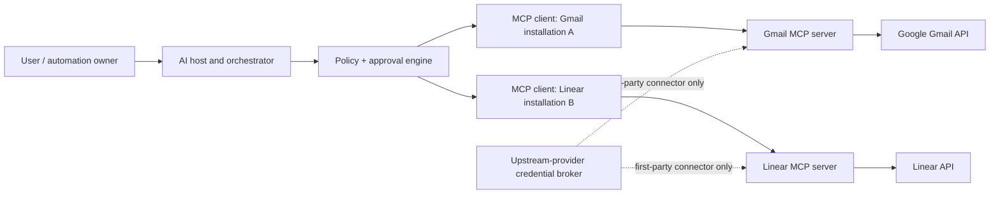
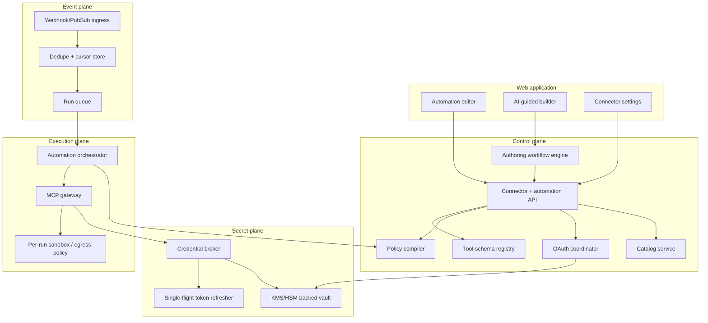
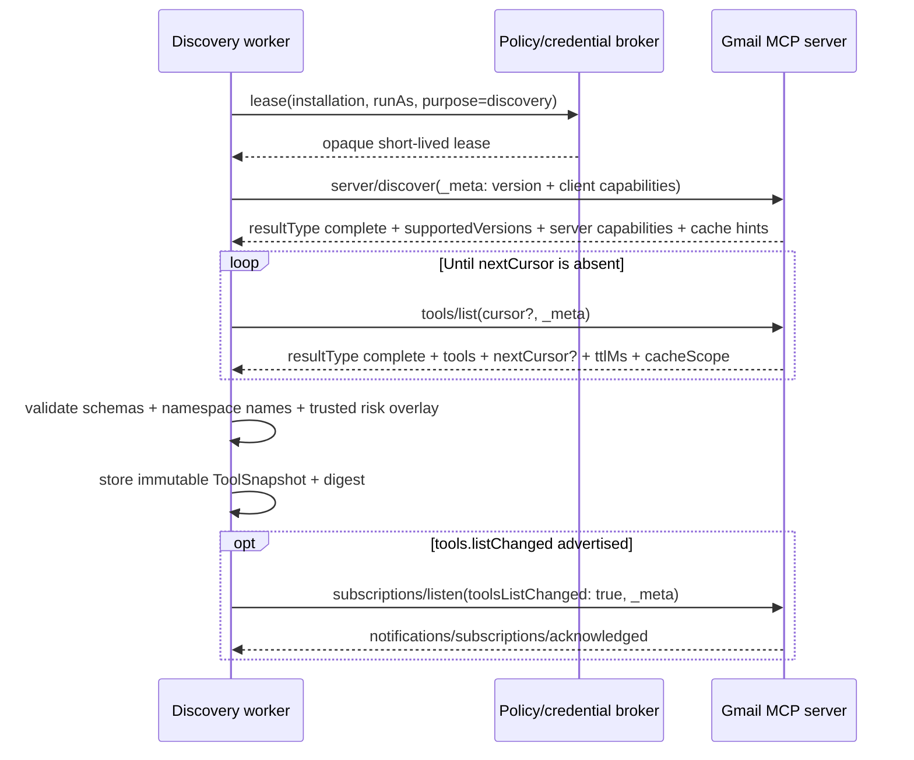
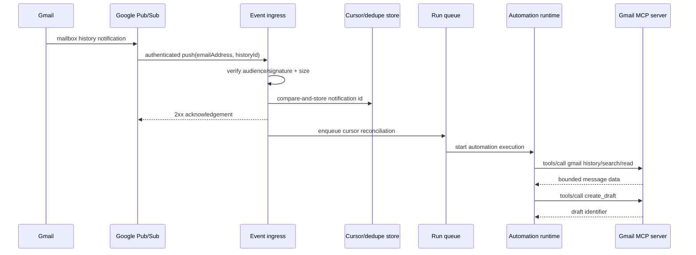
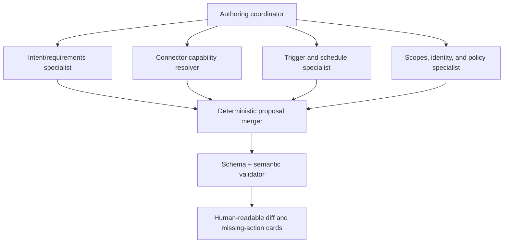
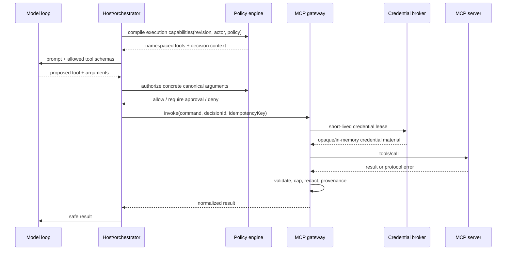

# MCP, OAuth, connectors, and AI-guided automation architecture

Generated: 2026-09-02  
Purpose: explain the recovered Devin client behavior, then design a different, buildable connector platform for an automation product.  
Primary local evidence: formatted modules and hashes in `DEVIN_AUTOMATIONS_FULL_ANNOTATED_DECOMPILE.txt`.

## 1. The short answer

MCP is the protocol between an AI host and a capability server. OAuth is the authorization machinery that gives a particular person or organization access to that server or to an upstream service such as Gmail. An automation system needs both, plus a control plane that installs connectors, a credential broker that keeps tokens away from the model, a policy engine that decides which tools may be exposed, and an execution plane that actually invokes them.

The clean architecture is:

1. A connector catalog describes available servers and their authentication requirements.
2. An installation binds one connector definition to one organization.
3. A user grant binds an installation to a human identity and holds encrypted OAuth material.
4. `tools/list` discovers the exact callable functions and their JSON Schemas.
5. An automation stores stable installation IDs, a run-as identity, and a security-policy reference—not access tokens.
6. At run time, the policy engine intersects the selected installations, the run-as user's grants, security-profile allowlists, and live tool availability.
7. The model sees only the resulting tool schemas. A credential broker injects tokens after the model has chosen a tool and after policy/approval checks pass.
8. Calls and results are audited, bounded, and validated; durable recovery uses explicit workflow/task state, never implicit MCP transport resumption.

The most important distinction is this:

> Selecting “Gmail” in an automation is not the same operation as granting Google access, and granting Google access is not the same operation as an MCP `tools/call`.

Those are three separate state machines. Keeping them separate prevents cross-user token use, confusing UI states, and silent privilege escalation.

## 2. Evidence boundary

This guide keeps five evidence classes separate:

- **Recovered Devin evidence** means a literal path, field, transition, or condition in the captured client bundle or desktop package.
- **MCP 2026-07-28 requirement** means behavior defined by that pinned MCP specification revision; requirement words retain their MCP level.
- **OAuth/OIDC requirement** means behavior from an incorporated OAuth or OpenID standard where MCP has not specialized it.
- **Google-specific behavior** means current Google OAuth, OpenID Connect, or Gmail API behavior for the separate upstream Google relationship.
- **Recommended product design** means the architecture proposed here for your own product. It may be stricter than a protocol, but it is not presented as unseen Devin server code or as an MCP mandate.

### 2.1 What the recovered Devin client establishes

The remote Automations editor and adjacent MCP client establish the following facts:

| Area | Recovered behavior |
|---|---|
| Installed servers | `GET mcp/servers` |
| Marketplace | `GET mcp/marketplace-servers`, parsed through a client-side schema |
| OAuth callback URL | `GET mcp/oauth/callback-url`, projecting `callback_url` |
| Installation creation | `POST mcp/installations` |
| Installation update/delete/refresh | `PUT`, `DELETE`, and `POST .../refresh` on `mcp/installations/{installationId}` |
| Credential keys | `GET .../credentials`; values are added with `PUT .../credentials/{encodedKey}` and never projected back by this client |
| Secret references | `GET/POST/DELETE .../secrets`; the attach request sends `secret_ids` |
| OAuth start | `POST mcp/installations/{id}/oauth/authorize` with `{return_to, session_id}` |
| OAuth token step | `POST mcp/installations/{id}/oauth/token` |
| Personal grant removal | `DELETE mcp/installations/{id}/oauth/personal-token` |
| Personal OAuth inventory | `GET mcp/personal-oauth-servers` |
| Tool discovery | `POST mcp/installations/{id}/tools/list` with a 120-second client timeout |
| Enterprise inheritance | Local installed servers are combined with inherited enterprise servers; locally enabled servers shadow inherited servers with the same slug or marketplace ID |
| Automation binding | The editor persists selected values as `recommended_mcps: string[]` |
| OAuth readiness | An OAuth server is usable only when installed, enabled, has OAuth tokens, and does not have `oauth_refresh_invalid` |
| Non-OAuth readiness | A non-OAuth server is usable when installed and enabled |
| Cache invalidation | Install/update/refresh/delete invalidates the MCP server list; grant removal optimistically clears token readiness and then invalidates personal, server, and inherited caches |
| Security coupling | A resolved security response may provide `governing_mcp_server_ids`; the editor can warn about or remove servers outside that governed set |
| Network coupling | MCP-derived network entries are displayed beside user/default entries and may be blocked by a governing security profile |
| Run-as coupling | Changing run-as identity can automatically unselect MCPs that the new identity cannot use |

Primary code evidence:

- `useQuery-B7J7x127.js:49-100, 342-512`
- `useDevinModeOptions-DUD254GY.js:467-512`
- `useRunAsIdentityChange-dM4qm5p5.js`
- `useSecurityProfiles-CaMt22id.js`
- `AutomationEditorPage-tUXHQ5Au.js`
- `network-policy-editor-CvHMbvLE.js`

The desktop package establishes a second, adjacent MCP path for native agents. Its shipped `mcp_config` JSON Schema supports local process fields (`command`, `args`, `env`), remote fields (`serverUrl`, `url`, `headers`), `disabled`, `disabledTools`, a registry identifier, and OAuth configuration with `clientId` and `scopes`. The desktop also contains ACP/Connect-RPC MCP management paths. Those native paths must not be confused with the remote web editor's hosted installation endpoints.

### 2.2 What the recovered code does not establish

The captured client does not contain:

- the database tables behind installations and grants;
- the OAuth callback handler or token-encryption implementation;
- the MCP transport/request gateway;
- the credential-injection boundary;
- the server-side `tools/list` implementation;
- the execution sandbox or network-enforcement implementation;
- the runtime mapping from a selected `recommended_mcps` value to a live server;
- the agent's hidden system prompt or internal planning topology;
- proof that the AI-guided builder uses multiple subagents.

The recovered “Generate with Devin” control creates a regular Devin session with a localized message, `planning_mode: "automatic"`, and `planner_type: "fast"`, then navigates to that session. No special automation-generation endpoint is present in that UI hook. Your own product can use a richer multi-agent authoring workflow, but that is a recommended design, not a recovered Devin fact.

## 3. MCP itself, from wire protocol to a usable tool

Protocol baseline for this section: **MCP specification revision `2026-07-28` only**. Earlier protocol behavior is intentionally excluded from the implementation design.

### 3.1 Host, client, and server

MCP uses a host-client-server architecture:

- The **host** is your automation/agent product. It owns the conversation, policy, consent UI, model calls, and aggregation of tools.
- An MCP **client** is the host-side protocol instance that communicates with exactly one MCP server.
- The MCP **server** exposes tools, resources, and/or prompts. It should receive only the context required for its operation, not the entire private conversation by default.

In `2026-07-28`, MCP is stateless. A connection or stdio process is a transport resource, not a protocol session, conversation, task, or identity boundary. Every request is self-contained. Related work that spans calls uses an explicit server-minted handle passed as an ordinary argument; authorization for that handle is checked on every call.



The one-client-to-one-server relationship remains a valuable isolation boundary, but capabilities, protocol version, and client identity are declared per request. A host may reuse one transport across unrelated requests and may manage many clients at once. Never infer tenant, user, automation, or authorization merely from the connection or worker that carried a request.

### 3.2 Modern request envelope and version selection

Every `2026-07-28` request is self-contained and puts the protocol version and client capabilities in `params._meta`; client information should also be sent on every request:

```json
{
  "jsonrpc": "2.0",
  "id": 1,
  "method": "tools/list",
  "params": {
    "_meta": {
      "io.modelcontextprotocol/protocolVersion": "2026-07-28",
      "io.modelcontextprotocol/clientCapabilities": {
        "elicitation": {"form": {}, "url": {}}
      },
      "io.modelcontextprotocol/clientInfo": {
        "name": "automation-runtime",
        "version": "1.0.0"
      }
    }
  }
}
```

The two required `_meta` fields are `io.modelcontextprotocol/protocolVersion` and `io.modelcontextprotocol/clientCapabilities`. A server must reject a request missing either with JSON-RPC `-32602`; over HTTP that response is `400 Bad Request`. A server must not rely on a capability the request did not declare. If the operation needs an undeclared client capability, the server returns `MissingRequiredClientCapability` (`-32021`) and identifies the missing capabilities.

There is no connection-wide negotiation. If a requested version is unsupported, the server returns `UnsupportedProtocolVersion` (`-32022`) with `data.requested` and `data.supported`; the client may choose a mutually supported version and reissue the request. Each reissue has a new JSON-RPC request ID. Server and client `Implementation` metadata is self-reported display/debug data and must not drive a security decision.

All successful result objects carry `resultType`. Core values are `"complete"` and `"input_required"`; an unknown value is invalid unless a mutually advertised extension defines it.

### 3.3 Server discovery

Servers must implement `server/discover`. Call it before connector discovery so the control plane can record supported versions, capabilities, identity, and instructions. A client could call another RPC directly and handle `-32022`, but this design uses explicit discovery for deterministic setup and diagnostics.

```json
{
  "jsonrpc": "2.0",
  "id": "discover-1",
  "method": "server/discover",
  "params": {
    "_meta": {
      "io.modelcontextprotocol/protocolVersion": "2026-07-28",
      "io.modelcontextprotocol/clientCapabilities": {},
      "io.modelcontextprotocol/clientInfo": {
        "name": "automation-runtime",
        "version": "1.0.0"
      }
    }
  }
}
```

```json
{
  "jsonrpc": "2.0",
  "id": "discover-1",
  "result": {
    "resultType": "complete",
    "supportedVersions": ["2026-07-28"],
    "capabilities": {"tools": {"listChanged": true}},
    "instructions": "Server-supplied model guidance; treat as untrusted data.",
    "ttlMs": 3600000,
    "cacheScope": "private",
    "_meta": {
      "io.modelcontextprotocol/serverInfo": {
        "name": "gmail-connector",
        "version": "4.2.0"
      }
    }
  }
}
```

Do not trust marketplace metadata as proof of live capabilities. `server/discover` is the current server declaration, but its name/version/instructions remain self-asserted. Bind trust to your verified endpoint, publisher/signature, definition digest, authorization context, and policy overlay—not `serverInfo.name`.

Unless specifically configured not to, a server should include its self-reported `_meta["io.modelcontextprotocol/serverInfo"]` in every result. Treat that repeated value as display, logging, and debugging metadata only: omission is tolerated, and a changed or forged value never selects behavior, changes routing, widens policy, or proves endpoint identity or authority.

A complete `server/discover` result is cacheable and therefore carries nonnegative `ttlMs` and `cacheScope: "public" | "private"`. It declares feature families, not the existence or authorization of a particular item: a server declaring tools must answer `tools/list`, but that list may be empty or filtered by authorization on the individual request. Calling discovery never establishes protocol state, and every later request still supplies the complete per-request metadata.

### 3.4 Tool discovery, caching, and change subscriptions

A server that supports tools declares a `tools` capability. The host discovers tools with paginated `tools/list` calls:

```json
{
  "jsonrpc": "2.0",
  "id": 2,
  "method": "tools/list",
  "params": {
    "_meta": {
      "io.modelcontextprotocol/protocolVersion": "2026-07-28",
      "io.modelcontextprotocol/clientCapabilities": {},
      "io.modelcontextprotocol/clientInfo": {"name": "automation-runtime", "version": "1.0.0"}
    }
  }
}
```

Each advertised tool has a programmatic `name` and a required object-root JSON Schema `inputSchema`. `title`, `description`, `icons`, `outputSchema`, `annotations`, and `_meta` are optional. The protocol does not promise that a name remains stable forever: it should be unique within the server's current list, 1–128 characters, case-sensitive, and limited to ASCII letters, digits, underscore, hyphen, and dot. A list-change notification or cache refresh is how a client learns that a name or schema changed.

Treat every server-supplied string, icon, schema, annotation, and metadata value as untrusted. For UI labels, use direct `title`, then `annotations.title`, then `name`. Annotation hints default to `readOnlyHint: false`, `destructiveHint: true`, `idempotentHint: false`, and `openWorldHint: true`; they never grant permission, suppress approval, establish OAuth scopes, or authorize retry. Preserve the wire definition separately from the bounded, policy-filtered model projection. Reject duplicate names within one assembled server snapshot and namespace cross-server names with trusted installation identity—not self-reported `serverInfo`—for example:

```text
gmail__search_messages
gmail__get_message
gmail__send_email
linear__create_issue
```

`tools/list` may return an empty list and is cursor-paginated. The first request omits `cursor`; later requests echo `nextCursor` exactly. A cursor is opaque, including an empty string, so presence—not truthiness—controls continuation; absence of `nextCursor` ends the traversal. Never parse, normalize, or compare cursor meaning. Servers choose page size and should return tools deterministically while the underlying set is unchanged. An invalid cursor should produce JSON-RPC `-32602`; discard the complete page set and restart without a cursor. There is no cross-page consistency guarantee, so restart from the first page when a coherent safety-critical snapshot is required.

Every complete `tools/list` result must include nonnegative `ttlMs` and `cacheScope: "public" | "private"`. Treat every page as its own cache entry keyed by the full request method and every result-affecting parameter, including the cursor. The freshness clock starts when that page arrives, and pages may have different TTLs. All pages in one logical list traversal must use the same `cacheScope`; reject a candidate snapshot if scopes differ.

Protocol cache semantics are precise:

- `ttlMs: 0` means immediately stale; a positive value remains fresh only while `now < receivedAt + ttlMs`.
- A missing or negative `ttlMs` is treated as zero by a robust client, but a conforming `2026-07-28` server emits a nonnegative value.
- `cacheScope: "private"` permits reuse only inside the same authorization context. Include the exact token/grant version or an equivalent non-secret authorization-context key.
- `cacheScope: "public"` explicitly permits reuse across callers and authorization contexts. A conservative host may still partition it, but must not mislabel a private result as public.
- Never cache `resultType: "input_required"`, or a result from an MRTR retry carrying `inputResponses` or `requestState`.
- TTL is a freshness hint, not a guarantee and not a polling interval. A relevant notification invalidates a still-fresh entry immediately; an unexpected not-found or invalid-parameters result may also justify early refetch.

The list may vary by per-request authorization, but it must not vary merely because a different connection was used or because another call happened on that connection. A normalized snapshot therefore keys at least endpoint/definition version, authorization or grant version, protocol version, and effective policy.

If `server/discover` advertises `tools.listChanged`, receive changes by opening `subscriptions/listen` with a `notifications` filter containing `toolsListChanged: true`. The complete filter vocabulary is `toolsListChanged`, `promptsListChanged`, `resourcesListChanged`, and `resourceSubscriptions: string[]`; omitted fields are not subscribed. A server must not send an unrequested notification type.

The first message for that subscription is `notifications/subscriptions/acknowledged`. Its acknowledged filter is the supported subset, and it—plus every later notification on the stream—carries `_meta["io.modelcontextprotocol/subscriptionId"]` equal to the JSON-RPC ID of the `subscriptions/listen` request. On stdio, demultiplex interleaved streams by that value. On HTTP, the listen response is the long-lived SSE stream. Request-scoped `notifications/progress` and `notifications/message` remain on their originating request response stream; they do not move onto the subscription stream.

On `notifications/tools/list_changed`, invalidate the relevant list pages and rebuild the normalized snapshot. If a stream is lost, create a new `subscriptions/listen` request; there is no resumability, event cursor, or redelivery guarantee. When the server initiates subscription teardown on an intact stream, it sends `notifications/cancelled` with `params.requestId` equal to the `subscriptions/listen` request ID and the matching `_meta["io.modelcontextprotocol/subscriptionId"]`. For a graceful close it should additionally return that original listen request's final successful response with `resultType: "complete"` and matching subscription metadata, then close the stream. Servers never send `notifications/cancelled` for an ordinary non-listen request. An already-lost transport is an abrupt disconnect, not a server-initiated teardown. Client-initiated cancellation remains transport-specific. TTL remains a fallback freshness hint and is not a polling instruction.

Store a digest of the normalized tool list so each automation run records exactly which schema version the model saw. JSON Schema defaults to dialect 2020-12 when `$schema` is absent. `inputSchema` has a non-null object root; a no-argument tool should use an empty object schema such as `{"type":"object","additionalProperties":false}`. `outputSchema` may describe any JSON value. Reject unsupported declared dialects and do not automatically resolve network `$ref` values; reject unresolved external references unless an explicitly enabled, allowlisted, bounded resolver is used. Bound schema depth, subschema count, and validation time for composition keywords.

If the UI loads a remote tool icon, require HTTPS and the same origin as the MCP server. Reject every redirect that changes scheme or origin. Treat URI and bytes as hostile media: send no ambient cookies or credentials; cap bytes, dimensions, and frames; verify MIME type against magic bytes; support PNG and JPEG at minimum; and sanitize or reject active SVG. A bounded data URI may be handled locally without a network fetch.

The recovered Devin web client wraps tool discovery in `POST mcp/installations/{id}/tools/list` rather than exposing raw JSON-RPC to the browser. That is a strong control-plane pattern: the browser asks your backend, and your backend owns the MCP connection and secrets.

### 3.5 Tool invocation, result types, and multi-round-trip input

The host invokes a tool with `tools/call`:

```json
{
  "jsonrpc": "2.0",
  "id": 3,
  "method": "tools/call",
  "params": {
    "name": "gmail.search_messages",
    "arguments": {"query": "from:billing@example.com newer_than:7d", "limit": 20},
    "_meta": {
      "io.modelcontextprotocol/protocolVersion": "2026-07-28",
      "io.modelcontextprotocol/clientCapabilities": {
        "elicitation": {"form": {}, "url": {}}
      },
      "io.modelcontextprotocol/clientInfo": {"name": "automation-runtime", "version": "1.0.0"}
    }
  }
}
```

There are two different error channels:

- A JSON-RPC error means the protocol request itself failed: unknown method/tool, malformed parameters, unsupported version, missing required capability, an exceptional server failure, or similar. Unknown/malformed inputs commonly use `-32602`.
- A normal result with `isError: true` means execution produced a domain, input, business-rule, or upstream-API failure such as a Gmail rate limit or missing message. When `isError` is absent, it means `false`.

Your gateway should preserve the two error channels because retry and user messaging differ; neither channel alone authorizes replay of a side effect. A complete tool result uses `resultType: "complete"` and required `content: ContentBlock[]`. Content blocks may be text, image, audio, resource links, or embedded resources, and may carry audience/priority/last-modified annotations. Optional `structuredContent` may be any JSON value, including an array, scalar, boolean, or null. If `outputSchema` exists, the server must conform; the MCP client should validate it, and this gateway strengthens that to fail-closed validation before model use. For broad client compatibility, a server returning structured content should also serialize it in a text content block. A resource link need not appear in `resources/list`; a server returning embedded resources should support the resources capability. Bound and sanitize every variant before placing it into model context, and never treat content annotations as authorization.

The other core result is `resultType: "input_required"`. Under Multi Round-Trip Requests (MRTR), the server does not initiate a JSON-RPC request. `InputRequiredResult` has optional `inputRequests` and optional opaque `requestState`, with at least one of those two present. When input requests exist, the client fulfills only supported requests before retrying; a state-only result may be retried immediately. This design declares only the current elicitation capability. The retry contains:

- the original arguments;
- `inputResponses` keyed exactly like the server's `inputRequests`;
- the exact uninspected `requestState`, if one was returned; and
- a new JSON-RPC request ID.

Only `tools/call`, `resources/read`, and `prompts/get` may return `input_required`. A server must not request a client feature that was not declared in that request's capabilities and must not assume the client will retry. The client never parses, alters, or reuses state for another request. Treat returned `requestState` as attacker-controlled on the server; integrity-protect identity, expiry, method/argument binding, and enforce server-side single use wherever replay would be harmful.

The stateless protocol also has no generic state-handle primitive. If a tool returns a handle for later calls, it is an ordinary result value and argument—not proof of authority. Make it opaque, document its lifetime, authenticate and authorize the current caller on every use, and return a recoverable execution error when it is unknown or expired. If an unauthenticated design necessarily treats a handle as a bearer capability, generate high entropy and impose a short bounded lifetime. Never infer its meaning or owner from an HTTP connection or stdio process.

Servers validate inputs, enforce access control, rate-limit calls, and sanitize outputs. Clients expose which tools and concrete arguments are being invoked, preserve a human denial path for sensitive interactive calls, validate results, set deadlines, and audit usage. For unattended automations, explicit preauthorization and argument-level policy plus a revocation/kill control replace moment-of-call confirmation; server annotations alone are never consent.

Declare only elicitation modes the client actually implements under each request's `clientCapabilities.elicitation`: `form`, `url`, or both. At least one mode is required when that capability is present; an empty elicitation object means form-only for compatibility. Form mode is in-band and visible to the MCP client. It uses a human-readable `message` and a deliberately flat primitive `requestedSchema` suitable for nonsecret configuration such as a label, project, folder, date, boolean, number, or supported single/multi-select enum. Nested objects and arrays of objects are unsupported. Never request passwords, API keys, access tokens, payment credentials, or other transaction-authorizing secrets in form mode; use URL mode.

Elicitation responses use three distinct actions: `accept` is explicit approval/submission, `decline` is explicit refusal, and `cancel` is dismissal without an explicit choice. Form acceptance includes schema-conforming `content`; URL acceptance omits content. Servers validate form data again and handle all three actions without assuming success.

### 3.6 Transports in `2026-07-28`

The public MCP specification defines two standard transports:

| Transport | Appropriate use | Critical controls |
|---|---|---|
| `stdio` | Trusted local server launched as a subprocess | One newline-delimited UTF-8 JSON-RPC message per line; no embedded newlines; exact executable allowlist; constrained environment; logs only on stderr; no non-MCP stdout; process limits; EOF shutdown |
| Streamable HTTP | Hosted/remote connectors and horizontally scaled runtimes | One POST per JSON-RPC message; HTTPS; bearer authorization on every request when MCP authorization is enabled; `Origin` validation; mirrored header/body validation for request POSTs; request-scoped SSE; deadlines and cancellation |

For a multi-tenant automation SaaS, prefer hosted Streamable HTTP behind your connector gateway. Use `stdio` only in a deliberate local/desktop execution mode. Never run an arbitrary marketplace command in the same trust domain as your control plane.

Streamable HTTP exposes one MCP endpoint accepting POST. Each JSON-RPC message is its own POST; batches and client-sent JSON-RPC responses are invalid. Every request POST advertises `Accept: application/json, text/event-stream`; the server returns either one JSON response or one request-scoped SSE stream whose final item is the JSON-RPC response. Core `2026-07-28` defines no client-to-server notification over Streamable HTTP: its only core client-sent notification, `notifications/cancelled`, is used on stdio, while HTTP cancellation closes the affected SSE response stream. If a future or mutually advertised extension defines an HTTP notification, acceptance receives `202 Accepted` with no body; rejection is an HTTP error and may include an ID-less JSON-RPC error. This revision defines no mirrored-header requirements for such a notification POST. A server must never send an independent JSON-RPC request on an SSE stream; it uses MRTR.

Validate every present `Origin` and return 403 for a forbidden origin. A local HTTP server binds to loopback instead of all interfaces and all deployments authenticate as appropriate. For streamed responses, disable intermediary buffering and use SSE comments as bounded keepalives on quiet long-lived streams. Streamable HTTP uses one POST endpoint; each broken response stream loses only its in-flight request, and any safe reissue uses a new JSON-RPC request ID. Transport reuse never creates protocol continuity.

Each JSON-RPC request POST mirrors body data in mandatory headers:

| Header | Required value |
|---|---|
| `MCP-Protocol-Version` | Must equal `params._meta["io.modelcontextprotocol/protocolVersion"]` |
| `Mcp-Method` | Must equal the JSON-RPC `method` |
| `Mcp-Name` | Required for `tools/call`, `resources/read`, and `prompts/get`; equals `params.name` or `params.uri` |

Header names are case-insensitive and their values are case-sensitive. Header/body mismatch or a missing/malformed required header produces HTTP 400 plus `HeaderMismatch` (`-32020`), although an intermediary may supply only the HTTP failure. An unsupported protocol version produces HTTP 400 plus `-32022`; an unknown modern RPC method produces HTTP 404 plus `-32601`. Non-ASCII or unsafe `Mcp-Name` values use the specification's exact `=?base64?...?=` sentinel encoding.

A tool schema may annotate an argument with `x-mcp-header`; Streamable HTTP clients must support it. Apply all of these checks before exposing or invoking the tool:

- the annotation name is nonempty, contains no control characters, matches HTTP field-name token syntax, and is case-insensitively unique in that schema;
- the annotated value is a `string`, `boolean`, or JavaScript-safe `integer`; JSON Schema `number` is not permitted;
- the property is reachable from the schema root only through `properties` keys—not through arrays, `$ref`, composition, or conditionals;
- when a non-null value is present, mirror its exact instance value to `Mcp-Param-{Name}`; omit the header when the path is absent or the value is `null`;
- plain strings use visible ASCII without leading/trailing whitespace; other strings, controls, non-ASCII, or values matching the sentinel form use UTF-8 Base64 as `=?base64?{value}?=`; and
- the server decodes and compares every recognized mirrored header to the body—integers numerically, other primitives by value—rejecting a missing/malformed/mismatched value with HTTP 400 / `-32020`; an intermediary that does not recognize `Mcp-Param-*` forwards it unchanged and otherwise ignores it.

Exclude an invalidly annotated tool from the usable `tools/list` projection and record the reason without failing unrelated tools. Never annotate credentials, tokens, or sensitive personal data because intermediaries observe headers. If a header mismatch suggests a changed schema, rediscover `tools/list` before considering a retry, and still apply normal side-effect/idempotency policy.

Cancellation differs by transport. On stdio, send `notifications/cancelled` with the in-flight request ID. On Streamable HTTP, close that request's SSE response stream. Enforce a maximum deadline even if progress notifications reset an idle timer. A lost HTTP response stream loses the in-flight result; issue any retry as a new request with a new ID and apply side-effect/idempotency safeguards.

### 3.7 The two OAuth relationships people often conflate

There may be two independent OAuth relationships:

1. **MCP client → MCP server authorization.** The MCP server is the protected resource. The client obtains an audience-bound token for that server using the MCP authorization specification.
2. **MCP server → Google authorization.** The Gmail MCP server is itself an OAuth client of Google and needs a Google grant for Gmail APIs.

In a hosted connector platform you can hide the first relationship behind an internal service identity while still requiring the second user-facing Google consent. If the Gmail MCP server is third-party and remote, both relationships may exist. Never forward the MCP access token to Google; it has the wrong issuer and audience. The Gmail server must use a separate Google token.

MCP `2026-07-28` supplies an explicit standard path for the second relationship: a tool call may return MRTR `input_required` with an `elicitation/create` request in `mode: "url"`. The client shows the full target URL/domain and asks before opening it; it must not prefetch the URL or inspect the external interaction. The Gmail server completes Google OAuth out of band, keeps the Google credentials itself, and the client retries the original `tools/call` with the opaque state. URL elicitation must not be used to authorize the MCP client to the MCP server—that remains the transport-level MCP OAuth flow.

| Connector deployment | MCP credential | Google credential | Correct boundary |
|---|---|---|---|
| First-party Gmail MCP server | Host/gateway sends an MCP access token or governed internal service identity to the MCP server | Your connector vault stores it; only the trusted Gmail connector sends it to Google | A provider credential lease may enter only this isolated first-party connector process |
| Third-party remote Gmail MCP server | Your host obtains and sends only an audience-bound token for that remote MCP server | The third party obtains and stores its own Google grant through its own consent flow | Your host never sends a Google token as the remote server's MCP bearer token |
| Direct Google connector behind your MCP facade | Host-to-facade hop uses its separately governed MCP/internal identity | Your vault stores the Google grant | Only Google consent may be user-visible, but the token domains remain separately typed and audited |

### 3.8 Core message invariants and progress

- A request ID is a string or integer, never `null`, and is unique among that client's active requests. A response repeats the same ID.
- Core `2026-07-28` defines client-to-server requests, server-to-client responses, and server-to-client request-scoped or subscription notifications. Its sole core client-sent notification is stdio `notifications/cancelled`; Streamable HTTP cancellation closes the affected SSE response instead. The server never initiates a JSON-RPC request, and the client never sends a JSON-RPC response.
- A notification has no ID and receives no response. One stdio line carries one JSON-RPC message. Each Streamable HTTP request is one POST; a client notification POST exists only for a future or mutually advertised extension and has no core mirrored-header contract in this revision.
- Standard JSON-RPC errors remain `-32700` and `-32600` through `-32603`. MCP-defined errors currently include `HeaderMismatch` (`-32020`), `MissingRequiredClientCapability` (`-32021`), and `UnsupportedProtocolVersion` (`-32022`). Do not allocate product errors inside MCP's reserved `-32020` through `-32099` range.
- To opt into progress, the client adds a string/integer `progressToken` to request `_meta`; it must be unique among active requests. The server may send `notifications/progress` with that token. `progress` strictly increases; `total` and human-readable `message` are optional. Rate-limit updates and stop them after completion. Progress is ephemeral and does not make work durable.

### 3.9 Durable work uses the optional Tasks extension

Long-running, reconnectable server work is not a core MCP session. If needed, adopt the current `io.modelcontextprotocol/tasks` extension explicitly:

1. The client includes it in `clientCapabilities.extensions` on every applicable request.
2. The server advertises it in `server/discover.capabilities.extensions` and must not return a task to a request that did not declare support.
3. A server may return `resultType: "task"` with a durably created `taskId`, status, TTL, and polling interval.
4. The client persists the ID and polls `tasks/get`. Statuses are `working`, `input_required`, `completed`, `failed`, and `cancelled`; the last three are terminal.
5. Submit requested input with `tasks/update`. Request cooperative durable cancellation with `tasks/cancel`. Optional `notifications/tasks` arrive only through an opted-in `subscriptions/listen` stream.

Keep four concepts distinct: closing an HTTP response or stdio cancellation abandons one in-flight RPC; `tasks/cancel` targets durable extension work; `notifications/progress` is ephemeral status for one active RPC; MRTR `input_required` ends one round trip so the client can retry with requested input.

### 3.10 Active-feature-only conformance boundary

Implement only the active mechanisms specified and linked in this guide. The build-time conformance suite rejects every feature listed in the pinned revision's deprecated-feature registry. Directories/files travel through explicit tool arguments, resources, or server configuration; model calls remain in the host; observability uses stderr or OpenTelemetry; client identity uses pre-registration or Client ID Metadata Documents; and remote traffic uses Streamable HTTP.

Dynamic Client Registration is still an optional (`MAY`) protocol feature in this revision, but it is deprecated and deliberately unsupported by this design. New implementations use pre-registration or Client ID Metadata Documents. Under the pinned lifecycle registry, Dynamic Client Registration is first eligible for removal in a revision released on or after `2027-07-28`; eligibility is not itself removal.

## 4. Recommended system architecture

### 4.1 Four planes and one rule

Use four planes:

| Plane | Owns | Must not own |
|---|---|---|
| Control plane | Catalog, installations, scopes, grants' metadata, OAuth attempts, tool snapshots, automation bindings | Decrypted refresh tokens in normal request logs |
| Secret plane | Envelope encryption, token refresh, credential leases, revocation | Model prompts, arbitrary connector descriptions |
| Execution plane | MCP requests/transports, policy-filtered tool exposure, calls, result validation, run state | Long-lived browser sessions or raw organization admin APIs |
| Event plane | Webhooks/Pub/Sub, signature validation, deduplication, trigger cursors, run enqueueing | Interactive OAuth redirects |

The rule is: **the model may choose a capability, but it never handles the credential that makes the capability work.**

### 4.2 Component map



### 4.3 Installation scope is not credential scope

Model these independently:

- **Definition scope:** the catalog entry exists globally or only for one enterprise.
- **Installation scope:** personal, organization, enterprise-default, enterprise-targeted, or local-machine.
- **Grant subject:** the actual Google/Slack/etc. account that consented.
- **Automation run-as:** the identity whose authorization may be used at run time.
- **Tool scope:** read/write/admin risk and OAuth scopes required by each tool.

An organization-installed Gmail connector does not mean every employee may use Irene's Gmail token. It means the connector definition is available to the organization; each usable grant still has a subject and access policy.

Recommended installation states:

```text
draft
  -> needs_configuration
  -> needs_authorization
  -> discovering_tools
  -> ready
  -> degraded
  -> reconnect_required
  -> disabled
  -> deleting
  -> deleted
```

Compute state from facts; do not let UI clients assign `ready` directly.

## 5. Recommended data model

The following TypeScript is a design contract, not recovered Devin server source.

### 5.1 Catalog definition

```ts
type ConnectorDefinition = {
  id: string;                         // immutable UUID, never the display slug
  slug: string;                       // human-facing stable-ish name
  version: number;
  displayName: string;
  description: string;
  iconAssetId?: string;
  publisherId: string;
  trustTier: "first_party" | "verified" | "unverified";
  transport:
    | {kind: "streamable_http"; endpoint: string}
    | {kind: "stdio"; packageDigest: string; commandTemplate: string[]};
  auth:
    | {kind: "none"}
    | {kind: "api_key"; credentialFields: CredentialField[]}
    | {kind: "oauth"; provider: string; availableScopes: ScopeDefinition[]};
  defaultDisabledTools: string[];
  requiredEgress: NetworkTarget[];
  installPolicy: "personal" | "organization" | "enterprise" | "local";
  lifecycle: "draft" | "published" | "suspended" | "retired";
  signedManifestDigest: string;
};
```

`slug` is for routes and search. Store `id + version` in installations. Otherwise a publisher can mutate a catalog entry underneath existing automations.

### 5.2 Installation

```ts
type ConnectorInstallation = {
  id: string;
  tenantId: string;
  definitionId: string;
  definitionVersion: number;
  scope: "personal" | "organization" | "enterprise_default" | "enterprise_targeted" | "local_machine";
  ownerUserId?: string;               // required for personal
  targetOrgIds?: string[];            // enterprise-targeted
  excludedOrgIds?: string[];          // enterprise-default exceptions
  enabled: boolean;
  configCiphertextRef?: string;
  configuredCredentialKeys: string[]; // names only; no values
  attachedSecretIds: string[];        // references only
  state: InstallationState;
  stateReason?: string;
  version: number;                    // optimistic concurrency / ETag
  createdAt: string;
  updatedAt: string;
};
```

Enforce a uniqueness rule appropriate to your product, such as `(tenant_id, definition_id, scope, owner_user_id, target_set_hash)`. If enterprise and local installations share a slug, define deterministic shadowing. The recovered client favors a local installed/enabled server over an inherited server with the same slug or marketplace ID.

### 5.3 Validated MCP authorization profile and client registration

```ts
type ValidatedMcpAuthorizationProfile = {
  installationId: string;
  canonicalResourceUri: string;
  resourceMetadataUri: string;
  resourceMetadataDigest: string;
  authorizationServerIssuer: string;
  authorizationServerMetadataDigest: string;
  authorizationEndpoint: string;
  tokenEndpoint: string;
  codeChallengeMethodsSupported: string[];
  scopesSupported?: string[];
  authorizationResponseIssParameterSupported: boolean;
  clientIdMetadataDocumentSupported: boolean;
  fetchedAt: string;
  expiresAt: string;
};

type McpPreRegisteredClient = {
  id: string;
  kind: "pre_registered";
  clientId: string;
  redirectUris: string[];
  grantTypes: string[];
  tokenEndpointAuthMethod: string;     // validated against this issuer's metadata
  authorizationServerIssuer: string;  // mandatory issuer binding
  clientSecretCiphertextRef?: string;
  version: number;
};

type CimdTokenEndpointAuthentication =
  | {method: "none"}
  | {
      method: "private_key_jwt";
      signingKeyRef: string;
      publicKeys:
        | {jwksUri: string}
        | {jwks: {keys: JsonWebKey[]}};
    };

type McpCimdClient = {
  id: string;
  kind: "client_id_metadata_document";
  clientId: string;                    // exact HTTPS document URL with a path
  metadataDocumentUrl: string;          // exactly equal to clientId
  clientName: string;
  redirectUris: string[];
  grantTypes: ("authorization_code" | "refresh_token")[];
  responseTypes: ["code"];
  tokenEndpointAuthentication: CimdTokenEndpointAuthentication;
  authorizationServerIssuer?: never;   // CIMD URL identity is portable
  version: number;
};

type McpClientRegistration = McpPreRegisteredClient | McpCimdClient;
```

For CIMD, reject `client_secret_basic`, `client_secret_post`, `client_secret_jwt`, every other shared-symmetric-secret method, and the `client_secret`/`client_secret_expires_at` fields. If `private_key_jwt` is selected, require an explicit public JWKS representation and an internal signing-key reference. A CIMD client that wants refresh tokens publishes `refresh_token` in `grant_types` but still cannot assume one will be issued. Model any additional asymmetric authentication method as another explicit union variant with its required key material; never restore an unrestricted string to the CIMD branch.

Protected-resource metadata and authorization-server metadata are validated network evidence, not equivalent to catalog configuration. **The following is product security policy, deliberately stricter than the explicit fetch wording in the pinned authorization pages:** apply SSRF, redirect, DNS-rebinding, response-size, content-type, and timeout controls to the challenge-supplied `resource_metadata` URL, both protected-resource well-known probes, every RFC 8414/OIDC discovery probe, authorization/token endpoints, and Client ID Metadata Document/JWKS/icon fetches. Resolve and validate every redirect hop and every new DNS connection; block prohibited loopback, link-local, private, and cloud-metadata ranges unless a narrowly governed local mode explicitly permits them. Never let one fetched document silently authorize a different origin. A changed issuer invalidates issuer-bound pre-registration and token state; a CIMD client ID remains portable, but every authorization attempt still binds one exact validated issuer.

The pinned MCP security page explicitly says authorization servers fetching Client ID Metadata Documents should consider SSRF and must consider the incorporated CIMD security requirements. Applying equivalent fail-closed controls to PRM and authorization-server discovery is this architecture's broader policy, not a separately stated MCP `MUST` for each fetch surface.

### 5.4 Separate MCP and upstream-provider grants

Use different typed records and decrypt roles so a Google token can never be selected for an MCP `Authorization` header and an MCP token can never reach Google:

```ts
type EncryptedTokenState = {
  accessTokenCiphertextRef?: string;
  refreshTokenCiphertextRef?: string;
  accessTokenExpiresAt?: string;
  refreshTokenFamilyId?: string;
  tokenVersion: number;
  status: "active" | "refreshing" | "reconnect_required" | "revoked" | "error";
  lastRefreshAt?: string;
  lastRefreshErrorCode?: string;
  revokedAt?: string;
};

type McpAccessGrant = EncryptedTokenState & {
  kind: "mcp_server";
  id: string;
  tenantId: string;
  installationId: string;
  subjectUserId: string;
  authorizationServerIssuer: string;  // exact validated issuer
  canonicalMcpResourceUri: string;    // required resource/audience
  clientRegistrationId: string;       // bound to that issuer
  requestedScopes: string[];
  grantedScopes: string[];
};

type UpstreamProviderGrant = EncryptedTokenState & {
  kind: "upstream_provider";
  id: string;
  tenantId: string;
  installationId: string;
  subjectUserId: string;
  provider: "google" | string;
  authorizationServerIssuer: string;
  providerClientRegistrationId: string;
  providerSubject: string;            // stable `sub`, not email alone
  providerAccountLabel?: string;      // display only
  requestedScopes: string[];
  grantedScopes: string[];
};

type OAuthGrant = McpAccessGrant | UpstreamProviderGrant;
```

The browser should receive only a redacted projection:

```ts
type OAuthGrantStatus = {
  installationId: string;
  kind: "mcp_server" | "upstream_provider";
  connected: boolean;
  reconnectRequired: boolean;
  accountLabel?: string;
  grantedScopes: string[];
  expiresAt?: string;                 // optional diagnostic, not a token
};
```

This maps cleanly to the recovered client flags `has_oauth_tokens` and `oauth_refresh_invalid`, while giving your own backend a richer state machine.

### 5.5 Authorization attempt

```ts
type OAuthAttemptCommon = {
  id: string;
  tenantId: string;
  installationId: string;
  initiatingUserId: string;
  workflowSessionId?: string;
  stateHash: string;
  pkceVerifierCiphertextRef: string;
  codeChallengeMethod: "S256";
  redirectUri: string;
  returnTo: string;                   // validated relative route or allowlisted origin
  requestedScopes: string[];
  status: "pending" | "callback_received" | "exchanging" | "succeeded" | "failed" | "expired";
  expiresAt: string;
  consumedAt?: string;
};

type McpAuthorizationAttempt = OAuthAttemptCommon & {
  kind: "mcp_server";
  expectedIssuer: string;
  validatedMetadataSnapshotId: string;
  clientRegistrationId: string;
  canonicalMcpResourceUri: string;
};

type UpstreamProviderAuthorizationAttempt = OAuthAttemptCommon & {
  kind: "upstream_provider";
  provider: "google" | string;
  expectedIssuer: string;
  providerClientRegistrationId: string;
};

type OAuthAuthorizationAttempt =
  | McpAuthorizationAttempt
  | UpstreamProviderAuthorizationAttempt;
```

Make attempts one-time-use. Store a hash of the `state` token, not the bearer value. A callback must atomically change `pending → callback_received`; a second callback loses the compare-and-swap. For MCP-server authorization, use the same `canonicalMcpResourceUri` in authorization, code exchange, and refresh requests and compare callback `iss` to `expectedIssuer` before transmitting the code to a token endpoint. Never add the MCP resource parameter to the separate Google flow merely because MCP requires it for the first relationship.

### 5.6 Tool snapshot

```ts
type ProtocolToolSnapshotEntry = {
  wireName: string;
  namespacedName: string;             // trusted installation identity + wireName
  title?: string;
  description?: string;
  icons?: Array<{
    src: string;
    mimeType?: string;
    sizes?: string[];
    theme?: "light" | "dark";
  }>;
  inputSchema: {
    type: "object";
    $schema?: string;
    [keyword: string]: unknown;
  };
  outputSchema?: {$schema?: string; [keyword: string]: unknown};
  annotations?: {
    title?: string;
    readOnlyHint?: boolean;
    destructiveHint?: boolean;
    idempotentHint?: boolean;
    openWorldHint?: boolean;
  };
  protocolMeta?: Record<string, unknown>;
  risk: "read" | "write" | "destructive" | "admin"; // trusted overlay
  requiredScopes: string[];                              // trusted overlay
};

type ToolListCachePage = {
  requestKey: string;                 // method + all result-affecting params
  requestCursor?: string;             // opaque; empty remains valid
  responseNextCursor?: string;        // absence ends; empty remains present
  receivedAt: string;
  ttlMs: number;
  cacheScope: "public" | "private";
  authorizationContextVersion?: number; // required when private
};

type ToolSnapshot = {
  id: string;
  installationId: string;
  endpointDefinitionVersion: number;
  authorizationContextVersion: number;
  protocolVersion: "2026-07-28";
  declaredServerInfo?: {name: string; version: string}; // self-reported; diagnostic only
  declaredServerCapabilities: object;
  tools: ProtocolToolSnapshotEntry[];
  cachePages: ToolListCachePage[];
  commonCacheScope: "public" | "private";
  freshUntil: string;                 // minimum(receivedAt + ttlMs) for all pages
  traversalStartedAt: string;
  traversalFinishedAt: string;
  normalizedDigest: string;
  discoveredAt: string;
  invalidationReason?: string;
};
```

Risk and required scopes should come from your trusted catalog overlay, not solely from self-declared MCP annotations. Preserve the original schemas—including valid `x-mcp-header` annotations—for wire construction, but compile a separate bounded model-facing projection. For private results, bind every cached page and snapshot to the exact authorization-context version. Reject a page-set cache-scope mismatch, a duplicate wire name, or a list-change notification arriving during traversal; restart from page one rather than publishing an incoherent candidate snapshot.

### 5.7 Automation binding

```ts
type AutomationConnectorBinding = {
  automationId: string;
  installationId: string;            // stable ID; do not persist a token
  runAsUserId: string;
  allowedToolNames?: string[];        // omitted means policy-filtered full snapshot
  requiredScopes: string[];
  toolSnapshotDigestAtSave: string;
  enabled: boolean;
};
```

At save time validate that the run-as identity can access every installation and grant. At run time validate again. Save-time success cannot substitute for run-time authorization.

### 5.8 Security and network policy

```ts
type AutomationSecurityProfile = {
  id: string;
  tenantId: string;
  allowedInstallationIds: string[];
  allowedConnectorDefinitionIds: string[];
  deniedToolPatterns: string[];
  approvalRules: ApprovalRule[];
  maxToolCallsPerRun: number;
  maxResultBytesPerCall: number;
  allowedEgress: NetworkTarget[];
  deniedEgress: NetworkTarget[];
  secretAccessPolicyIds: string[];
  version: number;
};
```

Resolve the effective profile from organization default, explicit automation selection, and governing enterprise restrictions. A child profile may narrow a governing profile but must never widen it.

## 6. Recommended control-plane API

These routes intentionally resemble the recovered lifecycle where that lifecycle is strong, while making IDs, errors, and idempotency explicit.

### 6.1 Catalog and installations

| Method and path | Purpose | Important behavior |
|---|---|---|
| `GET /v1/connectors?search=&scope=` | Search catalog | Return definitions, trust tier, auth kind, scope requirements; no secrets |
| `GET /v1/installations` | List effective local + inherited installations | Return origin (`local`/`inherited`), shadow state, readiness, grant summary |
| `POST /v1/installations` | Create | Require `Idempotency-Key`; body contains definition/version and scope |
| `PATCH /v1/installations/{id}` | Update config/enablement | Require `If-Match` installation version |
| `POST /v1/installations/{id}:refresh` | Refresh catalog/config and rediscover | Serialize per installation |
| `DELETE /v1/installations/{id}` | Delete | Refuse or show impacted automation bindings; support a confirmed cascade mode |
| `GET /v1/installations/{id}/credential-keys` | Names only | Never return credential values |
| `PUT /v1/installations/{id}/credentials/{key}` | Store credential | Accept over TLS; immediately encrypt; redact request body from logs/traces |
| `DELETE /v1/installations/{id}/credentials/{key}` | Remove | Increment installation/token version and invalidate tool readiness |
| `POST /v1/installations/{id}/secret-bindings` | Attach vault references | Validate same tenant and authorization to use each secret |
| `DELETE /v1/installations/{id}/secret-bindings/{secretId}` | Detach | Audit affected runs/automations |

Return a consistent error envelope:

```ts
type ApiError = {
  error: {
    code: string;                     // e.g. OAUTH_RECONNECT_REQUIRED
    message: string;                  // safe for user display
    retryable: boolean;
    requestId: string;
    details?: Record<string, unknown>; // redacted and schema-defined
  };
};
```

### 6.2 OAuth routes

| Method and path | Purpose |
|---|---|
| `POST /v1/installations/{id}/oauth/authorizations` | Create one issuer/resource-bound authorization attempt; body identifies `mcp_server` or `upstream_provider` relationship |
| `GET /v1/oauth/callback/{provider}` | Validate callback, exchange code, store grant, publish completion event |
| `GET /v1/oauth/authorizations/{attemptId}` | Poll redacted state for popup-blocked/cross-device flows |
| `POST /v1/installations/{id}/oauth/grants/{grantId}:reconnect` | Start a new attempt preserving desired scopes |
| `DELETE /v1/installations/{id}/oauth/grants/{grantId}` | Revoke provider token when possible, then tombstone local grant |
| `GET /oauth/client-metadata.json` | Public HTTPS Client ID Metadata Document with exact `client_id`, name, and redirect URIs for MCP authorization servers |

The recovered client separates `oauth/authorize` and `oauth/token`. Your own API may perform code exchange inside the callback transaction, which reduces browser coordination and ensures the code never reaches application JavaScript. For MCP authorization, use an HTTPS callback or localhost loopback callback. A desktop client may use loopback or an HTTPS app/universal link, but not an arbitrary custom scheme. Correlate state, issuer, exact redirect, and PKCE before forwarding a code over an authenticated backend channel, then clear callback data from local history/logs.

### 6.3 Tool discovery and automation binding

| Method and path | Purpose |
|---|---|
| `POST /v1/installations/{id}/tools:discover` | Call `server/discover`, select `2026-07-28`, page through `tools/list`, validate, risk-overlay, snapshot |
| `GET /v1/installations/{id}/tool-snapshots/latest` | Redacted tool schemas for UI |
| `POST /v1/automations/{id}/connector-bindings:validate` | Validate installations, run-as grants, scopes, security, tool names, egress |
| `PUT /v1/automations/{id}/connector-bindings` | Persist stable IDs and a tool-snapshot digest |
| `POST /v1/automations/{id}:dry-run` | Execute through the same runtime policy path with side-effect approvals enforced |

Use the same validator for create, edit, AI-generated drafts, and run-now. Separate validators inevitably drift.

### 6.4 Internal runtime API

Do not expose this API to browsers:

```ts
type InvokeToolCommand = {
  executionId: string;
  automationId: string;
  installationId: string;
  runAsUserId: string;
  toolName: string;
  arguments: unknown;
  policyDecisionId: string;
  idempotencyKey: string;
  deadline: string;
};
```

The MCP gateway resolves this command to an installation, an active grant, the selected `2026-07-28` protocol contract, per-request capabilities, and a credential lease. It refuses any mismatch rather than trusting caller-supplied tenant or endpoint fields.

## 7. OAuth lifecycles in depth

### 7.1 Keep three identity relationships separate

| Relationship | OAuth roles | Token audience | Who stores the token | How it begins |
|---|---|---|---|---|
| Application user → your automation product | Your product is its own relying party/client | Your application APIs | Your application identity system | Normal product sign-in; outside MCP |
| MCP client → remote MCP server | MCP client is OAuth client; MCP server is protected resource; its authorization server issues the token | Canonical MCP server URI | MCP client credential broker | HTTP 401/Protected Resource Metadata discovery |
| Gmail MCP server or first-party connector → Google | Connector is Google OAuth client; Google is authorization/resource server | Google APIs | Connector-side vault | Application Connect flow or MCP URL-mode elicitation |

These tokens are not interchangeable. The MCP server must reject tokens not intended for itself and must not accept or transit the MCP client's token to Google. Google credentials must never pass back through the MCP client or model.

### 7.2 Exact MCP HTTP authorization flow for `2026-07-28`

MCP authorization is optional at the protocol level. When a remote HTTP server requires it, implement the following flow. A stdio server should receive credentials through its controlled environment instead of applying the HTTP OAuth flow.

An MCP authorization server must implement OAuth 2.1 with appropriate protections for confidential and public clients and must publish at least one of RFC 8414 Authorization Server Metadata or OpenID Connect Discovery; the MCP client must support both discovery forms. Every authorization-server endpoint must use HTTPS. Reject validated metadata if an authorization, token, registration, JWKS, or other authorization-server endpoint violates that scheme rule. Redirect URIs follow their separate rule: HTTPS or `localhost`.

1. **Discover Protected Resource Metadata.** When no valid token is available, make the MCP request and handle `401 Unauthorized`. An MCP server must implement at least one of two discovery mechanisms: a parsed `WWW-Authenticate` challenge carrying `resource_metadata`, or RFC 9728 well-known metadata. An MCP client must implement both. If a parsed challenge contains `resource_metadata`, use that URL; otherwise construct and request the endpoint-path well-known URI first and the origin-root well-known URI second. A `401` can omit `WWW-Authenticate`; the header mechanism is not mandatory when the well-known mechanism is implemented. When the server does emit the initial Bearer challenge, it **SHOULD** include the operation-appropriate `scope` value. Treat any challenge `scope` as authoritative for the failed operation.
2. **Validate Protected Resource Metadata.** Require at least one `authorization_servers` entry. Before using the document, require its `resource` to be an absolute HTTPS URL with no fragment; reject a query component unless this deployment has an explicit, tested need for it. Require every candidate `authorization_servers` value to be an RFC 8414 issuer identifier: an absolute HTTPS URL with neither query nor fragment. Do not begin discovery for an invalid candidate. For metadata fetched from a challenge's `resource_metadata` URL, require returned `resource` to be identical to the URL used for the original MCP resource request. For metadata fetched through well-known discovery, require it to be identical to the protected-resource identifier used as input when constructing the well-known URI. Reject either mismatch. This implementation does not consume RFC 9728 `signed_metadata`: ignore that optional field and validate only the ordinary JSON members described here. If signed metadata is added later, validate its compact JWS and attesting issuer/trust before use, give verified signed claims precedence over corresponding JSON members, and never merge an unverified signed payload into the authorization profile.
3. **Choose one authorization server.** Treat every listed issuer as independent. Keep client registration, token, grant, and refresh state keyed by exact issuer. Never reuse credentials across issuers.
4. **Discover authorization-server metadata.** For an issuer with a path, try RFC 8414 path insertion, OIDC path insertion, then OIDC path appending, in that order. For an origin-only issuer, try RFC 8414 and then OIDC discovery. Validate that returned `issuer` is identical to the issuer used to construct the URL; otherwise abort.
5. **Obtain a client ID.** Use an issuer-bound pre-registered client when one exists; otherwise use a Client ID Metadata Document when the authorization server advertises `client_id_metadata_document_supported: true`. Host the document at an HTTPS URL with a path; its `client_id` must exactly equal that URL and it must include `client_name` and `redirect_uris`. This active-feature-only design supports only those two mechanisms and fails with an actionable setup error if neither is available.
6. **Verify PKCE support.** The authorization-server metadata must contain `code_challenge_methods_supported` and include `S256`; otherwise refuse the flow. Generate a transaction-unique verifier of 43–128 unreserved characters; 32 random octets encoded as base64url is a sound source. Derive the S256 challenge.
7. **Build the authorization request.** Include the exact client ID, exact registered redirect URI, response type `code`, PKCE challenge, requested scopes, one-time state, and `resource=<canonical MCP server URI>`. Use an HTTPS redirect or a localhost loopback redirect; do not use an arbitrary custom scheme.
8. **Record the expected issuer.** Bind exact issuer, resource URI, redirect URI, state hash, PKCE verifier, initiating actor, tenant, connector installation, and expiry in one one-time attempt before opening the browser.
9. **Validate the callback.** Verify state and exact redirect binding, then apply the issuer decision table below before sending the authorization code to any token endpoint. Decode `iss` as an `application/x-www-form-urlencoded` value and compare it to the recorded issuer using exact simple-string comparison—no scheme/host folding, default-port removal, trailing-slash change, or percent-encoding normalization. Apply the same rule to authorization error responses; on issuer failure, do not act on or display their untrusted error fields.
10. **Exchange the code.** Send the code, verifier, client ID/authentication as appropriate, exact redirect URI, and the same `resource` value to the validated token endpoint.
11. **Store and use the grant.** Keep access/refresh material in the credential broker. When MCP authorization is enabled, send the access token only as `Authorization: Bearer ...` on every MCP HTTP request—never in a query string—and validate it on every request using the token format's proper mechanism (for example, local signature validation for a structured token or trusted introspection for an opaque token), including issuer, expiry, intended audience/resource, and required scopes. When authorization is not enabled, do not invent a bearer requirement; apply the deployment's separately documented trust boundary.
12. **Handle scope challenges and step-up.** Parse scope-related error information from either an authorization-server response or a `WWW-Authenticate` header. For an insufficiently scoped resource request, the server should return `403 Forbidden` with a Bearer challenge containing `error="insufficient_scope"`, `resource_metadata`, and one `scope` value containing all scopes required for the current operation. The client validates the error source, computes the union of previously requested scopes and required scopes, shows the permission change, and reauthorizes. A user-delegated client should attempt step-up; a `client_credentials` client may step up or abort immediately. Track attempts by resource and operation, retry the original request no more than a few times, then classify it as a permanent authorization failure. The server must account for scope hierarchies when judging sufficiency.

Authorization-layer failures remain distinct: an invalid or expired access token receives `401 Unauthorized`; insufficient scopes or permissions receive `403 Forbidden`; and a malformed authorization request receives `400 Bad Request`. Apply these HTTP statuses before translating a failure into any MCP JSON-RPC or tool-level error.

MCP authorization servers should include `iss` in both successful and error authorization responses. A server that emits `iss` must advertise `authorization_response_iss_parameter_supported: true`. A client still compares an unexpectedly present, unadvertised `iss` according to the table rather than trusting or ignoring it.

The MCP `2026-07-28` authorization-response issuer table is exact:

| Validated AS metadata says `authorization_response_iss_parameter_supported` | Callback contains `iss` | Required client action before code exchange |
|---|---|---|
| `true` | yes | Require exact equality with the recorded issuer |
| `true` | no | Reject |
| `false` or absent | yes | Require exact equality with the recorded issuer |
| `false` or absent | no | Continue; all other callback checks still apply |

**Canonical MCP resource URI.** For a protected HTTP MCP server, store one most-specific stable absolute HTTPS URL identifying that server. It has no fragment and should have no query unless the query is necessary to identify the resource. Use lowercase scheme and host in the canonical form while accepting uppercase scheme/host input for interoperability. Consistently omit a trailing slash unless it is semantically significant. Use the exact stored value in the authorization request and in every MCP token request—not only authorization-code and refresh exchanges, but also `client_credentials` or any other supported token grant. Send it even when the authorization server does not advertise Resource Indicators support.

Initial scope selection follows the server challenge first. If it supplies no `scope`, request **all** values defined in Protected Resource Metadata `scopes_supported`; if that field is undefined, omit `scope`. Do not assume any subset/superset relationship between challenged scopes and `scopes_supported`.

For an MCP refresh, lock by grant ID/token version; use only the validated token endpoint, exact issuer, and same recorded client identity/registration; send `grant_type=refresh_token` plus the same canonical `resource`; and atomically replace a rotated refresh token. Pre-registered credentials remain issuer-bound; a portable CIMD client ID still uses the exact issuer/resource bound to this grant. If the response omits a new refresh token, retain the existing value unless the authorization server explicitly invalidated it. A client seeking refresh should publish that grant type, may request `offline_access` only when authorization-server metadata lists it, and must not assume a refresh token will be issued. The MCP protected resource should not advertise `offline_access` as a resource scope.

**When operating an MCP authorization server:** issue short-lived access tokens where practical. When accepting a URL-formatted Client ID Metadata Document identifier, fetch and validate the JSON document, require exact document-URL/`client_id` equality, require its mandatory fields, validate the authorization request's redirect URI exactly against `redirect_uris`, and cache according to HTTP cache headers. For a localhost-only redirect, clearly display the redirect hostname during authorization, show an additional warning, and optionally require attestation. An OIDC-discovered MCP authorization server includes `code_challenge_methods_supported` so MCP clients can verify PKCE support.

```mermaid
sequenceDiagram
  participant C as MCP client/gateway
  participant M as MCP server/resource
  participant A as MCP authorization server
  participant B as User browser

  C->>M: POST MCP request without bearer token
  M-->>C: 401 Unauthorized; WWW-Authenticate may be present
  alt Parsed challenge has resource_metadata
    C->>M: GET challenge resource_metadata URI
  else No resource_metadata
    C->>M: GET endpoint-path, then root well-known URI
  end
  M-->>C: resource + authorization_servers
  C->>A: GET RFC8414 or OIDC metadata
  A-->>C: exact issuer + endpoints + capabilities
  Note over C: Select pre-registration or Client ID Metadata Document<br/>Create state + PKCE; bind exact issuer and resource
  C->>B: Open authorization URL(resource, scope, S256)
  B->>A: Authenticate and consent
  A-->>C: callback(code, state, iss?)
  Note over C: Validate state and issuer before code exchange
  C->>A: token(code, verifier, resource)
  A-->>C: access token (+ optional refresh token)
  C->>M: POST MCP request + audience-bound bearer token
  M-->>C: MCP response
```

### 7.3 Upstream-provider authorization start

This subsection applies when your first-party connector or an MCP server is the OAuth client of Google or another upstream provider. It is distinct from the MCP client-to-server authorization flow above.

When the user clicks Connect—or the AI-guided builder determines a connector is required—the backend should:

1. Authenticate the current application user.
2. Verify that the user may install/use the connector in the requested tenant and scope.
3. Resolve the exact connector definition version.
4. Compute the minimum OAuth scopes required by the selected automation tools.
5. Present the scope/risk diff to the user before redirecting.
6. Validate provider metadata/configuration, record the exact issuer/endpoints, require advertised S256 support, generate at least 256 bits of random `state` plus a transaction-unique 43–128-character PKCE verifier, and derive the S256 challenge.
7. Store a short-lived, one-time authorization-attempt record.
8. Validate `returnTo` against relative routes or a strict origin/path allowlist.
9. Return the provider authorization URL. Do not put your session token, installation secret, or workflow transcript in that URL.

```mermaid
sequenceDiagram
  participant UI as Browser
  participant API as Connector API
  participant O as OAuth coordinator
  participant G as Google authorization server
  participant V as Token vault
  participant W as Authoring workflow

  UI->>API: POST installation/{id}/oauth/authorizations
  API->>O: authorize(user, tenant, installation, scopes, returnTo)
  O->>O: permission check + state + PKCE + one-time attempt
  O-->>UI: authorizeUrl + attemptId (no token)
  UI->>G: Navigate to Google consent
  G-->>O: callback(code, state)
  O->>O: validate state, expiry, redirect, one-time CAS
  O->>G: exchange code + PKCE verifier
  G-->>O: access token, refresh token, scopes, expiry
  O->>V: envelope-encrypt token material
  O->>API: mark grant active; enqueue tool discovery
  O->>W: integration.connected(attemptId, installationId, subject)
  O-->>UI: safe return route / popup-complete page
```

### 7.4 Callback and exchange

The callback handler must validate, in this order:

1. The provider is recognized and enabled; load the exact validated metadata/configuration snapshot whose issuer and endpoints were recorded before redirect.
2. `state` exists, hashes to one pending attempt, is not expired, and has not been consumed.
3. The authenticated browser identity, if present, is consistent with the initiating user; do not require the same cookie for deliberate cross-device flows—use a separate signed handoff policy instead.
4. The exact registered redirect URI matches the attempt.
5. Validate any authorization-response `iss` against the recorded issuer before choosing or calling a token endpoint. For Google, honor its current `authorization_response_iss_parameter_supported: true`: a missing or non-identical `iss` is fatal. Apply issuer validation to error responses before displaying or acting on their fields.
6. Provider error responses are stored as safe codes, not raw query strings.
7. The authorization code is exchanged server-to-server only at the token endpoint from the same trusted snapshot, using the PKCE verifier and exact redirect URI.
8. Validate the token response and granted scope set without assuming the access token is a JWT. When OpenID scopes were deliberately requested, validate the ID token's signature, exact issuer, client ID/audience, expiry, nonce where used, and stable provider subject; otherwise obtain stable identity through an approved provider endpoint.
9. The granted scopes satisfy the requested minimum. Extra scopes are recorded and shown.
10. Tokens are encrypted before the grant becomes `active`.
11. The attempt is atomically consumed and a completion event is emitted once.

Never log callback query strings. Authorization codes and access tokens frequently leak through generic request logging unless explicitly redacted.

### 7.5 Token storage and use

**Protocol/OAuth requirement:** clients and servers securely store tokens, and an MCP client keeps refresh tokens confidential in transit and storage.

**This product's stronger implementation:** use KMS/HSM-backed envelope encryption and destination-bound credential leases:

- A KMS/HSM-managed key encrypts a short-lived data-encryption key.
- The data key encrypts token material with authenticated encryption.
- Ciphertext, encrypted data key, key version, and tenant/grant associated data are stored together.
- Only the credential broker role may decrypt.
- The normal connector API, UI, model host, analytics, and logs see redacted grant status only.

Issue typed internal credential leases for one installation, run-as identity, purpose, destination, and short deadline. An MCP-token lease permits injection only into `Authorization: Bearer` for the exact canonical MCP resource. A Google-token lease is decryptable only by the trusted first-party Gmail connector and permits transmission only to approved Google endpoints. A third-party MCP server never receives your Google lease or token.

### 7.6 Refresh, invalidation, and reconnection

Refresh access tokens before expiry, for example at `expiresAt - max(5 minutes, 10% of lifetime)`. Serialize refresh by grant ID so 100 simultaneous automation runs cause one refresh, not 100. Other runs await the same promise or lease.

For an MCP grant, lock by grant ID/token version; use only the validated token endpoint for the exact grant issuer and the same recorded client identity; enforce issuer binding for pre-registered credentials; send the same canonical MCP `resource`; and atomically rotate returned refresh material with the token-version increment. A public-client authorization server must rotate refresh tokens under the MCP profile. Request `offline_access` only when the MCP authorization-server metadata advertises it.

For a Google grant, use Google's `access_type=offline` semantics. Incremental authorization or reconnect may omit a new refresh token; preserve the existing usable refresh token rather than replacing it with absence. Google scope expansion through `include_granted_scopes=true` is separate from an MCP `insufficient_scope` challenge.

Classify failures:

| Failure | State/action |
|---|---|
| Network timeout/5xx | Keep grant active; bounded exponential retry with jitter |
| Provider 429 | Respect `Retry-After`; do not mark reconnect required |
| Access token 401 | Refresh once, then retry the original call once |
| `invalid_grant`, revoked refresh token, consent removed | Set `reconnect_required`; stop automatic refresh retries |
| MCP 403 `insufficient_scope` | Validate the challenge, union prior + required scopes, require policy/user approval, and perform bounded step-up |
| Google/provider scope insufficient | Set `degraded` with `MISSING_SCOPES`; offer the provider-specific incremental flow |
| Provider subject changed unexpectedly | Quarantine grant; require explicit account choice |
| Vault/KMS unavailable | Fail closed and retry internally; never ask the model for a token |

This is the richer server-side meaning your UI can project as `oauth_refresh_invalid`. A reconnect button starts a fresh authorization attempt; it must not quietly reuse a different person's grant.

### 7.7 Revocation

On disconnect:

1. Show every automation binding that will become unusable.
2. Revoke with the provider when supported.
3. Tombstone the grant and destroy token ciphertext references.
4. Increment grant and installation versions.
5. Invalidate active credential leases, transport workers, subscriptions, and cached discovery pages.
6. Invalidate server readiness, personal-grant, inherited-server, and tool-snapshot caches.
7. Emit `connector.disconnected` so authoring workflows and automation owners receive a deterministic state change.

Never report success merely because local deletion succeeded if provider revocation failed. Return a safe partial-success state and retry revocation out of band.

### 7.8 Standards-based Gmail connection through URL-mode elicitation

When a third-party Gmail MCP server discovers during `tools/call` that its authenticated MCP user has no Google grant, the `2026-07-28` wire-native response is MRTR, not a server-initiated callback message:

```json
{
  "jsonrpc": "2.0",
  "id": 41,
  "result": {
    "resultType": "input_required",
    "inputRequests": {
      "connect_google": {
        "method": "elicitation/create",
        "params": {
          "mode": "url",
          "url": "https://gmail-mcp.example/connect/start",
          "message": "Connect the Google account that this automation may read and use to create drafts."
        }
      }
    },
    "requestState": "opaque-integrity-protected-state"
  }
}
```

The MCP client can receive this only if the original request declared `clientCapabilities.elicitation.url`. Its implementation flow is:

1. Stop the tool call and render a connection card naming the requesting MCP server.
2. Validate the URL, display it in full, emphasize its registrable domain, warn on suspicious IDN/Punycode, and explain the requested action. Do not prefetch the URL or fetch preview metadata.
3. Require explicit user consent before opening it. Open it in a secure external/browser surface that the MCP client and model cannot inspect.
4. Require HTTPS outside an explicitly identified development environment. Use a connector-owned start URL, not a pre-authenticated bearer link and not a URL containing email, tenant, tokens, or other end-user PII or sensitive data.
5. At that URL, the MCP server authenticates the browser and proves that the browser user is the same authoritative subject as the MCP bearer-token subject for whom the elicitation was created. A URL token alone is not identity proof.
6. The MCP server starts Google OAuth with its own registered client, one-time state, PKCE, exact redirect URI, and minimum Google scopes. Google redirects to the MCP server, which exchanges the code and stores the Google tokens in its own vault.
7. The client responds with exactly one elicitation action: `accept` after explicit navigation consent, `decline` after explicit refusal, or `cancel` after dismissal/load failure. URL-mode responses omit `content`. It retries the original `tools/call` using a new JSON-RPC ID, the original arguments, matching `inputResponses`, and the exact `requestState` when a retry is appropriate.
8. `accept` means only “the user consented to open the external interaction.” It does not assert that Google OAuth succeeded. The server checks its own durable grant state. If authorization is still incomplete it may return another `input_required`; decline/cancel must produce a safe actionable path without silently opening anything.
9. Keep explicit Retry and Cancel controls available after navigation. A retry may complete, return another `input_required`, or return a sanitized execution error; do not invent a completion notification or infer success from browser closure.

The client must not inspect or modify `requestState`. The server must treat it as attacker-controlled, integrity-protect its subject, original method/arguments digest, expiry, and connector attempt, and enforce one-time consumption if replay could cause a side effect. There is no separate elicitation-complete notification in this revision; the MCP-visible result is learned by retrying the original request. Your application may additionally use its authenticated internal event bus to wake the durable authoring workflow, but that application event is not an MCP protocol message.

## 8. Complete Gmail connection walkthrough

Assume the user says:

> Connect my Gmail to an automation that checks new support emails, summarizes them, and drafts a reply. Do not send the reply automatically.

This requires four decisions before OAuth:

1. Trigger strategy: Google push notification, scheduled polling, or manual/run-now.
2. Read capability: message metadata only or full message body.
3. Write capability: draft creation but not send.
4. Identity: which Google account and which application run-as user.

### 8.1 Capability-to-scope planning

Define a trusted scope map in your catalog:

| Capability/tool | Google scope | Actual Google authorization | Product enforcement |
|---|---|---|---|
| Read full messages/threads | `https://www.googleapis.com/auth/gmail.readonly` | View messages and settings; currently Restricted | Bound queries/results and sanitize message content |
| Read headers/labels without body | `https://www.googleapis.com/auth/gmail.metadata` | View message metadata, not body; currently Restricted | Reject every tool/result path that returns body content |
| Create or manage drafts | `https://www.googleapis.com/auth/gmail.compose` | Manage drafts **and send emails**; currently Restricted | Expose only draft tools; deny send in trusted connector code and runtime policy |
| Send without broader mailbox write | `https://www.googleapis.com/auth/gmail.send` | Send email; currently Sensitive | Expose only after explicit risk/approval policy |
| Modify labels/state | `https://www.googleapis.com/auth/gmail.modify` | Read, compose, and send, except immediate permanent deletion; currently Restricted | Disclose its breadth; tool/policy restrictions remain mandatory |

For the read-and-create-draft example, request `gmail.readonly` and `gmail.compose`. Do not request the additional `gmail.send` scope, but do not claim the grant is technically incapable of sending: `gmail.compose` itself authorizes send. “Never send” is enforced by a trusted connector, omission of every send-capable MCP tool from the execution set, server-side rejection of send operations, and a separate reviewed policy transition before any future send action. A third-party connector holding this Google token must be trusted not to use its broader provider authority outside the exposed MCP tool contract.

Google currently classifies `gmail.readonly`, `gmail.compose`, `gmail.modify`, and `gmail.metadata` as Restricted scopes. A public application may require restricted-scope verification; storing or transmitting restricted-scope data on servers can also require a security assessment. This Google compliance obligation exists independently of MCP.

Scope planning must happen from selected tool IDs, not from prose alone:

```ts
const requiredScopes = union(
  selectedTools.map(tool => trustedCatalog[tool].requiredScopes),
);
```

If the user later enables `gmail.send_email`, show the added scope and side-effect risk, then run incremental authorization. Do not silently widen access during an automation save.

### 8.2 Create or select the installation

The connector resolver searches catalog definitions for a trusted Gmail entry. It then:

- reuses a compatible installation visible to the user's organization, or
- creates a new personal/organization installation with an idempotency key;
- resolves whether a grant already exists for the selected run-as identity;
- verifies the grant's scopes and provider subject;
- emits `needs_authorization` when no compatible active grant exists.

An organization-scoped installation and a personal Google grant may coexist. The installation says “this connector may be used here.” The grant says “this person authorized this Google account with these scopes.”

### 8.3 Google authorization request

Your OAuth coordinator builds an authorization URL at Google's authorization endpoint with:

```text
client_id=<registered web client>
redirect_uri=https://your.example/v1/oauth/callback/google
response_type=code
scope=<space-separated minimum scopes>
state=<opaque one-time random value>
code_challenge=<S256 challenge>
code_challenge_method=S256
access_type=offline
include_granted_scopes=true
prompt=consent   # only when a refresh token/new consent is actually required
```

Do not force `prompt=consent` on every reconnect; it creates needless prompts. Google may return a refresh token only under particular consent conditions, so explicitly detect the “no usable refresh token” outcome instead of marking the grant ready.

`access_type=offline` and `include_granted_scopes=true` are Google-specific controls; they are not MCP `offline_access` or MCP scope-challenge behavior. Do not add the MCP `resource` parameter to this Google request merely because it is mandatory in the separate MCP client-to-server flow. If you require Google's stable `sub`, deliberately add `openid` and validate the ID token's signature, issuer, audience, expiry, and nonce when used; request `email` only for display. Gmail API scopes alone do not promise an ID token.

The UI displays:

- the Google account that will act;
- the exact requested permissions in plain language;
- whether the installation is personal or shared;
- which automation requested it;
- a cancel path that leaves the draft intact.

### 8.4 Callback and grant creation

After state/PKCE and authorization-response issuer validation, exchange the code at the Google token endpoint from the recorded metadata snapshot. Validate identity using the ID token when OpenID scopes are deliberately requested, or obtain a stable provider subject through an approved identity endpoint. Do not use a mutable email address as the only subject key. During incremental authorization, preserve an existing usable refresh token if Google omits a new one; never overwrite it with null.

Store:

- encrypted refresh token;
- encrypted current access token if you cache it;
- provider subject and display label;
- granted scopes exactly as returned;
- access-token expiry;
- Google client registration/key version;
- installation ID, tenant ID, and application user ID as authenticated associated data.

Publish this safe event:

```ts
type ConnectorAuthorized = {
  type: "connector.authorized";
  eventId: string;
  attemptId: string;
  tenantId: string;
  installationId: string;
  subjectUserId: string;
  providerSubject: string;
  grantedScopes: string[];
  occurredAt: string;
};
```

No token appears in the event.

### 8.5 Discover Gmail MCP tools

The discovery worker obtains a credential lease and performs stateless MCP discovery. Every request below carries the required `2026-07-28` `_meta`; every Streamable HTTP POST also carries matching protocol, method, and name headers:



The worker may retain a stdio process or HTTP connection for efficiency, but neither is a protocol session and neither carries implicit identity or capabilities. Each page is authorized and described independently by its request.

A recommended Gmail tool set is:

| Tool | Required scope | Side effect policy |
|---|---|---|
| `gmail.search_messages` | readonly/metadata depending result | Read; bound result count |
| `gmail.get_message` | readonly/metadata | Read; sanitize HTML and external content |
| `gmail.get_thread` | readonly | Read; bound thread size |
| `gmail.create_draft` | compose | Write; normally allow with audit |
| `gmail.update_draft` | compose | Write; normally allow with audit |
| `gmail.send_draft` | send/compose as implemented | External side effect; require explicit policy/approval |
| `gmail.modify_labels` | modify | Write; policy-controlled |
| `gmail.trash_message` | modify | Destructive; explicit approval or deny in unattended runs |

Do not expose unsupported tools just because the catalog says they should exist. The current `tools/list` snapshot plus policy intersection is authoritative.

Example strict input schema:

```json
{
  "type": "object",
  "properties": {
    "query": {"type": "string", "minLength": 1, "maxLength": 2048},
    "limit": {"type": "integer", "minimum": 1, "maximum": 100},
    "pageToken": {"type": "string", "maxLength": 2048}
  },
  "required": ["query"],
  "additionalProperties": false
}
```

### 8.6 Bind Gmail to the automation

The draft stores something like:

```json
{
  "installationId": "inst_gmail_01...",
  "runAsUserId": "usr_01...",
  "allowedToolNames": [
    "gmail.search_messages",
    "gmail.get_message",
    "gmail.create_draft"
  ],
  "requiredScopes": [
    "https://www.googleapis.com/auth/gmail.readonly",
    "https://www.googleapis.com/auth/gmail.compose"
  ],
  "toolSnapshotDigestAtSave": "sha256:..."
}
```

The validator confirms:

- the installation is enabled and visible in the tenant;
- the run-as user has an active grant for the same installation;
- the provider subject has the required scopes;
- every tool exists in the live snapshot;
- the governing security profile allows the installation and tools;
- network policy permits only the required connector/gateway egress;
- unattended execution may create drafts but may not call send.

### 8.7 New-email trigger: MCP is not the trigger transport

MCP tools let an agent read or modify Gmail. They do not automatically deliver “new email” events. For event-driven Gmail automation, add a Gmail/Google Pub/Sub event adapter:

1. Create a Google Pub/Sub topic/subscription under controlled infrastructure.
2. Grant the documented Gmail publishing service identity only the required publisher permission.
3. Call Gmail `users.watch` for the authorized mailbox, selected labels, and topic.
4. Persist the returned `historyId` and watch `expiration`.
5. Renew the watch before expiry with jitter and single-flight ownership.
6. Authenticate Pub/Sub push requests, acknowledge quickly, decode the base64 notification, and enqueue work.
7. Deduplicate by tenant, provider subject, and history cursor/message identity.
8. Call `users.history.list` from the last committed cursor; Pub/Sub is a hint, not the full email payload.
9. Commit the new cursor only after durable event creation.
10. On cursor expiry/404, perform a bounded reconciliation scan and establish a new baseline.



Security properties:

- Never trust `emailAddress` alone; map it through the stored provider subject/grant.
- Never place message bodies in the Pub/Sub payload or queue metadata.
- Treat email content as untrusted model input with prompt-injection defenses.
- Use idempotency keys when creating drafts, for example `automationId:eventId:actionIndex`.

### 8.8 Runtime execution of this example

At run start:

1. Load an immutable automation version.
2. Resolve the effective security profile and run-as identity.
3. Revalidate the Gmail binding and scopes.
4. Obtain/refresh the MCP access token for the host-to-MCP-server request. Inside the trusted Gmail connector/server, separately obtain/refresh the Google access token for the connector-to-Google request; audit both grant IDs/token versions without exposing token values.
5. Acquire a healthy MCP transport worker and construct fresh per-request protocol metadata.
6. Intersect tool snapshot, automation allowlist, scope map, and policy.
7. Give only `search_messages`, `get_message`, and `create_draft` schemas to the model.
8. Validate every proposed argument against the stored schema and policy.
9. Invoke through the gateway with deadlines and idempotency.
10. Sanitize/bound results before returning them to the model.
11. Persist the draft ID and an audit trail; never call `send_draft` because it was not exposed.

If the model hallucinates `gmail.send_email`, the host rejects it before any MCP call because that name is absent from the execution capability set.

## 9. AI-guided automation creation

### 9.1 Treat authoring as a durable workflow

A conversational builder should not be one long model completion. Use a durable state machine:

```text
INTAKE
  -> REQUIREMENTS_INCOMPLETE
  -> CAPABILITY_RESOLUTION
  -> CONNECTION_REQUIRED
  -> AWAITING_USER_AUTHORIZATION
  -> AUTHORIZATION_VERIFYING
  -> DRAFTING
  -> VALIDATING
  -> AWAITING_USER_REVIEW
  -> SAVING
  -> COMPLETE

Any state -> CANCELLED
Any retriable state -> RETRY_SCHEDULED
Any material connector/policy change -> REVALIDATING
```

Persist a workflow version and compare-and-swap every transition. Store model messages separately from authoritative draft state. The draft changes only through typed patch operations that pass schema validation.

### 9.2 Parallel specialist agents

For your own version, parallel agents can make authoring faster and more reliable. They are a recommended design; the recovered Devin UI only proves creation of a standard Devin session.



Bound each specialist:

| Specialist | Input | Output | May cause side effects? |
|---|---|---|---|
| Intent | User request and current draft | Structured goals, questions, non-goals | No |
| Catalog | Required capabilities and tenant catalog | Candidate definition/installation IDs and missing connections | No |
| Trigger | Desired timing/events and schema registry | Trigger proposal and required cursor/webhook setup | No |
| Policy | Tools, scopes, run-as, governing profile | Allowed/denied matrix and consent requirements | No |
| Draft builder | Validated proposals | Typed automation patch | No |
| Verifier | Full draft plus live schemas | Errors, warnings, exact permission diff | No |
| Committer | User-approved validated version | Idempotent create/update | Yes, narrowly |

Only the committer can write, and only after deterministic validation and any required human approval. This prevents multiple model workers from racing writes.

### 9.3 A typed authoring tool protocol

Give the coordinator narrow internal tools rather than direct database access:

```ts
type AuthoringToolset = {
  searchConnectorCatalog(input: {capabilities: string[]}): Promise<Candidate[]>;
  inspectInstallation(input: {installationId: string; runAsUserId: string}): Promise<Readiness>;
  startOAuth(input: {installationId: string; scopes: string[]; workflowId: string}): Promise<UserAction>;
  getEventSchemas(input: {source?: string}): Promise<EventSchema[]>;
  getToolSnapshot(input: {installationId: string}): Promise<ToolSnapshotView>;
  validateDraft(input: {draft: AutomationDraft; version: number}): Promise<ValidationResult>;
  applyDraftPatch(input: {workflowId: string; expectedVersion: number; patch: DraftPatch[]}): Promise<AutomationDraft>;
  commitAutomation(input: {workflowId: string; expectedVersion: number; approvalId: string}): Promise<Automation>;
};
```

`startOAuth` returns a user-action card; it does not navigate or claim success itself:

```ts
type UserAction = {
  kind: "oauth";
  attemptId: string;
  authorizeUrl: string;
  displayName: string;
  requestedPermissions: Array<{scope: string; explanation: string; risk: string}>;
  expiresAt: string;
};
```

### 9.4 Pause and resume around OAuth

When connection is required:

1. Save the current draft and workflow checkpoint.
2. Create the authorization attempt with `workflowSessionId`.
3. Transition to `AWAITING_USER_AUTHORIZATION`.
4. Render a Connect card and stop model execution. Do not burn tokens polling.
5. The OAuth callback publishes `connector.authorized`.
6. The workflow engine consumes the event idempotently, confirms attempt/workflow/tenant correlation, and transitions to `AUTHORIZATION_VERIFYING`.
7. Tool discovery runs.
8. If scopes and tools satisfy the draft, resume at `DRAFTING` or `VALIDATING` with a compact machine-generated connection result.
9. If the account/scopes differ, show a precise correction card rather than letting the model guess.

This event-driven resume is the key to “the AI walks me through connecting Gmail.” The AI explains and plans; the OAuth coordinator owns the sensitive redirect; the workflow resumes only from a verified backend event.

### 9.5 Draft patch grammar

Use explicit patch operations rather than asking a model to emit your whole database object:

```ts
type DraftPatch =
  | {op: "set_name"; value: string}
  | {op: "add_trigger"; trigger: TriggerDraft}
  | {op: "replace_trigger"; triggerId: string; trigger: TriggerDraft}
  | {op: "add_action"; action: ActionDraft}
  | {op: "bind_connector"; binding: AutomationConnectorBindingDraft}
  | {op: "set_run_as"; userId: string}
  | {op: "set_security_profile"; selection: SecuritySelection}
  | {op: "set_network_policy"; policy: NetworkPolicyDraft};
```

Each operation is validated immediately. The UI can then render a precise, reversible diff. The model never supplies hidden flags such as “OAuth succeeded” or raw credential IDs.

### 9.6 Validation order

Run validation in this order so errors are useful and deterministic:

1. JSON/schema validity.
2. Trigger and action required fields.
3. Cross-field compatibility (for example a trigger/action mode restriction).
4. Connector installation visibility and enabled state.
5. Run-as access to the connector grant.
6. OAuth scopes and refresh state.
7. Current tool snapshot and tool-name existence.
8. Governing security profile and approval requirements.
9. Derived network allowlist and denied intersections.
10. Rate, concurrency, queue, and usage limits.
11. Side-effect summary for user review.

Return stable error codes and exact field paths. A model can repair `bindings[0].requiredScopes` or ask the user to reconnect; it cannot repair an opaque “invalid automation” message.

## 10. Runtime tool-call pipeline

The recommended end-to-end pipeline is:

1. **Freeze the revision.** Create a durable execution record containing automation revision, trigger-event hash, run-as mode, policy version, and idempotency key.
2. **Resolve installation IDs.** Reject deleted, disabled, ambiguous, or cross-tenant installations. Never resolve by display slug at run time.
3. **Resolve identity.** Compute effective actor and credential owner. A personal grant is valid only when its subject is permitted for that actor.
4. **Compile capabilities.** Intersect current tool snapshot, automation allowlist, installation-disabled tools, OAuth scopes, organization policy, governing security profile, and approval rules.
5. **Check connection.** Reject reconnect-required. Refresh expiring OAuth under a grant lock. Keep transient server health separate from OAuth state.
6. **Issue a credential lease.** Bind it to tenant, installation, run-as user, execution ID, allowed tools, destinations, and deadline.
7. **Acquire isolation.** Start a sandboxed stdio server or connect through a controlled Streamable HTTP proxy. Apply egress policy before secret material enters memory.
8. **Discover MCP.** Call `server/discover`, require support for `2026-07-28`, record declared capabilities/cache hints, and compare the current endpoint identity/tool digest with the pinned snapshot. Treat self-reported identity as diagnostic, not authentication.
9. **Expose tools.** Give the model only policy-allowed names/descriptions/schemas, namespaced by installation.
10. **Validate the proposed call.** JSON Schema, depth, string/array sizes, forbidden fields, and product-specific invariants.
11. **Authorize concrete arguments.** Risk decisions happen after arguments are known. An approval must bind the exact canonical argument hash, not merely the tool name.
12. **Invoke.** Send `tools/call` with a unique request ID, deadline, cancellation support, and byte/item limits.
13. **Normalize the result.** Distinguish protocol error from tool `isError`; validate structured output; sanitize active content; attach provenance.
14. **Checkpoint and audit.** Store redacted inputs/result hashes, tool/schema/policy versions, actor, decision, duration, and retry identity.
15. **Release.** Revoke the lease, clear transient buffers, and destroy or sanitize the worker before reuse.



### 10.1 Transport-worker pooling

Pool only transport resources—not protocol state—and only when the server and isolation model allow it. A pool key should include at least:

```text
tenantId
installationId
credentialGrantId + tokenVersion
serverDefinitionVersion
protocolVersion
effectivePolicyVersion
isolationClass
```

Never infer authorization from a pooled connection. On every request, inject the selected protocol version, current client capabilities, and the correct bearer grant. On token rotation, grant revocation, installation update, security-profile change, tool-list notification, or endpoint identity change, retire the affected pool entries.

### 10.2 Retries and idempotency

Safe defaults:

- Discovery and idempotent reads may use bounded exponential backoff with jitter.
- Writes retry only when the provider accepts a stable idempotency key or a durable checkpoint proves the original request did not commit.
- A timeout does not prove nonexecution. Mark the action `outcome_unknown`, reconcile by provider request ID if possible, and prevent blind replay.
- One authentication retry is allowed after a successful serialized refresh.
- Respect overall automation deadline even when progress notifications reset an individual MCP request timeout.

### 10.3 Result handling

Before a result enters model context:

- cap content items, bytes, nesting depth, image dimensions, and resource-link count;
- validate `structuredContent` against trusted/returned `outputSchema`;
- strip executable HTML/script and normalize encodings;
- detect exact known credentials and high-confidence derivatives;
- label external text as untrusted data;
- retain server/tool/installation/call IDs as provenance outside the natural-language content;
- store sensitive full payloads only in a restricted, short-retention vault if debugging truly requires them.

## 11. Run-as identity, security profiles, and network policy

### 11.1 One authorization equation

For each tool call, compute:

```text
allowed =
  installation_visible_to_tenant
  AND installation_enabled
  AND run_as_user_permitted
  AND compatible_active_grant_exists
  AND oauth_scopes_cover_tool
  AND tool_in_current_snapshot
  AND tool_in_automation_allowset
  AND tool_not_installation_disabled
  AND governing_profile_allows_connector_and_tool
  AND concrete_arguments_pass_policy
  AND required_approval_is_satisfied
  AND effective_egress_allows_destination
```

Every term is checked at invocation time. The editor uses the same evaluator in explain mode so it can show which term failed.

### 11.2 Identity rules

- `run_as = creator`: use only grants owned by the automation creator, unless an explicit shared-installation policy says otherwise.
- `run_as = invoking_user`: resolve a grant per triggering user; unattended schedules cannot use this without a predefined actor.
- `run_as = service_identity`: use a separately governed organization grant/service account, never a random administrator's personal grant.
- Changing run-as must revalidate and may unselect incompatible connectors. This matches the coupling visible in the recovered editor.
- An account email is display metadata; authorization binds stable application and provider subject IDs.

### 11.3 Security-profile inheritance

Resolve profile layers as intersections:

```text
effective connector set = enterprise governing ∩ org profile ∩ automation selection
effective tool set      = enterprise governing ∩ org profile ∩ automation allowlist
effective network set   = (enterprise ∩ org ∩ automation allows) - any deny
```

An explicit automation profile can narrow defaults. “No profile” means the product-defined disabled/inherited state; it must not accidentally mean allow everything. Persist both the user's selection (`inherit`, `disabled`, or profile ID) and the resolved version used for validation/audit.

### 11.4 MCP-derived network entries

Derive egress only from verified installation configuration and trusted catalog metadata:

1. Normalize scheme, hostname, port, path base, and transport.
2. Resolve DNS at connection time and block loopback, private, link-local, metadata, and prohibited ranges unless explicitly permitted.
3. Revalidate redirects and every new connection; an allowed initial hostname does not authorize an arbitrary redirect target.
4. Record source=`mcp`, installation ID, and whether the entry is editable. Derived entries should normally be read-only in the automation editor.
5. Intersect with governing denials and show blocked entries without pretending the connector is ready.

For a hosted MCP gateway, the automation sandbox may need egress only to your gateway. The connector worker has a separate, narrower policy permitting the MCP server and Gmail endpoints. Keeping those policies separate reduces SSRF reach.

## 12. Cache invalidation and recovery

### 12.1 Cache matrix

| Cache | Key should include | TTL | Invalidate on |
|---|---|---:|---|
| Catalog search | tenant, query, filters, catalog revision | minutes | definition publish/suspend |
| Effective installations | tenant, user, enterprise targeting revision | short | install/update/delete/targeting/grant summary change |
| OAuth callback metadata | provider/client-registration version | long | OAuth client/redirect rotation |
| Grant status | tenant, installation, subject, token version | seconds | authorize/refresh/revoke/scope/account change |
| MCP complete result/page | endpoint + protocol version + method + every result-affecting parameter; add exact authorization-context version when `private` | That result's nonnegative `ttlMs`, measured from receipt | Relevant subscribed notification, endpoint/config/auth change, unexpected method/schema failure, explicit refresh, or TTL expiry on next access |
| Tool snapshot pointer | installation, definition/config/policy version, normalized page-set digest; add grant/auth-context version for private pages | No later than the earliest constituent page expiry | Discovery, tools-list-changed, install/config/auth/policy/server-version change, or any invalid cursor/page set |
| Security resolution | tenant, automation revision, profile versions | short | any governing/org/automation profile edit |
| Network resolution | installation/config version, DNS policy version | very short | config, DNS, policy, redirect change |
| MCP transport-worker pool | installation, grant/token, endpoint, policy, isolation versions | transport lifetime | any constituent version change |
| Trigger cursor | tenant, grant/provider subject, trigger | durable, not TTL cache | committed history reconciliation |

For the protocol cache row, `public` allows cross-authorization-context reuse and `private` forbids it. A host may conservatively partition public entries, but never broaden a private entry. Keep each pagination page's independent receipt time and TTL while enforcing one `cacheScope` across the traversal. Do not cache `input_required` results or any MRTR retry containing `inputResponses` or `requestState`; treat missing/negative TTL from an older or malformed peer as zero. Check freshness on access rather than polling, and allow stale serving only under an explicit, safety-reviewed degradation policy.

Use an outbox in the same transaction as control-plane mutations. Consumers invalidate projections, retire pools, schedule discovery, and notify workflows idempotently by event ID. Protocol TTL is a server freshness hint; product invalidations and subscriptions can make an entry stale earlier.

### 12.2 Recovered browser behavior worth preserving

The recovered client:

- invalidates the broad MCP server family after install, update, refresh, and delete;
- invalidates installation-scoped credential/secret metadata after mutation;
- optimistically clears personal token readiness on disconnect, then refetches relevant views;
- refetches after returning focus/visibility from an external OAuth flow;
- waits up to 120 seconds for tools-list discovery.

For your own version, keep the visibility refetch even when using popup messaging. Browser messages can be lost; the backend state is authoritative.

### 12.3 Recovery jobs

A periodic reconciler should find:

- expired pending OAuth attempts;
- grants stuck in `refreshing` after lease expiry;
- installations stuck in tool discovery;
- tool snapshots past expiry;
- orphaned transport workers/subscription entries;
- deletion operations with unreconciled provider revocation;
- Gmail watches approaching expiration;
- event cursors whose reconciliation repeatedly fails;
- automation bindings pointing to retired definitions or incompatible schemas.

Recovery never marks an operation successful solely because its lock expired. It reacquires ownership, inspects durable/provider state, and completes or reports a precise failure.

### 12.4 Error taxonomy

Use stable machine codes:

```text
SETUP_REQUIRED
AUTH_REQUIRED
AUTH_RECONNECT_REQUIRED
AUTH_SCOPE_CHANGED
AUTH_ACCOUNT_CHANGED
PROVIDER_REVOKED
CONFIG_INVALID
DISCOVERY_TIMEOUT
SERVER_UNREACHABLE
SERVER_IDENTITY_CHANGED
TOOL_SCHEMA_CHANGED
TOOL_NOT_AVAILABLE
POLICY_BLOCKED
APPROVAL_REQUIRED
IDENTITY_MISMATCH
NETWORK_BLOCKED
RATE_LIMITED
TOOL_TIMEOUT
TOOL_OUTCOME_UNKNOWN
TOOL_ERROR
INTERNAL_ERROR
```

Each response includes `retryable`, a safe user action, correlation ID, timestamp, and redacted structured details. Raw provider/MCP payloads belong only in restricted diagnostics.

## 13. Threat model

| Threat | Attack path | Required control |
|---|---|---|
| OAuth login CSRF/account swap | Attacker injects a callback or connects their Google account to a victim installation | State hash, PKCE, nonce when applicable, one-time attempt, actor/tenant/install binding, subject confirmation |
| OAuth authorization-server mix-up | A malicious or confused authorization server causes a code from one issuer to be sent to another issuer's token endpoint | Discover and validate AS metadata; record exact issuer before redirect; apply the four-case callback `iss` table before exchange; bind attempts, pre-registration, grants, and token endpoints to that issuer |
| Protected-resource metadata substitution | A challenge or discovery document points the client at an attacker-controlled resource or authorization server | Parse `WWW-Authenticate`; validate the PRM `resource`; keep each listed AS independent; apply origin/DNS/redirect/size/content-type limits; require exact AS metadata issuer equality |
| OAuth discovery/CIMD SSRF | A server-supplied metadata, JWKS, icon, or Client ID URL reaches internal or cloud-metadata services | Egress proxy; scheme/host/port policy; resolve and block prohibited IPs on every connection; revalidate every redirect; bound bytes/time/redirect count; never inherit trust across origins |
| CIMD client impersonation | A hostile metadata document changes client identity or redirects callbacks to an attacker | Require HTTPS URL with a path; exact document URL = `client_id`; validate required fields and exact registered redirect; cache with HTTP semantics; use authorization-server domain trust policy where appropriate |
| Open redirect | Crafted `returnTo` exfiltrates data or creates a phishing flow | Relative path or strict origin/path allowlist; no tokens/codes in return URL |
| Authorization-code leakage | Generic logs/history/referrers capture callback query | Redact query strings, server-side exchange, restrictive referrer policy, immediate safe redirect |
| Overbroad scopes | Product requests Gmail send/admin when only read is needed | Tool-to-scope map, minimum union, permission diff, incremental reauthorization |
| Personal account used as shared org identity | Admin unintentionally grants coworkers their personal mailbox | Explicit installation/grant scope UI, account label, admin policy, shared-mailbox warning, easy revoke |
| Cross-tenant IDOR | Guessed installation/grant ID reaches another tenant | Tenant predicates on every lookup, opaque IDs, workload identity, lease binding |
| Credential exfiltration by model | Token appears in prompt, error, or echoed tool result | Broker-only decryption, no token in model context, log/output redaction, canary tests |
| Prompt injection in email | Email instructs the model to leak data or call write tools | Mark external content untrusted, least tool set, destination rules, approval for writes, no credentials in prompt |
| Malicious MCP description/schema | Server poisons tool description or creates resource-exhaustion schema | Treat metadata untrusted, schema depth/size limits, trusted risk overlay, signed manifest, pinned digest |
| Connector endpoint SSRF/DNS rebinding | Custom endpoint resolves to private/metadata address or changes after validation | Origin/DNS/IP validation at connection time, egress proxy, redirect revalidation, deny private/link-local/metadata |
| Token-domain substitution or passthrough | Gateway forwards an MCP token to Google, a Google token to an MCP server, or a token to another MCP audience | Distinct typed grants and decrypt roles; mandatory MCP `resource`; issuer/audience validation; destination-bound leases; never accept or transit unrelated tokens |
| Confused run-as deputy | Alice's token executes while automation claims Bob/service identity | Effective actor and grant-subject match at save and call; explicit service-identity mode |
| Stale policy cache | Recently denied connector remains usable | Versioned policy decision, invocation-time resolution, outbox invalidation, fail closed |
| Stale tool schema | Model calls changed/removed tool with old arguments | Snapshot digest, compatibility check, revalidation state, no silent major upgrade |
| Refresh-token race | Concurrent refresh loses rotated token | Per-grant lock, compare-and-swap token version, atomic rotation |
| Replay/duplicate send | Timeout causes blind retry of an external side effect | Idempotency keys/checkpoints, outcome-unknown reconciliation, no blind write retry |
| Tool output bomb | Huge/deep text, images, resource links exhaust model/runtime | Stream limits, byte/item/depth caps, cancellation, worker memory/CPU quotas |
| Local stdio compromise | Marketplace command executes arbitrary host code | Curated signed packages, sandbox, minimal env/filesystem/network, resource limits |
| Pub/Sub spoof/replay | Fake Gmail trigger or repeated notification | Verify push identity/audience, dedupe event IDs/history cursor, bounded payload |
| Audit leakage | Email bodies, tokens, or secrets stored in broad logs | Structured redaction, hashes in normal audit, restricted payload vault, retention/access review |

## 14. Build order

Implement in vertical slices:

1. Catalog definitions, immutable versions, and tenant-scoped installations.
2. Secret broker with write-only credential API and redacted projections.
3. OAuth attempt/state/PKCE callback with one provider and complete revocation.
4. MCP gateway supporting per-request `2026-07-28` metadata, `server/discover`, paginated/cacheable `tools/list`, `tools/call`, MRTR, subscriptions, transport-specific cancellation, and both error channels.
5. Immutable tool snapshots, namespacing, trusted risk/scope overlays, and cache invalidation.
6. Automation bindings with run-as and invocation-time validation.
7. Security-profile intersection, argument-level approval, and egress enforcement.
8. Durable AI authoring workflow with OAuth pause/resume and typed patches.
9. Gmail event adapter/watch renewal/history cursor and the worked automation.
10. Reconciliation jobs, redacted audit, chaos testing, and admin diagnostics.

Do not begin with a marketplace full of connectors. Make one Gmail connector correct across consent, discovery, authoring, execution, refresh, revocation, and event recovery; then generalize the interfaces.

## 15. Acceptance tests

### OAuth and identity

- State mismatch, expired state, callback replay, wrong tenant, wrong installation, and wrong redirect are rejected.
- A `401` with parsed `resource_metadata` uses that URL; a `401` without it succeeds through endpoint-path then origin-root RFC 9728 discovery. The suite requires the client to support both mechanisms but does not require a server to expose both. An initial Bearer challenge emitted by the server includes the operation-appropriate `scope` value, exercising the MCP **SHOULD**.
- Protected-resource identifiers using a non-HTTPS scheme or a fragment fail before metadata is used; query-bearing identifiers fail unless an explicit compatibility case permits and tests that exact resource.
- Every `authorization_servers` candidate is rejected before discovery when it is non-HTTPS or contains a query or fragment; exact returned-issuer comparison still follows successful syntax validation.
- Because this design does not support RFC 9728 `signed_metadata`, an unsupported value is ignored and cannot override or contaminate the validated ordinary JSON metadata. If support is later added, valid-signature, wrong-key, untrusted-issuer, claim-precedence, and malformed-JWS cases replace this test.
- Header-directed PRM validates returned `resource` against the original MCP request URL; well-known PRM validates against the protected-resource identifier used to construct the well-known URL. Cross-comparisons, no `authorization_servers`, unsafe URL, redirect escape, DNS rebinding, oversized response, and invalid content type fail closed.
- Issuers with and without paths probe RFC 8414/OIDC endpoints in the specified order. Metadata whose `issuer` is not exactly the issuer used to construct the URL is rejected.
- An authorization server offering neither RFC 8414 nor OIDC discovery is incompatible; a metadata document with any non-HTTPS authorization-server endpoint is rejected, while redirect URIs independently allow HTTPS or localhost.
- Pre-registration is issuer-bound. CIMD requires advertised support, an HTTPS client ID URL with a path, exact document `client_id` equality, required fields, and exact redirect membership. CIMD rejects shared-secret methods/fields; `private_key_jwt` requires usable public JWKS metadata and an internal signing key. No flow silently falls back to an unconfigured registration mechanism.
- Missing advertised PKCE support, absent `S256`, malformed verifier, and PKCE verifier mismatch are rejected.
- All four `authorization_response_iss_parameter_supported`/callback-`iss` combinations follow the decision table before any authorization code is sent to a token endpoint; an authorization-response error is neither acted on nor displayed until its issuer check passes.
- An authorization server that emits `iss` in a successful or error authorization response advertises `authorization_response_iss_parameter_supported: true`; a client still safely compares an unexpectedly present, unadvertised `iss` under the same four-case table.
- The exact canonical MCP `resource` appears in the authorization request and every supported MCP token-request grant, including authorization-code, refresh-token, and `client_credentials` when implemented; fragment-bearing, non-absolute, or inconsistently normalized values fail. A server rejects a token for another audience. Google OAuth requests do not inherit this MCP resource value.
- With no challenged scope, initial authorization requests all PRM `scopes_supported` values; it does not select only the first or a convenient subset.
- A `403` Bearer `insufficient_scope` challenge carries validated `resource_metadata` and all current-operation scopes in one challenge; the client unions prior requested scopes with challenged scopes, shows a permission diff, tracks resource/operation attempts, respects scope hierarchy, and records permanent authorization failure after the bounded retry limit. A `client_credentials` client can abort without interactive step-up.
- Scope-related authorization-server errors and resource-server `WWW-Authenticate` challenges enter the same prior-requested-plus-required scope-union path; neither can create an unbounded reauthorization loop.
- An expired, malformed, wrong-issuer, or otherwise invalid access token receives HTTP 401; insufficient scope or permission receives HTTP 403; and a malformed authorization request receives HTTP 400.
- Concurrent refresh is single-flight; rotated refresh tokens replace atomically, omission preserves the valid prior token, and a public-client server that fails required refresh rotation is rejected/quarantined.
- Tokens never appear in browser responses, URLs, ordinary logs, traces, analytics, model input, or tool output.
- Type and destination tests prove that an MCP token cannot enter a Google request and a Google token cannot enter a remote MCP `Authorization` header.
- Opaque MCP access tokens validate through the configured authorization-server-backed mechanism without requiring a JWT signature while still enforcing intended resource and operation authorization.
- Reconnect to a different Google subject requires explicit confirmation.
- Missing refresh token does not mark an unattended automation ready.
- `invalid_grant` creates reconnect-required exactly once and stops refresh storms.
- Changing run-as removes or blocks incompatible personal bindings.

### Discovery and MCP

- Unsupported protocol version returns/handles `-32022` with `requested` and `supported`; a mutually supported version is reissued with a new ID, while no overlap becomes an actionable error without creating protocol state.
- An intentionally unprotected Streamable HTTP server operates without OAuth; when MCP authorization is enabled, the protected server requires the Bearer `Authorization` header on every client-to-server HTTP request.
- Missing per-request metadata, unsupported versions, undeclared required client capabilities, and HTTP header/body mismatches fail closed with the specified error codes.
- Every operation is proven self-contained: it carries per-request version/capabilities, relies on no connection identity, uses only the single Streamable HTTP POST endpoint, and safely reissues a lost request only with a new request ID.
- `server/discover` returns supported versions, capabilities, valid cache hints, and optional untrusted identity/instructions; none authenticate the endpoint or widen policy, and a declared tools capability may still list zero tools. Unless explicitly configured otherwise, a server repeats its self-reported `serverInfo` in every result; deliberate omission is tolerated, and changed or forged values never affect routing, behavior, authorization, or trust.
- Every complete result has `resultType: "complete"`; unknown result types fail. `input_required` appears only on allowed methods and is never cached.
- Tool definitions cover absent optional titles/descriptions/icons/annotations, name length/characters/case/collisions, annotation defaults, no-argument object schemas, scalar/array output schemas, unsupported schema dialects, bounded composition, external `$ref`, and hostile icon payloads. Remote-icon tests require the MCP server's exact HTTPS origin and reject scheme-changing or cross-origin redirects; bounded data URIs remain the non-network alternative. Forged hints never reduce trusted policy.
- `tools/list` pagination covers opaque empty cursors, no-cursor first page, duplicate names, invalid/deep schemas, variable page sizes, concurrent-change gaps/duplicates, per-page TTLs, one cache scope across pages, invalid-cursor `-32602` full restart, and partial transport failure.
- Cache tests distinguish public cross-context reuse from private authorization-bound reuse, reject caller-specific data marked public, treat zero/missing/negative TTL safely, invalidate fresh entries on notifications, bound stale display without widening execution, and never cache MRTR retries.
- `subscriptions/listen` acknowledges first, returns only the supported requested filter, tags every message with the subscription ID, demultiplexes stdio streams, and is recreated without assumed replay after loss. Server teardown sends `notifications/cancelled` with both the listen request ID and subscription ID; graceful closure additionally returns the final complete result before closing.
- MRTR tests accept input requests, state only, or both—but reject neither—and use a new request ID, exact opaque `requestState`, matching input keys, declared capability, integrity/expiry/principal/argument binding, and one-time replay protection where required.
- Elicitation tests cover explicit form/url capability gating, form-only empty-capability compatibility, flat primitive schemas, secret-in-form rejection, schema validation, and distinct accept/decline/cancel actions. URL tests cover full URL/domain display, Punycode warning, no prefetch, HTTPS, no PII/pre-auth bearer link, secure uninspectable browser, same-user phishing defense, repeated `input_required`, manual Retry/Cancel, and no invented completion event.
- Progress tokens are unique among active requests; progress strictly increases, is rate-limited, stays on its request stream, stops after completion, and never extends the overall deadline.
- stdio cancellation sends `notifications/cancelled`; HTTP cancellation closes only the request's SSE response. Late replies, stream loss, and outcome-unknown side effects do not trigger blind replay.
- Streamable HTTP tests JSON and SSE responses, confirms that core defines no client-to-server notification method, limits `202` notification handling to future/mutually advertised extensions, rejects forbidden Origins, checks all mirrored protocol/method/name/custom headers on request POSTs, applies Base64 sentinel encoding, and excludes invalid `x-mcp-header` annotations.
- Tool descriptions/annotations cannot override trusted risk and scope metadata.
- JSON-RPC errors and `isError: true` tool results remain distinct; absent `isError` is false, and neither path blindly retries a side effect.
- Complete tool outputs require `content`, cover every content variant/annotation, retain structured-content text compatibility, are capped/schema-validated/sanitized/provenance-tagged, and never authorize from content annotations.
- Explicit state handles are opaque, expiring, connection-independent, and authorized against the current caller on every use.

### Policy and runtime

- A governing profile cannot be widened by organization or automation settings.
- Recently denied tools/connectors fail at invocation despite stale UI state.
- Approval binds exact canonical arguments and cannot authorize a changed call.
- A personal connection cannot be used by another run-as subject.
- Pooled transport workers are retired on grant, config, endpoint, tool, or policy version change; no request inherits protocol or identity state from a connection.
- Side-effect timeouts enter outcome-unknown; they are not blindly retried.

### Gmail

- The read/draft automation cannot call send because every send-capable tool is absent from the model projection and trusted connector routing; a forged raw tool name or send-shaped draft argument is denied after argument inspection.
- Tests explicitly prove that `gmail.compose` can authorize sending and that the no-send guarantee comes from connector/tool/policy enforcement, never from that scope alone.
- Incrementally adding send shows scope and risk changes before OAuth.
- Email prompt injection cannot widen the tool set or destination policy.
- Pub/Sub pushes are authenticated, deduplicated, and acknowledged before long processing.
- History cursor gaps/expiry trigger bounded reconciliation without duplicate drafts.
- Watch renewal is single-flight and survives worker restart.

### AI-guided authoring

- Specialist agents are read-only; only the committer writes.
- OAuth pauses the workflow without polling and resumes from one correlated backend event.
- Replayed connection events do not duplicate patches or saves.
- Every patch is typed, version-checked, reversible before commit, and shown in the user diff.
- The final save uses the same validator as manual editing and run-now.

## 16. Recovered-versus-designed ledger

### Directly recovered client behavior

- Marketplace, org-installed, personal OAuth, enterprise, and inherited-enterprise catalogs.
- Personal versus organization semantics and creator constraints for user-scoped installations.
- OAuth authorize/token/disconnect endpoints and readiness based on token presence plus refresh validity.
- Installation refresh, write-only credential-value flow, credential-key metadata, secret-ID binding, and tools-list discovery.
- Local-over-inherited shadowing and broad cache invalidation after setup changes.
- Run-as, governing MCP server IDs, security selection, and MCP-derived network entries coupled in the editor.
- AI-guided automation creation begins by creating a normal Devin session; hidden orchestration is not in the captured UI code.

### Recommended for your own version

- The database schemas, PKCE transaction table, KMS/envelope encryption, credential leases, worker isolation, tool-risk overlay, policy equation, idempotency/checkpoint system, outbox, event plane, Gmail tools, and parallel authoring specialists.

### Still unknown about Devin

- How its Automations backend maps `recommended_mcps` to runtime installations.
- Whether the runtime uses raw `2026-07-28` MCP discovery/list/call or an internal gateway protocol.
- Token storage/encryption/rotation and which process receives plaintext.
- Server-side enforcement order for run-as, security profile, network policy, and tool approvals.
- The hidden system prompt, model loop, and any internal multi-agent topology used after the session handoff.

## 17. References

Local recovered evidence:

- `DEVIN_AUTOMATIONS_FULL_ANNOTATED_DECOMPILE.txt`
- `work/decompiled/automation/useQuery-B7J7x127.js`
- `work/decompiled/automation/useDevinModeOptions-DUD254GY.js`
- `work/decompiled/automation/useRunAsIdentityChange-dM4qm5p5.js`
- `work/decompiled/automation/useSecurityProfiles-CaMt22id.js`
- `work/decompiled/automation/network-policy-editor-CvHMbvLE.js`
- `work/evidence/mcp/mcp_config.schema.json`
- `work/evidence/mcp/anchors.md`

Public protocol references consulted on 2026-09-02:

- [MCP 2026-07-28 specification](https://modelcontextprotocol.io/specification/2026-07-28/index.md)
- [MCP 2026-07-28 changelog](https://modelcontextprotocol.io/specification/2026-07-28/changelog.md)
- [MCP 2026-07-28 deprecated-features registry](https://modelcontextprotocol.io/specification/2026-07-28/deprecated.md)
- [Architecture](https://modelcontextprotocol.io/specification/2026-07-28/architecture/index.md)
- [Base protocol, metadata, and statelessness](https://modelcontextprotocol.io/specification/2026-07-28/basic/index.md)
- [Versioning](https://modelcontextprotocol.io/specification/2026-07-28/basic/versioning.md)
- [MRTR](https://modelcontextprotocol.io/specification/2026-07-28/basic/patterns/mrtr.md)
- [Subscriptions](https://modelcontextprotocol.io/specification/2026-07-28/basic/patterns/subscriptions.md)
- [Cancellation](https://modelcontextprotocol.io/specification/2026-07-28/basic/patterns/cancellation.md)
- [Progress](https://modelcontextprotocol.io/specification/2026-07-28/basic/patterns/progress.md)
- [stdio transport](https://modelcontextprotocol.io/specification/2026-07-28/basic/transports/stdio.md)
- [Streamable HTTP transport](https://modelcontextprotocol.io/specification/2026-07-28/basic/transports/streamable-http.md)
- [Authorization](https://modelcontextprotocol.io/specification/2026-07-28/basic/authorization/index.md)
- [Authorization-server discovery](https://modelcontextprotocol.io/specification/2026-07-28/basic/authorization/authorization-server-discovery.md)
- [Client registration and Client ID Metadata Documents](https://modelcontextprotocol.io/specification/2026-07-28/basic/authorization/client-registration.md)
- [Authorization security considerations](https://modelcontextprotocol.io/specification/2026-07-28/basic/authorization/security-considerations.md)
- [`server/discover`](https://modelcontextprotocol.io/specification/2026-07-28/server/discover.md)
- [Tools](https://modelcontextprotocol.io/specification/2026-07-28/server/tools.md)
- [Caching](https://modelcontextprotocol.io/specification/2026-07-28/server/utilities/caching.md)
- [Pagination](https://modelcontextprotocol.io/specification/2026-07-28/server/utilities/pagination.md)
- [Elicitation](https://modelcontextprotocol.io/specification/2026-07-28/client/elicitation.md)
- [Authoritative generated schema](https://modelcontextprotocol.io/specification/2026-07-28/schema.md)
- [Tasks extension](https://modelcontextprotocol.io/extensions/tasks/overview.md)

OAuth and Google provider references consulted on 2026-09-02:

- [RFC 9728: OAuth 2.0 Protected Resource Metadata](https://www.rfc-editor.org/rfc/rfc9728)
- [RFC 8414: OAuth 2.0 Authorization Server Metadata](https://www.rfc-editor.org/rfc/rfc8414)
- [RFC 9207: OAuth 2.0 Authorization Server Issuer Identification](https://www.rfc-editor.org/rfc/rfc9207)
- [RFC 8707: Resource Indicators for OAuth 2.0](https://www.rfc-editor.org/rfc/rfc8707)
- [OAuth 2.1 draft 13 incorporated by MCP 2026-07-28](https://datatracker.ietf.org/doc/html/draft-ietf-oauth-v2-1-13)
- [RFC 6750: OAuth 2.0 Bearer Token Usage](https://www.rfc-editor.org/rfc/rfc6750)
- [OAuth Client ID Metadata Document draft 00 incorporated by MCP 2026-07-28](https://datatracker.ietf.org/doc/html/draft-ietf-oauth-client-id-metadata-document-00)
- [RFC 7591: Dynamic Client Registration—reference for the deliberately unsupported deprecated fallback](https://www.rfc-editor.org/rfc/rfc7591)
- [OpenID Connect Discovery 1.0](https://openid.net/specs/openid-connect-discovery-1_0.html)
- [Google OAuth 2.0 for web-server applications](https://developers.google.com/identity/protocols/oauth2/web-server)
- [Google OpenID Connect](https://developers.google.com/identity/openid-connect/openid-connect)
- [Gmail API OAuth scopes](https://developers.google.com/workspace/gmail/api/auth/scopes)
- [Gmail push notifications](https://developers.google.com/workspace/gmail/api/guides/push)
- [Synchronize Gmail clients and history cursors](https://developers.google.com/workspace/gmail/api/guides/sync)
- [Authenticated Pub/Sub push](https://cloud.google.com/pubsub/docs/authenticate-push-subscriptions)
