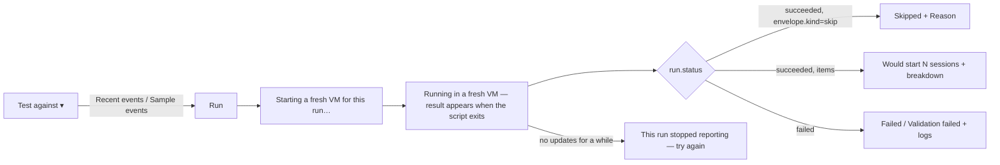

# C — Preflight code step and webhook trigger credentials (Devin 3.10.31)

Evidence: captured app.devin.ai bundle 2026-09-20, formatted copies in `_work/formatted/`. Citations are `chunk.js:line` against those formatted files unless marked _(minified)_. Data model (Automation, Trigger, Action, run/event records) is covered in `A-*` and `B-*` in this folder and is referenced, not repeated.

## What this proves

Devin's "Preflight check" is a per-automation `code_step`: a user-authored Python script (default runtime; other runtimes exist behind a select) that the server runs in a fresh VM after every trigger event, with a file-based contract (`$EVENT_FILE`, `$STATE_FILE`, `$LAST_RUN_FILE`, `$OUTPUT_FILE`) letting it **allow**, **skip with reason**, or **emit deduplicated work items** that fan out into sessions (capped per run). The client owns the whole editing surface (config card, script dialog, secrets picker, test-run against recent/sample events, run-detail drawer), while execution, state storage, dedup history and the run record are **REMOTE**. The `WebhookConfigModal-*` chunk named in the task is **not** an automations component: it is the Connections/Integrations modal used by GitLab, Bitbucket Data Center and Azure DevOps to show a per-connection inbound webhook URL and a show-once secret token. The automation-level webhook trigger (`webhook:incoming`) is implemented inline in `AutomationEditorPage`, and it is documented here alongside the modal because the two share the same credential lifecycle (URL derived client-side, secret shown once, destructive regenerate).

## 1. Preflight code step

### 1.1 Script contract (PROVEN — i18n `automations.codeStep.contractBody`, `_work/automations/codestep-i18n.txt:30`)

| File env var     | Direction                          | Content                                                                    |
| ---------------- | ---------------------------------- | -------------------------------------------------------------------------- |
| `$EVENT_FILE`    | read-only                          | the trigger event as JSON                                                  |
| `$STATE_FILE`    | read/write, persisted between runs | user JSON, **<= 64 KB**                                                    |
| `$LAST_RUN_FILE` | read-only                          | `{"items":[{key,status,session_id}]}` — outcome of items emitted last time |
| `$OUTPUT_FILE`   | must be written                    | one of the three envelopes below                                           |

Output envelopes (PROVEN, same key):

```json
{"run": true}
{"run": false, "reason": "..."}
{"items": [{"id": "...", "version": "...", ...}]}
```

- `items[].id` is the unit of work / dedup key; adding `version` re-opens an already-handled id (PROVEN, contractBody).
- Items are capped **10 per run (max 50)**; extras run next time ("deferred") or are dropped past the hard cap (PROVEN: contractBody; `previewBreakdownDeferred`, `previewBreakdownDropped` i18n keys 95–98).
- An item whose session **failed** is released back so it can be emitted again (PROVEN, contractBody).
- The 64 KB state limit surfaces in the UI as `stateSummary: {{size}} / {{max}}KB` and `clearState` (i18n 31–32); `Clear state` wipes `$STATE_FILE` **and** the already-handled item-id history (i18n 59–61, confirm word typed by the user, key 28/62).

The exact JSON `status` vocabulary inside `$LAST_RUN_FILE.items[]` and the server-side dedup algorithm are **REMOTE/UNKNOWN**; the client only shows aggregates.

### 1.2 Config object (PROVEN — `AutomationEditorPage-aTs05MdH.js:1170-1240`)

The editor keeps a local draft and normalises the server config through `Ze()`:

```ts
{
  enabled: boolean,
  runtime: string,                 // default `python` (:1172)
  timeout_seconds: number,         // default uo = 60 (:2016)
  environment: { kind: 'minimal' } | { kind: 'snapshot', snapshot_id: string },   // Xe(), :1193-1198
  secret_names: string[],          // deduped + sorted, j() :1199
  source: string,                  // script body; default template ho.python (:1177, :2020)
}
```

Server additionally returns `updated_at` (PROVEN :1191, :1382 → "edited {{time}}"); `updated_at ?? 'never-saved'` is the reset key for the draft (:1191). `vo` (:2158) is the empty/default config used when no server config exists.

Rules visible in the client:

- Timeout copy: "Timeout for when script is killed and the run marked failed. {{max}} seconds max." (i18n 15). The `{{max}}` value is passed at render time; the constant itself was not pinned in budget — **PROJECTED** that it is a server-published or bundled limit; treat as REMOTE until pinned.
- Environment select: "Minimal environment" vs. a snapshot (i18n 11–13; :1193). Snapshot identity is the org's Devin machine snapshot (**PROJECTED** from `snapshot_id`; snapshot list source not traced here).
- Secrets: only org secrets selected here are injected (`egressWarning`, i18n 29); when the draft references a secret that no longer exists it is tagged "No longer exists — removed on save" (i18n 24) and filtered out via `$e` (:1208-1211). Saving or test-running a config with secrets requires the manage-org-secrets permission (`secretsPermissionRequired`, i18n 64).
- Server-changed detection: if the server config's `updated_at` moves while a local draft is dirty, the banner `serverConfigChanged` + `discardLocalDraft` shows (i18n 33–34; PROVEN via `Ye`/`Ge` keyed snapshot :1189-1191, DERIVED for the comparison).

### 1.3 Save payload shape (PROVEN)

The code-step card exposes `getSavePayload()` / `requiresSave` / `isDirty` through `useImperativeHandle` (:1317). The automation create and update mutations spread it as an optional top-level key:

```ts
// create (:3778, :3785) and update (:4850, :4880)
{ name, triggers, actions, enabled, ...(codeStep ? { code_step: codeStep } : {}), max_acu_limit, invocation_limit, ... }
// code-step-only save (:4924-4925)
updateAutomation({ automationId, params: { code_step: codeStep } })
```

`code_step` therefore rides the normal automation PUT/POST documented in `B-*`; there is no separate config write endpoint (DERIVED: no `code-step/config` POST exists in the API table below).

### 1.4 HTTP surface (PROVEN — `app-initial-CHtLS52L.js`, minified; function names `_o vo yo bo xo So Co wo To`)

| Purpose                              | Method + path                                                            |
| ------------------------------------ | ------------------------------------------------------------------------ |
| Read saved config                    | `GET {base}/automations/{id}/code-step/config`                           |
| Clear state + dedup history          | `DELETE {base}/automations/{id}/code-step/state`                         |
| Run detail                           | `GET {base}/automations/{id}/code-step/runs/{runId}`                     |
| Recent real events for test-run      | `GET {base}/automations/{id}/code-step/recent-events`                    |
| Sample events for a saved automation | `GET {base}/automations/{id}/code-step/sample-events`                    |
| Start test run (saved automation)    | `POST {base}/automations/{id}/code-step/test-runs` `{json: body}`        |
| Sample events for an unsaved draft   | `GET {base}/automations/code-step/sample-events?event_type=…` (repeated) |
| Start test run (draft)               | `POST {base}/automations/code-step/test-runs` `{json: body}`             |
| Draft test-run detail                | `GET {base}/automations/code-step/runs/{runId}`                          |

Query keys: `automation-code-step/config`, `automation-code-step/recent-events`, `automation-code-step/sample-events`, `automation-code-step-run` (PROVEN, same chunk). `{base}` is the org-scoped API root used by every other automations call (see `B-*`). The test-run request body is **PROJECTED** as `{ config draft, event selector }` — the client builds it from the current draft (`et`, :1213-1223) plus the chosen recent/sample event; exact field names were not pinned.

### 1.5 Test-run UI (PROVEN copy, i18n 75–98; layout `AutomationEditorPage-aTs05MdH.js:900-1130`)



- Event picker groups: **Recent events** (`{{eventType}} · {{when}}`, with ` · manual run` suffix for Run-now events) and **Sample events** (`Sample: {{name}} ({{eventType}})`). Empty states: `testRunNoEvents`, and for unsaved drafts `testRunNoDraftSamples` ("Save the automation to test against real events") — drafts can only use the org-wide sample-events endpoint (DERIVED from §1.4).
- Result card ("Test result") renders the same run-detail component as production runs (§1.6) with a **preview** block: `wouldStart_{one,other}`, `previewBreakdownDuplicates` ("already handled"), `previewBreakdownDeferred` ("deferred past the cap of {{cap}}"), `previewBreakdownDropped` ("dropped past the cap"). A test run never starts sessions (DERIVED: "Would start" wording + preview counters).
- The detail is polled via the `code-step/runs/{id}` endpoint until terminal; staleness is client-derived (§1.6). Polling interval **UNKNOWN** (not pinned).

### 1.6 Run detail and status derivation (PROVEN — `CodeStepRunDetail-kBCiEcEW.js:54-66, 74-93, 94-224, 225-290, 300-307`)

Run record fields read by the client (PROJECTED shape from property reads):

```ts
{
  id?: string, code_step_run_id?: string,
  status: 'failed' | 'succeeded' | string,     // anything else = in progress
  error_class?: string,                          // 'validation' → "Validation failed"
  error_message?: string,
  exit_code?: number, wall_seconds?: number, created_at: string,
  logs?: string,                                 // single blob; no stdout/stderr split
  envelope?: { kind: 'skip', reason?: string } | { kind: 'items', items: object[] },
  preview?: { dispatch_count, duplicate_count, deferred_count, dropped_count, items_cap },
}
```

Badge derivation (PROVEN :54-66):

| Condition                                             | Badge (i18n)                                                             |
| ----------------------------------------------------- | ------------------------------------------------------------------------ |
| `status === 'failed' && error_class === 'validation'` | Validation failed                                                        |
| `status === 'failed'`                                 | Failed                                                                   |
| `status === 'succeeded' && envelope.kind === 'skip'`  | Skipped                                                                  |
| `status === 'succeeded'`                              | Ran (`runMetaRan: ran {{seconds}}s`, `runExitCodeInline: exit {{code}}`) |
| otherwise, `created_at` older than the stale window   | Stopped reporting                                                        |
| otherwise                                             | Running…                                                                 |

The stale threshold constant is in the chunk but was not pinned to a number here (DERIVED existence; value UNKNOWN). Items list shows `Items · {{count}} emitted`, each item labelled by its `id`/`key` or `item {{index}}` fallback. Logs panel: heading "Logs", empty "No logs", **Copy** and **Download** (`preflight-run-<id>.log`). Production runs are reached from the automation view's event row via "View preflight check run" (`viewRun`, i18n 39) opening the "Preflight run" drawer (`runDetailsTitle`), with `runDetailsLoadError` on failure. On the automation view page the event feed shows `noEventsPreflight` when a preflight is configured but no trigger has fired yet (i18n 56–57).

### 1.7 Editor surface map (PROVEN line ranges, `AutomationEditorPage-aTs05MdH.js`)

| Range                           | What                                                                                                                                                                                                       |
| ------------------------------- | ---------------------------------------------------------------------------------------------------------------------------------------------------------------------------------------------------------- |
| 732–749                         | save mode: code-step-only save vs. full automation save                                                                                                                                                    |
| 900–1130                        | test-run controls + result card                                                                                                                                                                            |
| 1169–1330                       | config query, draft state, `getSavePayload`, secrets filtering, server-change detection                                                                                                                    |
| 1372                            | environment select                                                                                                                                                                                         |
| 1382–1840                       | Preflight card: toggle (`switchLabel`), Runtime, Script row with "edited {{time}}" + Edit/View script, Environment, Timeout, Secrets summary + picker, State summary + Clear state, "Script contract" info |
| 1890–1970                       | Edit script dialog (`editScriptTitle`, `saveScript`, `cancel`)                                                                                                                                             |
| 2016, 2020, 2158                | constants `uo=60` (default timeout), `ho` (default source per runtime), `vo` (empty config)                                                                                                                |
| 3778–3785, 4850–4880, 4924–4925 | `code_step` in create/update payloads                                                                                                                                                                      |

## 2. Webhook credentials

### 2.1 Automation webhook trigger (`webhook:incoming`) — PROVEN, `AutomationEditorPage-aTs05MdH.js`

| Piece                                       | Evidence                                                                                                                                                                                                                                                                    |
| ------------------------------------------- | --------------------------------------------------------------------------------------------------------------------------------------------------------------------------------------------------------------------------------------------------------------------------- |
| Trigger `event_type === 'webhook:incoming'` | :3493, :4506-4507                                                                                                                                                                                                                                                           |
| Inbound URL, built client-side              | `` `${host}/api/webhooks/automations/${orgId}/${automationId}` `` :3513 (create flow, host from `host-embedded` `Cn()` :592), :4322 (edit flow); view page `AutomationViewPage-gJdoaFXK.js` _(minified)_ same template                                                      |
| Secret provisioning                         | on first add of a webhook trigger the editor calls `Ht()` (create: `_()` :3496-3506; edit: `oe(automationId)` :4509-4514), response `{ automation_id, webhook_secret, webhook_secret_hash }`                                                                                |
| Secret binding to the trigger               | `Fi(conditions, hash)` injects a hidden condition `field: '_webhook_secret_hash'` into the trigger before save (:3773, :4868); `is()` strips `_webhook_secret_hash` and keeps other `_webhook_*` fields when building the display/edit conditions (:3009-3030)              |
| Secret display                              | `webhookSecret: secret ?? regeneratedSecret` (:5307) with note `automations.webhookSecretNote` / `…NoteSaved` / `…NoteShort` (:3925, :5308-5311); `showWebhookTestCommand: true` renders a curl-style test snippet (:3926, snippet body in TriggerEditor chunk, not traced) |
| Regenerate                                  | only for saved automations (`onRegenerateWebhookSecret` undefined while `ui`/unsaved, :5314); confirm dialog `regenerateWebhookSecretTitle/Description`, destructive, calls `Ft().run(automationId)` and shows `data.webhook_secret` once (:5823-5838)                      |

The secret is **shown once** in the client state only (`ri`/`Xr` React state, :4503-4505); reloading the page loses it (DERIVED). Hash algorithm, verification header name and replay protection are **REMOTE/UNKNOWN**. `Ht`/`Ft` resolve to `rr`/`ar` in `app-initial-CHtLS52L.js` (:556, :565); their URL literals were not pinned — **REMOTE/UNKNOWN** path, PROJECTED as `POST {base}/automations/{id}/webhook-secret`-style create/regenerate endpoints.

### 2.2 `WebhookConfigModal-CKjtxtUP.js` — integrations modal (PROVEN)

Pure presentational; props :22-33: `isOpen, onClose, accountName, providerName, accountNamePrefix, webhookData, isLoading, onRegenerate, regenerateLoading, instructions`. Callers _(minified)_: `gitlab-CXxMpD_2.js` (prefix `@`, "GitLab"), `bitbucket-BKQ3kDwA.js` ("Bitbucket Data Center"), `azure-devops-Bc4EObmz.js` ("Azure DevOps"); each passes a query hook result as `webhookData` and a mutation `mutateAsync` as `onRegenerate`.

- `webhookData` shape (PROJECTED from reads): `{ webhook_url: string, token: string | null }`. `token === null` means "already issued" → masked `••••••••••••••••` and the **Regenerate token** link appears (:45-46, :105-116); a non-null token is shown in clear with copy button and the note "The token is only shown once when first created for your security" (:140-144).
- Title `Webhook configuration for {prefix}{accountName}` (:44); sections **Configuration** (URL + copy, Secret Token + copy) and **Setup** (`instructions` node, provider-specific numbered steps and docs links; GitLab: "Devin sets up these webhooks for you on every project and group its GitLab account can administer… Use the steps below only for projects it cannot reach").
- Regenerate confirm (:172-180): "You'll need to update the webhook configuration in {providerName}. The current token will be revoked."; toasts "Webhook token regenerated successfully" / "Failed to regenerate webhook token" (:39-41). Loading copy "Loading webhook configuration..." (:61).
- Endpoint paths for fetch/regenerate live in the per-provider chunks and are **REMOTE/UNKNOWN** here (pointer for the integrations track).

## 3. T3 mapping (proposals)

- **code_step ⇢ a per-automation "preflight" hook run by a reactor.** T3 has no sandbox VM; propose running the script as a subprocess in the project's environment with a temp dir holding `EVENT_FILE/STATE_FILE/LAST_RUN_FILE/OUTPUT_FILE`, `timeout_seconds` enforced by the reactor, and `STATE_FILE`/handled-ids persisted as events (`AutomationPreflightStateReplaced`, `AutomationPreflightRunRecorded`) so the run detail is a projection. Keep the exact envelope contract so Devin scripts port unchanged.
- **Secrets ⇢** T3 has no org-secrets store; map `secret_names` to an allowlist of env var names read from the environment's `.env`/settings, surfaced in the same picker. Snapshot environments have no analogue → "Minimal environment" only.
- **Test run ⇢** `automation.preflight.testRun` request → receipt-emitting reactor; result streamed over the existing WebSocket instead of polling.
- **Webhook trigger ⇢** an HTTP route on the T3 server (`/api/webhooks/automations/:automationId`) that verifies an HMAC of the body with a per-automation secret stored in the environment's secrets file; secret shown once in the editor, regenerate as a command → event. Remote/tunnel modes must expose the route through T3 Connect for external callers.
- **Integrations modal ⇢** reuse for GitLab/Bitbucket/ADO connections if the integrations track adopts inbound webhooks; identical show-once + regenerate semantics.

## 4. Evidence appendix

- `_work/formatted/CodeStepRunDetail-kBCiEcEW.js`: :54-66 badge derivation; :74-93 meta row; :94-224 items/preview/reason; :225-290 logs + copy/download; :300-307 export.
- `_work/formatted/AutomationEditorPage-aTs05MdH.js`: :556,:565,:592 imports; :732-749; :900-1130; :1170-1240; :1317; :1372; :1382-1840; :1890-1970; :2016; :2020; :2158; :3009-3030; :3493-3513; :3773-3785; :3924-3926; :4322; :4503-4514; :4850-4880; :4924-4925; :5307-5314; :5823-5838.
- `_work/formatted/WebhookConfigModal-CKjtxtUP.js`: :22-46, :61, :82-92, :105-144, :172-180.
- `reference/web-2026-09-20/assets/app-initial-CHtLS52L.js` _(minified)_: code-step endpoints and query keys; `gitlab-CXxMpD_2.js`, `bitbucket-BKQ3kDwA.js`, `azure-devops-Bc4EObmz.js` _(minified)_: modal callers.
- i18n: `_work/automations/codestep-i18n.txt` (from `en-CsbykFSh.js`, `automations.codeStep.*`).
- Working notes: `_work/automations/NOTES-C-codestep-webhook.md`.
