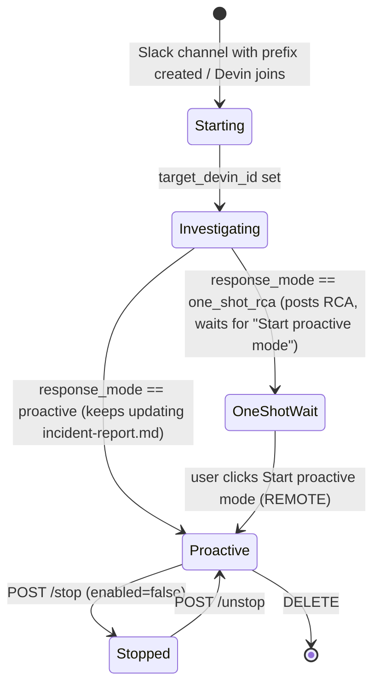

# D — On-call: responders, incidents, reports (Devin 3.10.31)

Evidence labels: **PROVEN** (literal string/route/field cited at `chunk.js:line`), **PROJECTED** (shape implied by properties the client reads), **DERIVED** (unavoidable from proven control flow), **REMOTE/UNKNOWN** (server-side; not invented). Formatted chunk roots: `F=_work/formatted/`, `AF=_work/automations/formatted/`, `RAW=reference/web-2026-09-20/assets/` (unformatted; cited by field name only). Companion docs: `A-changelog-and-data-model.md` (§2 covers the OncallIncidentSettings dialog), `B-t3-code-mapping-proposal.md`.

## 0. What this proves

Devin "Oncall" (`/oncall`) is a thin product surface layered on the same automation engine documented in A/B. **PROVEN**: a _responder_ is an automation (`automation_id`, `enabled`, `triggers[]`, `actions[]` with one `triage_session` action carrying `slack_config` or `pagerduty_config`, plus `tags`, ACU/invocation limits, `net_policy`, `recommended_mcps`, `run_as_user`) created through a dedicated `/oncall/responders` API rather than `/automations` (`F/ResponderEditorPage-xwC4wC-m.js:560-640`). **PROVEN**: an _incident_ is likewise an automation whose action is `incident_session` and whose "stopped" state is simply `enabled === false` (`F/app-initial-DVNuq5ff.js:1391-1435`, `F/OncallPage-Day6NVe5.js:975-1044`). **PROVEN**: a _report_ groups responders (by ids or by tag match) and owns a _digest_ automation triggered by `schedule:recurring` with an `rrule` condition (`RAW/ReportSheet-019F1ADk.js`). The one-time _setup_ flow (`not_started → initializing → ready | failed`) is a server job the client only polls (`F/OncallPage:176-217`); what Devin "learns" during the ~1-2h initialization is **REMOTE/UNKNOWN**. Session tagging (`oncall_responder`, `oncall_incident`, `oncall_digest`) is how the product distinguishes on-call sessions from ordinary ones (**PROVEN** constants). For T3 Code this feature is a **likely non-goal**: it depends on Slack/PagerDuty inbound event ingestion, an org-level "learning" job, telemetry MCP catalogs and billing tags that T3 does not have; the only transferable idea is a "responder" preset for the generic automations model (see §8).

## 1. Routes, nav, tabs

| Route                                        | Purpose                                                           | Evidence                                                                                              |
| -------------------------------------------- | ----------------------------------------------------------------- | ----------------------------------------------------------------------------------------------------- |
| `/_user/oncall/`                             | OncallPage; `search.tab` → `initialTab`                           | **PROVEN** `F/app-initial-tbOtyZLY.js:2062`, `AF/oncall-Bay9syzq.js:7-13`                             |
| `/_user/oncall/$id`                          | Responder detail; breadcrumb back to `/oncall?tab=alerts`         | **PROVEN** `tbOtyZLY:2682`                                                                            |
| `/_user/oncall/$id_/edit`                    | ResponderEditorPage (edit); create uses same page without id      | **PROVEN** `tbOtyZLY:3961`, editor navigates to `/oncall/$id` on save (`ResponderEditorPage:609,638`) |
| `/_user/oncall/reporting/$id`                | Report detail + runs; crumb to `/oncall?tab=reports`              | **PROVEN** `tbOtyZLY:3899`, `OncallPage:1775`                                                         |
| `/_user/settings/_org/connections/pagerduty` | PagerDuty connection (webhook secret / subscription id)           | **PROVEN** `AF/pagerduty-CLMLCjc4.js:255-315,1039`                                                    |
| `/sessions/$id?tab=incident-report.md`       | Deep link from an incident row into the session's report artifact | **PROVEN** `OncallPage:1015`                                                                          |

Tabs (**PROVEN** `OncallPage:2525-2603`): `overview`, `alerts` (responders list), `incidents`, `reports`, `context` ("Skills & Context" — org on-call skill files, editable; copy `oncall.context*`). Header uses `nav.oncall` + `oncall.subtitle`; the page checks the org frozen state (`st().state==='frozen'`) before allowing mutations. Sidebar active state via `isOncallNavActive` (**PROVEN** `F/app-initial-Cklb5-Wy.js:655,684`).

## 2. API surface (23 client functions)

All under `${orgBase}/oncall/…` (**PROVEN** `F/app-initial-DVNuq5ff.js:2167-2193`). Response bodies are **PROJECTED** from what the UI reads unless noted.

| #   | Method | Path                                       | Body / params                                                              | Notes                                                                                                                                            |
| --- | ------ | ------------------------------------------ | -------------------------------------------------------------------------- | ------------------------------------------------------------------------------------------------------------------------------------------------ |
| 1   | GET    | `/oncall/setup`                            | —                                                                          | `{status: not_started\|initializing\|ready\|failed}`; polled every 30 s while `initializing` (`OncallPage:179-182`)                              |
| 2   | POST   | `/oncall/setup/start`                      | —                                                                          | starts the learning job; response is written straight into the `['oncall-setup', org]` query cache (`OncallPage:205`)                            |
| 3   | GET    | `/oncall/responders`                       | —                                                                          | list; `staleTime` 30 s, key `[...automations.all(org),'oncall-responders']` (`DVNuq5ff:2199-2330`)                                               |
| 4   | GET    | `/oncall/responders/{id}`                  | —                                                                          | no retry on 403/404                                                                                                                              |
| 5   | POST   | `/oncall/responders`                       | see §3                                                                     | returns `{automation_id,…}`                                                                                                                      |
| 6   | PATCH  | `/oncall/responders/{id}`                  | see §3; also `{enabled}` for toggle (shares automation optimistic helpers) |                                                                                                                                                  |
| 7   | PUT    | `/oncall/responders/{id}/session-tags`     | `{session_tags: string[]}`                                                 | separate call; ordered before or after PATCH depending on `run_as_user` transition (`ResponderEditorPage:565-607`)                               |
| 8   | DELETE | `/oncall/responders/{id}`                  | —                                                                          | invalidates automations `all` + `tags`                                                                                                           |
| 9   | GET    | `/oncall/incidents/settings`               | —                                                                          | see A §2                                                                                                                                         |
| 10  | PUT    | `/oncall/incidents/settings`               | settings object                                                            |                                                                                                                                                  |
| 11  | GET    | `/oncall/incidents`                        | —                                                                          | list of incident automations                                                                                                                     |
| 12  | DELETE | `/oncall/incidents/{id}`                   | —                                                                          |                                                                                                                                                  |
| 13  | POST   | `/oncall/incidents/{id}/stop`              | —                                                                          | sets `enabled=false` (**DERIVED**)                                                                                                               |
| 14  | POST   | `/oncall/incidents/{id}/unstop`            | —                                                                          | resume                                                                                                                                           |
| 15  | GET    | `/oncall/reports`                          | —                                                                          |                                                                                                                                                  |
| 16  | POST   | `/oncall/reports`                          | see §5                                                                     |                                                                                                                                                  |
| 17  | PATCH  | `/oncall/reports/{id}`                     | see §5                                                                     |                                                                                                                                                  |
| 18  | DELETE | `/oncall/reports/{id}`                     | —                                                                          | copy warns digest automation is deleted too                                                                                                      |
| 19  | GET    | `/oncall/stats?days=N`                     | `days`                                                                     | `{buckets:[{date,investigated,grouped}], totals:{investigated,grouped,noise_filtered,prs_merged,…}}` (**PROJECTED** `OncallPage:2216,2322,2366`) |
| 20  | GET    | `/oncall/reports/{id}/runs`                | —                                                                          | see §5                                                                                                                                           |
| 21  | GET    | `/oncall/reports/{id}/digest`              | —                                                                          | returns the digest **automation**                                                                                                                |
| 22  | POST   | `/oncall/reports/{id}/digest`              | digest params                                                              | create/replace digest                                                                                                                            |
| 23  | PUT    | `/oncall/reports/{id}/digest/session-tags` | `{session_tags}`                                                           |                                                                                                                                                  |

REMOTE/UNKNOWN: server-side matching of Slack/PagerDuty events to responders, dedupe ("grouped"/"noise_filtered"), report generation, and the setup job.

## 3. Responders

### 3.1 Constants (PROVEN `F/app-initial-DVNuq5ff.js:1391-1435`)

| Concept                     | Values                                                                                                                                   |
| --------------------------- | ---------------------------------------------------------------------------------------------------------------------------------------- |
| `devin_mode`                | `normal`, `fusion`, `fast`, `ultra`                                                                                                      |
| `response_mode` (incidents) | `proactive`, `one_shot_rca`                                                                                                              |
| Session tag keys            | `oncall_responder='true'`, `oncall_incident`, `oncall_digest`                                                                            |
| PagerDuty events            | `pagerduty:incident_triggered` (default), `pagerduty:incident_acknowledged`, `pagerduty:incident_resolved`, `pagerduty:incident_updated` |
| Slack events                | `slack:message`, `slack:usergroup_mentioned`                                                                                             |
| Source detection            | `so(e)`: `actions.find(type==='triage_session')?.pagerduty_config ? 'pagerduty' : 'slack'`                                               |
| Incident action             | `ro(e)`: `actions.find(type==='incident_session')`; stopped ⇔ `!e.enabled` (`co`)                                                        |

Mode gating (**PROVEN** `AF/useOncallDevinMode-pjQid10b.js:58-66`): a requested mode is only honored if the org feature-flag item for that mode is enabled, else it falls back to `normal`; `d()` = gate for `ultra`. Picker UI: `F/OncallAgentModePicker-WF_1bDUy.js`. The same module exports a helper (`:5-52`) that auto-deselects user-scoped MCPs when `run_as_user` is turned off and surfaces the removed names as a warning.

### 3.2 Editor payload (PROVEN `F/ResponderEditorPage-xwC4wC-m.js:560-640`)

Create `POST /oncall/responders`:

```jsonc
{
  "name": "…",
  "runbook": "…",                        // optional free text, oncall.runbookLabel
  "source": "pagerduty" | "slack",       // slack only sent when explicitly chosen (Nt)
  "pagerduty_connection_id": "…",        // pagerduty only; from connection query or existing pagerduty_config
  "triggers": [{ "event_type": "slack:message", "conditions": [[{ "field": "channel", "operator": "eq", "value": "C0…" }]] }],
  "enabled": true,
  "max_acu_limit": 10 | null,
  "invocation_limit": n | null, "invocation_limit_window_seconds": s | null,
  "devin_mode": "normal",
  "platform": "…" | null,               // sandbox/platform selector
  "tags": [{ "key": "…", "value": "…" }], // "Metadata" UI; used by report tag matching
  "recommended_mcps": ["name", …],
  "slack_tool_channels": [[workspace_id, channel_id], …],  // slack only, only when any private channel
  "linear_tools_enabled": bool,
  "net_policy": {...} | null,
  "run_as_user": bool,
  "slack_reply_access": "…",             // slack only
  "session_tags": ["tag"]                // optional, single tag (billing)
}
```

PATCH adds `clear_platform`, `clear_max_acu_limit`, `clear_invocation_limit`, `clear_net_policy` booleans and omits unchanged fields; `session_tags` go through the separate PUT. **PROVEN** defaults: the action created for a new responder is `{type:'triage_session', setup_prompt, pagerduty_config:{connection_id:''}}` or `{…, slack_config:{source_channel_id:''}}` (`:144-145`). Condition editing (`:153-170`): conditions are OR-of-AND groups (`conditions: Condition[][]`); `slack:usergroup_mentioned` forces a `usergroup` field in every group; PagerDuty event labels come from the org webhook-event catalog `e.pagerduty[].{event_type,name}` (`:132`). Validation copy: `oncall.nameRequired`, `channelRequired` (every Slack group must include a `channel` field, `:483,513`), `conditionIncomplete`, `triggerDuplicate`, `metadataIncomplete`, `sessionTagRequired` / `sessionTagPtsRequired`, `pagerDutyNotConnected*`.

Responder object read back (**PROJECTED**): `automation_id, name, enabled, triggers, actions, runbook, devin_mode, platform, tags, recommended_mcps, slack_tool_channels, linear_tools_enabled, net_policy, run_as_user, slack_reply_access, max_acu_limit, invocation_limit, invocation_limit_window_seconds, session_tags, created_at, created_by`. List row counts use `oncall.responderEventCount` / `responderIssueCount` (i18n) — per-responder event/issue totals are **REMOTE/UNKNOWN** in shape.

Responder detail page (`/oncall/$id`) supports "Run responder" (`oncall.runResponder`, manual invocation dialog) — **PROVEN** copy only; the endpoint is the generic automation run path, not one of the 23 oncall fns (**DERIVED**).

## 4. Incidents

**PROVEN** `F/OncallPage-Day6NVe5.js:975-1044`: an incident row is an automation record: `automation_id`, `name`, `created_at`, `enabled`; its `incident_session` action carries `slack_config.source_channel_id` / `channel_name`, `target_devin_id` (main session), `initial_devin_id`, `initial_investigation` (bool), `response_mode`. Columns: Incident (channel), Session, Started (`oncall.incident*Column`). Link to `/sessions/$id?tab=incident-report.md` is shown when `target_devin_id && (!initial_investigation || response_mode==='proactive')`, otherwise `oncall.incidentNoSessionYet` ("Starting..."). Stop/Resume mutate `{incidentId, stopped}` → `/stop` or `/unstop`; badge `oncall.incidentStoppedBadge`.

Incident settings (`GET/PUT /oncall/incidents/settings`; dialog at `OncallPage:550-700`, detailed in A §2): `enabled` (requires Slack org connection — `incidentEnabledNoSlack`), `channel_prefix` (default placeholder `incident-`), `auto_join` (needs Slack scope re-auth — `incidentAutoJoinMissingScope`), `allow_non_org_mentions`, `devin_mode`, `initial_investigation_mode`, `thread_session_mode`, `response_mode`, `mcps`, `postmortem_template`. Enum validation sets built at `:550`. Field names beyond those in A §2 are **PROJECTED** from i18n keys.



## 5. Reports and digests

Report row (**PROVEN** `F/OncallPage-Day6NVe5.js:1772-1806`): `report_id`, `name`, `responder_automation_ids[]`, `created_at`, `created_by`; list search filters by name or creator (`:1816-1822`).

Report editor (`RAW/ReportSheet-019F1ADk.js`, **PROVEN** by field names in the unformatted chunk):

- Match-by mode `tags` (metadata `responder_tags` map) or `pick` (`responder_automation_ids`); `incidents_match` free-text prompt or `null` (i18n `oncall.reporting.matchBy*`, `incidentsMatch*`).
- `POST /oncall/reports` body: `{name, responder_tags|null, responder_automation_ids[], incidents_match|null, digest_rrule?, digest_prompt, digest_slack_channel_id?, digest_session_tags?:[tag]}`.
- `PATCH /oncall/reports/{id}` body: `{name, responder_tags, responder_automation_ids, incidents_match}` only; digest changes go through the digest endpoints.
- Digest GET returns an automation: the sheet finds `triggers[event_type==='schedule:recurring']` and reads the `rrule` condition value; schedule phrases reuse `automations.schedule{Hourly,Daily,Weekly}Phrase`; `enabled`, notifications (`slack_channel_id`), instructions (`digest_prompt`) editable; `noSessionAction` copy covers digests whose automation has no session action.
- Delete warns the digest automation is deleted too and responders are untouched (`oncall.reporting.deleteReportConfirm`).

Runs (`RAW/reporting._id-DHQIrsq_.js`, **PROVEN** field names; shape **PROJECTED**): `GET /oncall/reports/{id}/runs` → `[{run_id, report: string|null, summary, sections:{counts:{…}, prs:[{state:'merged'|'open'|'draft', pr_url, title, merged_at, created_at}]}}]`. Newest run labelled `runPeriodLatest`; previous run used for count deltas; a "Generating…" state is shown for up to 10 min after a manual `generateReport`. Stats panel (`OncallPage:225-231, 2211-2330`): stacked bars `investigated` + `grouped` per bucket; totals also include `noise_filtered` and `prs_merged`.

## 6. Setup wizard

**PROVEN** `OncallPage:176-217` and i18n `oncall.setup.*`: three steps — Connect tools (telemetry MCP catalog: Datadog, Grafana, Sentry, Honeycomb, New Relic; skippable), Initialization (`POST /oncall/setup/start`, status polled every 30 s, copy says ~1-2 hours, toasts `readyToast`/`failedToast`), Ready (three "done" cards: resources, memories, skills). `noPermission` copy gates start to admins. Empty state before setup: `setup.emptyHeading` + `beginSetup`/`continueSetup`. What the initialization job does is **REMOTE/UNKNOWN**.

## 7. i18n

Full `oncall.*` namespace (302 keys) is captured verbatim at `_work/automations/oncall-i18n.json` (**PROVEN**, extracted from the `en-*.js` chunk). Sub-namespaces: root (responder editor, incidents, toasts), `reporting.*` (+ `digestSheet.*`, `run.*`), `setup.*`.

## 8. T3 mapping (proposal)

Recommendation: **non-goal for T3 Code as a product feature.** Every load-bearing piece is server/org infrastructure T3 lacks: inbound Slack/PagerDuty event ingestion with signed webhooks, an org-wide "learning" job, telemetry MCP catalog, billing session tags, and multi-hour incident sessions shared across a team. T3's model is one environment / one user driving agents.

If anything transfers, it is a _thin preset_ on the generic automations model from doc B:

- A "responder" is just an automation with a webhook trigger (generic HTTP payload, no Slack/PD parsing) and a session action whose prompt template is the runbook. No dedicated routes or API — reuse `/automations` and tag the automation `preset: responder`.
- `devin_mode` → T3 provider model/effort selector already on a thread; `response_mode` collapses to "stop after first report" vs "keep going", which is the automation's existing max-turns/loop option, not a new field.
- Incidents (channel-prefix auto-join, `incident-report.md` artifact) and reports/digests: **do not port**. A weekly summary of automation runs is at most a future "digest" schedule preset over run history.
- Session tags → T3 has no billing tags; skip.

## 9. Evidence appendix

| Claim                                                             | Citation                                                                                    |
| ----------------------------------------------------------------- | ------------------------------------------------------------------------------------------- |
| 23 API fns, literal paths                                         | `F/app-initial-DVNuq5ff.js:2167-2193`                                                       |
| Query keys, staleTime, invalidation, toggle helpers               | `F/app-initial-DVNuq5ff.js:2199-2330`                                                       |
| Modes, response modes, tag keys, event enums, `ro/so/co` helpers  | `F/app-initial-DVNuq5ff.js:1391-1435`                                                       |
| Routes                                                            | `F/app-initial-tbOtyZLY.js:2062, 2682, 3899, 3961`; nav `F/app-initial-Cklb5-Wy.js:655,684` |
| Route → initialTab                                                | `AF/oncall-Bay9syzq.js:7-13`                                                                |
| Setup status polling and start                                    | `F/OncallPage-Day6NVe5.js:176-217`                                                          |
| Incident settings dialog                                          | `F/OncallPage-Day6NVe5.js:550-700`                                                          |
| Incident row fields, session link, stop/resume                    | `F/OncallPage-Day6NVe5.js:975-1044`                                                         |
| Report row fields                                                 | `F/OncallPage-Day6NVe5.js:1772-1806`                                                        |
| Stats shape and overview chart                                    | `F/OncallPage-Day6NVe5.js:225-231, 2211-2330`                                               |
| Tabs and header                                                   | `F/OncallPage-Day6NVe5.js:2525-2603`                                                        |
| Responder default action, condition editing, event labels         | `F/ResponderEditorPage-xwC4wC-m.js:125-170`                                                 |
| Responder create/PATCH payload, session-tags ordering, navigation | `F/ResponderEditorPage-xwC4wC-m.js:560-640`                                                 |
| Validation (channel required, metadata)                           | `F/ResponderEditorPage-xwC4wC-m.js:483, 513-527`                                            |
| Mode gating, run-as-user MCP helper                               | `AF/useOncallDevinMode-pjQid10b.js:5-52, 58-66`                                             |
| PagerDuty webhook secret/subscription, route, permission key      | `AF/pagerduty-CLMLCjc4.js:255-315, 705, 1039`                                               |
| Report/digest payload field names                                 | `RAW/ReportSheet-019F1ADk.js` (unformatted)                                                 |
| Run fields                                                        | `RAW/reporting._id-DHQIrsq_.js` (unformatted)                                               |
| i18n                                                              | `_work/automations/oncall-i18n.json`                                                        |

Gaps: `incident-io-ya_qhXDK` and `microsoft-teams-Jx1onxdT` chunks were not inspected for on-call hooks (no oncall references found in the responder editor sources; **UNKNOWN** whether incident.io feeds responders). ReportSheet/reporting._id were not prettier-formatted, so those citations are field-level only.
