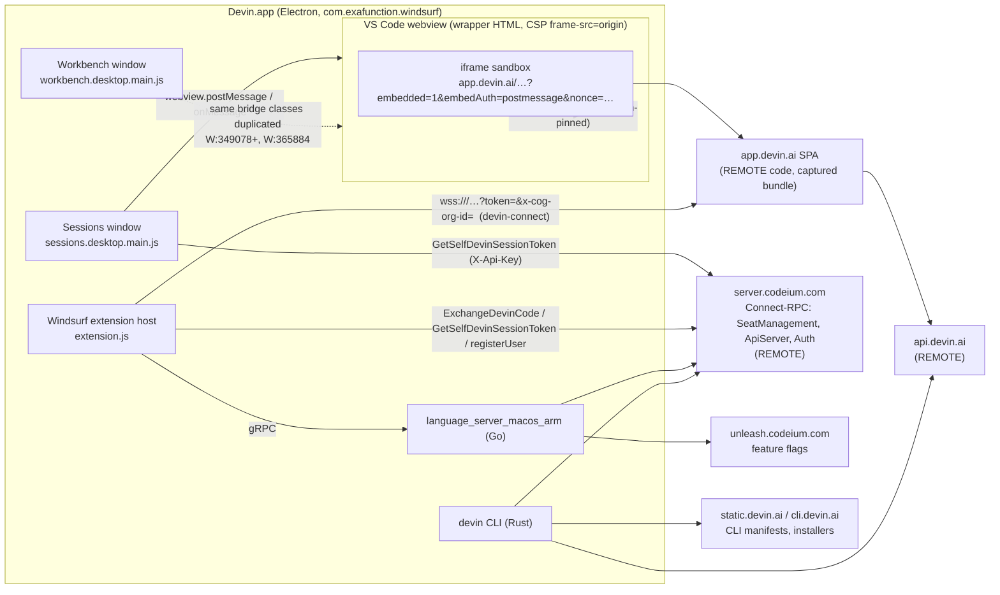
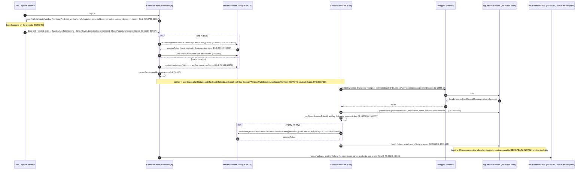

# Devin 3.10.31 desktop — Task A: shell ↔ web-app bridge, network endpoints, auth flow

Citations use `S:` = `_work/formatted-desktop/sessions.desktop.main.js`, `W:` = `…/workbench.desktop.main.js`, `E:` = `…/extension.js` (formatted line numbers). Binaries cited as `devin(strings)` / `ls(strings)`. Labels: **PROVEN** / **PROJECTED** / **DERIVED** / **REMOTE/UNKNOWN**.

## What this proves

Devin.app (bundle `com.exafunction.windsurf`, a Windsurf/VS Code Electron shell) hosts app.devin.ai as a **sandboxed `<iframe>` inside a VS Code webview**, not a BrowserView. The webview HTML is generated at runtime with a CSP whose `frame-src` pins the iframe to a single webapp origin; a nonce'd inline script relays `postMessage` envelopes both ways (**PROVEN** S:1539645-1539718). The wire contract is a protobuf-JSON oneof pair, `exa.desktop_bridge_pb.DesktopToWebMessage` (5 cases) and `WebToDesktopMessage` (11 cases), protocol version **7** (**PROVEN** S:1538727-1539389). The host advertises 9 capabilities, the web app replies with `ready{capabilities}`, and the host then pushes a **Devin session token** (`devin-session-token$…`) via `auth{token,org_id,user_id}` (**PROVEN** S:1555490-1555653). Cold loads time out at **20 000 ms**, warm route switches arm a **5 000 ms** `navigateAck` timer only when the web advertised `navigateAck`; `renderCrash` → reload mode, fatal/timeout → remount mode, one automatic recovery attempt (**PROVEN** S:1555342-1555343, S:1555706-1555864). The web app publishes a **nav manifest** (surfaces = route prefixes) that the shell caches in VS Code storage and turns into sidebar entries with `min_client_version` gating; `ttl_seconds` is stored and never enforced; inbound `activeRoute` paths are not validated against `allowed_route_prefixes`; the wrapper checks `event.origin` only, not `event.source` (**PROVEN**, see Limitations). Auth token minting, code exchange, and everything at `api.devin.ai` / `server.codeium.com` is **REMOTE**.

Not covered here (Task B): Rust CLI docs, ACP message schema, local storage layout.

## Topology

**PROVEN** edges: iframe + CSP (S:1539657, S:1539667); host→webview transport `this._webview.postMessage` / `onMessage` (S:1555640-1555646); session token RPC (S:1555654-1555672); devin-connect WS URL (E:49143-49166); CLI/LS endpoints from `strings` (Endpoints table). **DERIVED**: LS talks to server.codeium.com/unleash (URL literals in binary, no call site readable).

## Embedding

| Aspect | Value | Evidence |
|---|---|---|
| Container | VS Code webview (`acquireVsCodeApi()`), HTML set via `setHtml(txa(url))` | **PROVEN** S:1539669, S:1555542 |
| Inner element | `<iframe id="devin-embed-frame" allow="clipboard-read; clipboard-write" sandbox="allow-scripts allow-forms allow-same-origin allow-downloads allow-popups">` | **PROVEN** S:1539667 |
| CSP | `default-src 'none'; style-src 'unsafe-inline'; script-src 'nonce-<n>'; frame-src <origin>` (`'none'` if origin unparsable) | **PROVEN** S:1539657 |
| Foreign navigation | `securitypolicyviolation` on `frame-src` → `vscode.postMessage({openExternal:{url}})` (http/https only) | **PROVEN** S:1539710-1539716 |
| URL params | `theme`, `embedded=1`, `embedAuth=postmessage`, `surfaceId`, plus `nonce` appended | **PROVEN** S:1538613-1538635 (Q9r), S:1539729 (nxa), S:1555741-1555745 |
| Path must stay same-origin as webapp origin, else fallback | `Q9r` returns `dFn` when `i.origin !== t.origin` | **PROVEN** S:1538627 |
| Webapp origin resolution | `userStatus.planStatus.planInfo.devinInfo.webappHost` (server-provided; `http` if localhost/127.0.0.1) else `devinService.webUrl` | **PROVEN** S:1105606-1105620 |
| `devinService.webUrl` | `devin.environment==="beta"` → `https://app.beta.devin.ai`; quality `stable`/`next` → `https://app.devin.ai`; else `https://staging.itsdev.in` | **PROVEN** S:1105584-1105605 |
| Trusted link domains (product.json) | app.devin.ai, app.beta.devin.ai, docs.devin.ai, *.devinenterprise.com, beta.devinenterprise.com, staging.itsdev.in, *.codeium.com, *.windsurf.com, codeium-staging-exafunction.vercel.app | **PROVEN** S:26555-26573, W:26640 |
| Feature gate | Unleash flag `windsurf-desktop-nav`; enterprise plans additionally need `windsurf-desktop-nav-enterprise`; airgap mode disables portal check | **PROVEN** S:1539622-1539629, S:1105716 |
| Warmup | hidden surface `windsurf.desktopNav.warmup` loads `/desktop-no-surfaces` so the SPA is warm before first click | **PROVEN** S:1555344, S:1555694-1555755 |

### Wrapper relay script (S:1539669-1539717, **PROVEN**)

- `HOST_TO_WEB_KEYS = ['handshake','navigate','setTheme','auth','sidebarAction']`.
- On `message`: if `event.origin === settings.origin` → if `data.forwardKey` re-dispatch a synthetic `KeyboardEvent` in the webview document (so VS Code's keybinding relay sees it), else `vscode.postMessage(data)` up to the host. Otherwise, if any host key is present → `frame.contentWindow.postMessage(data, settings.origin)`.
- The wrapper does **not** check `event.source`; any same-origin frame (e.g. a popup opened with `allow-popups` that navigates back to the origin, or a nested frame in the SPA) could post envelopes.
- Host-side parse is `WebToDesktopMessage.fromJson(e, {ignoreUnknownFields:true})`, drops on parse error (S:1539451-1539456).

## Bridge message contract (`exa.desktop_bridge_pb`, protocol_version 7)

Envelopes are proto-JSON objects with exactly one oneof key (camelCase). Schema **PROVEN** S:1538727-1539374; behaviour **PROVEN** S:1539389-1539505 (wrapper class `xqi`) and S:1555490-1555653 (host controller `Esn`). Capability gating: host only *sends* a message if its own capability set contains the named capability; host only *handles* inbound messages whose capability it advertised, except `ready`, `renderCrash`, `navigateAck` which are always handled (S:1539475-1539486). Host capability list `X_a` (S:1539631-1539641): `navigate, activeRoute, setTheme, deliverAuth, forwardKeyboard, openExternal, publishNav, sidebarRelay, showFind`. `renderNative` is a host capability checked by the workbench surface builder (W:806740) but is not in `X_a` in 3.10.31 (**PROVEN** absence).

### Desktop → Web (`DesktopToWebMessage`, S:1539325-1539334)

| # | Key | Fields | When sent | Timeout / follow-up |
|---|---|---|---|---|
| 1 | `handshake` | `protocolVersion:7`, `capabilities[]`, `electronVersion?`, `nonce`, `keyboardForwardPrefixes[]` (`Meta`,`Control`,`Alt` S:1539643), `allowedRoutePrefixes[]` (manifest item paths + `/desktop-no-surfaces`, S:1555345-1555347) | `announce()` right after inbound `ready` (S:1555518); re-sent whenever the cached manifest changes (S:1555402-1555405) | none |
| 2 | `navigate` | `path`, `search: map<string,string>` | warm surface switch `navigate(surface,path,warm)` (S:1555578); `navigateTo(path)`; `resetActiveSurface` home reset (S:1555799) | if `warm && webCaps.includes("navigateAck")`: 5 000 ms timer → `onNavigationTimeout` → recovery "remount" (S:1555585-1555591, S:1555721) |
| 3 | `setTheme` | `theme` (string) | theme service change; after warmup if theme drifted (S:1555752) | none |
| 4 | `auth` | `token` (`devin-session-token$…`), `orgId?` (`planInfo.devinInfo.orgId`), `userId?` (`userStatus.userId`) | `_deliverAuth()` after `ready`, only if a session token could be obtained (S:1555519, S:1555647-1555653) | none; if minting fails nothing is sent, web must fall back to its own cookie auth (**DERIVED**) |
| 5 | `sidebarAction` | `sidebarId`, `payloadJson` | native sidebar relays an action to web (`deliverSidebarAction`, S:1555594) | none |

### Web → Desktop (`WebToDesktopMessage`, S:1539359-1539374)

| # | Key | Fields | Host handling | Gate |
|---|---|---|---|---|
| 1 | `publishNav` | `manifest{schemaVersion, revision, ttlSeconds, items[]}` | `navManifestService.updateManifest` → validate, persist, fire change → re-`announce` handshake with new prefixes | `publishNav` cap + `manifest` present |
| 2 | `activeRoute` | `path`, `title?`, `replace?`, `sidebar?{id,path}` | clears nav timeout; sets title/sidebar; history: `replace` → overwrite `stack[cursor]`, else push (truncating forward history) unless equal to current; analytics `DESKTOP_NAV_ROUTE_CHANGED` home/non_home (S:1555602-1555630). **No prefix validation** | `activeRoute` cap |
| 3 | `openExternal` | `url` | if `K_a(url, webappOrigin)` matches `^(/org/[^/]+)?/sessions/(devin-)?<hex8-64>/?$` on same origin and not airgap → open as Cascade cloud session (`$_a`, retries 2×), else `openerService.open(url,{openExternal:true})` http/https only + analytics `DESKTOP_NAV_EXTERNAL_OPENED` (S:1555527-1555556, S:1539589-1539602) | `openExternal` cap |
| 4 | `ready` | `capabilities[]` (web caps, e.g. `navigateAck`) | store `_webCapabilities`, `announce()`, `_deliverAuth()`, resolve cold load as `"ready"`, fire `onReady(surfaceId)` (S:1555514-1555520) | always |
| 5 | `forwardKey` | `eventType, key, code, keyCode, altKey, ctrlKey, metaKey, shiftKey, repeat` | **consumed in the wrapper**, never reaches host: re-dispatched as `KeyboardEvent` (S:1539676-1539688) | wrapper only |
| 6 | `renderCrash` | (empty) | `onRenderCrash` → recovery mode `"reload"` (S:1555706-1555707) | always |
| 7 | `navigateAck` | (empty) | clears 5 000 ms navigation timer (S:1555524) | always |
| 8 | `sidebarAction` | `sidebarId`, `payloadJson` | `onSidebarAction` (native sidebar) | `sidebarRelay` cap + both fields non-empty |
| 9 | `sidebarNavigate` | `path` | `onSidebarNavigate` | `sidebarRelay` cap + path |
| 10 | `showFind` | (empty) | `webview.showFind()` (find widget frame name `devin-embedded-webapp-find`, S:1539642) | `showFind` cap |
| 11 | `navigateHost` | `url` | wrapper class dispatches to `onNavigateHost`, but the sessions-window host (`Esn`) registers **no** handler (S:1555513-1555536) → dropped | `navigateHost` cap (not in `X_a`) |

### Load / recovery state machine (**PROVEN** S:1555490-1555545, S:1555700-1555864)

```mermaid
stateDiagram-v2
  [*] --> ColdLoad: show(surface) with nothing loaded
  ColdLoad --> Ready: web sends ready (≤20 000 ms)
  ColdLoad --> Timeout: 20 000 ms elapsed → resolve "timeout"
  ColdLoad --> Superseded: another load started
  Ready --> WarmNavigate: show(other surface) → navigate(id,path,true)
  WarmNavigate --> Ready: activeRoute or navigateAck clears timer
  WarmNavigate --> RecoverRemount: 5 000 ms without ack (only if web advertised navigateAck)
  Ready --> RecoverReload: renderCrash
  Ready --> RecoverRemount: webview fatalError
  Timeout --> RecoverRemount: load result != ready
  RecoverReload --> ColdLoad: next show() → _load(path,"open") / reload keeps activeRoutePath
  RecoverRemount --> ColdLoad: _remountAndLoad() (webview.remount() + fresh cold load)
  note right of RecoverRemount: _automaticRecoveryAttempted = true after first auto attempt; further failures wait for user (setVisible/reload) 
```

Cold load result values: `"ready" | "timeout" | "superseded"` (S:1555492, S:1555501, S:1555514). `_coldLoad` resets `_webCapabilities = []` and creates a fresh `xqi` bridge with a new nonce per load (S:1555494-1555498). History integration: `desktopNavCanGoBack/CanGoForward/SurfaceTitle/SurfaceActive` context keys (S:1538636-1538639) driven by per-surface `{stack, cursor}` (S:1555580, S:1555632-1555637).

## Manifest / capabilities

### What the web advertises

| Item | Shape | Evidence |
|---|---|---|
| `WebReady.capabilities[]` | free-form strings; only `navigateAck` is read by the host (`G_a(webCaps,"navigateAck")`) | **PROVEN** S:1539390, S:1555586 |
| `DesktopNavManifest` | `schema_version:int`, `revision:string`, `ttl_seconds:int`, `items: DesktopNavItem[]` | **PROVEN** S:1538766-1538775 |
| `DesktopNavItem` | `id`, `path`, `icon`, `label` (all required by `S1d`), `min_client_version?`, `native_min_client_version?`, `beta?` (field 7 skipped in schema) | **PROVEN** S:1538727-1538740, S:1539512-1539519 |
| Bundled default manifest | `{schemaVersion:7, revision:"bundled-default", ttlSeconds:0, items:[]}` → no surfaces until web publishes | **PROVEN** S:1539507 |
| Actual item list | lives in the web app / server; not in the shell | **REMOTE/UNKNOWN** |

### How the shell uses it (**PROVEN**)

1. `updateManifest(json)` → `Z9r` validates (`schemaVersion` number ≥1, optional string `revision`, optional number `ttlSeconds`, items array; invalid items silently dropped) → persisted as JSON under storage key `windsurf.desktopNav.manifest` (application scope, machine target) → change event fires only if `revision` differs (S:1539520-1539536, S:1539565-1539574).
2. Other windows pick it up through `storageService.onDidChangeValue` (S:1539550-1539560); `_readCachedManifest` on startup, falling back to the bundled default.
3. `ttlSeconds` is copied into the stored object and **never compared against a clock**; there is no expiry, no refetch, no invalidation path other than a new `publishNav` (**PROVEN** absence: only references are S:1539507, S:1539522, S:1539536).
4. Surfaces are derived by `WAn(manifest, {protocolVersion, capabilities})` (W:806738-806756): items with `minClientVersion > 7` are withheld; `render` is `"native"` only if host caps include `renderNative` and `nativeMinClientVersion ≤ 7`, otherwise `"web"` (W:806770-806774). Longest-prefix route → surface matcher `UAn` (W:806757-806769). Store recomputes on manifest, Unleash, or auth change and is empty when the feature flag gate is off (W:806776-806800).
5. Sidebar React splits surfaces into non-beta/beta lists (S:999285-999286) and on click runs `devin.desktopNav.openSurface` with `{id,path}` (S:999581 → W:349993, W:810391-810412), which closes editors, sets the window's active nav surface (S:1563851-1563859) and the welcome view mounts the surface controller (S:1556311-1556383).
6. `allowed_route_prefixes` sent in the handshake = item paths + `/desktop-no-surfaces` (S:1555345-1555347), refreshed on manifest change (S:1555402-1555405). It is advisory to the web; the host does not enforce it on inbound `activeRoute`.

## Auth flow

Token vocabulary (**PROVEN**): Devin session token = string prefixed `devin-session-token$` (E:51195, S:1555340). Legacy Codeium API key = the older Windsurf credential (`looksLikeCodeiumAuthToken`, E:50939). `authStatus.apiKey` may hold either; the extension migrates by minting a session token once and persisting `STATE_IDS.PENDING_API_KEY_MIGRATION` (E:49168-49200). Literal token values were not present in the bundles; none are reproduced here.

Additional **PROVEN** auth surface:

- Website URL helpers in the sessions bundle: `${webapp}/auth/devin/start?redirect_uri=${website}/auth/windsurf/continue&prompt=none&intent=website` (S:1105625-1105632), `${website}/auth/windsurf/continue?redirect_uri=${scheme}://codeium.windsurf&prompt=select_account` (S:1105640-1105646), `personalAnalyticsUrl` override from `planInfo.devinInfo` (S:1105633-1105639).
- Signup variant `${website}/auth/signup?…` (E:50726); manual fallback `${website}/auth/windsurf/show-auth-code?intent&workflow=onboarding|""&from=redirect[&login_hint]` (E:50920-50930); `lastLoginEmail` / `lastLoginEmail.staging` remembered in globalState (E:50923-50926).
- devin-connect client capability metadata sent on the WS: `cognition.ai/sessionListFolders`, `cognition.ai/statelessShellReplay`, `cognition.ai/lazyRepoOptions` (E:49135-49142).
- Related RPC names present in the language-server binary (**PROVEN** string presence, call sites not readable): `SeatManagementService/{CreatePKCEAuthorizationCode, ExchangePKCEAuthorizationCode, ExchangeDevinCLIPKCECode, ExchangeDevinCode, GetEligibleDevinOrganizations, GetGitHubAccessToken, GetOneTimeAuthToken, GetSelfDevinSessionToken, InvalidateDevinCaches, WindsurfPostAuth}`, `ApiServerService/{GetOidcAuthorizationUrl, RefreshOidcToken, GetDecagonAuthToken}`, `AuthService/GetUserJwt`. The PKCE variants are the CLI login path (Task B).
- **REMOTE/UNKNOWN**: token lifetime, refresh, revocation, and what `api.devin.ai` accepts. The shell never refreshes the token it delivered; a new `auth` is only sent on the next cold load `ready`.

## Network endpoints

All **PROVEN** as literal strings (`rg` on formatted bundles; `strings -n 8` on binaries). "Uses" = which component contains the literal; actual call semantics are **REMOTE/UNKNOWN** unless noted.

| Endpoint | Component(s) | Purpose (from surrounding code / name) |
|---|---|---|
| `https://app.devin.ai`, `https://app.beta.devin.ai`, `https://staging.itsdev.in` | S, W, E, devin | webapp origin per environment (S:1105584-1105605); CLI also links `/plans`, `/settings/usage`, `/settings/environment?tab=outposts` |
| `<webappHost>` (server-provided) | S (Zct), E (devin-connect) | overrides origin; wss target for devin-connect |
| `https://api.devin.ai` | devin | CLI API base (Task B) |
| `https://server.codeium.com` (+ `server-beta`, `server-staging`, `eu.windsurf.com/_route/api_server`) | S (U1d fallback), E, devin (`WINDSURF_API_SERVER_URL`), ls | Connect-RPC API server: SeatManagement / ApiServer / Auth services; `codeium.apiServerUrl` setting overrides |
| `https://inference.codeium.com`, `https://southcentral-lb.codeium.com` | E, ls | model inference (Windsurf side) |
| `https://api.codeium.com/register_user/after` | ls | legacy Codeium registration |
| `https://unleash.codeium.com/api/`, `/api/frontend`, `/api/experiment`, `/api/unleash_definitions.bin` | S, W, E, devin, ls | feature flags (`windsurf-desktop-nav*` gates) |
| `https://register.windsurf.com` | E | registration |
| `https://marketplace.windsurf.com/vscode/{gallery,item,extensions-control}` | W | extension gallery |
| `https://windsurf-stable.codeium.com` | S, W | update channel |
| `https://cdn.windsurf.com/sourcemaps/b98cc431…/…` | W, E | sourcemap URLs (commit `b98cc43128712ba73c60cca73876f58a710aaa27`) |
| `https://static.devin.ai/cli/current/manifest.json`, `https://static.devinenterprise.com/cli/current/manifest-enterprise.json`, `https://static.windsurf.com/cli/current/manifest-windsurfcom.json` | devin | CLI self-update manifests |
| `https://static.devin.ai/devin-rs/remote` (`GATEWAY_URL`, Outpost) | devin | remote/outpost gateway |
| `https://cli.devin.ai/install.sh`, `/install.ps1`, `https://cli.devinenterprise.com/install` | devin | installers |
| `playground.watchdevinwork.com/cascade` | devin | playground link |
| `https://docs.devin.ai/desktop/devin-local`, `https://cli.devin.ai/docs/extensibility/mcp/overview`, `https://docs.windsurf.com/...`, `https://windsurf.com/redirect/windsurf/*`, `https://status.windsurf.com/`, `https://beta.devinenterprise.com` | S, W | help / billing / status links |
| `https://exafunction.retool.com/apps/…/Supercomplete` | E | internal tooling link |

gRPC / Connect services by component (**PROVEN** string presence):

| Component | Services |
|---|---|
| devin CLI | `exa.api_server_pb.ApiServerService` (20×), `exa.seat_management_pb.SeatManagementService` (14×), `exa.browser_preview_pb.BrowserPreviewService`, `exa.product_analytics_pb.ProductAnalyticsService`, `exa.attribution_pb.AttributionService` |
| language server | Analytics, ApiServer, Auth, BrowserPreview, CascadePlugins, ChatClientServer, Dev, ExtensionServer, FileSystemProvider, LanguageServer, ProductAnalytics, SeatManagement, UserAnalytics (626 distinct `/exa.*/Method` paths) |
| sessions window | `exa.seat_management_pb.GetSelfDevinSessionToken` (S:311804-311807, S:322593), `exa.desktop_bridge_pb.*` (local, not a service) |
| extension | `SeatManagementService` client (`getOneTimeAuthToken`, `createPKCEAuthorizationCode`, … E:100114-100122), `exchangeDevinCode`, `getSelfDevinSessionToken` |

## Route table known to the shell

Hard-coded in the sessions window settings-nav table `RYr` (S:659298-659720, **PROVEN**), keyed by nav id → `{href, audience?, permission?[]}`. This is a copy of the web app's settings navigation rendered natively; Automations and Connections entries are the ones relevant to the wider effort.

| Nav id | href | Notes |
|---|---|---|
| `sessions` | `/sessions` | audience standard; perms UseDevinSessions / ViewOrgSessions / ManageOrgSessions |
| `automations` | `/automations` | S:659344 |
| `schedules` | `/settings/schedules` | |
| `personal-connections`, `connections`, `connected-accounts` | `/settings/connections` | 4 occurrences |
| `integrations-*` / `connected-accounts-*` | `/settings/connections/{github,gitlab,azure-devops,slack,microsoftTeams,linear,jira,incident-io,pagerduty,bitbucket,perforce}` | per-service pages |
| `enterprise-mcp-management` | `/settings/enterprise-mcp-management` | |
| `webhooks` | `/settings/webhooks` | |
| `secrets`, `knowledge`, `playbooks` | `/settings/{secrets,knowledge,playbooks}` | |
| `environment`, `snapshots`, `blueprints` | `/settings/environment`, `/settings/environment/{snapshots,blueprints}` | |
| `devin-api`, `api-keys`, `personal-access-tokens`, `org-service-users` | `/settings/{devin-api,api-keys,personal-access-tokens,org-service-users}` | |
| analytics family | `/settings/analytics{,/activity,/consumption,/productivity,/categories}`, `/settings/my-analytics`, `/settings/insights`, `/settings/enterprise-insights`, `/settings/enterprise/analytics/consumption` | |
| billing | `/settings/{plans,invoices,usage,referrals,billing-tags,membership,organizations}` | |
| enterprise admin | `/settings/{enterprise-members,idp-groups,roles,enterprise-devin,enterprise-sessions,enterprise-environment,enterprise-rollout,guardrails,infrastructure,gateway,ai-gateway,marketplace,repositories,review,learning,general,desktop,customization,personal-customization,personal-marketplace,deepwiki,labs,preferences,support}` | |
| usage policies | `/settings/usage-policies{,/tiers,/group-mappings,/budgets,/requests,/request-settings}` | |
| bridge-only | `/desktop-no-surfaces` (warmup), `/org/<slug>?/sessions/(devin-)?<hex>` (cloud-session matcher) | S:1555344, S:1539600 |

`oncall` and `security` appear only as i18n keys / analytics labels in the shell, not as hrefs (**PROVEN** absence in `RYr`). Which routes the manifest actually publishes as surfaces is **REMOTE/UNKNOWN**.

## Known contract limitations (**PROVEN** unless marked)

1. Wrapper trusts `event.origin` only; `event.source !== frame.contentWindow` is never checked (S:1539689-1539704). Same-origin popups (`allow-popups`) or nested frames could inject envelopes.
2. Host does not validate inbound `activeRoute.path` against `allowed_route_prefixes`; it is pushed straight into history and the title bar (S:1555602-1555619).
3. `ttl_seconds` stored, never enforced (S:1539536); a stale manifest persists across restarts until the web republishes with a new `revision`.
4. Manifest change detection is by `revision` string equality only; same revision with different items is ignored (S:1539572).
5. `navigateAck` timeout applies only when the web advertised the capability; otherwise a hung warm navigation is never detected (S:1555585-1555591).
6. Only one automatic recovery attempt; afterwards the surface stays blank until user action (S:1555762, S:1555861).
7. Auth is push-once per cold load; no refresh channel (S:1555519). Token minting failure is logged (`[desktop-nav] Failed to mint Devin session token`) and silently skipped (S:1555668-1555670).
8. `navigateHost` is defined and capability-gated but no handler is registered in the sessions host (S:1555513-1555536) — dead message in 3.10.31.
9. `renderNative` is honoured by the surface builder but not advertised (W:806740 vs S:1539631-1539641); all surfaces render as `"web"` — **DERIVED**.
10. `forwardKey` is synthesised into a trusted-looking `KeyboardEvent` in the webview document with attacker-controlled key/modifier fields from the iframe (S:1539676-1539688); only `Meta/Control/Alt` prefixes are requested but the wrapper does not filter.

## Evidence appendix

| Claim | Citation |
|---|---|
| Trusted domain list | S:26555-26573; W:26640 |
| devinService.webUrl / environment | S:1105584-1105605 |
| Zct webapp origin | S:1105606-1105620 |
| Auth URL helpers (sessions) | S:1105625-1105646 |
| Portal URL (iDu) | S:1105700-1105712 |
| GetSelfDevinSessionToken proto | S:311804-311807, S:322591-322616 |
| desktop_bridge_pb message classes | S:1538727, 1538766, 1538803, 1538839, 1538870, 1538898, 1538928, 1538958, 1538992, 1539023, 1539051, 1539079, 1539107, 1539133, 1539169, 1539208, 1539240, 1539271, 1539297, 1539325, 1539359 (duplicated in W:349078+) |
| xqi bridge wrapper class | S:1539389-1539505 |
| Default manifest, validation | S:1539507-1539536 |
| Manifest service kqi | S:1539539-1539585 |
| K_a cloud-session matcher, $_a opener | S:1539589-1539620 |
| Flag gate Y_a | S:1539622-1539629 |
| Capability list X_a, keyboard prefixes | S:1539631-1539643 |
| Wrapper HTML txa | S:1539645-1539718 |
| nxa nonce | S:1539729 |
| Q9r URL builder, context keys | S:1538613-1538639 |
| Constants (token prefix, server, 20 s, 5 s, warmup path) | S:1555340-1555347 |
| Esn controller, _coldLoad | S:1555348-1555545 |
| _openExternal / _openCloudSession | S:1555546-1555573 |
| navigate / setTheme / sidebar | S:1555578-1555598 |
| _onActiveRoute / analytics / _reportState | S:1555602-1555639 |
| _deliverAuth / _getDevinSessionToken | S:1555647-1555672 |
| Warmup Isn | S:1555690-1555755 |
| Surface controller show/recovery | S:1555756-1555864 |
| Surface builder WAn/UAn/YBr, store | W:806738-806800 |
| openSurface command | W:349993, W:810391-810412; S:999581 |
| Sidebar beta split | S:999285-999286 |
| EditorGroupsService nav surface | S:1563730, S:1563851-1563859 |
| Welcome view mount | S:1556311-1556383 |
| Settings nav table RYr | S:659298-659720 |
| Extension token prefix | E:51191-51195 |
| Extension login URLs | E:50726-50737, E:50920-50930 |
| handleAuthToken / codeium / devin | E:50937-50975 |
| fetchSelfDevinSessionToken / exchangeDevinCode | E:51089-51135 |
| devin-connect URL + mint | E:49135-49200 |
| Endpoint literals | `rg` over E/S/W; `strings -n 8` over `devin`, `language_server_macos_arm` (see `_work/desktop/NOTES-A-bridge.md`) |

Working notes: `/Users/irene/a3-code/Automations UI/_work/desktop/NOTES-A-bridge.md`.
