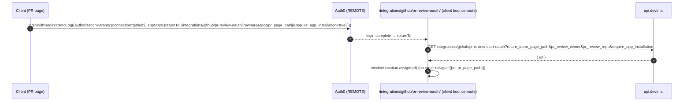

# Devin 3.10.31 — Integrations task B: OAuth / connect / disconnect flows and token custody

Evidence basis: captured app.devin.ai web bundle (2026-09-20), formatted with prettier. Citation paths are relative to `Automations UI/_work/`: `F/` = `formatted/`, `I/` = `integrations/formatted/`, `EN` = `formatted/en-CsbykFSh.js`. Labels: **PROVEN** (literal code at file:line), **PROJECTED** (shape implied by fields the client reads), **DERIVED** (follows from proven control flow), **REMOTE** (server-side; not in the client). Provider registry and full endpoint table are Task A's deliverable and are referenced, not repeated.

## What this proves

The Devin web client implements exactly **three OAuth-shaped patterns**, all top-level redirects (never an in-page popup that the client itself reads a result from): (1) **server-issued redirect URL + top-level `window.location.assign`** — every connect button calls a GET/POST that returns `{url}` (Slack: `{authorize_url}`) and the browser navigates to it; on the way back the *server* is the OAuth redirect target and lands the user on the round-tripped `return_to` path with a marker query param (`link_return=<source>`, `connect_return=slack`, `oauth_success` / `oauth_error`, or `select_org` / `show_github_settings`). (2) **Client-side callback route** used only by two flows — `/_user/integrations/git/oauth-callback` (GitLab / Azure DevOps / GHES user identity, generic `integrations/git/user-oauth/:provider/complete`) and `/_user/integrations/mcp/oauth-callback` (MCP, `mcp/oauth/complete`) — where the client parses `code` + `state` from the query string and POSTs them to the API, which returns where to go next. (3) **Auth0 pre-login chain** for the GitHub PR-review flow: unauthenticated users are sent to Auth0 with `connection: 'github'` and `appState.returnTo` pointing at the `/integrations/github/pr-review-oauth/` bounce route, which then starts pattern 1. Optional "new tab" variants pre-open `about:blank` and set its `location.href`, purely to dodge popup blockers; the opener never reads from the popup. **Token custody:** no OAuth access token, refresh token, or authorization-code exchange result is ever returned to or stored by the client; the only secrets the client handles are user-*entered* credentials (GitHub Enterprise PAT, GitLab self-hosted token, Azure DevOps server token, incident.io API key / signing secret, Jira service account) sent once via POST/PUT, plus webhook tokens the client *reads back* for display (`integrations/gitlab/webhook/:id/token`, bitbucket, azure-devops). Everything about state validation, token exchange, encryption, refresh, and the OAuth apps themselves is REMOTE.

## 1. Flow catalogue

| # | Flow | Start endpoint (client call) → field | Navigation | Round-tripped params | Return marker | Disconnect | Evidence |
|---|---|---|---|---|---|---|---|
| 1 | GitHub App install (org) | GET `${org}/integrations/github/installation-url?return_to=&auto_create_org=&_bypass_org_selection=` → `url` | `assign`, or pre-opened `about:blank` tab | `return_to` = current `pathname(+search)` | server lands on `return_to?select_org=1` (client opens installations modal) → after choosing, client sets `show_github_settings=true` | DELETE `${org}/integrations/github?name=&host=` | F/app-initial-DGau-T9Q.js:223-226, 783-805, 885-972 |
| 1b | GitHub connect existing installation | POST `${org}/integrations/github/connect-existing-installation` `{installation_id}` | none (XHR) | — | — | same as 1 | DGau:253-255, 902-935 |
| 1c | GitHub auto-org-creation install | GET `integrations/github/auto-org-creation-installation-url?return_to=` → `url` | `assign` or `window.open` | `return_to` | REMOTE | — | DGau:240-242, 871-880 |
| 1d | GitHub manage installation | GET `integrations/github/management-url?installation_id=&gh_org=&host=` → `url` | `window.open(url,'_blank')` in `setTimeout` | — | n/a (github.com page) | — | DGau:228-230, 937-955 |
| 2 | GitHub user identity (cloud) | GET `integrations/github/start-user-oauth?return_to=` → `url` | `assign` | `return_to` (+`link_return=github` when via generic hook) | `link_return=github`; client polls `user-profile.github_username` | DELETE `integrations/github/user` | DGau:243-248, 848-860; F/app-initial-BhLdCEaF.js:1338 |
| 3 | GHES user identity | GET `integrations/github/ghes/start-user-oauth?github_app_config_id=&return_to=` → `url` | `assign` | `return_to` | REMOTE (server redirect) | DELETE `integrations/github/ghes/user-oauth?github_app_config_id=` | DGau:284-292; F/github-BiwNk-eu.js:1565-1573 |
| 3b | GHES App registration / install | POST `integrations/github/ghes/start-app-registration` `{ghes_host,is_subdomain_isolation_enabled,organization,app_name}`; GET `integrations/github/ghes/installation-url?github_app_config_id=&return_to=/settings/connections/github` → `url` | `window.location.href` | `return_to` | REMOTE | DELETE `integrations/github/ghes/app-configs/:id` | DGau:265-273; github-BiwNk-eu.js:593-617 |
| 4 | GitLab cloud / Azure DevOps user identity (generic) | GET `integrations/git/user-oauth/:provider/start?return_to=[&host=&app_config_id=]` → `url` | `assign` | `return_to`, `host`, `app_config_id` | **client callback** `/_user/integrations/git/oauth-callback?provider=&code=&state=` → POST `.../complete` → `redirect_url` | DELETE `integrations/git/user-oauth/:provider[?host=&app_config_id=]` | DGau:449-468, 519-561; F/oauth-callback-hJD-jXng.js:12-50 |
| 5 | MCP server OAuth | start is MCP track (REMOTE here) | — | — | **client callback** `/_user/integrations/mcp/oauth-callback?mcp_oauth_code=&mcp_oauth_state=` → POST `mcp/oauth/complete` → `{ok,error,return_to,devin_id}` | MCP track | F/oauth-callback-YK4w8hpK.js:27-90 |
| 6 | GitHub PR-review connect | GET `integrations/github/pr-review-start-oauth?return_to=&pr_review_owner=&pr_review_repo=&require_app_installation=` → `url` | `assign` | `return_to`=PR page path, owner, repo | REMOTE | — | F/app-initial-CMo_DJKv.js:517-556; F/pr-review-oauth-Csx51DC-.js:8-27 |
| 7 | Generic user link: slack / jira / linear / microsoft-teams / pylon / incident-io / pagerduty | per-source fn → `url` (slack `authorize_url`); jira = GET `${org}/integrations/jira/user-link-url?return_to=` | `assign` or pre-opened tab (`opener=null`) | `return_to` = current URL + `link_return=<source>` (+`tool=linear`) | `link_return=<source>`; jira also `error=` codes | jira: DELETE `${org}/integrations/jira/user-link`; others Task A | BhLdCEaF:1306-1373, 1237-1300; DGau:299-305 |
| 8 | Slack org connect (`workspace` \| `organization`) | GET `${org}/integrations/slack/authorize?return_to=` (workspace) \| `${org}/integrations/slack/admin-authorize?return_to=` (organization) → `authorize_url` (F/app-initial-BRqEELEv.js:272-279) | same | `connect_return=slack`, `chain_user_signin=1` | `connect_return=slack` → invalidate `[slack]` | Task A (`slack-*.js`) | BhLdCEaF:1375-1405, 1441-1442 |
| 9 | Jira agent ("jira-agent/link") | POST `integrations/jira-agent/link-info` `{token}`; POST `integrations/jira-agent/link` | none — token paste, not OAuth | — | — | POST `${org}/integrations/jira-agent/installations/unlink` | DGau:1299-1318 |
| 10 | Credential-entry (no OAuth): GitHub Enterprise PAT, GitLab self-hosted app-config/token, Azure DevOps server token / service principal, incident.io API key, Jira service account, Perforce | POST/PUT with secret in JSON body | none | — | — | DELETE variants | DGau:257-263, 439-445, 2291-2298, 86-94, 361-366 |

All rows PROVEN unless a cell says REMOTE. Nothing in the client ever reads `code`/`state` except rows 4 and 5.

## 2. Sequence diagrams (one per distinct pattern)

### Pattern A — server-issued URL, top-level redirect, marker-param return (flows 1, 2, 3, 6, 7, 8)

```mermaid
sequenceDiagram
  autonumber
  participant U as User
  participant C as Client (React)
  participant API as api.devin.ai (REMOTE)
  participant P as Provider (GitHub/Slack/Jira/…)
  U->>C: click Connect / Link
  C->>C: ret = pathname+search (+ link_return=<src> | chain_user_signin=1)
  opt openInNewTab
    C->>C: tab = window.open('about:blank'); tab.opener = null
  end
  C->>API: GET …/start?return_to=ret (or install-url / user-link-url / pr-review-start-oauth)
  API-->>C: { url }  (slack: { authorize_url })
  C->>P: window.location.assign(url)  |  tab.location.href = url
  U->>P: consent / install
  P->>API: OAuth redirect (code, state, installation_id…) — REMOTE
  API->>API: state check, token exchange, persist — REMOTE
  API-->>C: 302 to ret (+ marker: link_return / connect_return / select_org / error=)
  C->>C: read marker once, replaceState to strip it
  C->>API: invalidate + refetch status queries (poll ≤3×1500 ms for github)
  C-->>U: toast / modal (select_org → installations modal → show_github_settings=true)
```

Evidence: F/app-initial-BhLdCEaF.js:1306-1349 (ret building, popup, assign), 1199-1233 (marker read/strip, invalidations), 1283-1289 (poll); F/app-initial-DGau-T9Q.js:783-805 (popup workaround), 894-934 (`select_org`, `show_github_settings`).

### Pattern B — client-side callback route posts `code`+`state` (flows 4, 5)

```mermaid
sequenceDiagram
  autonumber
  participant C as Client
  participant API as api.devin.ai (REMOTE)
  participant P as Provider
  C->>API: GET integrations/git/user-oauth/:provider/start?return_to=&host=&app_config_id=
  API-->>C: { url }
  C->>P: window.location.assign(url)
  P-->>C: 302 /integrations/git/oauth-callback?provider=&code=&state=  (git)<br/>302 /integrations/mcp/oauth-callback?mcp_oauth_code=&mcp_oauth_state=  (mcp)
  C->>C: useRef guard (fire once); missing params → redirect ?oauth_error=missing_parameters
  C->>API: POST integrations/git/user-oauth/:provider/complete {code,state}<br/>POST mcp/oauth/complete {code,state}
  API->>P: token exchange — REMOTE (client never sees token)
  alt git: success
    API-->>C: { redirect_url }
    C->>C: window.location.href = redirect_url
  else mcp: success
    API-->>C: { ok, error?, return_to?, devin_id? }
    C->>C: return_to?oauth_success=true | /sessions/<devin_id> | /customize?tab=mcps?oauth_success=true
  else HTTP 403
    C->>C: ?oauth_error=oauth_wrong_user (mcp: detail.error_code ?? oauth_wrong_user)
  else other error
    C->>C: ?oauth_error=oauth_complete_error
  end
  C->>C: useOAuthCallbackToast reads oauth_success/oauth_error → toast, strips params
```

Evidence: F/oauth-callback-hJD-jXng.js:12-50; F/oauth-callback-YK4w8hpK.js:12-90; I/useOAuthCallbackToast-Dy6KlUA6.js:5-49.

### Pattern C — Auth0 login chained into pattern A (flow 6, unauthenticated)



Evidence: F/app-initial-CMo_DJKv.js:529-556; F/pr-review-oauth-Csx51DC-.js:8-27.

## 3. Callback route contract (PROVEN)

| Route | Query read | POST | Body | Response fields read | Success nav | Error nav |
|---|---|---|---|---|---|---|
| `/_user/integrations/git/oauth-callback` | `provider`, `code`, `state` | `integrations/git/user-oauth/${provider}/complete` | `{code, state}` | `redirect_url` | `window.location.href = redirect_url` | `/account/connections?oauth_error=` `missing_parameters` \| `oauth_wrong_user` (403) \| `oauth_complete_error` |
| `/_user/integrations/mcp/oauth-callback` | `mcp_oauth_code`, `mcp_oauth_state` | `mcp/oauth/complete` | `{code, state}` | `ok`, `error`, `return_to`, `devin_id`; error body `detail` (string) or `detail.{message,error_code}` | `return_to?oauth_success=true` → else `/sessions/${devin_id sans 'devin-'}` → else `/customize?tab=mcps?oauth_success=true` | `(return_to ?? /customize?tab=mcps)?oauth_error=` `error ?? oauth_failed` (ok=false) \| `missing_parameters` \| 403: `error_code ?? oauth_wrong_user` \| `oauth_complete_error` |
| `/_default/integrations/github/pr-review-oauth/` | `owner`, `repo`, `pr_page_path`, `require_app_installation` | none (GET start) | — | `url` | `assign(url)` | `navigate(pr_page_path)` |
| `/_user/settings/connected-accounts/` | `tab` | — | — | — | `<Navigate replace to=/settings/connections?tab=>` | — |

Both callback pages render only a full-page spinner (`Qt` from app-initial-GGptwnPE) and guard against React double-effects with a `useRef(false)`. The `state` value is opaque to the client — it is forwarded verbatim; validation is REMOTE. `error`/`error_description` from the provider are **not** parsed by these two routes (the server, as redirect target, handles them; the client only ever sees the server's own `oauth_error` code). `useOAuthCallbackToast` deletes an `oauth_error_description` param but never reads it (I/useOAuthCallbackToast:44).

## 4. Token custody conclusion

**PROVEN — the client never receives an OAuth access or refresh token.** Every OAuth start returns only a redirect `url`/`authorize_url` (F/app-initial-DGau-T9Q.js:243-246, 284-288, 462-466; F/app-initial-BhLdCEaF.js:1337-1344; F/app-initial-CMo_DJKv.js:517-528). The two client callback routes forward `code`+`state` verbatim and read back only `redirect_url` (F/oauth-callback-hJD-jXng.js:24-29) or `{ok,error,return_to,devin_id}` (F/oauth-callback-YK4w8hpK.js:47-66). Status endpoints expose only `is_connected` / `is_github_oauth_connected`, `username`, `can_connect` (DGau:492-556). No query key, localStorage write, or component in the audited chunks holds a token string.

**PROVEN — secrets the client does handle (user-entered, write-only):**
| Secret | Endpoint | Body field | Evidence |
|---|---|---|---|
| GitLab access token (cloud/self-hosted PAT) | POST `${org}/integrations/gitlab/token`; POST `${org}/integrations/gitlab/:id/token/rotate` | `access_token`, `host` | DGau:418-421, 428-433 |
| GitLab self-hosted OAuth app | POST `integrations/gitlab/self-hosted/app-configs` | `host`, `app_id`, `app_secret` | DGau:440-444 |
| GitHub Enterprise PAT | POST/PUT `${org}/integrations/github/enterprise-pat` | `pat`, `gh_pat_name`, `host` / `connection_id` | DGau:256-264 |
| Azure DevOps server token / service principal | POST `${org}/integrations/azure-devops/server-token`; POST `integrations/azure-devops/service-principal/connect` | json | DGau:2296-2298 |
| incident.io API key / signing secret | POST `${org}/integrations/incident-io/connect` `{api_key}`; `/signing-secret` | `api_key` | DGau:86-92 |
| Jira service account | POST `${org}/integrations/jira/connect-service-account` | json | DGau:361-364 |
| Jira agent link token | POST `integrations/jira-agent/link-info` / `link` | `token` | DGau:1299-1305 |

**PROVEN — secrets the client reads back (webhook shared secrets for display/copy):** GET `${org}/integrations/gitlab/webhook/:id/token` + `.../regenerate` (DGau:422-427); same shape for bitbucket (1720-1724) and azure-devops (2284-2288). These are Devin-issued inbound webhook tokens, not provider OAuth tokens.

**REMOTE:** OAuth client IDs/secrets for GitHub/GitLab/Slack/etc., `state` generation and validation (the 403 → `oauth_wrong_user` branch proves state is bound server-side to a user), code→token exchange, storage/encryption, refresh, revocation on disconnect. The `settings.oauthClientSecretDescription` copy "Stored encrypted." (EN:20017) is the only client-visible claim about storage, and it refers to user-supplied MCP OAuth app secrets.

## 5. Disconnect / unlink flows and invalidations (PROVEN)

| Flow | Call | Invalidates / refetches | Toast |
|---|---|---|---|
| GitHub org connection | DELETE `${org}/integrations/github?name=&host=` or DELETE `${org}/integrations/github/pat?connection_id=` | refetch `[github-integration-status]`; invalidate `[repos,org,github]`, `[git-repos]`, `[github-installations]`, `[git-connection-my-access,org]`, `[git-connections-metadata,org]`, `[invite-git-manager-availability,org]` | loading "Removing GitHub integration…" → "GitHub integration removed" / "Failed to remove GitHub integration" (DGau:807-838) |
| GitHub / GitLab / Azure user identity (cloud) | DELETE `integrations/github/user` \| `integrations/git/user-oauth/:provider` | cloudStatus key (`[user-github-integration,uid]` / `[user-gitlab-integration,uid]` / `[user-azure-devops-integration,uid,org]`) + cloudDependentQueryKeys (`[user-profile,uid]` for github) | none for cloud kind (DGau:564-566, 605-634) |
| GHES / GitLab self-hosted user identity | DELETE `integrations/github/ghes/user-oauth?github_app_config_id=` \| `integrations/git/user-oauth/gitlab?host=&app_config_id=` | `[ghes-user-oauth-hosts]` / `[gitlab-self-hosted-user-oauth-hosts,uid,org]` | "GHES account unlinked successfully" / "Failed to unlink GHES account"; "GitLab account unlinked successfully" / "Failed to unlink GitLab account" (DGau:643-650) |
| GHES app config | DELETE `integrations/github/ghes/app-configs/:id` | `[ghes-user-oauth-hosts]`, `[ghes-app-configs]` | "Removed {app_name} ({ghes_host})" / "Failed to remove the GitHub App configuration." (github-BiwNk-eu.js:604-617) |
| Jira user link | DELETE `${org}/integrations/jira/user-link` | Task A (jira chunk) | — |
| Jira agent installation | POST `${org}/integrations/jira-agent/installations/unlink` | Task A | — |
| Generic user-link return | (after any `link_return`) | `[user-profile]`, `[user-integrations]`, `[member-integrations]`, `[user-github-integration]`, `[linear-user-access]`, +`[slack]` on connect_return | (BhLdCEaF:1222-1233) |
| Generic org disconnect dialog copy | — | — | "Disconnect {{integration}}" / "Are you sure you want to disconnect your {{integration}} integration? This will remove all {{integration}} functionality from Devin." (EN:20017 `disconnectIntegration`, `disconnectDescription`) |

## 6. Connected accounts (user) vs org integrations vs connection access

- **Connected accounts** = per-user identity links (`/settings/connections`; legacy `/_user/settings/connected-accounts/` redirects there keeping `tab`, I/org._orgName.settings.connected-accounts.index-BJN9a9oJ.js:6-13; copy `connectedAccountsTitle` "Connected accounts"). Query keys are keyed by `userId` (DGau:492, 522, 548); endpoints have no `${org}` prefix (`integrations/github/user`, `integrations/git/user-oauth/*`). Row model: `{key, provider, kind:'cloud'|'host', host, appConfigId, isConnected, username, canConnect, isReady}` (DGau:688-700). Purpose per config: `attributesSessionPrs` (github/gitlab true, azure false) — PRs opened by Devin are attributed to the linked user (DGau:502, 529, 559; PROVEN flag, semantics DERIVED).
- **Org integrations** = `${org}/integrations/*` connections (GitHub App installations, GitLab tokens, Slack workspace, Jira site…). `hasOrgIntegration` = any connection with `type !== 'github_individual_token'` (F/app-initial-BamWsN5Q.js:1565); the PLG `/_user/connect-git/` page distinguishes "org integration exists" → "You're all set" from "only a user OAuth exists" (F/connect-git-Cm249C0N.js:14-63). Gated by permission `ManageGitIntegrations` (BamWsN5Q:1542).
- **ManageConnectionAccessModal** (I/ManageConnectionAccessModal-CnFPnlNt.js) has two parts: (a) repo scope of a connection — `[git-connection,org,id]`, `[git-connection-repo-cache-status,…]` polled with backoff `min(1000·1.5^n, 30000)` while `updating`, `[git-connection-account-repos,…]`, manual add repo → POST `${org}/integrations/add-repo {connection_id, repo_path}` (l.274-345; DGau:2557); toasts "List of repos successfully updated" / "Failed to update list of repos" / "Failed to manually add repo"; (b) **who can use it** — generic resource-access editor with `resourceType: GIT_CONNECTION`, levels `GIT_CONNECTION_VIEW` "Can view", `GIT_CONNECTION_CONFIGURE` "Can edit" ("Can edit this connection's repository permissions and disconnect it"), manage "Can manage" ("… manage who has access to it, and disconnect it"); inherited rows from View/Manage Git integrations permission or owner role; `removeSelfError` "You can't remove your own access to manage this connection"; grantees = users, org roles, enterprise roles, service users, "Everyone"; relatedQueryKeys `[git-connections-metadata,org]` (l.556-604; EN:21125-21150). Backing API: GET/POST/PATCH/DELETE `${org}/integrations/git-permissions[/:id]?connection_id=&permission_types=&cursor=` (DGau:2514-2535). Grant payload shape: PROJECTED (json `t` not expanded in audited window).

## 7. Connection lifecycle state machine

The client holds no explicit status enum for OAuth identities; the proven observable states are booleans plus transient UI flags. The diagram below is DERIVED from those.

```mermaid
stateDiagram-v2
  [*] --> Disconnected: status.is_connected=false
  Disconnected --> Starting: connect() sets pendingKey / isLinking
  Starting --> Disconnected: start call throws → toast oauthFailed / "Failed to link {source} user"
  Starting --> AtProvider: window.location.assign(url)
  AtProvider --> Returning: server 302 → return_to + marker (link_return / oauth_success / select_org)
  AtProvider --> Failed: server 302 → return_to?oauth_error=<code> | ?error=<jira code>
  Returning --> Connected: invalidate + refetch; is_connected=true (github: poll ≤3× for github_username)
  Returning --> Stale: 3 polls without github_username → "GitHub link is taking longer than expected…"
  Stale --> Connected: manual refresh
  Failed --> Disconnected: useOAuthCallbackToast shows "OAuth failed: …", strips params
  Connected --> Disconnecting: disconnect() sets pendingKey
  Disconnecting --> Disconnected: DELETE ok → invalidate keys → toast unlinked (host kinds only)
  Disconnecting --> Connected: DELETE fails → toast unlinkFailed
  state "GitHub org connection" as org {
    [*] --> NoInstallation
    NoInstallation --> SelectOrg: return_to?select_org (installations modal)
    SelectOrg --> Installed: connect-existing-installation → show_github_settings=true
    Installed --> Removing: handleDelete "Removing GitHub integration…"
    Removing --> NoInstallation: "GitHub integration removed"
    Installed --> Installed: manageInstallation (window.open management-url)
  }
```



Evidence: DGau:575-635 (pendingKey, connect/disconnect), 885-972 (`select_org`, `show_github_settings`), BhLdCEaF:1237-1300 (returning/poll/stale), I/useOAuthCallbackToast:5-49 (Failed). Repo-cache sub-state for a connection: `status` (`healthy` default) + `updating` boolean (I/ManageConnectionAccessModal:315-319) — PROJECTED beyond those two values.

## 8. Copy catalogue (toasts / errors)

| Key / literal | Text | Where |
|---|---|---|
| settings.oauthFailed | OAuth failed: {{message}} | useOAuthCallbackToast |
| settings.mcpLinkedSuccessfully | MCP account linked successfully | `oauth_success` |
| settings.oauthMissingParameters | Missing OAuth parameters | `missing_parameters` |
| settings.oauthExpiredState | OAuth session expired, please try again | `expired_state` |
| settings.oauthTokenExchangeError | Failed to exchange authorization code | `token_exchange_error` |
| settings.oauthSaveTokensError | Failed to save OAuth tokens | `save_tokens_error` |
| settings.oauthAccessDenied | Access denied by the provider | `access_denied` |
| settings.oauthConfigurationChanged | The MCP OAuth configuration changed. Start OAuth again. | `oauth_configuration_changed` |
| settings.oauthRouteChanged | The MCP OAuth network route changed. Start OAuth again. | `oauth_route_changed` |
| settings.oauthInstallationNotFound | The MCP server installation no longer exists. | `installation_not_found` |
| settings.oauthTokenExchangeFailed | Token exchange failed | `token_exchange_failed` |
| settings.oauthMissingAccessToken | Token exchange succeeded but no access token was returned. | `missing_access_token` |
| settings.oauthCompleteError | Could not complete OAuth. Please try again. | `oauth_complete_error` |
| settings.oauthInsufficientPermissions | You don't have permission to manage MCP servers for this organization or account. Ask an organization admin to grant you access or connect the server themselves. | `oauth_insufficient_permissions` |
| settings.oauthWrongUser | This OAuth link was created by a different user. Start the connection again from your own account. | `oauth_wrong_user` (HTTP 403) |
| settings.oauthInsufficientScope | The provider did not grant the required permissions. Re-authorize and check the permission boxes on the consent screen. | `insufficient_scope` |
| settings.oauthGenericError | Something went wrong, please try again | unknown code |
| settings.oauthStartFailed | Unable to start OAuth link. Please try again or contact your admin. | EN:20017 |
| settings.oauthUnsafeAuthorizationUrl | The provider returned an invalid or unsupported OAuth sign-in URL. | EN:20017 |
| literal | GHES account unlinked successfully / Failed to unlink GHES account / Failed to start GitHub Enterprise Server OAuth flow | DGau:643-645 |
| literal | GitLab account unlinked successfully / Failed to unlink GitLab account / Failed to start GitLab OAuth flow | DGau:646-649 |
| literal | Removing GitHub integration… / GitHub integration removed / Failed to remove GitHub integration | DGau:813-832 |
| literal | Failed to connect GitHub organization | DGau:922 |
| literal | We no longer have access to this installation. Try disconnecting and reconnecting. / Error managing installation. | DGau:946-951 |
| literal | Failed to link {source} user. Please try again. | BhLdCEaF:1352 |
| literal | No Slack connection found for this organization. Please connect Slack to your organization first. | 400 `SLACK_NOT_CONNECTED` |
| literal | Microsoft Teams is not connected for this organization. Please ask an administrator to connect Microsoft Teams in settings. | 400 `TEAMS_NOT_CONNECTED` |
| literal | You don't have permission to access this organization. Please contact your organization administrator. | 403 teams |
| literal | Failed to connect {source}. Please try again. / You don't have permission to connect {source} for this organization. Please ask an administrator. | BhLdCEaF:1398-1403 |
| literal | GitHub link is taking longer than expected. Refresh the page to check its status. | BhLdCEaF:1287 |
| settings.atlassianJiraSiteAccess / atlassianAccountInUse / atlassianLinkBusy / atlassianEmailUnverified | jira `error=` codes `jira_site_access`, `atlassian_account_in_use`, `atlassian_link_busy`, `atlassian_email_unverified` | BhLdCEaF:1249-1268 |
| settings.disconnectIntegration / disconnectDescription | Disconnect {{integration}} / Are you sure you want to disconnect your {{integration}} integration? This will remove all {{integration}} functionality from Devin. | EN:20017 |
| literal | Failed to get installation URL. Please try again. / Failed to load GitHub App configurations. / Removed {app_name} ({ghes_host}) / Failed to remove the GitHub App configuration. | github-BiwNk-eu.js:581-615 |
| literal | Connect your Git provider / A teammate asked you to connect your organization's repositories to Devin so the team can start working. / You're all set / Your Git provider is connected to Devin. Let your teammate know they're unblocked — or take Devin for a spin yourself. / Try Devin now / Manage Git connections | connect-git-Cm249C0N.js:33-63 |
| gitConnectionAccess.* | Can view / Can edit / Can manage / You can't remove your own access to manage this connection / Failed to grant access / Failed to remove access / No one has been granted access yet. / Search users or roles to add | EN:21125-21150 |

## 9. T3 mapping (proposals, not decisions)

- **Where OAuth lives.** T3's server (`apps/server`) already owns `/oauth` and `/.well-known` in the Vite proxy list, so the Devin split — client only receives a redirect URL, server is the OAuth redirect target and token custodian — maps cleanly: an `integrations/<provider>/start` request over the WebSocket (typed in `packages/contracts`) returns `{url}`; the browser does a top-level `window.location.assign` (web) / `shell.openExternal` (desktop) / `Linking.openURL` (mobile). Tokens never cross the WebSocket. Because a T3 *environment* is one server, the "org" scope in Devin becomes **environment** scope; Devin's "connected account" (per-user identity) has no direct T3 analogue since T3 has no multi-user org — model it as an environment-level identity per provider and drop the access-grant editor (section 6b) entirely for v1.
- **Return path.** The `return_to` + single-shot marker param (`link_return=<source>`) pattern is what makes the flow work from any entry point (Settings, palette, chat). For remote/relay/tunnel clients the browser origin is not the server origin, so the server must redirect to a `return_to` it was *given by the client* (as Devin does) rather than to its own origin; validate it is a relative path. Desktop and mobile cannot receive an HTTP redirect at all — they need the Devin pattern-B variant inverted: the server completes the exchange itself and the client learns the result via a typed receipt/event (`integration.connected`), which is how T3 already signals async milestones. That receipt replaces Devin's 3×1500 ms poll (a poll-until-field-appears loop is exactly the "lying spinner" AGENTS.md warns about).
- **Reverse states.** Each connect needs a disconnect command emitting `integration.disconnected`, and the read model should carry `{provider, host, kind:'cloud'|'host', isConnected, username}` — Devin's row shape (DGau:688-700) is a good minimal contract. Error codes from section 8 can be reused as a closed union in contracts so toasts are exhaustive.
- **Secrets entry (PAT/webhook).** Devin's write-only POST of `access_token`/`pat` maps to T3's existing `secrets` storage; webhook token *read-back* endpoints would only be needed if T3 accepts inbound webhooks (Automations track dependency — pointer, not in scope here).

## 10. Evidence appendix

All lines refer to prettier-formatted chunks under `Automations UI/_work/`.

| Claim | Citation |
|---|---|
| Git user-OAuth callback route, params, POST complete, redirect_url, error codes | F/oauth-callback-hJD-jXng.js:12-50 |
| MCP OAuth callback route, params, POST mcp/oauth/complete, response fields, nav rules, error body parsing | F/oauth-callback-YK4w8hpK.js:12-90 |
| PR-review bounce route + search params | F/pr-review-oauth-Csx51DC-.js:8-27 |
| pr-review-start-oauth endpoint + params; Auth0 chaining | F/app-initial-CMo_DJKv.js:517-556; user-review-connections 473-478 |
| useOAuthCallbackToast code→copy map, param stripping | I/useOAuthCallbackToast-Dy6KlUA6.js:5-49 |
| User-identity provider table (github/gitlab/azure_devops), endpoints, select shapes, query keys | F/app-initial-DGau-T9Q.js:487-563 |
| connect()/disconnect() hook, invalidations, toasts | F/app-initial-DGau-T9Q.js:575-650 |
| Row shape for connected accounts | F/app-initial-DGau-T9Q.js:688-700 |
| GitHub endpoints incl. installation-url, management-url, start-user-oauth, GHES set | F/app-initial-DGau-T9Q.js:222-292 |
| Generic git user-oauth endpoints + `Qn` param mapping (`host`, `app_config_id`) | F/app-initial-DGau-T9Q.js:449-468 |
| GitLab token/webhook/app-config endpoints | F/app-initial-DGau-T9Q.js:407-446 |
| handleInstallation popup workaround | F/app-initial-DGau-T9Q.js:783-805 |
| GitHub org delete + invalidations + toasts | F/app-initial-DGau-T9Q.js:807-838 |
| handleConnectGithubUser, auto-org-creation | F/app-initial-DGau-T9Q.js:848-880 |
| Installations modal: `select_org`, connect-existing-installation invalidations, `show_github_settings`, manageInstallation, onInstallNew | F/app-initial-DGau-T9Q.js:885-972 |
| Jira user-link, jira-agent endpoints | F/app-initial-DGau-T9Q.js:296-320, 1299-1318 |
| git-permissions endpoints | F/app-initial-DGau-T9Q.js:2512-2535; add-repo 2557 |
| Generic linkUser/connectOrg hook, sources set, popup, error copy | F/app-initial-BhLdCEaF.js:1306-1410, 1431-1442 |
| link_return/connect_return read+strip, invalidation set, poll constants | F/app-initial-BhLdCEaF.js:1193-1233, 1237-1303 |
| GHES OAuth start, app-config install/delete in GitHub settings page | F/github-BiwNk-eu.js:593-617, 1565-1573 |
| connect-git PLG page | F/connect-git-Cm249C0N.js:13-63; state hook F/app-initial-BamWsN5Q.js:1538-1591 |
| connected-accounts redirect route | I/org._orgName.settings.connected-accounts.index-BJN9a9oJ.js:6-13 |
| ManageConnectionAccessModal repo cache + access config | I/ManageConnectionAccessModal-CnFPnlNt.js:274-345, 556-604 |
| i18n `settings.*` blob (oauth*, disconnect*, connectedAccounts*) | EN:20017 |
| i18n `gitConnectionAccess` | EN:21125-21150 |

**Out of scope, checked and excluded:** `auth1-oauth-*.js` is Devin's own first-party login (`/api/auth1/{connections,password/*,saml/request}`) plus the CLI PKCE hand-off route `/auth/cli/continue` reading `state`, `code_challenge`, `code_challenge_method`, `cli_pkce_marker`, `redirect_uri` (I/auth1-oauth-9h-Zi8-D.js:338-443, 532-580) — user authentication, not integration OAuth. `outposts.connect-*.js` is a create-outpost form (name/description/platform/icon; I/outposts.connect-Dddd8Ua2.js:154-436), not an OAuth flow. `GitConnectionsModal-*.js` (45 lines) is a thin wrapper and belongs with Task A's registry. Working notes: `_work/integrations/NOTES-B-oauth.md`.
