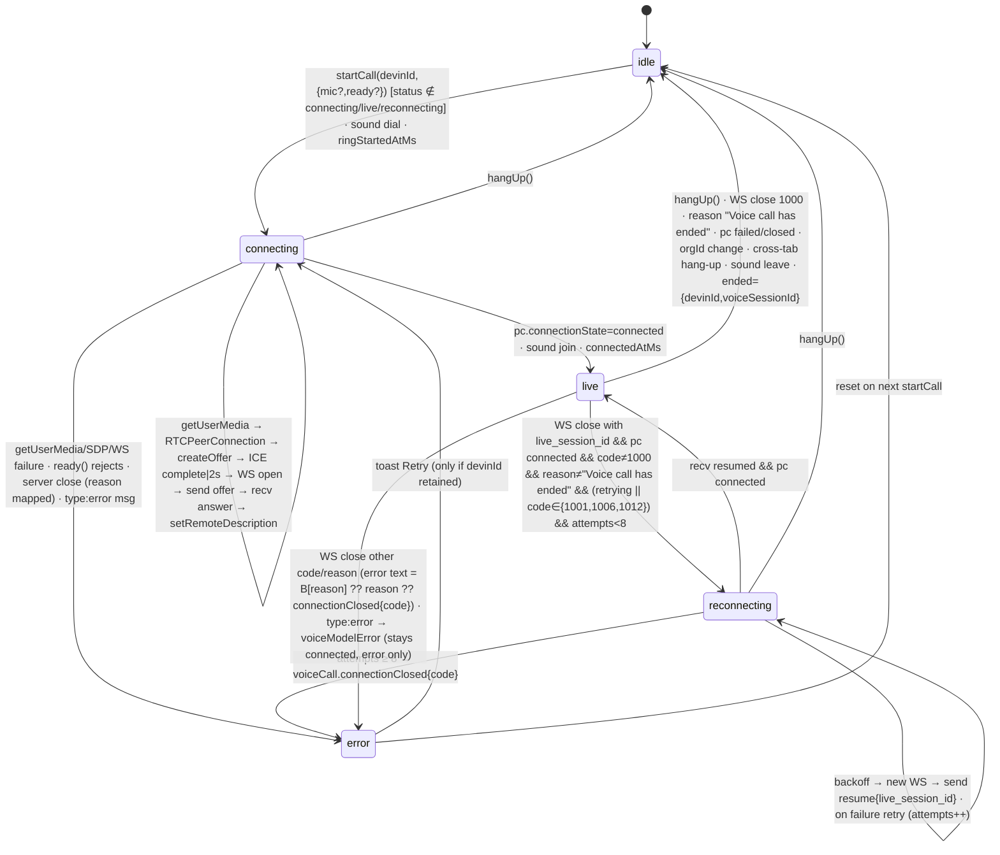

# Devin 3.10.31 — Voice Call, Task A: controller, transport, signaling, audio pipeline, UI entry points

Source: captured `app.devin.ai` web bundle (2026-09-20), formatted copies in `_work/formatted/` and `_work/voice/formatted/`; desktop bundles in `_work/formatted-desktop/`. All citations are `chunk.js:line` in those formatted copies. Labels: **PROVEN** / **PROJECTED** / **DERIVED** / **REMOTE**. Voice-turn-to-session-message translation is Task B and is only pointed at here.

## What this proves

**Transport is plain browser WebRTC with a bespoke WebSocket signaling channel — there is no third-party realtime SDK in the client.** The controller opens `RTCPeerConnection()` with no ICE servers, adds the mic track, does vanilla (non-trickle) ICE, and sends the full SDP offer as JSON over a WebSocket to `${apiBase}/voice/{devinId}/live?token=<accessToken>&org_id=<orgId>` (PROVEN, `VoiceCallController-D1fhynnv.js:534-538, 722-764`). The server answers with `{type:"answer", sdp, live_session_id, voice_session_id}` and later pushes `transcript` events; remote audio arrives as a WebRTC track played through a detached `<audio autoplay>` element. The only vendor code in the voice path is `@ricky0123/vad-web` 0.0.30 + `onnxruntime-web` 1.27.0 (Silero VAD v5), used purely to drive the local microphone-level meter — it does not gate transmission (PROVEN, `dist-D8RCdqlE.js:14942, 17958-18016`; `VoiceCallController:455-513, 886`). The server-side speech/LLM/TTS vendor, TURN configuration and codec negotiation are **REMOTE/UNKNOWN**; the client never names them. `cognition.ai/voiceCallBootstrap` is a **boolean**, not a token or room: the composer sends `voice_call_bootstrap: true` on session creation so the backend starts the session in voice mode; credentials are the normal access token + org id in the WS query string (PROVEN, `requests-DN_jEueP.js:168,193`). The feature is gated by the `devin-voice-mode` feature flag (PROVEN, `build-BrM3pv_h.js:2787`). Ring/join/mute sounds are synthesized with WebAudio — no audio assets (PROVEN, `voiceCallSounds-BmJYkLKX.js`). Presence is a single-caller model: one `activeVoiceCall{userId, voiceSessionId}` per session, cross-tab coordination via `BroadcastChannel("voice-call:<devinId>")` (PROVEN, `voiceCallChannel-Aup4TwTd.js:3`).

## 1. Entry points and gating

| Item | Evidence | Label |
|---|---|---|
| Feature flag `devin-voice-mode` | `build-BrM3pv_h.js:2787` `Sc = (e=!0) => I("devin-voice-mode", e)`; `I()` at `:2487` reads the feature-flags query and reports `addFeatureFlagEvaluation` telemetry | PROVEN |
| Re-export chain | `app-initial-ClK3cO3o.js:67` imports `So as We`; `:2758 Tu() = We()`; exported `Tu as Ft` (`:3668`); `InputBox-CFvzp3_F.js:668` imports `Ft as qr` | PROVEN |
| Composer lazy mounts | `InputBox-CFvzp3_F.js:15586` and `:15631`: `qr() ? <Suspense><lazy VoiceCallButton / SidebarVoiceCall/></Suspense> : null` | PROVEN |
| Chunk-local gate | `VoiceCallButton-Dihi99Wb.js:480-490`: `VoiceCallButton = memo(() => c() ? <be/> : null)`, `SidebarVoiceCall = memo(() => c() ? <xe/> : null)`; `c` = `So` from `build-BrM3pv_h.js` = same flag | PROVEN |
| Flag + controller mounted | `app-initial-ClK3cO3o.js:2759-2763` `Eu() = flag && store.controller !== null` | PROVEN |
| `VoiceCallController` mount | Exported component `Z` (`VoiceCallController-D1fhynnv.js:941-978`) renders `null`; hosts the controller hook `M()`, push-to-talk hook `X()`, error toast with Retry, and hangs up when `orgId` changes | PROVEN |
| Start from composer (existing session) | `InputBox-CFvzp3_F.js:19285-19288` `mo()`: if `devinId` known → `store.startCall(devinId)` | PROVEN |
| Start from composer (new session) | `InputBox:19290-19312`: `getUserMedia({audio:true})` **first** (fail → toast `voiceCall.microphoneUnavailable`), then `Ta({ voiceCall: (devinId, ready) => store.startCall(devinId, {mic, ready}) })` — i.e. the session is created with the mic pre-acquired so the call starts without a second permission prompt; mic tracks stopped in `finally` if not handed off | PROVEN |
| Create-session flag | `InputBox:19062` passes `{ voiceCall, voiceCallBootstrap }`; `useInputBox-U7TgCrww.js:1166,1290` forwards `voiceCallBootstrap`; `requests-DN_jEueP.js:193` → body `voice_call_bootstrap: true` | PROVEN |
| Submit wrapper | `InputBox:19315-19320` `ho()` = `Ya.onSend()` + `Ca.guardSubmit(() => mo())` (respects the same pre-send guardrails as text); `go()` = `controller.hangUp()` | PROVEN |
| In-call composer bar | `VoiceCallButton:318-386` `be()`: renders only when `status ∈ {connecting, live, reconnecting}` for the *current* session (`e.devinId === devinData.devin_id`); shows waveform (`composer-voice-FeMz50MG.js:180`), duration, mute, deafen, hang-up (`destructive-muted` circle) | PROVEN |
| Sidebar pill | `VoiceCallButton:400-449` `xe()`: floating pill (`W` wrapper `:387`, `absolute inset-x-0 bottom-0 z-40`) with `returnToCall` link to `params:{sessionId}` and transcript popover `ye` (`:260-300`) | PROVEN |
| Store `startCall` proxy | `app-initial-ClK3cO3o.js:2710-2713`: if no controller mounted, stops the handed-in mic tracks instead of leaking them | PROVEN |
| Push-to-talk key | Keybinding `SessionPushToTalk`: key `" "`, `surface: "app"`, `rebindable: false`, `suppressedIn: ["typing","codeEditor","terminal"]`, label "Push to talk" (`app-initial-Csp-H3n7.js:573-580`, `app-initial-BQqGsQmI.js:194`) | PROVEN |

The desktop (Electron/Windsurf) shell contains **no transport code** — `rg -c 'RTCPeerConnection|/voice/'` on both desktop bundles returns 0; it only parses voice meta on ACP events (section 8). Voice calling is a web-client feature. (PROVEN by absence; DERIVED that Devin desktop's Sessions window loads the same web app for calling — not verified.)

## 2. Store shape (zustand, `app-initial-ClK3cO3o.js:2694-2757`)

```ts
{
  devinId: string|null, sessionTitle: string|null,
  status: 'idle'|'connecting'|'live'|'reconnecting'|'error',
  error: string|null,
  connectedAtMs: number|null, ringStartedAtMs: number|null,
  muted: boolean, deafened: boolean, talking: boolean, volume: 0..100,
  turns: Turn[], transcriptTurns: Turn[],          // Turn = {turnId, role, text, startedAtMs, eventId?}
  ended: {devinId, voiceSessionId}|null,
  controller: {startCall, hangUp, toggleMute, toggleDeafen, startTalking, stopTalking}|null,
  setController, startCall(devinId, {mic?, ready?}), setCall, setSessionTitle, setVolume,
  upsertTurn(turnId, role, text, startedAtMs?), finishTurn(turnId, eventId?), removeTurn, reset
}
```
Turn ids are prefixed `live-voice-turn-` (`:2692`). `finishTurn` with an `eventId` stamps the turn; without one it removes it from `turns` (but keeps it in `transcriptTurns`) — the handoff point to Task B (PROVEN).

## 3. Controller state machine (`VoiceCallController-D1fhynnv.js:539-861`)

Constants (`:862-891`, PROVEN): ping interval 20 000 ms; max reconnect attempts 8; backoff `min(500·2^n, 5000)` ms; resumable close codes `{1001, 1006, 1012}`; clean-close reason string `"Voice call has ended"`; ICE-gathering wait cap 2 000 ms (`:756`); generation counter `_` invalidates every async continuation after hang-up/restart.



Transition details (all PROVEN):

| Event | Lines | Effect |
|---|---|---|
| `startCall` | `773-811` | Rejects while connecting/live/reconnecting (stops passed-in mic). Sets `{devinId, sessionTitle:null, status:'connecting', error:null, muted:false, deafened:false, talking:false}`. If `opts.ready` (session-creation promise) present, waits for it before dialing. |
| Dial `W` | `711-771` | Sound `dial`, `ringStartedAtMs = ringStartedAt()`. `getUserMedia({audio:true})` unless mic supplied. Mic tracks set `enabled=false` until state effect re-enables. `new RTCPeerConnection()` (no config), `addTrack` all, `new AudioContext()`, analyser meter then VAD meter. `<audio autoplay muted=deafened>`; `pc.ontrack → audio.srcObject`. `createOffer` → `setLocalDescription` → wait `icegatheringstatechange==complete` or 2 s → send `offer`. |
| `pc.onconnectionstatechange` | `737-744` | `connected` → stop ring, sound `join` (once), `status:'live', connectedAtMs`. `failed`/`closed` → `hangUp()`. |
| Signaling WS `U` | `628-709` | Opens WS, sends the given first message (`offer` or `resume`), starts 20 s `ping`. `answer` → store `live_session_id`, `voice_session_id`, `setRemoteDescription`. `resumed` → attempts=0, `live` if pc connected. `transcript` → `upsertTurn`/`finishTurn`. `error` → `error: voiceCall.voiceModelError` (no teardown). |
| WS `onclose` | `665-702` | Reconnect predicate above; else clean vs. error end. Error map `B`: `"Too many calls"→voiceCall.tooManyCalls`, `"A voice call is already active"→voiceCall.alreadyActive`, `"Voice mode is not enabled"→voiceCall.notEnabled`. On error the store keeps `devinId` so the toast can offer Retry. |
| `hangUp` `V` | `595-621` | Stop ring, sound `leave` (if joined), bump generation, clear timers, if main WS not OPEN open a throw-away WS just to send `{type:'end', live_session_id}` (`587-594`), close pc/WS/AudioContext, stop mic tracks, remove audio element, `reset()`, then `ended={devinId, voiceSessionId}`. |
| `toggleMute`/`toggleDeafen` | `813-820` | Flip flag + sound. Mic `track.enabled = (live‖reconnecting) && !muted` (`571-578`); `audio.muted = deafened` (`579-586`). |
| `startTalking`/`stopTalking` (PTT) | `821-826` | start: `muted:false, talking:true`, sound `ptt-start`; stop: `muted:true, talking:false`, sound `ptt-stop`. |
| Push-to-talk hook `X` | `895-940` | Space via `SessionPushToTalk` keybinding, only when `status==='live' && muted`, not repeat/composing/meta, not when focus is in an interactive element (`$` selector `:975`) or contenteditable outside `[data-devin-input-box]` (`Y` `:892`). Released on `keyup` Space, `window blur`, `document.hidden`. |
| Org switch | `948-953` | `orgId` change while `devinId!==null` → `hangUp()`. |
| Cross-tab | `856-860` | While not idle/error, registers as holder on `BroadcastChannel voice-call:<devinId>`; a `hang-up` message → `hangUp()`. |
| Error toast | `961-972` | `toast.error(error, {action: status==='idle' && devinId ? Retry : undefined})`; Retry → `startCall(devinId)`. |

Note: there is no explicit call-duration or ring timeout timer in the client; "Calling..." persists until the server answers or the WS closes (DERIVED from absence of timers other than ping/backoff/ICE cap).

## 4. Bootstrap and signaling contract

### 4.1 Session bootstrap (PROVEN)

| Field | Where | Meaning |
|---|---|---|
| `voice_call_bootstrap: true` | POST create-session body, `requests-DN_jEueP.js:193` (from `voiceCallBootstrap` arg `:168`; set by `useInputBox-U7TgCrww.js:1290` when the composer's call button started the session) | Tells the backend the session was started by a voice call. Boolean only. |
| `cognition.ai/voiceCallBootstrap` (bool, nullish) | ACP **message** meta schema, web `en-CsbykFSh.js:5126`; desktop `extension.js:6822`, `sessions.desktop.main.js:352293` | Marks the initial user message as the voice bootstrap message; desktop sets `voiceBootstrapSenderId` from its sender (`sessions.desktop.main.js:360833`). |
| `cognition.ai/voiceCallEnabled` (bool), `cognition.ai/userId` (string), `cognition.ai/voiceSessionId` (string) | ACP **session/event** meta, web `en-CsbykFSh.js:5359-5362`, `Np()` `:8603`; desktop `extension.js:7046-7048`, `isVoiceCallStart` `:11154`, `getSetVoiceModeMeta` `:11157` | The server-emitted "voice mode set" event: who is on the call and the voice session id. Feeds `globalState.activeVoiceCall{userId, voiceSessionId}` used by presence (§7). |
| `cognition.ai/durationSeconds` | `extension.js:11164` `getVoiceCallDurationSeconds` | Present on the call-ended event; desktop derives `voice_call_started` / `voice_call_ended` transcript items from these (`sessions.desktop.main.js:801954-801958`). |
| `cognition.ai/voiceChannel` (string) | `extension.js:5492`; also the only voice-related string in the Rust CLI (`strings … devin`) | Message meta marking which channel a voice-originated message came through. Values REMOTE/UNKNOWN. |

No token, room name, ICE/TURN config, or vendor URL is delivered to the client through any of these keys. Authentication for the media session is entirely `token=<getAccessToken()>&org_id=<orgId>` on the signaling WS URL (`VoiceCallController:534-538`), plus an optional `&preview=<preview-backend-sha>` pin when the preview-backend cookie/header is set (`app-initial-CMo_DJKv.js:159`, `In="X-Cog-Preview"`, `Ln="preview"`).

### 4.2 Signaling WebSocket (PROVEN, `VoiceCallController-D1fhynnv.js`)

URL: `` `${apiBase}/voice/${devinId}/live?token=${accessToken}&org_id=${orgId}${preview}` `` (`:534-538`). `apiBase` = `zt` from `app-initial-eW0H4v4q.js` (the standard API origin helper). A fresh WS is opened per attempt (initial, each resume, and the fire-and-forget `end`).

Client → server:

| `type` | Fields | When | Line |
|---|---|---|---|
| `offer` | `sdp` (full local SDP after ICE gathering) | First message on the initial WS | `:764` |
| `resume` | `live_session_id` | First message on a reconnect WS | `:690` |
| `ping` | — | Every 20 s while WS open | `:634` |
| `end` | `live_session_id` | On hang-up **only if** the main WS is not OPEN (opens a throw-away WS just to send it); a normal hang-up relies on WS close | `:587-594, 606` |

Server → client:

| `type` | Fields | Effect | Line |
|---|---|---|---|
| `answer` | `sdp`, `live_session_id?`, `voice_session_id?` | `setRemoteDescription({type:'answer', sdp})`; ids stored | `:641-644` |
| `resumed` | — | attempts=0; `status:'live'` if pc connected | `:645-647` |
| `transcript` | `turn_id`, `role`, `text`, `started_at?` (ISO), `done?`, `event_id?` | `upsertTurn`; when `done`, `finishTurn(turn_id, event_id)` | `:648-654` |
| `error` | (payload ignored) | `error: t('voiceCall.voiceModelError')`, call stays up | `:655` |
| WS close | `code`, `reason` | See §3 — reasons `"Too many calls"`, `"A voice call is already active"`, `"Voice mode is not enabled"`, `"Voice call has ended"` are literal server strings the client matches | `:665-702, 878-884` |

Media plane: one `RTCPeerConnection` with default config (no `iceServers`), one outgoing audio track, one incoming audio track (`ontrack` `:735`). No data channel, no renegotiation, no trickle ICE, no video. Codec/SDP munging: none in the client (DERIVED — `createOffer()` used unmodified). Whether the remote peer is an SFU, a media server, or a vendor gateway: REMOTE/UNKNOWN.

```mermaid
sequenceDiagram
  participant UI as Composer
  participant C as Controller
  participant WS as api /voice/{id}/live
  participant PC as RTCPeerConnection
  UI->>C: startCall(devinId,{mic?,ready?})
  C->>C: sound dial, status connecting
  C->>PC: addTrack(mic), createOffer, setLocalDescription, wait ICE ≤2s
  C->>WS: open ?token&org_id
  C->>WS: {type:offer, sdp}
  WS-->>C: {type:answer, sdp, live_session_id, voice_session_id}
  C->>PC: setRemoteDescription
  PC-->>C: connectionState=connected
  C->>C: status live, sound join
  loop every 20s
    C->>WS: {type:ping}
  end
  WS-->>C: {type:transcript, turn_id, role, text, done?, event_id?}
  WS-->>C: close 1006
  C->>C: status reconnecting, backoff
  C->>WS: open new, {type:resume, live_session_id}
  WS-->>C: {type:resumed}
  UI->>C: hangUp()
  C->>WS: close (or {type:end} on a fresh WS)
  C->>PC: close; stop mic; sound leave
```

## 5. Audio pipeline (PROVEN unless noted)

| Stage | Detail | Evidence |
|---|---|---|
| Capture | `navigator.mediaDevices.getUserMedia({audio: true})` — default device, no constraints (no echoCancellation/noiseSuppression/sampleRate overrides). No device picker anywhere in the voice chunks. | `VoiceCallController:715`, `InputBox:19294` |
| Pre-acquisition | New-session flow acquires the mic before creating the session and hands the `MediaStream` to `startCall({mic, ready})`; tracks are stopped if the handoff never happens. | `InputBox:19290-19312`, `app-initial-ClK3cO3o.js:2710-2713` |
| Uplink | Mic tracks go straight into `RTCPeerConnection.addTrack`. Track `enabled` is the mute switch: `enabled = (status live‖reconnecting) && !muted` — muting is done by disabling the track, not by removing/replacing it, so the sender keeps sending silence frames. | `:725-727, 571-578` |
| Codec | Browser default from `createOffer()` (Opus in every mainstream browser). Not set by the client. | DERIVED |
| VAD | `@ricky0123/vad-web` `MicVAD.new({ model:'v5', baseAssetPath & onnxWASMBasePath: '/assets/vad/0.0.30-1.27.0/', positiveSpeechThreshold: 0.5, negativeSpeechThreshold: 0.35, redemptionMs: 500, minSpeechMs: 250, audioContext, getStream: () => mic })` — Silero v5 via onnxruntime-web WASM. Loaded lazily (dynamic import of `dist-D8RCdqlE.js`). **Purpose: UI only.** `onSpeechStart/End/VADMisfire` toggle a local "speaking" bit; `onFrameProcessed` computes RMS dBFS and writes `volume` 0–100 to the store only while speaking. VAD never gates the uplink and never sends anything to the server. | `:455-513, 886-890`; `dist-D8RCdqlE.js:46, 76, 14942, 17958-18016` |
| Meter fallback | Until VAD is ready: `AnalyserNode` + `getFloatTimeDomainData` every 50 ms → same RMS→dB→0..1 mapping (floor −50 dBFS, 40 dB range). Swapped out when VAD starts. | `:447-454, 514-529, 730-736` |
| Interruption / barge-in | No client-side barge-in logic. Nothing pauses or ducks playback when the user speaks. Server-side turn-taking is REMOTE/UNKNOWN. | absence in `VoiceCallController` |
| Push-to-talk | UI-level: `startTalking` unmutes (+`talking:true`), `stopTalking` re-mutes. Spacebar bound via `SessionPushToTalk`; only active when already muted. Open-mic is the default (`muted:false` on start). | `:821-826, 895-940` |
| Downlink | `pc.ontrack` → `audio.srcObject = streams[0] ?? new MediaStream([track])` on a detached `document.createElement('audio')` with `autoplay = true`. Not attached to the DOM. | `:731-736` |
| Deafen | `audio.muted = deafened`. Independent of mic mute. | `:579-586, 817-820` |
| Output device | Not selectable (no `setSinkId`). | absence |
| Teardown | Stop all mic tracks, `AudioContext.close()`, `srcObject = null`, `audio.remove()`, VAD `destroy()`. | `:595-621` |
| Sound gating | All UI sounds are suppressed when `user.preferences.notification_sound_enabled === false`. | `:566-570` |

Dictation (`composer-voice` `N` "recording bar" with `sendVoiceMessage`/`processingEllipsis` copy) is a separate, non-call voice-message feature and is out of scope here (noted only so it is not confused with the call pipeline; `composer-voice-FeMz50MG.js:219-253`, `en-CsbykFSh.js:20614`).

## 6. Sounds (`voiceCallSounds-BmJYkLKX.js`, PROVEN)

No audio files. Every cue is additive-synthesised into an `AudioBuffer` (`n()` `:5-35`: harmonics table, exponential decay `duration/decayDiv`, 2 ms attack, raised-cosine release, `tanh` soft clip, peak-normalised). Pitch table `:151-160`: C3 130.81, E3 164.81, G3 196, A3 220, C4 261.63, E4 329.63, G4 392, A4 440, C5 523.25. Shared `AudioContext` lazily created and resumed (`:2-4`).

| Cue key | Trigger | Sound | Line |
|---|---|---|---|
| `dial` | `startCall` → dial | C4 0.14 s + C5 tick at 5 ms, then ring loop starts after 0.9 s | `:86-92, 170` |
| ring loop | while connecting (stopped on `connected`/hang-up via `i()`) | 20-step × 110 ms loop; melody `[C4,E4,G4,G4,A4,G4,E4]` at steps `[0,1,2,6,7,8,9]` over bass `[C3,E3,G3,C4,G3,E3]` on every step; looped `BufferSource` | `:50-84, 163-169` |
| `join` | `pc.connectionState === 'connected'` (first time) | arpeggio G3→C4→E4 (50 ms steps, last 140 ms) | `:93-94, 37-46` |
| `leave` | `hangUp` after a join | E4→C4→G3 | `:95-96` |
| `mute`, `ptt-stop` | toggleMute→muted, stopTalking | A3 0.1 s | `:97-99` |
| `unmute`, `ptt-start` | toggleMute→unmuted, startTalking | E4 0.1 s | `:100-102` |
| `deafen` | toggleDeafen→on | C4 then G3 at 70 ms | `:103-108` |
| `undeafen` | toggleDeafen→off | G3 then C4 at 70 ms | `:109-114` |

Exports: `r(kind)` play, `i()` stop ring, `a()` ring-started timestamp (`Date.now()+delay`), `t` = ring rhythm metadata `{stepMs:110, loopSteps:20, beats:[{step:0,weight:1},{step:6,weight:0.85}]}` consumed by the waveform's ring animation (`composer-voice:180-190` `ringRhythm`, default `{stepMs:1100, loopSteps:1}` `:283`).

## 7. Presence (`VoiceCallPresence-BHY6sHdG.js`, 55 lines, PROVEN)

Reads `globalState.activeVoiceCall?.userId` and `.voiceSessionId` plus `devinData.devin_id` (`:14-16`). Resolves the user record for the avatar and name (`preferred_name ?? name ?? email`, `:22`). Renders a `role="status"` pill (`theme-inverse … rounded-full bg-bg-elevated-wax`) with the avatar (16 px) and one of:

- `voiceCall.presence.you` — "You and Devin are on a call in another window" (when `activeVoiceCall.userId === me`)
- `voiceCall.presence.otherUser` — "{{name}} and Devin are on a call"
- `voiceCall.presence.someone` — "Someone is on a call with Devin"

If it is me, it asks over `BroadcastChannel("voice-call:<devinId>")` `who-holds`; a `holding` reply from another tab shows an **End call** button that posts `hang-up` on the channel (`:18-20, 36-44`; `voiceCallChannel:5-8, 10-18`). The controller tab is the holder: it announces `holding`, answers `who-holds`, and hangs up on `hang-up` (`voiceCallChannel:19-29`).

Model: exactly one participant at a time per session (single `activeVoiceCall` object, no participant list). Where `activeVoiceCall` is populated from: the `cognition.ai/voiceCallEnabled` / `userId` / `voiceSessionId` meta on the session's ACP event stream (§4.1) — the projection into `globalState` is in `MessageHistoryProvider`/`globalState` chunks and belongs to Task B (PROJECTED).

## 8. Desktop shell and CLI (PROVEN)

| Artifact | Finding |
|---|---|
| `extension.js` (Windsurf extension) | Only ACP meta helpers: `getSetVoiceModeMeta` (`:573, 11157`), `getVoiceCallDurationSeconds` (`:621, 11164`), `isVoiceCallStart` (`:754, 11154`); schemas `cognition.ai/voiceChannel` (`:5492`), `voiceCallBootstrap` (`:6822`), `voiceCallEnabled`/`userId`/`voiceSessionId` (`:7046-7048`). |
| `sessions.desktop.main.js` (Sessions window) | Same schemas (`:352293, 352514`), `voiceCallBootstrap` tolerant parse (`:356255`), `voiceBootstrapSenderId` (`:360833`); transcript event types `voice_call_started` / `voice_call_ended` (`:782090-782118, 795163, 801954-801958, 823748`) derived from `isVoiceCallStart` and `durationSeconds`; `voiceCallWindows` used to group transcript items into call windows (`:802563-802571, 803054, 803117`). Zero hits for `RTCPeerConnection` or `/voice/`. |
| Rust CLI `devin` | `strings` shows only the meta key `cognition.ai/voiceChannel` in the ACP meta key list; no microphone/realtime/speech symbols. The CLI does not do voice. |
| Language server | not examined (no voice pointers from any chunk). |

## 9. Copy catalogue (`en-CsbykFSh.js:20572-20613`, namespace `voiceCall`, PROVEN)

| Key | English |
|---|---|
| alreadyActive | A voice call is already active for this session |
| answerNotSent | The answer wasn't sent, so the call didn't start |
| callDuration | Call duration |
| calling | Calling... |
| cancel | Cancel call |
| connectionClosed | Call connection closed ({{code}}) |
| deafen / undeafen | Silence Devin / Unsilence Devin |
| hangUp | End voice call |
| holdSpacebarToTalk | Hold spacebar to talk |
| holdToTalk / holdToTalkShortcut | Hold to talk / Hold to talk (Spacebar) |
| listening | Listening |
| micLevel | Microphone level |
| microphoneUnavailable | Microphone access is required to start a voice call |
| mute / unmute | Mute microphone / Unmute microphone |
| muted | Muted |
| notEnabled | Voice mode is not enabled for your account |
| presence.endCall | End call |
| presence.otherUser | {{name}} and Devin are on a call |
| presence.someone | Someone is on a call with Devin |
| presence.you | You and Devin are on a call in another window |
| pushToTalk | Push to talk |
| reconnecting | Reconnecting call... |
| retry | Retry |
| returnToCall | Return to call |
| starterMessage | Hi Devin! |
| start | Start voice call |
| sendAndStart | Send message and start voice call |
| tooManyCalls | Too many voice calls were started recently. Wait a few minutes and try again |
| transcript | Call transcript |
| transcriptDevin / transcriptYou | Devin / You |
| transcriptEmpty | Your conversation will appear here as you speak. |
| voiceModelError | Voice model error |

Adjacent (dictation, not call): `sendVoiceMessage` "Send voice message", `processingEllipsis` "Processing..." (`:20614`). Keybinding label: "Push to talk" (`app-initial-BQqGsQmI.js:194`). `starterMessage` "Hi Devin!" / `sendAndStart` / `answerNotSent` are consumed by the composer when a call starts a new session (Task B).

## 10. Local-vs-remote boundary

| Lives in the client (PROVEN) | Lives behind the server (REMOTE/UNKNOWN) |
|---|---|
| Feature flag read (`devin-voice-mode`) | Flag assignment; org/account voice entitlement ("Voice mode is not enabled") |
| Mic capture, mute via `track.enabled`, deafen via `audio.muted`, PTT | Rate limiting ("Too many calls"), single-active-call enforcement ("already active") |
| RTCPeerConnection offer/answer, vanilla ICE, ping keepalive, resume/backoff policy | STUN/TURN (client sends none), the media peer (SFU/gateway), codec choice on the far side |
| Transcript rendering from `transcript` messages | ASR, LLM, TTS vendors and turn-taking/barge-in; `live_session_id`/`voice_session_id` semantics and lifetime |
| VAD (Silero) for the level meter only | Whether the server runs its own VAD |
| Synthesized sounds, presence pill, cross-tab hand-off | Emission of `voiceCallEnabled`/`voiceSessionId`/`durationSeconds` meta events and `voice_call_bootstrap` handling |
| `voice_call_bootstrap: true` on create-session | What the bootstrap does server-side (presumably auto-starts a voice session tied to the new devin) — PROJECTED |

### T3 mapping (proposal, not implemented)

Concept map: Devin session = T3 **thread**; `devinId` = `threadId`; `orgId` = **environment**. The voice controller store would live in `packages/client-runtime` (web + mobile), the WebRTC/WS code in the web client with a React-Native equivalent (react-native-webrtc) on mobile. Signaling would be a new typed WS request family in `packages/contracts` (`voice.offer/resume/end/ping` ↔ `voice.answer/resumed/transcript/error`) served by `apps/server`, which would need to own or proxy a media endpoint — T3 has no media plane today, so the realistic first step is a provider-agnostic server-side bridge (`apps/server` reactor) to a hosted realtime speech API, with transcript turns emitted as orchestration events so mobile/remote clients see the same state. `voiceSessionId`/`durationSeconds` map to turn-level metadata. Cross-tab hand-off maps onto T3's existing multi-device presence rather than `BroadcastChannel`.

## 11. Evidence appendix

Formatted files (cite these): `_work/formatted/VoiceCallController-D1fhynnv.js` (995 lines), `VoiceCallButton-Dihi99Wb.js` (492), `VoiceCallPresence-BHY6sHdG.js` (55), `voiceCallChannel-Aup4TwTd.js` (33), `voiceCallSounds-BmJYkLKX.js` (188), `InputBox-CFvzp3_F.js`, `requests-DN_jEueP.js`, `en-CsbykFSh.js`, `app-initial-Csp-H3n7.js`, `app-initial-BQqGsQmI.js`; `_work/voice/formatted/composer-voice-FeMz50MG.js` (284), `build-BrM3pv_h.js` (11 298), `dist-D8RCdqlE.js` (18 327), `app-initial-ClK3cO3o.js`, `app-initial-CMo_DJKv.js`, `useInputBox-U7TgCrww.js`; `_work/formatted-desktop/extension.js`, `sessions.desktop.main.js`.

| Claim | Citation |
|---|---|
| WS URL builder | `VoiceCallController-D1fhynnv.js:534-538` |
| Constants (ping 20 s, 8 attempts, 500/5000 backoff, close codes, reason string, VAD path/thresholds, −50 dB floor, 50 ms meter) | `VoiceCallController:862-891` |
| RMS→0..1 meter | `:447-454` |
| MicVAD config and lazy import | `:455-513` |
| Analyser fallback | `:514-529` |
| Controller hook `M`, refs | `:539-566` |
| Sound gating by preference | `:566-570` |
| Mic enabled / audio muted effects | `:571-586` |
| Fire-and-forget `end` | `:587-594` |
| `hangUp` | `:595-621` |
| `fail` (error state) | `:622-627` |
| Signaling WS open/onmessage/onclose/reconnect | `:628-709` |
| Dial: getUserMedia, RTCPeerConnection, ontrack, connectionstatechange, offer, ICE wait | `:711-771` |
| `startCall` guard and `ready` handling | `:773-811` |
| mute/deafen/PTT callbacks | `:813-826` |
| Controller registration, BroadcastChannel holder | `:838-860` |
| Focus guard `Y`, PTT hook `X`, interactive selector `$` | `:892-940, 975` |
| `VoiceCallController` component (org change, Retry toast) | `:941-978` |
| BroadcastChannel name and messages | `voiceCallChannel-Aup4TwTd.js:3, 6-8, 10-18, 19-29` |
| Presence copy/branches, End call button | `VoiceCallPresence-BHY6sHdG.js:14-44` |
| Sound synthesis, cue table, pitch constants, ring rhythm | `voiceCallSounds-BmJYkLKX.js:5-35, 50-84, 86-127, 151-170` |
| Store definition | `app-initial-ClK3cO3o.js:2692-2757` |
| Flag hooks `Tu`/`Eu`, export `Tu as Ft`, import `So as We` | `app-initial-ClK3cO3o.js:67, 2758-2763, 3668` |
| `devin-voice-mode` flag, `I()` flag reader | `build-BrM3pv_h.js:2787, 2487-2496` |
| Composer gate `qr()` and lazy mounts | `InputBox-CFvzp3_F.js:668, 15586, 15631` |
| Start-call flow `mo`/`ho`/`go` | `InputBox:19285-19322` |
| `voiceCallBootstrap` passed on create | `InputBox:19062`; `useInputBox-U7TgCrww.js:1166, 1290` |
| `voice_call_bootstrap: true` request body | `requests-DN_jEueP.js:168, 193` |
| ACP meta schemas (web) | `en-CsbykFSh.js:5126, 5359-5362, 8603` |
| i18n `voiceCall.*` | `en-CsbykFSh.js:20572-20613` |
| `SessionPushToTalk` keybinding | `app-initial-Csp-H3n7.js:573-580`; `app-initial-BQqGsQmI.js:127, 194` |
| `preview` query param | `app-initial-CMo_DJKv.js:159` |
| VoiceCallButton gate/exports, in-call bar, sidebar pill, transcript popover | `VoiceCallButton-Dihi99Wb.js:32, 260-300, 318-386, 387-449, 451-490` |
| Waveform / ring rhythm props | `composer-voice-FeMz50MG.js:180-217, 255-283` |
| vad-web identification | `dist-D8RCdqlE.js:46, 76, 1295, 14893, 14942, 17958, 17993, 18016` |
| Desktop meta helpers/schemas | `extension.js:573, 621, 754, 5492, 6822, 7046-7048, 11154-11166` |
| Desktop voice event types / windows | `sessions.desktop.main.js:352293, 352514, 356255, 360833, 782090-782118, 801954-801958, 802563-802571` |

Gaps left as REMOTE/UNKNOWN: realtime speech vendor; ICE/TURN; `live_session_id` vs `voice_session_id` lifetimes; server behaviour of `voice_call_bootstrap`; values of `cognition.ai/voiceChannel`; how `globalState.activeVoiceCall` is projected from meta (Task B).
